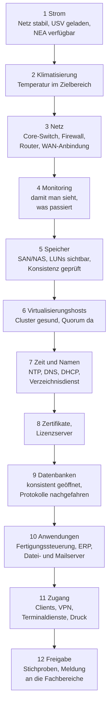

# Backup & Recovery

<span class='badge badge-pruefung'>Prüfungsrelevant</span> &nbsp; Sichern kann jeder. Der Betrieb hängt aber nicht am Sichern, sondern am **Zurückholen** – vollständig, in der richtigen Reihenfolge und innerhalb einer Zeit, die vorher jemand zugesagt hat.

Es gibt eine Frage, an der sich in jedem Betrieb entscheidet, ob eine Datensicherung mehr ist als ein grünes Häkchen: **Wann hat zuletzt jemand etwas zurückgespielt?** Nicht „läuft der Job", nicht „ist die Platte voll", sondern: Wann hat zuletzt eine Person ein System aus der Sicherung wieder zum Laufen gebracht und die Uhr dabei mitlaufen lassen? Wo diese Frage mit „im letzten Quartal, das hat sechs Stunden gedauert" beantwortet wird, gibt es eine Datensicherung. Wo sie mit „das läuft doch" beantwortet wird, gibt es eine Vermutung.

!!! abstract "Was du auf dieser Seite lernst"
    - warum **RAID, Replikation und Snapshot** wichtige Werkzeuge sind – aber kein Backup
    - wie sich **Voll-, differenzielle und inkrementelle Sicherung** in Sicherungsdauer, Speicherbedarf und Rückspieldauer unterscheiden
    - was die **3-2-1-Regel** und ihre Erweiterungen leisten und warum eine **unveränderliche oder offline gehaltene Kopie** heute dazugehört
    - wie du **Generationen und Aufbewahrungsfristen** festlegst und warum Backup und Archiv zwei verschiedene Dinge sind
    - wie du das **Backupfenster** rechnest und was passiert, wenn es nicht mehr in die Nacht passt
    - wie du **RTO und RPO** aus Geschäftsanforderungen ableitest – und warum die RTO viel mehr enthält als das Zurückspielen
    - wie eine **Recoverystrategie** aussieht: Reihenfolge, Teilwiederherstellung, Restore-Test und ein **Wiederanlaufplan**, der beim Strom anfängt

---

## Wogegen ein Backup schützt – und wogegen nicht

Speichersysteme sind heute sehr gut darin, Hardwaredefekte wegzustecken. Genau das erzeugt die verbreitetste Fehlannahme im Betrieb: dass diese Fähigkeit eine Datensicherung ersetzt.

| Werkzeug | Schützt gegen | Schützt **nicht** gegen |
|---|---|---|
| **RAID** | Ausfall einzelner Datenträger | versehentliches Löschen, Verschlüsselung, Softwarefehler, Controllerdefekt, Brand, Diebstahl |
| **Replikation / Spiegelung** | Ausfall eines Geräts oder Standorts | alles, was **fehlerhaft geschrieben** wird – es wird sofort mitrepliziert |
| **Snapshot** | kurzfristige Fehlbedienung, missratenes Update | Ausfall des Speichersystems, Verschlüsselung samt Snapshots, Löschung der Snapshots |
| **Backup** | alles davon – wenn es zeitversetzt, getrennt und getestet ist | Fehler, die schon vor der ältesten Sicherung passiert sind |

Der gemeinsame Nenner der ersten drei Zeilen: Sie halten **eine Wirklichkeit synchron**. Ein Backup dagegen hält **einen früheren Zustand fest**. Genau darin liegt der Unterschied, und er lässt sich in einem Satz zusammenfassen:

!!! danger "RAID ist kein Backup – und Replikation auch nicht"
    RAID schützt gegen genau ein Szenario: den Defekt eines Datenträgers. Gegen alles andere ist es machtlos, und schlimmer noch – es repliziert das Unglück zuverlässig mit. Wer eine Datei löscht, löscht sie auf allen Platten gleichzeitig. Wer eine Datenbank falsch aktualisiert, tut es auf allen Platten. Wer verschlüsselt wird, wird auf allen Platten verschlüsselt.

    Für Replikation gilt dasselbe, nur schneller und über größere Entfernung: Eine synchrone Spiegelung überträgt einen Verschlüsselungsvorgang in dem Moment, in dem er stattfindet, an den zweiten Standort. Ein Backup ist eine **zeitversetzte, unabhängige Kopie an einem anderen Ort** – und keine dieser drei Eigenschaften erfüllen RAID und Replikation. Die Details zum RAID selbst stehen unter [Speicherlösungen](../infrastruktur-planung/speicherloesungen.md).

Drei Eigenschaften machen aus einer Kopie eine Sicherung:

1. **Zeitversetzt** – es gibt ältere Stände, auf die man zurückkann. Ein Fehler von heute ist im Stand von gestern nicht enthalten.
2. **Unabhängig** – die Kopie überlebt den Verlust des Originals, seines Speichersystems, seines Raums und der Zugangsdaten, mit denen das Original verwaltet wird.
3. **Wiederherstellbar** – jemand hat das Zurückspielen getestet und weiß, wie lange es dauert.

---

## Die drei Sicherungsarten

Jede Sicherungsstrategie besteht aus einer **Vollsicherung** und dem, was zwischen zwei Vollsicherungen passiert.

| | **Vollsicherung** | **Differenzielle Sicherung** | **Inkrementelle Sicherung** |
|---|---|---|---|
| Was wird gesichert | alle ausgewählten Daten | alles, was sich seit der **letzten Vollsicherung** geändert hat | alles, was sich seit der **letzten Sicherung jeder Art** geändert hat |
| Sicherungsdauer | am längsten | wächst mit jedem Tag nach der Vollsicherung | am kürzesten, gleichbleibend |
| Speicherbedarf | am höchsten | mittel, wachsend | am niedrigsten |
| Für den Restore nötig | 1 Satz | 2 Sätze: Voll + letzte differenzielle | alle Sätze: Voll + **jedes** Inkrement seit dann |
| Rückspieldauer | am kürzesten | kurz | am längsten, mit jedem Inkrement mehr |
| Archivbit (klassische Windows-Sicherung) | wird zurückgesetzt | bleibt gesetzt | wird zurückgesetzt |

Das **Archivbit** erklärt den Unterschied am kürzesten: Eine geänderte Datei bekommt ein Merkmal „geändert". Die inkrementelle Sicherung nimmt alle so markierten Dateien mit und **löscht** das Merkmal – der nächste Lauf sieht nur noch das, was seither dazugekommen ist. Die differenzielle Sicherung nimmt dieselben Dateien mit, **lässt das Merkmal aber stehen** – deshalb sammelt sie mit jedem Tag mehr an. Eine **Kopiersicherung** ignoriert das Merkmal in beide Richtungen; sie ist dafür da, eine Sonderkopie zu ziehen, ohne den laufenden Rhythmus durcheinanderzubringen.

### Nachgerechnet: eine Woche, drei Strategien

Ein Datenbestand von **2 TB**, davon ändern sich täglich rund **2 %**, also 40 GB. Vollsicherung am Sonntag, danach Montag bis Samstag ein Lauf pro Tag.

```text
A) Jeden Tag eine Vollsicherung
   7 Laeufe x 2.000 GB                                    = 14.000 GB je Woche

B) Voll am Sonntag + differenziell Mo bis Sa
   Sonntag  2.000 GB
   Mo 40 | Di 80 | Mi 120 | Do 160 | Fr 200 | Sa 240 GB   =    840 GB
   Summe                                                  =  2.840 GB je Woche

C) Voll am Sonntag + inkrementell Mo bis Sa
   Sonntag  2.000 GB
   6 Laeufe x 40 GB                                       =    240 GB
   Summe                                                  =  2.240 GB je Woche
```

Und jetzt der Ernstfall: Am Samstagabend fällt der Server aus. Was muss zurückgespielt werden?

```text
A) Vollsicherung  ->  1 Satz  (Samstag)                   =  2.000 GB, 1 Vorgang
B) Differenziell  ->  2 Saetze (Sonntag + Samstag)        =  2.240 GB, 2 Vorgaenge
C) Inkrementell   ->  7 Saetze (Sonntag + Mo bis Sa)      =  2.240 GB, 7 Vorgaenge
```

Die Datenmenge ist bei B und C fast gleich – die **Anzahl der Vorgänge** ist es nicht. Sieben nacheinander einzuspielende Sätze bedeuten sieben Bandwechsel oder sieben Einbindungen, sieben Gelegenheiten für einen Fehler und sieben Sätze, von denen **jeder einzelne lesbar sein muss**. Fehlt das Inkrement von Mittwoch, endet die Wiederherstellung am Dienstag.

!!! tip "Die Merkregel"
    **Inkrementell spart beim Sichern, differenziell spart beim Zurückholen.** Wer nachts wenig Zeit hat, nimmt inkrementell. Wer eine kurze RTO einhalten muss, nimmt differenziell – oder inkrementell mit **synthetischer Vollsicherung**: Dabei baut das Backupsystem im Hintergrund aus der alten Vollsicherung und den Inkrementen einen neuen vollständigen Stand zusammen, ohne die Produktivsysteme noch einmal zu lesen. Man bekommt kurze Sicherungsläufe **und** einen Ein-Satz-Restore. Die Rechenzeit dafür fällt auf dem Backupsystem an, nicht im Betrieb.

Moderne Backupsysteme arbeiten meist auf Blockebene mit **Changed Block Tracking**: Nicht die geänderte Datei wird gesichert, sondern nur die geänderten Blöcke darin. Bei einer 500-GB-Datenbankdatei, in der sich täglich 2 GB ändern, ist das der Unterschied zwischen zwei Gigabyte und einem halben Terabyte pro Lauf.

---

## 3-2-1 und was heute dazugekommen ist

Die bekannteste Faustregel der Datensicherung:

> **3** Kopien der Daten, auf **2** verschiedenen Medien oder Systemen, davon **1** außer Haus.

Jede Ziffer wehrt eine eigene Klasse von Unglück ab. Die drei Kopien fangen ab, dass eine Kopie beschädigt oder unlesbar ist. Die zwei Medien fangen ab, dass ein ganzer Systemtyp versagt – ein Controllerfehler, eine fehlerhafte Firmware, ein Verschlüsselungstrojaner, der genau diese Art von Freigabe findet. Und die Kopie außer Haus fängt ab, was das Gebäude trifft: Feuer, Wasser, Einbruch, Sperrung.

Weil Angriffe auf Sicherungen zum Standardvorgehen geworden sind, hat sich die Regel erweitert:

| Erweiterung | Bedeutung | Wogegen |
|---|---|---|
| **3-2-1-1-0** | zusätzlich **1** Kopie **offline oder unveränderlich** und **0** Fehler im letzten Wiederherstellungstest | gegen Ransomware, die auch die Sicherungen löscht – und gegen die Sicherung, die niemand geprüft hat |
| **4-3-2** | 4 Kopien, an 3 Orten, 2 davon außer Haus | für Betriebe mit sehr geringer tolerierbarer Ausfallzeit oder mehreren Standorten |

!!! danger "Der erste Angriffsschritt gilt heute den Sicherungen"
    Ein durchdachter Ransomware-Angriff verschlüsselt nicht sofort. Erst werden Zugangsdaten gesammelt, dann wird das Backupsystem gesucht, dessen Aufbewahrungsregeln werden verkürzt oder die Sicherungen gelöscht – **und erst danach** wird verschlüsselt. Wer dann feststellt, dass die Sicherung auf einer Netzwerkfreigabe lag, die mit denselben Administratorrechten erreichbar war wie alles andere, hat keine Sicherung mehr, sondern eine zweite verschlüsselte Kopie.

    Drei Eigenschaften machen den Unterschied:

    - **Unveränderlichkeit (Immutability):** Die Sicherung kann für eine festgelegte Frist von niemandem geändert oder gelöscht werden – auch nicht vom Administrator, auch nicht vom Hersteller-Support. Technisch über Objektsperren im Objektspeicher, WORM-Bänder oder ein besonders gehärtetes Repository.
    - **Trennung (Air Gap):** Das Medium ist zeitweise **physisch** nicht erreichbar – ein Band im Schrank, eine Wechselplatte im Schließfach, ein Speicherziel, das nur während des Sicherungslaufs eingebunden ist.
    - **Eigene Anmeldung:** Der Backupserver gehört **nicht** in die Domäne, die er sichert, und seine Konten sind keine Domänenadministratoren. Sonst öffnet ein einziger kompromittierter Zugang beides.

    Und eine Aufbewahrungsfrage, die oft übersehen wird: Die Aufbewahrungsdauer muss **länger sein als die Zeit, die ein Angreifer unbemerkt im Netz war**. Wer nur vierzehn Tage aufhebt und feststellt, dass die Hintertür seit fünf Wochen offen stand, hat keinen sauberen Stand mehr.

---

## Snapshots sind keine Sicherungen

Ein **Snapshot** ist ein eingefrorener Blick auf einen Datenbestand zu einem Zeitpunkt. Er wird in Sekunden erzeugt, weil dabei nichts kopiert wird: Das Speichersystem merkt sich nur, welche Blöcke zum Zeitpunkt X gültig waren, und schreibt Änderungen daneben.

| | **Snapshot** | **Backup** |
|---|---|---|
| Erzeugungsdauer | Sekunden | Minuten bis Stunden |
| Speicherort | derselbe Speicher wie das Original | eigenes Medium, eigener Ort |
| Belegt anfangs | fast nichts, wächst mit den Änderungen | die volle Datenmenge |
| Überlebt Ausfall des Speichersystems | **nein** | ja |
| Überlebt Löschung durch einen Angreifer mit Adminrechten | in der Regel **nein** | bei unveränderlicher Ablage: ja |
| Typischer Einsatz | Rückfall vor einem Update, kurzfristiger Zwischenstand | Wiederherstellung nach Verlust, Aufbewahrung über Monate |

Snapshots sind trotzdem wertvoll – nur an einer anderen Stelle: Sie machen ein Update rückgängig, bevor es Schaden anrichtet, und sie liefern dem Backupsystem einen **konsistenten Stand** zum Lesen, während die Anwendung weiterläuft.

Damit hängt der zweite wichtige Begriff zusammen. Eine Sicherung ist **absturzkonsistent** (crash-consistent), wenn sie den Zustand festhält, den ein Stromausfall hinterlassen hätte – meist reparabel, aber nicht garantiert. Sie ist **anwendungskonsistent** (application-consistent), wenn die Anwendung vor dem Snapshot ihre Puffer schreibt und kurz stillhält. Bei Datenbanken und Verzeichnisdiensten ist das kein Komfortmerkmal, sondern die Bedingung dafür, dass sich die Sicherung überhaupt sauber zurückspielen lässt.

---

## Generationen, Aufbewahrung – und der Unterschied zum Archiv

Ein einzelner Sicherungsstand nützt wenig, wenn der Fehler vor drei Wochen passiert ist. Deshalb hält man **Generationen** vor. Das klassische **Großvater-Vater-Sohn-Prinzip** staffelt sie:

| Generation | Rhythmus | Typische Anzahl (Richtwert) | Antwortet auf die Frage |
|---|---|---|---|
| **Sohn** | täglich | 14 Stände | „Gestern war die Datei noch da." |
| **Vater** | wöchentlich | 8 Stände | „Vor zwei Wochen war die Datenbank noch in Ordnung." |
| **Großvater** | monatlich | 12 Stände | „Wie sah der Bestand zum Monatsabschluss aus?" |
| **Jahresstand** | jährlich | nach Vorgabe | „Was war zum Stichtag im Bestand?" |

Die Zahlen sind Richtwerte, keine Vorschriften – sie folgen aus zwei Fragen: Wie weit muss man zurückkönnen, um einen schleichenden Fehler zu erwischen? Und wie lange muss der Bestand aus rechtlichen Gründen vorhanden bleiben?

!!! warning "Aufbewahrungsfristen: eine Sache für die Buchhaltung, nicht fürs Bauchgefühl"
    Handels- und steuerrechtliche Aufbewahrungsfristen liegen in Deutschland typischerweise bei **zehn Jahren** für Handelsbücher, Inventare und Jahresabschlüsse und bei **sechs Jahren** für Handels- und Geschäftsbriefe. Für einzelne Belegarten sind die Fristen gesetzgeberisch in Bewegung – hol dir die geltende Vorgabe von der Buchhaltung oder der Steuerberatung, statt sie aus dem Kopf zu setzen. Das hier ist eine fachliche Einordnung, keine Rechtsberatung.

    Gleichzeitig zieht der Datenschutz in die andere Richtung: Personenbezogene Daten dürfen **nicht länger** aufbewahrt werden, als es der Zweck erfordert. Beide Anforderungen gelten nebeneinander, und die Lösung ist ein **Löschkonzept**, das je Datenart eine Frist festlegt – nicht eine pauschale Aufbewahrungsregel für alles. Siehe [Datenschutz & DSGVO](../recht-organisation/datenschutz-dsgvo.md).

Daraus folgt eine Unterscheidung, die in Prüfungen gern abgefragt wird:

| | **Backup** | **Archiv** |
|---|---|---|
| Zweck | Wiederherstellung nach Verlust | Nachweis und langfristige Aufbewahrung |
| Bezug | ein **Zustand** des ganzen Systems | einzelne **Dokumente oder Datensätze** |
| Aufbewahrung | Wochen bis Monate, rollierend | Jahre bis Jahrzehnte, unveränderbar |
| Original | bleibt im Produktivsystem | wird dort oft entfernt |
| Zugriff | über die Wiederherstellung | über eine Recherche |

Ein Archiv aus Sicherungsbändern zu bauen funktioniert nicht: Man findet nichts wieder, und in zehn Jahren gibt es weder das Laufwerk noch die Software, die das Format liest.

---

## Das Backupfenster

Das **Backupfenster** ist die Zeit, in der gesichert werden darf, ohne den Betrieb spürbar zu stören. Ob es reicht, ist eine Rechnung:

```text
Dauer  =  Datenmenge  /  effektiver Durchsatz

2 TB ueber 1 Gbit/s (effektiv rund 100 MB/s)
  2.000.000 MB / 100 MB/s  =  20.000 s  =  5 h 33 min

2 TB ueber 10 Gbit/s (effektiv rund 700 MB/s)
  2.000.000 MB / 700 MB/s  =   2.857 s  =  rund 48 min

Taegliches Inkrement 40 GB ueber 1 Gbit/s
     40.000 MB / 100 MB/s  =     400 s  =  rund 7 min
```

Die Zahlen zeigen, warum Vollsicherungen fast immer aufs Wochenende wandern und werktags nur Inkremente laufen. Sie zeigen auch, wo die Grenze liegt: Ein Bestand, der schneller wächst, als die Leitung schneller wird, sprengt irgendwann jedes Fenster.

Was tun, wenn das Fenster nicht mehr passt oder es gar keines gibt, weil rund um die Uhr produziert wird?

- **Snapshotbasiert sichern:** Der Snapshot wird in Sekunden gezogen, gelesen wird danach in Ruhe vom eingefrorenen Stand. Der Betrieb merkt fast nichts.
- **Nur geänderte Blöcke übertragen** (Changed Block Tracking) statt ganzer Dateien.
- **Durchsatz begrenzen** (Throttling) – lieber langsamer sichern, als die Produktion auszubremsen.
- **Vollsicherungen synthetisch erzeugen**, damit die Produktivsysteme nie vollständig gelesen werden müssen.
- **Deduplizierung und Kompression** – sie senken die zu übertragende und zu speichernde Menge erheblich.

!!! note "Deduplizierung und Verschlüsselung vertragen sich nur in einer Reihenfolge"
    Deduplizierung erkennt gleiche Blöcke und speichert sie einmal. Verschlüsselte Blöcke sehen aber auch bei identischem Inhalt verschieden aus. Deshalb muss **erst dedupliziert und dann verschlüsselt** werden – andersherum verliert man den gesamten Einspareffekt. Bei Cloud-Zielen bedeutet das: Die Verschlüsselung gehört auf die Seite des Backupsystems, nicht in eine Zwischenschicht davor.

---

## Verschlüsselung, Rechte und Rollen

Eine Sicherung enthält alles, was das Produktivsystem enthält – aber ohne dessen Zugriffsschutz. Wer ein Band findet, hat den Datenbestand. Deshalb gehören drei Dinge zusammen.

**Verschlüsselung.** Sicherungen werden auf dem Transportweg und im Ruhezustand verschlüsselt. Bei Medien, die das Haus verlassen, ist das keine Empfehlung – ein verlorenes unverschlüsseltes Band mit Personaldaten ist eine meldepflichtige Datenschutzverletzung.

!!! danger "Der Schlüssel darf nicht in dem liegen, was du retten willst"
    Der häufigste und bitterste Fehler bei verschlüsselten Sicherungen: Der Schlüssel oder das Kennwort liegt im Passwortsafe – und der Passwortsafe liegt auf dem Server, der gerade verschlüsselt wurde. Der Schlüssel gehört an **mindestens zwei Orte außerhalb** der gesicherten Umgebung, einer davon offline: ausgedruckt im Tresor, in einem zweiten Passwortsafe an einem anderen Standort, beim Notar oder in der Hand von zwei Personen mit geteiltem Geheimnis. Diese Kopie gehört in den Wiederanlaufplan – als erster Schritt, nicht als Fußnote.

**Rechte und Rollen.** Sichern, Wiederherstellen und das Löschen von Sicherungen sind drei verschiedene Berechtigungen und gehören getrennt.

| Rolle | Darf | Darf nicht |
|---|---|---|
| **Backup-Operator** | Sicherungsläufe starten, überwachen, Fehler melden | Sicherungen löschen, Aufbewahrungsregeln ändern |
| **Restore-Berechtigter** | Wiederherstellungen anstoßen – protokolliert und begründet | Sicherungsjobs oder Regeln verändern |
| **Backup-Administrator** | Regeln und Ziele konfigurieren | im Alleingang Aufbewahrungsfristen verkürzen (Vier-Augen-Prinzip) |
| **Fachbereich** | eine Wiederherstellung **beantragen** | selbst wiederherstellen |

Dazu kommen: **Mehrfaktor-Anmeldung** an der Backupkonsole, eigene Konten ohne Verbindung zur Produktivdomäne, und die **Protokollierung jeder Wiederherstellung**. Der letzte Punkt ist ein Datenschutzthema, kein Formalismus: Eine Wiederherstellung ist ein Zugriff auf personenbezogene Daten. Wer die Postfachsicherung einer Kollegin zurückholt, weil „die Geschäftsführung das braucht", greift auf ihre Kommunikation zu – dafür braucht es eine dokumentierte Grundlage und in der Regel die Einbindung von Datenschutzbeauftragtem und Mitbestimmung. Mehr dazu unter [Datensicherheitskonzepte](../recht-organisation/datensicherheitskonzepte.md).

!!! note "Löschbegehren und Sicherungen"
    Wird ein personenbezogener Datensatz gelöscht, steckt er weiterhin in allen Sicherungen, die ihn enthalten haben – dort punktuell zu löschen ist technisch praktisch unmöglich und würde die Integrität der Sicherung zerstören. Gängige Praxis ist ein **dokumentiertes Verfahren**: Die Löschung erfolgt im Produktivsystem, aus den Sicherungen fällt der Datensatz mit dem Ablauf der jeweiligen Generation heraus, und im Fall einer Wiederherstellung wird die Löschung erneut ausgeführt. Wichtig ist, dass dieses Verfahren aufgeschrieben ist – und dass die Aufbewahrungsfristen kurz genug sind, damit „mit Ablauf der Generation" nicht „in zehn Jahren" bedeutet.

---

## RTO und RPO: die beiden Zahlen, aus denen alles folgt

Jede Sicherungsstrategie beantwortet zwei Fragen, und beide kommen nicht aus der IT, sondern aus dem Geschäft.

- Die **RPO** (Recovery Point Objective) ist der **maximal tolerierbare Datenverlust**, gemessen als Zeitspanne **zurück** vom Störungszeitpunkt. Sie beantwortet: *Wie viel Arbeit dürfen wir verlieren?*
- Die **RTO** (Recovery Time Objective) ist die **Zielzeit bis zum wiederhergestellten Betrieb**, gemessen **vorwärts** ab dem Störungszeitpunkt. Sie beantwortet: *Wie lange dürfen wir stillstehen?*

<figure>
<svg viewBox="0 0 740 372" width="100%" height="372" role="img" aria-label="Ein Zeitstrahl. Links liegen drei regelmäßige Sicherungspunkte, der letzte davon ist die letzte erfolgreiche Sicherung. In der Mitte liegt der Störungszeitpunkt als Nullpunkt. Rechts davon folgen fünf Phasen der Wiederherstellung: Erkennen, Entscheiden, Bereitstellen und Zurückspielen, Prüfen und Freigeben. Am Ende der fünften Phase läuft der Betrieb wieder. Die Spanne von der letzten Sicherung bis zur Störung ist die RPO, also der tolerierbare Datenverlust. Die Spanne von der Störung bis zur Freigabe ist die RTO, also die Zielzeit für den Wiederanlauf; sie umfasst alle fünf Phasen und nicht nur das Zurückspielen. Weiter rechts markiert eine gestrichelte Linie die maximal tolerierbare Ausfallzeit, die deutlich hinter der RTO liegt.">
  <rect x="270" y="188" width="90" height="26" fill="rgba(224,179,92,0.14)"/>
  <line x1="40" y1="201" x2="712" y2="201" stroke="#8fa498" stroke-width="2"/>
  <polygon points="724,201 708,195 708,207" fill="#8fa498"/>
  <text x="700" y="188" text-anchor="middle" fill="#8fa498" font-family="system-ui, sans-serif" font-size="11">Zeit</text>
  <line x1="90" y1="192" x2="90" y2="210" stroke="#56c374" stroke-width="2" opacity="0.5"/>
  <line x1="150" y1="192" x2="150" y2="210" stroke="#56c374" stroke-width="2" opacity="0.5"/>
  <line x1="210" y1="192" x2="210" y2="210" stroke="#56c374" stroke-width="2" opacity="0.5"/>
  <text x="140" y="240" text-anchor="middle" fill="#8fa498" font-family="system-ui, sans-serif" font-size="11">Sicherungen im festen Takt</text>
  <line x1="270" y1="170" x2="270" y2="232" stroke="#56c374" stroke-width="3"/>
  <text x="252" y="252" text-anchor="middle" fill="#e2ece6" font-family="system-ui, sans-serif" font-size="12">letzte erfolgreiche</text>
  <text x="252" y="268" text-anchor="middle" fill="#e2ece6" font-family="system-ui, sans-serif" font-size="12">Sicherung</text>
  <line x1="360" y1="160" x2="360" y2="242" stroke="#e06c6c" stroke-width="4"/>
  <text x="378" y="252" text-anchor="middle" fill="#e06c6c" font-family="system-ui, sans-serif" font-size="13" font-weight="700">Störung</text>
  <text x="378" y="268" text-anchor="middle" fill="#8fa498" font-family="system-ui, sans-serif" font-size="11">Nullpunkt</text>
  <rect x="360" y="188" width="40" height="26" fill="rgba(224,179,92,0.30)" stroke="#e0b35c" stroke-width="1"/>
  <text x="380" y="206" text-anchor="middle" fill="#e2ece6" font-family="system-ui, sans-serif" font-size="12" font-weight="700">1</text>
  <rect x="400" y="188" width="32" height="26" fill="rgba(224,179,92,0.18)" stroke="#e0b35c" stroke-width="1"/>
  <text x="416" y="206" text-anchor="middle" fill="#e2ece6" font-family="system-ui, sans-serif" font-size="12" font-weight="700">2</text>
  <rect x="432" y="188" width="132" height="26" fill="rgba(122,162,255,0.26)" stroke="#7aa2ff" stroke-width="1"/>
  <text x="498" y="206" text-anchor="middle" fill="#e2ece6" font-family="system-ui, sans-serif" font-size="12" font-weight="700">3</text>
  <rect x="564" y="188" width="36" height="26" fill="rgba(122,162,255,0.14)" stroke="#7aa2ff" stroke-width="1"/>
  <text x="582" y="206" text-anchor="middle" fill="#e2ece6" font-family="system-ui, sans-serif" font-size="12" font-weight="700">4</text>
  <rect x="600" y="188" width="26" height="26" fill="rgba(125,255,154,0.20)" stroke="#56c374" stroke-width="1"/>
  <text x="613" y="206" text-anchor="middle" fill="#e2ece6" font-family="system-ui, sans-serif" font-size="12" font-weight="700">5</text>
  <line x1="626" y1="170" x2="626" y2="232" stroke="#7dff9a" stroke-width="3"/>
  <text x="640" y="252" text-anchor="middle" fill="#e2ece6" font-family="system-ui, sans-serif" font-size="12">Betrieb läuft</text>
  <line x1="270" y1="140" x2="360" y2="140" stroke="#e0b35c" stroke-width="2"/>
  <line x1="270" y1="134" x2="270" y2="146" stroke="#e0b35c" stroke-width="2"/>
  <line x1="360" y1="134" x2="360" y2="146" stroke="#e0b35c" stroke-width="2"/>
  <text x="315" y="112" text-anchor="middle" fill="#e0b35c" font-family="system-ui, sans-serif" font-size="17" font-weight="700">RPO</text>
  <text x="315" y="128" text-anchor="middle" fill="#8fa498" font-family="system-ui, sans-serif" font-size="11">tolerierbarer Datenverlust</text>
  <line x1="360" y1="140" x2="626" y2="140" stroke="#7aa2ff" stroke-width="2"/>
  <line x1="626" y1="134" x2="626" y2="146" stroke="#7aa2ff" stroke-width="2"/>
  <text x="493" y="112" text-anchor="middle" fill="#7aa2ff" font-family="system-ui, sans-serif" font-size="17" font-weight="700">RTO</text>
  <text x="493" y="128" text-anchor="middle" fill="#8fa498" font-family="system-ui, sans-serif" font-size="11">alle fünf Phasen, nicht nur das Zurückspielen</text>
  <line x1="694" y1="201" x2="694" y2="306" stroke="#e06c6c" stroke-width="2" stroke-dasharray="5 4"/>
  <line x1="360" y1="300" x2="694" y2="300" stroke="#e06c6c" stroke-width="2"/>
  <line x1="360" y1="294" x2="360" y2="306" stroke="#e06c6c" stroke-width="2"/>
  <line x1="694" y1="294" x2="694" y2="306" stroke="#e06c6c" stroke-width="2"/>
  <text x="527" y="322" text-anchor="middle" fill="#e06c6c" font-family="system-ui, sans-serif" font-size="12">MTA – ab hier ist der Stillstand nicht mehr tragbar</text>
  <text x="370" y="352" text-anchor="middle" fill="#8fa498" font-family="system-ui, sans-serif" font-size="12">1 Erkennen und Melden · 2 Entscheiden und Eskalieren · 3 Bereitstellen und Zurückspielen · 4 Prüfen · 5 Freigeben</text>
</svg>
<figcaption>Der Störungszeitpunkt ist der Nullpunkt: Die RPO misst nach hinten und bestimmt den Sicherungsabstand, die RTO misst nach vorn und umfasst den gesamten Weg zurück in den Betrieb.</figcaption>
</figure>

### Was die RPO festlegt

Die RPO bestimmt den **Sicherungsabstand**. Der Zusammenhang ist direkt: Der Abstand zwischen zwei Sicherungen darf die RPO nicht überschreiten.

| RPO | Was technisch nötig ist |
|---|---|
| **24 Stunden** | ein nächtlicher Lauf reicht |
| **4 Stunden** | mehrere Läufe am Tag, meist snapshotbasiert |
| **1 Stunde** | Transaktionsprotokolle der Datenbank im Stundentakt zusätzlich zur Sicherung |
| **15 Minuten** | Protokollsicherung im Viertelstundentakt oder asynchrone Replikation |
| **0** | synchrone Replikation – und damit die Latenzkosten aus [Hochverfügbarkeit](hochverfuegbarkeit.md) |

!!! warning "Die tatsächliche RPO ist der Abstand zur letzten **erfolgreichen** Sicherung"
    Wer im Vierstundentakt sichert, hat eine RPO von vier Stunden – solange jeder Lauf durchläuft. Schlägt der Mittagslauf fehl und merkt es niemand, sind es acht. Schlägt er drei Tage lang fehl, sind es drei Tage. Deshalb gehört zu jeder RPO-Zusage eine **Überwachung der Sicherungsläufe mit Alarm**, nicht nur ein Protokoll, das montags jemand durchsieht. Ein fehlgeschlagener Sicherungslauf ist eine Störung mit Ticket, kein Eintrag in einer Liste.

### Was die RTO wirklich enthält

Die häufigste Fehlplanung bei der RTO: Man rechnet die Zeit zum Zurückspielen und hält das für die RTO. Tatsächlich enthält sie den ganzen Weg. Ein Beispiel für einen Dateiserver mit **4 TB** und einer zugesagten RTO von **8 Stunden**:

```text
1  Erkennen und Melden (nachts, ueber Monitoring und Rufbereitschaft)   0,5 h
2  Entscheiden und Eskalieren, Wiederherstellungsziel festlegen         0,5 h
3  Ersatzumgebung bereitstellen                                         1,0 h
3  Zurueckspielen 4 TB bei 200 MB/s
     4.000.000 MB / 200 MB/s = 20.000 s                                 5,55 h
4  Pruefen: Dienste starten, Stichproben, Integritaet                    0,5 h
5  Freigabe an den Fachbereich, Nutzer informieren                      0,25 h
                                                                       ------
   Summe                                                                8,30 h
```

Die RTO von acht Stunden wird **verfehlt** – und zwar nicht, weil irgendetwas schiefging, sondern im geplanten Ablauf. Das Zurückspielen allein frisst zwei Drittel. Drei Wege führen aus dieser Lage:

1. **Den Restore beschleunigen:** schnelleres Sicherungsziel, mehrere parallele Ströme, Sicherung im selben Netzsegment statt über die WAN-Strecke.
2. **Den Restore vermeiden:** **Instant Recovery** – die virtuelle Maschine startet direkt vom Backupspeicher und wird im laufenden Betrieb zurückverlagert. Der Dienst ist in Minuten wieder da, die Datenverlagerung läuft danach im Hintergrund. Oder gleich eine Replikation statt einer Wiederherstellung, siehe [Hochverfügbarkeit & Redundanz](hochverfuegbarkeit.md).
3. **Die RTO korrigieren:** Wenn weder das eine noch das andere bezahlbar ist, ist die zugesagte Zahl falsch und gehört mit dem Fachbereich neu verhandelt. Eine RTO, von der man rechnerisch weiß, dass sie nicht hält, ist schlimmer als eine ehrliche längere.

!!! tip "RTA und RPA: die gemessenen Geschwister"
    RTO und RPO sind **Ziele**. Was ein Test oder ein echter Vorfall ergibt, heißt **RTA** (Recovery Time Actual) und **RPA** (Recovery Point Actual). Genau diese beiden Zahlen sind der Ertrag jedes Restore-Tests – sie zeigen, ob die Zusage trägt. Ein Bericht, in dem RTA über RTO liegt, ist keine schlechte Nachricht, sondern der Grund, warum man testet.

### Wie man beides aus Geschäftsanforderungen ableitet

Der Weg führt immer über den Geschäftsprozess, nie über das System:


Zwei Prüffragen halten das Ergebnis ehrlich. **Erstens:** Die RTO muss spürbar unter der MTA liegen – sonst ist sie keine Zielzeit, sondern eine Wette darauf, dass alles glattgeht. **Zweitens:** Die Frage an den Fachbereich lautet nie „Wie lange dürfen wir ausfallen?" (Antwort: „gar nicht"), sondern immer zweistufig:

> *Was tun Sie in der ersten Stunde ohne dieses System? Und was in der vierten? Ab wann können Sie gar nicht mehr arbeiten, und was kostet das dann?*

Auf die erste Frage kommt fast immer eine brauchbare Antwort – Papierlisten, Telefon, Nacherfassung. Genau diese Antwort ist die MTA. Und wer sagt, ohne die Zeiterfassung könne man drei Tage von Hand weiterarbeiten, hat gerade begründet, warum sie keine Heißreserve braucht.

| System | RPO | RTO | Begründung aus dem Geschäft |
|---|---|---|---|
| **Fertigungssteuerung** | 15 min | 4 h | Aufträge der laufenden Schicht dürfen nicht verloren gehen, Stillstand kostet je Stunde |
| **ERP / Warenwirtschaft** | 1 h | 8 h | Versand und Rechnungsstellung lassen sich einen halben Tag mit Listen überbrücken |
| **Verzeichnisdienst, DNS, DHCP** | 24 h | 2 h | Daten ändern sich selten, aber ohne den Dienst meldet sich niemand an |
| **Dateiserver Konstruktion** | 4 h | 8 h | Konstruktion arbeitet lokal weiter, Rückstände sind nacharbeitbar |
| **E-Mail** | 1 h | 8 h | Kommunikation läuft übergangsweise über Telefon und Mobilgeräte |
| **Zeiterfassung** | 24 h | 72 h | Nacherfassung von Hand ist möglich und üblich |

Auffällig an der Tabelle ist die dritte Zeile: kurze RTO, lange RPO. Genau diese Kombination wird oft übersehen. Ein Verzeichnisdienst wird nicht durch schnelles Zurückspielen abgesichert, sondern durch einen **zweiten Domänencontroller** – die Wiederherstellung ist der Notnagel, nicht der Plan.

---

## Recoverystrategie: der Weg zurück

Eine Sicherungsstrategie ohne Wiederherstellungsstrategie ist eine halbe Antwort. Zur zweiten Hälfte gehören vier Festlegungen.

**Erstens: die Wiederherstellungsart.** Nicht jeder Vorfall braucht dasselbe.

| Art | Was zurückkommt | Typischer Anlass |
|---|---|---|
| **Einzelwiederherstellung** | eine Datei, ein Postfach, ein Datensatz | versehentliches Löschen – der häufigste Fall überhaupt |
| **Punktgenaue Wiederherstellung** | ein Datenbankstand zu einem Zeitpunkt | fehlerhafte Massenänderung, „vor dem Import von 14 Uhr" |
| **Systemwiederherstellung** | eine ganze VM oder ein ganzer Server | Defekt, Verschlüsselung, missratenes Update |
| **Bare-Metal-Restore** | System auf abweichende Hardware | Hardware nicht mehr beschaffbar, Ausweichgerät |
| **Instant Recovery** | Dienst startet direkt vom Backupspeicher | kurze RTO bei großen Datenmengen |

Wer nur die Systemwiederherstellung übt, steht beim häufigsten Fall – „ich habe den Ordner gelöscht" – ratlos da. Und wer nur Einzeldateien wiederherstellen kann, stellt im Ernstfall fest, dass das Verfahren für ganze Systeme nie beschrieben wurde.

**Zweitens: der Minimalbetrieb.** Nicht alles muss gleichzeitig zurückkommen. Definiere vorher, welche Funktionen den **Notbetrieb** ausmachen – oft sind es zwei oder drei von zwanzig. Sie kommen zuerst, der Rest folgt geordnet. Eine Teilwiederherstellung, die den Auftragseingang nach zwei Stunden wieder ermöglicht, ist mehr wert als eine vollständige nach zwei Tagen.

**Drittens: die Reihenfolge.** Dazu gleich der eigene Abschnitt.

**Viertens: der Test.**

!!! danger "Ein ungetestetes Backup ist kein Backup, sondern eine Vermutung"
    Die Liste dessen, was zwischen einem grünen Häkchen und einer erfolgreichen Wiederherstellung schiefgehen kann, ist lang und stammt aus echten Vorfällen: Die Sicherung lief seit Wochen ins Leere, weil ein Pfad umbenannt wurde. Die Datenbank wurde absturzkonsistent gesichert und lässt sich nicht öffnen. Das Bandlaufwerk liest, aber die Software zum Lesen des Formats gibt es nicht mehr. Der Entschlüsselungsschlüssel lag auf dem verschlüsselten Server. Eine Systemplatte war nie im Sicherungsumfang, weil sie nach der Einrichtung dazukam. Die Wiederherstellung braucht dreimal so lange wie die RTO. **Jeder dieser Fälle produziert monatelang grüne Häkchen.**

Ein tragfähiges Testkonzept arbeitet in drei Stufen:

| Stufe | Was geprüft wird | Aufwand | Richtwert für den Rhythmus |
|---|---|---|---|
| **Einzelwiederherstellung** | Lesbarkeit und Vollständigkeit einzelner Dateien aus verschiedenen Generationen | Minuten | monatlich |
| **Systemwiederherstellung** | eine vollständige VM in ein **isoliertes Netz**, Dienste starten, RTA messen | Stunden | quartalsweise, für kritische Systeme |
| **Wiederanlaufübung** | mehrere Systeme in der geplanten Reihenfolge, mit Rollen und Kommunikation | ein Tag | jährlich, gern als Tabletop-Übung |

Die Rhythmen sind Richtwerte und richten sich nach Kritikalität. Zwei Details entscheiden über den Wert des Tests: Er läuft in einem **isolierten Netz** – sonst meldet sich die wiederhergestellte Maschine mit derselben Identität wie das Original im Produktivnetz an –, und er wird **protokolliert**: was wiederhergestellt wurde, wie lange es gedauert hat (die RTA), was gefehlt hat, wer es getan hat. Dieses Protokoll ist zugleich der Nachweis gegenüber Auditoren und Versicherern.

---

## Der Wiederanlaufplan: die Reihenfolge ist die halbe Miete

Nach einem größeren Ausfall fährt man nicht alles gleichzeitig hoch. Systeme haben Abhängigkeiten, und wer sie missachtet, produziert eine Kette von Folgefehlern: Dienste, die ihre Datenbank nicht finden, sich zehnmal neu starten und dann in einen Fehlerzustand gehen; Server, die sich nicht anmelden können, weil der Verzeichnisdienst noch nicht da ist; Anwendungen, die mit falscher Uhrzeit starten und deren Anmeldungen deshalb abgelehnt werden.



Ein paar Stellen in dieser Kette sind stille Klassiker:

- **Zeit vor Anmeldung.** Kerberos-basierte Anmeldungen scheitern, wenn die Uhren der beteiligten Systeme zu weit auseinanderliegen; üblich ist eine Toleranz von fünf Minuten. Ein Server, dessen Uhr nach einem langen Stromausfall falsch steht, kann sich nicht anmelden – und der Fehler sieht nach allem Möglichen aus, nur nicht nach der Uhrzeit. **NTP gehört vor den Verzeichnisdienst.**
- **Namen vor Diensten.** Fast jede Anwendung sucht ihre Datenbank über einen Namen. Ohne DNS findet sie nichts und meldet einen Datenbankfehler.
- **Speicher vor Hosts.** Startet ein Virtualisierungshost, bevor sein Speicher bereit ist, findet er seine Maschinen nicht und markiert sie als verwaist.
- **Monitoring früh.** Es gehört nicht ans Ende, sondern direkt hinter das Netz – sonst fährt man den Wiederanlauf blind.
- **Herunterfahren in umgekehrter Reihenfolge.** Bei einem geplanten Ausfall gilt dieselbe Liste rückwärts: erst die Anwendungen, zuletzt Speicher, Netz und Strom.

Je Schritt gehören fünf Angaben in den Plan: **Voraussetzung** (was vorher fertig sein muss), **Handgriff** (was konkret zu tun ist), **Prüfkriterium** (woran man erkennt, dass es geklappt hat), **Verantwortlicher** (eine Person, keine Abteilung) und **geschätzte Dauer**. Erst mit dem Prüfkriterium wird aus einer Liste ein Plan – „Datenbank gestartet" ist keine Feststellung, „Testabfrage liefert einen Datensatz zurück" schon.

!!! danger "Der Plan darf nicht auf dem Server liegen, den er retten soll"
    Der Wiederanlaufplan, die Netzdokumentation, die Kontaktliste der Dienstleister, die Vertragsnummern und die Entschlüsselungsschlüssel liegen in vielen Betrieben im Wiki oder im Dateiserver – also genau dort, wo sie im Ernstfall nicht erreichbar sind. Es braucht eine **Offlinefassung**: ausgedruckt im Ordner am Serverschrank, dazu eine verschlüsselte Kopie auf einem Datenträger außer Haus. Und sie muss aktuell sein, sonst führt sie durch eine Umgebung, die es nicht mehr gibt. Wie das in einen größeren Notfallplan eingebettet wird, steht unter [Incident Response & Business Continuity](incident-und-bcm.md).

---

## Was du jetzt wissen solltest

- **RAID, Replikation und Snapshot sind keine Sicherungen.** Sie halten eine Wirklichkeit synchron; ein Backup hält einen früheren Zustand fest – zeitversetzt, unabhängig, wiederherstellbar getestet.
- **Voll, differenziell, inkrementell:** Inkrementell spart beim Sichern, differenziell spart beim Zurückholen. Inkrementell braucht **alle** Sätze seit der Vollsicherung – fehlt einer, endet die Wiederherstellung dort.
- **3-2-1** – drei Kopien, zwei Medien, eine außer Haus – und heute zusätzlich **eine unveränderliche oder offline gehaltene Kopie** sowie **null Fehler im letzten Restore-Test**.
- **Ransomware greift zuerst die Sicherungen an.** Unveränderlichkeit, physische Trennung, eigene Anmeldung ohne Domänenrechte und eine Aufbewahrungsdauer, die länger ist als die unentdeckte Verweilzeit eines Angreifers.
- **Generationen nach Großvater-Vater-Sohn**, Aufbewahrungsfristen mit der Buchhaltung abgestimmt – und **Backup ist nicht Archiv**.
- **Das Backupfenster ist eine Rechnung:** Datenmenge geteilt durch effektiven Durchsatz. Passt es nicht, helfen Snapshots, Blockverfolgung, synthetische Vollsicherungen und Deduplizierung.
- **Der Schlüssel zur verschlüsselten Sicherung gehört außerhalb der gesicherten Umgebung**, an mindestens zwei Orte, einer davon offline.
- **Sichern, Wiederherstellen und Löschen sind drei getrennte Berechtigungen.** Jede Wiederherstellung wird protokolliert – sie ist ein Zugriff auf Daten.
- **Die RPO bestimmt den Sicherungsabstand, die RTO die Wiederherstellungstechnik.** Die tatsächliche RPO ist der Abstand zur letzten **erfolgreichen** Sicherung.
- **Die RTO enthält Erkennen, Entscheiden, Bereitstellen, Zurückspielen, Prüfen und Freigeben** – nicht nur die Kopierzeit.
- **Ein ungetestetes Backup ist eine Vermutung.** Getestet wird in drei Stufen, im isolierten Netz, mit gemessener RTA und schriftlichem Protokoll.
- **Der Wiederanlauf hat eine Reihenfolge:** Strom, Kühlung, Netz, Monitoring, Speicher, Hosts, Zeit und Namen, Datenbanken, Anwendungen, Zugang – und der Plan liegt offline vor.

---

## Beispielfragen zur Selbstkontrolle

??? question "Frage 1: Die Geschäftsführung sagt: 'Wir haben ein RAID 6 und spiegeln nachts ins zweite Rechenzentrum. Backup brauchen wir nicht.' Wie antwortest du?"
    Beide Maßnahmen sind sinnvoll – sie lösen nur eine andere Aufgabe. **RAID 6** schützt gegen den Ausfall von bis zu zwei Datenträgern. **Replikation** schützt gegen den Ausfall eines Geräts oder Standorts. Keine von beiden schützt gegen den häufigsten und den teuersten Fall:

    - **Versehentliches Löschen und fehlerhafte Änderungen.** Wer eine Datei löscht, löscht sie auf allen Platten des RAID gleichzeitig – und die Replikation überträgt die Löschung ins zweite Rechenzentrum.
    - **Verschlüsselung durch Ransomware.** Sie wird als ganz normaler Schreibvorgang behandelt und damit sauber gespiegelt.
    - **Schleichende Fehler.** Ein Programmfehler, der seit drei Wochen Datensätze falsch schreibt, steht in beiden Rechenzentren identisch falsch.

    Der Grund ist derselbe für alle drei Punkte: RAID und Replikation halten **eine** Wirklichkeit synchron. Ein Backup hält **frühere Stände** fest. Nur damit kann man zu einem Zeitpunkt zurück, an dem der Fehler noch nicht passiert war.

    Die Rückfrage, die die Diskussion beendet: *Ein Mitarbeiter löscht heute versehentlich den Projektordner der Konstruktion. Woher holen wir ihn morgen zurück?* Wenn die Antwort „aus dem gespiegelten Rechenzentrum" lautet, ist dort seit heute Nacht dieselbe Lücke.

??? question "Frage 2: Rechne den Speicherbedarf einer Woche für differenzielle und inkrementelle Sicherung – 5 TB Bestand, 3 % Änderung pro Tag, Vollsicherung sonntags, Läufe Montag bis Samstag. Und was bedeutet das für einen Ausfall am Samstagabend?"
    Tägliche Änderungsmenge: 5.000 GB × 3 % = **150 GB**.

    ```text
    Differenziell (seit der Vollsicherung, wachsend):
      Sonntag Voll                                   5.000 GB
      Mo 150 | Di 300 | Mi 450 | Do 600 | Fr 750 | Sa 900   = 3.150 GB
      Summe                                          8.150 GB

    Inkrementell (seit dem letzten Lauf, konstant):
      Sonntag Voll                                   5.000 GB
      6 Laeufe x 150 GB                                900 GB
      Summe                                          5.900 GB

    Unterschied                                      2.250 GB zugunsten inkrementell
    ```

    **Beim Ausfall am Samstagabend:**

    ```text
    Differenziell:  Voll (5.000) + Sa-Differenz (900)  =  5.900 GB in  2 Vorgaengen
    Inkrementell:   Voll (5.000) + 6 Inkremente (900)  =  5.900 GB in  7 Vorgaengen
    ```

    Die Datenmenge ist **identisch**, die Anzahl der Vorgänge nicht. Bei inkrementell müssen sieben Sätze nacheinander eingespielt werden, und **jeder einzelne muss lesbar sein** – fehlt das Inkrement von Mittwoch, endet die Wiederherstellung am Dienstagabend. Differenziell braucht nur zwei Sätze und ist damit schneller und robuster im Restore, kostet aber 2.250 GB mehr Speicher pro Woche.

    **Die Abwägung:** Ist der Speicher knapp oder das nächtliche Fenster kurz, spricht das für inkrementell. Ist die RTO eng, spricht es für differenziell – oder für inkrementell mit synthetischer Vollsicherung, das beides verbindet.

??? question "Frage 3: Ein Fachbereich fordert 'RPO null und RTO eine Stunde' für alle Systeme. Wie führst du das Gespräch?"
    Nicht mit einem Nein, sondern mit zwei Rechnungen und einer besseren Frage.

    **Was die Forderung technisch bedeutet:** RPO 0 heißt **synchrone Replikation** – jeder Schreibvorgang wird erst bestätigt, wenn beide Seiten geschrieben haben. Das kostet Latenz bei jeder einzelnen Transaktion und schließt Georedundanz über größere Entfernungen praktisch aus. RTO eine Stunde heißt: kein Zurückspielen, sondern eine **Heißreserve mit automatischem Failover**, denn in einer Stunde ist kein Terabyte wiederhergestellt und kein Mensch zuverlässig am Gerät.

    **Was es kostet:** doppelte Infrastruktur für jedes betroffene System, ein zweiter Standort mit Anbindung, dazu die laufenden Kosten für Betrieb und Test. Das ist für die zwei wichtigsten Systeme oft richtig – für alle zwanzig fast nie bezahlbar.

    **Die bessere Frage** stellt man nicht als „Wie lange dürfen Sie ausfallen?", sondern zweistufig:

    > *Was tun Sie in der ersten Stunde ohne dieses System? Und was in der vierten? Ab wann können Sie gar nicht mehr arbeiten – und was kostet das dann?*

    Aus den Antworten fällt fast immer eine **Staffelung**: Die Fertigungssteuerung braucht tatsächlich Minuten, die Zeiterfassung verträgt drei Tage, das ERP einen halben Tag mit Papierlisten. Diese Staffelung ist der eigentliche Ertrag des Gesprächs – sie erlaubt, an achtzehn Stellen zu sparen, um an zwei Stellen ernsthaft zu investieren.

    Und der Satz, der die Diskussion sachlich hält: **Jede zugesagte Zahl muss man einhalten können.** Eine RTO von einer Stunde, von der beide Seiten wissen, dass sie im Ernstfall vier wird, ist schlechter als eine ehrlich vereinbarte RTO von vier Stunden – weil auf der falschen Zahl Notfallpläne, Verträge und Kundenzusagen aufbauen.

??? question "Frage 4: Ein Verschlüsselungstrojaner hat die Dateiserver und die Sicherungen auf der Backup-Netzfreigabe erwischt. Was war der Konstruktionsfehler, und wie sieht die Sicherung aus, die das überstanden hätte?"
    **Der Konstruktionsfehler:** Die Sicherung war mit denselben Berechtigungen erreichbar wie die Produktivdaten. Eine Netzfreigabe, auf die ein Konto mit weitreichenden Rechten schreiben darf, ist für Schadsoftware ein Laufwerk wie jedes andere – und für einen Angreifer, der Administratorrechte erlangt hat, das erste Ziel. Typische Verstärker: Der Backupserver war Mitglied derselben Domäne, das Dienstkonto war Domänenadministrator, und die Aufbewahrungsregeln ließen sich in der Konsole in zwei Klicks verkürzen.

    **Wie eine Sicherung aussieht, die das übersteht:**

    1. **Unveränderliche Ablage.** Objektsperre im Objektspeicher, WORM-Band oder ein gehärtetes Repository, in dem eine Sicherung für eine festgelegte Frist von niemandem gelöscht werden kann – auch nicht vom Administrator.
    2. **Eine physisch getrennte Kopie.** Band oder Wechselplatte, die nur während des Laufs verbunden ist und danach im Schrank oder außer Haus liegt. Was nicht angeschlossen ist, lässt sich nicht verschlüsseln.
    3. **Getrennte Anmeldung.** Backupserver nicht in der Produktivdomäne, eigene Konten, Mehrfaktor-Anmeldung an der Konsole, Vier-Augen-Prinzip für das Verkürzen von Aufbewahrungsfristen.
    4. **Ausreichend lange Aufbewahrung.** Länger als die Zeit, die ein Angreifer typischerweise unentdeckt im Netz verbringt – vierzehn Tage reichen dafür oft nicht.
    5. **Getestete Wiederherstellung** in ein isoliertes Netz, damit im Ernstfall nicht der erste Versuch auch der erste Test ist.

    Kurz: **3-2-1-1-0** statt 3-2-1. Und die Erkenntnis dahinter: Das Backupsystem ist kein Anhängsel der IT-Infrastruktur, sondern eine eigene Sicherheitszone.

??? question "Frage 5: Nach einem Stromausfall im ganzen Gebäude sollen alle Systeme wieder hochgefahren werden. In welcher Reihenfolge – und warum genau so?"
    **Die Reihenfolge folgt den Abhängigkeiten, nicht der Wichtigkeit.**

    1. **Strom** – Netzversorgung stabil, USV geladen, Netzersatzanlage verfügbar. Ein Wiederanlauf, der beim nächsten Spannungseinbruch abbricht, macht alles schlimmer.
    2. **Klimatisierung** – bevor Last erzeugt wird. Sonst steigt die Temperatur schneller, als die Systeme starten.
    3. **Netz** – Core-Switch, Firewall, Router, WAN-Anbindung. Ohne Netz findet nichts etwas.
    4. **Monitoring** – möglichst früh, damit man den Wiederanlauf sehen kann statt zu raten.
    5. **Speicher** – SAN oder NAS, Datenträger sichtbar, Konsistenz geprüft.
    6. **Virtualisierungshosts** – erst wenn der Speicher da ist, sonst gelten die Maschinen als verwaist.
    7. **Zeit und Namen** – NTP, DNS, DHCP, Verzeichnisdienst, in dieser Reihenfolge.
    8. **Zertifikats- und Lizenzserver.**
    9. **Datenbanken** – konsistent öffnen, Transaktionsprotokolle nachfahren, prüfen.
    10. **Anwendungen** – Fertigungssteuerung, ERP, Datei- und Mailserver.
    11. **Zugang** – Clients, VPN, Terminaldienste, Druck.
    12. **Freigabe** – Stichproben, Meldung an die Fachbereiche.

    **Die drei Stellen, an denen es am häufigsten schiefgeht:**

    - **NTP vor dem Verzeichnisdienst.** Kerberos-Anmeldungen scheitern bei zu großer Zeitabweichung – üblich ist eine Toleranz von fünf Minuten. Nach einem langen Stromausfall stehen Uhren falsch, und der Fehler sieht nach allem aus, nur nicht nach der Uhrzeit.
    - **DNS vor den Anwendungen.** Anwendungen suchen ihre Datenbank über einen Namen; ohne DNS melden sie einen Datenbankfehler und starten sich in einen Fehlerzustand.
    - **Speicher vor den Hosts.** Ein Host ohne Speicher findet seine Maschinen nicht.

    Zwei Ergänzungen: Beim **geplanten** Herunterfahren gilt dieselbe Liste rückwärts. Und der Plan muss **offline** verfügbar sein – ausgedruckt und als verschlüsselte Kopie außer Haus –, denn das Wiki liegt auf einem der Server, die gerade nicht laufen.

??? question "Frage 6: Der Sicherungsbericht ist seit Monaten grün. Warum reicht das nicht als Nachweis, dass die Datensicherung funktioniert?"
    Weil der Bericht nur bestätigt, dass ein Programm gelaufen ist – nicht, dass sich damit etwas zurückholen lässt. Fälle aus der Praxis, die alle **grüne Häkchen** produzieren:

    - Ein Verzeichnis wurde umbenannt; seither sichert der Auftrag einen leeren Pfad **erfolgreich**.
    - Eine Datenbank wurde absturzkonsistent gesichert und lässt sich beim Öffnen nicht wiederherstellen.
    - Eine zweite Systemplatte kam nach der Einrichtung dazu und war nie im Sicherungsumfang.
    - Das Medium ist lesbar, aber weder die Software noch das Laufwerk für das Format sind noch vorhanden.
    - Der Entschlüsselungsschlüssel liegt im Passwortsafe – auf dem Server, der wiederhergestellt werden soll.
    - Die Wiederherstellung funktioniert, dauert aber dreimal so lange wie die zugesagte RTO.

    **Was stattdessen als Nachweis taugt**, ist ein dreistufiges Testkonzept: monatlich Einzeldateien aus verschiedenen Generationen, quartalsweise eine vollständige Systemwiederherstellung im isolierten Netz mit **gemessener RTA**, jährlich eine Wiederanlaufübung über mehrere Systeme. Dazu ein Protokoll je Test: was, wann, wie lange, durch wen, was hat gefehlt.

    Der Satz, den man sich merken kann: **Ein grünes Häkchen belegt, dass gesichert wurde. Nur ein Restore belegt, dass gesichert ist.**

---

## Merksatz

!!! success "Merksatz"
    > **RAID schützt die Platte, Replikation den Standort – ein Backup schützt die Vergangenheit. Voll ist teuer im Speicher und billig im Restore, inkrementell umgekehrt, differenziell liegt dazwischen. Drei Kopien, zwei Medien, eine außer Haus, eine unveränderlich, null Fehler im Test. Die RPO bestimmt, wie eng du sicherst; die RTO bestimmt, wie du zurückholst – und sie enthält alles vom Erkennen bis zur Freigabe. Der Wiederanlauf beginnt beim Strom und endet bei der Freigabe. Und ein Backup, das nie zurückgespielt wurde, ist keine Sicherung, sondern eine Vermutung.**

---

## Weiterlesen

- [Hochverfügbarkeit & Redundanz](hochverfuegbarkeit.md): wie man Ausfälle vermeidet, statt sie hinterher zu reparieren – Verfügbarkeitskette, Cluster, Georedundanz
- [Übungen: Verfügbarkeit & Datensicherung](uebungen-verfuegbarkeit.md): die Gruppenübung, in der du RTO, RPO und ein Backupkonzept mit Budget selbst festlegst
- [Monitoring & Betrieb](monitoring.md): warum ein fehlgeschlagener Sicherungslauf ein Ticket braucht und keine Zeile im Protokoll
- [Incident Response & Business Continuity](incident-und-bcm.md): wie der Wiederanlaufplan in einen Notfallplan mit Rollen und Kommunikation eingebettet wird
- [Speicherlösungen](../infrastruktur-planung/speicherloesungen.md): RAID-Level, Shared Storage und Objektspeicher als Sicherungsziel
- [Risikomanagement](../it-sicherheit/risikomanagement.md): Schutzbedarf, Business Impact Analyse und die Herleitung von RTO und RPO
- [Datenschutz & DSGVO](../recht-organisation/datenschutz-dsgvo.md): Aufbewahrung, Löschkonzept und der Zugriff auf personenbezogene Daten bei einer Wiederherstellung
- [Datensicherheitskonzepte](../recht-organisation/datensicherheitskonzepte.md): Rollen, Berechtigungen und die organisatorische Seite der Sicherung
