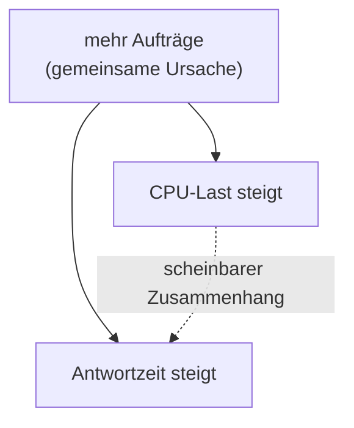
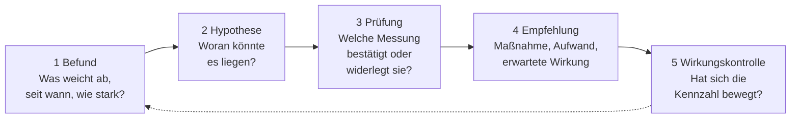

# Betriebsdaten analysieren

<span class='badge badge-vertiefung'>Vertiefung</span> &nbsp; Ein laufendes System produziert ununterbrochen Zahlen. Wert bekommen sie erst, wenn jemand sie liest, einordnet und daraus eine Entscheidung ableitet.

Die meisten Betriebe haben inzwischen ein Monitoring, viele haben Dashboards, und fast alle haben deutlich mehr Messwerte, als jemals angesehen werden. Trotzdem endet die Frage „Läuft das System gut?“ oft in einem Achselzucken. Der Grund ist selten fehlende Technik. Er liegt darin, dass eine einzelne Zahl **keine Bedeutung hat**, solange kein Vergleichswert danebensteht.

„Antwortzeit 200 Millisekunden“ ist weder gut noch schlecht. Gut ist es, wenn der Fachbereich 500 erwartet und es gestern noch 190 waren. Schlecht ist es, wenn vereinbart wurde, dass 95 Prozent der Aufrufe unter 100 Millisekunden liegen, und der Wert vorletzte Woche noch bei 60 lag. Diese Seite handelt davon, wie man den Vergleichswert bekommt – und was man mit der Abweichung anstellt.

!!! abstract "Was du auf dieser Seite lernst"
    - welche Daten im Betrieb anfallen: **Betriebs-, Prozess- und Sensordaten** – und warum die Unterscheidung praktische Folgen hat
    - wie **Zeitreihen** funktionieren: Abtastrate, Aggregation und was beim Verdichten unwiederbringlich verlorengeht
    - woran man **schlechte Datenqualität** erkennt: Lücken, Ausreißer, unsynchronisierte Uhren
    - wie man Kennzahlen bildet und **Sollwert, Anwenderkennzahl, Baseline und Benchmark** sauber trennt
    - warum der **Mittelwert** bei Antwortzeiten in die Irre führt und **Perzentile** die ehrlichere Auskunft geben
    - wie man **Trend, Saison und Korrelation** erkennt – und warum Korrelation keine Ursache ist
    - wie aus einer Abweichung über **Hypothese, Prüfung und Handlungsempfehlung** eine belastbare Maßnahme wird
    - was **Datenkonsolidierung** und **vorausschauende Instandhaltung** bedeuten

---

## Welche Daten im Betrieb anfallen

Im Sprachgebrauch heißt fast alles „Betriebsdaten“. Für die Auswertung lohnt sich eine feinere Einteilung, weil die drei Arten unterschiedlich entstehen, unterschiedlich schnell anfallen und unterschiedliche Fragen beantworten.

| | **Betriebsdaten** | **Prozessdaten** | **Sensordaten** |
|---|---|---|---|
| **Was sie beschreiben** | den Zustand der IT-Systeme selbst | den Ablauf der fachlichen Arbeit | physikalische Größen der Umgebung und der Anlagen |
| **Beispiele** | CPU-Last, freier Plattenplatz, Netzdurchsatz, Fehlerrate, Anmeldungen | Aufträge pro Schicht, Durchlaufzeit, Ausschussquote, Stillstandszeiten | Temperatur, Luftfeuchte, Stromaufnahme, Drehzahl, Vibration, Türkontakt |
| **Woher** | Monitoring-Agenten, SNMP, Logs | ERP, Fertigungssteuerung, Ticketsystem | Messfühler, Steuerungen, USV, Klimatechnik |
| **Typische Taktung** | Sekunden bis Minuten | Ereignis pro Vorgang | Sekunden, bei Schwingungsmessung deutlich schneller |
| **Beantwortet** | Ist die Technik gesund? | Erfüllt der Betrieb seinen Zweck? | Sind die Rahmenbedingungen in Ordnung? |

Der praktische Nutzen dieser Einteilung zeigt sich, sobald etwas schiefgeht. Nimm die **Feinwerk Präzisionstechnik GmbH**, einen Maschinenbauer mit rund 180 Beschäftigten und einem kleinen Rechenzentrum im Keller. Die Fertigung meldet, dass die Auftragserfassung „hakt“. Jede Datenart liefert dazu ein eigenes Stück der Antwort:

- Die **Prozessdaten** sagen, ob es stimmt und wie sehr: Die durchschnittliche Erfassungsdauer je Auftrag ist von 40 auf 95 Sekunden gestiegen, und in der Frühschicht wurden 30 Prozent weniger Aufträge angelegt als üblich.
- Die **Betriebsdaten** sagen, wo es klemmt: Die Datenbank wartet auf Plattenzugriffe, die Warteschlange wächst seit dem frühen Morgen.
- Die **Sensordaten** liefern die Erklärung: Die Temperatur im Serverraum liegt seit Betriebsbeginn bei 31 Grad, die Klimaanlage läuft im Dauerbetrieb. Der Speicher drosselt sich wegen Übertemperatur.

Keine der drei Quellen hätte den Fall allein aufgeklärt. Prozessdaten allein zeigen ein Symptom ohne Ort, Betriebsdaten einen Ort ohne Ursache, Sensordaten eine Ursache ohne Beleg, dass sie überhaupt jemandem schadet.

!!! tip "Die Reihenfolge, in der man liest"
    Fang bei den **Prozessdaten** an, nicht bei der Technik. Sie sagen dir, ob es überhaupt ein Problem gibt, wie groß es ist und wen es trifft – und damit, wie viel Aufwand die Klärung wert ist. Wer umgekehrt bei den Betriebsdaten beginnt, findet garantiert irgendeine auffällige Kurve; ob sie mit dem Problem zu tun hat, weiß er damit noch nicht.

---

## Zeitreihen: Abtastrate und Aggregation

Fast alle Betriebsdaten sind **Zeitreihen**: eine Folge von Messwerten mit Zeitstempel. Zwei Eigenschaften entscheiden darüber, was man später aus ihnen herauslesen kann – und beide werden bei der Einrichtung festgelegt, meist ohne dass jemand darüber nachdenkt.

### Die Abtastrate bestimmt, was du überhaupt sehen kannst

Die **Abtastrate** ist der Abstand zwischen zwei Messungen. Sie zieht eine harte Grenze: **Ereignisse, die kürzer sind als der Messabstand, können in den Daten fehlen – vollständig.** Wer alle fünf Minuten misst, sieht einen 40 Sekunden langen Einbruch entweder gar nicht oder als einzelnen unerklärlichen Punkt.

Die Grenze wirkt in beide Richtungen. Zu grob abgetastet heißt: kurze Störungen bleiben unsichtbar, und ausgerechnet die kurzen sind es, die Nutzer melden und niemand nachvollziehen kann. Zu fein abgetastet heißt: Der Speicherbedarf und die Last auf den überwachten Systemen wachsen, ohne dass jemand die zusätzliche Auflösung nutzt. Die Faustregel lautet, dass die Abtastung deutlich feiner sein muss als das kürzeste Ereignis, das man erkennen will – bei Antwortzeiten sind Intervalle im Bereich von zehn bis dreißig Sekunden üblich, bei Plattenbelegung reichen Minuten, bei Schwingungsmessung an Maschinen braucht es ein Vielfaches davon.

### Aggregation: die Verdichtung frisst die Spitzen

Rohdaten in feiner Auflösung über Jahre aufzuheben, ist teuer. Deshalb **verdichtet** man ältere Daten: Aus sechs Werten im Zehn-Sekunden-Takt wird ein Minutenwert, aus sechzig Minutenwerten ein Stundenwert. Üblich ist eine Staffel wie „zehn Sekunden für eine Woche, eine Minute für einen Monat, fünf Minuten für ein Jahr“.

Diese Verdichtung ist unvermeidlich und richtig – aber sie ist **verlustbehaftet**, und der Verlust trifft ausgerechnet das, was einen im Störungsfall interessiert. Ein Beispiel:

```text
CPU-Last, gemessen alle 10 Sekunden, verdichtet auf 5-Minuten-Mittelwerte

  30 Sekunden bei 100 %   (der eigentliche Vorfall)
 270 Sekunden bei  20 %   (der Rest des Fensters)

  (30 s x 100 % + 270 s x 20 %) / 300 s
  =  (3.000 + 5.400) / 300
  =  8.400 / 300
  =  28 %
```

Aus einer halben Minute bei Volllast wird ein Fünf-Minuten-Wert von 28 Prozent – eine Zahl, bei der niemand stehen bleibt. Der Vorfall ist nicht gelöscht worden, er ist **weggemittelt**.

Deshalb speichert man bei der Verdichtung nie nur den Mittelwert. Wer zusätzlich **Maximum, Minimum und ein hohes Perzentil** je Fenster aufhebt, behält die Spitzen und zahlt dafür nur wenig mehr Speicher. Bei zählenden Größen – Fehler, Aufträge, Pakete – ist außerdem die **Summe** das richtige Verdichtungsmaß und nicht der Mittelwert: Der Mittelwert von „drei Fehler in fünf Minuten“ ist eine sinnlose Zahl, die Summe nicht.

!!! warning "Die Falle beim Nachschauen"
    Wenn du eine Störung von vor drei Monaten untersuchst, siehst du fast immer stark verdichtete Daten. Kurven, die dort glatt aussehen, waren es damals nicht unbedingt. Bevor du daraus schließt „da war nichts Auffälliges“, prüfe, **in welcher Auflösung** du gerade blickst. Diese eine Frage rettet mehr Fehlersuchen, als jede zusätzliche Metrik es könnte.

---

## Datenqualität: drei Fehlerquellen, die alles entwerten

Eine Auswertung ist höchstens so gut wie die Daten darunter. Drei Probleme tauchen so regelmäßig auf, dass sie am Anfang jeder Analyse geprüft gehören.

### Lücken

Fehlende Werte entstehen bei Neustarts, Netzstörungen, vollen Puffern oder abgestürzten Agenten. Gefährlich sind sie, weil viele Werkzeuge sie stillschweigend überbrücken: Die Linie im Diagramm läuft einfach durch. Wer nicht hinsieht, hält eine erfundene Verbindungslinie für einen gemessenen Verlauf.

Der praktische Umgang: **Lücken sichtbar machen** statt interpolieren – die Kurve soll abreißen. Und: Eine Lücke ist selbst ein Befund. Wenn ein Agent immer genau dann keine Daten liefert, wenn die Last hoch ist, dann ist das keine Störung der Messung, sondern eine Aussage über das System.

### Ausreißer

Ein einzelner extremer Wert kann zwei völlig verschiedene Dinge bedeuten: ein Messfehler – oder genau der Vorfall, den du suchst. Beides sieht im Diagramm gleich aus.

Deshalb wirft man Ausreißer nie einfach weg, sondern **prüft sie einzeln**. Ein Temperaturfühler, der für eine Sekunde minus 40 Grad meldet und danach wieder 22, hatte einen Übertragungsfehler. Eine Antwortzeit von 30 Sekunden in einer Reihe von 200-Millisekunden-Werten ist mit hoher Wahrscheinlichkeit echt – und genau der Fall, über den sich jemand beschwert hat. Falls ein Wert als Messfehler entfernt wird, gehört das **dokumentiert**, sonst ist die Auswertung nicht mehr nachvollziehbar.

### Zeitsynchronisation

Die unauffälligste und folgenreichste Fehlerquelle. Sobald du Daten aus zwei Quellen nebeneinanderlegst, hängt jede Aussage über Reihenfolge an der Frage, ob beide Uhren dasselbe anzeigen. Steht die Uhr des Anwendungsservers 90 Sekunden vor der des Datenbankservers, sieht es in der Auswertung so aus, als sei der Anwendungsfehler **vor** dem Datenbankproblem aufgetreten – und die gesamte Ursachensuche läuft in die falsche Richtung.

Dagegen hilft nur eines: Alle Systeme beziehen ihre Zeit aus derselben Quelle, üblicherweise per **NTP** aus einer betriebseigenen Zeitquelle, die ihrerseits an einer verlässlichen Referenz hängt. Für Netze mit sehr hohen Genauigkeitsanforderungen – Messtechnik, Automatisierung – gibt es das genauere **PTP** (IEEE 1588). Zwei weitere Punkte gehören dazu: Protokolle werden in **UTC** geschrieben und erst bei der Anzeige in Ortszeit umgerechnet, sonst gibt es bei der Umstellung von Sommer- auf Winterzeit eine doppelt vorhandene Stunde in den Logs. Und der Zeitabgleich selbst gehört überwacht – ein Server, dessen Uhr wegläuft, meldet das nicht von sich aus.

!!! example "Prüfliste vor jeder Auswertung"
    Vier Fragen, die zusammen selten mehr als fünf Minuten kosten und regelmäßig verhindern, dass man eine Stunde in die falsche Richtung arbeitet:

    1. **Vollständigkeit** – Gibt es Lücken im betrachteten Zeitraum, und weiß ich, warum?
    2. **Auflösung** – In welcher Verdichtungsstufe sehe ich diese Daten gerade?
    3. **Zeitbasis** – Stammen alle Quellen aus derselben Zeitquelle, und stimmt die Zeitzone?
    4. **Einheiten** – Sind es Bit oder Byte, Prozent oder absolute Werte, Sekunden oder Millisekunden?

---

## Kennzahlen bilden: vier Vergleichswerte, die man nicht verwechseln darf

Damit aus einer Messung eine Aussage wird, braucht sie einen Bezugspunkt. Es gibt vier davon, und sie beantworten verschiedene Fragen.

| Vergleichswert | Woher er kommt | Beantwortet | Grenze |
|---|---|---|---|
| **Soll-Kennzahl aus Herstellerangaben** | Datenblatt, technische Spezifikation | Was kann das Gerät laut Hersteller? | Laborwert unter idealen Bedingungen |
| **Anwenderkennzahl** | Vereinbarung mit dem Fachbereich, Vertrag, Zielvorgabe | Was muss der Dienst leisten? | sagt nichts über das technisch Mögliche |
| **Baseline** | eigene Messung über einen repräsentativen Zeitraum | Was ist bei uns normal? | beschreibt das Übliche, nicht das Gute |
| **Benchmark** | Vergleich mit anderen Systemen, Standardtests, Branchenwerten | Wie stehen wir im Vergleich da? | vergleichbar nur bei gleicher Messmethode |

### Warum Herstellerangaben allein nicht reichen

Ein Netzwerkspeicher ist mit **1.200 MB/s** sequenziellem Lesedurchsatz angegeben. Im Betrieb misst du **380 MB/s**. Ist das ein Defekt?

Wahrscheinlich nicht. Die Herstellerangabe entsteht unter Laborbedingungen: ein einzelner, großer, zusammenhängender Datenstrom, leerer Cache-Zustand, keine parallele Last. Der Betrieb sieht anders aus – dreißig Nutzer greifen gleichzeitig auf viele kleine Dateien an verstreuten Stellen zu, dazwischen läuft eine Sicherung. Dieselbe Hardware liefert dann völlig andere Zahlen, ohne kaputt zu sein.

Die Herstellerangabe ist deshalb eine **Obergrenze**, kein Sollwert. Der Sollwert muss aus dem Anwendungsfall kommen: „Der Konstruktionsdatensatz von 2 GB muss in unter 30 Sekunden geöffnet sein“ – daraus ergibt sich ein nötiger Durchsatz von rund 67 MB/s (2.000 MB in 30 Sekunden), und plötzlich sind die gemessenen 380 MB/s völlig ausreichend.

### Die Baseline ist beschreibend, nicht wertend

Eine **Baseline** ist das gemessene Normalverhalten deines Systems: Wie sieht ein üblicher Dienstag aus, wie ein Monatsabschluss, wie eine Nacht? Sie ist die Grundlage für dynamische Schwellenwerte (siehe [Monitoring & Betrieb](monitoring.md)) und für jede Aussage der Form „das ist ungewöhnlich“.

Drei Bedingungen muss sie erfüllen, sonst taugt sie nichts:

- Sie deckt einen **vollen Zyklus** ab. Eine Woche ist das Minimum, ein Monat besser – sonst fehlt der Wochenrhythmus oder der Monatsabschluss.
- Sie stammt aus einem Zeitraum ohne bekannte Störung. Eine Baseline, die eine Woche mit defekter Klimaanlage enthält, definiert Übertemperatur als Normalzustand.
- Sie wird **erneuert**, wenn sich die Anlage ändert. Nach einem Umzug, einer Migration oder der Anbindung eines neuen Standorts beschreibt die alte Baseline ein System, das es nicht mehr gibt.

Und der wichtigste Satz dazu: **Die Baseline sagt, was üblich ist – nicht, was gut ist.** Läuft ein Dienst seit einem halben Jahr zu langsam, ist „zu langsam“ Teil der Baseline. Deshalb braucht jede Baseline eine Anwenderkennzahl daneben, die aus der Anforderung stammt und nicht aus der Messung.

---

## Perzentile statt Mittelwert

Von allen Auswertungsfehlern im Betrieb ist dieser der teuerste, weil er so harmlos aussieht: **der Mittelwert bei Antwortzeiten**.

Antwortzeiten sind nicht symmetrisch verteilt. Es gibt eine Untergrenze – schneller als die Verarbeitung dauert, geht es nicht – aber keine Obergrenze. Fast alle Aufrufe liegen dicht beieinander, ein paar wenige sind um Größenordnungen langsamer. Bei so einer Verteilung beschreibt der Mittelwert weder die Mehrheit noch die Ausreißer.

Zehn gemessene Aufrufe in Millisekunden:

```text
Messwerte:  80, 90, 95, 100, 105, 110, 120, 130, 150, 2.020

  Summe        =  3.000 ms
  Mittelwert   =  3.000 / 10          =    300 ms
  Median (p50) =  (105 + 110) / 2     =  107,5 ms
  p90          =  9. Wert der Reihe   =    150 ms
  p95 / Maximum                       =  2.020 ms
```

Der **Mittelwert von 300 Millisekunden** beschreibt keinen einzigen der zehn Aufrufe. Neun von zehn Nutzern haben eine Antwort in unter 150 Millisekunden bekommen; einer hat über zwei Sekunden gewartet, fast das Siebenfache des Mittelwerts. Der Mittelwert liegt genau dazwischen – in einem Bereich, in dem nichts passiert ist.

**Perzentile** beantworten dagegen eine Frage, die man tatsächlich stellen will. Das **p95** ist der Wert, unter dem 95 Prozent aller Messungen liegen: „95 von 100 Aufrufen waren schneller als X.“ Das ist eine Aussage über erlebte Nutzung, und genau so werden Zielwerte in Verträgen formuliert.

| Kennzahl | Sagt aus | Wofür sie taugt |
|---|---|---|
| **Mittelwert** | Summe geteilt durch Anzahl | Mengengrößen wie Durchsatz, Verbrauch, Auslastung |
| **Median (p50)** | die Mitte der Verteilung | „typischer“ Fall, unempfindlich gegen Ausreißer |
| **p95 / p99** | Grenze für die langsamsten 5 bzw. 1 Prozent | Zielwerte, Nutzererleben, Alarmschwellen |
| **Maximum** | der schlechteste gemessene Fall | Nachweis, dass ein Extremfall existiert |

!!! danger "Zwei Fallen, die auch Fortgeschrittene erwischen"
    **Perzentile darf man nicht mitteln.** Der Durchschnitt der p95-Werte von zehn Servern ist nicht das p95 aller Anfragen dieser zehn Server – die Zahl, die dabei herauskommt, hat keine Bedeutung. Wer über mehrere Systeme hinweg ein Perzentil braucht, muss es aus den zusammengelegten Rohdaten bilden.

    **Ein hohes Perzentil betrifft mehr Leute, als es aussieht.** „Nur ein Prozent der Aufrufe ist langsam“ klingt vernachlässigbar. Wenn ein Arbeitsvorgang aber aus dreißig Aufrufen besteht, trifft dieses eine Prozent statistisch fast jeden Vorgang mindestens einmal – und der Nutzer erlebt den Vorgang, nicht den Einzelaufruf.

---

## Muster erkennen: Trend, Saison, Korrelation

Wenn Daten sauber sind und Vergleichswerte stehen, geht es um die Frage, was sich in ihnen abzeichnet. Drei Muster deckt man dabei am häufigsten auf.

### Trend

Ein **Trend** ist eine gerichtete Veränderung über einen längeren Zeitraum. Er ist das mit Abstand wertvollste Muster im Betrieb, weil er die einzige Auswertung ist, die **nach vorn** zeigt: Ein Schwellenwert meldet, dass etwas eingetreten ist; ein Trend sagt, wann es eintreten wird.

Ein Trend wird erst durch die **Umrechnung in Zeit** brauchbar:

```text
Dateiserver, Kapazitaet 4 TB (4.000 GB)

  belegt                          3.400 GB
  frei                              600 GB
  Wachstum letzte 12 Wochen          25 GB je Woche

  600 GB / 25 GB je Woche  =  24 Wochen
```

Aus „Platte zu 85 Prozent voll“ wird „in rund 24 Wochen voll, also in knapp einem halben Jahr“. Das ist die Fassung, mit der man in eine Budgetbesprechung geht. Zwei Vorbehalte gehören dazu: Die Rechnung unterstellt **gleichbleibendes Wachstum**, was bei Speicher oft zu optimistisch ist, und sie ist nur so gut wie der Zeitraum, aus dem die Rate stammt. Zwölf Wochen sind belastbarer als zwei.

### Saison

Ein **saisonales Muster** ist eine regelmäßige Schwankung mit fester Periode: der Tagesverlauf mit Vormittagsspitze und Mittagstal, der Wochenverlauf mit ruhigem Wochenende, der Monatsabschluss, das Jahresgeschäft. Wer Saisonalität nicht kennt, zieht zwangsläufig falsche Schlüsse – der Vergleich „heute Nachmittag gegen heute früh“ ist wertlos, der Vergleich „dieser Dienstag gegen die letzten vier Dienstage“ ist aussagekräftig.

Die praktische Regel: **Vergleiche immer gegen dieselbe Phase des Zyklus**, nicht gegen den unmittelbar vorangegangenen Zeitraum.

### Korrelation – und warum sie keine Ursache ist

Zwei Kurven bewegen sich gleichzeitig. Das ist eine **Korrelation** und ein guter Anfang. Es ist aber keine Aussage darüber, was was verursacht. Für jede beobachtete Korrelation gibt es mindestens vier Erklärungen:

1. **A verursacht B.**
2. **B verursacht A.**
3. **Ein Drittes verursacht beide.**
4. **Zufall** – bei genügend vielen Metriken korreliert irgendwas immer mit irgendwas.



Im Beispiel oben steigen CPU-Last und Antwortzeit gemeinsam. Der naheliegende Schluss – „die CPU ist zu langsam, wir brauchen mehr Kerne“ – kann richtig sein. Er kann aber ebenso gut daneben liegen, weil beide Kurven nur der gestiegenen Auftragsmenge folgen und der eigentliche Engpass ganz woanders sitzt, etwa in einer Datenbanksperre. Wer auf die Korrelation hin Hardware kauft, hat hinterher schnellere CPUs und dieselbe Antwortzeit.

!!! tip "Drei Fragen, die eine Korrelation belastbarer machen"
    - **Zeitliche Reihenfolge:** Beginnt A tatsächlich *vor* B? Das setzt synchronisierte Uhren voraus – siehe oben.
    - **Mechanismus:** Kannst du erklären, *wie* A auf B wirkt? Ohne plausiblen Wirkweg bleibt es eine Beobachtung.
    - **Gegenprobe:** Gibt es Zeiträume, in denen A auftrat und B ausblieb? Ein einziger solcher Zeitraum widerlegt die einfache Ursachenannahme.

---

## Von der Abweichung zur Maßnahme

Der Zweck der ganzen Auswertung ist nicht das Diagramm, sondern eine Entscheidung. Der Weg dahin lässt sich in fünf Schritte fassen – und genau diese Kette ist es, die in einer Prüfungsaufgabe verlangt wird, wenn dort steht: „Leiten Sie einen Lösungsvorschlag ab und begründen Sie ihn.“



**1 – Befund.** Der Befund ist eine Aussage mit Zahl, Zeitraum und Bezugsgröße. Nicht „die Anwendung ist langsam“, sondern: „Das p95 der Auftragserfassung ist innerhalb von zwei Wochen von 0,9 auf 2,4 Sekunden gestiegen; der vereinbarte Zielwert liegt bei 1,5 Sekunden. Betroffen ist ausschließlich die Frühschicht.“ Wer den Befund so formuliert, hat die halbe Analyse schon gemacht – vor allem die Einschränkung „ausschließlich die Frühschicht“ ist mehr wert als jede weitere Metrik.

**2 – Hypothese.** Eine Hypothese ist eine überprüfbare Vermutung, keine Schuldzuweisung. Formuliere möglichst **mehrere** und ordne sie danach, wie leicht sie zu widerlegen sind. Zum Beispiel: (a) die gleichzeitig laufende Sicherung belegt die Platten; (b) die Auftragsmenge in der Frühschicht ist gestiegen; (c) ein Index in der Datenbank fehlt seit dem letzten Update; (d) die Klimatisierung drosselt den Speicher.

**3 – Prüfung.** Zu jeder Hypothese gehört eine Messung, die sie **widerlegen könnte**. Das ist der entscheidende Punkt: Eine Prüfung, die nur bestätigen kann, prüft nichts. Zu (a) etwa: Verschieben wir die Sicherung um zwei Stunden – bleibt die Verschlechterung? Zu (b): Vergleiche die Auftragszahlen der Frühschicht mit denen vor vier Wochen. Zu (d): Fällt die Temperaturkurve mit dem Beginn der Verschlechterung zusammen?

**4 – Empfehlung.** Eine Handlungsempfehlung nennt vier Dinge: **die Maßnahme**, **den Aufwand** in Geld und Zeit, **die erwartete Wirkung** als Zahl und **das Restrisiko**. „Sicherungsfenster auf 22 Uhr verlegen; Aufwand rund vier Stunden Konfiguration, keine Investition; erwartet wird ein Rückgang des p95 auf unter 1,2 Sekunden; Restrisiko: Das Fenster wird knapp, wenn der Datenbestand weiter wächst.“ Wo mehrere Wege möglich sind, gehören sie samt Kosten nebeneinandergestellt, damit die Entscheidung eine Wahl ist und keine Vorlage zum Abnicken.

**5 – Wirkungskontrolle.** Der Schritt, der am häufigsten fehlt. Nach der Umsetzung wird dieselbe Kennzahl erneut gemessen und mit dem Wert davor verglichen. Das schließt den Kreis in zweifacher Hinsicht: Es belegt, dass die Maßnahme gewirkt hat – und es deckt auf, wenn sie es nicht getan hat, solange die Erinnerung an die Hypothesen noch frisch ist.

!!! warning "Der Klassiker: die Maßnahme ohne Befund"
    „Wir geben der Datenbank mehr Arbeitsspeicher“ ist keine Empfehlung, sondern eine Vermutung mit Rechnung. Ohne Befund weiß niemand, ob danach etwas besser ist; ohne Wirkungskontrolle erfährt es auch hinterher niemand. In Prüfungsaufgaben ist das der Punkt, an dem Lösungen auseinanderfallen: Die Maßnahme mag richtig sein – ohne Begründung aus den Daten trägt sie trotzdem nicht.

---

## Ausblick: Konsolidierung und vorausschauende Instandhaltung

### Daten aus mehreren Quellen zusammenführen

Solange jede Datenart in ihrem eigenen System bleibt – Monitoring hier, ERP dort, Gebäudeleittechnik im dritten –, muss jeder Zusammenhang von Hand hergestellt werden. **Datenkonsolidierung** bedeutet, die Quellen so zusammenzuführen, dass sie miteinander vergleichbar werden. Technisch ist das der einfachere Teil; die Arbeit steckt in vier Vereinheitlichungen:

- **Gemeinsame Zeitbasis.** Ohne synchronisierte Uhren und eine einheitliche Zeitzone ist jede Zusammenführung wertlos.
- **Gemeinsame Bezeichner.** Dieselbe Maschine heißt im ERP „Anlage 4711“, im Monitoring `prod-cnc-04` und in der Gebäudetechnik „Halle 2 Nord“. Ohne eine verbindende Zuordnung lässt sich nichts verknüpfen.
- **Gemeinsame Einheiten.** Bit gegen Byte, Grad Celsius gegen Kelvin, Prozent gegen Absolutwerte – Umrechnungsfehler an dieser Stelle sind still und wirken sich auf alles aus.
- **Geklärte Zuständigkeit.** Wer pflegt die Zusammenführung, wenn eine Quelle ihr Format ändert? Konsolidierungen sterben fast immer daran und nicht an der Technik.

Der Gewinn ist die Klasse von Fragen, die vorher unbeantwortbar war: Kostet uns die Temperatur im Serverraum tatsächlich Durchsatz in der Fertigung? Häufen sich die Ausschussteile an denselben Tagen wie die Netzstörungen? Das sind genau die Fragen, für die man einen Betrieb kennen muss und nicht nur ein System.

### Vorausschauende Instandhaltung

Wartung lässt sich auf drei Arten organisieren:

| Strategie | Auslöser | Vorteil | Nachteil |
|---|---|---|---|
| **Reaktiv** | das Bauteil ist ausgefallen | kein Aufwand vorher | ungeplanter Stillstand zum ungünstigsten Zeitpunkt |
| **Vorbeugend (präventiv)** | ein festes Intervall, etwa alle 12 Monate | planbar, einfach zu organisieren | tauscht auch Teile, die noch lange gehalten hätten |
| **Vorausschauend (prädiktiv)** | ein Messwert zeigt beginnenden Verschleiß | tauscht kurz vor dem Ausfall, nutzt die Lebensdauer aus | braucht Daten, Historie und Auswertung |

**Vorausschauende Instandhaltung** (englisch *predictive maintenance*) ist der Versuch, den Ausfall aus den Daten kommen zu sehen. Der Gedanke dahinter ist einfach: Die wenigsten Bauteile fallen ohne Vorankündigung aus – sie kündigen sich in einer Messgröße an, wenn man die richtige beobachtet. Eine Festplatte meldet über ihre Selbstüberwachung wachsende Zahlen ersetzter Sektoren und Lesefehler, lange bevor sie ausfällt. Ein Lüfter verliert Drehzahl oder wird lauter. Eine Batterie in der unterbrechungsfreien Stromversorgung verliert Kapazität, was sich bei jedem Selbsttest zeigt. Ein Wälzlager verändert sein Schwingungsbild, bevor es hörbar wird.

Der Ansatz braucht drei Dinge, und daran scheitert er meistens: eine **Messgröße, die den Verschleiß tatsächlich abbildet**, eine **Historie über echte Ausfälle**, an der man erkennt, welche Veränderung ein Vorbote war und welche Rauschen – und eine **Organisation, die auf die Vorhersage reagiert**. Der letzte Punkt ist der schwerste. Eine Warnung „diese Platte wird voraussichtlich in den nächsten Wochen ausfallen“ nützt nichts, wenn kein Ersatzteil da ist und kein Wartungsfenster frei.

!!! note "Wo das weitergeht"
    Wie viel Redundanz sich angesichts solcher Vorhersagen lohnt und wie man Ausfallwahrscheinlichkeiten in Verfügbarkeitszahlen übersetzt, steht auf [Hochverfügbarkeit & Redundanz](hochverfuegbarkeit.md). Die wirtschaftliche Bewertung – lohnt eine Maßnahme im Verhältnis zum erwarteten Schaden? – gehört zum [Risikomanagement](../it-sicherheit/risikomanagement.md).

---

## Was du jetzt wissen solltest

- **Betriebsdaten** beschreiben die Technik, **Prozessdaten** die fachliche Arbeit, **Sensordaten** die physikalische Umgebung. Erst zusammen ergeben sie ein Bild – und man liest sie in dieser Reihenfolge von hinten: erst der fachliche Befund, dann der Ort, dann die Ursache.
- Die **Abtastrate** bestimmt, was überhaupt sichtbar werden kann. Ereignisse, die kürzer sind als der Messabstand, fehlen.
- **Aggregation** ist unvermeidlich und verlustbehaftet: Mittelwerte fressen Spitzen. Beim Verdichten gehören Maximum und ein hohes Perzentil mitgespeichert, bei Zählgrößen die Summe.
- Vor jeder Auswertung stehen vier Prüfungen: **Lücken, Auflösung, Zeitbasis, Einheiten**. Unsynchronisierte Uhren machen Ursachenketten unbrauchbar.
- **Herstellerangabe, Anwenderkennzahl, Baseline und Benchmark** sind vier verschiedene Vergleichswerte. Die Herstellerangabe ist eine Obergrenze, die Baseline beschreibt das Übliche – nur die Anwenderkennzahl sagt, was zulässig ist.
- Bei Antwortzeiten führt der **Mittelwert** in die Irre. **Perzentile** beschreiben, was Nutzer erleben – und Perzentile darf man nicht mitteln.
- **Trend** zeigt nach vorn und wird erst durch die Umrechnung in verbleibende Zeit brauchbar. **Saison** verlangt den Vergleich gegen dieselbe Phase des Zyklus.
- **Korrelation ist keine Ursache.** Reihenfolge, Mechanismus und Gegenprobe machen aus einer Beobachtung eine belastbare Aussage.
- Der Weg von der Abweichung zur Maßnahme: **Befund, Hypothese, Prüfung, Empfehlung, Wirkungskontrolle.** Eine Prüfung, die nur bestätigen kann, prüft nichts.
- **Vorausschauende Instandhaltung** braucht eine Messgröße für den Verschleiß, eine Historie echter Ausfälle und eine Organisation, die auf die Vorhersage reagieren kann.

---

## Beispielfragen zur Selbstkontrolle

??? question "Frage 1: Ein Dienstleister meldet für den letzten Monat eine durchschnittliche Antwortzeit von 240 ms und sieht damit den vereinbarten Zielwert von 500 ms erfüllt. Warum überzeugt dich das nicht?"
    Weil der **Mittelwert** bei Antwortzeiten die falsche Kennzahl ist. Antwortzeiten haben eine Untergrenze, aber keine Obergrenze; wenige sehr langsame Aufrufe ziehen den Mittelwert kaum nach oben, prägen aber das Nutzererleben. Bei 240 ms Mittelwert können mühelos fünf Prozent aller Aufrufe über drei Sekunden liegen – und genau über die wird sich beschwert.

    Was du stattdessen verlangst: einen **Perzentilwert** als Zielgröße, etwa „p95 unter 500 ms“, ausdrücklich gemessen über alle Aufrufe und nicht als Durchschnitt von Serverwerten. Dazu die **Messmethode**: Wo wird gemessen – auf dem Server oder beim Nutzer –, in welchem Intervall, werden Fehlerfälle mitgezählt? Ein Zielwert ohne festgelegte Messmethode ist nicht überprüfbar. Sinnvoll ist außerdem eine Angabe zum Maximum oder zum p99, damit sichtbar bleibt, wie schlimm der schlimmste Fall war.

??? question "Frage 2: Die Auswertung eines Vorfalls von vor vier Monaten zeigt eine völlig unauffällige CPU-Kurve. Wieso ist das kein Beweis dafür, dass die CPU nichts damit zu tun hatte?"
    Weil du mit hoher Wahrscheinlichkeit **verdichtete Daten** ansiehst. Nach ein paar Wochen liegen Messwerte üblicherweise nicht mehr in der ursprünglichen Auflösung vor, sondern als Mittelwerte über größere Fenster. Eine kurze Volllastphase verschwindet in so einem Mittelwert nahezu vollständig – 30 Sekunden bei 100 Prozent ergeben in einem Fünf-Minuten-Fenster mit sonst 20 Prozent Last einen Wert von 28 Prozent.

    Richtig wäre: Erst prüfen, in welcher Auflösung die Daten vorliegen und ob zusätzlich Maximalwerte je Fenster gespeichert wurden. Sind nur Mittelwerte vorhanden, lautet die korrekte Aussage nicht „die CPU war unauffällig“, sondern „aus diesen Daten lässt sich zu kurzen Spitzen keine Aussage treffen“. Und als Konsequenz für die Zukunft: bei der Verdichtung Maximum und ein hohes Perzentil mitspeichern.

??? question "Frage 3: Ein Kollege zeigt zwei Kurven – Speicherbelegung eines Servers und Anzahl der Fehlermeldungen – und schließt daraus: 'Der Speicher ist zu klein, wir müssen aufrüsten.' Wie reagierst du?"
    Die Beobachtung ist eine **Korrelation**, der Schluss unterstellt eine **Kausalität**. Es gibt mindestens vier Erklärungen: Der Speichermangel verursacht die Fehler; die Fehler verursachen den Speicheranstieg, etwa weil jeder Fehlerfall Daten im Speicher hält; eine dritte Größe – gestiegene Last, ein neuer Auftragstyp – verursacht beides; oder es ist Zufall.

    Prüfen würde ich drei Dinge. **Reihenfolge**: Steigt der Speicher tatsächlich vor den Fehlern? Das setzt synchrone Uhren voraus. **Mechanismus**: Welche Fehlermeldung ist es überhaupt – steht dort etwas über Speicher, oder ist es ein Zeitüberschreitungsfehler bei einer Netzverbindung? **Gegenprobe**: Gab es Zeiträume mit hohem Speicherverbrauch ohne Fehler? Wenn ja, ist die einfache Erklärung widerlegt.

    Erst danach wird die Empfehlung formuliert – mit Aufwand, erwarteter Wirkung als Zahl und einer Wirkungskontrolle nach der Umsetzung. Sonst hat man hinterher mehr Speicher und dieselben Fehler.

??? question "Frage 4: Was ist der Unterschied zwischen einer Baseline und einer Soll-Kennzahl – und warum braucht man beide?"
    Die **Baseline** ist beschreibend: Sie sagt, was bei euch üblich ist, gemessen über einen repräsentativen Zeitraum. Die **Soll-Kennzahl** ist normativ: Sie sagt, was zulässig ist, und stammt aus einer Vereinbarung mit dem Fachbereich, einem Vertrag oder einer technischen Anforderung.

    Beide braucht man, weil sie verschiedene Fehler abfangen. Ohne Baseline erkennst du keine **Veränderung** – ein Wert innerhalb des Sollbereichs kann sich trotzdem in vier Wochen verdoppelt haben, und das ist ein Befund. Ohne Sollwert erkennst du keinen **dauerhaft schlechten Zustand** – läuft ein Dienst seit Monaten zu langsam, wird das Teil der Baseline und fällt nie wieder auf.

    In der Praxis heißt das: dynamische Schwellen aus der Baseline für „ungewöhnlich“, plus mindestens eine harte Grenze aus dem Sollwert für „nicht mehr zulässig“.

??? question "Frage 5: Der freie Plattenplatz eines Dateiservers liegt bei 600 GB, das Wachstum der letzten zwölf Wochen bei 25 GB pro Woche. Formuliere daraus einen Befund und eine Handlungsempfehlung."
    **Befund:** Bei gleichbleibendem Wachstum ist der Speicher in 600 ÷ 25 = **24 Wochen** voll, also in knapp einem halben Jahr. Die Rate stammt aus zwölf Wochen Beobachtung; sie unterstellt lineares Wachstum und keine Sondereffekte.

    **Empfehlung** – mit den vier Bestandteilen. *Maßnahme:* Erweiterung um mindestens 2 TB im nächsten Beschaffungszyklus, parallel dazu ein Archivierungslauf, der abgeschlossene Projekte älter als 24 Monate auf günstigeren Speicher verschiebt. *Aufwand:* Beschaffung nach Angebot, Archivierung rund zwei Personentage plus Abstimmung mit den Fachbereichen. *Erwartete Wirkung:* Der Archivierungslauf gibt schätzungsweise 300 bis 400 GB frei und verschiebt den Zeitpunkt um drei bis vier Monate; die Erweiterung schafft danach wieder mindestens zwei Jahre Reserve. *Restrisiko:* Die Wachstumsrate kann steigen, etwa durch ein neues Dateiformat oder einen zusätzlichen Standort.

    Dazu gehört eine **Wirkungskontrolle**: Nach der Archivierung wird die Wachstumsrate neu bestimmt – ist sie unverändert, war die Ursache nicht das Altmaterial, sondern das laufende Geschäft, und die Erweiterung muss größer ausfallen.

??? question "Frage 6: Die Geschäftsführung möchte 'vorausschauende Instandhaltung einführen'. Welche drei Voraussetzungen nennst du – und welche Erwartung dämpfst du?"
    **Erstens eine Messgröße, die den Verschleiß tatsächlich abbildet.** Nicht jedes Bauteil kündigt sich in einer Größe an, die ihr messt. Bei Festplatten funktioniert es über die Selbstüberwachung, bei Lüftern über Drehzahl, bei Batterien über Kapazitätstests, bei Lagern über Schwingungen. Bei einem Netzteil, das ohne Vorwarnung ausfällt, funktioniert es nicht.

    **Zweitens eine Historie echter Ausfälle.** Ohne Fälle, in denen bekannt ist, wie die Messwerte vor dem Ausfall aussahen, lässt sich nicht unterscheiden, welche Veränderung ein Vorbote war und welche normales Rauschen. Diese Historie entsteht nicht über Nacht.

    **Drittens eine Organisation, die reagieren kann.** Eine Vorhersage nützt nur, wenn Ersatzteile verfügbar sind, ein Wartungsfenster erreichbar ist und jemand zuständig ist. Fehlt das, produziert man Warnungen, die niemand bearbeitet – und landet bei derselben Alarmmüdigkeit wie beim Monitoring.

    **Zu dämpfen ist die Erwartung, es gehe um ein Werkzeug.** Der überwiegende Teil des Nutzens entsteht schon vorher: saubere Daten, synchronisierte Zeit, eine gepflegte Anlagenliste und eine ausgewertete Ausfallhistorie. Betriebe, die diese Grundlagen haben, ziehen aus einfachen Schwellenwerten auf Verschleißgrößen bereits den größten Teil des möglichen Gewinns – ohne jedes komplizierte Verfahren.

---

## Merksatz

!!! success "Merksatz"
    > **Eine Zahl ohne Vergleichswert ist keine Information. Die Baseline sagt, was üblich ist, der Sollwert, was zulässig ist – verwechsle sie nie. Bei Antwortzeiten misst du Perzentile, nicht Mittelwerte, denn der Mittelwert beschreibt niemanden. Verdichtung frisst Spitzen, unsynchronisierte Uhren zerstören Ursachenketten, und Korrelation ist keine Ursache. Am Ende zählt nur die Kette: Befund, Hypothese, Prüfung, Empfehlung – und die Kontrolle, ob es geholfen hat.**

---

## Weiterlesen

- [Monitoring & Betrieb](monitoring.md): woher die Daten kommen – Signale, Schwellenwerte, Alarmierung
- [Hochverfügbarkeit & Redundanz](hochverfuegbarkeit.md): was man mit einem erkannten Trend anfängt, bevor er zum Ausfall wird
- [Incident Response & Business Continuity](incident-und-bcm.md): wenn aus der Abweichung ein Vorfall wird
- [Risikomanagement](../it-sicherheit/risikomanagement.md): wie man aus einer erkannten Schwachstelle eine wirtschaftlich begründete Maßnahme macht
- [Ressourcen planen](../infrastruktur-planung/ressourcen-planen.md): Trends aus dem Betrieb in Kapazitätsplanung übersetzen
- [Monitoring mit Prometheus & Grafana](../monitoring-praxis/index.md): Perzentile, Aggregation und Dashboards praktisch ausprobieren
