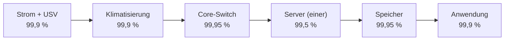
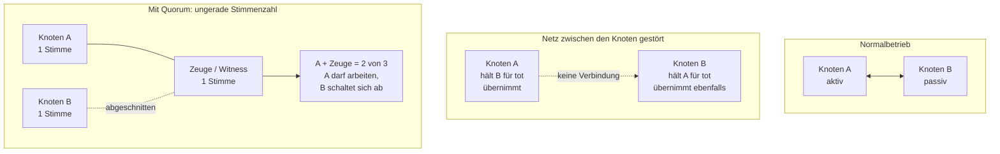

# Hochverfügbarkeit & Redundanz

<span class='badge badge-vertiefung'>Vertiefung</span> &nbsp; „Das darf nicht ausfallen" ist kein Anforderungssatz, sondern ein Wunsch. Hochverfügbarkeit fängt dort an, wo aus dem Wunsch eine **Zahl** wird – und aus der Zahl eine Architektur, die man bezahlen kann.

In fast jedem Betrieb gibt es eine Handvoll Systeme, bei denen der Satz fällt: „Wenn das steht, steht alles." Meist stimmt das sogar. Was danach passiert, ist trotzdem selten Hochverfügbarkeit, sondern eher ein zweiter Server, der irgendwo im selben Rack steht, am selben Netzteil hängt und dieselbe Firmware fährt. Er kostet Geld, er beruhigt – und wenn der Ernstfall kommt, fällt er mit aus. Diese Seite zeigt dir, wie du stattdessen **rechnest**: wie viel Verfügbarkeit ein System heute wirklich hat, wo sie verloren geht, welche Redundanz dagegen hilft und wann sich der nächste Schritt nicht mehr lohnt.

!!! abstract "Was du auf dieser Seite lernst"
    - wie du **Verfügbarkeit in Prozent** in konkrete Ausfallzeit umrechnest und was die „Neunen" wirklich bedeuten
    - warum sich Verfügbarkeiten in einer Kette **multiplizieren** – und warum Redundanz die Ausfallwahrscheinlichkeiten multipliziert statt die Verfügbarkeiten zu addieren
    - wie du einen **Single Point of Failure** systematisch findest, statt ihn im Ernstfall kennenzulernen
    - was **Kalt-, Warm- und Heißreserve** unterscheidet und wie **Cluster**, **Quorum** und **Failover** zusammenspielen
    - wie **USV, Netzersatzanlage, redundante Netzpfade und Klimatisierung** die Grundlage bilden, ohne die jede Serverredundanz Fassade bleibt
    - wie **Georedundanz** und **synchrone gegen asynchrone Replikation** zusammenhängen – und was Entfernung an Latenz kostet
    - wie du ein **SLA** liest, ohne Reaktionszeit mit Wiederherstellungszeit zu verwechseln
    - wie die **Business Impact Analysis** die Frage beantwortet, wie viel Redundanz sich lohnt

---

## Verfügbarkeit ist ein Bruch, keine Eigenschaft

**Verfügbarkeit** ist der Anteil einer Betrachtungszeit, in dem ein System seine Aufgabe erfüllt. Sie ist keine Eigenschaft, die ein Gerät ab Werk mitbringt, sondern das Ergebnis aus zwei gegenläufigen Größen: wie selten etwas kaputtgeht und wie schnell es wieder läuft.

```text
                     MTBF
Verfuegbarkeit  =  -----------
                  MTBF + MTTR
```

- **MTBF** (Mean Time Between Failures) – die mittlere Zeit zwischen zwei Ausfällen bei reparierbaren Systemen.
- **MTTR** (Mean Time To Repair, oft auch *Recovery*) – die mittlere Zeit, bis der Betrieb nach einem Ausfall wieder läuft. In der MTTR steckt mehr, als die meisten annehmen: Erkennen, Alarmieren, Anfahren, Diagnostizieren, Ersatzteil beschaffen, Reparieren, Prüfen, Freigeben.
- **MTTF** (Mean Time To Failure) meint dasselbe wie MTBF, aber für Teile, die man nicht repariert, sondern tauscht – ein Netzteil, eine Platte.

Ein Beispiel: Ein Server fällt statistisch alle 4.000 Betriebsstunden aus, die Störung ist nach vier Stunden behoben.

```text
  4.000 / (4.000 + 4)  =  0,99900   ->  99,900 %  ->  8,76 h Ausfall je Jahr
```

Jetzt zwei Wege, das zu verbessern. Weg eins: bessere Hardware, MTBF verdoppeln auf 8.000 Stunden.

```text
  8.000 / (8.000 + 4)  =  0,99950   ->  99,950 %  ->  4,38 h je Jahr
```

Weg zwei: Ersatzteil im Schrank, Rufbereitschaft, geübter Ablauf – MTTR von vier Stunden auf eine.

```text
  4.000 / (4.000 + 1)  =  0,99975   ->  99,975 %  ->  2,19 h je Jahr
```

!!! tip "Die billigere Neun steckt fast immer in der MTTR"
    Die MTBF zu verdoppeln heißt: doppelt so gute Hardware kaufen. Die MTTR zu vierteln heißt: ein Ersatzteil vorhalten, ein Monitoring einrichten, eine Rufbereitschaft festlegen und den Handgriff einmal geübt haben. Das zweite ist in aller Regel deutlich günstiger und wirkt sofort – und es wirkt auf **alle** Ausfallursachen gleichzeitig, nicht nur auf die eine, gegen die das teurere Bauteil hilft.

### Die Neunen in Ausfallzeit übersetzt

Ein Jahr hat 8.760 Stunden. Die zulässige Ausfallzeit ist der Rest zu hundert Prozent:

```text
Ausfallzeit je Jahr  =  8.760 h  x  (100 % - Verfuegbarkeit)
```

| Verfügbarkeit | Ausfallzeit je Jahr | je Monat (30 Tage) | Was das architektonisch bedeutet |
|---|---|---|---|
| **99 %** | 87,6 h ≈ 3,7 Tage | 7,2 h | einzelnes System, Reparatur am nächsten Werktag |
| **99,5 %** | 43,8 h ≈ 1,8 Tage | 3,6 h | einzelnes System mit Ersatzteilvertrag |
| **99,9 %** – drei Neunen | 8,76 h | 43,2 min | redundante Komponenten, Rufbereitschaft, Monitoring |
| **99,95 %** | 4,38 h | 21,6 min | Cluster, redundantes Netz, USV und Netzersatzanlage |
| **99,99 %** – vier Neunen | 52,6 min | 4,3 min | zwei Brandabschnitte, automatischer Failover, keine Handarbeit im Ernstfall |
| **99,999 %** – fünf Neunen | 5,3 min | 26 s | georedundant, aktiv-aktiv, Wartung im laufenden Betrieb |
| **99,9999 %** | 31,5 s | 2,6 s | fehlertolerante Spezialhardware, Sonderfall |

Zwei Beobachtungen sind wichtiger als die Tabelle selbst. Erstens: Zwischen 99,9 % und 99,99 % liegt optisch eine Nachkommastelle, tatsächlich liegt dort der Unterschied zwischen **einem Arbeitstag** und **einer Mittagspause** Ausfall im Jahr. Zweitens: Jede weitere Neun kostet grob eine Größenordnung mehr – nicht, weil die Geräte besser werden müssten, sondern weil sie **doppelt** werden müssen, in einem zweiten Raum, an einem zweiten Stromkreis, mit einer Umschaltung, die niemand von Hand auslöst.

??? note "Verfügbarkeitsklassen: die Namen hinter den Zahlen"
    In Angeboten und Ausschreibungen begegnen dir Klassenbezeichnungen. Verbreitet ist die **AEC-Einteilung** (Availability Environment Classification) der Harvard Research Group mit sechs Stufen: **AEC-0 Conventional**, **AEC-1 Highly Reliable**, **AEC-2 High Availability**, **AEC-3 Fault Resilient**, **AEC-4 Fault Tolerant**, **AEC-5 Disaster Tolerant**. Die Klassen beschreiben, wie sich ein System im Fehlerfall verhalten muss – von „darf ausfallen und Daten verlieren" bis „übersteht den Verlust eines ganzen Standorts".

    Die häufig zitierte Zuordnung AEC-1 = 99 %, AEC-2 = 99,9 %, AEC-3 = 99,99 %, AEC-4 = 99,999 %, AEC-5 = 99,9999 % ist eine **eingebürgerte Übersetzung**, kein Bestandteil der Klassendefinition. Nimm sie als Orientierung und schreib in einen Vertrag lieber die Prozentzahl, die Servicezeit und die Messmethode – die kann man nachrechnen, den Klassennamen nicht.

### Prozent von wann? Servicezeit gegen Kalenderzeit

Die häufigste Fehlerquelle in Verfügbarkeitszusagen ist nicht die Zahl, sondern der **Bezugszeitraum**. 99,9 % klingt eindeutig, bedeutet aber zwei völlig verschiedene Dinge:

| Bezug | Betrachtungszeit im Jahr | 99,9 % erlauben | Ein Ausfall am Sonntagnacht … |
|---|---|---|---|
| **Kalenderzeit 7×24** | 8.760 h | 8,76 h Ausfall | … zählt voll mit |
| **Servicezeit Mo–Fr, 7–19 Uhr** | rund 3.000 h | rund 3,0 h Ausfall | … zählt gar nicht |

Beide Angaben sind zulässig, beide sind ehrlich – aber sie beschreiben unterschiedliche Welten. Ein Anbieter, der 99,9 % auf die Servicezeit zusagt, verspricht dir drei Stunden im Jahr; ein Fachbereich, der 99,9 % hört, denkt an 8,76 Stunden. Zur Zusage gehören deshalb immer vier Angaben: **Prozentwert, Servicezeit, Messzeitraum** (Monat oder Jahr – ein Monatswert ist strenger) und die **Regel für geplante Wartung**. Wartungsfenster werden fast immer herausgerechnet; wer das nicht begrenzt, kann sich jede Zusage schönwarten.

---

## Die Verfügbarkeitskette: Reihenschaltung frisst Neunen

Ein Dienst hängt nie nur an sich selbst. Damit ein Nutzer arbeiten kann, müssen Strom, Kühlung, Netz, Server, Speicher und Anwendung **gleichzeitig** funktionieren. Fällt ein Glied aus, ist der Dienst weg. Das ist eine **Reihenschaltung** – und für die gilt:

```text
A_gesamt  =  A_1  x  A_2  x  ...  x  A_n
```

Nehmen wir die Fertigungssteuerung der **Feinwerk Präzisionstechnik GmbH**, eines Maschinenbauers mit zwei Standorten und einem kleinen Rechenzentrum im Keller:



```text
0,999 x 0,999 x 0,9995 x 0,995 x 0,9995 x 0,999  =  0,991026

  Gesamtverfuegbarkeit             =  99,1026 %
  Ausfallzeit  8.760 x 0,008974    =  rund 78,6 Stunden je Jahr  (ca. 3,3 Tage)
```

Kein einziges Glied dieser Kette ist schlecht. Trotzdem landet der Dienst bei 99,1 % – **schlechter als jedes einzelne Glied**. Das ist keine Rechenpanne, sondern die Kernaussage der Reihenschaltung: Jede zusätzliche Abhängigkeit zieht das Ergebnis nach unten, niemals nach oben.

!!! tip "Die Faustformel, die dir das Rechnen erspart"
    Bei hohen Verfügbarkeiten kannst du statt zu multiplizieren einfach die **Ausfallzeiten addieren** – das Ergebnis stimmt bis auf Rundungsfehler. In unserer Kette: 8,76 + 8,76 + 4,38 + 43,8 + 4,38 + 8,76 = **78,84 Stunden**, die exakte Rechnung ergibt 78,6. Der Vorteil dieser Sichtweise: Du siehst sofort, **wer die Stunden verursacht**. Hier sind es 43,8 von 78,6 Stunden – der einzelne Server. Alles andere zusammen macht weniger aus als er allein.

---

## Redundanz: parallel geschaltet multiplizieren sich die Fehler

Wenn zwei Komponenten parallel arbeiten und eine allein ausreicht, fällt der Dienst nur aus, wenn **beide gleichzeitig** ausfallen. Gerechnet wird deshalb nicht mit der Verfügbarkeit, sondern mit ihrem Gegenteil, der **Nichtverfügbarkeit** `U = 1 − A`:

```text
A_parallel  =  1  -  (U_1  x  U_2)  =  1  -  (1 - A_1) x (1 - A_2)
```

Für unseren Server mit 99,5 %:

```text
U = 1 - 0,995 = 0,005
A_parallel = 1 - (0,005 x 0,005) = 1 - 0,000025 = 0,999975  ->  99,9975 %
Ausfallzeit  8.760 x 0,000025  =  0,219 h  =  rund 13 Minuten je Jahr
```

Aus 43,8 Stunden werden 13 Minuten. Setzen wir das in die Kette ein:

```text
0,999 x 0,999 x 0,9995 x 0,999975 x 0,9995 x 0,999  =  0,995981
  Gesamt  =  99,5981 %   ->  rund 35,2 Stunden je Jahr
```

Von 78,6 auf 35,2 Stunden – **halbiert**, aber immer noch weit von 99,9 % entfernt. Der Grund steht in der Addition: Strom, Klima und Anwendung kosten jeweils weiter 8,76 Stunden. Machen wir also auch Stromversorgung (USV plus Netzersatzanlage) und Klimatisierung (zweite Anlage) redundant, sodass beide auf 99,99 % kommen:

```text
0,9999 x 0,9999 x 0,9995 x 0,999975 x 0,9995 x 0,999  =  0,997777
  Gesamt  =  99,7777 %   ->  rund 19,5 Stunden je Jahr
```

Jetzt ist der größte Einzelposten die **Anwendung** mit 8,76 Stunden – Software, nicht Blech. Ab hier hilft kein weiteres Gerät mehr, sondern nur noch sauberes Release-Management, Testumgebungen und ein Cluster **innerhalb** der Anwendung. Genau das ist der Erkenntnisgewinn der Kettenrechnung: Sie sagt dir nicht nur, wie gut du bist, sondern **an welcher Stelle das nächste Geld wirkt**.

!!! danger "Die Formel setzt Unabhängigkeit voraus – und die ist meistens gelogen"
    `1 − U²` gilt nur, wenn die beiden Komponenten wirklich unabhängig ausfallen. In der Praxis teilen sich Redundanzpartner fast immer etwas:

    - **denselben Stromkreis** oder dieselbe Steckdosenleiste
    - **denselben Raum**, denselben Brandabschnitt, dieselbe Kühlung
    - **dieselbe Firmware** mit demselben Fehler
    - **dieselbe Konfiguration**, von derselben Person angelegt und einmal falsch
    - **dieselbe Lieferung** – zwei Platten aus derselben Charge sterben gern kurz nacheinander
    - **denselben Menschen**, der beide gleichzeitig aktualisiert

    Das nennt man **Common Cause Failure**, gemeinsame Ausfallursache. Die Prüffrage lautet immer: **Welches einzelne Ereignis trifft beide gleichzeitig?** Wer darauf keine Antwort hat, darf `1 − U²` nicht rechnen. Zwei Internetleitungen zweier Anbieter im selben Kabelgraben sind eine Leitung mit zwei Rechnungen.

---

## Single Point of Failure finden, bevor er sich meldet

Ein **Single Point of Failure** (SPOF) ist eine Stelle, deren Ausfall den ganzen Dienst mitnimmt. Die Suche danach ist keine Kunst, sondern eine Systematik: Du gehst den Weg einer Anfrage vom Nutzer bis zum Datenblock und fragst an jeder Station: *Gibt es das hier zweimal – und zwar wirklich unabhängig?*

| Ebene | Typischer SPOF | Woran man ihn erkennt |
|---|---|---|
| **Strom** | eine Zuleitung, eine USV, eine Steckdosenleiste je Rack | Server mit zwei Netzteilen, beide in derselben Leiste |
| **Kühlung** | eine Klimaanlage ohne Reserve | im Sommer steigt die Raumtemperatur bei jeder Wartung |
| **Netz** | ein Core-Switch, eine Firewall, ein Uplink, eine Hauseinführung | Schaltplan zeigt genau ein Kästchen in der Mitte |
| **Server** | ein Host, auf dem die kritische VM „schon immer" läuft | keine Live-Migration möglich, weil kein zweiter Host passt |
| **Speicher** | ein Array, ein Controller, ein SAN-Switch | alle Hosts hängen am selben Gerät |
| **Dienste** | ein Domänencontroller, ein DNS-Server, ein Lizenzserver, ein NTP-Server | fällt er aus, meldet sich niemand mehr an |
| **Daten** | eine Datenbankinstanz ohne Replikat | Wiederherstellung nur aus dem Backup möglich |
| **Anbieter** | ein Internetprovider, ein Cloud-Anbieter, ein Wartungsdienstleister | dieselbe Rechnungsadresse für alle Wege |
| **Mensch** | genau eine Person kennt die Konfiguration | Urlaubsplanung ist ein Betriebsrisiko |
| **Standort** | ein Rechenzentrum, ein Brandabschnitt | Feuer, Wasser, Zutrittssperre treffen alles gleichzeitig |

Die beiden untersten Zeilen werden am seltensten aufgeschrieben und sind am schwersten zu reparieren. Ein zweiter Switch ist bestellt und eingebaut; eine zweite Person, die eine Fertigungssteuerung sicher bedient, braucht Monate. Und eine Redundanz, die nur **eine** Person auslösen kann, ist keine.

!!! example "Die Prüffrage in einem Satz"
    Zeig auf ein beliebiges Kästchen deines Netzplans und frag: **„Wenn ich das jetzt ausstecke – was merkt der Betrieb?"** Wenn die Antwort „alles steht" lautet und niemand einen Handgriff nennen kann, der das binnen der zugesagten Zeit auffängt, hast du einen SPOF gefunden. Notier ihn im Risikoregister als vollständigen Ursache-Ereignis-Folge-Satz, siehe [Risikomanagement](../it-sicherheit/risikomanagement.md).

---

## Redundanzarten: kalt, warm, heiß

Nicht jede Reserve muss laufen. Wie schnell ein Ersatz übernimmt, entscheidet über RTO und Preis gleichermaßen.

| Art | Zustand der Reserve | Typische Umschaltzeit | Kosten | Wofür geeignet |
|---|---|---|---|---|
| **Kaltreserve** (Cold Standby) | ausgeschaltet, im Schrank, ohne aktuelle Daten | Stunden bis Tage – aufbauen, einspielen, konfigurieren | gering | Arbeitsplätze, Switches, Netzteile, unkritische Server |
| **Warmreserve** (Warm Standby) | läuft, ist installiert, Daten in Intervallen nachgeführt | Minuten bis wenige Stunden – manuell oder halbautomatisch | mittel | ERP-Zweitsystem, Ausweichstandort, Dateidienste |
| **Heißreserve** (Hot Standby) | läuft, Daten aktuell, übernimmt automatisch | Sekunden bis wenige Minuten | hoch | Fertigungssteuerung, Datenbanken, Kernnetz |

Bei Infrastruktur wie Strom, Kühlung und Netzteilen beschreibt man Redundanz zusätzlich über die **N-Notation**:

- **N** – genau so viel, wie im Volllastfall gebraucht wird. Keine Reserve. Jede Wartung ist ein Ausfall.
- **N+1** – eine Einheit mehr als nötig. Eine darf ausfallen oder gewartet werden. Der übliche Standard.
- **N+2** – zwei dürfen fehlen; sinnvoll, wenn eine Wartung Wochen dauert.
- **2N** – alles doppelt, zwei vollständig getrennte Stränge (A/B-Speisung). Teuer, aber wartbar ohne Risiko.
- **2N+1** – doppelt, und in jedem Strang noch eine Reserve. Rechenzentren der obersten Klassen.

!!! warning "N+1 auf dem Papier, N in Wirklichkeit"
    Drei Klimageräte für einen Bedarf von zwei sind N+1 – solange der Bedarf zwei bleibt. Wächst die Last im Serverraum über die Jahre, kann aus N+1 unbemerkt N werden, ohne dass jemand etwas umgebaut hätte. Deshalb gehört die **tatsächliche Last** ins Monitoring, nicht nur der Zustand der Geräte. Dasselbe gilt für die USV: Mehr Server bedeuten kürzere Überbrückungszeit bei gleicher Batterie.

---

## Cluster: aktiv-passiv, aktiv-aktiv und die Frage, wer weiterlaufen darf

Ein **Cluster** ist ein Verbund mehrerer Knoten, die gemeinsam einen Dienst erbringen und den Ausfall einzelner Knoten auffangen. Zwei Grundformen:

| | **Aktiv-passiv** | **Aktiv-aktiv** |
|---|---|---|
| Wer arbeitet | ein Knoten, der andere wartet | alle Knoten gleichzeitig |
| Was passiert beim Ausfall | **Failover**: der passive Knoten übernimmt | die verbleibenden Knoten tragen die Last mit |
| Kapazitätsnutzung | die Hälfte liegt brach | volle Nutzung |
| Unterbrechung | kurze Lücke beim Umschalten | oft gar keine |
| Kapazitätsfalle | keine – der Partner ist frei | bei zwei Knoten trägt einer plötzlich 100 % |
| Anforderung an die Anwendung | gering, sie läuft nur woanders weiter | hoch, sie muss verteilt arbeiten können |

Nach dem Failover kommt der **Failback** – die Rückkehr auf den ursprünglichen Knoten. Der ist kein Selbstläufer: Er sollte **geplant** erfolgen, nicht automatisch, sonst schwingt der Dienst bei einem flatternden Fehler zwischen den Knoten hin und her.

!!! warning "Die Kapazitätsfalle bei aktiv-aktiv"
    Zwei aktive Knoten, jeder zu 70 % ausgelastet – das fühlt sich gesund an. Fällt einer aus, müsste der andere 140 % tragen. Er kann es nicht, wird langsam, läuft in Zeitüberschreitungen und reißt den Dienst mit. Aktiv-aktiv mit zwei Knoten funktioniert nur, wenn jeder Knoten dauerhaft **unter 50 %** bleibt. Mit drei Knoten sind es 66 %, mit vier 75 % – deshalb ist aktiv-aktiv erst ab drei Knoten wirtschaftlich attraktiv.

### Quorum und Split-Brain

Die gefährlichste Störung in einem Cluster ist nicht der Ausfall eines Knotens, sondern der **Verlust der Verbindung zwischen ihnen**. Beide Knoten leben, aber jeder hält den anderen für tot – und beide übernehmen die Dienste, schreiben auf denselben Speicher, beantworten dieselbe IP-Adresse. Das ist **Split-Brain**, und das Ergebnis sind zwei auseinanderlaufende Datenbestände, die sich nicht mehr zusammenführen lassen.



Die Gegenmaßnahme heißt **Quorum**: Nur die Teilmenge des Clusters, die die **Mehrheit der Stimmen** hält, darf die Dienste betreiben. Alle anderen schalten sich ab. Daraus folgen drei praktische Regeln:

1. **Ungerade Stimmenzahl.** Bei zwei Knoten gibt es keine Mehrheit – 1 zu 1 ist Patt. Deshalb braucht ein Zwei-Knoten-Cluster eine dritte Stimme: einen **Zeugen** (Witness, Tiebreaker) in Form eines kleinen Servers, einer Dateifreigabe oder eines Cloud-Endpunkts.
2. **Der Zeuge gehört an einen dritten Ort.** Steht er bei Knoten A, entscheidet bei einer Standorttrennung immer A – dann hast du keine Georedundanz, sondern einen Hauptstandort mit Anhang.
3. **Fencing.** Ein Knoten, der das Quorum verliert, muss zuverlässig vom Speicher und vom Netz getrennt werden – notfalls, indem ihm die Stromversorgung genommen wird (in vielen Cluster-Implementierungen als **STONITH** bezeichnet, „shoot the other node in the head"). Ein Knoten, der sich nur höflich zurückzieht, aber weiterschreibt, ist genau der Fall, den Quorum verhindern soll.

---

## Das Fundament: Strom, Netz und Kühlung

Serverredundanz auf einem einzelnen Fundament ist Dekoration. Drei Ebenen tragen alles darüber.

### Redundante Netzpfade

Ein zweiter Switch nützt nichts, wenn beide Wege über dieselbe Faser laufen. Redundanz im Netz bedeutet: **zwei Pfade, die kein gemeinsames Bauteil und keine gemeinsame Trasse haben.** Werkzeuge dafür sind gestapelte oder gekoppelte Switches, **Link Aggregation** über zwei physische Ports zu zwei verschiedenen Geräten, **RSTP** als Schleifenschutz mit Neukonvergenz im Sekundenbereich sowie **VRRP** oder ein herstellereigenes Äquivalent für ein redundantes Standard-Gateway. Nach außen gehören dazu zwei Provider mit getrennten Hauseinführungen – idealerweise an unterschiedlichen Gebäudeseiten, weil der Bagger auf dem Parkplatz nicht zwischen Verträgen unterscheidet. Mehr zur Technik dahinter steht unter [Routing & Switching](../netzwerke/routing-und-switching.md) und [Netzwerk-Hardware](../netzwerke/netzwerk-hardware.md).

### Redundante Netzteile, USV und Netzersatzanlage

Zwei Netzteile in einem Server sind Standard – ihren Zweck erfüllen sie nur, wenn sie an **zwei getrennten Stromkreisen** hängen (A/B-Speisung), idealerweise mit zwei getrennten USV-Strängen dahinter.

| Ebene | Aufgabe | Typischer Richtwert |
|---|---|---|
| **USV** (unterbrechungsfreie Stromversorgung) | überbrückt Sekunden bis Minuten, glättet Spannungsschwankungen | 10–15 Minuten Autonomiezeit bei Volllast |
| **NEA** (Netzersatzanlage, meist Diesel) | trägt den Betrieb über Stunden bis Tage | Startzeit rund 10–30 Sekunden, Tankvorrat oft 24–72 Stunden |

Die beiden Zahlen erklären, warum es **beides** braucht: Die USV allein überlebt keinen langen Stromausfall, die NEA allein startet zu langsam. Die USV überbrückt genau die Lücke bis zum Anlauf des Generators.

Nach der Norm für USV-Anlagen (IEC/EN 62040-3) unterscheidet man drei Bauarten: **VFD** (Standby/Offline – schaltet erst bei Ausfall um, günstig, für Arbeitsplätze), **VI** (Line-Interactive – regelt Spannungsschwankungen aus, für kleine Serverräume) und **VFI** (Online/Doppelwandler – erzeugt die Ausgangsspannung dauerhaft neu, ohne Umschaltlücke, der Standard im Rechenzentrum).

!!! danger "Die zwei häufigsten Fehler bei der Notstromversorgung"
    **Erstens: nie unter Last getestet.** Batterien altern, und zwar unauffällig. Eine USV, die im Selbsttest „OK" meldet, kann bei echter Last nach zwei Minuten aussteigen. Ein **Lasttest** mindestens jährlich, dazu ein monatlicher Probelauf der NEA unter Last, gehören in den Wartungsplan – ebenso wie ein Blick darauf, ob der Tank noch gefüllt ist.

    **Zweitens: die Klimaanlage hängt nicht mit dran.** Wenn Generator und USV nur die Serverschränke versorgen, läuft die Technik weiter, während die Raumtemperatur steigt. Nach zwanzig Minuten schalten die Geräte wegen Übertemperatur ab – der Strom war da, der Betrieb trotzdem weg.

### Klimatisierung

Der von der ASHRAE empfohlene Bereich für Serverräume liegt bei **18 bis 27 °C** bei der Ansaugluft; die zulässigen Bereiche gehen je nach Geräteklasse darüber hinaus. Wichtiger als der exakte Wert ist die Auslegung: **N+1**, getrennte Stromkreise je Gerät, Trennung von Kalt- und Warmgang und eine Temperaturüberwachung, die **vor** der Abschaltschwelle alarmiert. Die Klimatisierung ist die Komponente, die in Verfügbarkeitsrechnungen am häufigsten vergessen wird – und die in Ausfallberichten am häufigsten vorkommt.

!!! tip "Predictive Maintenance: Ausfälle sehen, bevor sie eintreten"
    Verfügbarkeit lässt sich auch über die MTBF-Seite verbessern, ohne neue Hardware zu kaufen: indem man Bauteile tauscht, **bevor** sie ausfallen. Die Datengrundlage liefert das laufende Monitoring – Lese- und Schreibfehler von Datenträgern, Batteriezustand und Innenwiderstand der USV, Lüfterdrehzahlen, Temperaturverläufe, Fehlerzähler auf Switch-Ports. Ein steigender Trend ist die Vorwarnung; ein Tausch im geplanten Wartungsfenster kostet einen Bruchteil eines ungeplanten Ausfalls. Wie man solche Trends auswertet, steht unter [Betriebsdaten analysieren](betriebsdaten-analysieren.md), die Erfassung selbst unter [Monitoring & Betrieb](monitoring.md).

---

## Georedundanz: was Entfernung an Latenz kostet

Alle bisherigen Maßnahmen schützen gegen den Ausfall einzelner Komponenten. Gegen Feuer, Wasser, Stromausfall im ganzen Gebäude oder eine gesperrte Zufahrt hilft nur ein **zweiter Standort**.

Wie weit entfernt? Das BSI empfiehlt für georedundante Rechenzentren einen Abstand von **mindestens 200 Kilometern**; geringere Abstände ab etwa 100 Kilometern sollen nur mit gesonderter Begründung gewählt werden. Der Grund ist einleuchtend: Hochwasser, großflächige Stromausfälle und Unwetter wirken regional, nicht punktuell. Zwei Rechenzentren in derselben Stadt sind zwei Brandabschnitte, keine Georedundanz.

Diese Entfernung hat einen physikalischen Preis. Licht läuft in Glasfaser mit rund 200.000 km/s – das sind etwa **5 Mikrosekunden je Kilometer** pro Richtung, also **10 Mikrosekunden je Kilometer** für Hin- und Rückweg. Bei 200 Kilometern Faserstrecke:

```text
Signallaufzeit  200 km  x  10 us/km  =  2.000 us  =  2 ms Umlaufzeit (mindestens)
```

Dazu kommen Verstärker, Übergänge und die Tatsache, dass Fasern selten die Luftlinie nehmen – realistisch sind eher 3 bis 5 Millisekunden. Diese Zeit fällt bei **jedem einzelnen synchronen Schreibvorgang** an:

| | **Synchrone Replikation** | **Asynchrone Replikation** |
|---|---|---|
| Ablauf | die Bestätigung an die Anwendung erfolgt erst, wenn beide Standorte geschrieben haben | der Primärstandort bestätigt sofort, die Kopie folgt kurz danach |
| **RPO** | 0 – kein Datenverlust | die Verzögerung (Lag): Sekunden bis Minuten |
| Auswirkung auf die Anwendung | jede Schreiboperation wird um die Umlaufzeit langsamer | keine spürbare Auswirkung |
| Praktische Reichweite | wenige zehn Kilometer, bei latenztoleranten Anwendungen mehr | beliebig |
| Verhalten bei Leitungsstörung | die Anwendung blockiert oder muss auf asynchron zurückfallen | die Kopie läuft nach, der Betrieb merkt nichts |

!!! example "Warum synchron über weite Strecken wehtut"
    Eine Datenbanktransaktion schreibt 200 Blöcke. Synchron über 200 Kilometer, mit 3 ms Umlaufzeit je Schreibvorgang:

    ```text
    200 Schreibvorgaenge  x  3 ms  =  600 ms  zusaetzlich  je Transaktion
    ```

    Aus einer Buchung, die vorher 50 Millisekunden dauerte, werden 650 – **das Dreizehnfache**. Bei 20 Buchungen je Minute fällt das kaum auf; bei 2.000 steht die Anwendung. Genau deshalb ist die übliche Bauform: **synchron im Nahbereich** (zwei Brandabschnitte oder zwei Rechenzentren am selben Ort, RPO 0) und **asynchron in die Ferne** (Georedundanz, RPO Minuten). Man bekommt beides – aber nicht mit einer einzigen Kopie.

Der dritte Baustein ist das **Quorum über drei Orte**: Zwei Standorte plus ein Zeuge an einem dritten. Ohne ihn entscheidet bei einer Leitungsstörung zwischen den Standorten niemand – oder beide.

---

## Service Level Agreements: die vier Zahlen, die zählen

Ein **SLA** ist die vertragliche Zusage über die Qualität einer Leistung. Vier Angaben entscheiden darüber, ob es im Ernstfall trägt.

| Begriff | Was er misst | Der typische Irrtum |
|---|---|---|
| **Reaktionszeit** | Zeit von der Meldung bis zur qualifizierten Rückmeldung des Dienstleisters | wird für die Behebungszeit gehalten. Ein Anruf ist kein reparierter Server. |
| **Wiederherstellungszeit** (Entstörzeit) | Zeit von der Meldung bis zum wiederhergestellten Betrieb | steht in vielen Verträgen **gar nicht** – ohne sie ist die Reaktionszeit wertlos |
| **Servicezeit** | wann der Dienstleister überhaupt arbeitet (5×9, 5×11, 7×24) | eine Störung am Freitagabend startet die Uhr erst am Montagmorgen |
| **Verfügbarkeit** | Prozentwert samt Messzeitraum, Messpunkt und Wartungsregel | ohne Messpunkt misst jede Seite etwas anderes |

Bei Hardwareverträgen begegnen dir gestufte Supportlevel:

| Stufe | Zusage | Servicezeit | Sinnvoll für |
|---|---|---|---|
| **Return to Depot** | Gerät einschicken, Rückgabe ohne feste Frist | – | Arbeitsplatzrechner |
| **Next Business Day vor Ort** | Techniker oder Teil am nächsten Werktag | 5×9 | unkritische Server |
| **4 Stunden vor Ort, 5×9** | Reaktion binnen 4 h innerhalb der Servicezeit | Mo–Fr | Server im Normalbetrieb |
| **24×7×4** | Reaktion binnen 4 h rund um die Uhr | 7×24 | Cluster, Speicher, Kernnetz |

!!! warning "„Vier Stunden" heißt nicht, dass es nach vier Stunden läuft"
    Die meisten Hardware-Supportverträge sagen **Reaktion** zu, nicht **Wiederherstellung**: Nach vier Stunden ist jemand da oder ein Teil unterwegs. Ob die Diagnose danach eine Stunde oder einen Tag dauert, steht nirgends. Wenn deine RTO vier Stunden beträgt und dein Vertrag „24×7×4" sagt, ist deine RTO nicht abgedeckt – sie beginnt in diesem Moment gerade erst.

    Der praktische Ausweg heißt **Ersatzteilhaltung**: ein Netzteil, ein Satz Platten, ein konfigurierter Ersatz-Switch als Kaltreserve im eigenen Schrank. Das kostet einmalig ein paar tausend Euro und ersetzt die teuerste Vertragsstufe für genau die Fälle, die am häufigsten vorkommen.

Zwei weitere Begriffe helfen beim Einordnen: Ein **OLA** (Operational Level Agreement) regelt dasselbe **innerhalb** der eigenen Organisation – etwa zwischen Servicedesk und Fachteam. Ein **Underpinning Contract** ist der Vertrag mit einem Unterlieferanten. Die Kette gilt hier genauso wie bei der Verfügbarkeit: **Du kannst nach außen nichts zusagen, was deine Zulieferer dir nicht zusagen.** Mehr dazu unter [IT-Verträge](../recht-organisation/it-vertraege.md).

---

## Wie viel Redundanz lohnt sich? Die Business Impact Analysis

Alle Technik dieser Seite kostet Geld. Die Begründung dafür liefert nicht die IT, sondern der Fachbereich – über die **Business Impact Analysis (BIA)**. Sie fragt nicht, was kaputtgehen kann, sondern: **Welcher Geschäftsprozess darf wie lange stillstehen, und was kostet jede Stunde darüber hinaus?**

Aus der BIA kommen drei Zahlen je Prozess: die **maximal tolerierbare Ausfallzeit (MTA)** als Aussage des Fachbereichs, die daraus abgeleitete **RTO** als Zielzeit für den Wiederanlauf und die **RPO** als maximal tolerierbarer Datenverlust. Ausführlich stehen diese Kennzahlen im [Risikomanagement](../it-sicherheit/risikomanagement.md#business-impact-analyse-wie-lange-darf-es-stillstehen) und – aus Sicht der Sicherung – unter [Backup & Recovery](backup-und-recovery.md).

Der entscheidende Schritt ist die Gegenrechnung. Nehmen wir eine Anwendung, deren Stillstand **6.000 Euro je Stunde** kostet:

```text
Heute        99,5  %  ->  43,80 h/Jahr  x  6.000 EUR  =  262.800 EUR/Jahr erwartete Ausfallkosten
Mit Cluster  99,95 %  ->   4,38 h/Jahr  x  6.000 EUR  =   26.280 EUR/Jahr
                                                          ----------
Ersparnis                                              =  236.520 EUR/Jahr
Der Cluster kostet jaehrlich (Abschreibung + Betrieb)  =   60.000 EUR/Jahr
Netto                                                  =  +176.520 EUR/Jahr
```

Der Schritt lohnt sich deutlich. Jetzt der nächste:

```text
Von 99,95 %  ->  99,99 %  ->  0,876 h/Jahr  x  6.000 EUR  =   5.256 EUR/Jahr
Ersparnis gegenueber 99,95 %   26.280 - 5.256             =  21.024 EUR/Jahr
Zweiter Brandabschnitt, zweiter Speicher, Georedundanz    =  80.000 EUR/Jahr
Netto                                                     =  -58.976 EUR/Jahr
```

Derselbe Rechenweg, umgekehrtes Ergebnis. Das ist der **Grenznutzen der Redundanz**: Die ersten Neunen kaufst du billig, jede weitere wird teurer, während der eingesparte Schaden schrumpft. Irgendwo kreuzen sich die beiden Linien – und genau dort liegt die wirtschaftlich richtige Antwort, nicht bei der technisch schönsten.

!!! note "Wo die Rechnung an ihre Grenze kommt"
    Der Erwartungswert ist ein Mittelwert über viele Jahre. Er taugt für Ausfälle, die regelmäßig vorkommen. Für **seltene Großschäden** – Brand, Hochwasser, Totalverlust eines Standorts – trägt er nicht: Ein Betrieb erlebt keine hundert Jahre, er erlebt entweder null solcher Ereignisse oder eines. Deshalb gilt hier dieselbe Sonderregel wie in der Risikomatrix: Was existenzbedrohend ist, wird nicht allein deshalb akzeptiert, weil sein Erwartungswert klein ist. Solche Entscheidungen trifft die Geschäftsführung schriftlich – siehe [Risikomanagement](../it-sicherheit/risikomanagement.md).

Nicht jedes System braucht dieselbe Antwort. Ein typisches Ergebnis einer BIA sieht gestaffelt aus:

| Kritikalität | Beispiel | Typische Zielverfügbarkeit | Passende Bauform |
|---|---|---|---|
| **sehr hoch** | Fertigungssteuerung, Patientendaten | 99,95 – 99,99 % | Cluster, zwei Brandabschnitte, USV + NEA, Heißreserve |
| **hoch** | ERP, Verzeichnisdienst, Kernnetz | 99,9 % | Cluster oder Warmreserve, N+1 bei Strom und Klima, Ersatzteile vor Ort |
| **mittel** | Datei- und Mailserver, Webshop | 99,5 % | einzelnes System, Ersatzteilvertrag, gutes Backup |
| **gering** | Zeiterfassung, Testumgebung | keine Zusage | Wiederherstellung aus dem Backup, Kaltreserve |

Diese Staffelung ist der eigentliche Ertrag der ganzen Rechnerei: Sie erlaubt, an drei Stellen zu sparen, um an einer Stelle ernsthaft zu investieren.

---

## Was du jetzt wissen solltest

- **Verfügbarkeit ist MTBF / (MTBF + MTTR).** Beide Faktoren sind Stellschrauben – die MTTR zu senken ist meist billiger, als die MTBF zu erhöhen.
- **Prozent in Stunden umrechnen:** 8.760 h × (100 % − Verfügbarkeit). 99,9 % sind 8,76 Stunden im Jahr, 99,99 % sind 53 Minuten.
- **Zu jeder Zusage gehören Servicezeit, Messzeitraum, Messpunkt und die Regel für Wartungsfenster.** Ohne sie ist die Prozentzahl nicht überprüfbar.
- **Reihenschaltung multipliziert:** Die Kette ist immer schlechter als ihr schwächstes Glied. Bei hohen Werten kannst du die Ausfallzeiten näherungsweise addieren – so siehst du sofort, wo die Stunden entstehen.
- **Redundanz multipliziert die Nichtverfügbarkeiten:** `1 − (1−A)²`. Das gilt nur bei echter Unabhängigkeit – gemeinsame Ursachen wie Stromkreis, Raum, Firmware und Mensch machen die Rechnung wertlos.
- **Kaltreserve, Warmreserve, Heißreserve** unterscheiden sich in Umschaltzeit und Preis; **N+1, 2N, 2N+1** beschreiben Redundanz bei Strom, Kühlung und Netzteilen.
- **Cluster brauchen Quorum.** Ohne ungerade Stimmenzahl, dritten Zeugen und Fencing droht Split-Brain – zwei Datenbestände, die sich nicht mehr vereinen lassen.
- **USV überbrückt Minuten, die NEA trägt Stunden bis Tage** – und die Klimatisierung muss mit auf der Notstromversorgung liegen.
- **Synchrone Replikation heißt RPO 0 und kostet Latenz; asynchrone kostet Daten, aber keine Zeit.** Über 200 Kilometer sind das mindestens 2 ms je Schreibvorgang.
- **Reaktionszeit ist nicht Wiederherstellungszeit.** „24×7×4" sagt zu, dass jemand kommt – nicht, dass etwas läuft.
- **Die BIA begründet die Investition:** eingesparte Ausfallkosten gegen jährliche Redundanzkosten. Jede weitere Neun kostet mehr und spart weniger.

---

## Beispielfragen zur Selbstkontrolle

??? question "Frage 1: Ein Dienstleister sagt 99,9 % Verfügbarkeit zu. Der Fachbereich fragt, was das konkret heißt. Was antwortest du – und welche Rückfrage stellst du dem Dienstleister?"
    **Die Umrechnung:** 8.760 h × 0,001 = **8,76 Stunden Ausfall je Jahr**, also rund 43 Minuten je Monat. Das ist ungefähr ein Arbeitstag pro Jahr, in dem der Dienst vertragskonform stillstehen darf.

    **Die Rückfragen an den Dienstleister sind wichtiger als die Zahl:**

    1. **Bezogen auf welche Zeit?** Kalenderzeit 7×24 (8.760 h) oder Servicezeit Mo–Fr 7–19 Uhr (rund 3.000 h)? Im zweiten Fall sind es nur noch rund **3 Stunden** – und ein Ausfall am Sonntag zählt gar nicht mit.
    2. **Über welchen Messzeitraum?** Ein Jahresmittel erlaubt einen einzigen Ausfall von 8,76 Stunden; ein Monatswert deckelt jeden einzelnen Monat auf 43 Minuten. Der Monatswert ist deutlich strenger.
    3. **Wo wird gemessen?** Am Rechenzentrumsausgang des Anbieters oder beim Nutzer? Dazwischen liegt deine Leitung, deine Firewall, dein Switch – und die zählen in der Kette mit.
    4. **Wie werden Wartungsfenster behandelt?** Werden sie herausgerechnet, und wenn ja: wie viele Stunden im Jahr höchstens, mit welcher Vorankündigung?
    5. **Was passiert bei Unterschreitung?** Ohne Rechtsfolge ist eine Zusage eine Absichtserklärung.

??? question "Frage 2: Eine Anwendung läuft auf zwei redundanten Servern mit je 99 % Verfügbarkeit. Der Kollege rechnet: 99 % + 99 % = 198 %, also praktisch immer verfügbar. Wo ist der Fehler, und wie lautet die richtige Rechnung?"
    Verfügbarkeiten werden **nie addiert**. Bei Redundanz multipliziert man die **Nichtverfügbarkeiten**, weil der Dienst nur ausfällt, wenn beide Server gleichzeitig ausfallen:

    ```text
    U = 1 - 0,99 = 0,01
    A_parallel = 1 - (0,01 x 0,01) = 1 - 0,0001 = 0,9999  ->  99,99 %
    Ausfallzeit  8.760 x 0,0001  =  0,876 h  =  rund 53 Minuten je Jahr
    ```

    Das Ergebnis ist beeindruckend – **aber nur unter einer Bedingung**: Die beiden Server müssen wirklich unabhängig ausfallen. Stehen sie im selben Rack, an derselben Steckdosenleiste, mit derselben Firmware und derselben Konfiguration, dann trifft ein Stromausfall, ein Firmwarefehler oder ein Konfigurationsfehler **beide gleichzeitig**. Diese gemeinsame Ausfallursache (Common Cause Failure) lässt sich mit der Formel gar nicht abbilden.

    Und die zweite Einschränkung: Der Cluster steht weiterhin in einer Kette. Sind Netz, Speicher, Strom und Kühlung einfach ausgelegt, verbessert der zweite Server die Gesamtverfügbarkeit nur um seinen eigenen Anteil an den Ausfallstunden.

??? question "Frage 3: Wie unterscheiden sich Kaltreserve, Warmreserve und Heißreserve – und woran entscheidest du im konkreten Fall, welche du brauchst?"
    | | Kaltreserve | Warmreserve | Heißreserve |
    |---|---|---|---|
    | Zustand | ausgeschaltet, ohne aktuelle Daten | läuft, Daten in Intervallen nachgeführt | läuft, Daten aktuell |
    | Umschaltung | manuell, aufbauen und einspielen | manuell oder halbautomatisch | automatisch |
    | Dauer | Stunden bis Tage | Minuten bis Stunden | Sekunden bis Minuten |
    | Kosten | gering | mittel | hoch |

    **Die Entscheidung fällt über die RTO, nicht über den Geschmack.** Der Weg ist immer derselbe:

    1. RTO aus der BIA nehmen – etwa „vier Stunden".
    2. Alles abziehen, was vor der eigentlichen Umschaltung passiert: Erkennen, Alarmieren, Entscheiden, Anfahren. Realistisch bleibt von vier Stunden oft nur die Hälfte.
    3. Prüfen, welche Reserveform in dieser Restzeit sicher zum Ziel führt.

    Bei zwei Stunden Restzeit ist eine Kaltreserve, die erst aufgebaut und aus dem Backup befüllt werden muss, nicht zu halten – hier braucht es mindestens eine Warmreserve. Bei einer RTO von 15 Minuten bleibt nur die Heißreserve mit automatischem Failover, weil in dieser Zeit kein Mensch zuverlässig eingreifen kann. Umgekehrt gilt: Ein System mit einer RTO von 72 Stunden mit einer Heißreserve auszustatten, ist verschwendetes Geld.

??? question "Frage 4: In einem Zwei-Knoten-Cluster fällt die Verbindung zwischen den Knoten aus, beide Server laufen aber weiter. Was passiert, warum ist das gefährlicher als ein echter Serverausfall – und wie verhindert man es?"
    Beide Knoten stellen fest, dass der Partner nicht mehr antwortet, und schließen daraus, er sei ausgefallen. Beide übernehmen daraufhin die Dienste: dieselbe virtuelle IP-Adresse, dieselben Datenbestände, dieselben Schreibzugriffe. Das ist **Split-Brain**.

    **Warum das schlimmer ist als ein Ausfall:** Bei einem echten Serverausfall ist der Dienst kurz weg, danach läuft er auf einem Knoten korrekt weiter. Beim Split-Brain läuft der Dienst scheinbar normal – aber die beiden Knoten nehmen unterschiedliche Änderungen entgegen. Nach der Reparatur der Verbindung existieren zwei auseinandergelaufene Datenbestände, die sich **nicht automatisch zusammenführen lassen**. Man muss sich für einen entscheiden und die Änderungen des anderen verwerfen, oft ohne zu wissen, welche das waren. Aus einem Verfügbarkeitsproblem ist ein Integritätsproblem geworden.

    **Die Gegenmaßnahmen:**

    1. **Quorum mit ungerader Stimmenzahl.** Nur wer die Mehrheit hält, darf arbeiten. Zwei Knoten allein können keine Mehrheit bilden – es braucht eine dritte Stimme.
    2. **Zeuge an einem dritten Ort.** Ein kleiner Server, eine Dateifreigabe oder ein Cloud-Endpunkt. Steht der Zeuge bei einem der beiden Knoten, gewinnt bei jeder Standorttrennung immer derselbe.
    3. **Fencing.** Der Knoten ohne Quorum wird zuverlässig vom Speicher und Netz getrennt – notfalls über die Stromversorgung.
    4. **Getrennte Verbindungswege** zwischen den Knoten, damit die Trennung überhaupt unwahrscheinlicher wird.

??? question "Frage 5: Die Geschäftsführung fragt, ob sich ein zweiter Standort lohnt. Der Ausfall der Kernanwendung kostet 3.000 Euro je Stunde, aktuell liegt die Verfügbarkeit bei 99,5 %. Die Georedundanz würde jährlich 55.000 Euro kosten und die Verfügbarkeit auf 99,95 % heben. Wie rechnest und wie argumentierst du?"
    **Die Rechnung:**

    ```text
    Heute      99,5  %  ->  8.760 x 0,005   =  43,80 h/Jahr  x 3.000 EUR  =  131.400 EUR/Jahr
    Danach     99,95 %  ->  8.760 x 0,0005  =   4,38 h/Jahr  x 3.000 EUR  =   13.140 EUR/Jahr
                                                                             ----------
    Eingesparte erwartete Ausfallkosten                                   =  118.260 EUR/Jahr
    Kosten der Georedundanz                                               =   55.000 EUR/Jahr
    Netto                                                                 =  +63.260 EUR/Jahr
    ```

    Rein rechnerisch lohnt es sich also deutlich. **Zur Argumentation gehören trotzdem vier Einschränkungen:**

    1. **Die 3.000 Euro je Stunde sind eine Schätzung des Fachbereichs**, keine Messung. Die ganze Rechnung steht und fällt mit dieser Zahl – sie gehört mit ihrer Herleitung dokumentiert.
    2. **Ausfälle verteilen sich nicht gleichmäßig.** Ein Ausfall mitten in der Schicht kostet mehr als 3.000 Euro je Stunde, einer in der Nacht deutlich weniger. Wer es genau will, rechnet mit dem Anteil der Betriebszeit.
    3. **Georedundanz hebt nicht automatisch die Gesamtverfügbarkeit.** Wenn Netz, Anwendung oder Verzeichnisdienst weiterhin einfach ausgelegt sind, bleiben deren Ausfallstunden in der Kette stehen. Die zugesagten 99,95 % müssen für die **gesamte Kette** gelten, nicht nur für das Rechenzentrum.
    4. **Der zweite Standort bringt einen Nutzen, den die Rechnung gar nicht erfasst:** Er schützt gegen den Totalverlust – Brand, Hochwasser, Gebäudesperrung. Dieses Ereignis ist selten, sein Erwartungswert entsprechend klein, seine Folge aber existenzbedrohend. Solche Risiken werden nicht über den Erwartungswert entschieden, sondern bewusst von der Geschäftsführung getragen oder abgesichert.

    Und die günstigere Gegenfrage gehört immer dazu: Wie viel der 118.260 Euro bekäme man auch mit Maßnahmen, die einen Bruchteil kosten – Ersatzteile vor Ort, ein zweiter Host, N+1 bei Klima und Strom, kürzere MTTR durch Rufbereitschaft?

??? question "Frage 6: Warum reicht es nicht, den zweiten Server einfach neben den ersten zu stellen?"
    Weil Redundanz nur zählt, wenn die beiden Systeme **unabhängig** ausfallen – und ein zweiter Server im selben Rack teilt fast alles mit dem ersten:

    - **denselben Raum** – Feuer, Wasser, Übertemperatur, gesperrter Zutritt treffen beide
    - **denselben Stromkreis** und oft dieselbe Steckdosenleiste
    - **dieselbe Kühlung**
    - **denselben Switch**, wenn beide Uplinks am selben Gerät hängen
    - **denselben Speicher**, wenn beide vom selben Array booten
    - **dieselbe Firmware und dieselbe Konfiguration**, meist am selben Tag von derselben Person eingespielt

    Damit fängt der zweite Server genau eine Ursache ab: den Hardwaredefekt des ersten. Gegen alle anderen ist er wirkungslos – und in der Kettenrechnung darf man `1 − U²` gar nicht ansetzen, weil die Unabhängigkeit fehlt.

    **Was einen echten Redundanzpartner ausmacht:** anderer Brandabschnitt oder wenigstens anderes Rack, anderer Stromkreis und andere USV, anderer Switch, anderer Speicherpfad, zeitversetzte Firmwarestände, getrennt geprüfte Konfiguration – und ein Umschaltvorgang, der mindestens einmal geübt wurde. Alles andere ist ein zweiter Server, kein zweiter Weg.

---

## Merksatz

!!! success "Merksatz"
    > **Verfügbarkeit ist eine Rechnung, keine Behauptung: 8.760 Stunden mal dem Prozentrest ergeben die erlaubte Ausfallzeit. In Reihe multiplizieren sich die Verfügbarkeiten – die Kette ist immer schlechter als ihr schwächstes Glied. Parallel multiplizieren sich die Ausfallwahrscheinlichkeiten – aber nur, wenn die Partner wirklich unabhängig sind. Redundanz beginnt beim Fundament: Strom, Kühlung, Netz. Cluster brauchen Quorum, sonst entsteht Split-Brain. Und wie viel Redundanz sich lohnt, sagt nicht die Technik, sondern die Business Impact Analysis.**

---

## Weiterlesen

- [Backup & Recovery](backup-und-recovery.md): was passiert, wenn Redundanz nicht reicht – RTO, RPO, Sicherungsarten und der Wiederanlaufplan
- [Übungen: Verfügbarkeit & Datensicherung](uebungen-verfuegbarkeit.md): die Gruppenübung, in der du ein Redundanz- und Backupkonzept mit Budget entwirfst
- [Monitoring & Betrieb](monitoring.md): die Datenquelle, aus der MTTR-Verkürzung und Frühwarnung überhaupt erst entstehen
- [Betriebsdaten analysieren](betriebsdaten-analysieren.md): Trends erkennen, bevor aus einem Messwert ein Ausfall wird
- [Incident Response & Business Continuity](incident-und-bcm.md): wie aus Technik ein geübter Ablauf im Ernstfall wird
- [Risikomanagement](../it-sicherheit/risikomanagement.md): Schutzbedarf, Business Impact Analyse und die Frage, welches Restrisiko man bewusst trägt
- [Speicherlösungen](../infrastruktur-planung/speicherloesungen.md): RAID, Shared Storage und warum Redundanz im Speicher kein Backup ist
- [IT-Verträge](../recht-organisation/it-vertraege.md): SLA, Reaktionszeiten und was in einem Wartungsvertrag wirklich zugesagt wird
