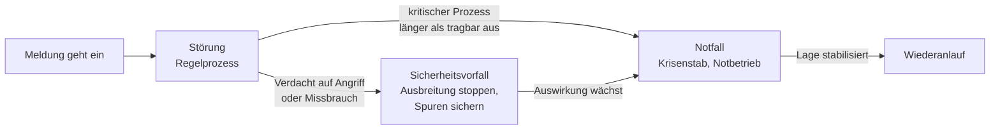

# Incident Response & Business Continuity

Vertiefung &nbsp; Irgendwann geht trotz aller Vorsorge etwas schief. Ob daraus ein anstrengender Tag oder ein existenzbedrohender Monat wird, entscheidet sich fast nie in der ersten Stunde – sondern in den Wochen davor.

Wer Berichte über echte Krisenfälle liest, findet darin immer wieder dieselbe Beobachtung: Die Technik war beherrschbar. Was den Schaden groß gemacht hat, war etwas anderes – niemand wusste, wer entscheiden darf. Die Telefonliste lag im Netzlaufwerk, das gerade verschlüsselt war. Zwei Teams arbeiteten drei Stunden lang an unterschiedlichen Annahmen. Die Wiederherstellung startete mit dem falschen System, weil niemand die Reihenfolge kannte. Und der Kunde erfuhr aus der Zeitung von einem Vorfall, über den ihn niemand informiert hatte.

Genau davon handelt diese Seite. **Incident Response** ist das geordnete Vorgehen im akuten Fall. **Business Continuity Management** ist die Frage, wie der Betrieb weiterläuft, während die Technik noch nicht wieder da ist. Beides sind Verfahren, keine Werkzeuge – und beide funktionieren nur, wenn sie vorher festgelegt und geübt wurden.

!!! abstract "Was du auf dieser Seite lernst"
    - wie sich **Störung, Sicherheitsvorfall und Notfall** unterscheiden – und warum die Einstufung eine Entscheidung ist, kein Etikett
    - die sechs Phasen der Incident Response: **Vorbereitung, Erkennung, Eindämmung, Beseitigung, Wiederherstellung, Nachbereitung** – jeweils mit konkreten Handlungen
    - welche **Rollen** ein Ernstfall braucht und warum Zuständigkeit vorher geklärt sein muss
    - wie ein **Kommunikationsplan** aussieht: wer wird wann informiert, intern und extern
    - was **Business Continuity Management** leistet: Notfallhandbuch, Notbetrieb, Ersatzverfahren, Wiederanlauf, Rückkehr zum Normalbetrieb
    - wie die **Business Impact Analysis** die Grundlage für all das liefert
    - die drei Übungsformen **Tabletop, Teilübung, Vollübung** und wofür jede taugt
    - wie **Lessons Learned** zu tatsächlicher Verbesserung führen – und was **kritische Infrastrukturen** besonders macht

---

## Störung, Sicherheitsvorfall, Notfall

Diese drei Wörter werden im Alltag beliebig verwendet. Für die Reaktion sind sie aber drei verschiedene Zustände, die verschiedene Verfahren, verschiedene Entscheidungsbefugnisse und verschiedene Meldewege auslösen.

| | **Störung** (Incident) | **Sicherheitsvorfall** | **Notfall** |
|---|---|---|---|
| **Was passiert ist** | ein Dienst ist unterbrochen oder eingeschränkt | Vertraulichkeit, Integrität oder Verfügbarkeit sind durch einen Angriff oder Missbrauch bedroht | ein kritischer Prozess steht länger still, als es tragbar ist |
| **Zuständig** | Servicedesk und Fachteam | zusätzlich Informationssicherheit, ggf. Datenschutz | Krisenstab, Geschäftsführung entscheidet mit |
| **Erstes Ziel** | Dienst wiederherstellen | Ausbreitung stoppen **und Spuren sichern** | den Geschäftsbetrieb notdürftig weiterführen |
| **Verfahren** | Regelprozess des Betriebs | Verfahren zur Vorfallsbehandlung | Notfallhandbuch, Notbetrieb |
| **Nach außen** | in der Regel nichts | ggf. Melde- und Benachrichtigungspflichten | Kunden, Behörden, oft Presse |
| **Beispiel** | ein Drucker-Server antwortet nicht | in einem Konto wurden auffällige Anmeldungen aus dem Ausland gefunden | die Fertigungssteuerung ist verschlüsselt, Produktion steht |

Zwei Beobachtungen dazu sind wichtiger als die Tabelle selbst.

**Erstens: Die Zustände hängen nicht am Auslöser, sondern an der Auswirkung.** Ein Feuer im Serverraum ist ein Notfall, ein Verschlüsselungsangriff auch – der eine ist ein Sachschaden, der andere ein Angriff, aber beide legen den Betrieb lahm. Umgekehrt ist ein Angriff, der früh entdeckt und auf ein einzelnes Testsystem begrenzt bleibt, ein Sicherheitsvorfall und kein Notfall.

**Zweitens: Der Übergang ist der gefährlichste Moment.** Fast jeder große Schaden hat als harmlose Störung angefangen. Jemand meldet, dass ein paar Dateien nicht mehr zu öffnen sind. Der Servicedesk legt ein normales Ticket an. Zwei Stunden später ist klar, dass es kein Anwendungsfehler war. In diesen zwei Stunden wurde nach dem falschen Verfahren gearbeitet – möglicherweise wurden dabei sogar Spuren zerstört.

!!! danger "Die Höherstufung muss billig sein"
    Wenn das Hochstufen zum Sicherheitsvorfall oder Notfall mit Rechtfertigungsdruck verbunden ist, wird es zu spät passieren. Deshalb gehört in jedes Verfahren ein Satz sinngemäß: **Wer hochstuft und sich irrt, hat richtig gehandelt.** Eine Rückstufung ist in fünf Minuten erledigt; zwei verlorene Stunden holt niemand mehr auf. Praktisch braucht es dafür klare, einfache Auslösekriterien – etwa: mehr als eine betroffene Abteilung, Verdacht auf Schadsoftware, ein kritischer Prozess steht, personenbezogene Daten könnten abgeflossen sein – und eine benannte Person, die die Einstufung ohne Rückfrage vornehmen darf.

---

## Die sechs Phasen der Incident Response

Der verbreitetste Ablauf gliedert die Reaktion in sechs Phasen. Andere Modelle fassen die mittleren zusammen, die Handlungen sind dieselben. Wichtig ist der Grundgedanke: **Die erste Phase liegt vor dem Vorfall, die letzte danach.** Wer erst mit der Meldung anfängt, hat vier Fünftel der Arbeit versäumt.

### 1 – Vorbereitung

Alles, was im Ernstfall vorhanden sein muss und dann nicht mehr beschafft werden kann.

- **Ein Notfallplan, der offline verfügbar ist.** Ausgedruckt im Ordner, zusätzlich auf einem Gerät außerhalb des betroffenen Netzes. Ein Notfallplan im verschlüsselten Netzlaufwerk ist kein Notfallplan.
- **Eine Erreichbarkeitsliste** mit privaten Rufnummern der Schlüsselpersonen, den Nummern der Dienstleister samt Vertragsnummern und zugesagten Reaktionszeiten, dazu Versicherung, Datenschutzaufsicht und Polizei.
- **Geprüfte Sicherungen** und – der Punkt, an dem es meistens hakt – die belegte Gewissheit, dass eine Rücksicherung tatsächlich funktioniert und wie lange sie dauert. Siehe [Backup & Recovery](backup-und-recovery.md).
- **Ein Ersatzkommunikationsweg.** Wenn Mail und Telefonanlage im betroffenen Netz hängen, braucht es etwas anderes: Mobiltelefone, eine externe Chatgruppe, notfalls eine Telefonkonferenznummer auf Papier.
- **Vorbereitete Zugänge**, die nicht am kompromittierten Verzeichnisdienst hängen: ein Notfallkonto, dessen Zugangsdaten versiegelt hinterlegt sind, mit dokumentierter Verwendungskontrolle.
- **Eine aktuelle Übersicht der Werte**: Welche Systeme gibt es, welcher Geschäftsprozess hängt an welchem, in welcher Reihenfolge müssen sie wieder hochkommen?

### 2 – Erkennung

Aus einem Signal wird ein bestätigter Vorfall. Konkret heißt das: **melden, bewerten, einstufen, protokollieren.**

Die Quellen sind vielfältig – ein Alarm aus dem Monitoring, eine Nutzermeldung, ein Hinweis eines Dienstleisters oder Kunden, eine Auffälligkeit in den Protokollen. Die Bewertung beantwortet drei Fragen: Was ist betroffen? Seit wann? Wie breitet es sich aus? Daraus folgt die **Einstufung** nach dem Schema oben.

Ab diesem Moment läuft ein **Ereignisprotokoll**: fortlaufend, mit Uhrzeit, wer was festgestellt, entschieden und getan hat. Das ist keine Bürokratie, sondern das Arbeitsmittel der nächsten Stunden. Es verhindert Doppelarbeit, es macht Schichtübergaben möglich, und es ist später die Grundlage für Meldungen, Versicherungsansprüche und die Nachbereitung. Wer es erst hinterher aus der Erinnerung rekonstruiert, bekommt eine Erzählung statt eines Protokolls.

### 3 – Eindämmung

Ziel ist, den Schaden zu begrenzen, **bevor** man die Ursache versteht. Das ist der wichtigste Unterschied zur normalen Fehlersuche: Eindämmung geht vor Aufklärung.

Typische Maßnahmen sind das Trennen betroffener Systeme vom Netz, das Sperren von Konten, das Abschalten eines Zugangs von außen, das Anhalten eines Auftragslaufs oder das Isolieren eines Netzsegments. Man unterscheidet dabei die **Sofort-Eindämmung** – schnell, grob, notfalls mit Nebenwirkungen – von der **stabilen Eindämmung**, die danach einen sicheren Zwischenzustand herstellt, in dem man in Ruhe weiterarbeiten kann.

!!! warning "Eindämmen und Spuren sichern sind ein Zielkonflikt"
    Ein Gerät vom Netz zu trennen ist fast immer richtig. Es **auszuschalten** ist es oft nicht: Mit dem Ausschalten verschwindet der Arbeitsspeicher und mit ihm häufig genau die Information, die zeigt, was passiert ist. Ebenso vernichtet ein sofortiges Neuaufsetzen die Beweise.

    Die Reihenfolge lautet deshalb: **isolieren, sichern, dann bereinigen.** Wo der Verdacht auf eine Straftat besteht oder eine Versicherung beteiligt ist, gehört vor jeder Änderung eine forensische Sicherung – ein vollständiges Abbild – angefertigt. Wie das beweissicher geschieht, steht unter [Beweissicherung & Prävention](../it-sicherheit/beweissicherung-und-praevention.md).

### 4 – Beseitigung

Jetzt wird die Ursache entfernt: Schadsoftware beseitigen, ausgenutzte Schwachstelle schließen, kompromittierte Konten und Schlüssel austauschen, unbefugte Zugänge und Hintertüren entfernen, betroffene Systeme neu aufsetzen.

Der Maßstab ist unbequem: **Ein bereinigtes System ist erst dann vertrauenswürdig, wenn man weiß, wie der Angreifer hineingekommen ist.** Wer nur die gefundene Schadsoftware löscht, aber die Lücke nicht schließt, erlebt denselben Vorfall in wenigen Tagen erneut – oft mit besser vorbereiteten Angreifern. Deshalb gilt bei kompromittierten Systemen im Zweifel: neu aufsetzen statt reinigen. Und alle Zugangsdaten, die auf dem betroffenen System lagen oder dort verwendet wurden, gelten als verbrannt.

### 5 – Wiederherstellung

Der Betrieb kommt zurück – kontrolliert und in einer festgelegten Reihenfolge.

- **Reihenfolge nach Abhängigkeit und Kritikalität.** Erst die Grundlagen (Netz, Verzeichnisdienst, Namensauflösung), dann die Systeme, an denen die kritischen Prozesse hängen, dann der Rest. Diese Reihenfolge steht im Wiederanlaufplan – im Ernstfall wird sie nicht diskutiert, sondern abgearbeitet.
- **Sauberer Ausgangspunkt.** Es wird von einer Sicherung zurückgespielt, die nachweislich **vor** dem Vorfall entstanden ist. Bei Angriffen, die lange unentdeckt blieben, ist das die schwierigste Frage des ganzen Falls.
- **Prüfen vor Freigabe.** Bevor Nutzer wieder arbeiten, wird fachlich getestet: Kommt ein Testauftrag durch? Stimmen die Daten? Fehlt etwas?
- **Erhöhte Beobachtung.** Nach einem Sicherheitsvorfall wird für einen definierten Zeitraum enger überwacht – wer zurückkommt, könnte etwas mitgebracht haben.
- **Freigabe durch eine benannte Stelle.** „Läuft wieder“ ist keine Freigabe. Es braucht eine Person, die den Normalbetrieb ausdrücklich erklärt.

### 6 – Nachbereitung

Der Schritt, der am häufigsten ausfällt, weil alle erschöpft sind und die liegengebliebene Arbeit ruft. Er ist der einzige, der den nächsten Vorfall billiger macht.

Innerhalb weniger Tage – solange die Erinnerung frisch ist – wird der Ablauf rekonstruiert: Was ist wann passiert, wann wurde es bemerkt, wann eingedämmt, wann war der Betrieb zurück? Daraus entstehen Kennzahlen, die man beim nächsten Mal vergleichen kann: **Zeit bis zur Entdeckung**, **Zeit bis zur Eindämmung**, **Zeit bis zur Wiederherstellung**. Und daraus entsteht eine Maßnahmenliste – mit Verantwortlichen und Terminen, sonst ist es ein Aufsatz.

---

## Rollen im Ernstfall

Im Vorfall gibt es keine Zeit, Zuständigkeiten auszuhandeln. Deshalb werden sie vorher festgelegt – als **Rollen**, die von benannten Personen mit benannter Vertretung besetzt sind.

| Rolle | Aufgabe | Häufigster Fehler |
|---|---|---|
| **Einsatzleitung** | führt den Einsatz, trifft Entscheidungen, priorisiert, hält den Überblick | die fachlich beste Person übernimmt sie – und arbeitet dann selbst mit, statt zu führen |
| **Fachteams** | analysieren und beheben in ihrem Bereich | arbeiten parallel an derselben Sache, weil niemand koordiniert |
| **Protokollführung** | führt das Ereignisprotokoll, hält Entscheidungen und Zeiten fest | fällt aus, „weil gerade alle beschäftigt sind“ |
| **Kommunikation** | informiert intern und extern nach Plan, ist einziger Ansprechpartner nach außen | jeder redet mit jedem, es kursieren drei Versionen |
| **Geschäftsführung** | entscheidet über Notbetrieb, Kosten, externe Hilfe, öffentliche Aussagen | ist nicht erreichbar oder wird zu spät eingebunden |
| **Datenschutz / Informationssicherheit** | bewertet Meldepflichten und Fristen | wird erst gefragt, wenn die Frist fast abgelaufen ist |

Zwei Grundsätze machen den Unterschied zwischen einem geführten Einsatz und einem hektischen Vormittag.

**Die Einsatzleitung schraubt nicht mit.** Wer führt, hält den Überblick über Lage, Prioritäten und Zeit. Sobald diese Person selbst an einem System arbeitet, verliert sie beides. Das fällt gerade kleinen Teams schwer, weil dieselbe Person meist auch die kompetenteste ist – genau deshalb muss die Rollentrennung vorher vereinbart und geübt sein.

**Rollen sind besetzt, nicht zugeordnet.** In der Liste steht ein Name und ein Vertretungsname, nicht eine Abteilung. Und die Liste wird gepflegt: Nach einem Personalwechsel ist ein Notfallplan mit alten Namen schlimmer als keiner, weil er falsche Sicherheit erzeugt.

---

## Der Kommunikationsplan

Kommunikation ist im Ernstfall keine Nebentätigkeit. Sie entscheidet darüber, wie der Vorfall wahrgenommen wird – und in vielen Fällen ist sie rechtlich verpflichtend.

### Wer wird wann informiert

| Empfänger | Wann | Was |
|---|---|---|
| **Einsatzteam** | sofort | Lage, Rollen, nächster Abstimmungszeitpunkt |
| **Geschäftsführung** | sofort bei Notfall, sonst bei Höherstufung | Auswirkung auf den Geschäftsbetrieb, offene Entscheidungen |
| **Betroffene Fachbereiche** | sobald die Auswirkung absehbar ist | was nicht geht, was stattdessen gilt, wann die nächste Information kommt |
| **Gesamte Belegschaft** | wenn Verhaltensregeln nötig sind | konkrete Anweisungen: Geräte ausschalten? Nicht anmelden? Wohin melden? |
| **Kunden und Lieferanten** | wenn Leistungen betroffen sind | Betroffenheit, Ersatzverfahren, Ansprechpartner |
| **Aufsichtsbehörde / Meldestelle** | innerhalb der gesetzlichen Frist | nach dem jeweils vorgegebenen Muster |
| **Presse und Öffentlichkeit** | bei Bedarf, ausschließlich über eine Stelle | abgestimmte Aussage, keine Spekulation |

### Vier Regeln, die sich in echten Fällen bewährt haben

- **Eine Stimme nach außen.** Alle externen Auskünfte laufen über eine benannte Stelle. Das ist keine Geheimniskrämerei, sondern verhindert widersprüchliche Aussagen, die später korrigiert werden müssen.
- **Feste Taktung statt Meldung bei Neuigkeiten.** Die betroffenen Bereiche bekommen zu vereinbarten Zeitpunkten eine Information – auch dann, wenn es nichts Neues gibt. „Wir wissen noch nichts Neues, nächste Information in zwei Stunden“ ist eine vollwertige Nachricht. Ohne feste Taktung entsteht ein Vakuum, das sofort mit Gerüchten gefüllt wird.
- **Sagen, was man weiß, und was man nicht weiß.** Frühe Vermutungen, die als Tatsachen formuliert werden, muss man später zurücknehmen – und das kostet mehr Vertrauen als die ursprüngliche schlechte Nachricht.
- **Immer eine Handlungsanweisung mitgeben.** Wer eine Meldung erhält, will wissen, was er jetzt tun soll: weiterarbeiten, aufhören, Papierformular benutzen, keine Mails öffnen.

!!! warning "Fristen laufen unabhängig von der Technik"
    Bei Vorfällen mit personenbezogenen Daten greift eine ausdrückliche Frist: Die Meldung an die zuständige Aufsichtsbehörde muss nach Art. 33 DSGVO **binnen 72 Stunden** ab Kenntnis erfolgen, sofern ein Risiko für die Betroffenen besteht. Ist das Risiko hoch, kommt nach Art. 34 die Benachrichtigung der betroffenen Personen hinzu. Die Frist beginnt mit der **Kenntnis vom Vorfall**, nicht mit der vollständigen Aufklärung – eine unvollständige Meldung, die nachgereicht wird, ist ausdrücklich vorgesehen. Für Betreiber kritischer Infrastrukturen gelten zusätzlich eigene Meldepflichten gegenüber der zuständigen Stelle. Deshalb gehört die Frage „Sind personenbezogene Daten betroffen?“ in die **erste** Lagebesprechung und nicht in die dritte. Einzelheiten unter [Datenschutz](../recht-organisation/datenschutz-dsgvo.md).

---

## Business Continuity Management

Incident Response bringt die Technik zurück. **Business Continuity Management (BCM)** stellt eine andere Frage: **Wie arbeitet der Betrieb weiter, solange die Technik noch nicht zurück ist?**

Der Unterschied ist grundlegend. Incident Response denkt vom System aus, BCM vom Geschäftsprozess. Für die Fertigung ist es zweitrangig, ob die Fertigungssteuerung wiederhergestellt oder ersetzt wird – entscheidend ist, ob heute produziert werden kann. Die einschlägigen Rahmenwerke dazu sind der **BSI-Standard 200-4** und die Norm **ISO 22301**; beide beschreiben BCM als Managementsystem mit Analyse, Planung, Übung und Verbesserung.

### Die Business Impact Analysis als Fundament

Am Anfang steht die **Business Impact Analysis (BIA)**. Sie fragt nicht, was kaputtgehen kann, sondern: **Welcher Geschäftsprozess darf wie lange stillstehen – und was braucht er, um wieder zu laufen?**

Ihr Ergebnis sind die Zielwerte, an denen sich alles Weitere ausrichtet: die **maximal tolerierbare Ausfallzeit (MTA)** als Aussage des Fachbereichs, die **RTO** als Zielzeit für den Wiederanlauf und die **RPO** als maximal tolerierbarer Datenverlust. Diese drei Kennzahlen sind ausführlich im [Risikomanagement](../it-sicherheit/risikomanagement.md) hergeleitet; hier zählt vor allem, was daraus folgt.

Ein vierter Wert kommt im BCM hinzu, der dort besonders wichtig ist: das **Mindestbetriebsniveau** (englisch *Minimum Business Continuity Objective*). Es beantwortet die Frage, welche Leistung im Notbetrieb genügt. Nicht „alles wie vorher“, sondern zum Beispiel: „Aufträge für Bestandskunden werden angenommen und ausgeliefert; Neukundenanlage, Auswertungen und Onlineshop ruhen.“ Ohne diese Festlegung versucht ein Notbetrieb, den Normalbetrieb nachzubilden – und scheitert daran.

!!! tip "Der Befund, der jede BIA prägt"
    **Der Schaden wächst nicht gleichmäßig.** In der ersten Stunde passiert oft nichts, weil Puffer greifen. Nach vier Stunden verschieben sich Termine. Nach zwei Tagen werden Vertragsstrafen fällig. Nach einer Woche wandern Kunden ab. Deshalb arbeitet die BIA mit Zeitmarken statt mit einer einzelnen Euro-Zahl – und deshalb ist die Frage „ab wann wird es richtig teuer?“ ergiebiger als die Frage „was kostet ein Ausfall?“.

### Notfallhandbuch, Notbetrieb, Wiederanlauf, Rückkehr

Das **Notfallhandbuch** ist die schriftliche Fassung dieses Ablaufs. Es enthält die Auslösekriterien, die Rollen mit Namen und Vertretung, die Erreichbarkeiten, die Ersatzverfahren je Prozess, den Wiederanlaufplan mit Reihenfolge und die Kommunikationsvorlagen. Drei Eigenschaften machen es brauchbar: Es ist **offline verfügbar**, es ist **kurz genug, um im Stress benutzt zu werden**, und es ist **geübt**. Ein hundertseitiges Handbuch, das niemand je aufgeschlagen hat, ist ein Nachweisdokument, kein Arbeitsmittel.

Der **Notbetrieb** hält den Prozess mit **Ersatzverfahren** am Laufen. Typische Beispiele: Aufträge auf Papierformularen aufnehmen, Lieferscheine von Hand schreiben, telefonisch statt per Schnittstelle bestellen, mit einer exportierten Kundenliste auf einem separaten Rechner arbeiten, an einer Maschine im Handbetrieb fertigen. Drei Punkte entscheiden, ob so etwas funktioniert:

- **Die Vorlagen müssen vorhanden sein** – ausgedruckt, an einem bekannten Ort, in ausreichender Zahl.
- **Die Leute müssen es können.** Wer seit Jahren nur die Maske kennt, füllt ein Papierformular nicht zuverlässig aus. Das ist der eigentliche Grund für Übungen.
- **Die Nacherfassung muss mitgedacht sein.** Alles, was im Notbetrieb entsteht, muss später ins System – vollständig, ohne Dopplungen. Dafür braucht es von Anfang an eine durchgehende Nummerierung und einen festgelegten Ablageort.

Der **Wiederanlauf** folgt der Reihenfolge aus dem Plan. Und die **Rückkehr zum Normalbetrieb** ist ein eigener, oft unterschätzter Schritt: Die Nacherfassung wird abgearbeitet, Bestände und Buchungen werden abgeglichen, die Ersatzverfahren werden ausdrücklich beendet, und jemand erklärt den Normalbetrieb formell für wiederhergestellt. Ohne diesen Punkt laufen wochenlang zwei Verfahren nebeneinander, und niemand weiß, welche Zahl die richtige ist.

---

## Notfallübungen

Ein Notfallplan ist eine Behauptung darüber, wie sich Menschen und Systeme im Ernstfall verhalten werden. Eine Übung ist der einzige Weg, diese Behauptung zu prüfen, bevor die Wirklichkeit es tut. Es gibt drei Formen mit sehr unterschiedlichem Aufwand und Erkenntnisgewinn.

| | **Tabletop** (Planbesprechung) | **Teilübung** | **Vollübung** |
|---|---|---|---|
| **Ablauf** | Szenario wird am Tisch durchgesprochen, Entscheidungen werden benannt | ein einzelner Schritt wird real durchgeführt | der Notfall wird vollständig durchgespielt |
| **Aufwand** | Stunden | Stunden bis Tage | Tage, mit Vorbereitungsprojekt |
| **Risiko für den Betrieb** | keines | gering bis mittel | erheblich, braucht Rückfallebene |
| **Findet vor allem** | Lücken in Zuständigkeit, Kommunikation, Entscheidungswegen | technische Fehler, falsche Annahmen über Dauer | Zusammenspiel, Reihenfolgefehler, Überlastung |
| **Typisches Beispiel** | „Die Fertigungssteuerung ist verschlüsselt – was tun wir in den ersten zwei Stunden?“ | eine Rücksicherung auf ein Ersatzsystem, gestoppt | Umschaltung auf den Ausweichstandort mit echtem Notbetrieb |

**Tabletop-Übungen** sind der beste Einstieg und werden systematisch unterschätzt. Sie brauchen keinen Ausfall, kein Budget und keine Technik – und sie finden trotzdem genau die Probleme, an denen echte Einsätze scheitern: Niemand weiß, wer entscheiden darf. Die Erreichbarkeitsliste ist veraltet. Zwei Personen halten sich für zuständig, eine dritte für nicht. Das Ersatzverfahren existiert nur in einem Kopf. Solche Befunde kosten in einer Besprechung zwei Stunden und im Ernstfall einen Tag.

**Teilübungen** prüfen einzelne Annahmen mit echter Technik. Die wertvollste ist die geprüfte **Rücksicherung**: Wie lange dauert es tatsächlich, ein System aus der Sicherung wiederherzustellen? Die gemessene Zeit weicht von der geschätzten regelmäßig um ein Vielfaches ab – und sie ist die Zahl, die eine RTO-Zusage überhaupt erst belastbar macht.

**Vollübungen** sind aufwendig und brauchen selbst einen Notfallplan, weil sie den Betrieb tatsächlich stören können. Dafür zeigen sie als einzige Form, wie das Zusammenspiel unter Zeitdruck funktioniert.

!!! tip "Was eine Übung auswertbar macht"
    Drei Dinge, ohne die eine Übung nur ein anstrengender Vormittag ist:

    - **Ein Übungsziel, das man prüfen kann.** Nicht „wir üben den Notfall“, sondern: „Wir stellen fest, ob die Einstufung als Notfall innerhalb von 30 Minuten erfolgt und ob die Geschäftsführung innerhalb einer Stunde erreicht wird.“
    - **Eine Beobachtungsrolle.** Mindestens eine Person spielt nicht mit, sondern notiert Zeiten, Entscheidungen und Reibungspunkte.
    - **Eine Maßnahmenliste am Ende.** Jeder Befund bekommt eine verantwortliche Person und einen Termin. Ohne diesen Schritt wiederholt die nächste Übung dieselben Erkenntnisse.

!!! example "Jetzt üben"
    Zu dieser Seite gehört eine eigene Tabletop-Übung: **[Übung: Notfallübung](uebung-notfalluebung.md)**. Ein Szenario spitzt sich über fünf Runden zu – was wie eine harmlose Störung beginnt, entpuppt sich Schritt für Schritt als etwas anderes. Die Gruppe entscheidet in jeder Runde, was zu tun ist, wer informiert wird und was dokumentiert werden muss. Mit Rundenkarten, Hilfekarten und ausführlicher Musterlösung.

---

## Lessons Learned und kontinuierliche Verbesserung

Nach dem Vorfall entscheidet sich, ob er teuer war oder teuer **und** folgenlos. Der Unterschied liegt in der Art, wie nachbereitet wird.

Eine brauchbare Nachbereitung ist **schuldfrei** angelegt. Das ist keine Nachsicht, sondern eine Methode: Sobald Menschen befürchten, dass ihre Aussage gegen sie verwendet wird, hören sie auf, offen zu berichten – und damit versiegt genau die Information, die man braucht. Die Leitfrage lautet deshalb nicht „Wer hat den Fehler gemacht?“, sondern **„Warum war diese Handlung in dem Moment nachvollziehbar?“**. Wenn drei Leute nacheinander denselben Fehler machen würden, liegt es nicht an den drei Leuten.

Der Ablauf ist kurz: Zeitstrahl rekonstruieren, Ursachen in mehreren Schichten benennen (technisch, organisatorisch, in der Kommunikation), Maßnahmen ableiten, Maßnahmen mit Namen und Termin versehen, Nachverfolgung sicherstellen. Und die Kennzahlen aus der Nachbereitungsphase – Zeit bis zur Entdeckung, bis zur Eindämmung, bis zur Wiederherstellung – werden über die Vorfälle hinweg verglichen. Erst diese Reihe zeigt, ob die Verbesserungen wirken.

Der Kreis schließt sich, wo er begonnen hat: Die Erkenntnisse fließen zurück in Monitoring (fehlende Überwachung), in den Notfallplan (falsche Annahmen, veraltete Listen), in das Risikoregister (neu erkannte Risiken) und in die nächste Übung.

---

## Kritische Infrastrukturen als Sonderfall

Für manche Betriebe ist Verfügbarkeit keine wirtschaftliche Abwägung mehr, sondern eine Frage der öffentlichen Versorgung. Sie fallen unter den Begriff **kritische Infrastrukturen (KRITIS)**: Einrichtungen, deren Ausfall zu erheblichen Versorgungsengpässen oder Gefährdungen der öffentlichen Sicherheit führen würde.

Die Sektoren umfassen unter anderem Energie, Wasser, Ernährung, Gesundheit, Informationstechnik und Telekommunikation, Transport und Verkehr, Finanz- und Versicherungswesen sowie die Siedlungsabfallentsorgung. Ob eine einzelne Anlage darunterfällt, hängt an Schwellenwerten, die sich am Umfang der Versorgung orientieren – als Richtgröße gilt die Versorgung von rund **500.000 Personen**. Kleinere Betriebe sind damit in der Regel nicht selbst betroffen, wohl aber als **Zulieferer** eines Betreibers: Über Verträge werden Anforderungen an Verfügbarkeit, Meldewege und Nachweise weitergereicht.

Was den Sonderfall ausmacht, lässt sich in vier Punkten zusammenfassen:

- **Verbindliche Mindeststandards.** Angemessene Vorkehrungen nach dem Stand der Technik sind nicht optional, sondern gefordert – und in wiederkehrenden Abständen nachzuweisen.
- **Zusätzliche Meldepflichten.** Erhebliche Störungen sind der zuständigen Stelle zu melden, unabhängig davon, ob personenbezogene Daten betroffen sind.
- **Branchenspezifische Vorgaben.** Neben den allgemeinen Anforderungen gelten Regelwerke der jeweiligen Branche, etwa im Energie- oder Gesundheitsbereich.
- **Ein erweiterter Kreis von Betroffenen.** Die europäische NIS-2-Richtlinie weitet die Anforderungen an Risikomanagement, Meldewesen und Verantwortung der Leitung auf deutlich mehr Einrichtungen aus, auch mittelgroße – wer heute nicht betroffen ist, sollte die Entwicklung im Blick behalten.

!!! note "Warum das auch ohne KRITIS-Status relevant ist"
    Die Anforderungen an Betreiber kritischer Infrastrukturen sind kein Sonderrecht, sondern eine strengere Fassung dessen, was diese Seite ohnehin beschreibt: dokumentierte Verfahren, geübte Notfallpläne, geregelte Meldewege, nachgewiesene Wirksamkeit. Wer das freiwillig ordentlich macht, erfüllt einen erheblichen Teil solcher Anforderungen bereits – und ist außerdem in der Lage, die Nachweise zu liefern, die Kunden aus regulierten Branchen zunehmend verlangen. Mehr dazu unter [Governance & Compliance](../recht-organisation/governance-und-compliance.md).

---

## Was du jetzt wissen solltest

- **Störung, Sicherheitsvorfall und Notfall** unterscheiden sich nicht am Auslöser, sondern an der Auswirkung. Der gefährlichste Moment ist der Übergang – deshalb muss Höherstufen billig und ohne Rückfrage möglich sein.
- Die sechs Phasen lauten **Vorbereitung, Erkennung, Eindämmung, Beseitigung, Wiederherstellung, Nachbereitung**. Die erste liegt vor dem Vorfall, die letzte danach – beide entscheiden über den Schaden.
- **Eindämmung geht vor Aufklärung** – aber isolieren ist nicht ausschalten: Die Reihenfolge lautet isolieren, sichern, bereinigen.
- Ein System gilt erst als bereinigt, wenn bekannt ist, **wie der Angreifer hereinkam**. Alles andere ist eine Vertagung.
- **Rollen werden vorher besetzt**, mit Namen und Vertretung. Die Einsatzleitung führt und schraubt nicht mit; die Protokollführung fällt nie aus.
- Der **Kommunikationsplan** regelt, wer wann was erfährt. Eine Stimme nach außen, feste Taktung, ehrlich über Unbekanntes, immer mit Handlungsanweisung.
- Fristen laufen unabhängig von der Technik: Bei personenbezogenen Daten gilt die **72-Stunden-Meldung** ab Kenntnis, nicht ab Aufklärung.
- **BCM denkt vom Geschäftsprozess aus**, nicht vom System. Grundlage ist die **BIA** mit MTA, RTO, RPO – und dem Mindestbetriebsniveau für den Notbetrieb.
- Ein Notfallhandbuch muss **offline verfügbar, kurz und geübt** sein. Ersatzverfahren brauchen Vorlagen, Übung und eine mitgedachte Nacherfassung.
- **Tabletop, Teilübung, Vollübung** kosten unterschiedlich viel und finden Unterschiedliches. Die Tabletop-Übung ist die billigste und deckt die häufigsten Schwachstellen auf.
- **Lessons Learned funktionieren nur schuldfrei** und nur mit Maßnahmenliste, Verantwortlichen und Terminen.
- **KRITIS** verschärft dieselben Anforderungen und macht sie nachweispflichtig; über Lieferketten wirken sie auch auf Betriebe, die selbst nicht betroffen sind.

---

## Beispielfragen zur Selbstkontrolle

??? question "Frage 1: Der Servicedesk bearbeitet seit zwei Stunden Meldungen über 'nicht mehr zu öffnende Dateien' als normales Ticket. Was ist hier schiefgelaufen und was hätte passieren müssen?"
    Es fehlt ein **Auslösekriterium für die Höherstufung**. Mehrere Nutzer, verschiedene Abteilungen, dasselbe Symptom bei Dateien – das ist ein Muster, das den Verdacht auf einen Sicherheitsvorfall begründet und nicht ins normale Ticketverfahren gehört.

    Die zwei Stunden sind aus zwei Gründen teuer. Erstens hat sich in dieser Zeit möglicherweise etwas weiter ausgebreitet, das man hätte eindämmen können. Zweitens wurde nach dem falschen Verfahren gearbeitet: Im Regelprozess versucht man, den Dienst wiederherzustellen – Neustarts, Wiederherstellen einzelner Dateien, Neuanmeldungen. Genau diese Handlungen können Spuren vernichten und im ungünstigen Fall die Ausbreitung beschleunigen.

    Richtig wäre gewesen: Beim zweiten oder dritten gleichartigen Ticket greift ein festgelegtes Kriterium („mehr als eine Abteilung betroffen, Verdacht auf Schadsoftware“), eine benannte Person stuft ohne Rückfrage hoch, das Ereignisprotokoll beginnt, betroffene Systeme werden vom Netz getrennt – getrennt, nicht ausgeschaltet – und die Informationssicherheit sowie der Datenschutz werden einbezogen, damit die Fristenfrage sofort auf dem Tisch liegt.

??? question "Frage 2: Ein befallener Server soll 'sofort ausgeschaltet und neu aufgesetzt' werden. Was hältst du davon?"
    Der Reflex ist verständlich, aber in dieser Reihenfolge falsch.

    **Trennen ja, ausschalten nein.** Das Netzwerkkabel zu ziehen oder den Port zu sperren stoppt die Ausbreitung ebenso wirksam. Das Ausschalten löscht dagegen den Arbeitsspeicher – und dort liegen oft die Informationen, die zeigen, was der Schadcode tut, womit er kommuniziert und wie er hereinkam.

    **Neu aufsetzen erst nach der Sicherung.** Ein Neuaufsetzen vernichtet die Beweise. Wenn eine Straftat im Raum steht, eine Versicherung beteiligt ist oder eine Meldung ansteht, gehört vorher ein vollständiges Abbild angefertigt – beweissicher, mit Prüfsumme und dokumentierter Übergabekette.

    **Und ohne Ursachenklärung ist auch das neue System gefährdet.** Wer nur bereinigt, ohne den Eintrittsweg zu kennen, holt sich denselben Vorfall zurück. Zusätzlich gelten alle Zugangsdaten, die auf dem System lagen oder von dort verwendet wurden, als kompromittiert und müssen gewechselt werden.

    Richtige Reihenfolge: **isolieren – sichern – analysieren – bereinigen (im Zweifel neu aufsetzen) – Zugangsdaten wechseln – kontrolliert wieder in Betrieb nehmen – erhöht beobachten.**

??? question "Frage 3: Warum ist die Business Impact Analysis die Grundlage des BCM – und was passiert, wenn man sie überspringt?"
    Weil sie als einzige Analyse die Frage aus Sicht des **Geschäftsprozesses** stellt: Welcher Prozess darf wie lange stillstehen, was kostet jede weitere Stunde, welche Ressourcen braucht er zum Wiederanlaufen? Daraus entstehen die Zielwerte – maximal tolerierbare Ausfallzeit, RTO, RPO – und das Mindestbetriebsniveau für den Notbetrieb.

    Ohne BIA fehlen zwei Dinge. Erstens die **Reihenfolge**: Im Ernstfall muss entschieden werden, was zuerst zurückkommt. Ohne vorher festgelegte Kritikalität entscheidet das die lauteste Stimme oder der Zufall – und regelmäßig kommt zuerst das zurück, was am einfachsten ist, nicht das, was am wichtigsten ist.

    Zweitens fehlt der **Maßstab für Investitionen**. Ohne die Aussage „nach vier Stunden wird es richtig teuer“ lässt sich nicht begründen, warum ein Ersatzsystem angeschafft werden soll. Und ohne diese Begründung wird es nicht angeschafft. Umgekehrt schützt die BIA vor dem entgegengesetzten Fehler: Nicht jeder Prozess braucht eine RTO von zwei Stunden – manche vertragen zwei Tage, und das spart erhebliches Geld.

??? question "Frage 4: Eure Geschäftsführung sagt: 'Wir haben einen Notfallplan, eine Übung brauchen wir nicht.' Wie argumentierst du?"
    Ein Notfallplan ist eine Sammlung von Annahmen darüber, wie sich Menschen und Systeme verhalten werden. Ungeprüfte Annahmen sind erfahrungsgemäß häufig falsch – und zwar auf eine Art, die man am Schreibtisch nicht sieht.

    Konkrete Beispiele, die in Tabletop-Übungen regelmäßig auffallen: Der Plan liegt auf dem Netzlaufwerk, das im Szenario verschlüsselt ist. In der Erreichbarkeitsliste stehen zwei Personen, die nicht mehr im Betrieb sind. Niemand weiß, wer den Notbetrieb ausrufen darf. Das Ersatzformular für die Auftragsannahme existiert, aber niemand hat es je ausgefüllt. Und die geschätzte Rücksicherungsdauer von vier Stunden erweist sich in der Teilübung als elf.

    Der zweite Teil der Argumentation ist der Aufwand: Eine **Tabletop-Übung** kostet zwei bis drei Stunden für eine Handvoll Leute, stört den Betrieb nicht und braucht keine Technik. Gemessen daran, dass sie genau die Lücken findet, die im Ernstfall einen Tag kosten, ist das die günstigste Maßnahme im ganzen Themenfeld. Und drittens: In regulierten Bereichen und in Verträgen mit größeren Kunden werden Übungen zunehmend **nachgewiesen** verlangt.

??? question "Frage 5: Was gehört in einen Notbetrieb mit Ersatzverfahren – und woran scheitert er in der Praxis am häufigsten?"
    Ein Ersatzverfahren hält einen Geschäftsprozess ohne das gewohnte System am Laufen: Auftragsannahme auf Papier, Lieferscheine von Hand, telefonische Bestellung statt Schnittstelle, Arbeit mit einer exportierten Kunden- oder Artikelliste auf einem separaten Rechner.

    Damit das funktioniert, braucht es drei Dinge. **Vorlagen**, die vorhanden und auffindbar sind – ausgedruckt, an einem bekannten Ort, in ausreichender Zahl. **Geübte Anwender**, denn wer seit Jahren nur die Bildschirmmaske kennt, füllt ein Papierformular unvollständig aus. Und eine **festgelegte Nacherfassung**: durchgehende Nummerierung, definierter Ablageort, klare Zuständigkeit für die spätere Übernahme ins System.

    Am häufigsten scheitert es an drei Stellen: Erstens ist das Mindestbetriebsniveau nicht festgelegt, und der Notbetrieb versucht, den vollen Normalbetrieb nachzubilden – das überfordert alle. Zweitens fehlen die Vorlagen oder liegen ausgerechnet im ausgefallenen System. Drittens wird die Nacherfassung nicht mitgedacht: Nach drei Tagen Papierbetrieb liegen mehrere hundert Belege da, ohne Reihenfolge, teils doppelt, und niemand weiß, welcher Bestand nun stimmt.

??? question "Frage 6: Nach einem Vorfall schlägt jemand vor, im Nachbereitungstermin zu klären, 'wer den Fehler gemacht hat'. Warum ist das ein schlechter Ansatz?"
    Weil es die einzige Informationsquelle zerstört, die man in der Nachbereitung hat: die offene Schilderung der Beteiligten. Sobald jemand Konsequenzen befürchtet, berichtet er vorsichtiger, lässt Details weg und stellt sein Handeln im günstigsten Licht dar. Die Rekonstruktion wird dadurch unvollständig – und die Maßnahmen, die daraus abgeleitet werden, greifen daneben.

    Fachlich kommt hinzu, dass die Suche nach dem Schuldigen die Analyse zu früh beendet. Die bessere Leitfrage lautet: **„Warum war diese Handlung in diesem Moment nachvollziehbar?“** Fast immer zeigt sich dann, dass eine Anleitung fehlte, eine Warnung nicht ankam, ein Zugang nicht vorhanden war oder eine Zuständigkeit unklar blieb. Das sind Ursachen, die man beheben kann – „unaufmerksam gewesen“ ist keine.

    Der prüfende Gegentest: Wenn drei andere Personen in derselben Lage denselben Schritt getan hätten, dann liegt das Problem im Verfahren und nicht bei der Person. Was eine Nachbereitung dagegen sehr wohl braucht, ist **Verbindlichkeit** – jede Maßnahme mit Verantwortlichem und Termin. Schuldfrei heißt folgenlos für Personen, nicht folgenlos für die Organisation.

---

## Merksatz

!!! success "Merksatz"
    > **Der Ernstfall wird nicht im Ernstfall gewonnen. Höherstufen muss billig sein, Eindämmung geht vor Aufklärung – aber isolieren ist nicht ausschalten. Rollen und Erreichbarkeiten stehen vorher fest, Kommunikation läuft über eine Stimme in festem Takt, und Fristen laufen unabhängig davon, ob die Technik schon versteht, was passiert ist. Incident Response holt die Systeme zurück, Business Continuity hält das Geschäft am Laufen, solange sie fehlen. Und ein Plan, der nie geübt wurde, ist eine Behauptung.**

---

## Weiterlesen

- [Übung: Notfallübung](uebung-notfalluebung.md): die Tabletop-Übung zu dieser Seite – ein Szenario in fünf Runden, mit Musterlösung
- [Backup & Recovery](backup-und-recovery.md): die technische Grundlage von Wiederherstellung und Wiederanlauf
- [Hochverfügbarkeit & Redundanz](hochverfuegbarkeit.md): wie man verhindert, dass es überhaupt zum Notfall kommt
- [Monitoring & Betrieb](monitoring.md): woher die Erkennung kommt und wie Alarmierung und Eskalation aufgebaut sind
- [Sicherheitsvorfälle](../it-sicherheit/sicherheitsvorfaelle.md): die sicherheitsseitige Vertiefung von Erkennung, Bewertung und Sofortmaßnahmen
- [Beweissicherung & Prävention](../it-sicherheit/beweissicherung-und-praevention.md): wie man Spuren sichert, ohne sie zu zerstören
- [Risikomanagement](../it-sicherheit/risikomanagement.md): MTA, RTO und RPO und wie man sie herleitet
- [Governance & Compliance](../recht-organisation/governance-und-compliance.md): Nachweispflichten, Standards und regulatorische Anforderungen
