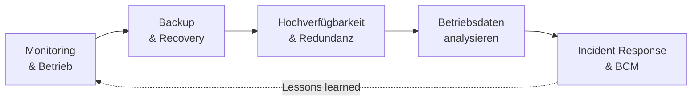

# Betrieb & Verfügbarkeit

Ein System zu planen und aufzubauen ist die eine Hälfte der Arbeit – die andere beginnt am Tag der Inbetriebnahme und hört nie wieder auf. Sobald eine Anlage produktiv läuft, willst du wissen, **ob sie gesund ist**, **was passiert, wenn etwas kaputtgeht** und **wie schnell du sie wieder ans Laufen bekommst**. In diesem Block geht es um genau diesen Dauerbetrieb: überwachen, sichern, ausfallsicher auslegen und im Ernstfall geordnet wiederherstellen.

Stell dir den Betrieb wie das Cockpit eines Flugzeugs vor. Niemand fliegt blind – es gibt Anzeigen für jeden wichtigen Wert, eine Warnung, bevor etwas kritisch wird, eine Checkliste für den Notfall und einen Ersatz für die Systeme, die nicht ausfallen dürfen. Genau diese vier Ideen ziehen sich durch alle Seiten hier.

!!! abstract "Was du in diesem Block lernst"
    - wie du den **laufenden Betrieb** überwachst: Metriken, Schwellwerte, Alarmierung und systematisches Troubleshooting
    - wie eine durchdachte **Backup- und Recovery-Strategie** aussieht – inklusive Wiederanlaufplan
    - was **Hochverfügbarkeit und Redundanz** bedeuten und mit welchen Mitteln man Ausfälle vermeidet
    - wie man **Betriebsdaten auswertet**, mit Sollwerten vergleicht und Abweichungen früh erkennt
    - wie **Incident Response** und **Business Continuity Management** dafür sorgen, dass der Betrieb auch im Krisenfall weiterläuft

---

## Wie wichtig ist dieser Block?

Prüfungsrelevant &nbsp; Dieser Block gehört zum **prüfungsrelevanten Kern**. Verfügbarkeit, Überwachung und Wiederherstellung sind das, woran man ein integriertes System im Alltag misst – und tauchen quer durch fast jede Aufgabe auf.

---

## Seiten in diesem Block

| Seite | Inhalt | Relevanz |
|-------|--------|----------|
| [Monitoring & Betrieb](monitoring.md) | Die vier Signale, aktiv/passiv und Black-Box/White-Box, Metriken, Logs & Traces, Schwellenwerte, Alarmierung & Alarmmüdigkeit, SNMP, Syslog & Flussdaten, Wartungsfenster, Patch- und Change-Prozess, Incident/Problem/Change | Prüfungsrelevant |
| [Backup & Recovery](backup-und-recovery.md) | Sicherungsarten, 3-2-1-Regel, Snapshots, unveränderliche Kopien, RTO & RPO, Restore-Test, Wiederanlaufplan, Rechte & Rollen | Prüfungsrelevant |
| [Hochverfügbarkeit & Redundanz](hochverfuegbarkeit.md) | Verfügbarkeit rechnen, Verfügbarkeitskette, SPOF, Redundanzarten, Cluster & Quorum, Notstrom, Georedundanz, SLA, Business Impact Analyse | Vertiefung |
| [Übungen: Verfügbarkeit & Datensicherung](uebungen-verfuegbarkeit.md) | Gruppenübung: Systemlandschaft bewerten, RTO & RPO festlegen, Verfügbarkeitskette rechnen, Redundanz- und Backupkonzept im Budget begründen | Gruppenarbeit |
| [Betriebsdaten analysieren](betriebsdaten-analysieren.md) | Betriebs-, Prozess- und Sensordaten, Zeitreihen & Aggregation, Datenqualität, Sollwert/Baseline/Benchmark, Perzentile statt Mittelwert, Trend & Korrelation, von der Abweichung zur Maßnahme | Vertiefung |
| [Incident Response & Business Continuity](incident-und-bcm.md) | Störung/Sicherheitsvorfall/Notfall, die sechs Phasen der Incident Response, Rollen & Kommunikationsplan, BCM mit Notfallhandbuch und Notbetrieb, BIA, Notfallübungen, KRITIS | Vertiefung |
| [Übung: Notfallübung](uebung-notfalluebung.md) | Tabletop-Übung: ein Störungsszenario spitzt sich über fünf Runden zum Notfall zu – entscheiden, informieren, dokumentieren. Mit Rundenkarten, Hilfekarten und Musterlösung | Gruppenarbeit |

---

## Roter Faden

Wir bauen das Bild **vom Normalbetrieb zum Krisenfall**: erst sehen, ob alles gesund läuft (Monitoring), dann absichern, dass Daten wiederherstellbar sind (Backup & Recovery), dann ganze Ausfälle vermeiden (Hochverfügbarkeit), dann aus den laufenden Daten lernen (Betriebsdaten) – und schließlich den Ernstfall geordnet durchstehen (Incident Response & BCM). Was wir dabei lernen, fließt zurück in besseres Monitoring. Der Kreis schließt sich.

---

## Wie hängt das mit den anderen Blöcken zusammen?

- **[IT-Sicherheit & Risiko](../it-sicherheit/index.md)** teilt sich mit diesem Block das Thema Verfügbarkeit. Ein Sicherheitsvorfall ist oft auch ein Verfügbarkeitsproblem – Incident Response und Wiederanlauf gehören eng zusammen.
- **[Virtualisierung](../virtualisierung/index.md)** liefert viele der Werkzeuge, mit denen Betrieb erst praktisch wird: Snapshots, Live-Migration und einfaches Hochfahren von Ersatzsystemen.
- **[Netzwerke](../netzwerke/index.md)** sind die Grundlage jeder Überwachung – ohne Wissen über Ports, Protokolle und Erreichbarkeit lässt sich kein Monitoring sinnvoll aufsetzen.

---

## Voraussetzungen

- Keine harten Vorkenntnisse. Wer den [Netzwerk-Block](../netzwerke/index.md) und die [Virtualisierung](../virtualisierung/index.md) kennt, versteht die technischen Werkzeuge schneller.
- Bereitschaft, in **Normalbetrieb und Ausnahmefall gleichzeitig** zu denken – also nicht nur "läuft", sondern auch "was, wenn nicht".

---

## Leitfrage

> **Ein zentraler Dienst fällt um 3 Uhr nachts aus – woher weiß ich davon, wie hole ich ihn zurück und wie hätte ich den Ausfall von vornherein verhindern können?**

Wer diese Frage ruhig und der Reihe nach beantworten kann – statt im Ernstfall zu raten – denkt wie jemand, der für einen stabilen Betrieb verantwortlich ist.
