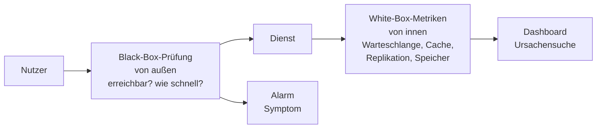
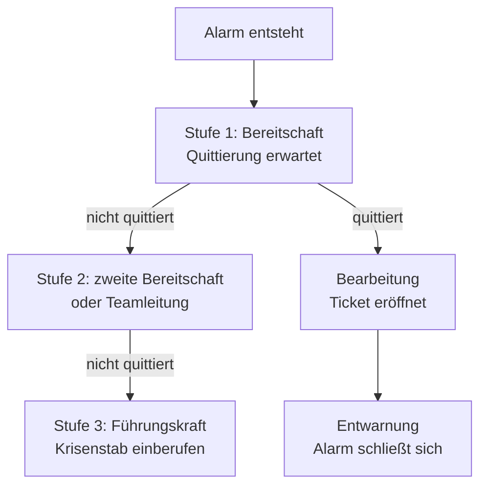
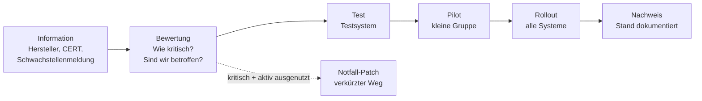
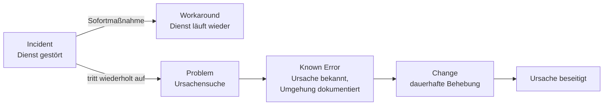

# Monitoring & Betrieb

Prüfungsrelevant &nbsp; Ein System, das niemand beobachtet, fällt nicht leiser aus – man merkt es nur später. Und meistens merkt es zuerst jemand, dem man es lieber selbst gesagt hätte.

Die unangenehmste Frage nach einem Ausfall ist selten „Warum ist es kaputtgegangen?“. Es ist die Frage: **„Seit wann?“** Wer sie nicht beantworten kann, weiß auch nicht, welche Aufträge betroffen sind, ab welchem Sicherungsstand er zurückspielen muss und ob dasselbe schon dreimal vorher passiert ist, ohne dass es jemand bemerkt hat.

Genau dort liegt aber auch das Missverständnis, an dem Monitoring-Projekte am häufigsten scheitern. Monitoring **erkennt**, es **verhindert nicht**. Es macht keinen Server schneller, kein Netz stabiler und keine Platte größer. Es verkürzt die Zeit zwischen „etwas stimmt nicht“ und „jemand tut etwas“. Das ist wenig und viel zugleich: Die Ausfalldauer ist bei fast jedem Vorfall die Größe, an der man am leichtesten drehen kann – und sie besteht zu einem erschreckend großen Teil aus der Zeit, in der niemand Bescheid wusste.

!!! abstract "Was du auf dieser Seite lernst"
    - was Monitoring leisten soll – und welche Erwartungen es systematisch enttäuscht
    - die **vier Signale** Latenz, Verkehr, Fehler und Sättigung als Rahmen für die Frage „Was messe ich überhaupt?“
    - den Unterschied zwischen **aktivem und passivem** sowie **Black-Box- und White-Box**-Monitoring
    - wofür **Metriken, Logs und Traces** jeweils taugen und warum keines die anderen ersetzt
    - wie man **Schwellenwerte** so setzt, dass sie warnen statt zu nerven – und was zu enge Schwellen anrichten
    - wie eine **Alarmierungsstrategie** mit Eskalationsstufen und Bereitschaft aussieht und wie man **Alarmmüdigkeit** vermeidet
    - die Protokolle darunter: **SNMP, Syslog und Flussdaten**
    - die Betriebsführung drumherum: **Wartungsfenster, Patchmanagement, Change-Prozess, Betriebshandbuch** – und die saubere Trennung von **Incident, Problem und Change**

!!! tip "Praxis dazu: der Monitoring-Block"
    Diese Seite erklärt das Denkmodell. Wie man ein Monitoring tatsächlich aufsetzt – mit **Prometheus und Grafana**, einem eigenen Dashboard und einem ausgelösten Alarm –, übst du im Block [Monitoring mit Prometheus & Grafana](../monitoring-praxis/index.md). Beides gehört zusammen: Hier lernst du, **was** du messen willst, dort **wie** du es misst.

---

## Was Monitoring leisten soll – und was nicht

Gutes Monitoring beantwortet drei Fragen, und zwar in dieser Reihenfolge:

1. **Läuft es?** Erfüllt der Dienst gerade das, wofür ihn die Nutzer brauchen?
2. **Wird es bald eng?** Zeigt irgendein Wert in eine Richtung, die in Tagen oder Wochen zum Problem wird?
3. **Wo klemmt es?** Wenn etwas nicht läuft: An welcher Stelle der Kette liegt es?

Die drei Fragen brauchen verschiedene Daten und verschiedene Zielgruppen. Frage 1 interessiert den Fachbereich und die Bereitschaft, Frage 2 die Planung, Frage 3 die Person, die gerade den Fehler sucht. Ein Monitoring, das alle drei in ein einziges Dashboard presst, beantwortet am Ende keine davon richtig.

Und dann gibt es die Erwartungen, die Monitoring **nicht** erfüllt:

| Erwartung | Warum sie enttäuscht wird |
|---|---|
| „Wenn wir alles überwachen, fällt nichts mehr aus.“ | Monitoring senkt nicht die Eintrittswahrscheinlichkeit, sondern die Ausfalldauer. Wer das verwechselt, rechnet sich Maßnahmen schön – siehe [Risikomanagement](../it-sicherheit/risikomanagement.md). |
| „Je mehr Metriken, desto besser.“ | Jede zusätzliche Metrik kostet Speicher, Pflege und Aufmerksamkeit. Metriken, die niemand ansieht und aus denen kein Alarm folgt, sind Datenmüll mit Wartungsvertrag. |
| „Das Monitoring sagt uns die Ursache.“ | Es sagt dir das **Symptom** und grenzt den Ort ein. Die Ursache findest du mit Logs, Traces und Nachdenken. |
| „Ein grünes Dashboard heißt, alles ist in Ordnung.“ | Es heißt: Alles, was überwacht wird, ist in Ordnung. Der gefährlichste Zustand ist ein Dienst, der gar nicht in der Überwachung steht. |

!!! warning "Die häufigste Lücke ist keine Metrik, sondern ein System"
    Ausfälle, die niemand rechtzeitig bemerkt, betreffen fast nie den zentralen Datenbankserver – der wird immer überwacht. Sie betreffen den Konverter, der nachts die Auftragsdatei zum Lieferanten schiebt, das Zertifikat des VPN-Gateways oder den kleinen Dienst, den vor Jahren jemand „nur für den Übergang“ aufgesetzt hat. Der erste Schritt zu brauchbarem Monitoring ist deshalb kein Werkzeug, sondern eine **vollständige Liste der Dienste** und die Frage, welcher Geschäftsprozess an jedem einzelnen hängt.

---

## Die vier Signale: Latenz, Verkehr, Fehler, Sättigung

Die Frage „Was soll ich eigentlich messen?“ erschlägt jeden Einstieg, weil ein modernes System zehntausende Werte liefern kann. Es gibt aber einen kleinen, erstaunlich tragfähigen Rahmen dafür: die **vier Signale** (englisch *the four golden signals*), die sich im Betrieb großer Dienste als das Minimum durchgesetzt haben, mit dem man einen Dienst sinnvoll beurteilen kann.

Stell dir eine Autobahn vor. Vier Angaben genügen, um zu sagen, ob sie gerade ihren Zweck erfüllt:

| Signal | Was es misst | Autobahn | Typisches Beispiel im Betrieb |
|---|---|---|---|
| **Latenz** | Wie lange dauert eine Anfrage? | Wie lange braucht eine Fahrt von A nach B? | Antwortzeit der Weboberfläche, Dauer eines Datenbankaufrufs |
| **Verkehr** | Wie viel Last kommt an? | Wie viele Fahrzeuge pro Stunde? | Anfragen pro Sekunde, Aufträge pro Stunde, Mbit/s auf der Leitung |
| **Fehler** | Wie viel davon geht schief? | Wie viele kommen nicht an oder fahren im Kreis? | HTTP-500-Rate, abgebrochene Aufträge, fehlgeschlagene Anmeldungen |
| **Sättigung** | Wie voll ist die Ressource? | Wie nah ist die Fahrbahn am Stau? | freier Plattenplatz, Warteschlangenlänge, belegter Arbeitsspeicher |

Der Rahmen ist so nützlich, weil er das Gespräch von den Geräten weg auf den **Dienst** lenkt. „Der Server läuft“ ist keine Aussage über Latenz, Verkehr, Fehler oder Sättigung. „Neunzig Prozent der Bestellvorgänge sind in unter 800 Millisekunden fertig, die Fehlerrate liegt bei 0,3 Prozent“ ist eine.

### Warum Sättigung das schwierigste der vier ist

Sättigung wird regelmäßig mit **Auslastung** verwechselt – und das sind zwei verschiedene Dinge. **Auslastung** sagt, welcher Anteil der Kapazität gerade benutzt wird: Die CPU ist zu 70 Prozent beschäftigt. **Sättigung** sagt, wie viel Arbeit sich davor **staut**, weil die Ressource nicht hinterherkommt: Vor der CPU warten im Mittel vier Prozesse auf einen Kern. Eine CPU bei 100 Prozent ohne Warteschlange ist ausgelastet, aber gesund – sie arbeitet genau das ab, was ankommt. Eine CPU bei 80 Prozent mit langer Warteschlange ist ein Problem, obwohl die Prozentzahl harmlos aussieht.

Praktisch heißt das: **Auslastung allein ist ein schlechter Alarmauslöser.** Interessant ist, ob Arbeit liegen bleibt – Warteschlangenlängen, Wartezeiten auf Ein- und Ausgabe, verworfene Pakete, volle Puffer. Und bei Speicherplatz ist das entscheidende Maß ohnehin nicht der Prozentwert, sondern die **verbleibende Zeit**: nicht „Platte zu 85 Prozent voll“, sondern „bei aktuellem Wachstum in elf Tagen voll“.

!!! tip "Zwei verwandte Merkschemata"
    Die **USE-Methode** (Utilization, Saturation, Errors) fragt für jede *Ressource* – CPU, Speicher, Platte, Netzwerkkarte – nach Auslastung, Sättigung und Fehlern; sie passt zur Infrastruktur. Die **RED-Methode** (Rate, Errors, Duration) fragt für jeden *Dienst* nach Durchsatz, Fehlerrate und Dauer; sie passt zu Anwendungen. Alle drei Schemata sind Auswahlhilfen: Sie sollen verhindern, dass du zwanzig Metriken über CPU-Details sammelst und keine einzige über die Antwortzeit.

---

## Von außen oder von innen, fragend oder wartend

Zwei Unterscheidungen bestimmen, **wie** die Daten überhaupt zustande kommen. Sie werden oft in einen Topf geworfen, meinen aber Verschiedenes.

### Aktiv oder passiv

**Aktives Monitoring** geht selbst hin und fragt nach. Ein Prüfsystem ruft in festem Takt eine Seite auf, öffnet einen Port, sendet einen Ping, fragt einen SNMP-Wert ab oder holt sich Messwerte von einem Endpunkt (im Fachjargon: *Polling* oder *Scraping*). Der Vorteil: Du weißt zu jedem Zeitpunkt, ob das Ziel antwortet – auch dann, wenn es gar nichts mehr von sich gibt. Das ist der entscheidende Punkt, denn **ein totes System schickt keine Fehlermeldung**.

**Passives Monitoring** wartet darauf, dass die Systeme sich melden: Syslog-Nachrichten, SNMP-Traps, Ereignisse aus einer Anwendung, Datensätze über Netzverkehr. Der Vorteil: Es erzeugt keine Last durch Nachfragen, es sieht auch seltene Ereignisse zwischen zwei Abfragen und liefert Details, die eine Abfrage nie bekäme. Der Nachteil: Stille ist mehrdeutig. Kommt nichts, ist entweder alles ruhig – oder die Meldekette ist kaputt.

Man braucht beides und behandelt Stille bewusst: Ein passiver Kanal bekommt eine **Lebendüberwachung** (englisch *Heartbeat*). Meldet sich eine Quelle länger als vereinbart überhaupt nicht, ist genau das der Alarm.

### Black-Box oder White-Box

**Black-Box-Monitoring** schaut von außen auf den Dienst, so wie ein Nutzer ihn erlebt: Ist die Anmeldeseite erreichbar? Lässt sich ein Testauftrag anlegen? Wie lange dauert das? Man weiß nichts über das Innenleben – und braucht es auch nicht, um zu sagen, ob es funktioniert. Black-Box-Prüfungen sind die ehrlichsten Alarme, die es gibt, weil sie exakt das messen, was der Fachbereich meint, wenn er sagt „es geht nicht“.

**White-Box-Monitoring** schaut ins Innere: Speichernutzung der Anwendung, Länge der Auftragswarteschlange, Trefferquote des Caches, Zustand der Replikation. Es sagt selten allein, ob der Dienst nutzbar ist – aber es sagt, **warum** nicht, und es sieht Entwicklungen, lange bevor sie außen sichtbar werden.

!!! tip "Die praktische Faustregel"
    **Alarmiere auf Symptome, diagnostiziere mit Interna.** Ein Alarm sollte fast immer aus einer Black-Box-Sicht kommen – „Bestellungen schlagen fehl“ –, weil das die Aussage ist, die eine Reaktion rechtfertigt. Die White-Box-Metriken gehören ins Dashboard daneben, damit die geweckte Person in zwei Minuten sieht, wo es hakt. Wer umgekehrt auf jeden internen Wert alarmiert, weckt Leute wegen Dingen, die niemand gemerkt hätte.

---

## Metriken, Logs und Traces

Drei Datenarten, drei verschiedene Fragen. Sie ersetzen einander nicht – wer nur eine davon hat, kann bestimmte Fragen prinzipiell nicht beantworten.

| | **Metriken** | **Logs** | **Traces** |
|---|---|---|---|
| **Was es ist** | Zahlenwerte über die Zeit, in festem Takt | Ereignisse als Text, mit Zeitstempel | der Weg **einer** Anfrage durch alle beteiligten Systeme |
| **Beantwortet** | Wie viel? Wie schnell? Seit wann? | Was genau ist passiert? | Wo im Ablauf ging die Zeit verloren? |
| **Stärke** | billig zu speichern, gut für Trends und Alarme | reich an Details, Kontext, Fehlermeldungen | zeigt Abhängigkeiten, die niemand aufgeschrieben hat |
| **Schwäche** | verliert Einzelfälle in der Verdichtung | teuer, unstrukturiert, wächst explosiv | Aufwand in der Anwendung, meist nur stichprobenweise |
| **Typisch für** | „Die Fehlerrate ist um 14 Prozent gestiegen.“ | „Verbindung zur Datenbank abgelehnt: zu viele Verbindungen.“ | „Von 900 ms entfallen 780 ms auf einen einzigen Aufruf.“ |

Der übliche Ablauf im Störungsfall nutzt alle drei nacheinander: Die **Metrik** löst den Alarm aus und sagt, seit wann. Der **Trace** zeigt, welcher Baustein die Zeit verbraucht oder den Fehler zurückgibt. Das **Log** dieses Bausteins liefert den Satz, aus dem hervorgeht, was konkret schiefgeht.

!!! warning "Logs sind das teuerste der drei"
    Logs wachsen mit dem Verkehr, nicht mit der Zeit: Ein Dienst, der pro Anfrage drei Zeilen schreibt, produziert bei zehnfacher Last zehnfach so viel Text. Daraus folgt zweierlei. Jedes Log braucht eine **Aufbewahrungsfrist**, die zum Zweck passt – wenige Tage für die Fehlersuche, deutlich länger für sicherheitsrelevante Protokolle, wo Nachvollziehbarkeit gefordert ist. Und in ein Log gehört alles, was zum Nachvollziehen nötig ist – nichts darüber hinaus. Personenbezogene Daten in Logfiles sind ein Datenschutzthema, kein Betriebsthema; die Regeln dazu stehen unter [Datenschutz](../recht-organisation/datenschutz-dsgvo.md).

---

## Schwellenwerte: der schwierigste Teil

Ein Alarm entsteht, wenn ein Wert eine Grenze überschreitet. Diese Grenze festzulegen ist die anspruchsvollste Aufgabe im ganzen Monitoring – und die einzige, bei der man mit gutem Willen mehr Schaden anrichtet als mit Nachlässigkeit.

### Statisch oder dynamisch

Ein **statischer Schwellenwert** ist eine feste Zahl: Plattenbelegung über 90 Prozent, Antwortzeit über zwei Sekunden, Temperatur über 27 Grad. Er ist nachvollziehbar und im Nachhinein prüfbar – jeder kann sagen, warum der Alarm kam. Er passt dort, wo es eine echte physikalische oder vertragliche Grenze gibt: Eine volle Platte ist voll, egal wie es letzte Woche war.

Ein **dynamischer Schwellenwert** vergleicht den aktuellen Wert mit dem, was zu dieser Zeit üblich ist: „mehr als das Doppelte des Mittelwerts der letzten vier gleichen Wochentage zur gleichen Stunde“. Er ist unverzichtbar bei Größen mit ausgeprägtem Tages- und Wochenrhythmus. Fünfzig Anmeldungen pro Minute sind am Montagmorgen normal und nachts ein Grund, genau hinzusehen. Ein statischer Wert kann diesen Unterschied nicht abbilden – er ist entweder morgens zu laut oder nachts zu blind.

| | statisch | dynamisch |
|---|---|---|
| **Grundlage** | eine festgelegte Zahl | der eigene historische Verlauf (Baseline) |
| **Stärke** | nachvollziehbar, sofort einsatzbereit | erkennt ungewöhnliches Verhalten statt nur hoher Werte |
| **Schwäche** | ignoriert Tages- und Wochenrhythmus | braucht Historie, erklärt sich schlechter, lernt auch Fehlzustände als „normal“ |
| **Gut geeignet für** | Plattenplatz, Temperatur, Zertifikatslaufzeit, vereinbarte Zielwerte | Verkehr, Anmeldungen, Auftragsvolumen, Antwortzeiten |

!!! danger "Der eingebaute Denkfehler dynamischer Schwellen"
    Ein dynamischer Schwellenwert lernt aus der Vergangenheit – auch aus einer schlechten. Läuft ein Dienst seit Wochen zu langsam, wird „zu langsam“ zur Normallage und der Alarm verstummt. Deshalb gehört neben jede dynamische Schwelle mindestens **eine harte statische Obergrenze**, die aus der Anforderung stammt und nicht aus der Messung. Die Baseline sagt, was üblich ist. Der Sollwert sagt, was zulässig ist. Das sind zwei verschiedene Aussagen – mehr dazu unter [Betriebsdaten analysieren](betriebsdaten-analysieren.md).

### Warum zu enge Schwellen schaden

Der Reflex bei der Einrichtung ist, lieber zu früh zu warnen als zu spät. Das Ergebnis ist ein Monitoring, das den ganzen Tag piept. Und ein Monitoring, das den ganzen Tag piept, wird abgeschaltet – wenn nicht im Werkzeug, dann im Kopf.

Vier Stellschrauben machen aus einer wackeligen Schwelle einen brauchbaren Alarm:

- **Dauer statt Moment.** Ein Wert muss die Grenze nicht einmal, sondern **über eine Zeitspanne** überschreiten. „CPU über 90 Prozent“ ist Rauschen. „CPU über 90 Prozent für zehn Minuten“ ist ein Zustand. Jeder Backup-Lauf und jeder Virenscan erzeugt kurze Spitzen, die niemanden interessieren.
- **Zwei Stufen.** Eine **Warnschwelle**, die tagsüber in ein Ticket läuft, und eine **kritische Schwelle**, die jemanden weckt. Der Unterschied zwischen beiden ist nicht die Zahl, sondern die Frage: Muss das jetzt jemand ansehen oder morgen früh?
- **Rückschaltpunkt (Hysterese).** Der Alarm geht bei 90 Prozent an und erst bei 80 Prozent wieder aus. Sonst flattert ein Wert, der um die Grenze pendelt, im Minutentakt zwischen Alarm und Entwarnung – das ist die häufigste Quelle nächtlicher Meldungsfluten.
- **Der Anwendungsfall statt der Bauteilwert.** Nicht „Warteschlange länger als 100“, sondern „Aufträge älter als 15 Minuten unbearbeitet“. Der zweite Alarm bleibt richtig, auch wenn sich die Anlage verdoppelt.

!!! example "Dieselbe Platte, drei Schwellen"
    Ein Dateiserver hat 4 TB, der Bestand wächst um rund 20 GB pro Woche. Bei 85 Prozent Belegung sind 600 GB frei – das reicht rechnerisch für 30 Wochen. Ein Alarm bei 85 Prozent weckt also jemanden für ein Problem, das ein halbes Jahr Zeit hat.

    Sinnvoll wäre stattdessen: **Warnung**, wenn der freie Platz rechnerisch für weniger als 60 Tage reicht (Ticket, planbar). **Kritisch**, wenn er für weniger als 7 Tage reicht (Bereitschaft). Und zusätzlich eine harte Grenze bei 95 Prozent, weil manche Dateisysteme und Datenbanken dicht davor unangenehm werden. Aus einer Prozentzahl sind drei Aussagen mit unterschiedlicher Dringlichkeit geworden – und keine davon reißt nachts jemanden aus dem Bett, der ohnehin nichts tun könnte.

---

## Alarmierung: wer wird wann geweckt

Ein Alarm ist keine Information, sondern eine **Aufforderung zu handeln**. Aus diesem einen Satz folgt die gesamte Alarmierungsstrategie. Bevor ein Alarm eingerichtet wird, müssen drei Fragen beantwortet sein:

1. **Merkt es jemand?** Wenn niemand außerhalb der IT etwas davon hätte, ist es kein Alarm, sondern ein Ticket.
2. **Kann jemand etwas tun?** Ein Alarm über eine Störung beim Netzbetreiber, gegen die man nichts unternehmen kann, weckt Leute für nichts.
3. **Muss es jetzt sein?** Alles, was bis zum nächsten Arbeitstag warten kann, wartet bis zum nächsten Arbeitstag.

Wenn eine der drei Antworten „nein“ lautet, gehört die Meldung in ein Dashboard oder eine Ticketwarteschlange – nicht auf ein Telefon.

### Eskalationsstufen und Meldewege

Eine Alarmierung, die nur einen Empfänger kennt, funktioniert genau so lange, wie dieser Empfänger erreichbar ist. Deshalb arbeitet man mit Stufen:

Drei Details werden dabei gern vergessen:

- Die **Quittierung** ist Teil des Verfahrens, nicht Höflichkeit. Erst wenn jemand bestätigt hat, dass er sich kümmert, gilt der Alarm als angenommen. Ohne Quittierung läuft die Zeit weiter und die nächste Stufe greift.
- Der **Meldeweg** braucht einen zweiten Kanal auf anderer Technik. Wer Alarme nur per E-Mail verschickt, bekommt beim Ausfall des Mailsystems keine Meldung über den Ausfall des Mailsystems – ein klassischer Konstruktionsfehler.
- Die **Bereitschaft** ist eine Vereinbarung mit Menschen, nicht mit Systemen: Wer hat wann Dienst, welche Reaktionszeit ist zugesagt, wie wird sie vergütet, wer vertritt bei Krankheit? Ein Bereitschaftsplan ohne verbindliche Vertretung ist ein Plan für den Normalfall – und der braucht keine Bereitschaft.

### Alarmmüdigkeit

Auf Intensivstationen ist das Phänomen bestens dokumentiert: Wenn Geräte ständig Alarm schlagen und die allermeisten dieser Alarme folgenlos bleiben, reagiert das Personal messbar langsamer – auch auf die echten. Man nennt das **Alarmmüdigkeit** (englisch *alert fatigue*), und in der IT verhält es sich exakt genauso.

Die Ursache ist selten böser Wille, sondern eine schleichende Ansammlung: Jeder einzelne Alarm wurde einmal aus gutem Grund eingerichtet, keiner wurde je wieder entfernt. Irgendwann kommen zweihundert Meldungen pro Woche, von denen fünf wichtig sind – und niemand kann vorher wissen, welche fünf.

!!! danger "Woran du Alarmmüdigkeit erkennst"
    - Es gibt eine Mailregel, die Monitoring-Meldungen automatisch in einen Ordner sortiert.
    - Auf die Frage „Was war das für ein Alarm?“ kommt die Antwort „Ach, der kommt immer.“
    - Es existiert eine mündlich überlieferte Liste von Alarmen, die man ignorieren darf.
    - Ein echter Vorfall wurde nachträglich in den Meldungen der letzten Nacht gefunden – er stand da, aber niemand hatte ihn gesehen.

Dagegen hilft ein unbequemes, aber wirksames Vorgehen. Jeder Alarm bekommt eine **Zuständigkeit** und eine **Handlungsanweisung**: Was ist zu tun, wenn er kommt? Existiert diese Anweisung nicht, ist der Alarm kein Alarm. Regelmäßig wird ausgewertet, welche Alarme wie oft ausgelöst haben und wie oft daraus eine Handlung folgte; alles, was folgenlos blieb, wird in der Schwelle angepasst, zum Ticket herabgestuft oder abgeschaltet. Zusammengehörige Meldungen werden zu **einer** gebündelt: Fällt ein Switch aus, meldet der Switch – nicht vierzig dahinterliegende Geräte einzeln. Und geplante Arbeiten laufen in einem **Wartungsfenster**, in dem die Alarmierung für die betroffenen Systeme stummgeschaltet ist.

!!! quote "Der Maßstab"
    Ein Alarm, auf den niemand reagiert, ist schlimmer als kein Alarm – er kostet Aufmerksamkeit und erzeugt das Gefühl, informiert zu sein. **Weniger Alarme, die jedes Mal stimmen, schlagen viele Alarme, die manchmal stimmen.**

---

## Die Protokolle darunter

Monitoring-Werkzeuge kommen und gehen, aber unter der Oberfläche liegen seit Jahrzehnten dieselben drei Verfahren. Wer sie kennt, findet sich in jedem Werkzeug zurecht.

### SNMP – der Klassiker für Geräte

**SNMP** (Simple Network Management Protocol) ist die Standardsprache für Netzwerk- und Infrastrukturgeräte: Switches, Router, Firewalls, unterbrechungsfreie Stromversorgungen, Drucker, Klimageräte. Auf dem Gerät läuft ein **Agent**, der Messwerte bereithält; das Monitoring-System fragt sie ab. Jeder Wert hat eine eindeutige Nummer, die **OID** (Object Identifier); welche OIDs ein Gerät kennt, steht in seiner **MIB** (Management Information Base).

SNMP kann beide Richtungen: Das Monitoring-System fragt **aktiv** ab (Polling, üblicherweise über UDP-Port 161) – oder das Gerät meldet sich von sich aus mit einem **Trap** (Port 162), etwa wenn eine Stromversorgung auf Batterie umschaltet. Traps sind schnell, aber unzuverlässig: Sie werden abgeschickt und nicht bestätigt, ein verlorenes Paket ist verloren. Die Variante **Inform** verlangt eine Bestätigung und schließt diese Lücke.

!!! warning "SNMP-Versionen sind ein Sicherheitsthema"
    Die Versionen **v1** und **v2c** authentifizieren mit einer sogenannten **Community**, die im Klartext über das Netz geht – faktisch ein mitlesbares Passwort. Wer sie einsetzt, gehört auf ein getrenntes Management-Netz, und wenigstens die Voreinstellungen `public` und `private` müssen weg. **v3** bietet Authentifizierung und Verschlüsselung und ist die einzige Version, die man außerhalb geschützter Netze verantworten kann. Zum Trennen von Management- und Nutzverkehr siehe [Segmentierung & VPN](../netzwerke/segmentierung-und-vpn.md).

### Syslog – der Sammelpunkt für Ereignisse

**Syslog** ist der Standard, mit dem Systeme Ereignismeldungen an eine zentrale Stelle schicken – klassisch über UDP-Port 514, heute meist über TCP mit Transportverschlüsselung. Jede Meldung trägt eine **Facility** (welcher Teil des Systems meldet) und eine **Severity**, die achtstufige Dringlichkeit:

| Stufe | Bezeichnung | Bedeutung |
|---|---|---|
| 0 | Emergency | System unbenutzbar |
| 1 | Alert | sofortiges Eingreifen nötig |
| 2 | Critical | kritischer Zustand |
| 3 | Error | Fehler aufgetreten |
| 4 | Warning | Warnung, noch kein Fehler |
| 5 | Notice | bemerkenswert, aber normal |
| 6 | Informational | reine Information |
| 7 | Debug | Details zur Fehlersuche |

Der eigentliche Gewinn ist nicht das Format, sondern die **Zentralisierung**. Logs, die nur auf dem betroffenen System liegen, sind genau dann weg, wenn man sie am dringendsten braucht – nach einem Totalausfall oder nach einem Angriff, bei dem der Angreifer aufgeräumt hat. Ein zentraler, schreibgeschützter Sammelpunkt ist deshalb Betriebs- **und** Sicherheitsmaßnahme; die forensische Seite steht unter [Beweissicherung](../it-sicherheit/beweissicherung-und-praevention.md).

### Flussdaten – wer redet mit wem

Metriken sagen, wie viel Verkehr über eine Leitung geht. **Flussdaten** sagen, **woraus** er besteht. Ein Netzgerät fasst zusammengehörige Pakete zu einem *Flow* zusammen – im Kern das Fünf-Tupel aus Quell-IP, Ziel-IP, Quell-Port, Ziel-Port und Protokoll – und meldet Datensätze über Dauer, Byte- und Paketzahl an einen Sammler (**Collector**). **NetFlow** stammt von Cisco, **IPFIX** ist die herstellerneutrale Standardisierung desselben Gedankens, **sFlow** arbeitet mit **Stichproben**: Es kopiert jedes n-te Paket, statt vollständige Flüsse zu bilden. Für Mengenverhältnisse reicht das, für eine lückenlose Nachverfolgung nicht.

Flussdaten beantworten Fragen, die keine andere Quelle beantwortet: Welche Anwendung hat die Leitung nachts vollgemacht? Redet ein Gerät im Produktionsnetz plötzlich mit einer Adresse im Internet? Datenschutzrechtlich sind sie heikel, weil sich aus IP-Adressen und Zeitpunkten Verhalten rekonstruieren lässt – Zweck und Aufbewahrungsfrist gehören schriftlich festgelegt.

---

## Betriebsführung: was um das Monitoring herum organisiert sein muss

Monitoring liefert Signale. Was daraus wird, entscheidet die Betriebsorganisation. Vier Bausteine bilden ihr Gerüst.

### Wartungsfenster

Ein **Wartungsfenster** ist ein vereinbarter Zeitraum, in dem Eingriffe zulässig sind und der Dienst eingeschränkt sein darf. Es hat drei Funktionen, von denen nur die erste offensichtlich ist: Es schafft **Planbarkeit** für den Fachbereich, es nimmt die **Ausfallzeit aus der Verfügbarkeitsrechnung** heraus – geplante Wartung zählt üblicherweise nicht als Ausfall, wenn das so vereinbart ist – und es **schaltet die Alarmierung** für die betroffenen Systeme stumm, damit die Bereitschaft nicht wegen der eigenen Arbeiten geweckt wird.

Entscheidend ist, was in der Vereinbarung steht: Wer darf das Fenster nutzen, wie lange vorher wird angekündigt, bis wann muss der Dienst wieder laufen – und ab welchem Zeitpunkt wird zurückgebaut, wenn er es nicht tut. Dieser letzte Punkt, der **Umkehrpunkt**, ist der wichtigste. Ohne ihn arbeitet ein Team im Morgengrauen noch an einer Migration, die Stunden zuvor hätte abgebrochen werden müssen.

### Patchmanagement

Patchmanagement ist der Dauerkonflikt zwischen zwei richtigen Anliegen: Sicherheitslücken sollen schnell geschlossen werden, und der Betrieb soll stabil bleiben. Auflösen lässt sich das nur durch **Einstufung** und **Staffelung**.

Zur Bewertung dient meist eine Schweregrad-Kennzahl wie **CVSS**, die einer Schwachstelle einen Wert von 0,0 bis 10,0 gibt. Sie ist eine Hilfe, aber kein Urteil: Eine kritisch bewertete Lücke in einem Dienst, den ihr gar nicht einsetzt oder der von außen nicht erreichbar ist, ist für euch weniger dringend als eine mittlere Lücke in eurem Fernzugang. **Die Frage ist immer: Sind wir betroffen, und wie leicht?**

Zwei Punkte gehören verbindlich geregelt: für jede Einstufung eine **Frist**, innerhalb derer gepatcht sein muss – und ein **Rückweg**, also die Antwort darauf, wie man den Zustand von vorher wiederherstellt, wenn der Patch etwas kaputtmacht. Snapshot vor dem Eingriff, geprüfte Sicherung, dokumentierte Vorgängerversion. Wer keinen Rückweg hat, patcht nicht, sondern wettet – siehe [Backup & Recovery](backup-und-recovery.md).

### Der Change-Prozess

Jede geplante Änderung an einem produktiven System ist ein **Change**: **beantragen** (was, warum, welche Systeme), **bewerten** (Risiko, Auswirkung, Zeitpunkt), **freigeben** (durch eine Stelle, die nicht die durchführende ist), **durchführen**, **prüfen**, **dokumentieren**. Üblich ist die Unterscheidung in drei Arten:

| Change-Art | Was gemeint ist | Freigabe |
|---|---|---|
| **Standard** | wiederkehrend, risikoarm, Ablauf vorab beschrieben – etwa ein Benutzerkonto anlegen | vorab generell freigegeben |
| **Normal** | alles Übrige: geplant, bewertet, terminiert | Einzelfreigabe, meist in einem Gremium |
| **Notfall (Emergency)** | zur Behebung einer laufenden Störung, kann nicht warten | verkürzt, aber **nachträglich vollständig dokumentiert** |

!!! warning "Der Notfall-Change ist kein Freibrief"
    Die Abkürzung betrifft nur die Freigabe, nicht die Dokumentation. Was während einer Störung geändert wurde, muss hinterher genauso im Änderungsverzeichnis stehen wie jede geplante Änderung – sonst weiß beim nächsten Vorfall niemand mehr, in welchem Zustand das System eigentlich ist. Die häufigste Ursache für unerklärliche Systemzustände ist eine Reihe undokumentierter Notfalländerungen.

### Das Betriebshandbuch

Das **Betriebshandbuch** beantwortet eine einzige Frage: Was muss jemand wissen, der diesen Dienst betreuen soll und ihn nicht gebaut hat? Es ist kein Prosatext, sondern eine Sammlung nachschlagbarer Angaben – **Zweck und Abhängigkeiten** (welcher Geschäftsprozess hängt daran, wovon hängt der Dienst ab), **Architektur und Zugänge**, **Regelbetrieb** (wiederkehrende Aufgaben, Prüfungen, Sicherungsläufe), **Überwachung** (welche Alarme es gibt und was bei jedem zu tun ist), **Wiederanlauf** (Reihenfolge beim Hochfahren, Prüfschritte danach) und **Kontakte** samt Vertretung, Hersteller und zugesagten Reaktionszeiten.

Der Nutzen entsteht nicht beim Schreiben, sondern beim **Prüfen**: Ein Betriebshandbuch ist genau so viel wert wie sein letzter Test durch jemanden, der es nicht geschrieben hat. Genau dafür sind Notfallübungen da – siehe [Incident Response & Business Continuity](incident-und-bcm.md).

---

## Incident, Problem und Change sauber trennen

Diese drei Begriffe stammen aus **ITIL**, dem verbreitetsten Rahmenwerk für IT-Servicemanagement. Sie werden im Alltag ständig durcheinandergeworfen – dabei ist die Unterscheidung nicht Wortklauberei, sondern entscheidet darüber, **wer was bis wann tut**.

| Begriff | Definition | Ziel | Erfolgsmaß |
|---|---|---|---|
| **Incident** (Störung) | eine ungeplante Unterbrechung oder Qualitätsminderung eines Dienstes | den Dienst so schnell wie möglich wiederherstellen | Dauer bis zur Wiederherstellung |
| **Problem** | die Ursache einer oder mehrerer Störungen – bekannt oder noch unbekannt | die Ursache finden und dauerhaft beseitigen | Anzahl der dadurch verhinderten Störungen |
| **Change** | eine geplante Änderung an einem Dienst oder seiner Umgebung | die Änderung mit möglichst geringem Risiko umsetzen | Anteil störungsfreier Changes |

Der Zusammenhang in einem Satz: **Ein Incident wird behoben, ein Problem wird gelöst, ein Change wird umgesetzt.** Beim Incident zählt Geschwindigkeit, beim Problem Gründlichkeit, beim Change Sorgfalt.

Ein Beispiel macht den Unterschied greifbar. Ein Anwendungsserver hängt sich jeden Montagmorgen auf; ein Neustart hilft. Der **Incident** ist der aufgehängte Server, die Behebung der Neustart, das Erfolgsmaß zwanzig Minuten Ausfall. Das **Problem** ist die Frage, warum das jeden Montag passiert – und die Antwort, dass ein Wochenendlauf Datenbankverbindungen nicht freigibt, bis der Vorrat erschöpft ist. Solange die Ursache bekannt, aber nicht beseitigt ist, heißt das **Known Error**; die dokumentierte Umgehung ist dann kein Pfusch, sondern ein bewusst festgehaltener Zwischenstand. Der **Change** ist die Korrektur im Wochenendlauf – geplant, getestet, freigegeben.

!!! danger "Das Muster, an dem man den fehlenden Problem-Prozess erkennt"
    Wenn ein Team montags routiniert einen Server neu startet und niemand mehr fragt, warum, dann ist der Incident-Prozess hervorragend eingespielt und der Problem-Prozess existiert nicht. Das fällt lange nicht auf, weil jede einzelne Störung schnell behoben wird. Die Kennzahl, die es sichtbar macht, ist die **Wiederholungsrate**: Wie viele Störungen dieser Woche sehen aus wie Störungen der letzten? Alles, was sich wiederholt, ist ein Problem, das noch niemand angefasst hat.

---

## Was du jetzt wissen solltest

- Monitoring **erkennt**, es verhindert nicht. Es wirkt auf die **Ausfalldauer**, nicht auf die Eintrittswahrscheinlichkeit.
- Die **vier Signale** Latenz, Verkehr, Fehler und Sättigung sind der kleinste sinnvolle Satz Messgrößen für einen Dienst. **Sättigung** ist nicht Auslastung – sie fragt, ob Arbeit liegen bleibt.
- **Aktiv** heißt nachfragen, **passiv** heißt auf Meldungen warten. Passive Kanäle brauchen zusätzlich eine Lebendüberwachung, weil Stille mehrdeutig ist.
- **Black-Box** sieht den Dienst wie ein Nutzer, **White-Box** sein Innenleben: Alarmiere auf Symptome, diagnostiziere mit Interna.
- **Metriken** zeigen Verläufe, **Logs** liefern Details, **Traces** den Weg einer Anfrage. Keines ersetzt die anderen.
- **Statische Schwellen** passen zu harten Grenzen, **dynamische** zu Größen mit Tages- und Wochenrhythmus – letztere brauchen zusätzlich eine harte Obergrenze, weil sie sonst schlechte Zustände als normal lernen.
- Zu enge Schwellen erzeugen **Alarmmüdigkeit**, und die kostet Reaktionszeit auch bei echten Vorfällen. Dauerbedingung, zwei Stufen, Hysterese und Meldungsbündelung sind die Gegenmittel.
- Jeder Alarm braucht **Zuständigkeit und Handlungsanweisung**. Fehlt eine davon, ist es ein Ticket, kein Alarm.
- **SNMP** fragt Geräte ab (v3 wegen Verschlüsselung), **Syslog** sammelt Ereignisse zentral, **Flussdaten** zeigen, wer mit wem redet.
- **Incident** heißt wiederherstellen, **Problem** heißt Ursache beseitigen, **Change** heißt geplant ändern. Eine hohe Wiederholungsrate ist das Zeichen für einen fehlenden Problem-Prozess.

---

## Beispielfragen zur Selbstkontrolle

??? question "Frage 1: Ein Kollege schlägt vor, auf jedem Server bei über 80 Prozent CPU-Auslastung einen Alarm auszulösen. Was hältst du davon?"
    Wenig – aus drei Gründen.

    Erstens misst der Vorschlag **Auslastung statt Sättigung**. Eine CPU bei 85 Prozent, die alle Anfragen zügig abarbeitet, ist ein gut ausgelastetes System, kein Problem. Interessant ist erst, ob Arbeit liegen bleibt.

    Zweitens fehlt die **Dauerbedingung**. Jeder Sicherungslauf und jeder Virenscan erzeugt Spitzen über 80 Prozent. Ohne die Bedingung „für mindestens zehn Minuten“ produziert der Alarm täglich Meldungen ohne Handlung – der direkte Weg in die Alarmmüdigkeit.

    Drittens ist es ein **White-Box-Wert als Alarm**. Die Frage, die eine Reaktion rechtfertigt, lautet nicht „Ist die CPU beschäftigt?“, sondern „Erfüllt der Dienst noch seinen Zweck?“ Der Alarm gehört an die Antwortzeit oder die Fehlerrate; die CPU-Kurve gehört ins Dashboard daneben.

    Bessere Formulierung: Alarm, wenn das 95. Perzentil der Antwortzeit über zehn Minuten hinweg den vereinbarten Zielwert überschreitet – ergänzt um eine Warnung, wenn die CPU-Warteschlange dauerhaft wächst.

??? question "Frage 2: Ihr verschickt alle Monitoring-Alarme per E-Mail an einen Verteiler. Welche zwei Schwächen hat das und wie behebst du sie?"
    **Schwäche 1 – die Rückkopplung.** Fällt das Mailsystem, die Leitung oder der Verzeichnisdienst aus, kommt ausgerechnet über diesen Ausfall keine Meldung an. Der Meldeweg hängt an derselben Technik, die er überwachen soll. Abhilfe: ein zweiter Kanal auf anderer Technik – SMS oder Anruf über Mobilfunk, eine externe Alarmierungsplattform – und eine **Lebendüberwachung** von außen, die anschlägt, wenn das Monitoring selbst schweigt.

    **Schwäche 2 – der Verteiler.** Ein Verteiler adressiert alle und damit niemanden: keine Quittierung, also weiß niemand, ob sich jemand kümmert; keine Eskalation, wenn niemand reagiert. Klassische Folge: Drei Personen sehen den Alarm, jede nimmt an, eine der beiden anderen macht schon. Abhilfe: ein **Bereitschaftsplan** mit einer namentlich zuständigen Person je Zeitraum, **Quittierungspflicht** und eine **Eskalationskette**. Alles, was nicht sofort bearbeitet werden muss, geht gar nicht erst in die Alarmierung, sondern in die Ticketwarteschlange.

??? question "Frage 3: Die Geschäftsführung fragt, warum ihr eine Störung erst aus einem Anruf des Vertriebs erfahren habt, obwohl es doch ein Monitoring gibt. Wie erklärst du das – und was schlägst du vor?"
    Die ehrliche Erklärung lautet fast immer: Der Dienst wurde überwacht, aber nicht aus der Sicht des Nutzers. Alle Einzelteile meldeten „grün“ – Server erreichbar, Datenbank verbunden, CPU unauffällig –, während der **fachliche Ablauf** trotzdem nicht funktionierte, etwa weil eine Schnittstelle Aufträge annahm, aber nicht weiterreichte.

    Der Vorschlag besteht aus drei Teilen. Erstens eine **Black-Box-Prüfung**, die den Geschäftsvorfall nachstellt: regelmäßig einen Testauftrag anlegen und prüfen, ob er im Zielsystem ankommt. Solche synthetischen Prüfungen treffen exakt dieselbe Aussage wie der Anrufer. Zweitens eine **Altersüberwachung** für Warteschlangen: Alarm, wenn ein Auftrag länger als vereinbart unbearbeitet liegt – das erkennt genau den Fall „nimmt an, macht aber nichts“. Drittens eine **Bestandsaufnahme**: Für jeden Geschäftsprozess wird aufgeschrieben, welche technischen Bausteine dazugehören und welcher davon überwacht ist. Die Lücken dieser Liste sind die nächsten Prüfungen.

??? question "Frage 4: Was ist der Unterschied zwischen einem Incident und einem Problem – und warum darf man den Problem-Prozess nicht weglassen?"
    Ein **Incident** ist die ungeplante Unterbrechung oder Qualitätsminderung eines Dienstes. Sein Ziel ist die schnelle Wiederherstellung; ein Workaround, der den Dienst zurückbringt, ist ein voller Erfolg, auch wenn niemand die Ursache kennt.

    Ein **Problem** ist die Ursache hinter einem oder mehreren Incidents. Sein Ziel ist die dauerhafte Beseitigung. Ist die Ursache gefunden, aber noch nicht behoben, spricht man von einem **Known Error** mit dokumentierter Umgehung.

    Weglassen darf man den Problem-Prozess nicht, weil ein rein incidentgetriebener Betrieb dieselben Störungen unbegrenzt oft behebt, ohne dass sie weniger werden. Das fällt lange nicht auf – jede einzelne Störung wird ja schnell erledigt –, kostet aber dauerhaft Personalzeit und lässt die Anlage schleichend instabiler werden. Der Indikator ist die **Wiederholungsrate**: Sobald sich Störungen ähneln, gehört ein Problem-Eintrag angelegt und mit einem Termin versehen.

??? question "Frage 5: Warum reicht es nicht, ein Wartungsfenster nur anzukündigen – was gehört noch in die Vereinbarung?"
    Die Ankündigung regelt nur den Anfang. Vier weitere Punkte gehören dazu:

    - **Umfang und Auswirkung**: Welche Dienste sind betroffen und in welchem Maß – ganz weg, langsamer, nur lesend?
    - **Alarmunterdrückung**: Für die betroffenen Systeme wird die Alarmierung gezielt stummgeschaltet – und danach nachweislich wieder eingeschaltet. Ein vergessener stummer Alarm ist eine der unangenehmsten Fehlerquellen überhaupt.
    - **Umkehrpunkt**: der Zeitpunkt, ab dem zurückgebaut statt weitergearbeitet wird. Ohne ihn läuft eine misslungene Änderung in den Produktivbetrieb hinein.
    - **Abnahme**: Wer prüft mit welchen Schritten, dass der Dienst wieder vollständig funktioniert, und wer gibt frei? „Sieht gut aus“ ist keine Abnahme.

??? question "Frage 6: Eine Fachabteilung verlangt einen Alarm, sobald eine bestimmte Auswertung länger als drei Sekunden braucht. Wie gehst du damit um?"
    Nicht mit einem Nein, sondern mit den drei Alarmfragen. **Merkt es jemand?** Ja, die Auswertung wird täglich benutzt. **Kann jemand etwas tun?** Nachts nicht – sie wird zu Bürozeiten aufgerufen. **Muss es jetzt sein?** Nein, sofern es Einzelfälle sind.

    Der Wunsch ist also berechtigt, aber es ist kein Bereitschaftsalarm. Sinnvoll ist eine Aufteilung: ein schriftlich vereinbarter **Zielwert** wie „95 Prozent der Aufrufe unter drei Sekunden“ – gemessen wird ein Perzentil, nicht der Einzelfall, weil ein einzelner langsamer Aufruf nichts über die Nutzbarkeit sagt. Eine **Warnung** öffnet zu Bürozeiten ein Ticket, wenn dieser Zielwert über längere Zeit gerissen wird. Ein **kritischer Alarm** greift erst, wenn die Auswertung gar nicht mehr antwortet. Und der Verlauf landet auf einem Dashboard, das die Fachabteilung selbst einsehen kann – oft ist genau das der eigentliche Wunsch hinter der Forderung nach einem Alarm.

---

## Merksatz

!!! success "Merksatz"
    > **Monitoring verhindert nichts – es verkürzt die Zeit bis zur Reaktion. Miss vier Signale: Latenz, Verkehr, Fehler, Sättigung. Alarmiere auf Symptome von außen, diagnostiziere mit Werten von innen. Jeder Alarm braucht eine Person und eine Handlungsanweisung; wer beides nicht hat, hat kein Alarm, sondern ein Geräusch. Und drei Wörter bleiben getrennt: Incident wiederherstellen, Problem beseitigen, Change planen.**

---

## Weiterlesen

- [Betriebsdaten analysieren](betriebsdaten-analysieren.md): was aus den gesammelten Zahlen wird – Baseline, Perzentile, Trends und der Weg von der Abweichung zur Maßnahme
- [Incident Response & Business Continuity](incident-und-bcm.md): was passiert, wenn aus einem Alarm ein Vorfall wird
- [Backup & Recovery](backup-und-recovery.md): der Rückweg, ohne den kein Patch und kein Change verantwortbar ist
- [Hochverfügbarkeit & Redundanz](hochverfuegbarkeit.md): wie man Ausfälle gar nicht erst sichtbar werden lässt
- [Monitoring mit Prometheus & Grafana](../monitoring-praxis/index.md): der Praxisblock – Werkzeuge installieren, Dashboard bauen, Alarm auslösen
- [Risikomanagement](../it-sicherheit/risikomanagement.md): warum Monitoring die Schadenshöhe senkt und nicht die Eintrittswahrscheinlichkeit
