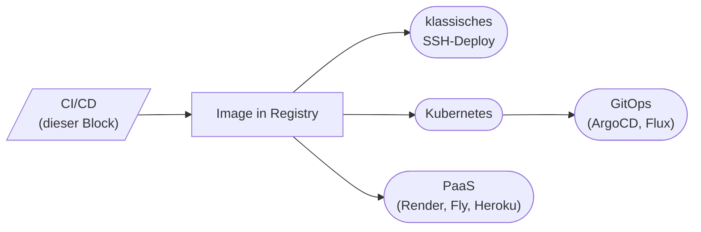

# Ausblick: wie geht's weiter?

In diesem Block hast du eine Pipeline gebaut, die ein Image **bis in eine Registry** liefert. Die nächste, ehrliche Frage ist: **„Und wie kommt das Image jetzt automatisch auf einen Server?"**

Diese Seite gibt dir einen ehrlichen Überblick über die Optionen – ohne Einzelne abzuschließen, sondern als **Landkarte** für das, was nach Block 6 kommen kann.



---

## Option 1: Klassisches SSH-Deploy

> **Du hast einen VPS. Compose ist dein Stack-Manager. Pipeline pusht das Image, dann via SSH `pull` + `up -d`.**

### Wie das im Workflow aussieht

```yaml
- name: Deploy via SSH
  uses: appleboy/ssh-action@v1.2.0
  with:
    host: ${{ secrets.DEPLOY_HOST }}
    username: ${{ secrets.DEPLOY_USER }}
    key: ${{ secrets.DEPLOY_SSH_KEY }}
    script: |
      cd /srv/app
      docker compose pull
      docker compose up -d
```

### Wann das passt

- **Ein bis drei Server**, Single-Region.
- **Compose** als Stack-Manager.
- **Keine** strengen Verfügbarkeitsanforderungen.

### Wann nicht

- Mehrere Server oder mehrere Regionen → Drift zwischen Hosts wird schmerzhaft.
- Hohe Verfügbarkeit → kein eingebautes Rolling-Update mit Compose.
- Compliance → SSH-Keys, die in Pipelines hängen, sind ein Audit-Thema.

---

## Option 2: Kubernetes

> **Statt einzelner Server hast du ein Cluster. Kubernetes orchestriert Pods auf allen Knoten, macht Rolling Updates und Healthchecks von Haus aus.**

### Was sich ändert gegenüber Compose

| Konzept | Compose | Kubernetes |
|---------|---------|------------|
| Service-Definition | `compose.yaml` | `Deployment`, `Service`, `Ingress` (mehrere YAMLs) |
| Update-Modus | „stop, start" pro Service | Rolling Update standardmäßig |
| Healthchecks | im Compose | `livenessProbe` + `readinessProbe` |
| Mehrere Hosts | nicht eingebaut | Default-Modus |
| Storage | Volumes auf einem Host | `PersistentVolumeClaim` mit Cloud-Backend |
| Secrets | `.env` | `Secret`-Objekte, gerne mit External-Secrets-Operator |

### Wie der Pipeline-Schluss aussieht

```yaml
- name: Configure kubectl
  uses: azure/k8s-set-context@v3
  with:
    kubeconfig: ${{ secrets.KUBE_CONFIG }}

- name: Repository in Kleinbuchstaben
  id: lcrepo
  run: echo "REPO=${GITHUB_REPOSITORY,,}" >> "$GITHUB_OUTPUT"

- name: Update image in deployment
  run: |
    kubectl set image deployment/app \
      app=ghcr.io/${{ steps.lcrepo.outputs.REPO }}:${{ github.sha }} \
      -n production
```

`kubectl set image` ändert das Image im **Deployment-Manifest** im Cluster. Kubernetes merkt das und macht ein Rolling Update.

### Was du dafür mitbringen solltest

- Ein **Cluster** (Cloud-managed wie EKS, GKE, AKS, oder selbst gehostet wie k3s, kubeadm).
- Mindest-**Manifeste**: Deployment, Service, optional Ingress.
- Idealerweise **Helm** oder **Kustomize** für die Verwaltung.

### Wann das passt

- Mehrere Services, mehrere Instanzen pro Service.
- Rolling Updates oder Canary nötig.
- Team groß genug, um Kubernetes zu betreuen.

### Wann nicht

- Solo-Projekt mit einem kleinen VPS – Kubernetes ist Overkill.
- Niemand im Team kennt sich damit aus – Kubernetes ist nicht selbsterklärend.

!!! info "Eigener Block"
    Kubernetes verdient mindestens **drei eigene 3-Stunden-Blöcke**: Konzepte, Praxis, Operations. Der CI/CD-Block hier ist die **Vorbedingung**, nicht die Einführung in Kubernetes.

---

## Option 3: GitOps mit ArgoCD oder Flux

> **Statt aus der Pipeline `kubectl apply` zu rufen, schreibt die Pipeline nur ins Repo. Ein Cluster-Operator schaut ständig ins Repo und gleicht Soll und Ist ab.**

### Das Bild

```mermaid
flowchart LR
  CI["CI-Pipeline"] --> Reg[("Image-Registry")]
  CI --> ConfRepo[("Config-Repo<br/>(YAML-Manifeste)")]
  Operator{{"ArgoCD / Flux<br/>im Cluster"}} -- "watch" --> ConfRepo
  Operator -- "apply" --> Cluster([("Kubernetes-Cluster")])
```

### Was anders ist

- **Pipeline pusht** das Image und ändert die Image-Tag-Referenz im Manifest-Repo (oft ein eigenes „GitOps-Repo").
- **Operator im Cluster** (ArgoCD oder Flux) bemerkt die Änderung und rollt sie aus.
- **Drift Detection**: Wenn jemand im Cluster manuell etwas ändert, gleicht der Operator es zurück auf den Repo-Stand.

### Vorteile

- **Audit-fähig**: Jede Cluster-Änderung ist ein Git-Commit.
- **Rollback**: `git revert` und der Operator rollt zurück.
- **Selbst-heilend**: Cluster-Drift wird automatisch korrigiert.
- **Trennung**: CI tut „bauen", CD tut „ausrollen" – sauber getrennt.

### Wann das passt

- Ihr habt schon Kubernetes laufen.
- Mehrere Cluster (Staging, Prod, mehrere Regionen) sollen aus einem Repo orchestriert werden.
- Compliance fordert auditierbare Deployments.

### Wann nicht

- Single-Server-Setup → kein Cluster, kein Operator.
- Frühe Phase eines Projekts → erst die App stabil bekommen, dann GitOps oben drauf.

---

## Option 4: Platform as a Service (PaaS)

> **Du übergibst Code oder Image an einen Anbieter, der den Rest übernimmt: Infra, Routing, Skalierung, SSL.**

Beispiele:

- **Render**, **Fly.io**, **Railway**: nehmen Dockerfile oder Image, bieten Rolling Updates, Healthchecks, eingebaute Secrets-Verwaltung.
- **Vercel**, **Netlify**: spezialisiert auf Frontends.
- **Heroku**: der Klassiker, weiterhin sehr produktiv für „kleine bis mittlere Projekte".
- **AWS App Runner**, **Google Cloud Run**, **Azure Container Apps**: Serverless-artige Container-Plattformen.

### Pipeline-Anbindung

Sehr einfach – meist ein einziger Step:

```yaml
- name: Deploy zu Fly.io
  uses: superfly/flyctl-actions/setup-flyctl@master
- run: flyctl deploy --remote-only
  env:
    FLY_API_TOKEN: ${{ secrets.FLY_API_TOKEN }}
```

### Wann das passt

- Solo-Entwickler:innen oder kleine Teams.
- Projekte ohne harte Compliance-Anforderungen.
- Ihr wollt euch um Infra **nicht** kümmern.

---

## Andere CI-Systeme – ähnliche Konzepte

GitHub Actions ist gerade verbreitet, aber nicht das einzige Spiel in der Stadt:

| System | Worauf es liegt | Stärke |
|--------|-----------------|--------|
| **GitLab CI** | im GitLab integriert | Pipelines + Repo + Registry + Issues aus einem Guss |
| **Jenkins** | self-hosted | sehr flexibel, riesiges Plugin-Ökosystem |
| **CircleCI** | SaaS | sehr schnell, gut bei großen Test-Suites |
| **Azure DevOps** | Microsoft-Stack | gut bei .NET und Enterprise-Integrationen |
| **Drone CI** | self-hosted, in Go | leichtgewichtig, container-nativ |
| **Tekton** | auf Kubernetes | „CI-Native" auf Cluster, gut mit ArgoCD kombinierbar |

Die **Konzepte** – Trigger, Jobs, Steps, Artefakte, Secrets – sind überall fast identisch. Der Wechsel zwischen Systemen ist eher eine Frage der **Syntax** als des Verständnisses.

!!! tip "Lokal lernen, mit GitLab CI als Vergleich"
    Wenn du dir später eine zweite Welt anschauen willst, ist **GitLab CI** ein guter Kontrast. Es gibt explizite `stages:`, `services:` für Helfer-Container, und du kannst lokal mit `gitlab-runner exec` Pipelines testen.

---

## Was wir in diesem Block bewusst weggelassen haben

Damit der Block in 3 Stunden trägt, mussten Themen draußen bleiben. Hier eine ehrliche Liste:

??? info "Eigene Actions schreiben"
    Du kannst **eigene Actions** in TypeScript oder als Composite-Actions schreiben. Sinnvoll, wenn ihr eine Folge von Steps in mehreren Workflows wiederholt. Stoff für einen Folgeblock.

??? info "Reusable Workflows"
    GitHub erlaubt Workflows, die andere Workflows aufrufen (`uses: <user>/<repo>/.github/workflows/<x>.yml@v1`). Sehr mächtig – aber für die ersten Pipelines unnötig.

??? info "Matrix-Builds"
    `strategy.matrix:` lässt einen Job parallel mit verschiedenen Parametern laufen (z.B. Python 3.10/3.11/3.12, Linux/macOS/Windows). Wichtig für Bibliotheken, weniger für Apps.

??? info "Caching im Detail"
    Wir haben Cache nur kurz angerissen (`actions/cache`, GHA-Cache). Mit BuildKit gibt es noch Cache-Backends wie `type=registry` oder `type=s3`, die zwischen Repos teilen können.

??? info "Self-Hosted Runner"
    Wenn ihr besondere Hardware braucht (GPU, ARM, viel RAM) oder Compliance-Anforderungen habt, könnt ihr eigene Runner registrieren. Bringt Sicherheits-Implikationen mit – nicht trivial.

??? info "Security: SBOM, Sigstore, Signaturen"
    Echte Software-Lieferketten brauchen Image-Signaturen (`cosign`), SBOMs (`syft`, `anchore/sbom-action`) und Vulnerability-Tracking. Der Trivy-Bonus in der [Praxis](praxis-erste-pipeline.md#61-trivy-scan-einbauen) ist die Einstiegsstufe – darüber kommt eine ganze Welt.

??? info "Feature Flags"
    Tools wie LaunchDarkly, Unleash oder OpenFeature trennen **Deployment** und **Release**. Code geht live, Feature ist aber für Nutzer:innen erst ein paar Tage später aktiv. Macht Continuous Deployment deutlich sicherer.

---

## Empfohlene Reihenfolge nach diesem Block

Wenn du das Thema vertiefen willst, ist diese Reihenfolge erfahrungsgemäß sinnvoll:

1. **Praxis vertiefen**: [Übungen](uebungen.md) durcharbeiten, mehrere kleine Repos mit eigenen Pipelines.
2. **Andere Tools sehen**: ein simpler GitLab-CI-Workflow oder Jenkins-Pipeline – damit du die Konzepte tool-übergreifend siehst.
3. **Kubernetes lernen**: erst die Konzepte (Deployment, Service, Ingress), dann ein Mini-Cluster (k3s, minikube).
4. **GitOps**: ArgoCD auf einem Test-Cluster aufsetzen, ein Demo-Manifest synchronisieren.
5. **Security**: Image-Signing, SBOMs, Supply-Chain-Hardening.

Jeder Schritt baut auf dem vorigen auf. CI/CD ist dabei nicht „erledigt", sondern eine **Konstante**, die mit jeder neuen Plattform wächst.

---

## Letzter Gedanke

Eine Pipeline ist nie „fertig". Sie ist **Teil deiner Codebasis** – sie verändert sich mit deinem Projekt, deinem Team, deinen Anforderungen. Eine gute Pipeline:

- ist **klein genug**, dass jeder im Team sie versteht
- ist **schnell genug**, dass niemand sie umgeht
- ist **dokumentiert** im Repo, nicht im Kopf
- bekommt **Aufmerksamkeit**, wenn sie wackelt

Das ist die wichtigste Lektion aus diesem Block. Tools wechseln, **die Haltung bleibt**.

---

## Weiterlesen

- [Merksätze](merksaetze.md) – das Block-Wesentliche kompakt
- [Cheatsheet GitHub Actions](../cheatsheets/github-actions.md) – fürs schnelle Nachschlagen
- [Übungen](uebungen.md) – wenn du das Erlernte vertiefen willst
