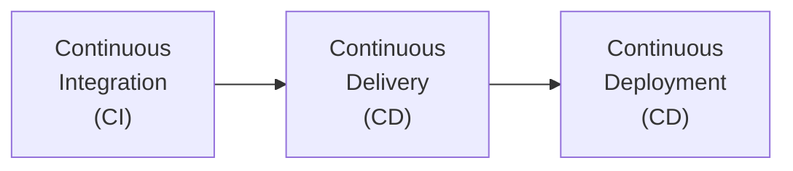
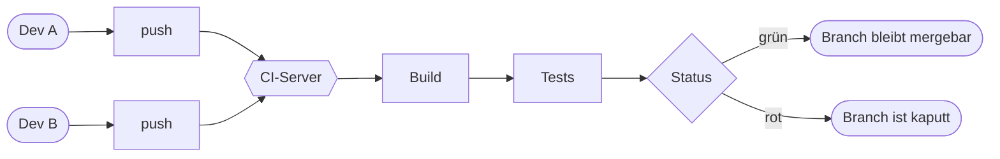
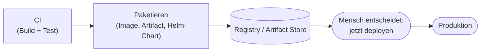
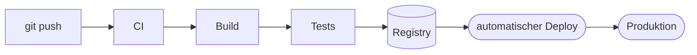
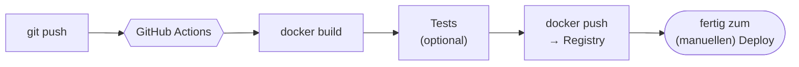

# Begriffe: CI, CD und … nochmal CD?

!!! abstract "Lernziel"
    Nach dieser Seite kannst du:

    - **Continuous Integration**, **Continuous Delivery** und **Continuous Deployment** klar voneinander abgrenzen
    - im Gespräch erkennen, wenn jemand „CI/CD" sagt und dabei eigentlich nur eine der drei Stufen meint
    - eine Tabelle aufzeichnen, die die Begriffe nach **Reife** sortiert
    - typische Missverständnisse zwischen Entwickler:innen und Vorgesetzten benennen

---

## Warum die Begriffe so verwirrend sind

„CI/CD" steht in Stellenanzeigen, Tool-Beschreibungen und Marketing-Folien. Was die meisten Leute damit meinen: **„Da läuft irgendwie automatisch was, wenn man pusht."** Das ist nicht falsch, aber zu grob.

In Wahrheit sind das **drei Stufen**, die aufeinander aufbauen:

Jede Stufe schließt die vorherige ein. Continuous Deployment **enthält** Continuous Delivery, und das wiederum **enthält** Continuous Integration.

Die Verwirrung kommt daher, dass die Abkürzung **CD doppelt belegt** ist: einmal für **Delivery** und einmal für **Deployment**. Das ist – auch unter Profis – die häufigste Verwechslung.

---

## Continuous Integration (CI)

> **Bei jedem Push in den Hauptzweig (oder einem Branch) baut ein Server den Code automatisch und führt Tests aus.**

CI ist die **älteste** der drei Ideen. Schon vor dem Container-Zeitalter (Mitte der 2000er-Jahre) gab es Build-Server wie Hudson und seinen Nachfolger Jenkins, die genau das taten.

### Was CI konkret bedeutet

- Entwickler:innen **mergen häufig** (mehrmals am Tag) in einen gemeinsamen Branch.
- Jeder Merge **triggert** einen Build-Lauf auf einem zentralen Server.
- Der Server **kompiliert/baut** die Software und führt **automatisierte Tests** aus.
- Schlägt etwas fehl, wird der **Branch als kaputt markiert** – das Team weiß sofort Bescheid.

### Was CI **nicht** ist

- Kein Deployment. CI baut und testet – fertig.
- Kein automatisches Veröffentlichen.
- Keine Garantie, dass die Software funktioniert: nur, dass die **Tests** durchgelaufen sind.

!!! tip "Daumenregel: jedes Repo darf CI haben"
    Selbst wenn **nichts deployt wird** (z.B. ein internes Tool, das jemand manuell installiert), ist CI sinnvoll. Tests, die nicht laufen, sind keine Tests. CI macht aus dem „läuft hoffentlich" ein „läuft nachweisbar".

---

## Continuous Delivery (CD)

> **Jede grüne CI-Version wird automatisch in eine releasefähige Form gebracht – aber das tatsächliche Veröffentlichen geschieht auf Knopfdruck eines Menschen.**

Continuous **Delivery** geht eine Stufe weiter als CI: Nach Build und Test wird das Ergebnis **bereitgelegt**, sodass es jederzeit ausrollbar ist. Beispiele für „bereitgelegt":

- Ein **Docker-Image** mit klarem Tag liegt in einer Registry.
- Ein **Installationspaket** (`.deb`, `.rpm`, `.msi`) ist signiert und auf einem Artifact-Server.
- Ein **Helm-Chart** ist versioniert und veröffentlicht.

Der entscheidende Punkt: **Der letzte Schritt – das tatsächliche Aufspielen in Produktion – passiert nicht automatisch.** Da klickt jemand. Oder schickt einen ChatOps-Befehl. Oder wartet auf das Wartungsfenster.

### Was Delivery in der Praxis ausmacht

- **Jeder Commit** könnte produktionsreif sein – die Maschine sagt: ja, gebaut, getestet, paketiert.
- **Veröffentlichungs-Entscheidung** ist eine Geschäftsentscheidung, keine technische: „Lassen wir Feature X heute schon raus, oder erst nach dem Marketing-Plan?"
- **Reproduzierbar**: Wenn du einen drei Wochen alten Stand veröffentlichen willst, nimmst du den entsprechenden Build aus der Registry.

### Wann Delivery sinnvoller ist als Deployment

- **Regulierte Branchen**: Bank, Versicherung, Medizintechnik. Da darf nichts ohne Vier-Augen-Prinzip live gehen.
- **Kunden-Software**: Ein Major-Release will man absichtlich auswählen können.
- **Mobile Apps**: Du kannst nicht „deployen" – die Apps müssen durch App-Store-Reviews.

---

## Continuous Deployment (CD)

> **Jede grüne Build-Version wird ohne menschliches Eingreifen direkt in Produktion ausgerollt.**

Continuous **Deployment** ist der ehrgeizigste Modus: **Push → Build → Test → Live**. Niemand klickt mehr.

### Was Deployment voraussetzt

- **Sehr gute Tests** – Unit-, Integration-, End-to-End-Tests, oft auch Performance- und Security-Tests in der Pipeline.
- **Saubere Deployment-Strategie** – das Update darf Nutzer:innen nicht direkt umlegen, wenn die neue Version Probleme hat.
- **Schnelles Rollback** – wenn etwas schiefgeht, muss die Vorgängerversion in Sekunden wieder da sein.
- **Monitoring + Alerting** – damit überhaupt jemand merkt, dass die letzte Version Probleme macht.
- **Feature Flags** für Funktionen, die zwar deployt sind, aber noch nicht für alle Nutzer:innen sichtbar.

### Wer das macht

- **Web-Produkte mit hoher Frequenz**: Amazon, Etsy, Netflix – tausende Deploys pro Tag.
- **SaaS-Produkte**, deren Nutzer:innen sehr ähnliche Workloads fahren.
- **Interne Tools**, wo das Risiko klein und das Tempo wichtig ist.

---

## Die drei Stufen in einer Tabelle

| Stufe | Was passiert automatisch | Was bleibt manuell | Wer profitiert |
|-------|---------------------------|--------------------|----------------|
| **Continuous Integration** | Build, Tests, Reports | Paketieren, Veröffentlichen, Deployen | jedes Team mit mehr als einer Person |
| **Continuous Delivery** | Build, Tests, **Paketieren in Registry** | Veröffentlichen / Deployen (Knopf) | Teams mit Compliance, App-Store-Releases, Mehrumgebungen |
| **Continuous Deployment** | Build, Tests, Paketieren, **Deploy** | nichts mehr | hochfrequente Web-Produkte mit guter Test-Abdeckung |

!!! warning "Pragmatik vor Reinheit"
    In der Praxis ist die Grenze zwischen Delivery und Deployment **fließend**. Viele Firmen haben:

    - **Continuous Deployment** in **Staging** (jeder Merge geht direkt auf das Test-System)
    - **Continuous Delivery** in **Production** (Knopfdruck, oft mit Approval-Workflow)

    Das ist eine **gesunde** Mischung: schneller Feedback im Test, kontrollierte Veröffentlichung live.

---

## Wo wir in diesem Block landen

Im Praxisteil bauen wir eine **CI-Pipeline** mit zusätzlich **Continuous Delivery in eine Container-Registry** – also Stufen 1 + 2:

Continuous **Deployment** in Produktion bauen wir nicht – das braucht entweder Kubernetes oder einen klassischen SSH-Deploy mit deutlich mehr Setup-Aufwand und gehört nicht zu den Grundlagen.

---

## Drei häufige Missverständnisse

??? warning "„Wir haben CI/CD" = „Wir deployen automatisch"?"
    Nein. **„Wir haben CI/CD"** kann alles bedeuten von „Tests laufen bei jedem Merge" bis „jeder Push geht innerhalb von 10 Minuten live". Frag konkret nach: **Was passiert nach dem Build genau? Wer löst den Deploy aus?**

??? warning "„CD heißt Continuous Deployment, oder?"
    Mal so, mal so. Beide Bedeutungen sind im professionellen Sprachgebrauch verbreitet. Wenn jemand „CD" sagt, ist es legitim nachzufragen: **„Continuous Delivery oder Deployment?"**

??? warning "„Wenn ich kein Deployment habe, bringt mir CI nichts"?"
    Doch, sehr viel. CI fängt **kaputten Code beim Merge** ab, lange bevor er irgendwo deployt wird. Eine grüne CI ist die Voraussetzung dafür, dass Code-Reviews überhaupt sinnvoll sind: niemand will Reviews auf einem Branch machen, der gar nicht baut.

---

## Was du jetzt wissen solltest

- **CI** automatisiert Build und Test – immer sinnvoll.
- **Continuous Delivery** automatisiert zusätzlich das Paketieren – Veröffentlichen bleibt menschliche Entscheidung.
- **Continuous Deployment** automatisiert auch das Veröffentlichen – braucht hohe Test-Abdeckung und gute Deployment-Strategie.
- Die zwei Bedeutungen von „CD" sind eine echte Verwechslungsquelle. Im Zweifel nachfragen.
- Eine produktionsreife Welt hat oft **CD im Sinne von Deployment auf Staging** und **CD im Sinne von Delivery in Produktion**.

---

## Merksatz

!!! success "Merksatz"
    > **CI = bauen und testen. Continuous Delivery = paketieren und bereitlegen. Continuous Deployment = automatisch veröffentlichen. Jede Stufe schließt die vorherige ein – aber niemand muss die letzte Stufe haben.**

---

## Weiterlesen

- [Pipeline-Konzept](pipeline-konzept.md) – wie das in Phasen zerlegt wird
- [GitHub Actions – Grundlagen](github-actions-grundlagen.md) – das konkrete Werkzeug
