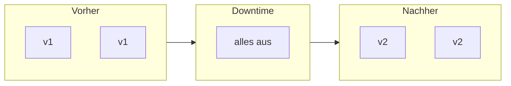
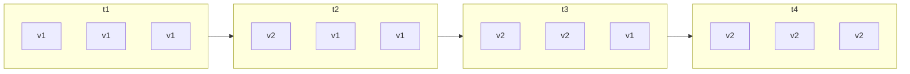
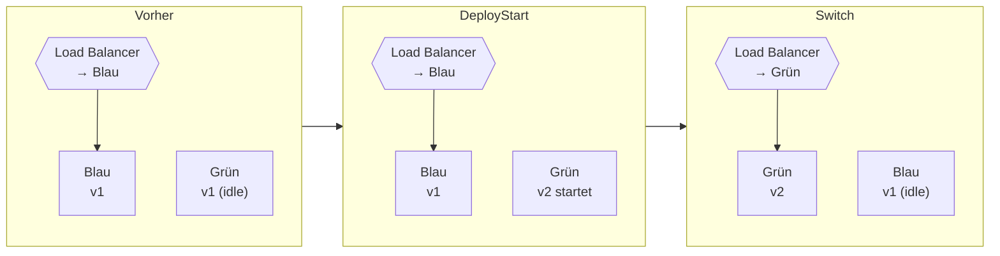
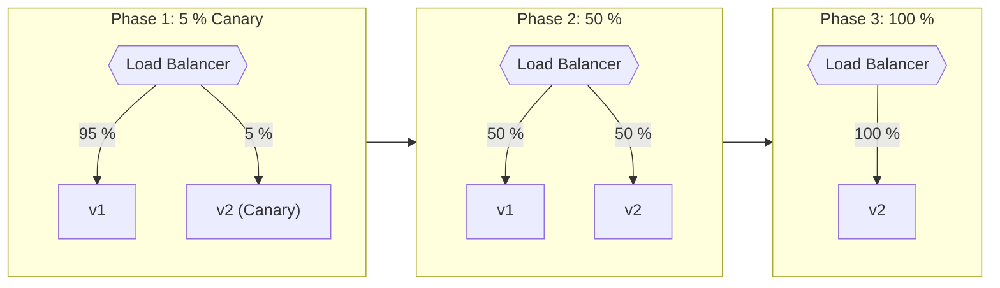
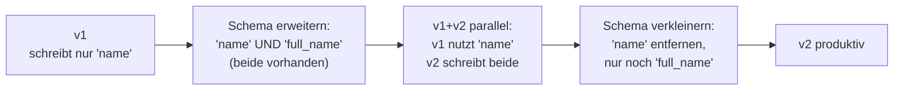

# Deployment-Strategien

!!! abstract "Lernziel"
    Nach dieser Seite kannst du:

    - die **vier wichtigsten Deployment-Strategien** beschreiben: Recreate, Rolling, Blue/Green, Canary
    - ihre **Vor- und Nachteile** abwägen und eine Strategie für ein konkretes Szenario empfehlen
    - die Begriffe **Downtime**, **Rollback** und **Traffic-Switch** sicher verwenden
    - die Strategien dem Rahmenplan-Punkt **2.3.4** zuordnen

---

## Bezug zum Rahmenplan

Diese Seite adressiert Punkt **2.3.4** des Rahmenplans:

> **Software unter Verwendung verschiedener Deployment-Strategien ausrollen.**

„Software ausrollen" meint genau das, was wir hier sortieren: **wie** das neue Image auf Server/Cluster kommt, **ohne** dass die Nutzer:innen leiden.

---

## Worum es eigentlich geht

Wenn du eine **neue Version** auslieferst, gibt es zwei harte Anforderungen, die sich oft widersprechen:

1. **Verfügbarkeit:** Die App soll während des Updates erreichbar bleiben.
2. **Sicherheit:** Wenn die neue Version fehlerhaft ist, willst du **schnell zurück**.

Eine Deployment-Strategie ist im Kern die Antwort auf: **„Wie führe ich Update + Rollback so aus, dass Nutzer:innen davon möglichst wenig spüren?"**

Die vier Strategien, die wir gleich anschauen, beantworten das unterschiedlich gut – mit unterschiedlichem Aufwand.

---

## Strategie 1: Recreate

> **Alle alten Instanzen stoppen, dann alle neuen starten.**



### Wie es abläuft

```text
1. v1 stoppen
2. v2 starten
3. (während v1 aus ist und v2 noch nicht bereit: Downtime)
```

In Compose ist das einfach:

```bash
docker compose down
docker compose pull       # neues Image holen
docker compose up -d
```

### Pros und Contras

| Vorteil | Nachteil |
|---------|----------|
| Sehr **simpel** | **Downtime** in jedem Update |
| Keine Versions-Mischung – alte und neue Version laufen nie parallel | Bei langem Start nervig |
| Datenbank-Migrationen, die Versionen brechen würden, sind unkritisch | Rollback bedeutet erneutes Recreate – noch eine Downtime |

### Wann passt das?

- **Interne Tools**, bei denen Downtime von 30 Sekunden niemanden stört.
- **Apps mit hartem Versions-Bruch**, z.B. eine DB-Migration, nach der die alte Version definitiv nicht mehr funktioniert.
- **Single-Container-Setups**, wo es keinen sinnvollen Way around gibt.

!!! info "Default in Compose ist nicht Recreate"
    `docker compose up -d` macht standardmäßig **Stop-then-Start pro Service** und ist damit näher an Recreate als an Rolling. Für echtes Rolling brauchst du Tools wie Kubernetes oder Swarm – **nicht** plain Compose.

---

## Strategie 2: Rolling Update

> **Instanzen werden in kleinen Schritten ausgetauscht: alte stoppen, neue hochfahren, fertig, nächste Welle.**



### Wie es abläuft

Du hast (sagen wir) drei Instanzen deiner App hinter einem Load Balancer. Beim Update:

```text
1. Eine Instanz stoppen, neue Version starten, in Healthcheck warten.
2. Wenn gesund → nächste Instanz austauschen.
3. So weiter, bis alle Instanzen auf v2 sind.
```

Während des gesamten Updates **läuft die App** – aber teils auf v1, teils auf v2. Das ist der zentrale Punkt: **Versions-Mischung** muss kompatibel sein.

### Pros und Contras

| Vorteil | Nachteil |
|---------|----------|
| **Keine Downtime** (Load Balancer schickt Anfragen an gesunde Instanzen) | v1 und v2 müssen kurzzeitig **kompatibel** sein (DB-Schema, API-Verträge) |
| **Geringe Ressourcen-Spitze** – immer nur etwas mehr als die Normal-Last | Rollback ist auch wieder ein Rolling Update – nicht instant |
| Der **Standard-Modus von Kubernetes** | Bei Performance-Regression hängen schon ein paar Nutzer:innen auf v2 |

### Wann passt das?

- **Web-Apps mit Load Balancer** und mehr als einer Instanz.
- **Stateless Services** – Sessions sollten nicht an eine spezifische Instanz gebunden sein.
- **Gut getestete Versionen**, bei denen ein Mischbetrieb ein paar Minuten okay ist.

!!! tip "Kubernetes' Default"
    In Kubernetes ist Rolling Update der **Default-Modus** für Deployments. Du steuerst das mit `maxUnavailable` (wie viele dürfen gleichzeitig down sein?) und `maxSurge` (wie viele neue dürfen zusätzlich starten?).

---

## Strategie 3: Blue/Green

> **Zwei vollständige Umgebungen nebeneinander. Erst grün hochfahren, dann Traffic-Switch von blau auf grün.**



### Wie es abläuft

```text
1. Blau läuft mit v1 und nimmt allen Traffic.
2. Grün wird mit v2 hochgefahren. Smoke-Tests gegen Grün – ohne dass User:innen davon was merken.
3. Load Balancer schwenkt komplett von Blau auf Grün um.
4. Blau bleibt stehen (idle) – falls Rollback nötig: Switch zurück.
5. Beim nächsten Deploy spielen die Farben Tausch: Blau wird die neue Version, Grün die alte.
```

### Pros und Contras

| Vorteil | Nachteil |
|---------|----------|
| **Instant Rollback** – einfacher Switch zurück | Doppelter Ressourcen-Verbrauch während des Switches |
| **Smoke-Tests** auf der „neuen Seite" möglich, bevor User:innen Traffic sehen | DB-Schema-Änderungen müssen **kompatibel zu beiden Seiten** sein |
| Klare, gut verständliche Strategie | Komplexerer Load-Balancer / Routing |

### Wann passt das?

- **Apps mit klarer Lasthöhe**, sodass der doppelte Ressourcenverbrauch zeitweise vertretbar ist.
- **Releases mit hohem Risiko**, bei denen instantes Rollback wichtig ist.
- **Wartungsfenster mit harten SLAs**, bei denen jede Minute Ausfall zählt.

!!! info "Verwandt: A/B-Deployment"
    Bei A/B-Deployment werden zwei Versionen **dauerhaft parallel** betrieben, um Hypothesen zu testen („löst v2 ein Geschäftsproblem besser als v1?"). Technisch dieselbe Infrastruktur, aber andere Motivation.

---

## Strategie 4: Canary

> **Ein kleiner Teil der Nutzer:innen sieht zuerst die neue Version. Wenn die Metriken passen, wird der Anteil schrittweise erhöht.**



Der Name kommt von „Canary in der Coal Mine": ein Vogel, der früher in Bergwerken Gas anzeigte, indem er als erstes umfiel. Hier: die ersten 5 % der Nutzer:innen sind die Kanarienvögel.

### Wie es abläuft

```text
1. v2 wird zusätzlich gestartet, bekommt z.B. 5 % des Traffics.
2. Metriken (Fehlerrate, Latenz, Business-KPIs) werden aktiv beobachtet.
3. Wenn Metriken stabil → Anteil auf 25 % erhöhen.
4. Weiter steigern (50 %, 75 %, 100 %).
5. Wenn Metriken kippen → Anteil sofort auf 0 zurück, v1 nimmt wieder allen Traffic.
```

### Pros und Contras

| Vorteil | Nachteil |
|---------|----------|
| **Risiko gestaffelt** – ein Bug trifft nur 5 % statt 100 % | Erfordert **Metriken** und automatische Auswertung |
| Echte Nutzer-Daten, nicht synthetische Smoke-Tests | Komplexerer Traffic-Splitter (Service Mesh, Feature-Flag-System) |
| Kombinierbar mit **Feature Flags** | Längere Release-Dauer (Stunden bis Tage) |

### Wann passt das?

- **Hochfrequente Web-Produkte** mit großer Nutzerbasis.
- **Releases mit Performance-Risiko** – kleine Latenz-Regression willst du früh sehen.
- **Teams mit reifer Observability** (Prometheus, Grafana, OpenTelemetry).

---

## Vergleich auf einen Blick

| Strategie | Downtime | Risiko | Ressourcen-Spitze | Komplexität | Rollback-Tempo |
|-----------|----------|--------|-------------------|-------------|----------------|
| **Recreate** | ja, kurz | mittel | niedrig | sehr niedrig | langsam (=Recreate zurück) |
| **Rolling** | nein | mittel | niedrig–mittel | mittel | mittel |
| **Blue/Green** | nein | niedrig | hoch (× 2) | mittel–hoch | sofort |
| **Canary** | nein | sehr niedrig | mittel | hoch | sehr schnell |

!!! tip "Faustregel zur Auswahl"
    - **Nur ein Server, kleine Apps?** Recreate – ehrlich, einfach, gut.
    - **Mehrere Instanzen, Load Balancer?** Rolling.
    - **Hohe Verfügbarkeitsanforderung, klares Wartungsfenster?** Blue/Green.
    - **Globale Plattform, scharfe Metriken?** Canary.

---

## Was du dafür brauchst

Strategien sind nicht magisch – sie brauchen Infrastruktur:

| Strategie | Voraussetzungen |
|-----------|-----------------|
| **Recreate** | beliebige Container-Plattform (Compose reicht) |
| **Rolling** | Orchestrator mit Healthcheck-Loop (Kubernetes, Docker Swarm, ECS) |
| **Blue/Green** | Routing-Layer, der schnell umgeschaltet werden kann (DNS, Load Balancer, Service Mesh) |
| **Canary** | Feinkörniger Traffic-Splitter + Metrik-System (Service Mesh, Feature Flags, Argo Rollouts) |

Ein **Compose-only-Setup** kann sauber Recreate machen. Für die anderen drei brauchst du mindestens einen Orchestrator – das ist ein Grund, warum Kubernetes für viele Teams den Sprung wert ist.

---

## Datenbank-Schema – der unsichtbare Spielverderber

Alle vier Strategien brechen, wenn das Datenbank-Schema sich **inkompatibel** ändert. Beispiel:

- v1 erwartet eine Spalte `name`.
- v2 nennt die Spalte um in `full_name`.
- In jedem Mischbetrieb (Rolling, Canary, Blue/Green-Umschalt-Phase) **crasht eine der beiden Versionen**.

Die saubere Antwort heißt **Expand & Contract**:



Das ist Aufwand – aber ohne diesen Aufwand gibt es **keine zero-downtime-Releases** mit Schema-Änderungen.

---

## Stolpersteine

??? warning "Rolling Update bricht, weil zwei Versionen API-inkompatibel sind"
    **Symptom:** Während des Rolling Updates produzieren v1 und v2 widersprüchliche Daten oder rufen sich gegenseitig falsch auf.

    **Lösung:** **Nicht** in einem Schritt brechende API-Änderungen einführen. Erst v2 deployen, das beide Schnittstellen-Versionen unterstützt; **erst danach** v1 abschalten.

??? warning "Blue/Green ist da, aber nutzt es niemand"
    **Symptom:** Tooling steht, aber alle deployen weiterhin direkt nach Blau ohne Switch-Test.

    **Ursache:** Smoke-Test auf Grün ist nicht automatisiert oder schmerzhaft. **Lösung:** Smoke-Test in Pipeline einbauen, sodass Grün nur dann zum aktiven Switch zugelassen wird, wenn ein Test-Set durchgelaufen ist.

??? danger "Canary ohne Metriken ist sinnlos"
    **Symptom:** 5 % auf v2, niemand schaut auf Fehler-Rate. v2 hat eine Race-Condition, die nur unter Last auftritt – betrifft 5 % der Nutzer:innen einen ganzen Tag lang.

    **Lösung:** Canary **immer** mit automatisiertem Vergleich der Fehler-Rate gegen v1. Wenn v2 schlechter ist, Anteil sofort runter.

??? warning "Rollback wird vergessen"
    **Symptom:** Eure Pipeline kann ausrollen – aber niemand hat den **Rollback-Befehl** dokumentiert. Im Notfall improvisieren alle.

    **Lösung:** Rollback ist ein **eigenständiger Pipeline-Pfad**, der genauso gepflegt wird wie der Forward-Deploy. Im Idealfall mit One-Click-Trigger.

---

## Was wir in der Praxis machen

Im [Praxis-Teil](praxis-erste-pipeline.md) deployen wir absichtlich **nicht** auf einen produktiven Server. Wir gehen bis zur **Registry** – das ist der Punkt, an dem wir noch alle Strategien wählen können.

Die Wahl der Deployment-Strategie hängt **stark** von der Zielplattform ab:

- Mit **Compose** auf einem VPS: Recreate ist realistisch, Rolling/Canary nicht ohne Zusatztools.
- Mit **Kubernetes**: Rolling ist Default, Blue/Green und Canary mit Argo Rollouts oder Flagger.
- Mit **PaaS** (Render, Fly): Rolling ist eingebaut.

Mehr dazu im [Ausblick](ausblick.md).

---

## Was du jetzt wissen solltest

- **Vier Strategien**: Recreate, Rolling, Blue/Green, Canary – jede mit klaren Trade-offs.
- **Recreate** akzeptiert Downtime, ist dafür simpel.
- **Rolling** vermeidet Downtime, braucht aber Versions-kompatible Mischbetrieb-Phasen.
- **Blue/Green** ermöglicht instantes Rollback, kostet doppelte Ressourcen.
- **Canary** minimiert Risiko durch graduelles Ausrollen, braucht ausgereifte Metriken.
- Schema-Änderungen brechen alle Strategien – **Expand & Contract** ist der Ausweg.

---

## Merksatz

!!! success "Merksatz"
    > **Recreate für simple Setups, Rolling für Standard-Web-Apps, Blue/Green für instant Rollback, Canary für maximale Risiko-Kontrolle. Kein Strategie ist schlecht – falsch ist nur die, die nicht zur Plattform passt.**

---

## Weiterlesen

- [GitHub Actions – Grundlagen](github-actions-grundlagen.md) – jetzt das Tool
- [Ausblick: Kubernetes & ArgoCD](ausblick.md) – wo die fortgeschrittenen Strategien wirklich zuhause sind
