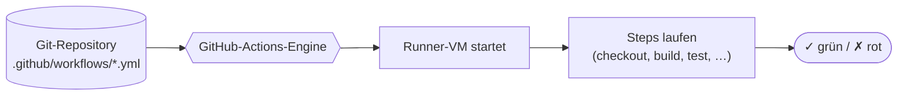

# Grundlagen von GitHub Actions

!!! abstract "Lernziel"
    Nach dieser Seite kannst du:

    - die **YAML-Struktur** einer GitHub-Actions-Workflow-Datei lesen und schreiben
    - **`on`**, **`jobs`**, **`runs-on`**, **`steps`**, **`uses`** und **`run`** sicher einsetzen
    - **vorgefertigte Actions** (z.B. `actions/checkout`, `docker/build-push-action`) nutzen
    - **Secrets** und den eingebauten `GITHUB_TOKEN` korrekt verwenden
    - einen kompletten Beispiel-Workflow lesen, der ein Docker-Image baut

---

## Bezug zum Rahmenplan

Diese Seite + die folgende Praxis adressieren Punkt **2.3.3**:

> **Produkte zur Softwareverteilung installieren und konfigurieren.**

GitHub Actions ist genau so ein „Produkt zur Softwareverteilung". Wir konfigurieren es nicht durch eine GUI, sondern durch eine YAML-Datei im Repository. Das ist der moderne **Konfigurationsstil**: deklarativ, versioniert, code-gleich.

---

## Was ist GitHub Actions?

GitHub Actions ist die in GitHub eingebaute **CI/CD-Plattform**. Sie führt Workflows aus, die als YAML-Dateien im Repository unter `.github/workflows/` liegen. Pro Push, Pull-Request, Schedule oder manuellem Trigger werden die passenden Workflows gestartet.



### Kernbegriffe

| Begriff | Bedeutung |
|---------|-----------|
| **Workflow** | Eine YAML-Datei mit einem oder mehreren Jobs. |
| **Job** | Eine Folge von Steps, die auf einer **eigenen Runner-VM** laufen. |
| **Step** | Eine einzelne Aktion: entweder ein **Shell-Befehl** (`run:`) oder eine **vorgefertigte Action** (`uses:`). |
| **Runner** | Die Maschine, auf der ein Job läuft. Standard: GitHub-gehostete Ubuntu-VM. |
| **Action** | Wiederverwendbarer Baustein, geschrieben von GitHub, der Community oder dir selbst. Liegt in einem eigenen Repo. |

Wer aus dem letzten Block die Begriffe von [Pipeline-Konzept](pipeline-konzept.md) kennt: Job, Step, Runner sind hier dieselben.

---

## Der Speicherort: `.github/workflows/`

Workflows leben **im Repo selbst**. Ihre Konfiguration ist also genauso versioniert wie der Code. Konkret:

```text
mein-projekt/
├── .github/
│   └── workflows/
│       ├── ci.yml
│       └── release.yml
├── Dockerfile
├── src/
└── README.md
```

Jede `.yml`-Datei in `.github/workflows/` ist ein **eigener Workflow**. Der Dateiname ist beliebig, das Suffix ist `.yml` oder `.yaml`.

!!! tip "Strikt im richtigen Pfad"
    GitHub schaut **nur** in `.github/workflows/`. `.gitlab-ci/`, `ci/`, `workflow.yml` im Repo-Root, alles wird ignoriert. Der Pfad ist hart kodiert.

---

## Anatomie einer Workflow-Datei

Hier ein **vollständiger** kleiner Workflow, den wir gleich Stück für Stück zerlegen:

```yaml
name: CI

on:
  push:
    branches: [main]
  pull_request:

jobs:
  build:
    runs-on: ubuntu-latest
    steps:
      - name: Checkout
        uses: actions/checkout@v4

      - name: Build Docker image
        run: docker build -t cicd-demo:${{ github.sha }} .
```

### Zeilenweise

#### `name:`

```yaml
name: CI
```

Der Anzeigename des Workflows, wie er im **Actions-Tab** auf GitHub erscheint. Optional, aber empfohlen.

#### `on:`: die Trigger

```yaml
on:
  push:
    branches: [main]
  pull_request:
```

Sagt: „Starte mich, wenn jemand auf `main` pusht oder einen Pull Request öffnet/aktualisiert."

Häufige Trigger:

```yaml
on:
  push:                       # bei jedem Push
    branches: [main]          # nur auf main
    tags: ["v*.*.*"]          # zusätzlich bei Versions-Tags
    paths-ignore: ["docs/**"] # Doku-Änderungen ignorieren
  pull_request:               # bei PRs
  schedule:
    - cron: "0 3 * * *"       # täglich 3 Uhr UTC
  workflow_dispatch:          # manueller Knopf im Actions-Tab
```

#### `jobs:`: die Liste der Jobs

```yaml
jobs:
  build:
    runs-on: ubuntu-latest
    steps:
      ...
```

Unter `jobs:` listest du alle Jobs deines Workflows. Jeder Job-Name (`build:`) ist ein **Schlüssel**, den du frei wählst. Er taucht im Actions-Tab auf.

#### `runs-on:`: auf welchem Runner

```yaml
runs-on: ubuntu-latest
```

Der **GitHub-gehostete Standard-Runner**. Alternativen:

| Runner | Wann sinnvoll |
|--------|---------------|
| `ubuntu-latest` | Standard für (fast) alles. |
| `ubuntu-22.04` / `ubuntu-24.04` | Wenn du eine konkrete Ubuntu-Version brauchst. |
| `windows-latest` | Du baust eine Windows-Anwendung. |
| `macos-latest` | Für iOS-Builds (nicht günstig). |
| `self-hosted` | Eigene Maschine, z.B. wenn besondere Hardware nötig ist. |

Der Runner ist **frisch** für jeden Job: keine Vorinstallationen, kein Cache, keine Reste vom letzten Lauf.

#### `steps:`: die einzelnen Aktionen

```yaml
steps:
  - name: Checkout
    uses: actions/checkout@v4
  - name: Build
    run: docker build -t cicd-demo:${{ github.sha }} .
```

Jeder Step ist entweder:

- **`uses:`** nutzt eine **vorgefertigte Action** (aus einem anderen Repo).
- **`run:`** führt einen **Shell-Befehl** auf dem Runner aus.

`name:` ist optional, aber super hilfreich für die Logs.

---

## Vorgefertigte Actions mit `uses:`

Eine **Action** ist Code, den jemand anders geschrieben hat und wiederverwendbar gemacht hat. Du referenzierst sie mit `besitzer/repo@version`:

```yaml
- uses: actions/checkout@v4
- uses: docker/setup-buildx-action@v3
- uses: docker/login-action@v3
- uses: docker/build-push-action@v6
```

| Action | Wozu |
|--------|------|
| `actions/checkout@v4` | Holt dein Repo auf den Runner. **Praktisch immer Step 1.** |
| `actions/setup-node@v4` | Installiert Node.js in der gewünschten Version. |
| `actions/setup-python@v5` | Installiert Python in der gewünschten Version. |
| `actions/cache@v4` | Cached Dependencies zwischen Workflow-Läufen. |
| `docker/setup-buildx-action@v3` | Initialisiert BuildKit für moderne Docker-Builds. |
| `docker/login-action@v3` | Loggt sich in eine Container-Registry ein. |
| `docker/build-push-action@v6` | Baut und pusht Docker-Images mit Cache und Multi-Plattform-Support. |

### Versionen pinnen

Du **kannst** schreiben:

```yaml
uses: actions/checkout@main      # immer aktueller Stand der Action
uses: actions/checkout@v4        # neueste v4.x
uses: actions/checkout@v4.1.7    # exakte Version
uses: actions/checkout@8e5e7e5…  # SHA, die sicherste Form
```

!!! warning "Major-Version reicht meist"
    Mehr als nur Major-Versionen zu pinnen wird in der Regel zu viel Pflegeaufwand. **`@v4`** ist ein guter Kompromiss zwischen Sicherheit und Aktualität. Nur bei sehr sicherheitskritischen Workflows: SHA pinnen.

### Eingaben mit `with:`

Eine Action kann **Parameter** entgegennehmen:

```yaml
- uses: actions/setup-python@v5
  with:
    python-version: "3.12"
    cache: pip
```

Welche `with:`-Parameter eine Action versteht, steht in ihrer README.

---

## Eigene Befehle mit `run:`

`run:` führt einen Befehl auf dem Runner aus. Standardmäßig in `bash`:

```yaml
- name: Tests
  run: pytest -v

- name: Multi-Line
  run: |
    echo "Erste Zeile"
    echo "Zweite Zeile"
    pytest -v
```

Auf Windows-Runnern ist die Default-Shell `cmd` (oder `pwsh` mit `shell:`-Option). Für plattformübergreifende Workflows besser explizit:

```yaml
- name: Linux-Tests
  if: runner.os == 'Linux'
  run: |
    sudo apt-get update
    sudo apt-get install -y curl
    pytest -v
```

---

## Variablen, Kontexte und Secrets

GitHub Actions stellt während des Laufs eine Menge **Kontext-Variablen** bereit. Sie werden mit `${{ … }}` referenziert:

```yaml
- run: echo "Aktueller Commit: ${{ github.sha }}"
- run: echo "Branch: ${{ github.ref_name }}"
- run: echo "Runner-OS: ${{ runner.os }}"
```

| Kontext | Beispiele |
|---------|-----------|
| `github` | `github.sha`, `github.ref_name`, `github.actor`, `github.repository` |
| `runner` | `runner.os`, `runner.arch`, `runner.temp` |
| `secrets` | `secrets.MY_TOKEN` |
| `env` | selbst gesetzte Umgebungsvariablen |
| `inputs` | manuell übergebene Inputs (bei `workflow_dispatch`) |

### Eigene Umgebungsvariablen

```yaml
jobs:
  build:
    runs-on: ubuntu-latest
    env:
      IMAGE_NAME: cicd-demo
      IMAGE_TAG: ${{ github.sha }}
    steps:
      - run: echo "Bauen $IMAGE_NAME:$IMAGE_TAG"
```

`env:` kann auf Workflow-, Job- oder Step-Ebene stehen.

### Secrets

**Niemals Passwörter, Tokens oder API-Keys in die YAML.** Stattdessen: GitHub-Repo → Settings → Secrets and variables → Actions → **New repository secret**. Dann im Workflow:

```yaml
- name: Login zu Docker Hub
  uses: docker/login-action@v3
  with:
    username: ${{ secrets.DOCKERHUB_USERNAME }}
    password: ${{ secrets.DOCKERHUB_TOKEN }}
```

GitHub maskiert Secret-Werte in den Logs (`***`), sodass sie auch dann nicht leaken, wenn jemand sie versehentlich `echo`t.

#### Der eingebaute `GITHUB_TOKEN`

Für **viele** Aufgaben brauchst du gar kein eigenes Secret: GitHub erzeugt **automatisch** einen Token pro Workflow-Lauf. Er steckt in `secrets.GITHUB_TOKEN` und kann z.B. auf die **GitHub Container Registry** (GHCR) pushen:

```yaml
- name: Login to GHCR
  uses: docker/login-action@v3
  with:
    registry: ghcr.io
    username: ${{ github.actor }}
    password: ${{ secrets.GITHUB_TOKEN }}
```

Damit der Token **schreiben** darf, brauchst du oft eine Berechtigungsanforderung im Workflow:

```yaml
permissions:
  contents: read
  packages: write
```

Default-Berechtigungen variieren je nach Repo-Einstellung. Der `permissions:`-Block ist die sichere Variante.

---

## Job-Abhängigkeiten mit `needs:`

Jobs laufen standardmäßig **parallel**. Wenn du eine Reihenfolge willst:

```yaml
jobs:
  build:
    runs-on: ubuntu-latest
    steps:
      - uses: actions/checkout@v4
      - run: docker build -t app:${{ github.sha }} .

  test:
    runs-on: ubuntu-latest
    needs: build               # erst nach build
    steps:
      - uses: actions/checkout@v4
      - run: pytest

  publish:
    runs-on: ubuntu-latest
    needs: [build, test]       # erst nach beiden
    if: github.ref == 'refs/heads/main'
    steps:
      - run: echo "publish..."
```

`needs:` gibt eine **Abhängigkeit** an. Wenn der Vorgänger-Job fehlschlägt, **läuft der abhängige Job gar nicht**.

`if:` ist eine **Bedingung**: hier läuft der `publish`-Job nur, wenn der Workflow auf `main` ausgeführt wird.

---

## Caching

Damit die Pipeline schnell bleibt, lohnt es sich, Dependencies und Build-Artefakte zu cachen.

```yaml
- name: Cache pip
  uses: actions/cache@v4
  with:
    path: ~/.cache/pip
    key: ${{ runner.os }}-pip-${{ hashFiles('requirements.txt') }}
```

`key:` ist der Cache-Schlüssel. Wenn er sich ändert (weil `requirements.txt` sich ändert), wird neu gebaut.

Für **Docker-Builds** geht das eleganter direkt in der Build-Action:

```yaml
- uses: docker/build-push-action@v6
  with:
    context: .
    push: false
    tags: cicd-demo:${{ github.sha }}
    cache-from: type=gha
    cache-to: type=gha,mode=max
```

`type=gha` heißt „GitHub Actions Cache". BuildKit cached Layer zwischen Workflow-Läufen.

---

## Beispiel-Workflow: Image bauen und pushen

Ein vollständiger, kleiner Workflow, der die Bausteine von oben kombiniert:

```yaml
# .github/workflows/build-image.yml
name: Build Docker Image

on:
  push:
    branches: [main]
  pull_request:
  workflow_dispatch:

permissions:
  contents: read
  packages: write

jobs:
  build:
    runs-on: ubuntu-latest

    steps:
      - name: Checkout
        uses: actions/checkout@v4

      - name: Set up BuildKit
        uses: docker/setup-buildx-action@v3

      - name: Login zu GHCR
        if: github.event_name != 'pull_request'
        uses: docker/login-action@v3
        with:
          registry: ghcr.io
          username: ${{ github.actor }}
          password: ${{ secrets.GITHUB_TOKEN }}

      - name: Owner in Kleinbuchstaben (GHCR verlangt lowercase)
        id: lcowner
        run: echo "OWNER=${GITHUB_REPOSITORY_OWNER,,}" >> "$GITHUB_OUTPUT"

      - name: Image bauen (und auf main pushen)
        uses: docker/build-push-action@v6
        with:
          context: .
          push: ${{ github.event_name != 'pull_request' }}
          tags: |
            ghcr.io/${{ steps.lcowner.outputs.OWNER }}/cicd-demo:${{ github.sha }}
            ghcr.io/${{ steps.lcowner.outputs.OWNER }}/cicd-demo:latest
          cache-from: type=gha
          cache-to: type=gha,mode=max
```

### Was passiert hier?

1. **Trigger**: Push auf `main`, jeder Pull Request, oder manueller Knopf.
2. **Berechtigungen**: Workflow darf Pakete (Images) in GHCR schreiben.
3. **Steps**:
   - Repo holen.
   - BuildKit aktivieren.
   - Bei `push`/`workflow_dispatch` (nicht bei PR): in GHCR einloggen.
   - Owner in Kleinbuchstaben umwandeln, GHCR verlangt das.
   - Image bauen, bei Nicht-PR auch pushen, mit GHCR-Cache.
4. **Tags**: zwei Tags, einer mit Commit-SHA (unveränderlich), einer mit `latest` (gleitend).

!!! warning "GHCR akzeptiert nur Kleinbuchstaben"
    GitHub-Usernames können Großbuchstaben enthalten (z.B. `JacobMenge`), aber GHCR-Image-Pfade sind **case-sensitiv** und müssen lowercase sein. Der `lcowner`-Step wandelt den Owner mit Bash-Expansion `${VAR,,}` zur Laufzeit um. Ohne diesen Step bricht der Push mit „repository name must be lowercase" ab.

!!! tip "Pull Requests bauen, aber nicht pushen"
    Ein typisches Muster: PRs sollen **bauen** (damit man weiß, dass die Änderung sauber baut), aber **nicht in die Registry pushen** (damit Forks von Externen keine Pakete in dein GHCR drücken können). Genau das macht `push: ${{ github.event_name != 'pull_request' }}`.

---

## Tipps fürs Workflow-Schreiben

### 1. Klein anfangen

Schreib **erst** einen Workflow, der nur `echo "hello"` macht. Push, schau, ob er läuft. Dann erweitern. Kein Fehler frustriert mehr als ein 80-zeiliger YAML-Block, der wegen eines Tab-Zeichens nicht parst.

### 2. `act` zum lokalen Testen

[`act`](https://github.com/nektos/act) führt GitHub-Actions-Workflows **lokal** in Docker-Containern aus. Schnelles Iterieren ohne push:

```bash
act push
```

(Nicht alles funktioniert lokal: Secrets, Dienste, Marketplace-Actions, die spezifische Cloud-APIs nutzen, klappen nicht.)

### 3. Logs lesen, nicht raten

Im Actions-Tab lassen sich Logs **pro Step** aufklappen. Bei einem Fehler zeigt der rote Step die exakte Zeile mit Fehler-Output.

### 4. Action-Versionen aktuell halten

GitHub kennzeichnet **veraltete Actions** im UI. Mindestens halbjährlich Versionen prüfen, auf neue Major-Versions umstellen.

---

## Stolpersteine

??? danger "YAML-Fehler: „mapping values are not allowed in this context"
    YAML ist sehr penibel mit **Einrückung** und **Doppelpunkten**. Häufige Ursachen:

    - Ein Wert hat einen Doppelpunkt im Inhalt: `tag: app:1.0` → muss `tag: "app:1.0"` (in Anführungszeichen).
    - Tab statt Leerzeichen.
    - Inkonsistente Einrückungs-Tiefe.

    **Diagnose:** GitHub zeigt im Actions-Tab eine YAML-Fehlerzeile, oft genau richtig. Vorab lokal mit `yamllint` prüfen oder einem Editor mit YAML-Schema-Support (VSCode + GitHub-Actions-Extension).

??? warning "„resource not accessible by integration" beim Pushen ins GHCR"
    Der `GITHUB_TOKEN` hat **standardmäßig** keine Schreibrechte auf Pakete. Lösung:

    ```yaml
    permissions:
      contents: read
      packages: write
    ```

    Plus: in den Repo-Settings unter „Actions → General → Workflow permissions" muss **„Read and write permissions"** oder zumindest **„Workflow permissions: read and write"** für Pakete erlaubt sein.

??? warning "Mein Workflow läuft beim Push gar nicht los"
    Häufige Ursachen:

    1. **Datei nicht in `.github/workflows/`**, sondern in `workflows/` oder `github/workflows/`.
    2. **YAML-Fehler**: die Datei wird ignoriert, aber kein Fehler im UI angezeigt; im **Actions-Tab** prüfen.
    3. **Branch-Filter passt nicht**: `branches: [main]` fängt nur Pushes nach `main` ab. Pushes nach `feature/x` triggern dann gar nichts.

??? warning "Secrets sind im Log sichtbar"
    Sollten sie **nicht** sein. GitHub maskiert sie automatisch zu `***`. Wenn sie es trotzdem sind: meistens hat jemand sie ungewollt zerlegt (mit `cut`, `awk`, …) und an anderer Stelle ausgegeben. Diese Stelle finden und entfernen. Im Verdachtsfall: **Secret rotieren** (auf der Quelle den Wert ändern).

??? info "PRs aus Forks haben eingeschränkten Zugriff auf Secrets"
    Aus Sicherheitsgründen bekommen PRs aus **Forks** keinen Zugriff auf Repository-Secrets. Das ist Absicht. Sonst könnte jeder Fork die Secrets exfiltrieren. Lösung: Nur auf `push:` Secrets nutzen, im PR nur build + test ohne Secret-Zugriff laufen lassen.

---

## Was du jetzt wissen solltest

- Workflows liegen in `.github/workflows/` als YAML-Dateien.
- Aufbau: `name`, `on`, `jobs`, pro Job `runs-on` und `steps`.
- Steps sind entweder `run:` (Shell) oder `uses:` (Action).
- `actions/checkout` ist praktisch immer Step 1.
- `${{ github.sha }}`, `${{ secrets.GITHUB_TOKEN }}` und Co. sind Kontext-Variablen.
- `needs:` baut Job-Abhängigkeiten.
- Caching beschleunigt Builds (pip, npm, Docker-Layer).
- Secrets gehören in die GitHub-Settings, nicht ins YAML.

---

## Merksatz

!!! success "Merksatz"
    > **Workflow = YAML in `.github/workflows/`. `on:` triggert, `jobs:` listet, `steps:` führen aus. `uses:` für vorgefertigte Bausteine, `run:` für eigene Befehle. Secrets nur über `secrets.*`, niemals als Klartext.**

---

## Weiterlesen

- [Praxis: erste Pipeline](praxis-erste-pipeline.md): jetzt selbst bauen
- [Cheatsheet GitHub Actions](../cheatsheets/github-actions.md): die Befehle und Snippets auf einer Seite
