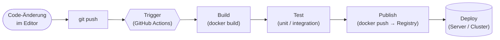

# CI/CD mit GitHub Actions (Block 6)

In den vorigen Blöcken hast du Container gebaut, Stacks beschrieben und Images optimiert. Die ehrliche Frage am Ende von Block 5 war: **„Schön, mein Image ist klein und sicher – aber wie kommt es jetzt eigentlich auf den Server?"**

Genau diese Lücke schließt **CI/CD**. Statt jedes Mal von Hand `docker build`, `docker push`, SSH auf den Server, `docker pull`, `docker compose up` zu tippen, beschreibst du den Ablauf einmal als **Pipeline** – und ein Push auf `main` reicht, damit alles automatisch passiert.

!!! abstract "Was du nach diesen 3 Stunden kannst"
    - erklären, **welches Problem CI/CD löst** und wo manuelle Auslieferung kippt
    - die Begriffe **Continuous Integration**, **Continuous Delivery** und **Continuous Deployment** sauber auseinanderhalten
    - eine **Pipeline** in ihre Phasen zerlegen (Trigger → Build → Test → Deploy)
    - **Deployment-Strategien** Rolling, Blue/Green und Canary einordnen
    - die **YAML-Syntax von GitHub Actions** lesen: `on`, `jobs`, `runs-on`, `steps`, `uses`, `run`
    - eine eigene Workflow-Datei schreiben, die ein Docker-Image **automatisch baut und testet**

---

## Bezug zum IHK-Rahmenplan

Dieser Block adressiert vier Punkte aus dem Rahmenplan für Fachinformatiker (Anwendungsentwicklung / Systemintegration / DevOps):

| Punkt | Inhalt | Wo abgedeckt |
|-------|--------|--------------|
| **2.3.1** | Softwareverteilungsprozesse (Analyse, Planung, Einführung, Pflege) | [Pipeline-Konzept](pipeline-konzept.md) |
| **2.3.3** | Installation und Konfiguration von Produkten zur Softwareverteilung | [GitHub Actions – Grundlagen](github-actions-grundlagen.md) + [Praxis](praxis-erste-pipeline.md) |
| **2.3.4** | Deployment-Strategien (ausführen) | [Deployment-Strategien](deployment-strategien.md) |
| **3.6.1** | automatisierte Testausführung (mitwirken) | [Praxis](praxis-erste-pipeline.md) (Test-Job) |

---

## Zeitplan – 3 Stunden (90 min Theorie + 45 min Praxis + 45 min Besprechung)

!!! note "Für Präsenzkurs und Selbstlerner"
    Der folgende Zeitplan ist für den **3-Stunden-Präsenzkurs** gedacht. Selbstlerner ignorieren die Zeiten und arbeiten die Inhalte in ihrem Tempo durch – Aufbau und Reihenfolge funktionieren in beiden Modi.

| Zeit | Was passiert | Seite |
|------|--------------|-------|
| **0:00 – 0:10** | Begrüßung, Brücke aus Block 4/5: „ihr könnt bauen – aber wie kommt es zum Kunden?" | — |
| **0:10 – 0:25** | **Theorie 1**: Warum CI/CD? Manuelles Deployment, typische Fehler, Build-Server | [Warum CI/CD?](warum-cicd.md) |
| **0:25 – 0:45** | **Theorie 2**: Begriffe – CI vs. CD vs. CD sauber trennen | [Begriffe](begriffe.md) |
| **0:45 – 0:55** | Pause | — |
| **0:55 – 1:15** | **Theorie 3**: Pipeline-Konzept (Trigger → Build → Test → Deploy), Bezug 2.3.1 | [Pipeline-Konzept](pipeline-konzept.md) |
| **1:15 – 1:35** | **Theorie 4**: Deployment-Strategien – Rolling, Blue/Green, Canary, Bezug 2.3.4 | [Deployment-Strategien](deployment-strategien.md) |
| **1:35 – 2:00** | **Theorie 5 + Live-Demo**: GitHub Actions konkret – YAML, Runner, Steps, Jobs; Demo: Pipeline baut ein Docker-Image | [GitHub Actions – Grundlagen](github-actions-grundlagen.md) |
| **2:00 – 2:10** | Pause + Übergang zur Praxis | — |
| **2:10 – 2:55** | **Praxis** (45 min): Workflow für ein vorgegebenes Docker-Projekt schreiben – baut + (optional) testet | [Praxis](praxis-erste-pipeline.md) |
| **2:55 – 3:00** | Kurz-Reflexion, Übergang zur Besprechung | — |
| **3:00 – 3:30** | **Besprechung**: Musterlösung durchgehen, häufige Fehler, Logs lesen | [Praxis – Musterlösung](praxis-erste-pipeline.md#musterloesung) |
| **3:30 – 3:45** | **Ausblick**: Wie geht's weiter Richtung Kubernetes, ArgoCD, vollautomatisches Deployment | [Ausblick](ausblick.md) |

!!! tip "Wenn ihr nur 2 × 90 min habt"
    Theorie 1–5 + Live-Demo füllen die ersten 90 Minuten exakt aus. Die Praxis + Besprechung + Ausblick passen in eine zweite Einheit. Der Block trägt sich also gut auf zwei Termine.

---

## Seiten in diesem Block

| Seite | Inhalt | Art |
|-------|--------|-----|
| [Warum CI/CD?](warum-cicd.md) | Manuelles Deployment, typische Fehler, „works on my machine" | Theorie |
| [Begriffe: CI, CD, CD](begriffe.md) | Continuous Integration, Continuous Delivery, Continuous Deployment | Theorie |
| [Pipeline-Konzept](pipeline-konzept.md) | Trigger → Build → Test → Deploy, Stages, Artefakte | Theorie |
| [Deployment-Strategien](deployment-strategien.md) | Recreate, Rolling, Blue/Green, Canary – Vor- und Nachteile | Theorie |
| [GitHub Actions – Grundlagen](github-actions-grundlagen.md) | YAML-Syntax, `on`, `jobs`, `steps`, `uses`, `run`, Runner, Secrets | Theorie + Live-Demo |
| [Praxis: erste Pipeline](praxis-erste-pipeline.md) | 45-Minuten-Hands-on – Workflow für ein Docker-Projekt schreiben | Praxis |
| [Übungen](uebungen.md) | 🟢🟡🔴🏆 Vier Schwierigkeitsgrade zum Selbermachen | Training |
| [Stolpersteine](stolpersteine.md) | Typische Fehler in Workflows, YAML, Secrets, Runner | Referenz |
| [Merksätze](merksaetze.md) | Kompakte Zusammenfassung | Referenz |
| [Ausblick](ausblick.md) | Wohin von hier: Kubernetes, ArgoCD, GitOps, weitere CI-Tools | Referenz |

---

## Voraussetzungen

- Eine **funktionierende Docker-Installation**. Siehe [Docker installieren](../docker/installation.md).
- Ein **GitHub-Account** und ein Repository, auf das du pushen darfst (kann ein Test-Repo sein).
- **Git lokal** verfügbar (`git --version` klappt). Auf Windows: [Git for Windows](https://git-scm.com/download/win).
- Idealerweise [Block 5 (Docker für Profis)](../docker-profi/index.md) durchgearbeitet – wir gehen davon aus, dass ihr ein Dockerfile lesen und schreiben könnt.

!!! info "Kein eigener Server nötig"
    Für diesen Block brauchst du **keinen** Produktions-Server. Wir bauen Images bis in eine Registry – das ist genug, um das Konzept vollständig zu verstehen. Echte Server-Deployments folgen in Folgeblöcken (Kubernetes).

---

## Roter Faden

Die fünf Phasen – Trigger, Build, Test, Publish, Deploy – sind das **Modell**, an dem jede Pipeline hängt. Nicht jede Pipeline hat alle fünf, aber kein Schritt kommt vor seinem Vorgänger.

---

## Leitfrage

> **Wie kommt eine Code-Änderung von „auf meinem Laptop committet" automatisch, reproduzierbar und prüfbar in eine veröffentlichte Version – ohne dass jemand manuell Befehle tippt?**

Am Ende dieses Blocks hast du diese Frage praktisch beantwortet. Mit deiner ersten eigenen Workflow-Datei.
