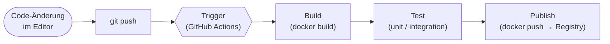

# Einführung in CI/CD mit GitHub Actions

Sobald du Container bauen, Stacks beschreiben und Images optimieren kannst, kommt unweigerlich die nächste Frage: **„Schön, mein Image ist klein und sicher. Aber wie kommt es jetzt eigentlich auf den Server?"**

Genau diese Lücke schließt **CI/CD**. Statt jedes Mal von Hand `docker build`, `docker push`, SSH auf den Server, `docker pull`, `docker compose up` zu tippen, beschreibst du den Ablauf einmal als **Pipeline**. Ein Push auf `main` reicht, damit alles automatisch passiert.

!!! abstract "Was du in diesem Block lernst"
    - erklären, **welches Problem CI/CD löst** und wo manuelle Auslieferung kippt
    - die Begriffe **Continuous Integration**, **Continuous Delivery** und **Continuous Deployment** auseinanderhalten
    - eine **Pipeline** in ihre Phasen zerlegen (Trigger → Build → Test → Publish)
    - die **YAML-Syntax von GitHub Actions** lesen: `on`, `jobs`, `runs-on`, `steps`, `uses`, `run`
    - eine **eigene Workflow-Datei** schreiben, sie bei jedem Push laufen lassen und die Logs im Actions-Tab lesen
    - in den Übungen darauf aufbauen, bis die Pipeline ein Docker-Image **baut, testet und in eine Registry pusht**

---

## Bezug zum IHK-Rahmenplan

Dieser Block adressiert drei Punkte aus dem Rahmenplan:

| Punkt | Inhalt | Wo abgedeckt |
|-------|--------|--------------|
| **2.3.1** | Softwareverteilungsprozesse (Analyse, Planung, Einführung, Pflege) | [Pipeline-Konzept](pipeline-konzept.md) |
| **2.3.3** | Installation und Konfiguration von Produkten zur Softwareverteilung | [Grundlagen von GitHub Actions](github-actions-grundlagen.md) + [Praxis](praxis-erste-pipeline.md) |
| **3.6.1** | automatisierte Testausführung (mitwirken) | [Übungen](uebungen.md) + [Praxisbeispiele](praxis-beispiele.md) |

---

## Seiten in diesem Block

| Seite | Inhalt | Art |
|-------|--------|-----|
| [Warum CI/CD?](warum-cicd.md) | Manuelles Deployment, typische Fehler, „works on my machine" | Theorie |
| [Begriffe: CI, CD, CD](begriffe.md) | Continuous Integration, Continuous Delivery, Continuous Deployment | Theorie |
| [Pipeline-Konzept](pipeline-konzept.md) | Trigger → Build → Test → Publish, Jobs, Steps, Artefakte | Theorie |
| [Grundlagen von GitHub Actions](github-actions-grundlagen.md) | YAML-Syntax, `on`, `jobs`, `steps`, `uses`, `run`, Runner, Secrets | Theorie |
| [Praxis: erste Pipeline](praxis-erste-pipeline.md) | Hands-on: Hello-World-Workflow schreiben und laufen lassen, ohne Docker (ca. 60 Minuten) | Praxis |
| [Übungen](uebungen.md) | 🟢🟡🔴🏆 Vier Schwierigkeitsgrade zum Vertiefen – bis hin zum Docker-Build und -Push in der Pipeline | Training |
| [Praxisbeispiele zum Mitnehmen](praxis-beispiele.md) | Vier komplette Workflows aus dem Alltag: Python-CI mit `pytest`, geplanter Check, Auto-Release, Docker-Pipeline | Vorlagen |
| [Stolpersteine](stolpersteine.md) | Typische Fehler in Workflows, YAML, Secrets, Runner | Referenz |
| [Merksätze](merksaetze.md) | Kompakte Zusammenfassung | Referenz |

---

## Voraussetzungen

- Ein **GitHub-Account** und ein Repository, auf das du pushen darfst (kann ein Test-Repo sein).
- **Git lokal** verfügbar (`git --version` klappt). Auf Windows: [Git for Windows](https://git-scm.com/download/win).
- Für die **Praxisseite** brauchst du **kein** Docker – dort schreiben wir nur eine YAML-Datei.
- Erst ab den Docker-Übungen: eine **funktionierende Docker-Installation** (siehe [Docker installieren](../docker/installation.md)) und idealerweise [Docker für Profis](../docker-profi/index.md) durchgearbeitet. Wir gehen dann davon aus, dass du ein Dockerfile lesen und schreiben kannst.

!!! info "Kein eigener Server nötig"
    Für diesen Block brauchst du **keinen** Produktions-Server. Wir bauen Images bis in eine Registry. Das ist genug, um das Konzept vollständig zu verstehen.

---

## Roter Faden

Die vier Phasen Trigger, Build, Test und Publish sind das **Modell**, an dem jede Pipeline hängt. Nicht jede Pipeline hat alle vier, aber kein Schritt kommt vor seinem Vorgänger.

---

## Leitfrage

> **Wie kommt eine Code-Änderung von „auf meinem Laptop committet" automatisch, reproduzierbar und prüfbar in eine veröffentlichte Version, ohne dass jemand manuell Befehle tippt?**

Am Ende dieses Blocks hast du diese Frage praktisch beantwortet. Mit deiner ersten eigenen Workflow-Datei.
