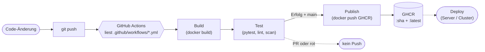

# Merksätze – CI/CD mit GitHub Actions (Block 6)

---

## 1. Manuelles Deployment skaliert nicht

!!! success "Merksatz 1"
    > **Wer manuell deployt, hat versteckten State, fehlende Nachvollziehbarkeit und kombinatorische Komplexität. CI/CD ersetzt mündliches Wissen durch eine versionierte, ausführbare Pipeline.**

Mehr dazu: [Warum CI/CD?](warum-cicd.md)

---

## 2. CI ≠ CD ≠ CD

!!! success "Merksatz 2"
    > **Continuous Integration = bauen + testen. Continuous Delivery = paketieren und bereitlegen. Continuous Deployment = automatisch veröffentlichen. Drei Stufen, zwei Bedeutungen für „CD" – im Zweifel nachfragen.**

Mehr dazu: [Begriffe](begriffe.md)

---

## 3. Pipeline = fünf Phasen

!!! success "Merksatz 3"
    > **Trigger → Build → Test → Publish → Deploy. Nicht jede Pipeline hat alle fünf, aber kein Schritt vor seinem Vorgänger. Tests sind das Sicherheitsnetz – ohne sie ist „grün" bedeutungslos.**

Mehr dazu: [Pipeline-Konzept](pipeline-konzept.md)

---

## 4. Deployment-Strategien sind kein Selbstzweck

!!! success "Merksatz 4"
    > **Recreate für simple Setups, Rolling für Standard-Web-Apps, Blue/Green für instantes Rollback, Canary für maximale Risiko-Kontrolle. Die richtige Strategie ist die, die zur Plattform passt.**

Mehr dazu: [Deployment-Strategien](deployment-strategien.md)

---

## 5. GitHub Actions in einem Satz

!!! success "Merksatz 5"
    > **Workflows liegen in `.github/workflows/`. Aufbau: `on:`-Trigger, `jobs:`-Liste, je Job `runs-on:` und `steps:`. Steps sind entweder `run:` (Shell) oder `uses:` (vorgefertigte Action).**

Mehr dazu: [GitHub Actions – Grundlagen](github-actions-grundlagen.md)

---

## 6. Tags sind Pflicht – `latest` allein ist gefährlich

!!! success "Merksatz 6"
    > **Jedes Image bekommt mindestens zwei Tags: einen unveränderlichen (Commit-SHA oder Semver) und einen gleitenden (`latest`). Ohne unveränderlichen Tag gibt es keinen sauberen Rollback.**

---

## 7. PR baut, `main` veröffentlicht

!!! success "Merksatz 7"
    > **Pull Requests sollen bauen und testen, aber nicht in die Registry pushen. Nur Pushes auf `main` (oder Versions-Tags) lösen Publish aus. `if: github.event_name == 'push'` ist dafür der Standard-Filter.**

---

## 8. Secrets gehören in die Settings, nicht ins YAML

!!! success "Merksatz 8"
    > **Niemals Tokens, Passwörter oder Keys ins Workflow-YAML. Repo → Settings → Secrets and variables → Actions. Im Workflow nur über `${{ secrets.NAME }}` zugreifen. Für GHCR reicht der eingebaute `GITHUB_TOKEN` mit `permissions: packages: write`.**

---

## Das große Bild

---

## Ausblick

Was jetzt noch offen ist:

- **Vom Image zur Produktion**: Klassisches SSH-Deploy oder eine Plattform wie Kubernetes mit ArgoCD – Stoff für [Ausblick](ausblick.md).
- **Cross-Repo-Workflows**: wenn ein Workflow in Repo A einen Workflow in Repo B auslöst.
- **Self-hosted Runner**: für besondere Hardware oder Compliance.
- **Andere CI-Systeme**: GitLab CI, Jenkins, Azure DevOps – ähnliche Konzepte, andere Syntax.
- **GitOps**: Code im Repo beschreibt nicht nur die App, sondern auch ihren **Soll-Zustand auf dem Cluster**. ArgoCD/Flux gleichen Soll und Ist ab.

Aber: **eine vollständige CI-Pipeline mit Test, Build und Push läuft.** Das ist die Grundlage für alles, was danach kommt.

---

## Letzter Tipp

Eine Pipeline ist **lebendig**. Was heute funktioniert, hat morgen vielleicht eine veraltete Action, einen geänderten Token-Default oder ein neues Compliance-Requirement. Der Trick:

- **Logs regelmäßig anschauen**, auch wenn alles grün ist.
- **Action-Versionen halbjährlich** auf neue Major-Versions heben.
- Pipeline-Code wie **Anwendungscode** behandeln: in Reviews mit-checken, refactoren, verständlich halten.

Eine schlecht gepflegte Pipeline ist gefährlich – weil sie das **falsche** Vertrauen geben kann.
