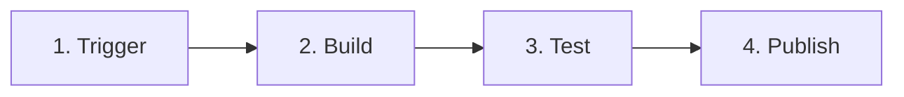
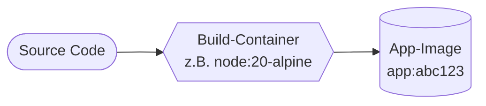
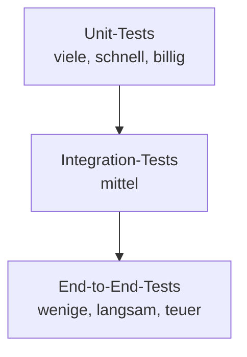

# Pipeline-Konzept: Was läuft eigentlich Schritt für Schritt?

!!! abstract "Lernziel"
    Nach dieser Seite kannst du:

    - eine Pipeline in **vier Phasen** zerlegen: Trigger, Build, Test, Publish
    - die Phasen einer Pipeline in den Softwareverteilungsprozess **2.3.1** des Rahmenplans einordnen
    - die Begriffe **Job**, **Stage**, **Step** und **Artefakt** sauber unterscheiden
    - eine kleine Pipeline auf Papier skizzieren, ohne ein konkretes Tool zu kennen

---

## Bezug zum Rahmenplan

Diese Seite adressiert Punkt **2.3.1** des Rahmenplans:

> **Softwareverteilungsprozesse analysieren, planen, einführen und pflegen.**

„Pipeline" ist genau das: ein **Softwareverteilungsprozess** in maschinenlesbarer Form. Was wir hier konzeptuell aufbauen, ist die Grundlage für jede Pipeline-Implementierung, egal ob mit GitHub Actions, GitLab CI, Jenkins oder Azure DevOps.

---

## Das Phasen-Modell

Jede CI/CD-Pipeline für Container-Anwendungen läuft durch dieselben **vier Phasen**:



Nicht jede Pipeline hat **alle** vier, aber kein Schritt darf vor seinem Vorgänger laufen. Die Reihenfolge ist nicht beliebig, sie ist **kausal**.

| Phase | Was passiert | Typische Dauer |
|-------|--------------|---------------|
| **Trigger** | Etwas löst die Pipeline aus (Push, Tag, Cron, Manual). | Sekunden |
| **Build** | Code wird kompiliert/gebaut, Image wird erstellt. | 1–10 Minuten |
| **Test** | Automatische Tests laufen (Unit, Integration, Lint, Security). | 1–30 Minuten |
| **Publish** | Build-Ergebnis wird veröffentlicht (Registry, Artifact-Store). | Sekunden bis Minuten |

Auf das fertige Artefakt in der Registry folgt typischerweise noch ein **Deploy** auf einen Server oder ein Cluster. Das hängt aber stark von der Zielplattform ab und ist Stoff für eine separate Einheit.

---

## Phase 1: Trigger

Eine Pipeline reagiert auf **Ereignisse**. Die häufigsten:

- **Push**: Code wird in den Hauptzweig gemerged.
- **Pull Request**: jemand schlägt eine Änderung vor; die Pipeline prüft sie, bevor jemand sie reviewt.
- **Tag**: ein **Release-Tag** (z.B. `v1.4.2`) wird gesetzt. Das löst eine Release-Pipeline aus.
- **Cron / Schedule**: nachts um drei laufen z.B. Security-Scans.
- **Manual**: ein Mensch klickt einen Button („Deploy zu Production").
- **Webhook**: ein anderes System (z.B. ein DB-Schema-Update) löst eine Pipeline aus.

In GitHub Actions sieht das so aus:

```yaml
on:
  push:
    branches: [main]
  pull_request:
  schedule:
    - cron: "0 3 * * *"   # täglich 3 Uhr
  workflow_dispatch:      # manueller Knopf
```

!!! tip "Trigger sauber wählen"
    - **Pull Requests** sollten **immer** mindestens Build + Test triggern. Sonst sieht niemand vor dem Merge, ob der Code überhaupt baut.
    - **Push auf main** sollte nur dann automatisch deployen, wenn du **Continuous Deployment** wirklich willst. Sonst Trigger zusätzlich auf Tags binden.

---

## Phase 2: Build

Der eigentliche **Bau** des Artefakts. Beispiele:

| Sprache / Stack | Build-Schritt |
|-----------------|--------------|
| Java (Maven) | `mvn package` |
| Node.js | `npm ci && npm run build` |
| Go | `go build` |
| Python | `pip install -r requirements.txt` |
| **Containerisiert** | `docker build -t app:tag .` |

In containerisierten Pipelines wird der Build oft **selbst in einem Container** ausgeführt, damit das Build-Environment auf jedem Runner identisch ist:



### Was eine gute Build-Phase ausmacht

- **Reproduzierbar**: Gleiche Inputs → gleiche Outputs. Keine zufälligen Build-Nummern, keine zufälligen Zeitstempel im Image-Hash.
- **Schnell**: Layer-Caching nutzen, Dependencies cachen. Mehr dazu in den [Best-Practices aus Block 5](../docker-profi/dockerfile-best-practices.md#1-layer-caching-aktiv-nutzen).
- **Versioniert**: Das Ergebnis hat einen **eindeutigen Tag**, meist die Git-Commit-SHA oder den Git-Tag.

---

## Phase 3: Test

Die Tests sind das **Sicherheitsnetz** der Pipeline. Ohne sie ist „grün" bedeutungslos.

### Test-Pyramide



| Test-Typ | Was wird getestet | Tempo | Empfohlene Anzahl |
|----------|-------------------|-------|-------------------|
| **Unit-Tests** | Einzelne Funktionen, isoliert | Millisekunden | hunderte bis tausende |
| **Integration-Tests** | Mehrere Module zusammen, oft mit DB / API | Sekunden bis Minuten | dutzende |
| **End-to-End-Tests** | Komplette Anwendung wie ein User | Minuten | wenige |

### Was sonst noch in die Test-Phase gehört

Nicht nur Code-Tests! Auch:

- **Linter** (`eslint`, `pylint`, `golangci-lint`) für Stil und einfache Fehler.
- **Type-Checks** (`tsc`, `mypy`).
- **Security-Scanner** wie [`trivy`](../docker-profi/image-optimierung.md#trivy-images-auf-cves-scannen) für Container-Images oder `npm audit` / `pip-audit` für Abhängigkeiten.
- **Format-Checks** (`prettier --check`, `gofmt`).

!!! warning "Tests müssen schnell genug sein"
    Wenn die Pipeline 30 Minuten braucht, bevor sie sagt „okay, du kannst mergen", werden Leute sie umgehen. **Faustregel:** unter 10 Minuten ist gut, unter 5 Minuten ist toll. Längeres gehört in einen separaten nächtlichen Lauf.

### Bezug zu 3.6.1

> **Mit der Software automatisierte Testausführungen ausführen** (Punkt 3.6.1 im Rahmenplan).

Genau das ist die Test-Phase. Wir gehen das in der [Praxis](praxis-erste-pipeline.md) konkret durch: ein einfacher `pytest`-Lauf in der Pipeline, der einen Bug verhindert.

---

## Phase 4: Publish

Hier wird das Ergebnis **nutzbar gemacht**, damit es entweder direkt deployt werden kann oder zumindest jemand es manuell verteilen kann.

Bei Container-basierten Setups heißt „Publish" praktisch immer: **Image in eine Registry pushen**.

### Welche Registries gibt es?

| Registry | Hosting | Authentifizierung in CI |
|----------|---------|------------------------|
| **Docker Hub** | docker.com | Login mit User + Token |
| **GitHub Container Registry (GHCR)** | ghcr.io, integriert in GitHub | `GITHUB_TOKEN` reicht |
| **GitLab Container Registry** | im GitLab-Projekt | Job-Token |
| **AWS ECR / Azure ACR / Google GCR** | Cloud-spezifisch | OIDC / IAM |
| **Harbor** | Self-hosted | LDAP, Robot-Accounts |

In diesem Block nutzen wir **GHCR**. Es funktioniert ohne extra Account, ist kostenlos für öffentliche Repos und wird mit dem `GITHUB_TOKEN` automatisch authentifiziert.

### Tagging-Strategien

Wie heißt das Image in der Registry? Drei gängige Muster, die sich gut **kombinieren** lassen:

```text
ghcr.io/jacobmenge/cicd-demo:latest                  # gleitend (immer "neueste")
ghcr.io/jacobmenge/cicd-demo:main                    # Branch
ghcr.io/jacobmenge/cicd-demo:abc1234                 # Commit-SHA (kurz)
ghcr.io/jacobmenge/cicd-demo:v1.4.2                  # Semver-Tag
ghcr.io/jacobmenge/cicd-demo:2026-05-07.142          # Zeit + Build-Nummer
```

!!! danger "`:latest` allein ist gefährlich"
    Wer nur `:latest` pusht, verliert die Möglichkeit zum **gezielten Rollback**. Der Tag wandert immer auf die neueste Version. **Immer zusätzlich** ein unveränderliches Tag (Commit-SHA oder Semver) pushen.

---

## Begriffe: Job, Stage, Step, Artefakt

Wenn du Pipeline-Konfigurationen liest, tauchen ständig dieselben Wörter auf. Sie sind nicht 100 % einheitlich definiert, aber meist:

| Begriff | Bedeutung |
|---------|-----------|
| **Step** | Eine einzelne Aktion (`docker build`, `pytest`, `npm install`). |
| **Job** | Eine geordnete Folge von Steps, die zusammen auf **einer Maschine** laufen. |
| **Stage** | Eine Gruppe von Jobs, die gemeinsam einen Pipeline-Abschnitt bilden (alle Test-Jobs, alle Deploy-Jobs). |
| **Workflow / Pipeline** | Die ganze Datei mit allen Jobs und Stages. |
| **Runner / Agent** | Die Maschine, auf der ein Job läuft (Cloud-VM, eigener Server, Container). |
| **Artefakt** | Das Ergebnis eines Jobs, das spätere Jobs nutzen können (z.B. ein Image, eine `.zip`, ein Test-Report). |

In **GitHub Actions** sind die Begriffe so abgebildet:

```yaml
name: CI                          # Workflow / Pipeline
on:
  push:
    branches: [main]
jobs:
  build:                          # Job
    runs-on: ubuntu-latest        # Runner
    steps:                        # Steps
      - uses: actions/checkout@v4
      - run: docker build .
  test:                           # zweiter Job (kann parallel oder sequentiell laufen)
    runs-on: ubuntu-latest
    needs: build                  # Abhängigkeit: erst nach build
    steps:
      - uses: actions/checkout@v4
      - run: pytest
```

GitHub Actions kennt **kein eigenes „Stage"-Konzept**. Stages werden über `needs:` zwischen Jobs nachgebaut. Andere Tools (GitLab, Jenkins) haben eine explizite `stage:`-Direktive.

---

## Pipeline-Beispiel auf Papier

Bevor wir in YAML einsteigen, lohnt es, eine Pipeline **textlich** auf einem Blatt zu skizzieren. Das geht ohne Tool-Wissen und zwingt zum Klar-Denken:

```text
PIPELINE: cicd-demo

Trigger:
  - push auf main
  - pull request gegen main

Job "build":
  - actions/checkout (Code holen)
  - docker build -t cicd-demo:${SHA} .

Job "test"  (needs: build):
  - actions/checkout
  - docker run --rm cicd-demo:${SHA} pytest

Job "publish"  (needs: [build, test], nur auf main):
  - login zur Registry
  - docker tag cicd-demo:${SHA} ghcr.io/.../cicd-demo:${SHA}
  - docker tag cicd-demo:${SHA} ghcr.io/.../cicd-demo:latest
  - docker push ...:${SHA}
  - docker push ...:latest
```

Das ist fast schon der Workflow, den wir in der [Praxis](praxis-erste-pipeline.md) bauen. Erst die Logik klären, **dann** das YAML schreiben. Nicht umgekehrt.

---

## Bezug zu 2.3.1: Softwareverteilungsprozesse

Der Rahmenplan zerlegt den Softwareverteilungsprozess in vier Aufgaben: **analysieren, planen, einführen, pflegen**. Eine Pipeline ist die Antwort auf alle vier:

| Rahmenplan-Aufgabe | Was die Pipeline beiträgt |
|--------------------|---------------------------|
| **analysieren** | Welche Schritte gehören zur Auslieferung? Wer löst was aus? Welche Prüfungen brauchen wir? |
| **planen** | Trigger, Phasen, Abhängigkeiten zwischen Jobs, Tagging-Strategie, Rollback-Plan. |
| **einführen** | Workflow-Datei schreiben, Secrets konfigurieren, ersten Lauf prüfen. |
| **pflegen** | Logs auswerten, fehlschlagende Jobs debuggen, Pipeline an neue Anforderungen anpassen, Versionen der Actions aktualisieren. |

Eine Pipeline ist also **kein einmaliges Setup**, sondern ein **lebendiger Prozess**, der gepflegt werden will, genauso wie Code.

---

## Stolpersteine

??? warning "Pipeline ist langsam, niemand wartet auf sie"
    **Symptom:** Build dauert 25 Minuten. Entwickler mergen, ohne auf Grün zu warten.

    **Lösung:** Cache nutzen (Image-Layer, Dependencies), Tests parallelisieren, langsame Tests in eigenen nächtlichen Job auslagern.

??? warning "Pipeline ist flaky, mal grün, mal rot"
    **Symptom:** Bei der dritten Wiederholung wird's grün. Niemand weiß warum.

    **Lösung:** Flaky Tests **markieren und reparieren**, nicht ignorieren. Häufigste Ursachen: Zeitabhängigkeiten (`sleep`-basierte Tests), externe Services ohne Mock, Race-Conditions.

??? warning "Pipeline tut zu viel auf einmal"
    **Symptom:** Ein einziger Job für Build + Test + Lint + Security-Scan + Publish. Wenn der Lint fehlschlägt, fällt alles um und du verlierst Build-Cache.

    **Lösung:** **Trennen.** Jeder Job sollte eine klare Aufgabe haben. Mit `needs:` baust du die Reihenfolge.

??? danger "Pipeline veröffentlicht, obwohl Tests fehlschlagen"
    **Symptom:** Ein Step ignoriert seinen Exit-Code (`set +e`, `|| true`), oder zwei Jobs sind nicht über `needs:` verkettet.

    **Diagnose:** Den `publish`-Job dürfen ausschließlich erfolgreiche `build`- und `test`-Jobs auslösen. Sonst zerstörst du das Sicherheitsnetz.

---

## Was du jetzt wissen solltest

- Eine Pipeline läuft durch **vier Phasen**: Trigger, Build, Test, Publish.
- Nicht jede Pipeline hat alle Phasen. Niemals ist die Reihenfolge beliebig.
- **Trigger** sind Ereignisse (Push, Tag, Schedule, Manual). Wähl sie bewusst.
- **Tests** sind das Sicherheitsnetz; eine Pipeline ohne Tests bringt nur Tempo, keine Qualität.
- **Tagging-Strategie** zählt: `latest` allein ist ein Anti-Pattern.
- Die Begriffe **Job, Step, Stage, Runner, Artefakt** sind tool-übergreifend nützlich.

---

## Merksatz

!!! success "Merksatz"
    > **Pipeline = Trigger → Build → Test → Publish. Jede Phase eine klare Aufgabe, jede Phase mit Logs, jede Phase prüfbar. Kein Schritt vor seinem Vorgänger und kein Publish ohne grüne Tests.**

---

## Weiterlesen

- [Grundlagen von GitHub Actions](github-actions-grundlagen.md): jetzt die konkrete Syntax
- [Praxis: erste Pipeline](praxis-erste-pipeline.md): das Konzept in einer eigenen Workflow-Datei
