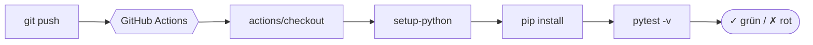
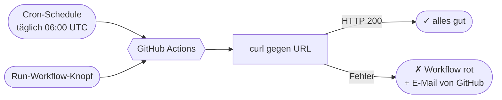
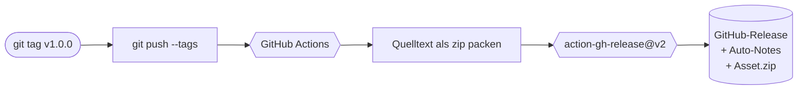
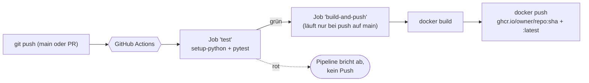

# Praxisbeispiele zum Mitnehmen

In den [Übungen](uebungen.md) hast du die einzelnen Bausteine von GitHub Actions geübt. Diese Seite zeigt dir **vier komplette Workflows**, die du fast unverändert in eigenen Projekten einsetzen kannst. Es sind keine künstlichen Lern-Aufgaben mehr. Es sind die typischen Vorlagen, die du auf realen Repos so oder so ähnlich siehst.

!!! abstract "Was du auf dieser Seite findest"
    Vier Praxisbeispiele, sortiert nach Aufwand:

    1. **Python-Tests bei jedem Push** – die einfachste sinnvolle CI für ein kleines Tool.
    2. **Webseite geplant prüfen** – ein Cron-getriebener Health-Check ohne Projektcode.
    3. **Release bei Tag-Push** – aus `v1.2.0` automatisch einen GitHub-Release machen.
    4. **Docker-Pipeline für eine Web-App** – Tests, Build und Push zu GHCR in zwei Jobs.

    Jedes Beispiel hat dieselbe Struktur:

    - **Worum geht es?** – wann du das im Alltag brauchst
    - **Die Dateien** – kompletter Code zum Kopieren
    - **Jede Zeile erklärt** – warum genau das so dort steht
    - **Schritt für Schritt** – wie du es zum Laufen bringst
    - **Probier es selbst aus** – kleine Aufgabe zum Anwenden und Variieren

    Das hier ist kein Schulstoff zum Auswendiglernen. Es sind Vorlagen, die in deinem nächsten echten Projekt funktionieren.

---

## Bevor du loslegst

Du kannst die Beispiele in dem Repo `mein-erster-workflow` aus der [Praxis](praxis-erste-pipeline.md) durchspielen oder pro Beispiel ein neues Repo anlegen. Jedes Beispiel ist eigenständig. Es überschreibt keine Dateien aus den anderen.

Du brauchst:

- Ein GitHub-Konto und Schreibrechte auf einem Repo deiner Wahl
- Git lokal (`git --version` muss klappen)
- Einen Editor
- Für Beispiel 4 zusätzlich Docker lokal (nicht zwingend, aber praktisch zum Testen)

!!! tip "Schnell mehrere Repos? Über GitHub-Web geht das auch"
    Wenn du nicht für jedes Beispiel ein lokales Klon-und-Push-Spiel haben möchtest, lege das Repo direkt auf <https://github.com/new> an. **Add a README file** anhaken. Klicke dann auf die Datei und im Editor oben rechts auf das **Stiftsymbol**. Mit „Add file → Create new file" kannst du auch den Pfad `.github/workflows/xyz.yml` direkt eingeben. Speichern, committen, fertig. Für die Beispiele 1, 4 (mit App-Code) macht das lokale Klonen aber mehr Spaß.

---

## Beispiel 1: Python-Tests automatisch bei jedem Push

!!! info "Was du lernst"
    - eine echte kleine Python-Anwendung mit pytest in CI bringen
    - `actions/setup-python` mit eingebautem Pip-Cache nutzen
    - Tests gegen `push` und `pull_request` laufen lassen
    - sehen, wie ein fehlgeschlagener Test die Pipeline rot macht

### Worum geht es?

Du hast ein Python-Tool. Ein Skript für eine wiederkehrende Aufgabe. Eine kleine Bibliothek. Du willst sicher sein, dass du beim nächsten Refactoring nichts kaputt machst. Genau das ist [Continuous Integration](begriffe.md#continuous-integration-ci). Bei jedem Push laufen Tests auf einem frischen Runner. Wenn sie grün sind, weißt du: das Repo ist in einem gesunden Zustand.

Das hier ist die einfachste sinnvolle Vorlage. Ohne Linting, ohne Matrix, ohne Coverage. Nur Tests. Genau das, was du in 90 Prozent der Python-Repos siehst.



### Die Dateien

Wir bauen eine winzige Kalkulator-Bibliothek mit zwei Funktionen und drei Tests. Das ist absichtlich klein gehalten. Eine echte Bibliothek hätte dieselbe Struktur, nur mehr Code.

**Verzeichnisstruktur:**

```text
.
├── .github/
│   └── workflows/
│       └── python-tests.yml
├── kalkulator.py
├── test_kalkulator.py
└── requirements.txt
```

**`kalkulator.py`** – das eigentliche „Tool":

```python
def addiere(a, b):
    return a + b


def teile(a, b):
    if b == 0:
        raise ValueError("Teilen durch null geht nicht")
    return a / b
```

**`test_kalkulator.py`** – drei Tests, die das Tool prüfen:

```python
import pytest

from kalkulator import addiere, teile


def test_addiere_gibt_summe_zurueck():
    assert addiere(2, 3) == 5


def test_teile_normal():
    assert teile(10, 2) == 5


def test_teile_durch_null_wirft_fehler():
    with pytest.raises(ValueError):
        teile(10, 0)
```

**`requirements.txt`** – die einzige Abhängigkeit:

```text
pytest==8.3.3
```

**`.github/workflows/python-tests.yml`** – der Workflow:

```yaml
name: Python-Tests

on:
  push:
  pull_request:

jobs:
  test:
    runs-on: ubuntu-latest
    steps:
      - name: Code holen
        uses: actions/checkout@v4

      - name: Python einrichten
        uses: actions/setup-python@v5
        with:
          python-version: "3.12"
          cache: pip

      - name: Abhängigkeiten installieren
        run: pip install -r requirements.txt

      - name: Tests ausführen
        run: pytest -v
```

### Jede Zeile erklärt

Wir gehen den Workflow von oben nach unten durch. Wenn dir ein Begriff schon aus den [Grundlagen](github-actions-grundlagen.md) bekannt ist, dürfen die Erklärungen für dich Wiederholung sein. Trotzdem kommt jeder Block einmal vor. So bleibt das Beispiel komplett.

```yaml
name: Python-Tests
```

Anzeigename des Workflows. Taucht im **Actions-Tab** als Überschrift auf. Reine Kosmetik, aber bei mehreren Workflows pro Repo hilft ein klarer Name beim Wiederfinden.

```yaml
on:
  push:
  pull_request:
```

Zwei [Trigger](../glossar.md#trigger) nebeneinander. `push:` ohne weitere Filter heißt: bei **jedem** Push auf **jeden** Branch. `pull_request:` heißt: bei jedem neuen oder aktualisierten Pull Request. Diese Kombination ist die übliche Wahl für Tests. Push prüft deinen eigenen Stand. Pull Request prüft den Stand, der gerade reviewt wird.

```yaml
jobs:
  test:
    runs-on: ubuntu-latest
```

Ein einziger [Job](../glossar.md#workflow) mit dem Namen `test`. Er läuft auf einer von GitHub gestellten Ubuntu-VM. „latest" zeigt jeweils auf die aktuelle LTS-Version, derzeit Ubuntu 24.04. Brauchst du eine konkrete Version, schreibst du `ubuntu-22.04` statt `ubuntu-latest`. Für Standard-Python-Projekte ist `ubuntu-latest` immer fein.

```yaml
    steps:
      - name: Code holen
        uses: actions/checkout@v4
```

Erster Step in praktisch jedem Workflow: das Repo auf den Runner holen. Ohne diesen Step ist die VM leer. Die Action ist offiziell von GitHub. `@v4` ist die Major-Version. Du musst keine Parameter mitgeben. Defaults sind: aktueller Branch, neuester Commit.

```yaml
      - name: Python einrichten
        uses: actions/setup-python@v5
        with:
          python-version: "3.12"
          cache: pip
```

Installiert Python in der gewünschten Version auf dem Runner. Wichtig sind die zwei `with:`-Parameter:

- `python-version: "3.12"` ist die Python-Version. Anführungszeichen sind wichtig. Ohne sie würde YAML `3.12` als Fließkommazahl lesen, was zu Fehlern führen kann.
- `cache: pip` schaltet einen eingebauten Cache für Pip-Abhängigkeiten an. Die Action liest dafür automatisch deine `requirements.txt`. Beim zweiten Lauf installiert pip nicht neu, sondern zieht die Pakete aus dem Cache. Das spart pro Lauf einige Sekunden bis Minuten, je nach Projektgröße.

```yaml
      - name: Abhängigkeiten installieren
        run: pip install -r requirements.txt
```

Klassischer Shell-Befehl. `pip install -r requirements.txt` installiert alles, was in der Datei steht. Hier ist das nur `pytest`, aber das Pattern bleibt dasselbe für 50 oder 500 Pakete.

```yaml
      - name: Tests ausführen
        run: pytest -v
```

Das Herzstück. `pytest` findet automatisch alle Dateien, die mit `test_` beginnen und führt darin alle Funktionen aus, die mit `test_` beginnen. `-v` heißt „verbose": jeder einzelne Test wird im Log mit Namen und Status aufgeführt. Bricht ein Test ab, endet `pytest` mit einem Exit-Code ungleich 0. GitHub Actions wertet das als roten Step.

### Schritt für Schritt: anlegen und pushen

**Schritt 1: Repo vorbereiten**

Du kannst das Praxis-Repo `mein-erster-workflow` weiter nutzen oder ein frisches anlegen. Für ein frisches Repo: <https://github.com/new>, Name z. B. `python-ci-demo`, **Public** auswählen, **Add a README file** anhaken, **Create repository**.

Im Terminal klonen:

=== "macOS / Linux"
    ```bash
    git clone https://github.com/<DEIN-USERNAME>/python-ci-demo.git
    cd python-ci-demo
    ```

=== "Windows PowerShell"
    ```powershell
    git clone https://github.com/<DEIN-USERNAME>/python-ci-demo.git
    Set-Location python-ci-demo
    ```

**Schritt 2: App-Dateien anlegen**

Im Editor:

- `kalkulator.py` mit dem Inhalt aus dem Code-Block oben.
- `test_kalkulator.py` mit dem Test-Inhalt.
- `requirements.txt` mit der einen Zeile `pytest==8.3.3`.
- `.gitignore` mit zwei Zeilen, damit Python-Müll nicht mitkommt:

    ```text
    .venv/
    __pycache__/
    ```

    Ohne diese Datei würde gleich beim `git add .` auch dein virtuelles Environment mit committed werden. Ein `.venv/`-Ordner ist gerne mehrere hundert Megabyte groß und gehört nie ins Repo.

**Schritt 3: Workflow-Datei anlegen**

Der Ordner `.github/workflows/` ist auf den meisten Systemen versteckt (Punkt am Anfang). Leg ihn so an:

=== "macOS / Linux"
    ```bash
    mkdir -p .github/workflows
    ```

=== "Windows PowerShell"
    ```powershell
    New-Item -ItemType Directory -Force -Path .github\workflows | Out-Null
    ```

=== "Windows CMD"
    ```cmd
    if not exist ".github\workflows" md ".github\workflows"
    ```

Tipp: viele Editoren (VSCode, JetBrains) erstellen den Ordner automatisch, wenn du eine Datei mit `.github/workflows/python-tests.yml` als Pfad anlegst. Dann sparst du dir den Mkdir-Schritt.

Anschließend `.github/workflows/python-tests.yml` mit dem Inhalt von oben anlegen, speichern.

**Schritt 4: Lokal kurz prüfen, bevor du pushst**

Bevor du den ersten Push raushaust, lass die Tests einmal **lokal** laufen. Wenn sie hier schon scheitern, scheitern sie auch auf dem Runner. Lokal findest du den Fehler in zwei Sekunden, in CI brauchst du dafür einen Minute-Cycle.

=== "macOS / Linux"
    ```bash
    python3 -m venv .venv
    source .venv/bin/activate
    pip install -r requirements.txt
    pytest -v
    ```

=== "Windows PowerShell"
    ```powershell
    python -m venv .venv
    .\.venv\Scripts\Activate.ps1
    pip install -r requirements.txt
    pytest -v
    ```

=== "Windows CMD"
    ```cmd
    python -m venv .venv
    .venv\Scripts\activate.bat
    pip install -r requirements.txt
    pytest -v
    ```

Du solltest drei Tests mit `PASSED` sehen.

!!! tip "Aktivierung des venv schlägt fehl?"
    Auf Windows kann die erste Aktivierung mit der Meldung „running scripts is disabled on this system" scheitern. Das ist die **Execution Policy**. Einmalig im PowerShell ausführen, dann gilt das für dein User-Konto:

    ```powershell
    Set-ExecutionPolicy -Scope CurrentUser RemoteSigned
    ```

    Danach klappt `.\.venv\Scripts\Activate.ps1`. Auf macOS und Linux brauchst du das nicht.

**Schritt 5: Pushen**

```bash
git add .
git commit -m "Erste Python-CI"
git push
```

**Schritt 6: Im Actions-Tab nachschauen**

Auf GitHub den Reiter **Actions** öffnen. Du siehst den Lauf „Python-Tests". Status erst gelb, nach 15 bis 30 Sekunden grün. Klick rein, klick auf den Job `test`, klick auf jeden Step und schau dir die Logs an.

Im Log des Tests-Steps siehst du etwa:

```text
test_kalkulator.py::test_addiere_gibt_summe_zurueck PASSED
test_kalkulator.py::test_teile_normal PASSED
test_kalkulator.py::test_teile_durch_null_wirft_fehler PASSED
============================== 3 passed in 0.02s ===============================
```

!!! success "Geschafft"
    Du hast eine vollständige Python-CI-Pipeline. Pushst du eine kaputte Änderung an `kalkulator.py`, schlägt der Lauf fehl und du bekommst sofort Bescheid. Pull Requests können in den Repo-Einstellungen so konfiguriert werden, dass sie nur mergebar sind, wenn diese Pipeline grün ist. Damit hast du eine technische Garantie dafür, dass kaputte Tests nie auf `main` landen.

### Probier es selbst aus

Drei Übungen, von kleinster Änderung bis eigenes Projekt. Mach mindestens die ersten zwei.

#### A) Test bewusst kaputt machen

Ändere in `kalkulator.py` die `addiere`-Funktion auf `return a - b`. Committen und pushen. Der Workflow muss jetzt **rot** werden. Im Log siehst du, welcher Test gescheitert ist und mit welcher Erwartung. Anschließend wieder zurückbauen und grün pushen.

So spürst du in der Praxis, was CI wirklich macht. Sie fängt genau diese Art von versehentlicher Regression ab.

#### B) Linter hinzufügen

Echte Repos prüfen meist nicht nur Tests, sondern auch den **Stil**. Das schnellste Tool dafür ist [`ruff`](https://docs.astral.sh/ruff/). Ergänze in `requirements.txt`:

```text
ruff==0.6.9
```

Im Workflow vor dem Tests-Step:

```yaml
      - name: Linter laufen lassen
        run: ruff check .
```

Pushen. Ruff prüft jetzt deine Python-Dateien. Anfangs ohne Beanstandung. Bau dann absichtlich einen Stilbruch ein, zum Beispiel eine ungenutzte Variable:

```python
def addiere(a, b):
    unbenutzt = 42
    return a + b
```

Pushen. Der Linter-Step soll rot werden, der Test-Step gar nicht mehr laufen.

#### C) Auf eigenes Projekt anwenden

Hast du ein eigenes Python-Skript, ein Hobby-Tool, eine Mini-Bibliothek? Lege dort dieselbe Workflow-Datei an und passe die `python-version` an. Wenn du noch keine Tests hast, schreib zwei oder drei einfache. Das ist der schnellste Weg, eine vorhandene Sammlung an Skripten in ein „seriöses" Repo zu verwandeln.

!!! tip "Wenn dein Projekt keine `requirements.txt` hat"
    Manche Projekte nutzen `pyproject.toml` oder `setup.cfg`. In diesem Fall ersetzt du den Install-Step durch `pip install .` (im Projekt-Root) oder `pip install -e .`. Den Pip-Cache musst du dann anders konfigurieren. Für die ersten Schritte ist eine `requirements.txt` aber das Einfachste.

---

## Beispiel 2: Webseite täglich automatisch prüfen

!!! info "Was du lernst"
    - einen Workflow nach Uhrzeit starten lassen (`schedule:`)
    - Cron-Syntax in GitHub Actions richtig schreiben
    - einen Workflow zusätzlich manuell auslösbar machen
    - einen Step bewusst scheitern lassen, wenn etwas nicht stimmt

### Worum geht es?

Du betreibst eine kleine Webseite. Dein Portfolio. Den Blog deiner Familie. Den Lehrlings-Newsletter. Eine API für ein Hobbyprojekt. Sie soll erreichbar bleiben. Du willst nicht jeden Morgen die URL aufrufen, um zu sehen, ob alles läuft.

Genau dafür ist der `schedule:`-Trigger gedacht. GitHub Actions ist nicht nur ein CI-System, sondern auch ein kleiner Cron-Server in der Cloud. Du beschreibst einmal: „Jeden Tag um 06:00 UTC" und der Workflow läuft von selbst. Schlägt der Check fehl, bekommst du eine E-Mail von GitHub.



### Die Dateien

Dieses Beispiel braucht **nur eine Datei**. Keinen Code, keine Tests, keine Abhängigkeiten. Nur den Workflow.

**Verzeichnisstruktur:**

```text
.
└── .github/
    └── workflows/
        └── webseite-pruefen.yml
```

**`.github/workflows/webseite-pruefen.yml`**:

```yaml
name: Webseite prüfen

on:
  schedule:
    - cron: "0 6 * * *"
  workflow_dispatch:
    inputs:
      url:
        description: "Welche URL prüfen?"
        required: true
        default: "https://example.com"

jobs:
  check:
    runs-on: ubuntu-latest
    steps:
      - name: HTTP-Status holen
        env:
          URL: ${{ inputs.url || 'https://example.com' }}
        run: |
          echo "Prüfe $URL"
          STATUS=$(curl --silent --location --max-time 10 \
                        --output /dev/null --write-out "%{http_code}" "$URL")
          echo "HTTP-Status: $STATUS"
          if [ "$STATUS" != "200" ]; then
            echo "FEHLER: Erwartet 200, bekommen $STATUS"
            exit 1
          fi
          echo "Webseite ist erreichbar."
```

### Jede Zeile erklärt

```yaml
on:
  schedule:
    - cron: "0 6 * * *"
```

`schedule:` ist der Cron-Trigger. Darunter steht **eine Liste** von Schedule-Einträgen. Jeder Eintrag hat einen `cron:`-Schlüssel mit fünf Feldern. Die Reihenfolge ist:

```text
"Minute  Stunde  Tag-im-Monat  Monat  Wochentag"
```

`0 6 * * *` bedeutet also: Minute 0, Stunde 6, an jedem Tag, jedem Monat, jedem Wochentag. Also täglich um 6:00 Uhr. **Wichtig: die Zeit ist UTC**, nicht deine Lokalzeit. In Deutschland gilt:

- **Winterzeit** (CET, ungefähr Ende Oktober bis Ende März): UTC + 1 Stunde. Aus `0 6 * * *` werden 7:00 morgens Lokalzeit.
- **Sommerzeit** (CEST, ungefähr Ende März bis Ende Oktober): UTC + 2 Stunden. Aus `0 6 * * *` werden 8:00 morgens Lokalzeit.

GitHub macht keine Umrechnung. Der Cron-Ausdruck bleibt fest auf UTC, die Lokalzeit verschiebt sich um eine Stunde, wenn die Uhren umgestellt werden.

Ein paar weitere Cron-Beispiele:

| Cron-Ausdruck | Bedeutung |
|---------------|-----------|
| `*/15 * * * *` | alle 15 Minuten |
| `0 */6 * * *` | alle 6 Stunden (00:00, 06:00, 12:00, 18:00 UTC) |
| `0 9 * * 1-5` | werktags um 9:00 UTC |
| `0 0 1 * *` | jeden Monatsersten um Mitternacht UTC |

```yaml
  workflow_dispatch:
    inputs:
      url:
        description: "Welche URL prüfen?"
        required: true
        default: "https://example.com"
```

Zusätzlich zum Cron auch ein manueller Knopf im Actions-Tab. Mit einem Eingabefeld `url`. So kannst du den Workflow auch außerhalb des Schedules starten und dabei eine andere URL prüfen. Das ist gerade beim Einrichten und Debuggen sehr praktisch. Du musst nicht 24 Stunden auf den nächsten Lauf warten.

```yaml
        env:
          URL: ${{ inputs.url || 'https://example.com' }}
```

Wir setzen eine [Umgebungsvariable](../glossar.md#umgebungsvariable) `URL` auf Step-Ebene. Der Wert ist „die Eingabe aus dem manuellen Trigger, oder falls leer der Default `https://example.com`". Beim Schedule-Lauf ist `inputs.url` leer, also greift der Default. Beim manuellen Lauf hast du das Feld ausgefüllt, also nimmt der Operator den ersten Wert.

Der `||`-Operator funktioniert hier wie in vielen Programmiersprachen: er nimmt den ersten **wahren** Wert. Ein leerer String gilt als falsch.

```yaml
        run: |
          echo "Prüfe $URL"
```

Das `|` startet einen mehrzeiligen Shell-Block. `$URL` ist die Bash-Lesart der Umgebungsvariable aus dem `env:`-Block oben. GitHub Actions injiziert `env`-Werte automatisch als echte Shell-Variablen in den Runner-Prozess.

```yaml
          STATUS=$(curl --silent --location --max-time 10 \
                        --output /dev/null --write-out "%{http_code}" "$URL")
```

Die längste Zeile, aber jede Option hat einen Grund:

- `--silent` unterdrückt den Fortschrittsbalken im Log. Sonst wäre der Output unleserlich.
- `--location` folgt HTTP-Redirects. Viele Seiten leiten von `http` auf `https` oder von der Apex-Domain auf `www` um. Ohne `--location` würde der Check bei dem ersten 301-Redirect aufhören.
- `--max-time 10` bricht nach 10 Sekunden ab, falls der Server nicht antwortet. Ohne Timeout würde der Workflow ewig hängen.
- `--output /dev/null` wirft den eigentlichen Antwort-Body (also die HTML) weg. Uns interessiert nur der HTTP-Status.
- `--write-out "%{http_code}"` lässt curl am Ende den Statuscode auf stdout schreiben, z. B. `200`, `404`, `500`.
- `STATUS=$(... )` ist die [Shell-Konstruktion](../glossar.md#bash) für „nimm die Ausgabe von curl und speichere sie in der Variable STATUS". **Beim Setzen** der Variable steht **kein** Dollarzeichen davor, beim **Lesen** schon (`$STATUS` weiter unten in der `if`-Abfrage).
- Der Backslash `\` am Zeilenende ist Bash-Syntax für „diese Zeile geht in der nächsten weiter". Das ist nur zur Lesbarkeit. Du kannst alles auch in eine Zeile schreiben.

```yaml
          if [ "$STATUS" != "200" ]; then
            echo "FEHLER: Erwartet 200, bekommen $STATUS"
            exit 1
          fi
```

Ein klassischer Bash-Vergleich. Wenn `STATUS` nicht gleich `200` ist, geben wir eine Fehlermeldung aus und beenden den Step mit Exit-Code 1. Das ist der entscheidende Trick: **GitHub wertet jeden Exit-Code ungleich 0 als Fehler**. Der Step wird rot, der Workflow scheitert, du bekommst eine E-Mail.

```yaml
          echo "Webseite ist erreichbar."
```

Wenn die Bedingung nicht zugetroffen hat (Status war 200), kommt der Erfolgs-Echo. Der Step endet mit Exit-Code 0. Workflow grün.

### Schritt für Schritt: anlegen und pushen

**Schritt 1: Repo wählen**

Diese Vorlage ist unabhängig vom restlichen Code. Du kannst sie in jedes Repo legen. Auch in eines mit nur einer README. Praktisch: ein eigenes „Monitoring-Repo", in das du nur Checks reinpackst.

**Schritt 2: URL ersetzen**

Im Workflow-Code tauschst du `https://example.com` durch deine echte Webseite. Beide Stellen anpassen: das Default-Feld und die Fallback-URL.

**Schritt 3: Pushen**

```bash
git add .github/workflows/webseite-pruefen.yml
git commit -m "Geplanter Webseiten-Check"
git push
```

**Schritt 4: Sofort manuell auslösen**

Bis der nächste Cron-Lauf kommt, könnte es Stunden dauern. Stattdessen direkt manuell starten:

1. Actions-Tab öffnen.
2. Links auf den Workflow „Webseite prüfen" klicken.
3. Oben rechts auf **„Run workflow"** klicken.
4. Im Popup die URL prüfen (oder eine andere eingeben). „Run workflow" bestätigen.

Nach 10 bis 20 Sekunden ist der Lauf grün und du siehst die Log-Zeilen „Prüfe https://...", „HTTP-Status: 200", „Webseite ist erreichbar."

**Schritt 5: Fehler-Pfad ausprobieren**

Trigger den Workflow nochmal manuell, diesmal mit einer URL, die garantiert nicht 200 liefert. Zum Beispiel `https://example.com/nicht-existierende-seite-12345`. Der Lauf wird **rot**. Im Log siehst du „HTTP-Status: 404", „FEHLER: Erwartet 200, bekommen 404".

Das ist die Probe darauf, dass dein Monitoring auch wirklich Alarm schlägt. **Ein Monitoring, das du nicht einmal bewusst kaputt gespielt hast, ist kein Monitoring.**

!!! info "Wer benachrichtigt mich bei einem roten Cron-Lauf?"
    Standardmäßig schickt GitHub dir eine **E-Mail**, sobald ein Workflow auf deinem Repo fehlschlägt. Einstellbar unter <https://github.com/settings/notifications>. Ist die Mail-Adresse deines GitHub-Kontos nicht die, die du täglich liest, leite die Mails weiter oder hinterleg eine andere Adresse.

!!! warning "Schedule-Läufe sind nicht minutengenau"
    GitHub garantiert keine punktgenaue Ausführung der Cron-Schedules. Bei hoher Last verzögert sich der Start um einige Minuten. Für ein Monitoring ist das egal. Für „muss exakt um 12:00 starten" eher nicht. Für solche Fälle gibt es spezialisierte Scheduler.

### Probier es selbst aus

#### A) Schedule auf eine sinnvolle Uhrzeit anpassen

Rechne die Uhrzeit aus, zu der **du** den Check haben willst. Lokale Stunde minus 2 (Sommerzeit) oder minus 1 (Winterzeit) ergibt UTC. „Lokal 9:00 morgens" wird im Sommer zu `0 7 * * *`, im Winter zu `0 8 * * *`. Such dir eine Variante aus, mit der du gut leben kannst, oder leg zwei Cron-Einträge nebeneinander, einen für jede Saison.

#### B) Mehrere URLs in einem Workflow prüfen

Statt einer URL kannst du auch eine Liste durchgehen. Eine simple Variante: mehrere Steps hintereinander, jeder mit anderer URL. Eleganter über eine Bash-Schleife. Beispiel:

```yaml
        run: |
          for url in https://example.com https://example.org https://example.net; do
            echo "Prüfe $url"
            STATUS=$(curl --silent --location --max-time 10 \
                          --output /dev/null --write-out "%{http_code}" "$url")
            if [ "$STATUS" != "200" ]; then
              echo "FEHLER bei $url: Status $STATUS"
              exit 1
            fi
          done
          echo "Alle URLs sind erreichbar."
```

Pushe diese Variante und schau, was passiert, wenn eine der URLs einen Tippfehler hat (dann sollte der Lauf rot werden bei der ersten kaputten URL).

#### C) Eigene Webseite hinzufügen

Hast du eine kleine eigene Webseite oder API? Lege den Workflow in einem Monitoring-Repo bei dir an und prüf damit ab sofort einmal täglich, ob die Seite läuft. Das hier ist eines der wenigen Beispiele, wo eine Vorlage **direkt** echten Mehrwert hat. Du investierst zehn Minuten und hast danach täglich eine technische Garantie für eine Frage, die dich sonst nervös macht.

---

## Beispiel 3: Automatischer Release bei Tag-Push

!!! info "Was du lernst"
    - einen Workflow nur bei bestimmten Git-Tags auslösen (`tags:`-Filter)
    - mit `softprops/action-gh-release@v2` einen GitHub-Release erzeugen
    - automatisch eine Changelog-artige Release-Note aus Commits generieren lassen
    - eine Datei als Asset an den Release hängen (ein gezipptes Quell-Archiv)
    - `permissions:` so setzen, dass der Workflow Releases anlegen darf

### Worum geht es?

Du hast ein kleines Tool veröffentlicht. Ein Skript, eine Library, ein Spickzettel-Repo. Du willst, dass Nutzer eine **stabile Version** ziehen können, nicht den aktuellen `main`-Stand. Genau dafür sind GitHub-Releases gedacht. Ein Release ist im Kern: ein Git-Tag plus eine Beschreibung plus optional ein paar herunterladbare Dateien.

Manuell wäre das: Tag anlegen, auf GitHub gehen, „New release" klicken, Notizen schreiben, Datei hochladen. Pro Veröffentlichung fünf Minuten. Schnell vergessen. Automatisch geht es so:



Wenn du das einmal eingerichtet hast, ist „neue Version veröffentlichen" exakt zwei Befehle:

```bash
git tag v1.0.0
git push --tags
```

Das war's. Den Rest macht GitHub Actions.

### Die Dateien

Du brauchst:

- Ein beliebiges Projekt in einem Repo. Es muss nichts Spezielles drin sein. Für die Vorlage reicht ein Repo mit einer README.
- Die Workflow-Datei `release.yml`.

**Verzeichnisstruktur:**

```text
.
├── README.md
└── .github/
    └── workflows/
        └── release.yml
```

**`.github/workflows/release.yml`**:

```yaml
name: Release erstellen

on:
  push:
    tags: ["v*.*.*"]
  workflow_dispatch:
    inputs:
      tag:
        description: "Welcher Tag soll als Release veröffentlicht werden?"
        required: true

permissions:
  contents: write

jobs:
  release:
    runs-on: ubuntu-latest
    steps:
      - name: Code holen
        uses: actions/checkout@v4
        with:
          fetch-depth: 0

      - name: Tag-Name ermitteln
        id: tag
        env:
          INPUT_TAG: ${{ inputs.tag }}
        run: |
          if [ -n "$INPUT_TAG" ]; then
            echo "name=$INPUT_TAG" >> "$GITHUB_OUTPUT"
          else
            echo "name=$GITHUB_REF_NAME" >> "$GITHUB_OUTPUT"
          fi

      - name: Quelltext als Zip packen
        env:
          TAG: ${{ steps.tag.outputs.name }}
        run: |
          NAME="release-$TAG.zip"
          zip -r "$NAME" . -x ".git/*" ".github/*" "*.zip"
          ls -la "$NAME"

      - name: GitHub-Release anlegen
        uses: softprops/action-gh-release@v2
        with:
          tag_name: ${{ steps.tag.outputs.name }}
          generate_release_notes: true
          files: release-*.zip
```

### Jede Zeile erklärt

```yaml
on:
  push:
    tags: ["v*.*.*"]
```

Der wichtigste Teil. Dieser Trigger sagt: **nur** wenn ein Tag gepusht wird, das dem Muster `v<irgendwas>.<irgendwas>.<irgendwas>` entspricht. Beispiele: `v1.0.0`, `v2.13.7`, `v0.0.1-beta`. Nicht: `release-1.0`, `version-2`, `irgendwas`.

Das ist [Semantic Versioning](../glossar.md#semver) (Semver). Es zwingt dich nicht hart in eine Form, aber es ist der Standard, an dem sich alle orientieren. Ein normaler Push auf `main` löst diesen Workflow **nicht** aus, weil kein Tag dabei ist.

```yaml
  workflow_dispatch:
    inputs:
      tag:
        description: "Welcher Tag soll als Release veröffentlicht werden?"
        required: true
```

Zusätzlich auch manuell startbar. Praktisch zum Testen oder wenn du einen Release für einen vergangenen Tag nachholen willst.

```yaml
permissions:
  contents: write
```

Der eingebaute [`GITHUB_TOKEN`](../glossar.md#github-token) darf standardmäßig nur lesen. Um einen Release anzulegen (das ist technisch ein Commit auf einem versteckten Ref), brauchen wir **Schreibrechte auf `contents`**. Ohne diese Zeile scheitert der Release-Step mit „resource not accessible by integration".

```yaml
      - name: Code holen
        uses: actions/checkout@v4
        with:
          fetch-depth: 0
```

Standard-Checkout, aber mit einer wichtigen Erweiterung: `fetch-depth: 0` holt die **komplette Git-History**, nicht nur den letzten Commit. Das ist nötig, damit `action-gh-release` später die Liste der Änderungen zwischen dem letzten Release und diesem Tag erzeugen kann. Ohne `fetch-depth: 0` wäre die Auto-Changelog leer.

```yaml
      - name: Tag-Name ermitteln
        id: tag
        env:
          INPUT_TAG: ${{ inputs.tag }}
        run: |
          if [ -n "$INPUT_TAG" ]; then
            echo "name=$INPUT_TAG" >> "$GITHUB_OUTPUT"
          else
            echo "name=$GITHUB_REF_NAME" >> "$GITHUB_OUTPUT"
          fi
```

Hier passiert etwas Subtiles. Der Workflow hat zwei mögliche Trigger: Tag-Push und manuell. Bei einem Tag-Push steht der Tag-Name in `GITHUB_REF_NAME` (eine Umgebungsvariable, die GitHub setzt). Bei einem manuellen Lauf gibt es kein Tag, dafür den Input `inputs.tag`.

Mit einer Bash-`if`-Abfrage prüfen wir: Wenn `INPUT_TAG` nicht leer ist (also manueller Lauf mit Eingabe), nimm den. Sonst nimm den Tag aus dem Ref. Den ermittelten Namen schreiben wir in `$GITHUB_OUTPUT` und können ihn in nachfolgenden Steps über `${{ steps.tag.outputs.name }}` abgreifen. Diese „Step-Output"-Technik kennst du aus [Übung 9](uebungen.md).

!!! warning "Warum den Input über `env:` und nicht direkt mit `${{ inputs.tag }}`?"
    Würden wir `${{ inputs.tag }}` direkt in den `run:`-Block schreiben, würde GitHub die Eingabe **vor** dem Start der Shell ins Skript einfügen. Trägt jemand einen bösartigen String ins Eingabefeld ein (z. B. `"; rm -rf /tmp; "`), würde der direkt mit ausgeführt. Das ist eine bekannte Klasse von **Script-Injection**-Lücken.

    Über `env: INPUT_TAG: ${{ inputs.tag }}` wandert der Wert dagegen als **Shell-Variable** in den Prozess. Die Shell behandelt ihn als reinen Text. Auch bei `workflow_dispatch`, wo nur Repo-Verwalter triggern können, ist die saubere Variante besser. Sie kostet eine Zeile mehr.

```yaml
      - name: Quelltext als Zip packen
        env:
          TAG: ${{ steps.tag.outputs.name }}
        run: |
          NAME="release-$TAG.zip"
          zip -r "$NAME" . -x ".git/*" ".github/*" "*.zip"
          ls -la "$NAME"
```

- Wir holen den Tag-Namen wieder über `env:` in die Shell, aus demselben Grund wie oben.
- `NAME="release-$TAG.zip"` baut den Dateinamen. Bei `v1.0.0` heißt die Datei `release-v1.0.0.zip`.
- `zip -r "$NAME" .` packt das gesamte aktuelle Verzeichnis. `-r` heißt rekursiv. Der Punkt am Ende ist das Quellverzeichnis (also alles ab hier).
- `-x ".git/*" ".github/*" "*.zip"` schließt aus: den `.git`-Ordner (war eh nicht im Checkout), den `.github`-Ordner (CI-Konfig gehört nicht ins Release) und alle bereits existierenden Zips (Schutz vor doppeltem Packen).
- `ls -la "$NAME"` zeigt im Log die Dateigröße. Reine Diagnose. Hilft, falls das Zip verdächtig klein wäre.

```yaml
      - name: GitHub-Release anlegen
        uses: softprops/action-gh-release@v2
        with:
          tag_name: ${{ steps.tag.outputs.name }}
          generate_release_notes: true
          files: release-*.zip
```

Die Action `softprops/action-gh-release@v2` ist die de-facto Standard-Action für GitHub-Releases. Sie braucht drei Parameter:

- `tag_name:` ist der Tag, an den der Release gebunden wird. Wir nehmen den Wert aus dem `tag`-Step.
- `generate_release_notes: true` lässt GitHub automatisch eine Changelog-artige Beschreibung erzeugen. Sie listet alle Commits und PRs seit dem letzten Release auf. Genau dafür haben wir mit `fetch-depth: 0` die Git-History geholt.
- `files: release-*.zip` hängt unser Zip als herunterladbares **Asset** an den Release. Der Stern ist ein normales Glob-Muster. Hier matcht es genau eine Datei. Du könntest auch `files: |\n   release-*.zip\n   sbom.json` schreiben, um mehrere Dateien anzuhängen.

### Schritt für Schritt: anlegen und testen

**Schritt 1: Repo vorbereiten**

Ein Repo deiner Wahl. Wichtig ist nur, dass es ein **paar Commits** hat. Sonst gibt es nichts für die Auto-Notes.

**Schritt 2: Workflow committen und pushen**

```bash
git add .github/workflows/release.yml
git commit -m "Release-Workflow hinzufügen"
git push
```

Wichtig: dieser Push löst den Workflow noch **nicht** aus. Es ist kein Tag-Push, sondern ein normaler Branch-Push. Der Trigger ist auf `tags: ["v*.*.*"]` gefiltert.

**Schritt 3: Ersten Tag anlegen und pushen**

```bash
git tag v0.1.0
git push --tags
```

`git tag v0.1.0` macht lokal einen leichten Tag, der auf den aktuellen Commit zeigt. `git push --tags` schiebt den Tag nach GitHub. **Erst dieser Push löst den Workflow aus**, weil jetzt ein Tag mit passendem Muster ins Repo gepusht wird.

**Schritt 4: Im Actions-Tab beobachten**

Du siehst den Lauf „Release erstellen". Klick rein, beobachte die Steps. Beim ersten Release listet GitHub **alle Commits seit Repo-Beginn** in den Auto-Notes auf, weil noch kein früherer Release als Vergleichspunkt da ist. Bei den nächsten Releases stehen nur noch die Änderungen seit dem letzten Release drin.

**Schritt 5: Den Release ansehen**

Auf der Repo-Startseite rechts in der Sidebar gibt es jetzt einen Eintrag **„Releases"**. Klick drauf, du siehst `v0.1.0` mit den Auto-Notes und der angehängten Zip-Datei.

Lade das Zip herunter. Es enthält dein komplettes Repo zu diesem Tag, ohne `.git` und `.github`. Genau das, was ein Nutzer braucht, um deine Version 0.1.0 lokal zu haben.

**Schritt 6: Zweite Version, jetzt mit echtem Changelog**

Mach eine kleine Änderung am Code. Committen, pushen. Dann:

```bash
git tag v0.2.0
git push --tags
```

Jetzt füllt sich die Auto-Notes-Sektion mit etwas Inhalt: die Commits seit `v0.1.0`. Wenn du auf GitHub Pull-Requests verwendet hättest, würden die hier mit Titel und Autor auftauchen.

!!! tip "Conventional Commits"
    Damit die Auto-Notes wirklich gut werden, halte dich an [Conventional Commits](https://www.conventionalcommits.org/de/v1.0.0/). Das ist eine Konvention für Commit-Nachrichten: `feat: neue Funktion X`, `fix: Bug Y`, `docs: README ergänzt`. Die `action-gh-release` und viele andere Tools verstehen das Format und können es noch besser gruppieren.

### Probier es selbst aus

#### A) Einen kaputten Tag pushen

Pushe einen Tag, der **nicht** dem Muster `v*.*.*` entspricht:

```bash
git tag testtag
git push --tags
```

Im Actions-Tab passiert: **nichts**. Der Workflow läuft nicht. So überzeugst du dich, dass der Filter funktioniert wie geplant.

Räum den Tag wieder weg, wenn du willst:

```bash
git tag -d testtag
git push --delete origin testtag
```

#### B) Eine zweite Asset-Datei anhängen

Lege eine Datei `LIESMICH.txt` mit dem Inhalt „Hallo aus Release vXYZ" an. Erweitere den Workflow, sodass diese Datei mit ins Release wandert:

```yaml
          files: |
            release-*.zip
            LIESMICH.txt
```

Mit dem `|` machst du aus dem einen String eine Liste. Pushen, neuen Tag (`v0.3.0`) ziehen, neuen Release auf GitHub anschauen. Im Asset-Bereich tauchen jetzt **beide** Dateien auf.

#### C) Eigenes Tool veröffentlichen

Hast du irgendwo ein Skript oder Tool, das andere Leute eventuell nutzen wollen würden? Lege diesen Workflow dort an. Schreib einen Tag, push. Verschick den Release-Link. Das ist die schnellste Brücke zwischen „läuft bei mir" und „kannst du auch installieren".

!!! warning "`v` oder kein `v` vor der Versionsnummer?"
    Beide Schreibweisen sind verbreitet. `v1.0.0` (mit v) ist im Open-Source-Bereich häufiger. Reines `1.0.0` siehst du oft bei npm-Paketen und im engeren Semver-Sinn. **Wichtig ist nur, dass du es konsistent machst** und dass dein Trigger-Filter dazu passt. `tags: ["v*.*.*"]` matcht `v1.0.0`, aber **nicht** `1.0.0`. Willst du beide Stile zulassen, schreib `tags: ["v*.*.*", "*.*.*"]`.

---

## Beispiel 4: Docker-Pipeline für eine Web-App

!!! info "Was du lernst"
    - eine reale kleine Web-Anwendung mit Tests vor dem Bauen prüfen
    - zwei Jobs mit `needs:` so verketten, dass nur grüne Tests einen Push auslösen
    - Tests direkt auf dem Runner laufen lassen statt im Container (häufiges Missverständnis)
    - das Image mit Commit-SHA **und** `latest` taggen
    - bei Pull Requests bauen, aber **nicht** in die Registry pushen
    - das ganze Werk auf [GHCR](../glossar.md#github) bringen

### Worum geht es?

Du hast eine Web-App. Eine kleine Flask-API, ein Node-Server, irgendetwas, das einen HTTP-Port aufmacht. Du willst:

1. Bei jedem Push prüfen, dass die Tests grün sind.
2. Wenn die Tests grün sind, ein Docker-Image bauen.
3. Bei Pushes auf `main` das Image in eine Registry pushen, damit ein Deployment es nachher abholen kann.
4. Bei Pull Requests **nur** bauen, **nicht** pushen. PR-Builds verifizieren, dass ein Beitrag baubar ist, sollen aber keine Pakete veröffentlichen.

Das ist die Standard-Pipeline für eine containerisierte Web-App. In dieser Form siehst du sie in tausenden echter Repos.

Sie unterscheidet sich von den [Übungen 7–9](uebungen.md) und der [Challenge](uebungen.md) in mehreren Punkten:

- **Zwei Jobs statt einem** – Tests und Build laufen in getrennten Jobs, mit `needs:` verbunden. So sind die beiden Phasen klar separat im Log.
- **Tests auf dem Runner, nicht im Container** – das ist der schnellere und schlankere Weg für die meisten Web-Apps. Den Container brauchst du nicht, um pytest auszuführen.
- **Eine echte App** mit Flask, mehreren Endpoints, mehreren Tests – kein bloßes nginx mit statischer HTML wie in Übung 7.



### Die Dateien

Eine kleine Flask-API mit drei Endpoints, drei Tests und einem Dockerfile.

**Verzeichnisstruktur:**

```text
.
├── .github/
│   └── workflows/
│       └── docker-pipeline.yml
├── Dockerfile
├── app.py
├── test_app.py
├── requirements.txt
└── requirements-prod.txt
```

Zwei Requirements-Dateien sind kein Zufall. `requirements.txt` enthält **alles, was die Tests brauchen** (Flask plus pytest). `requirements-prod.txt` enthält nur **das, was die Laufzeit braucht** (Flask). Im Image installieren wir nur die Prod-Variante. Das hält das Image klein und frei von Test-Tools.

**`app.py`** – die Web-App:

```python
from flask import Flask, jsonify, request

app = Flask(__name__)


@app.get("/")
def index():
    return jsonify(status="ok", service="greeter")


@app.get("/greet")
def greet():
    name = request.args.get("name", "Welt")
    return jsonify(greeting=f"Hallo, {name}!")


if __name__ == "__main__":
    app.run(host="0.0.0.0", port=5000)
```

Drei Dinge passieren hier:

1. `GET /` antwortet mit einem kleinen JSON-Statusobjekt. Praktisch als Health-Endpoint.
2. `GET /greet` liest den Query-Parameter `name`. Ohne Parameter fällt es auf „Welt" zurück. Mit Parameter z. B. `/greet?name=Anna` gibt es `{"greeting": "Hallo, Anna!"}`.
3. Beim direkten Start lauscht Flask auf Port 5000, gebunden an `0.0.0.0`. Wichtig: **nicht** auf `127.0.0.1`, sonst ist die App vom Hostsystem aus nicht erreichbar.

**`test_app.py`** – drei pytest-Tests, die alle drei Code-Pfade abdecken:

```python
from app import app


def test_index_gibt_ok_zurueck():
    with app.test_client() as client:
        response = client.get("/")
        assert response.status_code == 200
        assert response.get_json()["status"] == "ok"


def test_greet_ohne_namen_gruesst_welt():
    with app.test_client() as client:
        response = client.get("/greet")
        assert response.get_json()["greeting"] == "Hallo, Welt!"


def test_greet_mit_namen_gruesst_diesen():
    with app.test_client() as client:
        response = client.get("/greet?name=Anna")
        assert response.get_json()["greeting"] == "Hallo, Anna!"
```

Flask bringt einen eingebauten **Test-Client** mit. Der erlaubt es, HTTP-Anfragen gegen die App zu schicken, ohne dass ein echter Server läuft. Perfekt für CI, weil pytest in zehntel Sekunden durch ist.

**`requirements.txt`** – für lokale Entwicklung und Tests:

```text
flask==3.0.3
pytest==8.3.3
```

**`requirements-prod.txt`** – nur für das Image:

```text
flask==3.0.3
```

Beide Dateien pinnen die Version mit `==`, damit der Build reproduzierbar bleibt. Pytest steht **nur** in `requirements.txt`. So bekommt der Container kein Test-Framework mit, das er zur Laufzeit nicht braucht.

**`Dockerfile`** – das Rezept fürs Image:

```dockerfile
# syntax=docker/dockerfile:1.7
FROM python:3.12-slim

WORKDIR /app

COPY requirements-prod.txt .
RUN pip install --no-cache-dir -r requirements-prod.txt

COPY app.py .

EXPOSE 5000

CMD ["python", "app.py"]
```

Erklärung jeder Zeile:

- `# syntax=docker/dockerfile:1.7` schaltet die moderne Dockerfile-Frontend-Version ein. Damit kann [BuildKit](../glossar.md#buildkit) neuere Features wie Cache-Mounts und bessere `COPY`-Semantik nutzen. Diese Kommentar-Zeile **muss** ganz oben stehen.
- `FROM python:3.12-slim` baut auf einem schlanken Python-Image auf. `slim` ist deutlich kleiner als das Default-Image, hat aber alles für reine Python-Anwendungen.
- `WORKDIR /app` setzt das Arbeitsverzeichnis im Image auf `/app`. Alle nachfolgenden `COPY`- und `RUN`-Befehle sind relativ dazu.
- `COPY requirements-prod.txt .` kopiert die Prod-Requirements ins Image. **Wichtig: diese Reihenfolge ist Absicht.** Indem wir die Requirements **vor** dem App-Code kopieren, bleibt der teure `pip install`-Layer gecached, solange sich die Requirements nicht ändern. Erst wenn du in `requirements-prod.txt` eine Version änderst, wird neu installiert.
- `RUN pip install --no-cache-dir -r requirements-prod.txt` installiert genau die in der Datei genannten Pakete. **Achtung:** Das ist die **Prod-Datei** mit nur Flask. Pytest landet so nie im Image. `--no-cache-dir` verhindert, dass pip seinen eigenen Download-Cache mit ins Image schreibt.
- `COPY app.py .` kopiert den App-Code. Dieser Layer wird bei jeder Code-Änderung neu erzeugt. Aber alle vorherigen Layer (Basis-Image, pip install) bleiben gecached.
- `EXPOSE 5000` dokumentiert: dieser Container hört auf Port 5000. Es **öffnet** den Port nicht. Das macht erst `-p` beim `docker run`. Es ist reine Metadaten-Info für Leser des Dockerfiles und für Tools wie `docker inspect`.
- `CMD ["python", "app.py"]` startet die App beim `docker run`. Die JSON-Array-Schreibweise ist die empfohlene **exec-Form**. Sie startet `python` direkt, ohne Umweg über eine Shell.

!!! info "Warum eine zweite Requirements-Datei?"
    Die Trennung in `requirements.txt` (Dev) und `requirements-prod.txt` (Prod) ist ein verbreitetes Pattern. Ein produktionsreifes Image enthält **nur**, was die App zum Laufen braucht. Test-Tools wie pytest gehören da nicht rein. So wird das Image kleiner und die Angriffsfläche kleiner. Bei größeren Projekten siehst du oft `requirements-dev.txt`, `requirements-test.txt`, `requirements-prod.txt` oder dieselbe Trennung in `pyproject.toml` über sogenannte Extras.

**`.github/workflows/docker-pipeline.yml`** – die Pipeline:

```yaml
name: Docker-Pipeline

on:
  push:
    branches: [main]
  pull_request:
  workflow_dispatch:

permissions:
  contents: read
  packages: write

jobs:
  test:
    runs-on: ubuntu-latest
    steps:
      - name: Code holen
        uses: actions/checkout@v4

      - name: Python einrichten
        uses: actions/setup-python@v5
        with:
          python-version: "3.12"
          cache: pip

      - name: Abhängigkeiten installieren
        run: pip install -r requirements.txt

      - name: Tests ausführen
        run: pytest -v

  build-and-push:
    runs-on: ubuntu-latest
    needs: test
    if: github.event_name != 'pull_request'
    steps:
      - name: Code holen
        uses: actions/checkout@v4

      - name: BuildKit aktivieren
        uses: docker/setup-buildx-action@v3

      - name: Login zu GHCR
        uses: docker/login-action@v3
        with:
          registry: ghcr.io
          username: ${{ github.actor }}
          password: ${{ secrets.GITHUB_TOKEN }}

      - name: Repo-Pfad in Kleinbuchstaben
        id: lcrepo
        run: echo "REPO=${GITHUB_REPOSITORY,,}" >> "$GITHUB_OUTPUT"

      - name: Image bauen und pushen
        uses: docker/build-push-action@v6
        with:
          context: .
          push: true
          tags: |
            ghcr.io/${{ steps.lcrepo.outputs.REPO }}:${{ github.sha }}
            ghcr.io/${{ steps.lcrepo.outputs.REPO }}:latest
          cache-from: type=gha
          cache-to: type=gha,mode=max
```

### Jede Zeile erklärt

Wir gehen die Workflow-Datei wieder von oben nach unten.

#### Header

```yaml
name: Docker-Pipeline

on:
  push:
    branches: [main]
  pull_request:
  workflow_dispatch:
```

Drei Trigger:

- `push:` mit `branches: [main]` – nur Pushes auf `main` lösen den Workflow aus. Pushes auf Feature-Branches nicht. So vermeidest du, dass jeder Branch ein Image in die Registry drückt.
- `pull_request:` – PRs lösen den Workflow auch aus. Aber wegen einer `if:`-Klausel im zweiten Job pushen sie kein Image (gleich mehr).
- `workflow_dispatch:` – manueller Knopf, falls du den Workflow nochmal anstoßen willst, ohne zu pushen.

```yaml
permissions:
  contents: read
  packages: write
```

Der `GITHUB_TOKEN` braucht zwei Rechte:

- `contents: read` für den Checkout. Default seit 2023, aber gut, es explizit zu nennen.
- `packages: write` für den GHCR-Push. Ohne diese Zeile scheitert der Push.

Zusätzlich muss in den Repo-Einstellungen unter **Settings → Actions → General → Workflow permissions** die Option **„Read and write permissions"** gewählt sein. Diese Einstellung machst du einmal pro Repo.

#### Job 1: Tests

```yaml
jobs:
  test:
    runs-on: ubuntu-latest
    steps:
      - name: Code holen
        uses: actions/checkout@v4

      - name: Python einrichten
        uses: actions/setup-python@v5
        with:
          python-version: "3.12"
          cache: pip

      - name: Abhängigkeiten installieren
        run: pip install -r requirements.txt

      - name: Tests ausführen
        run: pytest -v
```

Das ist exakt das Setup aus **Beispiel 1**. Bewusst so wiederverwendet. Es zeigt, dass die Patterns kombinierbar sind. Wenn du Beispiel 1 verstanden hast, ist dieser Job für dich Routine.

Wichtig: **die Tests laufen auf dem Runner, nicht im Container**. Wir bauen das Image erst nach den Tests. Wenn die Tests rot sind, gibt es keinen Grund, das Image überhaupt zu bauen. So sparst du Build-Zeit und schließt die häufige Fehlerquelle „pushed ein Image mit kaputten Tests" sauber aus.

#### Job 2: Build + Push

```yaml
  build-and-push:
    runs-on: ubuntu-latest
    needs: test
    if: github.event_name != 'pull_request'
```

Drei wichtige Zeilen:

- `needs: test` macht eine Abhängigkeit. Dieser Job startet erst, wenn `test` grün ist. Schlägt `test` fehl, läuft `build-and-push` gar nicht.
- `if: github.event_name != 'pull_request'` schließt den Push-Pfad bei Pull Requests aus. Der Job läuft also nur bei `push` auf `main` und bei `workflow_dispatch`. Bei einem PR wird `test` ausgeführt (damit der PR-Reviewer weiß, ob die Tests grün sind), aber der Build-and-Push-Job überspringt sich selbst.
- `runs-on: ubuntu-latest` – frische Ubuntu-VM. Wichtig: **eine ganz andere** als der `test`-Job. Beide Jobs laufen auf eigenen VMs, mit eigenem Dateisystem. Deshalb müssen wir auch hier wieder `actions/checkout` aufrufen.

```yaml
    steps:
      - name: Code holen
        uses: actions/checkout@v4

      - name: BuildKit aktivieren
        uses: docker/setup-buildx-action@v3
```

Wieder Standard-Vorbereitung. `actions/checkout` holt das Repo, `docker/setup-buildx-action` aktiviert [BuildKit](../glossar.md#buildkit) auf dem Runner. BuildKit ist die moderne Docker-Build-Engine. Sie kann Layer parallel bauen, Caches besser nutzen und Multi-Plattform-Images erzeugen.

```yaml
      - name: Login zu GHCR
        uses: docker/login-action@v3
        with:
          registry: ghcr.io
          username: ${{ github.actor }}
          password: ${{ secrets.GITHUB_TOKEN }}
```

`docker/login-action@v3` macht im Hintergrund einen `docker login ghcr.io`. Wir müssen kein eigenes Passwort hinterlegen. Der eingebaute `GITHUB_TOKEN` reicht. `${{ github.actor }}` ist der Username dessen, der den Workflow ausgelöst hat.

```yaml
      - name: Repo-Pfad in Kleinbuchstaben
        id: lcrepo
        run: echo "REPO=${GITHUB_REPOSITORY,,}" >> "$GITHUB_OUTPUT"
```

[GHCR](../glossar.md#github) akzeptiert nur Kleinbuchstaben in Pfaden. Hat dein Username einen Großbuchstaben (z. B. `JacobMenge`), würde der Push sonst mit „repository name must be lowercase" scheitern.

- `GITHUB_REPOSITORY` ist eine Umgebungsvariable, die GitHub setzt. Sie enthält `<owner>/<repo>`, also z. B. `JacobMenge/docker-pipeline-demo`.
- `${VAR,,}` ist Bash-Syntax für „kompletten String in Kleinbuchstaben". Wird zu `jacobmenge/docker-pipeline-demo`.
- `>> "$GITHUB_OUTPUT"` schreibt die Zeile in eine spezielle Datei. Alles, was im Format `KEY=VALUE` reinpasst, wird zu einem Step-Output, den nachfolgende Steps mit `${{ steps.lcrepo.outputs.REPO }}` lesen können.

```yaml
      - name: Image bauen und pushen
        uses: docker/build-push-action@v6
        with:
          context: .
          push: true
          tags: |
            ghcr.io/${{ steps.lcrepo.outputs.REPO }}:${{ github.sha }}
            ghcr.io/${{ steps.lcrepo.outputs.REPO }}:latest
          cache-from: type=gha
          cache-to: type=gha,mode=max
```

Die zentrale Action. Sie kombiniert `docker build` und `docker push` in einem Aufruf:

- `context: .` – Build-Kontext ist das Repo-Root. Genau wie der Punkt bei `docker build .`.
- `push: true` – nach dem Bauen direkt in die Registry pushen. Die Alternative wäre `load: true`, dann landet das Image im Daemon des Runners, was wir hier nicht wollen.
- `tags:` mit dem `|` als Listen-Marker, dann zwei Zeilen mit je einem Tag:
    - `:${{ github.sha }}` ist der **unveränderliche** Tag. Er besteht aus dem vollen Commit-Hash. Du kannst diese Version später immer eindeutig wiederfinden.
    - `:latest` ist der **gleitende** Tag. Er zeigt immer auf den letzten erfolgreichen Build. Praktisch für „nimm einfach die neueste Version".
- `cache-from: type=gha` und `cache-to: type=gha,mode=max` aktivieren den [GitHub Actions Cache](../glossar.md#github-actions-cache) für Docker-Layer. Beim zweiten Lauf, wenn sich z. B. nur `app.py` geändert hat, wird der pip-Layer aus dem Cache gezogen, statt neu zu bauen. Spart bei größeren Apps Minuten.

!!! info "Warum müssen wir den Code im zweiten Job nochmal holen?"
    Jeder Job in GitHub Actions startet auf einer **eigenen frischen VM**. Die Dateien aus `test` sind auf der `build-and-push`-VM nicht da. Es gibt Wege, Dateien zu übertragen ([upload-artifact / download-artifact](../glossar.md#artifact)), aber für den Sourcecode ist `checkout` einfacher und schneller.

    Eine andere Optimierung wäre, beide Jobs zu einem zusammenzulegen. Das ist auch okay, du verlierst dann aber die klare Trennung im Log. Bei großen Pipelines lohnen sich getrennte Jobs.

### Schritt für Schritt: anlegen und ausrollen

**Schritt 1: Neues Repo anlegen**

Auf <https://github.com/new>:

- Name: `docker-pipeline-demo`
- Public auswählen
- README anlegen
- **Create repository**

**Schritt 2: Workflow-Permissions in den Repo-Settings prüfen**

Wichtiger Schritt, der gerne übersehen wird:

1. Im Repo auf **Settings**.
2. Links auf **Actions → General**.
3. Ganz nach unten zu **Workflow permissions** scrollen.
4. **„Read and write permissions"** anwählen, **Save** klicken.

Ohne diese Einstellung scheitert der Push auf GHCR mit Fehler 403.

**Schritt 3: Lokal klonen und Dateien anlegen**

=== "macOS / Linux"
    ```bash
    git clone https://github.com/<DEIN-USERNAME>/docker-pipeline-demo.git
    cd docker-pipeline-demo
    ```

=== "Windows PowerShell"
    ```powershell
    git clone https://github.com/<DEIN-USERNAME>/docker-pipeline-demo.git
    Set-Location docker-pipeline-demo
    ```

Alle Dateien aus „Die Dateien" oben anlegen. Lege zusätzlich eine **`.gitignore`** an, damit dein lokales venv nicht ins Repo wandert:

```text
.venv/
__pycache__/
```

**Schritt 4: Lokal testen**

Bevor du pushst, einmal lokal prüfen, dass alle Tests grün sind und das Image baubar ist:

=== "macOS / Linux"
    ```bash
    # Tests
    python3 -m venv .venv
    source .venv/bin/activate
    pip install -r requirements.txt
    pytest -v

    # Image bauen und kurz starten
    docker build -t greeter:test .
    docker run -d --rm --name greeter-test -p 5000:5000 greeter:test
    sleep 2
    curl http://localhost:5000/
    curl 'http://localhost:5000/greet?name=Jacob'
    docker stop greeter-test
    ```

=== "Windows PowerShell"
    ```powershell
    # Tests
    python -m venv .venv
    .\.venv\Scripts\Activate.ps1
    pip install -r requirements.txt
    pytest -v

    # Image bauen und kurz starten
    docker build -t greeter:test .
    docker run -d --rm --name greeter-test -p 5000:5000 greeter:test
    Start-Sleep -Seconds 2
    curl.exe http://localhost:5000/
    curl.exe "http://localhost:5000/greet?name=Jacob"
    docker stop greeter-test
    ```

Beide Curl-Aufrufe sollten JSON liefern. Damit weißt du: die App funktioniert lokal.

!!! warning "Auf Windows: `curl.exe`, nicht `curl`"
    In **PowerShell** ist `curl` standardmäßig ein **Alias** für das eingebaute `Invoke-WebRequest`. Das hat eine andere Syntax und gibt ein PowerShell-Objekt zurück, nicht den HTTP-Body. Windows 10 und 11 bringen den echten curl als `curl.exe` mit. **Schreib auf Windows immer `curl.exe`**, um den echten curl zu bekommen. Auf macOS und Linux reicht `curl`.

!!! tip "Aktivierung des venv schlägt fehl?"
    Auf Windows kann die erste Aktivierung mit der Meldung „running scripts is disabled on this system" scheitern. Das ist die **Execution Policy**. Einmalig im PowerShell ausführen, dann gilt das für dein User-Konto:

    ```powershell
    Set-ExecutionPolicy -Scope CurrentUser RemoteSigned
    ```

    Danach klappt `.\.venv\Scripts\Activate.ps1`.

**Schritt 5: Pushen und Pipeline beobachten**

```bash
git add .
git commit -m "Erste Version der Docker-Pipeline"
git push
```

Im Actions-Tab den Lauf öffnen. Du siehst zwei Job-Kästen nebeneinander: `test` und `build-and-push`. Erst läuft `test`, dann (wegen `needs:`) startet `build-and-push`.

Im Log von `build-and-push` siehst du am Ende den Push der beiden Tags. Mit Zeilen wie:

```text
#16 pushing manifest for ghcr.io/<owner-lower>/docker-pipeline-demo:<sha>
#17 pushing manifest for ghcr.io/<owner-lower>/docker-pipeline-demo:latest
```

**Schritt 6: Das gepushte Image lokal ausprobieren**

Auf der Repo-Seite rechts in der Sidebar taucht ein neuer Eintrag **„Packages"** auf. Klick drauf, du siehst dein Image mit beiden Tags.

Falls das Image privat ist (Standard bei privaten Repos), kannst du es trotzdem von deinem Rechner aus pullen, wenn du eingeloggt bist. Bei öffentlichen Repos geht es auch ohne Login:

=== "macOS / Linux"
    ```bash
    docker pull ghcr.io/<owner-lower>/docker-pipeline-demo:latest
    docker run -d --rm -p 5000:5000 --name greeter-prod \
      ghcr.io/<owner-lower>/docker-pipeline-demo:latest
    sleep 2
    curl http://localhost:5000/
    docker stop greeter-prod
    ```

=== "Windows PowerShell"
    ```powershell
    docker pull ghcr.io/<owner-lower>/docker-pipeline-demo:latest
    docker run -d --rm -p 5000:5000 --name greeter-prod ghcr.io/<owner-lower>/docker-pipeline-demo:latest
    Start-Sleep -Seconds 2
    curl.exe http://localhost:5000/
    docker stop greeter-prod
    ```

`<owner-lower>` durch deinen GitHub-Namen in **Kleinbuchstaben** ersetzen. Bei `JacobMenge` wäre das `jacobmenge`.

Damit hast du den Kreis geschlossen: Code → Tests → Build → Push → Pull → Run. Genau diesen Bogen meinen Leute, wenn sie „CI/CD-Pipeline für einen Container" sagen.

!!! info "Privates Image? Erst einloggen"
    Bei einem privaten Repo ist auch das Image privat. Vor dem Pull brauchst du dann einen Login mit einem [Personal Access Token (PAT)](../glossar.md#pat) mit Scope `read:packages`. Die Details (PAT anlegen, `docker login ghcr.io`) stehen in der Musterlösung zu [Übung 9](uebungen.md).

!!! success "Geschafft – das ist die Mini-Variante von etwas Großem"
    Diese Pipeline ist ungefähr 60 Zeilen YAML. In professionellen Setups kommen oft hinzu: ein Security-Scan ([Trivy](../glossar.md#cve)), ein Multi-Arch-Build (linux/amd64 + linux/arm64), eine Staging- und Prod-Umgebung mit `environment:`-Blöcken, ein Slack-Hinweis bei Fehlern. **Das Skelett bleibt dasselbe wie hier.** Wenn du diese Vorlage verstanden hast, kannst du die übrigen Bausteine später in Ruhe dazustecken.

### Probier es selbst aus

#### A) Einen Test absichtlich kaputtmachen und das Verhalten beobachten

Ändere in `test_app.py` eine Erwartung. Zum Beispiel:

```python
def test_greet_ohne_namen_gruesst_welt():
    with app.test_client() as client:
        response = client.get("/greet")
        assert response.get_json()["greeting"] == "Hallo, Mond!"
```

Pushen. Im Actions-Tab passiert:

- Der `test`-Job läuft, einer der Tests scheitert. Der Job wird **rot**.
- Der `build-and-push`-Job startet **gar nicht**, weil sein `needs: test` nicht erfüllt ist.

So überzeugst du dich, dass die Verkettung wirklich greift. Kaputte Tests führen nie zu einem veröffentlichten Image. Anschließend wieder reparieren und grün pushen.

#### B) Einen Pull Request gegen sich selbst stellen

1. Mach einen neuen Branch:

    ```bash
    git checkout -b kleine-aenderung
    ```

2. Ändere irgendetwas Kleines (z. B. den Service-Namen in `app.py` von „greeter" auf „greeter-v2").
3. Committen und pushen:

    ```bash
    git push --set-upstream origin kleine-aenderung
    ```

4. Auf GitHub einen PR von `kleine-aenderung` nach `main` öffnen.

Im PR siehst du jetzt unter „Checks": der `test`-Job läuft, der `build-and-push`-Job ist als **übersprungen** markiert (graues Symbol). Genau das Verhalten, das du dir gewünscht hattest. PRs prüfen, ob die Tests sauber laufen, ohne dass dabei ein Image in deine Registry wandert.

Mergst du den PR auf `main`, läuft dann der volle Workflow inklusive Push. Saubere Trennung „Test on PR, Publish on Merge".

#### C) Eigene App anpassen

Ändere die Flask-App, sodass sie etwas tut, das du wirklich brauchst. Eine Mini-API für eine Vokabel-Liste, ein zufälliger Zitate-Endpoint, ein Wetter-Cache. Schreib pro neuer Funktion einen Test. Pushen. Sehen, wie Tests und Build automatisch durchlaufen.

Du brauchst nichts an der Pipeline anzupassen. Sie ist generisch. **Genau das macht eine gute Vorlage aus.**

#### D) Tag mit der Commit-SHA in Compose nachnutzen

Eine sehr typische Erweiterung. Schreib eine winzige `compose.yaml`, die das gepushte Image direkt aus GHCR zieht:

```yaml
services:
  greeter:
    image: ghcr.io/<owner-lower>/docker-pipeline-demo:latest
    ports:
      - "5000:5000"
```

Mit `docker compose up -d` auf einem Server (oder lokal) startest du jetzt **genau** die Version, die in der Pipeline gebaut wurde. Das ist im Kern, was ein Server-Deployment ist: einmal `docker compose pull`, einmal `docker compose up -d`. Mehr Magie ist da meistens nicht hinter.

Willst du eine bestimmte Version festnageln, ersetz `:latest` durch den vollen Commit-SHA aus dem Lauf, der dir gefallen hat: `:abcd1234...`. So bleibt das Deployment reproduzierbar, auch wenn `latest` schon zwei Versionen weiter ist.

---

## Was du nach diesen Beispielen kannst

| Beispiel | Können |
|----------|--------|
| 1 | Eine Standard-Python-CI für ein eigenes Repo aufsetzen, inklusive Pip-Cache und Test-Reports im Log |
| 2 | Einen geplanten Workflow mit `schedule:`, manuellem Trigger und HTTP-Health-Check schreiben |
| 3 | Einen automatischen Release-Workflow bei Tag-Push einrichten, mit Auto-Notes und Asset-Datei |
| 4 | Eine vollständige Container-Pipeline mit Test-Job, Build-Job, GHCR-Push und PR-freundlichem Verhalten bauen |

Damit hast du die Vorlagen für die meisten realen GitHub-Actions-Workflows, die dir in Open-Source-Repos und in Firmen begegnen werden.

!!! info "Wie geht es jetzt weiter?"
    - Wenn dir ein Pattern aus den Beispielen unklar war, schau in die zugehörige [Übung](uebungen.md). Da steht jeder Baustein einzeln zerlegt.
    - Wenn du eine eigene Pipeline schreibst und an einem konkreten Detail hängst, schau ins [Cheatsheet](../cheatsheets/github-actions.md) und in die [Stolpersteine](stolpersteine.md).
    - Wenn du das nächste Niveau willst (Multi-Container, mehrere Umgebungen, Compose in der Pipeline), arbeite die [Challenge](uebungen.md) aus den Übungen durch.

---

## Merksatz

!!! success "Merksatz"
    > **Vier Vorlagen, ein Muster: `on:` triggert, `jobs:` mit `needs:` ordnet, `permissions:` gibt das nötige Recht, ein Test-Job vorm Publish-Job sorgt für saubere Veröffentlichungen. Pipelines sind keine Magie, sondern wiederverwendbare Bausteine.**

---

## Weiterlesen

- [Übungen](uebungen.md): die Bausteine einzeln zerlegt, mit Stufen vom Einsteiger bis zur Multi-Container-Challenge
- [Stolpersteine](stolpersteine.md): wenn an einem der Beispiele etwas hakt
- [Cheatsheet GitHub Actions](../cheatsheets/github-actions.md): die wichtigsten Bausteine als Tabellen
- [Grundlagen GitHub Actions](github-actions-grundlagen.md): wenn dir Begriffe wie `uses`, `runs-on` oder `secrets` zu schnell vorbeigeflogen sind
