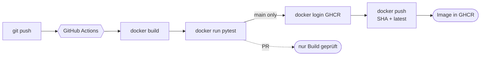

# Praxis: erste GitHub-Actions-Pipeline

!!! abstract "Ziel"
    In **etwa einer Stunde** schreibst du deine erste eigene GitHub-Actions-Workflow-Datei. Sie:

    - **baut** ein Docker-Image bei jedem Push auf `main` und bei jedem Pull-Request
    - führt die **Tests** automatisch aus (Bezug **3.6.1**)
    - **pusht** das Image bei Pushes auf `main` zusätzlich nach **GHCR** (GitHub Container Registry)

    Am Ende kannst du:

    - eine Workflow-Datei in `.github/workflows/ci.yml` lesen, schreiben und debuggen
    - die Logs im Actions-Tab interpretieren
    - dein eigenes Image in der Registry sehen

!!! info "Anknüpfung"
    In [Block 5](../docker-profi/dockerfile-best-practices.md) hast du gelernt, wie ein gutes Dockerfile aussieht. Dieses Praxis-Projekt bringt **genau** so ein Dockerfile mit – jetzt geht es nur noch darum, den Bau-Prozess zu automatisieren.

---

## Voraussetzungen

- **Docker** lokal funktionsfähig (`docker version`).
- **Git** lokal (`git --version`).
- Ein **GitHub-Account**.
- Ein **Editor**.
- Etwa **eine Stunde** Zeit.

!!! tip "Lokal vorab funktionsfähig?"
    Bevor du die Pipeline schreibst, sollte das Projekt **lokal** sauber bauen und testen. Diese Übung debuggt dir sonst zwei Probleme gleichzeitig: dein Code und deine Pipeline.

---

## Was wir bauen



Die fertige Pipeline läuft auf jedem **Push** und jedem **PR**, aber **pusht nur auf `main`**. Das ist ein gängiges Muster: PRs sollen geprüft werden, aber keine Pakete in deine Registry drücken.

---

## Schritt 1 – Projekt holen

In den Kursunterlagen liegt eine **fertige Demo-App** unter `apps/cicd-demo/`. Sie besteht aus:

```text
apps/cicd-demo/
├── Dockerfile
├── .dockerignore
├── README.md
├── app.py            # kleine Flask-App: GET / und GET /api/sum
├── test_app.py       # vier pytest-Tests (inkl. Fehlerfall)
└── requirements.txt  # flask + pytest
```

Für die Übung kopierst du den Ordner in **dein eigenes Repository**. Damit du frei pushen kannst, ohne das Kurs-Repo zu beeinflussen.

### 1.1 Lokales Verzeichnis einrichten

=== "macOS / Linux"
    ```bash
    mkdir -p ~/cicd-demo
    cd ~/cicd-demo
    git init -b main
    ```

=== "Windows PowerShell"
    ```powershell
    New-Item -ItemType Directory -Force -Path $HOME\cicd-demo | Out-Null
    Set-Location $HOME\cicd-demo
    git init -b main
    ```

=== "Windows CMD"
    ```cmd
    if not exist "%USERPROFILE%\cicd-demo" md "%USERPROFILE%\cicd-demo"
    cd /d "%USERPROFILE%\cicd-demo"
    git init -b main
    ```

!!! info "Git-Version"
    `git init -b main` braucht **Git 2.28+** (Juli 2020). Auf modernen Systemen Standard. Falls du eine ältere Version hast: `git init` und danach `git checkout -b main`.

### 1.2 Demo-Dateien hineinkopieren

Kopiere alle Dateien aus dem Kurs-Repo `apps/cicd-demo/` in deinen neuen Ordner. Es sollte hinterher so aussehen:

```text
cicd-demo/
├── Dockerfile
├── .dockerignore
├── README.md
├── app.py
├── test_app.py
└── requirements.txt
```

### 1.3 Lokal probieren

Bevor du irgendeine Pipeline schreibst, prüf, dass das Projekt **lokal funktioniert**:

```bash
docker build -t cicd-demo .
docker run --rm -p 8000:8000 cicd-demo
```

Browser: <http://localhost:8000> – du solltest „CI/CD-Demo läuft" sehen.

In einem zweiten Terminal die Tests im Container laufen lassen:

```bash
docker run --rm cicd-demo pytest -v
```

Erwartet: alle vier Tests grün. Wenn das **lokal** klappt, wird die Pipeline später nicht an Code-Problemen scheitern.

`Strg+C` beendet den ersten `docker run`.

---

## Schritt 2 – GitHub-Repo anlegen

1. Auf GitHub: <https://github.com/new>.
2. Name: `cicd-demo`.
3. Sichtbarkeit: **Public** (für GHCR-Pushes mit `GITHUB_TOKEN` ist das am einfachsten).
4. **Keine** README, `.gitignore` oder License mitanlegen – dein Ordner enthält bereits Dateien.
5. **Create repository** klicken.

### 2.1 Lokales Repo verbinden

```bash
git add .
git commit -m "Initial: Demo-App fuer CI/CD-Block"
git remote add origin https://github.com/<DEIN-USERNAME>/cicd-demo.git
git push -u origin main
```

Auf GitHub solltest du jetzt deine Dateien sehen.

---

## Schritt 3 – Erste Workflow-Datei schreiben

Lege im Repo den Pfad an:

```text
cicd-demo/
└── .github/
    └── workflows/
        └── ci.yml
```

=== "macOS / Linux"
    ```bash
    mkdir -p .github/workflows
    ```

=== "Windows PowerShell"
    ```powershell
    New-Item -ItemType Directory -Force -Path .github\workflows | Out-Null
    ```

=== "Windows CMD"
    ```cmd
    if not exist ".github\workflows" md ".github\workflows"
    ```

Die Datei `ci.yml` mit folgendem Inhalt:

```yaml
name: CI

on:
  push:
    branches: [main]
  pull_request:
  workflow_dispatch:

permissions:
  contents: read
  packages: write

jobs:
  build-and-test:
    runs-on: ubuntu-latest

    steps:
      - name: Checkout
        uses: actions/checkout@v4

      - name: Set up BuildKit
        uses: docker/setup-buildx-action@v3

      - name: Image bauen (lokal in den Runner)
        uses: docker/build-push-action@v6
        with:
          context: .
          load: true
          tags: cicd-demo:${{ github.sha }}
          cache-from: type=gha
          cache-to: type=gha,mode=max

      - name: Tests im Container laufen lassen
        run: docker run --rm cicd-demo:${{ github.sha }} pytest -v

  publish:
    runs-on: ubuntu-latest
    needs: build-and-test
    if: github.event_name == 'push' && github.ref == 'refs/heads/main'

    steps:
      - name: Checkout
        uses: actions/checkout@v4

      - name: Set up BuildKit
        uses: docker/setup-buildx-action@v3

      - name: Login zu GHCR
        uses: docker/login-action@v3
        with:
          registry: ghcr.io
          username: ${{ github.actor }}
          password: ${{ secrets.GITHUB_TOKEN }}

      - name: Repository-Pfad in Kleinbuchstaben (GHCR verlangt lowercase)
        id: lcrepo
        run: echo "REPO=${GITHUB_REPOSITORY,,}" >> "$GITHUB_OUTPUT"

      - name: Image pushen
        uses: docker/build-push-action@v6
        with:
          context: .
          push: true
          tags: |
            ghcr.io/${{ steps.lcrepo.outputs.REPO }}:${{ github.sha }}
            ghcr.io/${{ steps.lcrepo.outputs.REPO }}:latest
          cache-from: type=gha
          cache-to: type=gha,mode=max
```

### Was hier passiert – Schritt für Schritt

| Block | Bedeutung |
|-------|-----------|
| `name: CI` | Anzeigename im Actions-Tab |
| `on: push / pull_request / workflow_dispatch` | Pipeline läuft bei Push, PR und manueller Auslösung |
| `permissions: packages: write` | Workflow darf in GHCR pushen |
| Job `build-and-test` | Baut das Image und führt im Container `pytest` aus |
| Job `publish` | Loggt sich in GHCR ein und pusht das Image – nur auf `main` |
| `needs: build-and-test` | `publish` startet erst, wenn Build + Tests grün sind |
| `if:` | Filter, der den Job auf `push` nach `main` einschränkt |
| Step `lcrepo` | Wandelt `owner/repo` in **lowercase** um – GHCR akzeptiert keine Großbuchstaben (z.B. `JacobMenge` würde brechen). Die Bash-Expansion `${VAR,,}` übernimmt die Umwandlung in einer Zeile. |

!!! warning "Zwei separate Jobs sind Absicht"
    Wir hätten alles in **einem** Job machen können. Aber: zwei Jobs trennen **prüfen** und **veröffentlichen** sauber. Wenn der Push fehlschlägt (etwa wegen Permissions), erfährst du das in einem eigenen, klar markierten Job, ohne dass der Build-Status verfälscht wird.

---

## Schritt 4 – Pushen und Pipeline beobachten

```bash
git add .github/workflows/ci.yml
git commit -m "feat: erste GitHub-Actions-Pipeline"
git push
```

Auf GitHub im Tab **Actions**:

1. Du siehst „CI" mit dem Commit-Titel.
2. Klick rein → die Jobs `build-and-test` und `publish` werden gelistet.
3. Der erste Lauf dauert 1–3 Minuten (frischer Cache).

Wenn alles grün ist:

- **Image** liegt in GHCR. Auf der Repo-Hauptseite rechts unter **Packages** sollte `cicd-demo` auftauchen.
- Klickst du auf das Paket, siehst du beide Tags: `latest` und die Commit-SHA.

!!! tip "Image lokal von GHCR ziehen"
    Sobald das Paket existiert und (für öffentliche Repos) public ist, kannst du es überall ziehen:

    ```bash
    docker pull ghcr.io/<DEIN-USERNAME>/cicd-demo:latest
    docker run --rm -p 8000:8000 ghcr.io/<DEIN-USERNAME>/cicd-demo:latest
    ```

    Der erste Schritt zum echten Deploy. Der **Server** würde im realen Setup genau diesen `pull` + `up -d` machen.

---

## Schritt 5 – Pipeline „kaputt" machen, um sie zu verstehen

Eine grüne Pipeline ist gut. **Eine rote Pipeline lehrt mehr.** Probier:

### 5.1 Test bewusst kaputt machen

Öffne `test_app.py` und ändere:

```python
def test_sum_basic(client):
    res = client.get("/api/sum?a=2&b=3")
    assert res.status_code == 200
    assert res.get_json() == {"a": 2, "b": 3, "sum": 5}
```

Zu:

```python
def test_sum_basic(client):
    res = client.get("/api/sum?a=2&b=3")
    assert res.status_code == 200
    assert res.get_json() == {"a": 2, "b": 3, "sum": 6}   # ← kaputt
```

Push:

```bash
git commit -am "broken test"
git push
```

Im Actions-Tab: der `build-and-test`-Job wird **rot**. Im Log siehst du genau die Test-Zeile mit der fehlgeschlagenen Assertion.

**Wichtig:** Der `publish`-Job läuft **nicht** los, weil `needs: build-and-test` ihn blockt. Genau so soll es sein – kaputter Code soll nicht in der Registry landen.

Mach den Test wieder heile, push erneut – grün.

### 5.2 YAML-Syntaxfehler einfügen

Im `ci.yml` einen Doppelpunkt entfernen oder Einrückung verzerren. Push.

Im Actions-Tab steht: **„Workflow file isn't valid"** – mit Zeilen-Hinweis. Das ist die Erfahrung, die du brauchst, damit dich diese Fehler später nicht überraschen.

### 5.3 Fehlende Permissions simulieren

Entferne den `permissions:`-Block oben. Push. Der `publish`-Job stirbt mit „resource not accessible by integration".

→ Lehrt: **Permissions sind keine Kosmetik**, sie sind Voraussetzung.

Mach alles wieder heil, bevor du weitermachst.

---

## Schritt 6 – Pipeline erweitern (optional)

Wenn du noch Zeit hast oder die Übung zu Hause vertiefen willst, sind das die natürlichen Erweiterungen:

### 6.1 Trivy-Scan einbauen

Direkt nach dem Build, vor dem Push:

```yaml
      - name: Trivy-Scan
        uses: aquasecurity/trivy-action@0.28.0
        with:
          image-ref: cicd-demo:${{ github.sha }}
          format: table
          exit-code: 1
          severity: CRITICAL,HIGH
          ignore-unfixed: true
```

Damit fällt die Pipeline um, wenn das Image hohe oder kritische CVEs enthält. Zur Theorie: [Image-Optimierung – Trivy](../docker-profi/image-optimierung.md#trivy-images-auf-cves-scannen).

### 6.2 Pull-Request-Builds beschleunigen

Pull-Requests müssen nicht das ganze Cache-Spiel durchziehen. Mit `if:` kannst du den Push-Job für PRs überspringen (machst du oben schon mit `if: github.event_name == 'push'` – Beispiel als Erinnerung).

### 6.3 Tag-Strategie verbessern

Statt nur `latest` und Commit-SHA: einen `v*.*.*`-Trigger einführen, der zusätzlich Versions-Tags pusht. Das ist Stoff für [Übung 6.4](uebungen.md#uebung-64-versionstags-mit-semver).

---

## <span id="musterloesung"></span>Musterlösung

??? success "Komplette Musterlösung – `ci.yml`"
    ```yaml
    name: CI

    on:
      push:
        branches: [main]
      pull_request:
      workflow_dispatch:

    permissions:
      contents: read
      packages: write

    jobs:
      build-and-test:
        runs-on: ubuntu-latest
        steps:
          - name: Checkout
            uses: actions/checkout@v4

          - name: Set up BuildKit
            uses: docker/setup-buildx-action@v3

          - name: Image bauen (lokal in den Runner)
            uses: docker/build-push-action@v6
            with:
              context: .
              load: true
              tags: cicd-demo:${{ github.sha }}
              cache-from: type=gha
              cache-to: type=gha,mode=max

          - name: Tests im Container laufen lassen
            run: docker run --rm cicd-demo:${{ github.sha }} pytest -v

      publish:
        runs-on: ubuntu-latest
        needs: build-and-test
        if: github.event_name == 'push' && github.ref == 'refs/heads/main'
        steps:
          - name: Checkout
            uses: actions/checkout@v4

          - name: Set up BuildKit
            uses: docker/setup-buildx-action@v3

          - name: Login zu GHCR
            uses: docker/login-action@v3
            with:
              registry: ghcr.io
              username: ${{ github.actor }}
              password: ${{ secrets.GITHUB_TOKEN }}

          - name: Repository-Pfad in Kleinbuchstaben (GHCR verlangt lowercase)
            id: lcrepo
            run: echo "REPO=${GITHUB_REPOSITORY,,}" >> "$GITHUB_OUTPUT"

          - name: Image pushen
            uses: docker/build-push-action@v6
            with:
              context: .
              push: true
              tags: |
                ghcr.io/${{ steps.lcrepo.outputs.REPO }}:${{ github.sha }}
                ghcr.io/${{ steps.lcrepo.outputs.REPO }}:latest
              cache-from: type=gha
              cache-to: type=gha,mode=max
    ```

??? success "Mit Trivy-Scan (Bonus)"
    ```yaml
    name: CI

    on:
      push:
        branches: [main]
      pull_request:
      workflow_dispatch:

    permissions:
      contents: read
      packages: write

    jobs:
      build-and-test:
        runs-on: ubuntu-latest
        steps:
          - uses: actions/checkout@v4
          - uses: docker/setup-buildx-action@v3

          - name: Image bauen
            uses: docker/build-push-action@v6
            with:
              context: .
              load: true
              tags: cicd-demo:${{ github.sha }}
              cache-from: type=gha
              cache-to: type=gha,mode=max

          - name: Tests
            run: docker run --rm cicd-demo:${{ github.sha }} pytest -v

          - name: Trivy-Scan
            uses: aquasecurity/trivy-action@0.28.0
            with:
              image-ref: cicd-demo:${{ github.sha }}
              format: table
              exit-code: 1
              severity: CRITICAL,HIGH
              ignore-unfixed: true

      publish:
        runs-on: ubuntu-latest
        needs: build-and-test
        if: github.event_name == 'push' && github.ref == 'refs/heads/main'
        steps:
          - uses: actions/checkout@v4
          - uses: docker/setup-buildx-action@v3

          - uses: docker/login-action@v3
            with:
              registry: ghcr.io
              username: ${{ github.actor }}
              password: ${{ secrets.GITHUB_TOKEN }}

          - id: lcrepo
            run: echo "REPO=${GITHUB_REPOSITORY,,}" >> "$GITHUB_OUTPUT"

          - uses: docker/build-push-action@v6
            with:
              context: .
              push: true
              tags: |
                ghcr.io/${{ steps.lcrepo.outputs.REPO }}:${{ github.sha }}
                ghcr.io/${{ steps.lcrepo.outputs.REPO }}:latest
              cache-from: type=gha
              cache-to: type=gha,mode=max
    ```

---

## Häufige Fehler in der Praxis-Phase

??? danger "Tests passen lokal, schlagen in CI fehl"
    **Häufigste Ursachen:**

    1. Lokales **Cache-Verzeichnis** beeinflusst Test (z.B. `__pycache__` mit altem Code). In CI nicht vorhanden.
    2. **Pfade** unterschiedlich (Windows-Backslash vs. Linux-Forward-Slash).
    3. **Locale** unterschiedlich (Tests, die auf Sprache reagieren).
    4. **Tests sind zeitabhängig** und in CI langsamer.

    **Lösung:** Tests müssen reproduzierbar sein. Ein guter Anhalt: in einer **frischen** lokalen Umgebung (frischer Build-Container, ohne Caches) reproduzieren – dann findest du die Diskrepanz.

??? warning "GHCR-Push schlägt mit „denied: permission_denied" fehl"
    Die häufigsten Punkte:

    1. `permissions: packages: write` im Workflow vergessen.
    2. Repo-Setting **„Workflow permissions"** steht auf „Read repository contents permission" (read-only). Unter Repo → Settings → Actions → General → Workflow permissions auf **„Read and write permissions"** stellen.
    3. Image-Pfad falsch: muss `ghcr.io/<owner>/<repo>` lauten – mit Kleinbuchstaben.

??? warning "Workflow läuft, aber `docker pull` von GHCR scheitert"
    GHCR-Pakete sind **standardmäßig privat**, auch wenn das Repo public ist. Lösung: auf der Paket-Seite (rechts oben unter **Packages** im Repo) → **Package settings** → **Change visibility** → public. Oder beim ersten Pull lokal einloggen:

    ```bash
    echo "<PAT>" | docker login ghcr.io -u <USER> --password-stdin
    ```

??? info "Pipeline läuft endlos / hängt"
    Sehr selten. Häufiger: ein Step wartet auf etwas, das nie kommt (z.B. eine interaktive Eingabe). GitHub hat ein hartes Job-Timeout von 6 Stunden, aber so weit sollte es nie kommen. Schau in den Step-Logs: meist ist erkennbar, was der Lauf gerade tut.

---

## Was du jetzt geschafft hast

- Eine **Demo-App** lokal gebaut und getestet.
- Ein **GitHub-Repo** angelegt, Code gepusht.
- Eine **Workflow-Datei** geschrieben, die bei jedem Push baut, testet und (auf `main`) pusht.
- Die Pipeline einmal **bewusst kaputt** gemacht und wieder repariert – damit kennst du die häufigsten Fehlersignaturen.
- Ein eigenes **Image in GHCR** liegen.

---

## Was als nächstes?

In der [Übungs-Sammlung](uebungen.md) findest du vier weitere Aufgaben mit aufsteigender Schwierigkeit:

- 🟢 **Übung 6.1** – Mini-Pipeline ohne Tests, nur Hello-World
- 🟢 **Übung 6.2** – Tests separat im eigenen Job
- 🟡 **Übung 6.3** – Multi-Architektur-Image (linux/amd64 + linux/arm64)
- 🟡 **Übung 6.4** – Versions-Tags mit Semver-Trigger

---

## Merksatz

!!! success "Merksatz"
    > **Erst lokal, dann CI. Erst klein, dann erweitert. `needs:` und `if:` strukturieren, was wann läuft. PRs bauen, `main` veröffentlicht. Logs lesen, nicht raten.**

---

## Weiterlesen

- [Stolpersteine](stolpersteine.md) – wenn etwas hakt
- [Cheatsheet GitHub Actions](../cheatsheets/github-actions.md) – Befehle und Snippets auf einer Seite
