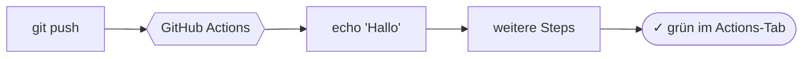

# Praxis: erste GitHub-Actions-Pipeline

!!! abstract "Ziel"
    In **etwa einer Stunde** schreibst du deine erste eigene GitHub-Actions-Workflow-Datei. Sie tut nichts Spektakuläres: sie sagt „Hello". Aber genau dabei lernst du die Bausteine, aus denen jeder größere Workflow zusammengesetzt ist.

    Am Ende kannst du:

    - ein **GitHub-Repo** anlegen und lokal damit arbeiten
    - eine **Workflow-Datei** unter `.github/workflows/` erstellen
    - die Bausteine **`name`**, **`on`**, **`jobs`**, **`runs-on`**, **`steps`** sicher einsetzen
    - den Workflow im **Actions-Tab** beobachten und Logs lesen
    - einen Workflow um **mehrere Schritte** und **Bedingungen** erweitern

---

## Voraussetzungen

- **Git** lokal (`git --version` muss klappen).
- Ein **GitHub-Account**.
- Ein **Editor** deiner Wahl (VSCode, Notepad++, vim, …).
- Etwa **eine Stunde** Zeit.

!!! info "Kein Docker, keine Programmierung"
    Für diese Übung brauchst du weder Docker noch Programmierkenntnisse. Wir schreiben nur eine YAML-Datei und schauen, was GitHub damit macht.

---

## Was wir bauen



Ein Workflow, der bei jedem Push läuft und ein paar Texte ins Log schreibt. Klein, harmlos, aber **vollständig**: Trigger, Job, Steps, Logs.

---

## Schritt 1: GitHub-Repo anlegen

Du brauchst ein **neues, leeres Repo** auf GitHub. Falls du noch nie eins angelegt hast, ist das jetzt der richtige Moment.

1. Auf GitHub einloggen und <https://github.com/new> öffnen.
2. **Repository name**: `mein-erster-workflow`.
3. Optional: Beschreibung eintragen (z.B. „Mein erstes GitHub-Actions-Setup").
4. **Public** auswählen. Das ist für Übungszwecke einfacher: GitHub Actions sind auf öffentlichen Repos uneingeschränkt kostenlos und du kannst die Logs später auch ohne Login zeigen.
5. **Add a README file** anhaken. Sonst ist das Repo komplett leer und du kannst es nicht klonen.
6. **Create repository** klicken.

Du landest auf der Repo-Startseite mit einer einzelnen Datei `README.md`.

!!! tip "Workflow-Permissions prüfen (optional, für später)"
    Klick im Repo auf **Settings → Actions → General**. Scroll runter zu **Workflow permissions**. Standard ist „Read repository contents and packages permissions". Für unseren Hello-World-Workflow reicht das. Wenn du später Pakete pushen oder Releases anlegen willst, stell hier auf „Read and write permissions" um.

---

## Schritt 2: Repo lokal klonen

Auf der Repo-Seite oben rechts den **Code**-Button klicken und die HTTPS-URL kopieren. Dann lokal:

=== "macOS / Linux"
    ```bash
    cd ~
    git clone https://github.com/<DEIN-USERNAME>/mein-erster-workflow.git
    cd mein-erster-workflow
    ```

=== "Windows PowerShell"
    ```powershell
    Set-Location $HOME
    git clone https://github.com/<DEIN-USERNAME>/mein-erster-workflow.git
    Set-Location mein-erster-workflow
    ```

=== "Windows CMD"
    ```cmd
    cd /d "%USERPROFILE%"
    git clone https://github.com/<DEIN-USERNAME>/mein-erster-workflow.git
    cd mein-erster-workflow
    ```

`<DEIN-USERNAME>` durch deinen GitHub-Namen ersetzen.

!!! tip "Login klappt nicht?"
    Beim ersten Push verlangt Git Anmeldedaten. **Username** ist dein GitHub-Name, **Passwort** ist ein **Personal Access Token** (PAT), nicht dein normales Passwort. PAT erstellen: GitHub → Settings → Developer settings → Personal access tokens → Tokens (classic) → Generate new token. Mindestens das Recht **`repo`** anhaken.

---

## Schritt 3: Workflow-Ordner anlegen

Workflows liegen in einem festen Pfad: **`.github/workflows/`**. GitHub schaut nirgendwo sonst.

=== "macOS / Linux"
    ```bash
    mkdir -p .github/workflows
    ```

=== "Windows PowerShell"
    ```powershell
    New-Item -ItemType Directory -Force -Path .github\workflows | Out-Null
    ```

=== "Windows CMD"
    ```cmd
    if not exist ".github\workflows" md ".github\workflows"
    ```

Der Punkt am Anfang von `.github` ist Absicht. Versteckte Ordner werden auf Linux und macOS standardmäßig ausgeblendet, auf Windows je nach Einstellung.

---

## Schritt 4: Erste Workflow-Datei schreiben

Lege im Editor die Datei **`.github/workflows/hallo.yml`** an. Inhalt:

```yaml
name: Hallo Welt

on:
  push:

jobs:
  sag-hallo:
    runs-on: ubuntu-latest
    steps:
      - name: Begrüßung
        run: echo "Hallo aus GitHub Actions!"
```

Das war's. Sechs Zeilen Code. Speichern.

### Was bedeutet jede Zeile?

| Zeile | Bedeutung |
|-------|-----------|
| `name: Hallo Welt` | Anzeigename des Workflows. Taucht im Actions-Tab auf. |
| `on:` | Wann läuft der Workflow? |
| `  push:` | Bei jedem Push in jeden Branch. |
| `jobs:` | Liste der Jobs (kann mehrere geben). |
| `  sag-hallo:` | Job-Name. Du wählst ihn frei. |
| `    runs-on: ubuntu-latest` | Auf welcher Maschine läuft der Job? Hier eine frische Ubuntu-VM. |
| `    steps:` | Liste der Schritte innerhalb des Jobs. |
| `      - name: Begrüßung` | Anzeigename des Steps. |
| `        run: echo "..."` | Was der Step ausführt: ein Shell-Befehl. |

!!! warning "YAML ist pingelig"
    YAML reagiert empfindlich auf **Einrückung**. Pro Ebene **zwei Leerzeichen**, keine Tabs. Dein Editor sollte „Insert spaces" statt „Insert tabs" eingestellt haben (in VSCode unten rechts erkennbar).

---

## Schritt 5: Pushen und im Actions-Tab beobachten

```bash
git add .github/workflows/hallo.yml
git commit -m "Erster Workflow: Hallo Welt"
git push
```

Auf GitHub den **Actions**-Tab oben in deinem Repo öffnen. Du siehst:

1. Einen neuen Eintrag „Hallo Welt" (der Workflow-Name).
2. Mit dem Commit-Titel „Erster Workflow: Hallo Welt".
3. Status zuerst gelb (läuft), nach 5 bis 15 Sekunden grün (fertig).

Klick auf den Eintrag, dann auf den Job `sag-hallo`, dann auf den Step `Begrüßung`. Im Log:

```
Hallo aus GitHub Actions!
```

!!! success "Geschafft"
    Du hast deinen ersten GitHub-Actions-Workflow geschrieben und ausgeführt. Was du jetzt verstehst, ist die Grundstruktur jeder Pipeline: ein Trigger, ein Job auf einer Maschine, ein paar Steps mit Befehlen.

---

## Schritt 6: Mehrere Steps hinzufügen

Ein Step ist langweilig. Schreib die Datei um:

```yaml
name: Hallo Welt

on:
  push:

jobs:
  sag-hallo:
    runs-on: ubuntu-latest
    steps:
      - name: Begrüßung
        run: echo "Hallo aus GitHub Actions!"

      - name: Datum und Uhrzeit
        run: date

      - name: Welche Maschine?
        run: |
          echo "Betriebssystem:"
          uname -a
          echo ""
          echo "Aktuelles Verzeichnis:"
          pwd

      - name: Verfügbare Tools prüfen
        run: |
          git --version
          docker --version
          python3 --version
          node --version
```

Pushen:

```bash
git commit -am "Mehrere Steps"
git push
```

Im Actions-Tab den neuen Lauf öffnen. Du siehst jetzt **vier Steps** unter dem Job. Jeder mit eigenem Log. Klick durch und schau, was die Runner-VM alles mitbringt.

!!! tip "Mehrzeilige Befehle mit `|`"
    Der senkrechte Strich `|` nach `run:` sagt YAML: „Was folgt, ist ein **mehrzeiliger Block**." Praktisch, wenn du mehrere Befehle in einem Step ausführen willst, ohne `&&` zu verketten.

---

## Schritt 7: Manueller Trigger einbauen

Bisher läuft der Workflow nur beim Push. Wir wollen ihn auch **per Knopfdruck** starten können. Erweitere den `on:`-Block:

```yaml
on:
  push:
  workflow_dispatch:
```

Das war's. Zwei Trigger nebeneinander. Pushen:

```bash
git commit -am "Manueller Trigger"
git push
```

Im Actions-Tab links den Workflow „Hallo Welt" auswählen. Direkt nach dem Push erscheint oben rechts der Knopf **„Run workflow"**. Klicken, im Popup auf **Run workflow** klicken.

Der Workflow läuft, ohne dass du etwas committet hast.

!!! info "Knopf taucht nicht auf?"
    Der Knopf erscheint **nur**, wenn die Workflow-Datei mit `workflow_dispatch:` schon auf dem Default-Branch (meist `main`) liegt. Heißt: einmal mit Push committen reicht. Wenn der Knopf trotzdem fehlt, die Seite neu laden.

!!! info "Wofür ist das gut?"
    Manuelle Trigger sind nützlich für **Operationen, die nicht zu jedem Push gehören**: ein Deploy auf Knopfdruck, ein Daten-Export, ein Cleanup-Job. Du bekommst auch einen Knopf für jeden Branch separat.

---

## Schritt 8: Eingaben beim manuellen Trigger

`workflow_dispatch` kann **Eingabefelder** haben. Erweitere den Block:

```yaml
on:
  push:
  workflow_dispatch:
    inputs:
      name:
        description: "Wen soll ich begrüßen?"
        required: true
        default: "Welt"
```

Und ändere den ersten Step:

```yaml
      - name: Begrüßung
        run: echo "Hallo, ${{ inputs.name || 'Welt' }}!"
```

Pushen, dann im Actions-Tab erneut **Run workflow** klicken. Diesmal erscheint ein Eingabefeld mit dem Default „Welt". Trag deinen Namen ein und klick **Run workflow**.

Im Log steht jetzt: `Hallo, <dein Name>!`

!!! tip "Was bedeuten die `${{ ... }}`?"
    Das ist die **Expression-Syntax** von GitHub Actions. Sie wird zur Laufzeit ersetzt. `${{ inputs.name }}` greift auf das Eingabefeld zu, `${{ github.actor }}` auf den ausführenden User, `${{ secrets.MY_TOKEN }}` auf ein hinterlegtes Secret. Mehr dazu in den [Grundlagen](github-actions-grundlagen.md#variablen-kontexte-und-secrets).

!!! warning "Warum `|| 'Welt'`?"
    Bei einem **manuellen** Lauf gibt es ein Eingabefeld. Bei einem **Push** dagegen existiert das `inputs.name`-Feld nicht und ist ein leerer String. Ohne Fallback würde im Log nach einem Push `Hallo, !` stehen.

    Der Operator `||` setzt den **rechten Wert ein, wenn der linke leer ist**. Mit `${{ inputs.name || 'Welt' }}` zeigt der Push-Lauf `Hallo, Welt!` und der manuelle Lauf den eingegebenen Namen.

---

## Schritt 9: Workflow bewusst kaputt machen

Eine grüne Pipeline ist gut. Eine rote Pipeline lehrt mehr. Füge einen Step ein, der scheitert:

```yaml
      - name: Absichtlich falsch
        run: dieser-befehl-existiert-nicht
```

Pushen. Im Actions-Tab wird der Lauf **rot**. Klick rein:

- Der Job ist mit einem **roten X** markiert.
- Der Step `Absichtlich falsch` ist rot.
- Im Log steht etwas wie `dieser-befehl-existiert-nicht: command not found` und `Process completed with exit code 127`.

**Wichtig:** alle Steps **nach** einem fehlgeschlagenen Step werden **übersprungen**. GitHub geht davon aus, dass weiterzumachen sinnlos ist.

Mach den Step wieder weg (oder kommentiere ihn aus), pushen, grün.

!!! tip "Schritte trotz Fehler weiterlaufen lassen"
    Wenn ein Step fehlschlagen darf, ohne den Job rot zu machen, schreibe `continue-on-error: true` an den Step. Das ist die Ausnahme, nicht die Regel: meistens willst du, dass Fehler den Job stoppen.

---

## Schritt 10: Trigger einschränken

Aktuell läuft der Workflow bei jedem Push in **jeden** Branch. Oft willst du das nicht. Beschränke ihn auf den Hauptzweig:

```yaml
on:
  push:
    branches: [main]
  workflow_dispatch:
```

Push-Events auf andere Branches lösen den Workflow jetzt nicht mehr aus. Pull-Requests und Tags ebenfalls nicht.

Andere häufige Filter:

```yaml
on:
  push:
    branches: [main, develop]      # zwei Branches
    tags: ["v*.*.*"]               # zusätzlich bei Versions-Tags
    paths-ignore: ["**.md"]        # nicht bei reinen Markdown-Änderungen
  pull_request:                    # zusätzlich bei PRs
```

---

## Was du jetzt verstehst

- **Workflows** sind YAML-Dateien unter `.github/workflows/`.
- Eine Workflow-Datei hat **`name`**, **`on`**, **`jobs`**.
- Jeder Job hat **`runs-on`** (eine Runner-VM) und **`steps`**.
- Steps haben einen **`name`** und eine Aktion: meistens **`run:`** mit einem Shell-Befehl.
- **Trigger** sind Ereignisse: `push`, `pull_request`, `workflow_dispatch`, `schedule`, …
- **Mehrzeilige Befehle** schreibt man mit `run: |`.
- **Logs** stehen im Actions-Tab, pro Step aufklappbar.
- **Fehler** stoppen den Job. Folgesteps werden übersprungen.
- **Eingaben** für manuelle Trigger gibt es über `workflow_dispatch.inputs`.

Das sind die Bausteine. Alles, was später kommt (Docker, Tests, Deploy), nutzt genau diese Bausteine in unterschiedlicher Kombination.

---

## Komplette Endversion der Workflow-Datei

??? success "`.github/workflows/hallo.yml` zum Vergleich"
    ```yaml
    name: Hallo Welt

    on:
      push:
        branches: [main]
      workflow_dispatch:
        inputs:
          name:
            description: "Wen soll ich begrüßen?"
            required: true
            default: "Welt"

    jobs:
      sag-hallo:
        runs-on: ubuntu-latest
        steps:
          - name: Begrüßung
            run: echo "Hallo, ${{ inputs.name || 'Welt' }}!"

          - name: Datum und Uhrzeit
            run: date

          - name: Welche Maschine?
            run: |
              echo "Betriebssystem:"
              uname -a
              echo ""
              echo "Aktuelles Verzeichnis:"
              pwd

          - name: Verfügbare Tools prüfen
            run: |
              git --version
              docker --version
              python3 --version
              node --version
    ```

    Beachte das `|| 'Welt'`: bei einem Push (ohne Eingabefeld) ist `inputs.name` leer. Das `||` setzt den Default „Welt", wenn `inputs.name` nicht gesetzt ist.

---

## Häufige Fehler

??? warning "Workflow läuft nicht"
    Drei Dinge prüfen:

    1. Liegt die Datei wirklich unter `.github/workflows/`? Nicht in `github/workflows/`, nicht im Repo-Root.
    2. Ist die Endung `.yml` oder `.yaml`?
    3. Stimmt die YAML-Syntax? GitHub zeigt Parser-Fehler im **Actions-Tab** rechts oben in einem gelben Kasten.

??? warning "YAML-Fehler: „mapping values are not allowed"
    Du hast vermutlich Tabs statt Leerzeichen, oder die Einrückung passt nicht. Editor auf „Insert spaces" stellen, alles mit zwei Leerzeichen pro Ebene neu setzen.

??? warning "`Run workflow`-Knopf erscheint nicht"
    Der Knopf ist nur sichtbar, wenn `workflow_dispatch:` im `on:`-Block steht **und** die Workflow-Datei schon mindestens einmal auf dem Default-Branch (meist `main`) lag. Sprich: einmal pushen, dann erscheint der Knopf.

??? warning "Step bleibt einfach ohne Ausgabe"
    Manche Befehle schreiben nichts, wenn alles funktioniert (`exit 0`). Wenn du sehen willst, dass ein Step gelaufen ist, schreib ein `echo` davor oder dahinter.

---

## Aufräumen oder weitermachen

Du kannst das Repo **behalten** und in den [Übungen](uebungen.md) weiterbauen. Oder löschen: **Settings** → ganz nach unten → **Delete this repository**. GitHub fragt zwei Mal nach.

---

## Merksatz

!!! success "Merksatz"
    > **Workflow = YAML in `.github/workflows/`. Trigger oben, Jobs in der Mitte, Steps innen. Pushen, im Actions-Tab anschauen, Logs lesen. Mehr ist es konzeptuell nicht.**

---

## Weiterlesen

- [Übungen](uebungen.md): vier Aufgaben, die auf dem Workflow von hier aufbauen
- [Stolpersteine](stolpersteine.md): wenn etwas hakt
- [Cheatsheet GitHub Actions](../cheatsheets/github-actions.md): Befehle und Snippets auf einer Seite
