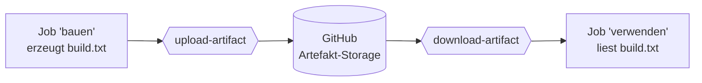
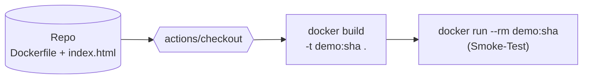
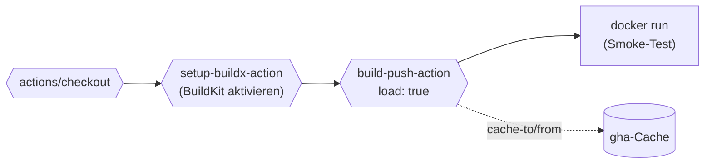
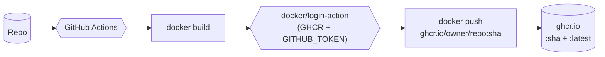

# Übungen: CI/CD mit GitHub Actions

Die Übungen bauen auf dem **Repo aus der [Praxis](praxis-erste-pipeline.md)** auf (`mein-erster-workflow`). Jede Übung legt eine neue Workflow-Datei unter `.github/workflows/` an, sodass dein Hello-World-Workflow daneben weiterläuft.

Die Übungen sind so geordnet, dass du **Schritt für Schritt** Technik dazulernst: erst die kleinen GitHub-Actions-Bausteine, dann der erste eigene Docker-Build in der Pipeline, dann das Pushen in eine Registry und am Ende ein **Multi-Container-Stack**, der komplett über die Pipeline gestartet und getestet wird. Jede neue Aufgabe baut auf einer Technik der vorherigen auf.

!!! abstract "Die vier Stufen"
    - 🟢 **Einsteiger** – jeder Schritt bis ins Detail
    - 🟡 **Mittel** – weniger Hand-Holding
    - 🔴 **Fortgeschritten** – Hinweise statt Rezepte
    - 🏆 **Challenge** – Aufgabe ohne Anleitung, Musterlösung aufklappbar

## Voraussetzung für alle Übungen

- Du hast die [Praxis-Übung](praxis-erste-pipeline.md) durchgespielt.
- Dein Repo `mein-erster-workflow` ist auf GitHub und mindestens ein Lauf war grün.
- Du kannst den **Actions-Tab** öffnen und Logs lesen.
- Ab Übung 6.7 brauchst du außerdem ein lokal funktionierendes Docker (`docker version` muss klappen) – nicht zwingend für die Pipeline selbst, aber gut, um die Ergebnisse später zu prüfen.

---

## 🟢 Einsteiger

### Übung 6.1: Bedingte Steps mit `if:`

!!! info "Was du lernst"
    - einen Step nur unter bestimmten Bedingungen ausführen
    - Kontextvariablen wie `github.event_name` und `github.ref` nutzen
    - das Verhalten bei Push und manueller Auslösung unterscheiden

#### Aufgabe

Lege die Datei `.github/workflows/bedingungen.yml` an mit folgenden Anforderungen:

1. Trigger: `push` und `workflow_dispatch`.
2. Ein Job `info` auf `ubuntu-latest`.
3. Steps:
    - **Immer**: ein `echo` mit dem Auslöser (`Push` oder `Manuell`).
    - **Nur bei Push**: ein `echo` mit dem Branch-Namen.
    - **Nur bei manueller Auslösung**: ein `echo` mit „Du hast den Knopf gedrückt".

#### Hinweise

- Der Auslöser steht in `${{ github.event_name }}` und ist `push` oder `workflow_dispatch`.
- Der Branch-Name steht in `${{ github.ref_name }}`.
- `if:` direkt unter dem Step-Namen entscheidet, ob der Step läuft.

??? tip "Schritt für Schritt – wie du die Übung löst"

    **Schritt 1 – Datei anlegen**

    Öffne deinen Editor (VSCode, Notepad++, was du nutzt). In deinem Repo gibt es schon den Ordner `.github/workflows/` mit der `hallo.yml` aus der Praxis. Leg daneben eine neue Datei an:

    `.github/workflows/bedingungen.yml`

    Der Punkt vor `.github` ist Absicht – das ist ein versteckter Ordner, und GitHub schaut **nur** dort nach Workflow-Dateien.

    **Schritt 2 – Den Workflow-Kopf schreiben**

    Pack diese vier Zeilen ganz oben rein:

    ```yaml
    name: Bedingungen

    on:
      push:
      workflow_dispatch:
    ```

    Was passiert hier?

    - `name:` – der Anzeigename, den du später im Actions-Tab als Überschrift siehst.
    - `on:` – legt fest, **wann** der Workflow läuft.
    - `push:` – bei jedem Push (also wenn du etwas auf GitHub hochlädst).
    - `workflow_dispatch:` – schaltet einen **„Run workflow"-Knopf** im Actions-Tab frei. Damit kannst du den Workflow auch starten, ohne etwas zu pushen.

    **Schritt 3 – Den Job-Rahmen schreiben**

    Darunter:

    ```yaml
    jobs:
      info:
        runs-on: ubuntu-latest
        steps:
    ```

    - `jobs:` – ist der Block, in dem alle Jobs stehen. (Ein Workflow kann mehrere Jobs haben, wir nehmen einen.)
    - `info:` – der Name unseres Jobs. Den darfst du frei wählen.
    - `runs-on: ubuntu-latest` – GitHub soll dir für diesen Job eine frische Ubuntu-Maschine („Runner") aufmachen.
    - `steps:` – darunter kommen jetzt die einzelnen Aktionen, eine Liste.

    **Schritt 4 – Step 1: Auslöser anzeigen (läuft immer)**

    Direkt unter `steps:` einrücken und schreiben:

    ```yaml
          - name: Auslöser anzeigen
            run: echo "Auslöser= ${{ github.event_name }}"
    ```

    - Der Bindestrich `-` macht das zum Listenelement, also einem eigenen Step.
    - `name:` – Anzeigename des Steps, taucht im Log auf.
    - `run:` – führt einen Shell-Befehl aus. `echo` schreibt einfach Text ins Log.
    - `${{ github.event_name }}` ist ein **Platzhalter**, den GitHub zur Laufzeit ersetzt: bei einem Push steht da `push`, bei manuellem Start steht da `workflow_dispatch`.

    **Schritt 5 – Step 2: Nur bei Push**

    Auf der gleichen Einrückungsebene wie Step 1:

    ```yaml
          - name: Nur bei Push
            if: github.event_name == 'push'
            run: echo "Branch ist ${{ github.ref_name }}"
    ```

    Der entscheidende Teil: `if: github.event_name == 'push'`. Das ist die **Bedingung**. Nur wenn sie wahr ist (Auslöser = `push`), läuft der Step. Sonst wird er übersprungen.

    Innerhalb von `if:` brauchst du **keine** geschweiften Klammern `${{ }}` – beides geht, ohne ist üblich.

    `${{ github.ref_name }}` ist der **Branch-Name**, also normalerweise `main`.

    **Schritt 6 – Step 3: Nur bei manueller Auslösung**

    Und nochmal einer, auf gleicher Einrückung:

    ```yaml
          - name: Nur bei manueller Auslösung
            if: github.event_name == 'workflow_dispatch'
            run: echo "Du hast den Knopf gedrückt"
    ```

    Selbes Prinzip, andere Bedingung.

    **Schritt 7 – Speichern, committen, pushen**

    Speicher die Datei. Im Terminal (egal ob Mac/Linux/Windows):

    ```
    git add .github/workflows/bedingungen.yml
    git commit -m "Workflow mit if-Bedingungen"
    git push
    ```

    Damit landet die Datei auf GitHub. Weil im `on:`-Block `push:` steht, startet der Workflow direkt nach dem Push automatisch.

    **Schritt 8 – Im Actions-Tab anschauen**

    1. Auf GitHub in dein Repo gehen.
    2. Oben auf **„Actions"** klicken.
    3. Du siehst den neuen Workflow „Bedingungen" mit deinem Commit-Titel.
    4. Klick rein, dann auf den Job `info`, dann jeden Step aufklappen.

    Erwartung: Step 1 und 2 sind grün (Häkchen). Step 3 hat ein graues Symbol und wenn du ihn aufklappst, steht da die Meldung „**This step has been skipped**" – weil die Bedingung nicht zutraf.

    **Schritt 9 – Manuell starten und Unterschied sehen**

    Im Actions-Tab links auf „Bedingungen" klicken. Oben rechts erscheint der **„Run workflow"**-Knopf (kommt nur, wenn die Datei schon auf `main` liegt – das ist nach Schritt 7 erfüllt). Drauf klicken, im Popup nochmal „Run workflow".

    Nach ein paar Sekunden erscheint ein zweiter Lauf. Diesmal umgekehrt: Step 1 grün, Step 2 übersprungen, Step 3 grün. Damit hast du **beide Pfade** der `if:`-Logik bewiesen.

??? success "Musterlösung"
    ```yaml
    name: Bedingungen

    on:
      push:
      workflow_dispatch:

    jobs:
      info:
        runs-on: ubuntu-latest
        steps:
          - name: Auslöser anzeigen
            run: echo "Auslöser= ${{ github.event_name }}"

          - name: Nur bei Push
            if: github.event_name == 'push'
            run: echo "Branch ist ${{ github.ref_name }}"

          - name: Nur bei manueller Auslösung
            if: github.event_name == 'workflow_dispatch'
            run: echo "Du hast den Knopf gedrückt"
    ```

    Push erzeugt zwei Log-Zeilen, Klick auf **Run workflow** ebenfalls zwei, jeweils nur die passenden.

---

### Übung 6.2: Zwei Jobs mit Abhängigkeit

!!! info "Was du lernst"
    - mehrere Jobs in einem Workflow definieren
    - mit `needs:` eine Reihenfolge erzwingen
    - dass jeder Job auf einer **eigenen frischen** Runner-VM läuft

#### Aufgabe

Lege die Datei `.github/workflows/zwei-jobs.yml` an:

1. Trigger: `push` und `workflow_dispatch`.
2. Job `vorbereiten`: gibt eine Begrüßung aus.
3. Job `arbeiten`: läuft **erst nach** `vorbereiten` und gibt eine zweite Meldung aus.

Wichtig: nach dem ersten Push siehst du im Actions-Tab, dass `arbeiten` erst startet, wenn `vorbereiten` grün ist.

#### Hinweise

- `needs: vorbereiten` direkt unter `runs-on:` reicht.
- Beide Jobs laufen auf `ubuntu-latest`.

??? tip "Schritt für Schritt – wie du die Übung löst"

    **Schritt 1 – Neue Datei anlegen**

    Im Editor eine neue Datei erstellen:

    `.github/workflows/zwei-jobs.yml`

    **Schritt 2 – Workflow-Kopf schreiben**

    Genauso wie in 6.1:

    ```yaml
    name: Zwei Jobs

    on:
      push:
      workflow_dispatch:
    ```

    Erklärung in Kurzform:

    - `name:` – Anzeigename.
    - `on:` – wann der Workflow läuft. Bei jedem Push und auf Knopfdruck.

    **Schritt 3 – Den ersten Job schreiben**

    Unter `jobs:` einrücken. Erster Job heißt `vorbereiten`:

    ```yaml
    jobs:
      vorbereiten:
        runs-on: ubuntu-latest
        steps:
          - run: echo "Job 1: Vorbereitung läuft"
    ```

    - `vorbereiten:` ist der Name des Jobs. Frei wählbar, aber er taucht später im Actions-Tab und bei `needs:` wieder auf – also einen sprechenden Namen nehmen.
    - `runs-on: ubuntu-latest` – frische Ubuntu-Maschine.
    - `- run: echo "..."` – ein Step, der nur eine Textzeile ins Log schreibt.

    **Schritt 4 – Den zweiten Job schreiben**

    Direkt darunter, auf derselben Einrückung wie `vorbereiten:` (also zwei Leerzeichen rein, nicht vier):

    ```yaml
      arbeiten:
        runs-on: ubuntu-latest
        needs: vorbereiten
        steps:
          - run: echo "Job 2: Arbeit beginnt jetzt"
    ```

    Der entscheidende Teil ist `needs: vorbereiten`. Das ist eine **Abhängigkeit**: GitHub startet den `arbeiten`-Job erst, wenn `vorbereiten` durchgelaufen UND grün ist. Wenn `vorbereiten` rot wird, startet `arbeiten` gar nicht erst.

    !!! warning "Achtung Einrückung"
        Die Job-Namen `vorbereiten:` und `arbeiten:` stehen auf **derselben** Einrückungs-Ebene (zwei Leerzeichen unter `jobs:`). Verschachtelung ist hier falsch – wenn `arbeiten:` weiter eingerückt wäre, hieße das „arbeiten ist ein Schlüssel von vorbereiten", und GitHub bringt einen YAML-Fehler.

    **Schritt 5 – Pushen**

    ```
    git add .github/workflows/zwei-jobs.yml
    git commit -m "Workflow mit zwei Jobs"
    git push
    ```

    **Schritt 6 – Im Actions-Tab beobachten**

    1. GitHub → Repo → **Actions**.
    2. Neuen Lauf „Zwei Jobs" öffnen.
    3. Links siehst du **beide Jobs** als Kästen. Die sind mit einer Linie verbunden: vorbereiten → arbeiten.
    4. Nach dem Start läuft erst `vorbereiten`. Während `vorbereiten` läuft, ist `arbeiten` mit einem grauen Status („Waiting") markiert – wartet auf den Vorgänger.
    5. Sobald `vorbereiten` grün ist (Häkchen), springt `arbeiten` auf gelb (läuft) und dann auf grün.

    Wenn du beide gleichzeitig starten lassen wolltest, dann würdest du `needs: vorbereiten` weglassen – probier das gerne in einem zweiten Workflow aus.

    **Was hier wichtig zu verstehen ist:**

    Jeder Job läuft auf einer **eigenen, frischen** Ubuntu-VM. Es ist nicht so, dass beide Jobs die gleiche Maschine teilen. `vorbereiten` startet auf VM A, läuft fertig, VM A wird weggeschmissen. Dann startet `arbeiten` auf einer komplett neuen VM B.

    Folge daraus: wenn `vorbereiten` eine Datei erzeugt, ist sie für `arbeiten` weg. Genau diese Lücke schließt Übung 6.6 mit Artefakten.

??? success "Musterlösung"
    ```yaml
    name: Zwei Jobs

    on:
      push:
      workflow_dispatch:

    jobs:
      vorbereiten:
        runs-on: ubuntu-latest
        steps:
          - run: echo "Job 1: Vorbereitung läuft"

      arbeiten:
        runs-on: ubuntu-latest
        needs: vorbereiten
        steps:
          - run: echo "Job 2: Arbeit beginnt jetzt"
    ```

    !!! warning "Jobs teilen keine Dateien"
        Jeder Job startet auf einer **frischen** VM. Wenn `vorbereiten` eine Datei erzeugt, ist sie in `arbeiten` nicht da. Um Dateien weiterzugeben, gibt es `actions/upload-artifact` und `actions/download-artifact`. Mehr dazu im [Cheatsheet](../cheatsheets/github-actions.md#artefakte-zwischen-jobs).

---

## 🟡 Mittel

### Übung 6.3: Code aus dem Repo nutzen

!!! info "Was du lernst"
    - die wichtigste Action überhaupt: `actions/checkout`
    - Dateien aus dem Repo im Workflow verwenden
    - dass der Runner den Code **nicht** automatisch kennt

#### Szenario

Bisher hat unser Workflow nur Befehle ausgeführt. Wenn du auf den **Code im Repo** zugreifen willst, musst du ihn zuerst auf den Runner holen. Das macht die Action `actions/checkout`.

#### Aufgabe

1. Lege im Repo-Root eine Datei `hallo.txt` an mit dem Inhalt `Hallo aus dem Repo`. Im Editor erstellen, speichern, dann committen und pushen:

    ```bash
    git add hallo.txt
    git commit -m "Test-Datei"
    git push
    ```

2. Lege `.github/workflows/checkout-test.yml` an, der:
    - bei Push und manuell läuft
    - **ohne** Checkout versucht, `cat hallo.txt` zu lesen (das soll fehlschlagen)
    - **mit** Checkout danach `cat hallo.txt` erfolgreich liest

Tipp: setze `continue-on-error: true` am ersten `cat`-Step, damit der Workflow nicht abbricht und du beide Steps im Log sehen kannst.

??? tip "Schritt für Schritt – wie du die Übung löst"

    **Schritt 1 – Test-Datei erstellen**

    Im Editor eine neue Datei im **Repo-Root** anlegen (also nicht in `.github/workflows/`, sondern direkt eine Ebene höher):

    `hallo.txt` mit dem Inhalt:

    ```
    Hallo aus dem Repo
    ```

    Speichern.

    **Schritt 2 – Test-Datei pushen**

    ```
    git add hallo.txt
    git commit -m "Test-Datei"
    git push
    ```

    Wichtig: Datei muss zuerst gepusht sein, sonst kann der Workflow sie später nicht finden, selbst mit Checkout. Der Runner zieht das Repo von GitHub – nicht von deinem Rechner.

    **Schritt 3 – Workflow-Datei anlegen**

    Neue Datei: `.github/workflows/checkout-test.yml`. Wieder mit dem Standardkopf:

    ```yaml
    name: Checkout-Test

    on:
      push:
      workflow_dispatch:

    jobs:
      checkout-vergleich:
        runs-on: ubuntu-latest
        steps:
    ```

    **Schritt 4 – Erster Step: ohne Checkout (soll absichtlich scheitern)**

    Unter `steps:`:

    ```yaml
          - name: Ohne Checkout, sollte scheitern
            continue-on-error: true
            run: cat hallo.txt
    ```

    Erklärung:

    - `cat hallo.txt` ist ein Linux-Befehl, der einfach den Datei-Inhalt ins Log schreibt. Wenn die Datei nicht da ist, kommt eine Fehlermeldung und der Shell-Befehl liefert einen **Exit-Code ungleich 0** – das würde den Step rot werden lassen.
    - `continue-on-error: true` sagt GitHub: „Auch wenn dieser Step rot wird, mach trotzdem mit dem nächsten weiter." Damit kannst du beide Steps im Log sehen.

    **Schritt 5 – Zweiter Step: das Repo holen**

    ```yaml
          - name: Code holen
            uses: actions/checkout@v4
    ```

    Statt `run:` (eigener Befehl) nutzen wir hier `uses:` (vorgefertigte Action). `actions/checkout@v4` ist die offizielle Action von GitHub, die dein Repo auf den Runner zieht. Das `@v4` ist die Versionsangabe – pin dich nicht zu fest, eine Major-Version reicht für Stabilität und neue Bugfixes.

    Du gibst dieser Action keine Parameter mit (`with:`-Block fehlt) – sie nimmt dann sinnvolle Defaults: aktueller Branch, neuester Commit.

    **Schritt 6 – Dritter Step: mit Checkout funktioniert es**

    ```yaml
          - name: Mit Checkout, funktioniert
            run: cat hallo.txt
    ```

    Genau derselbe `cat`-Befehl wie in Step 1. Diesmal aber **nach** dem Checkout, also ist die Datei da.

    **Schritt 7 – Pushen und beobachten**

    ```
    git add .github/workflows/checkout-test.yml
    git commit -m "Workflow mit Checkout"
    git push
    ```

    Im Actions-Tab:

    - Step 1 zeigt ein **gelbes Warndreieck** und im Log den Fehler `cat: hallo.txt: No such file or directory`. Der Job läuft trotzdem weiter, weil wir `continue-on-error: true` gesetzt haben.
    - Step 2 zeigt im Log, wie GitHub das Repo auspackt.
    - Step 3 ist grün und zeigt im Log: `Hallo aus dem Repo`.

    **Was du dir merken sollst:**

    Ohne `actions/checkout@v4` ist dein Repo auf dem Runner **nicht da**. Der Runner ist eine komplett neue, leere Linux-VM, der nichts über dein Projekt weiß. Praktisch jeder reale Workflow startet daher mit diesem Step.

??? success "Musterlösung"
    ```yaml
    name: Checkout-Test

    on:
      push:
      workflow_dispatch:

    jobs:
      checkout-vergleich:
        runs-on: ubuntu-latest
        steps:
          - name: Ohne Checkout, sollte scheitern
            continue-on-error: true
            run: cat hallo.txt

          - name: Code holen
            uses: actions/checkout@v4

          - name: Mit Checkout, funktioniert
            run: cat hallo.txt
    ```

    Im Log:

    - Step 1 zeigt `cat: hallo.txt: No such file or directory`. Trotzdem grün, weil `continue-on-error: true`.
    - Step 2 zieht das Repo auf den Runner.
    - Step 3 gibt den Inhalt von `hallo.txt` aus.

    **Lehrsatz:** ohne `actions/checkout@v4` ist dein Repo auf dem Runner **nicht da**. Praktisch jeder echte Workflow startet mit diesem Step.

---

### Übung 6.4: Matrix-Build mit mehreren Versionen

!!! info "Was du lernst"
    - einen Job parallel mit verschiedenen Parametern laufen lassen
    - die `strategy.matrix`-Syntax
    - typisches Muster für Library-Tests

#### Szenario

Wenn du eine Bibliothek oder ein Tool für mehrere Sprach-Versionen unterstützen willst (Python 3.11, 3.12, 3.13), willst du nicht drei Workflows. Du willst **einen** Workflow, der drei Mal parallel läuft.

#### Aufgabe

Lege `.github/workflows/matrix.yml` an, der:

1. bei Push und manuell läuft
2. einen Job `python-versionen` enthält
3. den Job parallel für Python 3.11, 3.12 und 3.13 ausführt
4. in jedem Lauf `python --version` und `echo "Läuft auf Python ${{ matrix.python }}"` ausgibt

Im Actions-Tab solltest du nach dem Push **drei** parallele Job-Läufe sehen, einer pro Python-Version.

#### Hinweise

- Im Job-Block:
    ```yaml
    strategy:
      matrix:
        python: ["3.11", "3.12", "3.13"]
    ```
- Python installieren mit:
    ```yaml
    - uses: actions/setup-python@v5
      with:
        python-version: ${{ matrix.python }}
    ```

??? tip "Schritt für Schritt – wie du die Übung löst"

    **Was eine Matrix ist**

    Stell dir vor, du willst denselben Job mit unterschiedlichen Parametern laufen lassen – z.B. „teste meinen Code mit Python 3.11, 3.12 und 3.13". Du könntest dafür drei separate Workflows schreiben. Oder du nutzt eine **Matrix**: ein Job mit einer Liste von Werten, GitHub macht daraus automatisch mehrere parallele Läufe.

    **Schritt 1 – Datei anlegen**

    Neue Workflow-Datei:

    `.github/workflows/matrix.yml`

    **Schritt 2 – Kopf wie immer**

    ```yaml
    name: Matrix-Build

    on:
      push:
      workflow_dispatch:
    ```

    **Schritt 3 – Job mit Matrix-Block**

    ```yaml
    jobs:
      python-versionen:
        runs-on: ubuntu-latest
        strategy:
          matrix:
            python: ["3.11", "3.12", "3.13"]
        steps:
    ```

    Was passiert hier?

    - `strategy:` und darunter `matrix:` sind die Schlüssel für die Matrix-Funktion.
    - `python: ["3.11", "3.12", "3.13"]` – das ist eine Liste mit drei Werten. GitHub macht aus dem einen Job **drei parallele Läufe**: einer pro Listeneintrag.
    - In den Steps kannst du dann mit `${{ matrix.python }}` auf den jeweils aktuellen Wert zugreifen.

    **Schritt 4 – Python installieren**

    Unter `steps:`:

    ```yaml
          - name: Python installieren
            uses: actions/setup-python@v5
            with:
              python-version: ${{ matrix.python }}
    ```

    - `actions/setup-python@v5` ist eine fertige Action, die Python in einer bestimmten Version auf dem Runner installiert.
    - `with:` ist die Möglichkeit, dieser Action Parameter mitzugeben. Hier sagen wir „nimm die Version, die gerade in matrix.python steht".
    - In Lauf 1 ist `matrix.python` gleich `3.11`, in Lauf 2 `3.12`, in Lauf 3 `3.13`.

    **Schritt 5 – Version prüfen + Echo**

    ```yaml
          - name: Version prüfen
            run: python --version

          - name: Eigenes Echo
            run: echo "Läuft auf Python ${{ matrix.python }}"
    ```

    `python --version` ist ein Shell-Befehl, der die installierte Python-Version zeigt. Das `echo` ist nur zur Demonstration, dass `${{ matrix.python }}` zur Laufzeit ersetzt wird.

    **Schritt 6 – Pushen**

    ```
    git add .github/workflows/matrix.yml
    git commit -m "Matrix-Build"
    git push
    ```

    **Schritt 7 – Im Actions-Tab anschauen**

    Im Actions-Tab den Lauf „Matrix-Build" öffnen. Du siehst **drei Job-Kästchen** statt einem, mit Klammern hinter dem Namen:

    - `python-versionen (3.11)`
    - `python-versionen (3.12)`
    - `python-versionen (3.13)`

    Alle drei laufen **parallel** auf je einer eigenen Ubuntu-VM. Beim Aufklappen siehst du in jedem die Python-Version aus diesem Lauf.

    **Was dahintersteckt**

    Matrix-Builds sind das Standard-Pattern, wenn du **Bibliotheken** oder **Tools** unterstützen musst, die mit mehreren Versionen funktionieren sollen. Bei normalen App-Pipelines (z.B. dein Docker-Image) brauchst du normalerweise keine Matrix – da gibt's nur **eine** Ziel-Version.

??? success "Musterlösung"
    ```yaml
    name: Matrix-Build

    on:
      push:
      workflow_dispatch:

    jobs:
      python-versionen:
        runs-on: ubuntu-latest
        strategy:
          matrix:
            python: ["3.11", "3.12", "3.13"]
        steps:
          - name: Python installieren
            uses: actions/setup-python@v5
            with:
              python-version: ${{ matrix.python }}

          - name: Version prüfen
            run: python --version

          - name: Eigenes Echo
            run: echo "Läuft auf Python ${{ matrix.python }}"
    ```

    Im Actions-Tab siehst du den Job dreimal, mit Klammern: `python-versionen (3.11)`, `python-versionen (3.12)`, `python-versionen (3.13)`. Alle drei laufen parallel auf eigenen Runner-VMs.

    !!! tip "Matrix mit zwei Achsen"
        Du kannst die Matrix beliebig erweitern. Beispiel: drei Python-Versionen × drei Betriebssysteme = neun parallele Läufe:

        ```yaml
        runs-on: ${{ matrix.os }}
        strategy:
          matrix:
            python: ["3.11", "3.12", "3.13"]
            os: [ubuntu-latest, windows-latest, macos-latest]
        ```

        Wichtig: bei mehreren OS muss `runs-on:` auf `${{ matrix.os }}` zeigen, sonst läuft alles auf demselben Linux.

---

### Übung 6.5: Umgebungsvariablen sauber nutzen

!!! info "Was du lernst"
    - Variablen auf **Workflow-, Job- und Step-Ebene** setzen
    - Unterschied zwischen `$VAR` (Shell-Syntax) und `${{ env.VAR }}` (GA-Expression)
    - Wie eine Variable in einem Step die Job-Variable **überschreibt**
    - Mehrere Werte für mehrere Steps sauber zentralisieren

#### Worum geht's – Kontext

Eine [Umgebungsvariable](../glossar.md#umgebungsvariable) ist ein benannter Wert, der einem laufenden Prozess (hier: deinem Shell-Befehl im Step) zur Verfügung steht. In jedem Workflow tauchen Werte mehrfach auf: ein Image-Name, eine Versionsnummer, ein Pfad. Statt sie an fünf Stellen zu wiederholen, definierst du sie **einmal** als Umgebungsvariable im `env:`-Block. GitHub Actions kennt diesen Block **auf drei Ebenen**:

```text
Workflow-Ebene  ─── greift in allen Jobs und Steps
        └── Job-Ebene  ─── überschreibt Workflow-Ebene für diesen Job
                └── Step-Ebene  ─── überschreibt Job-Ebene für diesen Step
```

Je näher an deinem Step, desto höher die Priorität. Das ist dasselbe Prinzip wie in Programmiersprachen: lokale Variablen verdecken globale.

!!! info "Warum nicht einfach den Wert direkt hinschreiben?"
    Sobald derselbe Image-Name oder dieselbe Versionsnummer **mehrfach** im Workflow auftaucht, ist eine Variable Pflicht: bei einer Änderung musst du sie sonst an mehreren Stellen ändern und vergisst garantiert eine. Variablen sind also kein „Stilthema", sondern Fehlerprävention.

#### Aufgabe

Lege `.github/workflows/env-variablen.yml` an mit folgenden Anforderungen:

1. Trigger: `push` und `workflow_dispatch` (manueller Knopf im Actions-Tab).
2. **Workflow-weit** soll `APP_NAME=demo-app` gesetzt sein.
3. Ein Job `zeigen` auf `ubuntu-latest`. **Auf Job-Ebene** soll zusätzlich `APP_VERSION=1.0.0` gesetzt sein.
4. Vier Steps:
    - **Step A**: gibt `APP_NAME` und `APP_VERSION` mit Shell-Syntax aus (`$APP_NAME`, `$APP_VERSION`).
    - **Step B**: gibt dieselben Werte über die GA-Expression aus (`${{ env.APP_NAME }}`).
    - **Step C**: setzt **auf Step-Ebene** `APP_VERSION=2.0.0-beta` und gibt sie aus.
    - **Step D**: gibt nochmal `APP_VERSION` aus, ohne eigene Step-Variable. Sie soll wieder `1.0.0` lauten, weil Step C die Variable nur lokal überschreibt.

#### Hinweise

- `env:` auf Workflow-Ebene steht **außerhalb** des `jobs:`-Blocks, ganz oben neben `on:`.
- `env:` auf Job-Ebene steht unter `runs-on:`.
- `env:` auf Step-Ebene steht unter `name:` und vor `run:`.
- In `run:` darfst du beide Schreibweisen mischen, sie zeigen aber **denselben** Wert.

??? tip "Schritt für Schritt – wie du die Übung löst"

    **Schritt 1 – Datei anlegen**

    Neue Workflow-Datei: `.github/workflows/env-variablen.yml`

    **Schritt 2 – Workflow-weite Variable setzen**

    Schreib oben:

    ```yaml
    name: Env-Variablen

    on:
      push:
      workflow_dispatch:

    env:
      APP_NAME: demo-app
    ```

    Wichtig: das `env:` steht **außerhalb** von `jobs:`, auf gleicher Einrückung wie `on:`. Damit gilt `APP_NAME` für **alle** Jobs und Steps in diesem Workflow.

    **Schritt 3 – Job mit eigener Variable**

    Direkt darunter:

    ```yaml
    jobs:
      zeigen:
        runs-on: ubuntu-latest
        env:
          APP_VERSION: 1.0.0
        steps:
    ```

    Hier kommt ein **zweiter `env:`-Block** ins Spiel, diesmal auf **Job-Ebene** (eingerückt unter dem Job-Namen). `APP_VERSION` ist damit nur in diesem Job sichtbar. Wenn du später einen zweiten Job dazunimmst, hat der die Variable nicht – aber `APP_NAME` von oben hätte er.

    **Schritt 4 – Step A: mit Shell-Syntax (`$VAR`)**

    Unter `steps:`:

    ```yaml
          - name: Step A – Shell-Syntax
            run: |
              echo "APP_NAME=$APP_NAME"
              echo "APP_VERSION=$APP_VERSION"
    ```

    Erklärung:

    - `run: |` mit dem senkrechten Strich erlaubt **mehrzeilige Befehle**.
    - `$APP_NAME` wird **von der Shell** auf dem Runner ersetzt, weil GitHub die `env:`-Werte automatisch als echte Umgebungsvariablen in den Shell-Prozess hängt. Das ist klassische Bash-Syntax.

    **Schritt 5 – Step B: mit GA-Expression (`${{ env.VAR }}`)**

    ```yaml
          - name: Step B – GA-Expression
            run: |
              echo "APP_NAME=${{ env.APP_NAME }}"
              echo "APP_VERSION=${{ env.APP_VERSION }}"
    ```

    Hier wird der Platzhalter `${{ env.APP_NAME }}` **schon vor** dem Start des Shells durch GitHub ersetzt. Das Endergebnis im Log ist dasselbe wie in Step A. Beide Wege funktionieren – warum beide kennen? Sobald du den Wert in einem `with:`-Block einer Action brauchst, geht **nur** die GA-Expression-Variante, nicht `$VAR`.

    **Schritt 6 – Step C: lokal überschreiben**

    ```yaml
          - name: Step C – Step-Override
            env:
              APP_VERSION: 2.0.0-beta
            run: echo "Innerhalb dieses Steps APP_VERSION=$APP_VERSION"
    ```

    Dritter `env:`-Block, diesmal **direkt am Step** (auf gleicher Einrückung wie `name:` und `run:`). Innerhalb dieses Steps ist `APP_VERSION` jetzt `2.0.0-beta`. Außerhalb (in anderen Steps) bleibt sie auf dem Job-Wert `1.0.0`.

    **Schritt 7 – Step D: Beweis, dass der Override lokal war**

    ```yaml
          - name: Step D – Vergleich nach dem Override
            run: echo "Außerhalb wieder APP_VERSION=$APP_VERSION"
    ```

    Kein eigener `env:`-Block – also fällt die Step-Ebene weg, und es greift wieder der Job-Wert.

    **Schritt 8 – Pushen und Logs prüfen**

    ```
    git add .github/workflows/env-variablen.yml
    git commit -m "Workflow mit env-Variablen"
    git push
    ```

    Im Actions-Tab den Lauf öffnen und die Steps aufklappen:

    - Step A und B zeigen beide `APP_NAME=demo-app` und `APP_VERSION=1.0.0`.
    - Step C zeigt `APP_VERSION=2.0.0-beta`.
    - Step D zeigt wieder `APP_VERSION=1.0.0`.

    Damit hast du alle drei Ebenen praktisch durchgespielt: Workflow (APP_NAME), Job (APP_VERSION), Step (lokaler Override).

??? success "Musterlösung"
    ```yaml
    name: Env-Variablen

    on:
      push:
      workflow_dispatch:

    env:
      APP_NAME: demo-app

    jobs:
      zeigen:
        runs-on: ubuntu-latest
        env:
          APP_VERSION: 1.0.0
        steps:
          - name: Step A – Shell-Syntax
            run: |
              echo "APP_NAME=$APP_NAME"
              echo "APP_VERSION=$APP_VERSION"

          - name: Step B – GA-Expression
            run: |
              echo "APP_NAME=${{ env.APP_NAME }}"
              echo "APP_VERSION=${{ env.APP_VERSION }}"

          - name: Step C – Step-Override
            env:
              APP_VERSION: 2.0.0-beta
            run: echo "Innerhalb dieses Steps APP_VERSION=$APP_VERSION"

          - name: Step D – Vergleich nach dem Override
            run: echo "Außerhalb wieder APP_VERSION=$APP_VERSION"
    ```

    Im Log siehst du:

    - Step A und B zeigen denselben Wert (`1.0.0`).
    - Step C zeigt `2.0.0-beta` (nur in diesem Step).
    - Step D zeigt wieder `1.0.0` – Step-Overrides leben **nur** im eigenen Step.

    !!! tip "`$VAR` oder `${{ env.VAR }}`?"
        - **`$VAR`**: wird **vom Shell** auf dem Runner ersetzt, nachdem GitHub den Step gestartet hat.
        - **`${{ env.VAR }}`**: wird **schon vorher** von GitHub in das YAML eingesetzt, bevor der Befehl überhaupt startet.

        Für reine Shell-Ausgaben sind beide Wege gleichwertig. Sobald du den Wert in einer **Action-Eingabe** brauchst (z.B. `with: name: ${{ env.APP_NAME }}`), geht **nur** die GA-Expression-Variante. Faustregel: in `run:`-Blocks gerne `$VAR`, in `with:`-Blocks immer `${{ ... }}`.

---

### Übung 6.6: Artefakte zwischen Jobs übergeben

!!! info "Was du lernst"
    - dass jeder Job auf einer **eigenen frischen VM** läuft – Dateien sind nicht automatisch geteilt
    - mit `actions/upload-artifact` und `actions/download-artifact` Dateien zwischen Jobs weitergeben
    - wie der Pfad in beiden Actions zusammenpassen muss
    - dass Artefakte auch nach dem Lauf zum manuellen Download bereitstehen

#### Worum geht's – Kontext

In Übung 6.2 hast du gesehen, dass `needs:` Jobs verkettet. Was du **noch nicht** gesehen hast: jeder Job startet auf einer **neuen, leeren Ubuntu-VM**. Dateien, die `job-a` erzeugt, sind in `job-b` weg. Das ist Absicht (saubere Trennung), aber unpraktisch, sobald du z.B. ein gebautes Binary, einen Test-Report oder ein Docker-Image-Tarball weitergeben willst.

Die Lösung sind [Artefakte (Artifacts)](../glossar.md#artifact): GitHub speichert die Datei vorübergehend in seinem eigenen Storage und macht sie für nachfolgende Jobs verfügbar. Standard-Aufbewahrungszeit: **90 Tage**. Außerdem siehst du jedes Artefakt im **Actions-Tab** unter dem jeweiligen Workflow-Lauf bei „Artifacts" – du kannst es dort als `.zip` herunterladen, auch wenn du gar keinen zweiten Job hast.



!!! info "Artefakt vs. Cache – nicht verwechseln"
    Beides speichert Daten in der GitHub-Cloud, aber für **unterschiedliche Zwecke**:

    - **Artefakt** = explizit benannte Datei/Ordner, der von einem Job zum nächsten **weitergereicht** wird oder den ein Mensch nach dem Lauf herunterlädt.
    - **Cache** = Build-Cache (z.B. `node_modules/` oder Docker-Layer), den GitHub bei jedem Lauf **automatisch** liest und schreibt, wenn der passende Cache-Schlüssel vorhanden ist.

    In Übung 6.8 lernst du den Cache speziell für Docker-Builds kennen.

#### Aufgabe

Lege `.github/workflows/artefakte.yml` an mit:

1. Trigger: `push` und `workflow_dispatch`.
2. Job `bauen`:
    - Erzeugt eine Datei `output/build.txt` mit dem Inhalt `Build von SHA <github.sha>`.
    - Lädt den **gesamten** Ordner `output/` als Artefakt mit dem Namen `build-output` hoch.
3. Job `verwenden` (`needs: bauen`):
    - Lädt das Artefakt herunter (nach `output/` oder einem Ordner deiner Wahl).
    - Liest den Inhalt von `build.txt` mit `cat` aus.
    - Zeigt einen Fehler-Vergleich: ein Step ganz am Anfang versucht **ohne** `download-artifact`, die Datei zu lesen (`cat output/build.txt`) – das soll fehlschlagen. Damit der Workflow trotzdem weiterläuft, gib dem Step `continue-on-error: true` mit (siehe Übung 6.3).

#### Hinweise

- Die Action heißt `actions/upload-artifact@v4`, das Gegenstück `actions/download-artifact@v4`. **Wichtig:** beide müssen `@v4` haben – `v3` und `v4` sind untereinander **nicht** kompatibel und liefern verwirrende Fehler, wenn man sie mischt.
- Mit `with: name: …, path: …` legst du Artefakt-Name und Datei-/Ordnerpfad fest.
- `path:` darf einen einzelnen Pfad **oder** mehrere Pfade (jeweils eigene Zeile mit `-`) enthalten.
- Ohne `path:` beim Download landet die Datei im **aktuellen Verzeichnis** (oft auch fein, aber dann musst du wissen wohin).

??? tip "Schritt für Schritt – wie du die Übung löst"

    **Schritt 1 – Datei anlegen**

    Neue Workflow-Datei: `.github/workflows/artefakte.yml`. Kopf wie üblich:

    ```yaml
    name: Artefakte zwischen Jobs

    on:
      push:
      workflow_dispatch:
    ```

    **Schritt 2 – Job 1 „bauen": Datei erzeugen**

    ```yaml
    jobs:
      bauen:
        runs-on: ubuntu-latest
        steps:
          - name: Datei erzeugen
            run: |
              mkdir -p output
              echo "Build von SHA ${{ github.sha }}" > output/build.txt
              echo "Inhalt im Build-Job:"
              cat output/build.txt
    ```

    Was passiert in den Shell-Zeilen?

    - `mkdir -p output` – erzeugt einen Ordner `output/`. Das `-p` heißt: kein Fehler, wenn er schon existiert.
    - `echo "Build von SHA ${{ github.sha }}" > output/build.txt` – schreibt die Zeile in eine neue Datei. Das `>` ist die **Shell-Umleitung**: alles, was `echo` ausgibt, landet in `build.txt` statt im Log.
    - Die letzten zwei `echo` und `cat` sind nur zur Anzeige im Log, damit du siehst, dass die Datei wirklich erzeugt wurde.

    **Schritt 3 – Job 1: Datei als Artefakt hochladen**

    Direkt unter dem Step „Datei erzeugen", auf derselben Einrückung:

    ```yaml
          - name: Artefakt hochladen
            uses: actions/upload-artifact@v4
            with:
              name: build-output
              path: output/
    ```

    - `uses:` statt `run:`, weil wir eine fertige Action benutzen.
    - `name:` ist der **Artefakt-Name**, unter dem es in GitHub gespeichert wird. Beim Download referenzierst du genau diesen Namen.
    - `path:` ist der Pfad zur Datei oder zum Ordner, der hochgeladen werden soll. `output/` (Trailing-Slash) heißt: der ganze Ordner-Inhalt.

    **Schritt 4 – Job 2 „verwenden": Schlechter Versuch ohne Download**

    Auf gleicher Einrückungsebene wie `bauen:`:

    ```yaml
      verwenden:
        runs-on: ubuntu-latest
        needs: bauen
        steps:
          - name: Ohne Download lesen (soll scheitern)
            continue-on-error: true
            run: cat output/build.txt
    ```

    - `needs: bauen` – startet erst, wenn Job „bauen" grün ist.
    - Der `cat`-Versuch schlägt fehl, weil die VM frisch ist und keine `output/`-Datei kennt. Mit `continue-on-error: true` macht der Workflow trotzdem weiter.

    **Schritt 5 – Job 2: Artefakt herunterladen**

    ```yaml
          - name: Artefakt herunterladen
            uses: actions/download-artifact@v4
            with:
              name: build-output
              path: output/
    ```

    Spiegelbildlich zum Upload:

    - `name: build-output` muss exakt zum Upload-Namen passen.
    - `path: output/` – wo das Artefakt im aktuellen Job entpackt werden soll. Hier wieder `output/`, damit derselbe Pfad funktioniert.

    **Schritt 6 – Job 2: jetzt klappt der Lesezugriff**

    ```yaml
          - name: Mit Download lesen (funktioniert)
            run: cat output/build.txt
    ```

    **Schritt 7 – Pushen und prüfen**

    ```
    git add .github/workflows/artefakte.yml
    git commit -m "Workflow mit Artefakten"
    git push
    ```

    Im Actions-Tab den Lauf öffnen. Du siehst:

    1. Job `bauen` läuft, erzeugt die Datei, lädt sie hoch.
    2. Job `verwenden` startet auf neuer VM. Erster Step zeigt ein **gelbes Warndreieck** und im Log `No such file or directory`. Der Job läuft trotzdem weiter, weil `continue-on-error: true` gesetzt ist.
    3. Zweiter Step zieht das Artefakt aus dem GitHub-Storage zurück.
    4. Dritter Step liest die Datei – ergibt z.B. `Build von SHA abcd1234...`.

    **Bonus: das Artefakt manuell herunterladen**

    Im Actions-Tab beim gleichen Lauf ganz nach unten scrollen. Dort gibt es eine Sektion **„Artifacts"** mit deinem `build-output` als `.zip`. Klick drauf, das `.zip` lädt herunter. Praktisch z.B. für Test-Reports oder Build-Artefakte, die du dir nachträglich anschauen willst.

??? success "Musterlösung"
    ```yaml
    name: Artefakte zwischen Jobs

    on:
      push:
      workflow_dispatch:

    jobs:
      bauen:
        runs-on: ubuntu-latest
        steps:
          - name: Datei erzeugen
            run: |
              mkdir -p output
              echo "Build von SHA ${{ github.sha }}" > output/build.txt
              echo "Inhalt im Build-Job:"
              cat output/build.txt

          - name: Artefakt hochladen
            uses: actions/upload-artifact@v4
            with:
              name: build-output
              path: output/

      verwenden:
        runs-on: ubuntu-latest
        needs: bauen
        steps:
          - name: Ohne Download lesen (soll scheitern)
            continue-on-error: true
            run: cat output/build.txt

          - name: Artefakt herunterladen
            uses: actions/download-artifact@v4
            with:
              name: build-output
              path: output/

          - name: Mit Download lesen (funktioniert)
            run: cat output/build.txt
    ```

    Im Actions-Tab nach dem Push:

    1. Job `bauen` läuft, erzeugt `output/build.txt`, lädt sie hoch.
    2. Job `verwenden` startet auf neuer VM. Erster Step scheitert mit `No such file or directory` (Step bleibt aber grün wegen `continue-on-error`).
    3. Zweiter Step zieht das Artefakt aus dem GitHub-Storage.
    4. Dritter Step liest die Datei – ergibt z.B. `Build von SHA abcd1234...`.

    !!! tip "Wann lohnen sich Artefakte?"
        - Ein **Build-Output** (Binary, Image-Tarball, dist-Ordner), der von einem Test-Job genutzt werden soll.
        - Ein **Test-Report**, den du nach dem Lauf herunterladen willst – Artefakte sind im Actions-Tab pro Workflow-Run unter „Artifacts" anklickbar.
        - Achtung: für **echte** Docker-Images zwischen Jobs ist `cache-from: type=gha` in der `docker/build-push-action` praktischer (siehe Übung 6.8).

---

## 🔴 Fortgeschritten

### Übung 6.7: Erstes Docker-Image in der Pipeline bauen

!!! info "Was du lernst"
    - dass der Standard-Runner `ubuntu-latest` **Docker schon installiert** hat
    - einen `docker build` per `run:` aus einem Dockerfile im Repo auslösen
    - dass der [Build-Kontext](../glossar.md#build-kontext) der **Repo-Wurzel** entspricht, sobald `actions/checkout` lief
    - das Image lokal auf dem Runner mit `docker run` zur Probe starten ([Smoke-Test](../glossar.md#smoke-test))

#### Worum geht's – Kontext

Bis hierher war jede Pipeline reine Text-Ausgabe. Jetzt machen wir den Schritt zur **echten Software-Verteilung**: ein [Dockerfile](../glossar.md#dockerfile) im Repo, ein `docker build` in der Pipeline, ein `docker run` zur Probe. **Kein Push** in eine [Registry](../glossar.md#registry) – das kommt in 6.9. Erst soll der Bau funktionieren.



!!! info "Was bedeutet ‚Build-Kontext'?"
    Der **Build-Kontext** ist der **Ordner, den `docker build .` komplett an den Docker-Daemon schickt**. Alle `COPY`- und `ADD`-Pfade im Dockerfile beziehen sich auf diesen Ordner. Der Punkt `.` am Ende von `docker build -t name .` ist genau dieser Kontext. Im Runner ist nach `actions/checkout@v4` automatisch das **Repo-Root** das aktuelle Verzeichnis – `.` zeigt also dorthin.

#### Aufgabe

Lege drei Dateien an:

1. Im Repo-Root: ein **`Dockerfile`**, das vom Basis-Image `nginx:alpine` ausgeht und eine eigene `index.html` an den nginx-Standard-Pfad kopiert.
2. Im Repo-Root: eine **`index.html`** mit einer beliebigen Begrüßungs-Seite.
3. Unter `.github/workflows/`: einen Workflow **`docker-build.yml`**, der bei Push und manuell läuft, den Code holt, das Image mit dem Tag `demo:${{ github.sha }}` baut und es danach mit einem kleinen **Smoke-Test** (`docker run` + `curl`) prüft – **ohne Push** in eine Registry.

#### Hinweise

- Auf `ubuntu-latest`-Runnern ist Docker schon installiert – kein extra Setup nötig.
- `docker run -d --rm --name X -p 8080:80 …` startet den Container im Hintergrund. Ohne `-d` würde die Pipeline an dieser Stelle hängen.
- Direkt nach dem Start kann nginx eine Millisekunde brauchen, bis er antwortet. Eine kleine Retry-Schleife mit `curl --fail --silent` und `sleep 1` ist robuster als ein fixes `sleep N`.

??? tip "Schritt für Schritt – wie du die Übung löst"

    **Schritt 1 – `index.html` anlegen**

    Im Editor eine Datei `index.html` direkt im **Repo-Root** (nicht im `.github/`-Ordner!) erstellen:

    ```html
    <!DOCTYPE html>
    <html lang="de">
    <head><meta charset="UTF-8"><title>CI-Demo</title></head>
    <body style="font-family: system-ui; background:#0e1013; color:#7dff9a; text-align:center; padding-top:3rem">
      <h1>Hallo aus der Pipeline!</h1>
      <p>Gebaut von GitHub Actions, ausgeliefert von nginx.</p>
    </body>
    </html>
    ```

    Die Style-Attribute machen einfach nur eine schwarze Seite mit grüner Schrift – Inhalt egal, Hauptsache es ist eine erkennbare Seite.

    **Schritt 2 – `Dockerfile` anlegen**

    Im **selben Ordner** (Repo-Root) eine Datei namens `Dockerfile` (ohne Endung, mit Groß-D):

    ```dockerfile
    FROM nginx:alpine
    COPY index.html /usr/share/nginx/html/index.html
    ```

    Was passiert hier?

    - `FROM nginx:alpine` – wir bauen auf dem offiziellen nginx-Image auf. Die `alpine`-Variante ist nur ca. 20 MB groß.
    - `COPY index.html /usr/share/nginx/html/index.html` – kopiert deine HTML-Datei genau dorthin, wo nginx seine Startseite ausliefert. Damit ersetzt deine Datei die Default-„Welcome to nginx!"-Seite.

    Mehr brauchst du im Dockerfile nicht – nginx startet sich selbst (das ist im Basis-Image schon gesetzt).

    **Schritt 3 – Beide Dateien pushen**

    ```
    git add Dockerfile index.html
    git commit -m "Dockerfile + HTML für CI-Build"
    git push
    ```

    Wichtig: erst pushen, dann den Workflow schreiben. Sonst läuft der Workflow ins Leere, weil die Dateien noch nicht auf GitHub liegen.

    **Schritt 4 – Workflow-Datei anlegen**

    Neue Datei: `.github/workflows/docker-build.yml`. Erst der Standard-Kopf:

    ```yaml
    name: Docker bauen

    on:
      push:
      workflow_dispatch:

    jobs:
      build:
        runs-on: ubuntu-latest
        steps:
    ```

    **Schritt 5 – Step: Code holen**

    Unter `steps:`:

    ```yaml
          - name: Code holen
            uses: actions/checkout@v4
    ```

    Wie in Übung 6.3: ohne diesen Step hat der Runner deinen Code nicht – und ohne Code kein Dockerfile zum Bauen.

    **Schritt 6 – Step: Docker prüfen (optional, aber lehrreich)**

    ```yaml
          - name: Verfügbares Docker prüfen
            run: docker --version
    ```

    Dieser Step gibt nur die Docker-Version aus. Damit siehst du im Log, dass Docker auf dem Runner schon installiert ist – du musst es nicht selbst nachinstallieren.

    **Schritt 7 – Step: Image bauen**

    ```yaml
          - name: Image bauen
            run: docker build -t demo:${{ github.sha }} .
    ```

    Was passiert?

    - `docker build` – startet den Bau aus dem Dockerfile.
    - `-t demo:${{ github.sha }}` – gibt dem Image den **Tag** `demo:<commit-hash>`. `${{ github.sha }}` wird zur Laufzeit durch den Commit-Hash ersetzt (lange Zeichenkette). Vorteil: jedes Image ist eindeutig einem Commit zugeordnet.
    - Der **Punkt** am Ende ist der Build-Kontext (siehe Info-Box oben) – also „bau aus dem aktuellen Verzeichnis".

    **Schritt 8 – Step: Smoke-Test**

    Der spannendste Step. Er startet das frisch gebaute Image und prüft, dass es tatsächlich eine Webseite liefert:

    ```yaml
          - name: Smoke-Test – Container kurz starten und prüfen
            run: |
              docker run -d --rm --name demo-test -p 8080:80 demo:${{ github.sha }}
              for i in 1 2 3 4 5; do
                curl --fail --silent http://localhost:8080 > /tmp/out.html && break
                echo "Versuch $i – noch nicht bereit, warte 1s..."
                sleep 1
              done
              head -5 /tmp/out.html
              docker stop demo-test
    ```

    Zeile für Zeile:

    - `docker run -d --rm --name demo-test -p 8080:80 demo:${{ github.sha }}` – startet den Container.
        - `-d` (detached): im Hintergrund, sonst würde der Step hier nie weiterkommen.
        - `--rm`: Container automatisch löschen, wenn er stoppt.
        - `--name demo-test`: Container-Name, damit wir ihn später einfach mit `docker stop demo-test` adressieren können.
        - `-p 8080:80`: **Port-Mapping**. Anfragen auf Port 8080 vom Runner werden an Port 80 im Container weitergeleitet.
    - `for i in 1 2 3 4 5; do … done` – kleine **Retry-Schleife**. Bis zu 5 Versuche, mit 1 Sekunde Pause dazwischen.
    - `curl --fail --silent http://localhost:8080 > /tmp/out.html` – holt die Startseite, schreibt sie in `/tmp/out.html`.
        - `--fail`: falls nginx einen HTTP-Fehler zurückgibt (z.B. 502), beendet curl mit Fehler. Sonst würde curl die Fehlerseite trotzdem als „erfolg" zurückgeben.
        - `--silent`: kein Fortschrittsbalken im Log.
    - `&& break` – wenn curl klappt, raus aus der Schleife.
    - `head -5 /tmp/out.html` – die ersten 5 Zeilen ins Log, damit du siehst, dass es wirklich deine HTML ist.
    - `docker stop demo-test` – Container stoppen (und durch `--rm` automatisch löschen).

    **Schritt 9 – Pushen**

    ```
    git add .github/workflows/docker-build.yml
    git commit -m "Erster Docker-Build in der Pipeline"
    git push
    ```

    **Schritt 10 – Im Actions-Tab beobachten**

    1. Repo → Actions.
    2. Lauf „Docker bauen" öffnen.
    3. Job `build` aufklappen, dann die einzelnen Steps.

    Erwartung im Log:

    - `docker --version`: zeigt eine Version wie `Docker version 24.0.x, build ...`.
    - `docker build`: lädt das nginx-Basis-Image, kopiert die HTML und schließt mit einem Hinweis ab, dass das Tag `demo:<sha>` gesetzt wurde. (Die genaue Wortwahl hängt von der Docker-Version ab – mit BuildKit siehst du z.B. einen kurzen Layer-Bericht und am Ende einen Pfad mit deinem Tag.)
    - Smoke-Test: einer der Retry-Versuche klappt (meist der erste), die ersten 5 Zeilen deiner `index.html` erscheinen im Log, der Container stoppt.

    !!! success "Geschafft!"
        Du hast in einer Pipeline ein Docker-Image gebaut und als Container gestartet. Damit hast du die Brücke zwischen Docker und CI/CD geschlossen. Push in eine Registry kommt in 6.9.

    ??? warning "Was ist mit `curl: (52) Empty reply from server`?"
        Genau dieser Fehler tritt auf, wenn man zu schnell nach dem Start eine Antwort verlangt – nginx ist noch nicht durch mit dem Initialisieren. Die Retry-Schleife oben fängt das ab. Falls du in eigenen Workflows trotzdem einmal direkt mit `sleep N` arbeitest: lieber etwas großzügiger schätzen (5 statt 2 Sekunden) und in der Pipeline-Logik dafür sorgen, dass der Step bei dauerhafter Nicht-Antwort scheitert, statt endlos zu hängen.

??? success "Musterlösung"

    **`index.html`** (im Repo-Root):

    ```html
    <!DOCTYPE html>
    <html lang="de">
    <head><meta charset="UTF-8"><title>CI-Demo</title></head>
    <body style="font-family: system-ui; background:#0e1013; color:#7dff9a; text-align:center; padding-top:3rem">
      <h1>Hallo aus der Pipeline!</h1>
      <p>Gebaut von GitHub Actions, ausgeliefert von nginx.</p>
    </body>
    </html>
    ```

    **`Dockerfile`** (im Repo-Root):

    ```dockerfile
    FROM nginx:alpine
    COPY index.html /usr/share/nginx/html/index.html
    ```

    **`.github/workflows/docker-build.yml`**:

    ```yaml
    name: Docker bauen

    on:
      push:
      workflow_dispatch:

    jobs:
      build:
        runs-on: ubuntu-latest
        steps:
          - name: Code holen
            uses: actions/checkout@v4

          - name: Verfügbares Docker prüfen
            run: docker --version

          - name: Image bauen
            run: docker build -t demo:${{ github.sha }} .

          - name: Smoke-Test – Container kurz starten und prüfen
            run: |
              docker run -d --rm --name demo-test -p 8080:80 demo:${{ github.sha }}
              for i in 1 2 3 4 5; do
                curl --fail --silent http://localhost:8080 > /tmp/out.html && break
                echo "Versuch $i – noch nicht bereit, warte 1s..."
                sleep 1
              done
              head -5 /tmp/out.html
              docker stop demo-test
    ```

---

### Übung 6.8: BuildKit, Cache und Smoke-Test mit der Build-Action

!!! info "Was du lernst"
    - was [BuildKit](../glossar.md#buildkit) ist und warum es der heutige Docker-Build-Standard ist
    - die Action `docker/build-push-action@v6` mit `load: true` nutzen
    - [Layer-Cache](../glossar.md#cache) zwischen Workflow-Läufen über den [GitHub Actions Cache](../glossar.md#github-actions-cache) (`type=gha`)
    - ein gebautes Image in den Docker-[Daemon](../glossar.md#daemon) **laden** statt zu pushen

#### Worum geht's – Kontext

In 6.7 hast du `docker build` direkt aufgerufen. Das funktioniert, ist aber für reale Pipelines zu spartanisch:

- Kein **Layer-Cache** zwischen Läufen – jeder Build lädt nginx neu.
- Kein **Multi-Plattform**-Support (z.B. `linux/amd64` + `linux/arm64` parallel).
- Keine sauberen **Build-Argumente** und **Labels**.

Die Standard-Lösung in GitHub Actions besteht aus zwei Bausteinen:

1. **`docker/setup-buildx-action@v3`** – aktiviert auf dem Runner einen **Buildx-Builder**, der mit der modernen Engine [BuildKit](../glossar.md#buildkit) arbeitet. BuildKit ist seit Docker 23 der Standard und kann Schichten parallel bauen, besser cachen und Multi-Arch-Images erzeugen.
2. **`docker/build-push-action@v6`** – die offizielle Action zum Bauen (und optional Pushen). Sie verpackt `docker build` und `docker push` mit zusätzlichen Features (Cache-Steuerung, Tag-Listen, Plattformen).

Wenn du das gebaute Image **nur testen** willst (wie hier), setzt du `load: true`. Das Image wandert dann in den Docker-Daemon des Runners und du kannst es mit `docker run` starten. `push: true` schließt sich mit `load: true` aus – ein Build geht entweder in den Daemon **oder** in eine Registry.



#### Aufgabe

Lege `.github/workflows/docker-build-buildx.yml` an mit:

1. Trigger: `push` und `workflow_dispatch`.
2. Ein Job `build` mit:
    - `actions/checkout@v4`
    - `docker/setup-buildx-action@v3` (initialisiert BuildKit)
    - `docker/build-push-action@v6` mit:
        - `context: .`
        - `load: true` (statt `push: true`)
        - `tags: demo:${{ github.sha }}`
        - `cache-from: type=gha`
        - `cache-to: type=gha,mode=max`
    - Ein `run:`-Step, der das Image kurz mit `docker run` startet und mit `curl` prüft.

#### Hinweise

- Du nutzt **dieselbe** `Dockerfile`/`index.html` aus Übung 6.7. Kein Neuanlegen.
- `load: true` und `push: true` schließen sich aus – das Image kann nur entweder in den Daemon oder in die Registry.
- Beim **zweiten** Push (ohne Code-Änderung am Image) solltest du im Log die Meldung `CACHED` sehen – das ist der gha-Cache, der die Layer wiederverwendet.

??? tip "Schritt für Schritt – wie du die Übung löst"

    **Schritt 1 – Neue Workflow-Datei**

    Du nutzt die **gleichen** Repo-Dateien (`Dockerfile` und `index.html`) wie in Übung 6.7. Es kommt nur eine neue Workflow-Datei hinzu:

    `.github/workflows/docker-build-buildx.yml`

    Kopf wie immer:

    ```yaml
    name: Docker bauen (BuildKit + Cache)

    on:
      push:
      workflow_dispatch:

    jobs:
      build:
        runs-on: ubuntu-latest
        steps:
    ```

    **Schritt 2 – Code holen**

    ```yaml
          - name: Code holen
            uses: actions/checkout@v4
    ```

    Standard.

    **Schritt 3 – BuildKit aktivieren**

    Hier kommt die erste Neuheit:

    ```yaml
          - name: BuildKit aktivieren
            uses: docker/setup-buildx-action@v3
    ```

    Diese Action richtet auf dem Runner einen **Buildx-Builder** ein. Buildx ist eine Erweiterung von `docker build` und nutzt im Hintergrund die moderne Build-Engine **BuildKit**. Das brauchen wir, damit der nächste Step funktioniert. Du musst hier keine Parameter angeben – die Action wählt sinnvolle Defaults.

    **Schritt 4 – Image mit der build-push-action bauen**

    Statt `docker build` per `run:` (wie in 6.7) nutzen wir jetzt eine fertige Action:

    ```yaml
          - name: Image bauen und in Daemon laden
            uses: docker/build-push-action@v6
            with:
              context: .
              load: true
              tags: demo:${{ github.sha }}
              cache-from: type=gha
              cache-to: type=gha,mode=max
    ```

    Was bedeuten die Parameter?

    - `context: .` – Build-Kontext, hier wieder das Repo-Root. Gleicher Punkt wie bei `docker build .`.
    - `load: true` – das fertige Image landet im Docker-Daemon des Runners. Mit `docker images` würdest du es sehen. **Kein Push** in eine Registry. Würden wir `push: true` schreiben, würde es zur Registry gehen – aber beides geht nicht gleichzeitig.
    - `tags: demo:${{ github.sha }}` – derselbe Tag-Stil wie vorher.
    - `cache-from: type=gha` – beim Bauen schau in den GitHub-Actions-Cache, ob du Layer wiederverwenden kannst.
    - `cache-to: type=gha,mode=max` – speichere am Ende **alle** Build-Layer in diesen Cache. `mode=max` ist wichtig: ohne speichert Docker nur das finale Image, das hilft beim nächsten Build wenig. Mit `max` werden auch Zwischen-Layer gespeichert, sodass selbst bei kleinen Änderungen viel wiederverwendet wird.

    **Schritt 5 – Smoke-Test**

    Genauso wie in 6.7:

    ```yaml
          - name: Smoke-Test
            run: |
              docker run -d --rm --name demo-test -p 8080:80 demo:${{ github.sha }}
              for i in 1 2 3 4 5; do
                curl --fail --silent http://localhost:8080 > /tmp/out.html && break
                sleep 1
              done
              head -5 /tmp/out.html
              docker stop demo-test
    ```

    **Schritt 6 – Erster Push: Cache wird angelegt**

    ```
    git add .github/workflows/docker-build-buildx.yml
    git commit -m "BuildKit + Cache"
    git push
    ```

    Im Actions-Tab den Lauf öffnen, den Build-Step aufklappen. Du siehst, wie BuildKit die Layer baut. Beim ersten Lauf ist der gha-Cache noch leer, und BuildKit gibt eine **harmlose Warnung** dazu aus (etwa `WARNING: failed to get cache: ... cache key not found`). Das ist normal und kein Fehler – beim ersten Mal gibt's noch nichts zum Wiederverwenden. Am Ende meldet der Step `exporting cache to GitHub Actions Cache` – das ist der Cache, der jetzt gefüllt wird.

    **Schritt 7 – Zweiter Lauf: jetzt wird gecached**

    Für einen klaren Vergleich machst du einen leeren Commit und pushst nochmal. Das ist Absicht – wir wollen ohne Code-Änderung sehen, wie schnell der Build wird:

    ```
    git commit --allow-empty -m "Cache-Test"
    git push
    ```

    `--allow-empty` lässt dich ohne Datei-Änderungen committen. So triggerst du den Workflow erneut.

    Im neuen Lauf, im Build-Step, siehst du neben den Schichten die Meldung **`CACHED`**. BuildKit hat die Layer aus dem gha-Cache geholt, statt sie neu zu bauen.

    **Hinweis zum Mess-Effekt**

    Bei diesem winzigen 2-Zeilen-Dockerfile (nur `FROM nginx:alpine` + `COPY index.html`) ist der Zeitgewinn klein – wenige Sekunden. Der **eigentliche** Cache-Effekt wird erst dann spürbar, wenn du längere `RUN`-Schritte hast (z.B. `RUN pip install` oder `RUN npm install` mit vielen Paketen). Da spart der gha-Cache pro Lauf locker **Minuten**. Daher: das Pattern in 6.8 lernst du jetzt, der Nutzen kommt mit größeren Images.

??? success "Musterlösung"
    ```yaml
    name: Docker bauen (BuildKit + Cache)

    on:
      push:
      workflow_dispatch:

    jobs:
      build:
        runs-on: ubuntu-latest
        steps:
          - name: Code holen
            uses: actions/checkout@v4

          - name: BuildKit aktivieren
            uses: docker/setup-buildx-action@v3

          - name: Image bauen und in Daemon laden
            uses: docker/build-push-action@v6
            with:
              context: .
              load: true
              tags: demo:${{ github.sha }}
              cache-from: type=gha
              cache-to: type=gha,mode=max

          - name: Smoke-Test
            run: |
              docker run -d --rm --name demo-test -p 8080:80 demo:${{ github.sha }}
              for i in 1 2 3 4 5; do
                curl --fail --silent http://localhost:8080 > /tmp/out.html && break
                sleep 1
              done
              head -5 /tmp/out.html
              docker stop demo-test
    ```

    **Erster Lauf**: Build dauert wie gewohnt 10–30 Sekunden, lädt das nginx-Image.

    **Zweiter Lauf** (z.B. nach einem leeren Commit `git commit --allow-empty -m "Cache-Test"` + `git push`): du siehst `CACHED` neben den Build-Steps. Der Build ist deutlich schneller.

    !!! tip "Was bringt `cache-to: type=gha,mode=max`?"
        - `type=gha`: nutzt den GitHub-Actions-Cache als Speicher (kein extra Setup).
        - `mode=max`: speichert **alle** Layer, nicht nur das finale Image. Dadurch kann der Cache auch teilweise wiederverwendet werden, wenn nur ein Layer sich ändert.

    !!! warning "Cache hilft nicht magisch"
        Die Dockerfile-**Reihenfolge** entscheidet, wie viel der Cache bringt. `COPY index.html` ändert sich oft → alle nachfolgenden Layer werden invalidiert. `FROM nginx:alpine` ändert sich selten → wird zuverlässig gecached. Mehr dazu in den [Best-Practices](../docker-profi/dockerfile-best-practices.md).

---

### Übung 6.9: Image in die GitHub Container Registry (GHCR) pushen

!!! info "Was du lernst"
    - was die **GitHub Container Registry** ([GHCR](../glossar.md#github)) ist und warum sie ohne extra Account funktioniert
    - [Permissions](../glossar.md#permissions) im Workflow setzen (`packages: write`)
    - mit `docker/login-action` einloggen und mit dem eingebauten [`GITHUB_TOKEN`](../glossar.md#github-token) authentifizieren
    - Image-Tags mit **Commit-SHA** und **`latest`** gleichzeitig setzen
    - warum der Owner-Name in **Kleinbuchstaben** sein muss
    - mit einem Step-Output (`$GITHUB_OUTPUT`) Werte zwischen Steps weiterreichen

#### Worum geht's – Kontext

Bisher liegt dein Image nur im Daemon des Runners – nach dem Job ist es weg. Damit jemand anders es ziehen und starten kann, muss es in eine [Registry](../glossar.md#registry). GitHub bringt eine eigene direkt mit: **`ghcr.io`**. Vorteile:

- **Kein extra Account**, keine extra Credentials – der eingebaute [GITHUB\_TOKEN](../glossar.md#github-token) reicht.
- **Pro Repo** verlinkt – das Image taucht im Repo unter „Packages" auf.
- **Kostenlos** für öffentliche Repos.



#### Aufgabe

Lege `.github/workflows/ghcr-push.yml` an mit:

1. Trigger: nur `push` auf `main` und `workflow_dispatch`.
2. **`permissions:`** auf Workflow-Ebene: `contents: read`, `packages: write`.
3. Job `build-and-push`:
    - `actions/checkout@v4`
    - `docker/setup-buildx-action@v3`
    - `docker/login-action@v3` für `ghcr.io` mit `${{ github.actor }}` als Username und `${{ secrets.GITHUB_TOKEN }}` als Passwort.
    - Einen Step, der den **Owner in Kleinbuchstaben** umwandelt und in `$GITHUB_OUTPUT` ablegt (siehe Hinweis unten).
    - `docker/build-push-action@v6` mit `push: true`, zwei Tags:
        - `ghcr.io/<owner-lower>/<repo>:${{ github.sha }}` (unveränderlich)
        - `ghcr.io/<owner-lower>/<repo>:latest` (gleitend)

#### Hinweise

- GHCR akzeptiert **nur Kleinbuchstaben** in Pfaden. Wenn dein GitHub-Username Großbuchstaben hat (z.B. `JacobMenge`), bricht der Push sonst ab mit `repository name must be lowercase`. Eine elegante Inline-Lösung mit Bash-Expansion:

    ```yaml
    - id: lcowner
      run: echo "OWNER=${GITHUB_REPOSITORY_OWNER,,}" >> "$GITHUB_OUTPUT"
    ```

    Was passiert hier?

    - `GITHUB_REPOSITORY_OWNER` ist eine eingebaute Umgebungsvariable des Runners (z.B. `JacobMenge`).
    - `${VAR,,}` ist Bash-Syntax für „kompletter String in Kleinbuchstaben" (also `jacobmenge`).
    - `>> "$GITHUB_OUTPUT"` hängt die Zeile an eine spezielle Datei an, die GitHub Actions als **Step-Output** auswertet. Alles in der Form `KEY=VALUE` wird zu `steps.<step-id>.outputs.KEY` für nachfolgende Steps.
    - Das `id: lcowner` macht diesen Step adressierbar – die `OWNER`-Variable holst du dir später mit `${{ steps.lcowner.outputs.OWNER }}`.

    Diese „Step-Output"-Technik ist das Standard-Mittel, um in GitHub Actions Werte aus einem Step in andere zu reichen.

- Der **Repo-Name** ist `mein-erster-workflow` (oder wie du das Praxis-Repo genannt hast).
- Damit `packages: write` greift: Repo → **Settings → Actions → General → Workflow permissions** muss auf **„Read and write permissions"** stehen. Falls nicht: einmalig umstellen, sonst kommt der Fehler `resource not accessible by integration`. Mehr dazu im Glossar unter [permissions](../glossar.md#permissions).

??? tip "Schritt für Schritt – wie du die Übung löst"

    **Vorbereitung – Repo-Einstellung checken**

    Bevor du loslegst: einmal in dein Repo auf GitHub gehen → **Settings → Actions → General**, ganz nach unten zu **„Workflow permissions"** scrollen. Wenn dort die **„Read repository contents permission"**-Option (oder ähnlich, read-only) aktiviert ist, schalte um auf **„Read and write permissions"** und klick **Save**. Sonst scheitert der Push später mit `resource not accessible by integration`.

    **Schritt 1 – Neue Workflow-Datei**

    `.github/workflows/ghcr-push.yml`. Erst der Kopf, diesmal mit eingeschränktem Trigger:

    ```yaml
    name: Image zu GHCR pushen

    on:
      push:
        branches: [main]
      workflow_dispatch:
    ```

    Hier ist `push:` nicht mehr roh, sondern mit `branches: [main]`. Damit läuft der Workflow nur, wenn du auf `main` pushst – nicht bei jedem Branch. Das ist sinnvoll für Push-in-Registry-Workflows: in Feature-Branches willst du das normalerweise nicht.

    **Schritt 2 – Permissions setzen**

    Direkt unter dem `on:`-Block, auf gleicher Einrückung:

    ```yaml
    permissions:
      contents: read
      packages: write
    ```

    Das ist eine **Erlaubnis** für den eingebauten `GITHUB_TOKEN` (mehr im Glossar: [GITHUB\_TOKEN](../glossar.md#github-token)). Standardmäßig darf der Token nur lesen. Mit `packages: write` darf er auch Container-Images in GHCR pushen. `contents: read` ist sowieso Default, aber expliziter ist klarer.

    **Schritt 3 – Job + Code holen + BuildKit**

    ```yaml
    jobs:
      build-and-push:
        runs-on: ubuntu-latest
        steps:
          - name: Code holen
            uses: actions/checkout@v4

          - name: BuildKit aktivieren
            uses: docker/setup-buildx-action@v3
    ```

    Drei bekannte Bausteine aus den vorigen Übungen, nichts Neues.

    **Schritt 4 – Bei GHCR einloggen**

    ```yaml
          - name: Login zu GHCR
            uses: docker/login-action@v3
            with:
              registry: ghcr.io
              username: ${{ github.actor }}
              password: ${{ secrets.GITHUB_TOKEN }}
    ```

    Die Action `docker/login-action@v3` macht einen `docker login` in der Pipeline. Sie braucht drei Angaben:

    - `registry: ghcr.io` – wir loggen uns bei GitHub Container Registry ein, nicht bei Docker Hub.
    - `username: ${{ github.actor }}` – das ist der Benutzer, der das Event ausgelöst hat (also du).
    - `password: ${{ secrets.GITHUB_TOKEN }}` – der eingebaute Token. Den brauchst du dir nicht selbst zu beschaffen, GitHub erzeugt ihn pro Workflow-Lauf automatisch.

    **Schritt 5 – Owner-Namen in Kleinbuchstaben umwandeln**

    GHCR-Pfade müssen komplett klein geschrieben sein. Wenn dein GitHub-Username Großbuchstaben hat (`JacobMenge`), musst du das vorher in Kleinbuchstaben umwandeln. Dieser Step macht das:

    ```yaml
          - name: Owner in Kleinbuchstaben umwandeln
            id: lcowner
            run: echo "OWNER=${GITHUB_REPOSITORY_OWNER,,}" >> "$GITHUB_OUTPUT"
    ```

    Erklärung der Bash-Magie:

    - `GITHUB_REPOSITORY_OWNER` – diese Umgebungsvariable setzt der Runner für dich. Sie enthält den Owner-Namen, z.B. `JacobMenge`.
    - `${VAR,,}` – Bash-Syntax: „nimm den Wert von VAR, mach alles klein". Aus `JacobMenge` wird `jacobmenge`.
    - `>> "$GITHUB_OUTPUT"` – schreibt das Ergebnis in eine spezielle Datei. Alles, was du im Format `KEY=VALUE` dort reinschreibst, wird zu einem **Step-Output**, den nachfolgende Steps lesen können.
    - `id: lcowner` – gibt diesem Step einen Namen, damit die folgenden ihn referenzieren können.

    Später greifst du dann mit `${{ steps.lcowner.outputs.OWNER }}` auf den klein geschriebenen Namen zu.

    **Schritt 6 – Bauen und pushen**

    ```yaml
          - name: Image bauen und pushen
            uses: docker/build-push-action@v6
            with:
              context: .
              push: true
              tags: |
                ghcr.io/${{ steps.lcowner.outputs.OWNER }}/mein-erster-workflow:${{ github.sha }}
                ghcr.io/${{ steps.lcowner.outputs.OWNER }}/mein-erster-workflow:latest
              cache-from: type=gha
              cache-to: type=gha,mode=max
    ```

    Genau wie in Übung 6.8, **aber**:

    - `push: true` statt `load: true` – das Image geht in die Registry, nicht in den Daemon.
    - `tags:` mit dem senkrechten Strich `|` für eine **Liste** von Tags. Wir geben dem Image zwei Tags gleichzeitig:
        - `ghcr.io/<owner>/mein-erster-workflow:${{ github.sha }}` – mit dem unveränderlichen Commit-Hash. Den findest du immer wieder, auch wenn `latest` weiterzieht.
        - `ghcr.io/<owner>/mein-erster-workflow:latest` – der gleitende Tag. Der zeigt immer auf den neuesten Push.

    `mein-erster-workflow` ist der Repo-Name. Falls dein Repo anders heißt, hier anpassen.

    **Schritt 7 – Pushen, beobachten**

    ```
    git add .github/workflows/ghcr-push.yml
    git commit -m "Image zu GHCR pushen"
    git push
    ```

    Im Actions-Tab den Lauf öffnen. Wenn alles klappt:

    - Login-Step: grün, Meldung `Login Succeeded`.
    - Owner-Step: gibt die kleine Schreibweise ins Log.
    - Build+Push-Step: zeigt zum Schluss einen Block mit `pushing manifest for ghcr.io/.../mein-erster-workflow:<sha>` und denselben Hinweis für `:latest`. Step ist grün.

    **Schritt 8 – Auf GitHub das Image anschauen**

    Auf der Repo-Seite ist rechts in der Sidebar jetzt ein neuer Eintrag **„Packages"**. Klick drauf, du siehst dein `mein-erster-workflow`-Image mit den beiden Tags.

    Beim ersten Mal ist das Image standardmäßig privat. Wenn du es **public** machen willst (sodass jeder es ohne Login pullen kann): auf der Package-Seite rechts „Package settings" → ganz nach unten „Change visibility" → Public.

    **Schritt 9 – Das Image lokal ausprobieren**

    Auf deinem Rechner kannst du das Image jetzt ziehen:

    === "macOS / Linux"
        ```bash
        docker run -d --rm -p 8080:80 ghcr.io/<owner-lower>/mein-erster-workflow:latest
        ```

    === "Windows PowerShell"
        ```powershell
        docker run -d --rm -p 8080:80 ghcr.io/<owner-lower>/mein-erster-workflow:latest
        ```

    `<owner-lower>` durch deinen klein geschriebenen GitHub-Namen ersetzen. Wenn das Image privat ist, musst du dich vorher einloggen – siehe die Info-Box „Privates Image? Erst einloggen" in der Musterlösung.

    Im Browser <http://localhost:8080> sollte deine HTML-Seite stehen, die von der Pipeline gebaut wurde.

??? success "Musterlösung"
    ```yaml
    name: Image zu GHCR pushen

    on:
      push:
        branches: [main]
      workflow_dispatch:

    permissions:
      contents: read
      packages: write

    jobs:
      build-and-push:
        runs-on: ubuntu-latest
        steps:
          - name: Code holen
            uses: actions/checkout@v4

          - name: BuildKit aktivieren
            uses: docker/setup-buildx-action@v3

          - name: Login zu GHCR
            uses: docker/login-action@v3
            with:
              registry: ghcr.io
              username: ${{ github.actor }}
              password: ${{ secrets.GITHUB_TOKEN }}

          - name: Owner in Kleinbuchstaben umwandeln
            id: lcowner
            run: echo "OWNER=${GITHUB_REPOSITORY_OWNER,,}" >> "$GITHUB_OUTPUT"

          - name: Image bauen und pushen
            uses: docker/build-push-action@v6
            with:
              context: .
              push: true
              tags: |
                ghcr.io/${{ steps.lcowner.outputs.OWNER }}/mein-erster-workflow:${{ github.sha }}
                ghcr.io/${{ steps.lcowner.outputs.OWNER }}/mein-erster-workflow:latest
              cache-from: type=gha
              cache-to: type=gha,mode=max
    ```

    **Nach erfolgreichem Push:** Repo-Seite öffnen → rechts in der Sidebar erscheint **„Packages"**. Klick drauf, du siehst dein Image mit beiden Tags.

    ### Image lokal ausprobieren

    Auf deinem Rechner kannst du das gepushte Image jetzt ziehen und starten:

    === "macOS / Linux"
        ```bash
        # Owner in Kleinbuchstaben einsetzen!
        docker run -d --rm -p 8080:80 ghcr.io/<owner-lower>/mein-erster-workflow:latest
        ```

    === "Windows PowerShell"
        ```powershell
        docker run -d --rm -p 8080:80 ghcr.io/<owner-lower>/mein-erster-workflow:latest
        ```

    Im Browser <http://localhost:8080>: deine HTML-Seite, die in der Cloud gebaut wurde.

    !!! info "Privates Image? Erst einloggen"
        Falls dein Repo **privat** ist, ist auch das Image privat. Dann musst du dich vor dem Pull lokal mit einem [Personal Access Token (PAT)](../glossar.md#pat) einloggen. PAT erstellen: GitHub → Settings → Developer settings → Personal access tokens → Tokens (classic) → Generate new token, Scope **`read:packages`** auswählen, Ablaufdatum setzen, Token kopieren (er wird nur einmal angezeigt).

        === "macOS / Linux"
            ```bash
            echo "<DEIN-PAT>" | docker login ghcr.io -u <DEIN-USERNAME> --password-stdin
            ```

        === "Windows PowerShell"
            ```powershell
            "<DEIN-PAT>" | docker login ghcr.io -u <DEIN-USERNAME> --password-stdin
            ```

        Danach klappt `docker pull` und `docker run` auf private GHCR-Images, bis du dich mit `docker logout ghcr.io` wieder ausloggst.

    !!! danger "`latest` ist Komfort, nicht Sicherheit"
        Mit der Commit-SHA als Tag kannst du jederzeit auf exakt diese Version zurückrollen. `:latest` wandert mit. Im Zweifel **immer mit SHA arbeiten**, `:latest` ist nur für den Convenience-Pull.

---

## 🏆 Challenge

### Challenge 6 – Multi-Container-Anwendung in der Pipeline

!!! abstract "Mission"
    Baue eine Pipeline, die einen **Multi-Container-Stack** in der Cloud startet, **beweist** dass er funktioniert, und das eigene Image veröffentlicht. Hier gibt es bewusst **keine Schritt-für-Schritt-Anleitung** – das WIE bist du. Die folgenden Vorgaben sagen, **was am Ende erfüllt sein muss**:

    **Der Stack:**

    - Mindestens zwei Container, die miteinander reden. Einer davon ist deine eigene App (eigenes Image, eigenes Dockerfile aus dem Repo). Der zweite kommt aus einem **offiziellen Image** (z.B. Redis, Postgres, MariaDB – such dir was Sinnvolles aus).
    - „Miteinander reden" heißt: ohne den zweiten Container funktioniert die App **nicht** richtig. Sie muss den zweiten wirklich nutzen.

    **Die Pipeline:**

    | Anforderung | Erklärung |
    |---|---|
    | Trigger: `push` auf `main` und manuell | Im Alltag der Standard – nichts Wildes, nur die main-Branch und der manuelle Knopf |
    | Stack komplett in CI starten | mit `docker compose up -d` aus der `compose.yaml` |
    | Smoke-Test muss BEWEISEN, dass die Container reden | Ein Test, der „App antwortet" zeigt, reicht **nicht** – es muss klar sein, dass auch der zweite Container angesprochen wird |
    | Bei Fehler: Logs aller Container sichtbar | sonst stehst du nach einem Pipeline-Crash im Dunkeln |
    | Bei jedem Lauf: aufräumen | egal ob grün oder rot – sonst bleiben Volumes/Container im Runner liegen |
    | Bei Erfolg: eigenes Image zu GHCR pushen | mit mindestens einem **unveränderlichen** Tag (z.B. Commit-SHA) |
    | Build-Cache nutzen | beim zweiten Lauf soll der Build deutlich schneller sein |

    **Bonus:** schreib eine kurze `README.md`, die erklärt, wie man das Setup lokal startet und wie die Pipeline funktioniert.

    **Tipps zum Selberdenken:**

    - Du brauchst Anleihen aus 6.5 ([env](../glossar.md#umgebungsvariable)), 6.6 (Datei-Weitergabe – brauchst du sie?), 6.7 (`docker build`), 6.8 ([BuildKit](../glossar.md#buildkit) + [gha-Cache](../glossar.md#github-actions-cache)) und 6.9 ([GHCR](../glossar.md#github) + [permissions](../glossar.md#permissions)).
    - Wie beweist man im Test, dass zwei Container reden? Hinweis: ein Counter, eine Datenbank-Zeile, ein Cache-Eintrag – irgendwas, was sich **verändert**.
    - Wie räumst du auf, wenn ein vorheriger Step rot ist? Stichwort: [`if: always()`](https://docs.github.com/en/actions/learn-github-actions/expressions#always).
    - Soll die Pipeline einen oder mehrere Jobs haben? Beide Wege funktionieren – bei einem Job hast du Compose-Stack und Push im selben Lauf, bei zwei Jobs musst du das Image zwischen Jobs weitergeben.
    - Wie verhinderst du, dass das Image gepusht wird, wenn der Test rot ist? GitHub Actions stoppt im Default einen Job bei rotem Step – du musst nur die Push-Steps **nach** den Test-Steps platzieren und ohne `if: always()` laufen lassen.

    Versuch die Pipeline **selbst zu schreiben**. Erst wenn du fest hängst, ein Blick in die Musterlösung. Sie zeigt **eine** mögliche Lösung – deine Variante darf abweichen, solange sie die Anforderungen erfüllt.

??? success "Musterlösung"

    Die folgende Lösung nimmt **Flask + Redis** und beweist die Kommunikation über einen **Besucherzähler**: jeder Aufruf von `/` erhöht eine Zahl in Redis und gibt sie zurück. Im Smoke-Test ruft die Pipeline zweimal `/` auf und vergleicht die zwei Antworten – sind sie gleich, ist Redis nicht beteiligt, und der Test schlägt fehl.

    !!! warning "Alte Dateien aus 6.7/6.8 entfernen"
        In Übungen 6.7 und 6.8 hast du im Repo-Root ein **nginx**-`Dockerfile` und eine `index.html` angelegt. Für die Challenge **ersetzt** du das `Dockerfile` durch das untenstehende Python-Dockerfile. Die alten Workflow-Dateien `docker-build.yml` und `docker-build-buildx.yml` würden bei jedem Push scheitern, weil sie ein nginx-Image erwarten – lösch sie oder kommentiere ihren `on:`-Trigger aus, sonst hast du immer einen roten Workflow neben dem grünen.

    !!! tip "Vorgehen"
        Erst die Anwendung **lokal** zum Laufen bringen (`docker compose up -d`, im Browser prüfen). Erst danach an die Pipeline gehen. So weißt du, dass ein Pipeline-Fehler an der Pipeline liegt und nicht an einem App-Bug.

    ### Verzeichnisstruktur

    ```
    mein-erster-workflow/
    ├── .github/
    │   └── workflows/
    │       └── stack.yml
    ├── app/
    │   ├── app.py
    │   └── requirements.txt
    ├── Dockerfile
    ├── compose.yaml
    └── README.md
    ```

    ### `app/requirements.txt`

    Was die App an Python-Bibliotheken braucht. `pip install -r requirements.txt` zieht beide Versionen reproduzierbar:

    ```
    flask==3.0.3
    redis==5.0.8
    ```

    ### `app/app.py`

    Die eigentliche Web-App. Drei Sachen sind hier wichtig:

    1. `cache = redis.Redis(host=…)` – die Verbindung zum Redis-Container. Der Hostname kommt aus der Umgebungsvariable `REDIS_HOST`; im Compose-Stack wird das später der **Service-Name** `cache` sein.
    2. `cache.incr("hits")` – atomare Operation in Redis: erhöht den Wert von `hits` um 1 und gibt den neuen Wert zurück. **Genau das nutzen wir im Smoke-Test als Beweis, dass Redis angesprochen wird.**
    3. `/health` – getrennter Endpoint, der nur `cache.ping()` macht. Praktisch, um in der Pipeline auf Bereitschaft zu warten, ohne den Counter zu verändern.

    ```python
    import os
    from flask import Flask
    import redis

    app = Flask(__name__)
    cache = redis.Redis(
        host=os.environ.get("REDIS_HOST", "cache"),
        port=int(os.environ.get("REDIS_PORT", "6379")),
    )

    @app.route("/")
    def index():
        count = cache.incr("hits")
        return f"Hallo aus der Pipeline! Aufruf Nr. {count}\n"

    @app.route("/health")
    def health():
        try:
            cache.ping()
            return "ok", 200
        except redis.ConnectionError:
            return "no redis", 503

    if __name__ == "__main__":
        app.run(host="0.0.0.0", port=5000)
    ```

    ### `Dockerfile`

    ### `Dockerfile`

    Das Rezept für das eigene Web-Image. Die Reihenfolge ist bewusst: erst `requirements.txt` kopieren und installieren, **dann erst** den App-Code. So wird der teure `pip install`-Layer gecached, solange sich die Requirements nicht ändern. Eine Änderung an `app.py` löst dann nur den schnellen `COPY app/`-Layer neu aus.

    ```dockerfile
    FROM python:3.12-slim

    WORKDIR /app

    # Erst Requirements – nutzt Layer-Cache, solange sie unverändert bleiben
    COPY app/requirements.txt .
    RUN pip install --no-cache-dir -r requirements.txt

    # Dann der App-Code
    COPY app/ .

    EXPOSE 5000
    CMD ["python", "app.py"]
    ```

    !!! warning "Hinweis zum Übungsumfang"
        Dieses Dockerfile ist bewusst **schlicht** gehalten, damit die Pipeline-Logik im Vordergrund steht. In Produktion würde man zusätzlich einen Multi-Stage-Build, einen Non-Root-User, einen Healthcheck und ein schlankeres Basis-Image verwenden – siehe [Docker für Profis](../docker-profi/index.md).

    ### `compose.yaml`

    Zwei Services, automatisches Compose-Netzwerk, automatisches DNS. Wichtig: der **Service-Name `cache`** ist gleichzeitig der **Hostname**, unter dem die Flask-App den Redis-Container erreicht. `REDIS_HOST: cache` zeigt also genau auf den Container-DNS-Eintrag, den Compose intern erzeugt.

    ```yaml
    services:
      web:
        # In der Pipeline laden wir das Image über build-push-action mit load:true.
        # Mit dieser 'image:'-Zeile findet Compose das bereits geladene Tag,
        # statt einen eigenen Build auszulösen.
        image: demo-web:ci
        build: .
        ports:
          - "5000:5000"
        environment:
          REDIS_HOST: cache
          REDIS_PORT: "6379"
        depends_on:
          - cache

      cache:
        image: redis:7-alpine
        # Kein Port-Mapping nach außen – nur intern im Compose-Netz erreichbar
    ```

    !!! info "`build:` und `image:` zusammen – warum beides?"
        - **Lokal** (`docker compose up -d` ohne vorigen Build): Compose **baut** das Image aus dem Dockerfile und taggt es mit `demo-web:ci`.
        - **In der Pipeline**: wir bauen das Image vorher mit `docker/build-push-action` und laden es mit `load: true` in den Daemon. Compose sieht dann das bereits vorhandene Tag `demo-web:ci` und überspringt den Build.

        Beides geht mit derselben Datei – clever, weil dieselbe `compose.yaml` lokal und in CI funktioniert.

    ### `.github/workflows/stack.yml`

    Das Herzstück. Die Pipeline läuft als **ein Job** mit sieben aufeinander aufbauenden Phasen:

    1. **Code holen + BuildKit aktivieren** – Standard-Vorbereitung.
    2. **Web-Image bauen (`load: true`)** – Image landet im Daemon des Runners, noch kein Push.
    3. **Stack hochfahren** mit `docker compose up -d`.
    4. **Warten auf `/health`** – kleine Retry-Schleife, weil Container ein paar Sekunden brauchen.
    5. **Smoke-Test** – zwei `curl /`-Aufrufe vergleichen. Wenn der Counter zählt, ist Redis bewiesen erreichbar.
    6. **Logs + Cleanup mit `if: always()`** – läuft auch nach einem fehlgeschlagenen Step. Sonst sind die Container-Logs für die Fehlersuche weg und der Runner-Status ist dreckig.
    7. **Login + Push nach GHCR** – nur, wenn die Steps 1–5 grün waren (Standard-Verhalten ohne `if:`). Der zweite Build mit `push: true` nutzt den gha-Cache aus Schritt 2 mit, baut also kaum echte Arbeit.

    ```yaml
    name: Multi-Container-Stack

    on:
      push:
        branches: [main]
      workflow_dispatch:

    # Token darf in GHCR pushen (siehe Übung 6.9)
    permissions:
      contents: read
      packages: write

    jobs:
      build-test-push:
        runs-on: ubuntu-latest
        steps:
          # === Phase 1: Vorbereitung ===
          - name: Code holen
            uses: actions/checkout@v4

          - name: BuildKit aktivieren
            uses: docker/setup-buildx-action@v3

          # === Phase 2: Image bauen, NUR in den Daemon laden (kein Push) ===
          # Mit demselben Tag, das auch in compose.yaml steht, sodass Compose es findet.
          - name: Web-Image bauen
            uses: docker/build-push-action@v6
            with:
              context: .
              load: true
              tags: demo-web:ci
              cache-from: type=gha
              cache-to: type=gha,mode=max

          # === Phase 3: Stack starten ===
          - name: Stack hochfahren
            run: docker compose up -d

          # === Phase 4: Warten, bis die App antwortet ===
          # /health ist idempotent (verändert nichts), perfekt zum Pollen.
          - name: Auf App warten
            run: |
              for i in $(seq 1 20); do
                if curl --fail --silent http://localhost:5000/health; then
                  echo "App ist bereit"
                  exit 0
                fi
                echo "Versuch $i – noch nicht bereit, warte 1s..."
                sleep 1
              done
              echo "Timeout: App antwortet nach 20 Sekunden nicht."
              exit 1

          # === Phase 5: Smoke-Test – Beweis, dass Redis wirklich angesprochen wird ===
          # Erster Aufruf gibt z.B. "...Aufruf Nr. 1", zweiter "...Aufruf Nr. 2".
          # Sind beide Antworten gleich, zählt Redis NICHT – Test schlägt fehl.
          - name: Smoke-Test (zwei Aufrufe vergleichen)
            run: |
              first=$(curl --silent http://localhost:5000/)
              second=$(curl --silent http://localhost:5000/)
              echo "Erster Aufruf:  $first"
              echo "Zweiter Aufruf: $second"
              if [ "$first" = "$second" ]; then
                echo "FEHLER: Counter zählt nicht – Redis-Anbindung kaputt?"
                exit 1
              fi

          # === Phase 6: Cleanup, läuft IMMER (auch nach Fehler) ===
          # 'if: always()' ist hier entscheidend – sonst stehen wir bei einem
          # Test-Fehler ohne Logs und mit hängenden Containern da.
          - name: Container-Logs sammeln
            if: always()
            run: docker compose logs --no-color

          - name: Stack herunterfahren
            if: always()
            run: docker compose down -v

          # === Phase 7: Pushen, nur wenn Tests grün waren ===
          # OHNE 'if: always()' – läuft nur, wenn alle Vorgänger grün sind.
          - name: Login zu GHCR
            uses: docker/login-action@v3
            with:
              registry: ghcr.io
              username: ${{ github.actor }}
              password: ${{ secrets.GITHUB_TOKEN }}

          - name: Owner in Kleinbuchstaben
            id: lcowner
            run: echo "OWNER=${GITHUB_REPOSITORY_OWNER,,}" >> "$GITHUB_OUTPUT"

          # Zweiter Build mit push: true. Nutzt den Cache aus dem ersten Build
          # (oben in Phase 2) → praktisch keine echte Arbeit, nur der Push.
          - name: Image bauen und pushen
            uses: docker/build-push-action@v6
            with:
              context: .
              push: true
              tags: |
                ghcr.io/${{ steps.lcowner.outputs.OWNER }}/mein-erster-workflow:${{ github.sha }}
                ghcr.io/${{ steps.lcowner.outputs.OWNER }}/mein-erster-workflow:latest
              cache-from: type=gha
              cache-to: type=gha,mode=max
    ```

    ### `README.md`

    ```markdown
    # mein-erster-workflow

    Kleines CI/CD-Beispiel: Flask-Web-App mit Redis-Counter, zwei Container,
    eine Pipeline.

    ## Lokal starten

    - `docker compose up -d`
    - `curl http://localhost:5000/` – zählt hoch
    - `docker compose down -v` – stoppen + Volumes wegräumen

    ## Was die Pipeline tut

    Bei jedem Push auf `main`:

    1. Web-Image bauen (mit Cache).
    2. Stack hochfahren.
    3. Auf `/health` warten.
    4. Smoke-Test: zwei Aufrufe von `/` – muss unterschiedliche Counter zeigen.
    5. Container-Logs ins Pipeline-Log.
    6. Stack stoppen.
    7. Image zu `ghcr.io/<owner>/mein-erster-workflow:<sha>` und `:latest` pushen.

    ## Das gepushte Image lokal benutzen

    Am einfachsten direkt mit Compose im Repo (`docker compose up -d`) – Compose findet aus
    `build: .` heraus dasselbe Image selbst nach. Wenn du **explizit das aus GHCR**
    nehmen willst, ändere in `compose.yaml` die `image:`-Zeile auf
    `ghcr.io/<owner-lower>/mein-erster-workflow:latest` und entferne `build:`.
    Dann holt `docker compose up -d` das fertige Image aus der Registry – das ist
    der typische „Konsument"-Workflow auf einem Server.
    ```

    ### Was läuft hier zusammen?

    | Technik aus | Verwendet in Schritt |
    |-------------|----------------------|
    | Übung 6.1 (`if:`)            | `if: always()` für Logs und Cleanup |
    | Übung 6.2 (`needs:`)         | hier nicht nötig – ein Job reicht, da der Smoke-Test direkt im Build-Job läuft |
    | Übung 6.3 (`actions/checkout`) | erster Step |
    | Übung 6.5 (`env:` / `${{ … }}`) | überall, wo SHA, Owner, Image-Name vorkommen |
    | Übung 6.7 (`docker build`)   | hinter den Kulissen der build-push-action |
    | Übung 6.8 (BuildKit + Cache) | `setup-buildx-action`, `cache-from`/`cache-to` |
    | Übung 6.9 (GHCR-Push)        | letzte Steps mit Login und zweitem Build mit `push: true` |
    | Compose aus Block 4          | `compose.yaml`, `docker compose up/down`, Service-DNS (`cache` als Hostname) |

    ### Häufige Stolperstellen

    ??? warning "App findet Redis nicht – `ConnectionError`"
        Im Container heißt der Redis-Host **so wie der Service in `compose.yaml`**, also `cache`. Wenn `REDIS_HOST` auf `localhost` oder `redis` zeigt, scheitert die Verbindung. Compose erzeugt automatisch DNS-Einträge je Service-Name.

    ??? warning "`docker compose: command not found` auf dem Runner"
        Sehr alte Runner-Bilder hatten nur `docker-compose` (mit Bindestrich). Aktuelle `ubuntu-latest`-Runner bringen das Plugin mit – `docker compose version` muss klappen. Falls nicht: Runner-Image neu rollen lassen, oder `docker compose` durch `docker-compose` ersetzen.

    ??? warning "Smoke-Test schlägt fehl, Counter immer 1"
        Dann zählt die App nicht in Redis, sondern in einer lokalen Variable. Logs prüfen: kommt eine Redis-Exception? Falls ja: `cache`-Container läuft nicht oder die Env-Variablen sind falsch. `docker compose logs cache` zeigt's.

    ??? danger "GHCR-Push verweigert mit 403"
        - `permissions: packages: write` gesetzt?
        - Repo-Setting: **Settings → Actions → General → Workflow permissions** auf **„Read and write permissions"**?
        - Owner in Kleinbuchstaben?

    ### Was du in dieser Challenge gelernt hast

    - Eine **Multi-Container-Anwendung** vollständig in einer Pipeline starten und testen.
    - Wie ein **selbstgebautes Image** und ein **fremdes Image** (Redis) in einem Compose-Stack zusammenwirken.
    - Warum **`if: always()`** für Cleanup- und Log-Steps wichtig ist (sonst räumst du bei Fehlern nichts auf).
    - Wie **Build- und Test-Cache** über mehrere build-push-action-Aufrufe geteilt werden.
    - Den kompletten Bogen: **Code → Build → Multi-Container-Test → Veröffentlichung**.

    Das ist im Kleinen, was Teams täglich in echten Produkten betreiben.

---

## Was du nach diesen Übungen kannst

- **Bedingte Steps** mit `if:` schreiben (6.1)
- **Mehrere Jobs** mit `needs:` verketten (6.2)
- **Code aus dem Repo** auf den Runner holen (6.3)
- **Matrix-Builds** für parallele Läufe nutzen (6.4)
- **Umgebungsvariablen** auf den drei Ebenen sauber einsetzen (6.5)
- **Artefakte** zwischen Jobs übergeben (6.6)
- Ein **Docker-Image in der Pipeline bauen** und auf dem Runner verifizieren (6.7)
- Mit **BuildKit + gha-Cache** schnell und reproduzierbar bauen (6.8)
- Images zu **GHCR** pushen, mit korrekten Permissions und Tags (6.9)
- Eine **Multi-Container-Anwendung** in der Pipeline starten, testen und veröffentlichen (Challenge)

Damit hast du nicht nur das Vokabular, sondern auch die Praxis, eine echte Container-CI/CD-Pipeline für eigene Projekte aufzusetzen.

---

## Weiterlesen

- [Stolpersteine](stolpersteine.md): wenn etwas hakt
- [Merksätze](merksaetze.md): die Kernideen auf einer Seite
- [Cheatsheet GitHub Actions](../cheatsheets/github-actions.md): Snippets und Tabellen zum Nachschlagen
- [Cheatsheet Compose](../cheatsheets/compose.md): wenn die Compose-Syntax in der Challenge unklar war
- [Docker für Profis](../docker-profi/index.md): das Dockerfile aus der Challenge produktionsreif machen
