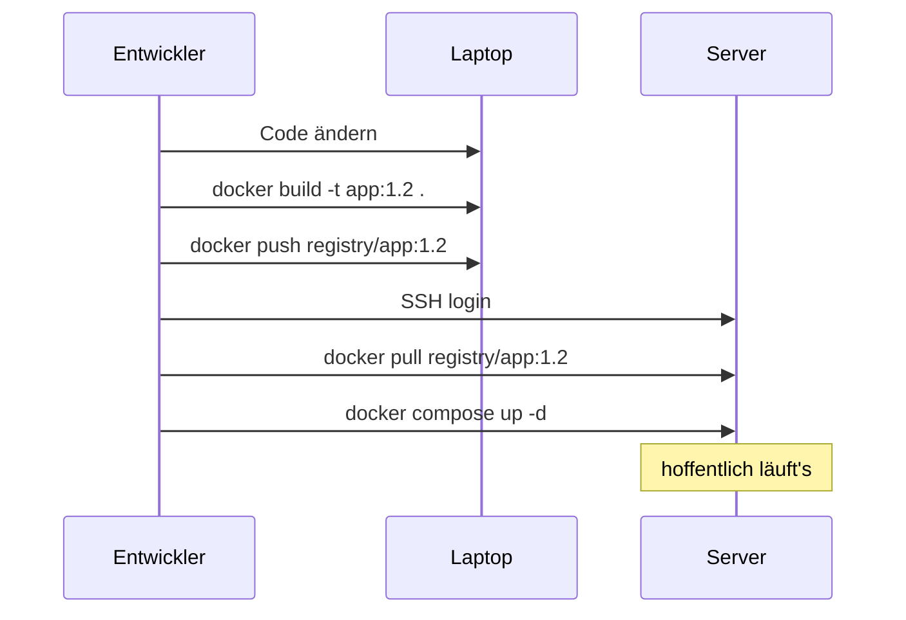
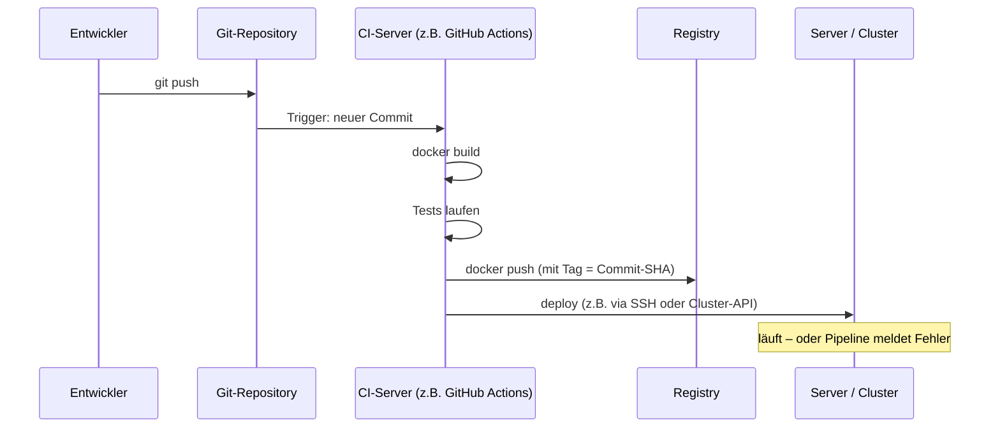
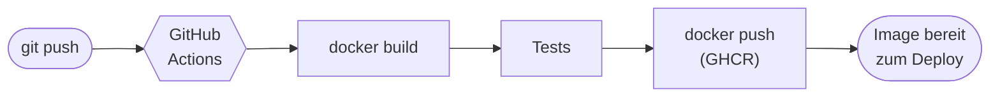

# Warum CI/CD?

!!! abstract "Lernziel"
    Nach dieser Seite kannst du:

    - drei konkrete Schmerzpunkte beim manuellen Deployment benennen
    - erklären, warum „works on my machine" ein Symptom und kein Ursache ist
    - die wirtschaftliche Motivation hinter CI/CD in einem Satz formulieren
    - die Brücke zwischen Block 5 (eigenes Image bauen) und diesem Block schlagen

---

## Brücke: Wo wir stehen

Du hast in den letzten Blöcken gelernt:

- ein **Dockerfile** schreiben
- mit `docker build` ein **Image** erzeugen
- mit `docker compose up -d` einen **Stack** starten
- Images **schlank und sicher** machen (Multi-Stage, USER, Trivy)

Was du **noch nicht** gelernt hast: wie das Image vom **Laptop** auf einen **Server** kommt – ohne dass du jeden Schritt von Hand machst.

Genau das ist die Frage, die CI/CD beantwortet.

---

## Das manuelle Deployment – ehrlich angeschaut

Stell dir den klassischen Ablauf ohne Automatisierung vor. Eine kleine Web-App, ein Server, ein Entwickler:

Was sieht so harmlos aus, ist in Wahrheit **voller Stolperfallen**. Jeder Schritt kann schiefgehen, und am Ende fragt sich jemand: „Warum tut die Live-Version was anderes als auf meinem Rechner?"

---

## Drei konkrete Schmerzpunkte

### 1. Der Mensch ist der unzuverlässigste Schritt

Du baust das Image lokal. Aber:

- **Welche Node-Version** war das nochmal? `v18.17.0` oder `v18.17.1`?
- War **der Linter** vor dem Build durchgelaufen?
- War das `git tag` schon gesetzt, **bevor** du das Image gebaut hast?
- Hast du wirklich den **finalen Stand** gepusht – oder den von vor zwei Stunden, weil dazwischen noch ein Hotfix kam?

Der Klassiker: **„Bei mir läuft's"**. Nicht weil die Software schlecht ist, sondern weil dein Laptop minimal anders konfiguriert ist als der Server (andere libssl-Version, andere Locale, anderer Build-Cache). Ein **frischer, sauberer Build-Server** entzieht solchen Effekten den Boden.

!!! warning "„Works on my machine" ist ein Symptom"
    Dahinter steht fast immer **versteckter State** im Build: lokal installierte Tools, Cache-Reste, Editor-spezifische Dateien. Eine CI baut auf einer **frischen Maschine**, die jedes Mal von Null anfängt – und macht damit den Build **reproduzierbar**.

### 2. Keine Nachvollziehbarkeit

- Wer hat **wann** welches Image deployt?
- Welche Tests sind **vorher gelaufen**?
- Welcher **Commit** entspricht welcher Version, die in Produktion läuft?

Ohne Pipeline ist das alles **mündliches Wissen**: „Frag den Frank, der hat's letzte Woche eingespielt." Wenn Frank im Urlaub ist und die Live-Version kaputt geht, hast du ein Problem.

Mit einer Pipeline wird **jeder Build** automatisch dokumentiert: welcher Commit, welche Tests, welche Logs, welcher Zeitstempel. Das ist nicht nur DevOps-Folklore – das ist ganz konkret **Pflicht** in vielen Branchen (Compliance, Audits).

### 3. Skalierung kollidiert mit Handarbeit

Bei **einem** Service, **einem** Server und **einem** Entwickler funktioniert manuelles Deployment irgendwie. Sobald du wächst, kippt das:

- Mehrere **Services** (Frontend, Backend, Worker, DB-Migrations).
- Mehrere **Umgebungen** (Dev, Staging, Production).
- Mehrere **Entwickler**, die unabhängig voneinander Änderungen einspielen wollen.
- Mehrere **Server** oder Cluster, auf die ausgerollt werden muss.

Schon bei drei Services × zwei Umgebungen × zwei Entwicklern bist du bei einer **Matrix von 12 Deployment-Pfaden**, die alle ins Reine passen müssen. Manuell? Garantiert kommt etwas durcheinander.

---

## Was die Automatisierung verändert

Dieselbe Geschichte mit Pipeline:

Was sich konkret ändert:

| Vorher | Nachher |
|--------|---------|
| Build auf dem Laptop, „klappt schon" | Build auf einer frischen, immergleichen Maschine |
| Tests „ich glaub ich hab's getestet" | Tests sind **Bedingung** für den Deploy |
| „wer hat eigentlich deployt?" | Jeder Deploy steht im Pipeline-Protokoll mit Commit, Zeit, User |
| 15 Minuten Konzentration für jeden Push | `git push` – Rest macht die Pipeline |
| Server-Login mit privilegierten Credentials | Pipeline hat **Service Account** mit minimalen Rechten |

!!! tip "Der heimliche Gewinn: schneller scheitern"
    Eine Pipeline ist nicht nur „Deployment-Automat". Sie ist auch ein **Frühwarnsystem**: kaputter Commit → Build fällt um → 5 Minuten später weißt du Bescheid, statt es einen Tag später beim Deploy zu sehen.

---

## Wo die Hand-Arbeit am meisten weh tut

In der Praxis sind das die drei Stellen, an denen Teams am häufigsten kippen:

??? warning "1. Die Versionierung des Images"
    Manuell: `docker build -t app:latest .` Dann später: „Welche Version läuft eigentlich?" – Niemand weiß es genau.

    Automatisiert: Tag = Git-Commit-SHA (oder Git-Tag). Du kannst von jedem laufenden Container exakt zurückführen, **welche Codezeilen** drinstecken.

??? warning "2. Das Test-Stadium"
    Manuell: „Tests sind durchgelaufen" – heißt im Zweifel, dass die Person sie **vor** den letzten zwei Code-Änderungen ausgeführt hat.

    Automatisiert: Tests laufen **nach jedem** Commit, **bevor** der Build überhaupt akzeptiert wird. Wenn jemand kaputten Code mergt, fällt der Build.

??? warning "3. Das Rollback"
    Manuell: „Schnell zurück auf gestern" – wenn du Glück hast, weißt du noch, welche Version das war. Wenn nicht: improvisieren.

    Automatisiert: Jedes Image hat eine eindeutige Tag-Historie. Rollback ist im Wesentlichen `docker pull alter-tag && docker compose up -d` – mehr nicht.

---

## Was CI/CD **nicht** löst

Wichtig zur Erwartungsmanagement:

- **Keine guten Tests, keine gute Pipeline.** CI/CD führt nur das aus, was du ihr gibst. Wenn dein Test-Suite leer ist, kippt der Pipeline-Build niemals – aber die Software ist trotzdem kaputt.
- **Keine guten Architekturen, keine schöne Pipeline.** Wenn dein Deploy 47 manuelle Schritte braucht, weil das Schema-Migrations-Tool kaputt ist, hilft auch GitHub Actions nicht.
- **Sicherheit kommt nicht von alleine.** Eine Pipeline mit weltlesbaren Secrets ist gefährlicher als gar keine Pipeline.

CI/CD ist ein **Vervielfacher**: gute Praktiken werden besser, schlechte werden offensichtlicher.

---

## Die wirtschaftliche Sicht

Manchmal hilft das Argument an Vorgesetzte: **CI/CD spart messbar Geld**. Studien wie der jährliche „State of DevOps Report" zeigen mehrere Größenordnungen Unterschied bei

- **Lead Time** (Zeit von Commit bis Produktion)
- **Deployment Frequency** (wie oft pro Tag/Woche überhaupt veröffentlicht wird)
- **Change Failure Rate** (wie oft ein Deploy schiefgeht)
- **Recovery Time** (wie lange nach einem Fehler bis zum Fix)

Teams **mit** automatisierter Pipeline deployen täglich, scheitern selten und beheben Fehler in Minuten. Teams **ohne** brauchen für ein Release oft Tage – und beheben Probleme über Stunden.

!!! info "Achtung vor Cargo-Cult"
    „Wir machen jetzt CI/CD" als Selbstzweck bringt nichts. Das Ziel ist nicht **„eine Pipeline haben"**, sondern **kürzere Vorlaufzeiten und weniger Fehler**. Eine Pipeline, die Tests zu langsam laufen lässt, sodass alle sie überspringen, ist schlechter als gar keine.

---

## Das Bild für den Rest des Blocks

Was wir in den nächsten Stunden bauen, sieht im Kleinen genau so aus:

Klein, aber vollständig. Der **Trigger** (`push`), der **Build** (`docker build`), die **Tests**, das **Publishing** in eine Registry. Den Schritt von „Image in Registry" zu „läuft auf einem Server" lassen wir **bewusst** offen – das ist eine eigene Diskussion (Kubernetes, ArgoCD, klassisches SSH-Deploy) und kommt im [Ausblick](ausblick.md).

---

## Was du jetzt wissen solltest

- Manuelles Deployment skaliert weder mit der Anzahl der Services noch mit der Anzahl der Entwickler.
- Drei häufige Schmerzpunkte: **versteckter State**, **fehlende Nachvollziehbarkeit**, **kombinatorische Komplexität**.
- CI/CD löst das nicht „magisch" – es macht aus mündlichem Wissen einen **versionierten, ausführbaren Plan**.
- Schlechte Tests bleiben schlecht. CI/CD verstärkt vorhandene Praktiken, im Guten wie im Schlechten.

---

## Merksatz

!!! success "Merksatz"
    > **Manuelles Deployment skaliert nicht. CI/CD ersetzt mündliches Wissen durch eine versionierte, ausführbare Pipeline – die jeden Build reproduzierbar, prüfbar und nachvollziehbar macht.**

---

## Weiterlesen

- [Begriffe: CI, CD, CD](begriffe.md) – die drei Begriffe sauber trennen
- [Pipeline-Konzept](pipeline-konzept.md) – was die Pipeline konkret macht
