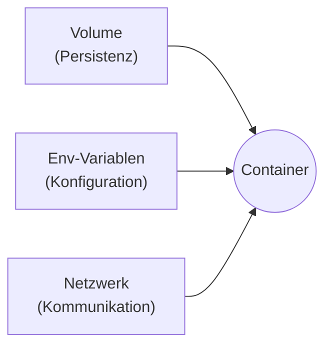

# Docker – Aufbau (Block 3)

Im Einführungs-Block hast du einzelne Container gestartet und dein erstes eigenes Image gebaut. Dieser Block macht aus einzelnen Containern **echte Anwendungen**: solche, die Daten behalten, konfigurierbar sind und aus mehreren zusammenarbeitenden Teilen bestehen.

!!! abstract "Was du nach diesen 3 Stunden kannst"
    - Container so starten, dass Daten **einen Neustart überleben** (Volumes)
    - Container über **Umgebungs­variablen** konfigurieren, ohne das Image neu zu bauen
    - Ein eigenes **Docker-Netzwerk** anlegen und Container über ihren Namen sprechen lassen
    - Einen kleinen Multi-Container-Stack (Postgres + Adminer) **manuell** zusammenbauen

---

## Zeitplan – 3 Stunden

!!! note "Für Präsenzkurs und Selbstlerner"
    Der folgende Zeitplan ist für den **3-Stunden-Präsenzkurs** gedacht. Wenn du die Unterlagen alleine durcharbeitest, ignoriere die Zeiten und konzentriere dich auf die Inhalte – Reihenfolge und Aufbau sind aber auch fürs Selbststudium optimal.

| Zeit | Was passiert | Seite |
|------|--------------|-------|
| **0:00 – 0:15** | Begrüßung, kurze Wiederholung Block 1/2, Zielbild | — |
| **0:15 – 0:35** | Theorie-Folien: Volumes, ENV, Netzwerke (20 Min) | [Volumes](volumes.md) · [ENV](umgebungsvariablen.md) · [Netzwerke](docker-networks.md) |
| **0:35 – 1:15** | Praxis 1: Postgres mit Volume + ENV starten | [Praxis Teil 1](praxis-multi-container.md#teil-1-postgres-mit-volume-und-env) |
| **1:15 – 1:25** | Pause | — |
| **1:25 – 2:05** | Praxis 2: Netzwerk anlegen, Adminer dazu | [Praxis Teil 2](praxis-multi-container.md#teil-2-adminer-dazu-das-netzwerk) |
| **2:05 – 2:35** | Praxis 3: Daten testen, Persistenz erleben | [Praxis Teil 3](praxis-multi-container.md#teil-3-daten-und-persistenz-erleben) |
| **2:35 – 2:55** | Probleme besprechen, Stolpersteine sammeln | [Stolpersteine](stolpersteine.md) |
| **2:55 – 3:00** | Ausblick: Docker Compose nächstes Mal | [Compose-Block](../docker-compose/index.md) |

---

## Seiten in diesem Block

| Seite | Inhalt | Für den Kurs |
|-------|--------|--------------|
| [Volumes & Persistenz](volumes.md) | Warum Container flüchtig sind, Volumes vs. Bind Mounts, Backup-Strategien | Theorie-Grundlage + Praxis Teil 1 |
| [Umgebungsvariablen](umgebungsvariablen.md) | `-e`, `--env-file`, `.env`, Secrets-Abgrenzung | Theorie-Grundlage + Praxis Teil 1 |
| [Docker-Netzwerke](docker-networks.md) | Bridge, User-Defined, Docker-DNS, Container-zu-Container | Theorie-Grundlage + Praxis Teil 2 |
| [Praxis: Postgres & Adminer](praxis-multi-container.md) | Hands-on Schritt für Schritt – keine Programmier­kenntnisse nötig | Der Praxis-Teil |
| [Stolpersteine](stolpersteine.md) | Typische Probleme in allen drei Bereichen | Für die Gruppenarbeit und Besprechung |
| [Merksätze](merksaetze.md) | Kompakte Zusammenfassung | Zum Wiederholen |

!!! tip "Für dich zum Nachlesen – nicht für den Kurs heute"
    Das Thema **Docker Compose** wäre jetzt der logische nächste Schritt, um alles Manuelle zu automatisieren. Weil das aber eigene 3 Stunden verdient, haben wir es als [eigenen Block](../docker-compose/index.md) geplant – zum nächsten Mal.

    Wer später Images richtig schlank und sicher bauen möchte, findet das im [Profi-Block](../docker-profi/index.md).

---

## Roter Faden

Alle drei Themen hängen zusammen:

Das sind die **drei Säulen**, die jede ernsthafte Container-Anwendung braucht. Du erkennst sie in jedem Docker-Compose-Beispiel, in jedem Kubernetes-Deployment wieder – genau deshalb legen wir sie jetzt ordentlich.

---

## Leitfrage

> **Wie schaffst du es, dass deine Container Daten behalten, konfigurierbar sind und miteinander reden – alles mit Standard-Mitteln von Docker?**

Am Ende dieser 3 Stunden hast du diese Frage praktisch beantwortet.
