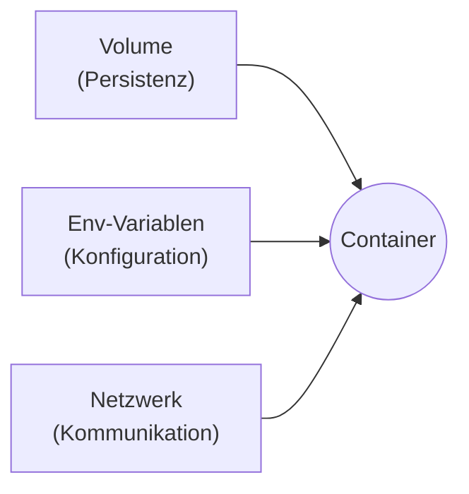

# Docker – Aufbau

Im Einführungs-Block hast du einzelne Container gestartet und dein erstes eigenes Image gebaut. Dieser Block macht aus einzelnen Containern **echte Anwendungen**: solche, die Daten behalten, konfigurierbar sind und aus mehreren zusammenarbeitenden Teilen bestehen.

!!! abstract "Was du nach diesen 3 Stunden kannst"
    - Container so starten, dass Daten **einen Neustart überleben** (Volumes)
    - Container über **Umgebungsvariablen** konfigurieren, ohne das Image neu zu bauen
    - Ein eigenes **Docker-Netzwerk** anlegen und Container über ihren Namen sprechen lassen
    - Einen kleinen Multi-Container-Stack (Postgres + Adminer) **manuell** zusammenbauen

---

## Aufwand und Reihenfolge

Plane für dieses Kapitel **etwa 3 Stunden** ein – rund ein Drittel davon Theorie, der Rest Praxis am eigenen Rechner.

Bewährte Reihenfolge:

1. **Theorie:** [Volumes](volumes.md) · [Umgebungsvariablen](umgebungsvariablen.md) · [Netzwerke](docker-networks.md)
2. **Praxis 1:** [Postgres mit Volume und ENV starten](praxis-multi-container.md#teil-1-postgres-mit-volume-und-env)
3. **Praxis 2:** [Netzwerk anlegen, Adminer dazu](praxis-multi-container.md#teil-2-adminer-dazu-das-netzwerk)
4. **Praxis 3:** [Daten testen, Persistenz erleben](praxis-multi-container.md#teil-3-daten-und-persistenz-erleben)
5. **Nacharbeit:** [Stolpersteine](stolpersteine.md) durchgehen, [Merksätze](merksaetze.md) wiederholen
6. **Ausblick:** [Docker Compose](../docker-compose/index.md)

---

## Seiten in diesem Block

| Seite | Inhalt | Rolle |
|-------|--------|--------------|
| [Volumes & Persistenz](volumes.md) | Warum Container flüchtig sind, Volumes vs. Bind Mounts, Backup-Strategien | Theorie-Grundlage + Praxis Teil 1 |
| [Umgebungsvariablen](umgebungsvariablen.md) | `-e`, `--env-file`, `.env`, Secrets-Abgrenzung | Theorie-Grundlage + Praxis Teil 1 |
| [Docker-Netzwerke](docker-networks.md) | Bridge, User-Defined, Docker-DNS, Container-zu-Container | Theorie-Grundlage + Praxis Teil 2 |
| [Praxis: Postgres & Adminer](praxis-multi-container.md) | Hands-on Schritt für Schritt – keine Programmierkenntnisse nötig | Der Praxis-Teil |
| [Übungen](uebungen.md) | 🟢🟡🔴🏆 Vier Schwierigkeitsgrade zum Selbermachen | Training |
| [Stolpersteine](stolpersteine.md) | Typische Probleme in allen drei Bereichen | Zum Nachschlagen |
| [Merksätze](merksaetze.md) | Kompakte Zusammenfassung | Zum Wiederholen |

!!! tip "Für dich zum Nachlesen – nicht Teil dieses Kapitels"
    Das Thema **Docker Compose** wäre jetzt der logische nächste Schritt, um alles Manuelle zu automatisieren. Weil das aber eigene 3 Stunden verdient, liegt es in einem [eigenen Kapitel](../docker-compose/index.md).

    Wer Images richtig schlank und sicher bauen möchte, findet das im [Profi-Block](../docker-profi/index.md).

---

## Roter Faden

Alle drei Themen hängen zusammen:

```mermaid
flowchart LR
  V["Volume<br/>(Persistenz)"] --> C(("Container"))
  E["Env-Variablen<br/>(Konfiguration)"] --> C
  N["Netzwerk<br/>(Kommunikation)"] --> C
```

Das sind die **drei Säulen**, die jede ernsthafte Container-Anwendung braucht. Du erkennst sie in jedem Docker-Compose-Beispiel, in jedem Kubernetes-Deployment wieder – genau deshalb legen wir sie jetzt ordentlich.

---

## Leitfrage

> **Wie schaffst du es, dass deine Container Daten behalten, konfigurierbar sind und miteinander reden – alles mit Standard-Mitteln von Docker?**

Am Ende dieser 3 Stunden hast du diese Frage praktisch beantwortet.
