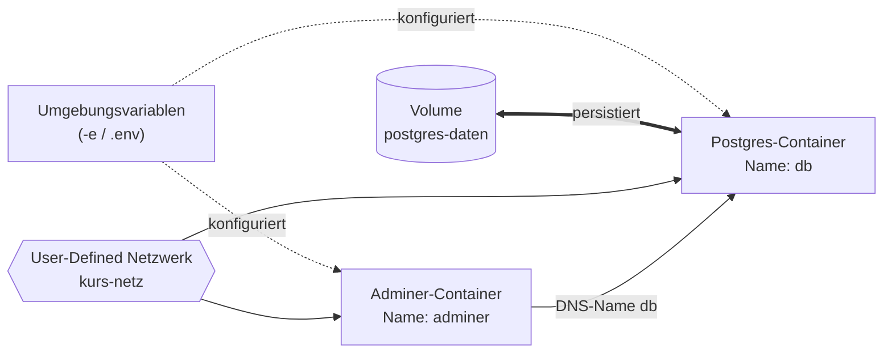

# Merksätze – Aufbau-Block (Block 3)

Wenn du dir diese Sätze einprägst, hast du die Kern-Ideen des heutigen Kurses beieinander.

---

## 1. Die drei Säulen

!!! success "Merksatz 1"
    > **Daten überleben nur in Volumes (oder Bind Mounts). Konfiguration kommt aus Umgebungs­variablen. Container reden über eigene Docker-Netzwerke miteinander – per Container-Name, nicht per IP.**

Das ist der **zentrale Satz** des ganzen Blocks. Alle weiteren Sätze sind Vertiefungen davon.

---

## 2. Persistenz

!!! success "Merksatz 2"
    > **Was nur im beschreibbaren Top-Layer eines Containers lebt, ist beim `docker rm` weg. Für persistente Daten brauchst du Volumes (von Docker verwaltet) oder Bind Mounts (Host-Pfad, den du selbst kennst).**

Konsequenz: **Nie auf das Container-Dateisystem vertrauen**. Datenbanken, Uploads, Logs – immer außerhalb.

---

## 3. Konfiguration

!!! success "Merksatz 3"
    > **Konfiguration gehört in Umgebungs­variablen, nicht ins Image. Secrets niemals ins Image – immer erst zur Laufzeit per `-e` oder `--env-file`.**

Konsequenz: `.env` gehört in `.gitignore`.

---

## 4. Netzwerk

!!! success "Merksatz 4"
    > **Container im selben User-Defined Netzwerk finden sich über ihren Namen – das ist Docker-DNS. `-p` brauchst du nur, wenn der Port vom Host aus erreichbar sein soll, nicht für Container-zu-Container.**

Im Default-Bridge gibt es **kein** DNS – deshalb für ernsthafte Setups immer ein eigenes Netzwerk anlegen.

---

## 5. Der Praxis-Merksatz

!!! success "Merksatz 5"
    > **Mit drei Standard-Befehlen – `docker volume create`, `docker network create`, `docker run -v ... -e ... --network ...` – baust du jeden Multi-Container-Stack manuell zusammen.**

Heute hast du das mit **Postgres + Adminer** in 30–40 Minuten getan. Fünf `docker`-Befehle, und du hast eine funktionierende, persistente Datenbank mit Web-GUI.

---

## 6. Der Ausblick-Satz

!!! success "Merksatz 6"
    > **Was heute manuell war, wird nächstes Mal deklarativ: Docker Compose beschreibt genau diesen Stack in einer einzigen YAML-Datei.**

Das ist der Cliffhanger für den nächsten Block – [Docker Compose](../docker-compose/index.md).

---

## Das große Bild

- **Oben:** die drei Säulen (ENV, Volume, Netzwerk)
- **Unten:** zwei Container, die miteinander über DNS sprechen

Das ist das Muster, das jede ernsthafte Container-Anwendung nutzt.

---

## Für zu Hause

- Baue den Stack zu Hause noch einmal auf, diesmal mit eigenen Daten in der Tabelle.
- Ändere das Passwort über eine `.env`-Datei statt inline.
- Stoppe beide Container **ohne** das Volume zu löschen – prüfe, dass die Daten nach dem Neustart noch da sind.

Wenn dir das alles locker fällt, bist du optimal vorbereitet für das nächste Mal – **Docker Compose**.

[→ Weiter zu: Docker Compose (Block 4)](../docker-compose/index.md)
