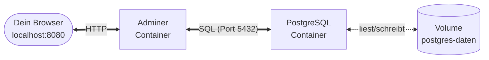

# Praxis: Postgres & Adminer

Dieser Hands-on führt dich durch **alle drei Säulen** aus dem Theorie-Teil zusammen. Du brauchst **keine Programmier­kenntnisse** und **kein eigenes Dockerfile** – wir nutzen ausschließlich fertige Images aus Docker Hub.

!!! abstract "Ziel"
    Am Ende hast du:

    - eine **PostgreSQL-Datenbank** mit persistenten Daten (Volume)
    - **Konfiguration per ENV-Variablen** (User, Passwort, DB-Name)
    - ein **eigenes Docker-Netzwerk** für die Container
    - **Adminer** als grafische Oberfläche für Postgres
    - einen **Persistenz-Test**: Container weg, Daten bleiben

## Voraussetzungen

- Docker läuft (`docker version` klappt). Siehe [Installation](../docker/installation.md).
- Ein Terminal (macOS: Terminal/iTerm, Windows: PowerShell, Linux: Shell deiner Wahl).
- Ein Browser.
- Einmal grundlegend aufräumen, damit kein alter Kram stört:

    === "macOS / Linux"
        ```bash
        docker stop db adminer 2>/dev/null
        docker rm db adminer 2>/dev/null
        docker network rm kurs-netz 2>/dev/null
        ```

    === "Windows PowerShell"
        ```powershell
        docker stop db adminer 2>$null
        docker rm db adminer 2>$null
        docker network rm kurs-netz 2>$null
        ```

    === "Windows CMD"
        ```cmd
        docker stop db adminer 2>nul
        docker rm db adminer 2>nul
        docker network rm kurs-netz 2>nul
        ```

    (Fehler „No such container" sind okay.)

---

## Was wir bauen



Zwei Container, ein Volume, ein Netzwerk. Klein, aber lehrreich.

---

## Teil 1 – Postgres mit Volume und ENV

**Zeit:** ca. 30–40 Minuten inkl. Vormachen + eigenes Ausprobieren + Besprechung.

### Schritt 1.1 – Volume anlegen

Docker kann Volumes automatisch erzeugen, aber wir machen es einmal explizit, damit du den Befehl kennst:

```bash
docker volume create postgres-daten
```

Check:

```bash
docker volume ls
```

Du siehst in der Liste `postgres-daten`.

??? info "Was ist ein Volume – nochmal kurz?"
    Ein Volume ist ein Speicher­bereich, den **Docker** verwaltet, unabhängig von einzelnen Containern. Du kannst ihn in beliebige Container einhängen. Stirbt ein Container, bleibt das Volume. Details auf der [Volumes-Seite](volumes.md).

### Schritt 1.2 – Postgres starten

```bash
docker run -d \
  --name db \
  -v postgres-daten:/var/lib/postgresql/data \
  -e POSTGRES_USER=kurs \
  -e POSTGRES_PASSWORD=geheim \
  -e POSTGRES_DB=kursdaten \
  postgres:16
```

Gehen wir das **Flag für Flag** durch:

| Flag | Bedeutung |
|------|-----------|
| `-d` | Detached, im Hintergrund |
| `--name db` | fester Name `db` (wichtig für Netzwerk gleich) |
| `-v postgres-daten:/var/lib/postgresql/data` | Volume in das Datenverzeichnis von Postgres einhängen |
| `-e POSTGRES_USER=kurs` | Benutzer, den Postgres anlegt |
| `-e POSTGRES_PASSWORD=geheim` | Passwort für den Benutzer |
| `-e POSTGRES_DB=kursdaten` | Datenbank, die Postgres beim ersten Start erzeugt |
| `postgres:16` | offizielles Postgres-Image, Version 16 |

!!! tip "Kein `-p`?"
    Stimmt, kein Port-Mapping. Die Datenbank soll **nicht direkt** vom Host aus erreichbar sein – nur Adminer soll mit ihr sprechen. Das machen wir gleich über das Netzwerk.

### Schritt 1.3 – Prüfen, ob Postgres läuft

```bash
docker ps
```

Du siehst:

```text
CONTAINER ID   IMAGE         ...   STATUS         PORTS      NAMES
abc123def      postgres:16   ...   Up 5 seconds   5432/tcp   db
```

Die Logs zeigen, ob Postgres hochgefahren ist:

```bash
docker logs db
```

Ganz am Ende solltest du lesen:

```text
database system is ready to accept connections
```

??? warning "Container beendet sich sofort?"
    Check `docker logs db`. Häufigste Fehler:

    - **Kein `POSTGRES_PASSWORD`**: Postgres verlangt ein Passwort oder eine Sonder­einstellung. Ohne crasht er.
    - **Alte Daten im Volume passen nicht zur Image-Version**: Wenn du vorher Postgres 15 benutzt hattest, wird 16 die alten Daten nicht annehmen. Fix: Volume neu erstellen (`docker volume rm postgres-daten && docker volume create postgres-daten`). **Achtung: dann sind die Daten weg!**

---

## Teil 2 – Adminer dazu (das Netzwerk)

**Zeit:** ca. 30–40 Minuten.

Postgres läuft, aber wir sehen nichts davon. Jetzt bringen wir **Adminer** dazu – das ist eine schlanke Web-GUI für Datenbanken, ebenfalls als offizielles Docker-Image verfügbar.

### Schritt 2.1 – Eigenes Netzwerk anlegen

Damit Adminer die Datenbank per Name `db` findet, brauchen wir ein eigenes Docker-Netzwerk (im Default-Bridge gibt es kein DNS):

```bash
docker network create kurs-netz
```

Check:

```bash
docker network ls
```

Neue Zeile mit `kurs-netz`.

### Schritt 2.2 – Postgres ins Netzwerk aufnehmen

Der Postgres-Container läuft schon – aber nicht im neuen Netzwerk. Zwei Wege:

=== "Variante A: Container einfach umhängen (schnell)"
    ```bash
    docker network connect kurs-netz db
    ```
    Postgres läuft weiter, ist jetzt zusätzlich im `kurs-netz`.

=== "Variante B: Postgres neu starten (sauber)"
    ```bash
    docker stop db
    docker rm db

    docker run -d \
      --name db \
      --network kurs-netz \
      -v postgres-daten:/var/lib/postgresql/data \
      -e POSTGRES_USER=kurs \
      -e POSTGRES_PASSWORD=geheim \
      -e POSTGRES_DB=kursdaten \
      postgres:16
    ```

    Dieser Weg ist sauberer – in der `docker ps`-Ausgabe siehst du sofort, dass `db` im richtigen Netz ist. Das Volume bleibt erhalten, die Daten sind also noch da.

Für den Kurs nehmen wir **Variante B** – wir üben `stop` + `rm` + `run` noch einmal explizit.

### Schritt 2.3 – Adminer starten

```bash
docker run -d \
  --name adminer \
  --network kurs-netz \
  -p 8080:8080 \
  adminer
```

| Flag | Bedeutung |
|------|-----------|
| `-d` | im Hintergrund |
| `--name adminer` | fester Name |
| `--network kurs-netz` | im selben Netz wie Postgres |
| `-p 8080:8080` | Host-Port 8080 → Container-Port 8080 (Adminer-Default) |
| `adminer` | offizielles Image |

Check:

```bash
docker ps
```

Beide laufen jetzt:

```text
CONTAINER ID   IMAGE         STATUS         PORTS                    NAMES
abc123         adminer       Up 5 seconds   0.0.0.0:8080->8080/tcp   adminer
def456         postgres:16   Up 30 seconds  5432/tcp                 db
```

### Schritt 2.4 – Im Browser öffnen

<http://localhost:8080>

Du siehst die Adminer-Login-Maske. Felder ausfüllen:

| Feld | Wert |
|------|------|
| **System** | PostgreSQL |
| **Server** | `db` |
| **Benutzer** | `kurs` |
| **Passwort** | `geheim` |
| **Datenbank** | `kursdaten` |

Klick auf **Anmelden**.

**Wichtig**: Im Feld **Server** steht **`db`** – der Name des anderen Containers. Docker-DNS löst das zur IP des Postgres-Containers auf. Kein `localhost`, kein `127.0.0.1`, keine IP-Adresse.

Wenn alles stimmt, landest du im Adminer-Dashboard mit der leeren Datenbank `kursdaten`.

??? danger "Login scheitert: „Connection refused" oder „Timeout""
    Kommt überraschend oft vor. Checks:

    1. **Sind beide Container im Netzwerk?**
       ```bash
       docker network inspect kurs-netz
       ```
       Unter „Containers" müssen `db` und `adminer` stehen.
    2. **Ist Postgres bereit?**
       ```bash
       docker logs db | tail -5
       ```
       Letzte Zeile sollte „database system is ready to accept connections" sein.
    3. **Schreibfehler?** Server muss genau `db` sein (der Container-Name). Nicht `postgres`, nicht `localhost`.

---

## Teil 3 – Daten und Persistenz erleben

**Zeit:** ca. 25–30 Minuten.

### Schritt 3.1 – Eine Tabelle anlegen

In Adminer:

1. Oben **SQL-Kommando** klicken.
2. Eintragen:

   ```sql
   CREATE TABLE teilnehmer (
     id SERIAL PRIMARY KEY,
     name TEXT,
     hobby TEXT
   );

   INSERT INTO teilnehmer (name, hobby) VALUES
     ('Anna', 'Klettern'),
     ('Ben', 'Kochen'),
     ('Carla', 'Segeln');
   ```

3. **Ausführen** klicken.

4. Links in der Seitenleiste siehst du jetzt die Tabelle `teilnehmer`. Klick drauf → **Auswählen** → du siehst die drei Datensätze.

!!! tip "Für den Kurs"
    Lass die Teilnehmer hier kreativ sein – eigene Tabellen mit eigenen Daten. Jede Gruppe mit 2–3 Datensätzen. Das macht den Persistenz-Test gleich interessanter.

### Schritt 3.2 – Container zerstören

Jetzt kommt der Lackmus-Test. Wir zerstören **beide Container**:

```bash
docker stop adminer db
docker rm adminer db
```

Prüfen:

```bash
docker ps -a
```

Keine Container mehr mit den Namen `adminer` oder `db`. Sie sind weg.

Aber:

```bash
docker volume ls
docker network ls
```

Das **Volume `postgres-daten`** ist noch da. Das **Netzwerk `kurs-netz`** auch.

### Schritt 3.3 – Neu starten und Daten prüfen

```bash
docker run -d \
  --name db \
  --network kurs-netz \
  -v postgres-daten:/var/lib/postgresql/data \
  -e POSTGRES_USER=kurs \
  -e POSTGRES_PASSWORD=geheim \
  -e POSTGRES_DB=kursdaten \
  postgres:16

docker run -d \
  --name adminer \
  --network kurs-netz \
  -p 8080:8080 \
  adminer
```

Kurz warten (10–20 Sekunden), dann Browser neu laden: <http://localhost:8080>

Login wie vorher. Tabelle `teilnehmer` ist **noch da**, Datensätze auch.

!!! success "Das war der Beweis"
    Die Container sind neu – aber das **Volume** ist dasselbe. Deshalb hat die Datenbank ihre Daten behalten. Ohne Volume wären sie verloren gewesen.

---

## Was haben wir gerade gelernt

Zoom mal raus und schau drauf, was du gemacht hast:

| Säule | Was du praktisch gesehen hast |
|-------|-------------------------------|
| **Volume** | Container zerstört, Daten da. Der Unterschied zwischen „flüchtigem" Container-Layer und persistentem Volume. |
| **ENV-Variablen** | Postgres mit `-e POSTGRES_USER=...` konfiguriert. Kein eigenes Image, einfach das Standard-Image mit passenden Variablen. |
| **Netzwerk** | Adminer findet Postgres über `db` – **nicht** über eine IP, **nicht** über `localhost`. Docker-DNS macht das möglich. |

Das ist **das Kern-Werkzeug** für jede ernsthafte Container-Anwendung. Alles, was danach kommt (Docker Compose, Kubernetes, …), baut darauf auf.

---

## Aufräumen am Ende

Wenn du für heute fertig bist:

```bash
docker stop adminer db
docker rm adminer db
docker network rm kurs-netz

# Volume behalten (Daten bleiben):
docker volume ls

# ODER: Volume auch löschen (Daten weg!):
docker volume rm postgres-daten
```

Das Image von Postgres bleibt auf deiner Platte – das ist okay, so musst du es beim nächsten Mal nicht erneut herunterladen.

---

## Typische Probleme in diesem Praxis-Teil

Siehe [Stolpersteine](stolpersteine.md) für eine ausführliche Liste. Die **Top 3** aus diesem Hands-on:

1. **Adminer verbindet sich nicht mit `db`** → beide Container müssen im **gleichen User-Defined Netzwerk** sein, sonst geht Docker-DNS nicht.
2. **Port 8080 schon belegt** → entweder anderen Port wählen (`-p 8081:8080`) oder den Blockierer finden:

    === "macOS / Linux"
        ```bash
        lsof -i :8080
        ```

    === "Windows PowerShell"
        ```powershell
        netstat -ano | findstr :8080
        ```
3. **Nach Stop/Start sind Daten weg** → das **Volume** muss beim zweiten `docker run` wieder gemountet werden. Ohne `-v postgres-daten:/var/lib/postgresql/data` hat der neue Container keine Verbindung zum alten Volume.

---

## Ausblick

Du hast gerade fünf einzelne `docker`-Befehle getippt (plus Stop/Rm-Zyklus). Das geht auch eleganter: **Docker Compose** beschreibt all das in **einer YAML-Datei** und startet es mit einem einzigen Befehl.

Das ist das Thema für die **nächste 3-Stunden-Einheit** – siehe [Docker Compose](../docker-compose/index.md).

---

## Merksatz

!!! success "Merksatz"
    > **Drei Säulen reichen: Volume für Persistenz, ENV für Konfiguration, Netzwerk für Kommunikation. Mit Postgres + Adminer hast du alle drei in 30 Minuten praktisch erlebt.**
