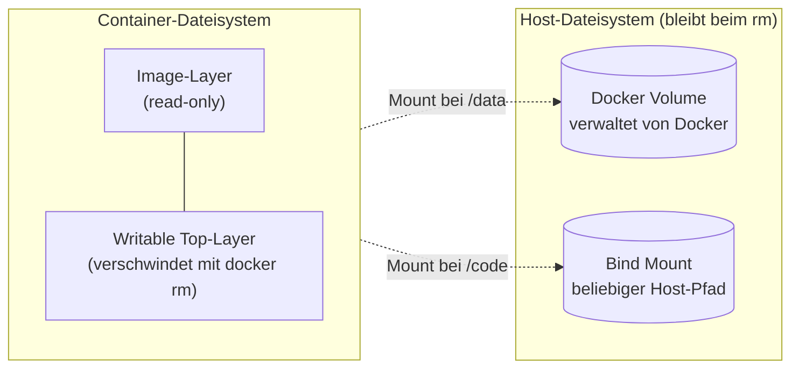

# Volumes & Persistenz

!!! abstract "Lernziel"
    Nach dieser Seite kannst du:

    - erklären, **warum Daten in einem Container flüchtig sind** – und wann das zum Problem wird
    - **Volumes** und **Bind Mounts** unterscheiden und jeweils sinnvoll einsetzen
    - einen Container mit persistentem Speicher starten, z.B. eine PostgreSQL mit dauerhaften Daten
    - typische Fallstricke rund um Permissions, Backups und Volume-Management umgehen

---

## Warum das wichtig ist

Erinnere dich an den [Einführungs-Block](../docker/image-und-container.md): Ein Container hat einen **beschreibbaren Top-Layer**. Alles, was der Container während seiner Laufzeit schreibt, landet dort. Und:

> **Beim `docker rm` verschwindet dieser Top-Layer – und mit ihm alles, was der Container je geschrieben hat.**

Für eine **zustandslose** Web-App (ein nginx mit statischem HTML) ist das völlig okay. Für eine **Datenbank** oder eine App mit hochgeladenen Dateien ist das eine Katastrophe: bei jedem Container-Neustart wären alle Daten weg.

Die Lösung: **den Speicher außerhalb des Containers halten.** Dafür gibt es zwei Wege: **Volumes** und **Bind Mounts**.

---

## Das große Bild



- **Image-Layer** bleibt beim Löschen des Containers bestehen (ist ja unveränderlich).
- **Writable Top-Layer** verschwindet.
- **Volumes und Bind Mounts** leben **außerhalb** des Containers – und bleiben erhalten.

---

## Volume vs. Bind Mount – der Kernunterschied

| Aspekt | Volume | Bind Mount |
|--------|--------|------------|
| **Wer verwaltet den Speicherort?** | Docker | Du selbst |
| **Wo liegt's physisch?** | `/var/lib/docker/volumes/…` (von Docker verwaltet) | Irgendwo auf deinem Host (du bestimmst den Pfad) |
| **Syntax beim Run** | `-v mein-volume:/pfad-im-container` | `-v /absoluter/host/pfad:/pfad-im-container` |
| **Typischer Einsatz** | Datenbanken, App-Daten, die einfach „persistent" sein sollen | Entwicklung (Source-Code live ins Image mounten), Konfigurations­dateien |
| **Portabel zwischen Hosts?** | Mit etwas Arbeit (Backup/Restore) | Nicht wirklich – Host-Pfad ist fest |
| **Auf Mac/Windows performant?** | Ja (läuft in der Docker-VM) | Langsamer (Übersetzung zwischen Host-FS und VM-FS) |

!!! tip "Faustregel"
    - **Volume**, wenn Docker die Daten verwalten soll und du nur „persistent" brauchst.
    - **Bind Mount**, wenn du selbst wissen musst, wo die Daten liegen – oder wenn du lokale Dateien ins Image spiegeln willst (z.B. beim Entwickeln).

---

## Volumes in der Praxis

### Volume anlegen und nutzen

Docker kann Volumes **on the fly** erzeugen, oder du legst sie explizit an. Beide Wege enden gleich:

```bash
# Explizit anlegen
docker volume create db-daten

# Oder Docker macht es beim ersten -v automatisch
docker run -d --name db \
  -v db-daten:/var/lib/postgresql/data \
  -e POSTGRES_PASSWORD=geheim \
  postgres:16
```

Was passiert hier:

1. Docker prüft, ob ein Volume `db-daten` existiert. Falls nein, wird es angelegt.
2. Beim Container-Start wird das Volume in den Container gemountet – und zwar an `/var/lib/postgresql/data`, dem Pfad, an dem PostgreSQL seine Datenbank­dateien ablegt.
3. PostgreSQL schreibt alles in dieses Volume. Der Container-Top-Layer bleibt leer.

### Check, dass es funktioniert

```bash
docker exec -it db psql -U postgres -c "CREATE TABLE kurs (name TEXT);"
docker exec -it db psql -U postgres -c "INSERT INTO kurs VALUES ('Jacob');"

# Container zerstören und neu starten
docker stop db && docker rm db
docker run -d --name db \
  -v db-daten:/var/lib/postgresql/data \
  -e POSTGRES_PASSWORD=geheim \
  postgres:16

# Daten sind immer noch da
docker exec -it db psql -U postgres -c "SELECT * FROM kurs;"
```

Ergebnis: **„Jacob"** steht da. Obwohl der Container zwischendurch weg war. Das ist Persistenz in Aktion.

### Volumes anzeigen und aufräumen

```bash
docker volume ls                  # alle Volumes
docker volume inspect db-daten    # Details inkl. Mount-Pfad auf dem Host
docker volume rm db-daten         # löschen (muss vorher aus allen Containern raus)
docker volume prune               # alle Volumes löschen, die an keinem Container hängen
```

??? warning "`docker volume rm` schlägt fehl mit „volume is in use""
    Das Volume ist noch an einen (gestoppten) Container gebunden. Erst den Container entfernen, dann das Volume.

    ```bash
    docker ps -a                         # find den Container
    docker rm <container-id>
    docker volume rm db-daten
    ```

### Named vs. Anonyme Volumes

Wenn du beim `docker run` nur den Container-Pfad angibst:

```bash
docker run -d --name db -v /var/lib/postgresql/data postgres:16
```

erzeugt Docker ein **anonymes Volume** mit einer kryptischen ID wie `f8a3bc7e…`. Das funktioniert, aber beim Löschen des Containers sind sie schwer zu finden.

**Faustregel:** Gib deinen Volumes immer einen Namen. Dann findest du sie in `docker volume ls` und bist ihrer Herr.

---

## Bind Mounts in der Praxis

Bei einem Bind Mount gibst du einen **absoluten Host-Pfad** an:

```bash
docker run -d --name web \
  -v /Users/jacob/projekte/site:/usr/share/nginx/html \
  -p 8080:80 \
  nginx:alpine
```

Was passiert:

1. Der Ordner `/Users/jacob/projekte/site` auf deinem Host wird in den Container gemountet – an dem Pfad, wo nginx seine HTML-Dateien erwartet.
2. Änderungen am Host (neues HTML, Edit in VSCode) sind **sofort** im Container sichtbar.
3. Umgekehrt: Änderungen, die der Container schreibt, landen direkt auf dem Host.

Das ist **Gold wert beim Entwickeln**. Du musst nicht bei jeder HTML-Änderung ein neues Image bauen.

### Kürzere Schreibweise mit `$(pwd)`

Wenn der Host-Pfad der aktuelle Ordner ist:

=== "macOS / Linux"
    ```bash
    docker run -d --name web \
      -v $(pwd):/usr/share/nginx/html \
      -p 8080:80 \
      nginx:alpine
    ```

=== "Windows PowerShell"
    ```powershell
    docker run -d --name web `
      -v ${PWD}:/usr/share/nginx/html `
      -p 8080:80 `
      nginx:alpine
    ```

=== "Windows CMD"
    ```cmd
    docker run -d --name web ^
      -v %cd%:/usr/share/nginx/html ^
      -p 8080:80 ^
      nginx:alpine
    ```

### Read-only-Mount

Wenn der Container die Daten nur **lesen**, nicht verändern soll, häng `:ro` an:

=== "macOS / Linux"
    ```bash
    docker run -d \
      -v $(pwd)/config.yaml:/etc/app/config.yaml:ro \
      meine-app
    ```

=== "Windows PowerShell"
    ```powershell
    docker run -d `
      -v "${PWD}/config.yaml:/etc/app/config.yaml:ro" `
      meine-app
    ```

=== "Windows CMD"
    ```cmd
    docker run -d ^
      -v "%cd%\config.yaml:/etc/app/config.yaml:ro" ^
      meine-app
    ```

Das ist gute Praxis für **Konfigurations­dateien** – der Container kann nicht aus Versehen etwas kaputt­machen.

---

## Neuere Syntax: `--mount`

Docker hat neben `-v` eine neuere, explizitere Syntax: `--mount`. Sie ist wort­reicher, aber eindeutig:

```bash
docker run -d --name db \
  --mount type=volume,source=db-daten,target=/var/lib/postgresql/data \
  -e POSTGRES_PASSWORD=geheim \
  postgres:16
```

Für Bind Mount:

=== "macOS / Linux"
    ```bash
    docker run -d --name web \
      --mount type=bind,source=$(pwd),target=/usr/share/nginx/html \
      -p 8080:80 \
      nginx:alpine
    ```

=== "Windows PowerShell"
    ```powershell
    docker run -d --name web `
      --mount "type=bind,source=${PWD},target=/usr/share/nginx/html" `
      -p 8080:80 `
      nginx:alpine
    ```

=== "Windows CMD"
    ```cmd
    docker run -d --name web ^
      --mount type=bind,source=%cd%,target=/usr/share/nginx/html ^
      -p 8080:80 ^
      nginx:alpine
    ```

**Für den Alltag reicht `-v`.** `--mount` ist vor allem nützlich, wenn du Spezialfälle brauchst (z.B. `tmpfs`-Mounts, also Speicher im RAM, der beim Stoppen des Containers verschwindet).

---

## Häufige Anwendungs­fälle

??? example "PostgreSQL mit persistenten Daten"
    ```bash
    docker run -d --name db \
      -v postgres-daten:/var/lib/postgresql/data \
      -e POSTGRES_PASSWORD=geheim \
      -p 5432:5432 \
      postgres:16
    ```

    Datenbank-Dateien landen im Volume `postgres-daten`. Beim Restart oder Re-create bleiben sie erhalten.

??? example "Redis mit Snapshot-Persistenz"
    ```bash
    docker run -d --name cache \
      -v redis-daten:/data \
      -p 6379:6379 \
      redis:7 redis-server --save 60 1
    ```

    `--save 60 1` sagt Redis: „mache alle 60 Sekunden einen Snapshot, wenn mindestens 1 Key geändert wurde". Der Snapshot landet in `/data`, also im Volume.

??? example "Frontend-Entwicklung mit Live-Reload"
    === "macOS / Linux"
        ```bash
        docker run -d --name dev \
          -v $(pwd):/app \
          -w /app \
          -p 3000:3000 \
          node:20 npm run dev
        ```

    === "Windows PowerShell"
        ```powershell
        docker run -d --name dev `
          -v "${PWD}:/app" `
          -w /app `
          -p 3000:3000 `
          node:20 npm run dev
        ```

    === "Windows CMD"
        ```cmd
        docker run -d --name dev ^
          -v "%cd%:/app" ^
          -w /app ^
          -p 3000:3000 ^
          node:20 npm run dev
        ```

    Dein Host-Code ist im Container unter `/app`. Änderungen am Code greifen sofort – keine Rebuilds.

??? example "Config-Datei read-only ins Image legen"
    === "macOS / Linux"
        ```bash
        docker run -d \
          -v $(pwd)/nginx.conf:/etc/nginx/nginx.conf:ro \
          -p 8080:80 \
          nginx:alpine
        ```

    === "Windows PowerShell"
        ```powershell
        docker run -d `
          -v "${PWD}/nginx.conf:/etc/nginx/nginx.conf:ro" `
          -p 8080:80 `
          nginx:alpine
        ```

    === "Windows CMD"
        ```cmd
        docker run -d ^
          -v "%cd%\nginx.conf:/etc/nginx/nginx.conf:ro" ^
          -p 8080:80 ^
          nginx:alpine
        ```

    Deine eigene nginx-Konfiguration, ohne ein eigenes Image bauen zu müssen. Praktisch für Experimente.

---

## Stolpersteine

??? warning "„Permission denied" innerhalb des Containers"
    **Symptom:** Der Prozess im Container (z.B. ein node- oder python-Prozess) kann in den gemounteten Ordner nicht schreiben.

    **Ursache:** Der User im Container hat eine andere User-ID als der Eigentümer des Host-Ordners. Auf Linux ist das oft spürbar, auf macOS dank Docker Desktop-Übersetzung meist unsichtbar.

    **Lösung:** Den Container als deinen Host-User starten:

    === "macOS / Linux"
        ```bash
        docker run --rm -u $(id -u):$(id -g) -v $(pwd):/app meine-app
        ```

    === "Windows PowerShell"
        Auf Windows gibt es keine UID/GID im Linux-Sinn – das Mount-Subsystem von Docker Desktop übersetzt Datei-Rechte automatisch. Falls dein Container trotzdem unter Linux-User-Rechten laufen soll, leg im Dockerfile einen User an:
        ```dockerfile
        RUN adduser -D appuser
        USER appuser
        ```
        Oder beim Start eine **fixe** UID/GID übergeben (wenn du weißt, was im Container existiert):
        ```powershell
        docker run --rm -u 1000:1000 -v "${PWD}:/app" meine-app
        ```

    Oder im Dockerfile einen passenden User anlegen und `USER` setzen (siehe [Dockerfile-Best-Practices](../docker-profi/dockerfile-best-practices.md)).

??? warning "Bind Mount auf macOS / Windows ist langsam"
    **Ursache:** Docker Desktop muss zwischen Host-Dateisystem und VM-Dateisystem übersetzen. Besonders bei großen Projekten (Tausende Dateien) spürbar.

    **Lösungsansätze:**

    1. In Docker Desktop **Settings → General → File sharing implementation** → VirtioFS (Default, schnell).
    2. Nur die Ordner mounten, die du wirklich brauchst – nicht das ganze `$HOME`.
    3. Für wirklich große Projekte: Volume nutzen und Daten beim Start einspielen, statt live mounten.

??? warning "Volume-Daten sind „verschwunden" nach `docker compose down -v`"
    **Ursache:** Das `-v` (oder `--volumes`) bei `docker compose down` **löscht** alle benannten Volumes. Das ist so gewollt, kostet aber oft Nerven.

    **Lösung:**

    - Zum nur-Stoppen immer **ohne** `-v`:
      ```bash
      docker compose down
      ```
    - Volumes nur explizit löschen, wenn du das wirklich willst.
    - Wichtiger Backup-Weg unten.

??? info "Volume-Backup: wie sichere ich ein Volume?"
    Docker hat kein eingebautes Backup-Kommando, aber ein Einzeiler reicht:

    === "macOS / Linux"
        ```bash
        docker run --rm \
          -v postgres-daten:/data \
          -v $(pwd):/backup \
          alpine \
          sh -c 'tar czf /backup/postgres-backup-$(date +%F).tar.gz -C /data .'
        ```

    === "Windows PowerShell"
        ```powershell
        $datum = Get-Date -Format "yyyy-MM-dd"
        docker run --rm `
          -v postgres-daten:/data `
          -v "${PWD}:/backup" `
          alpine `
          tar czf "/backup/postgres-backup-$datum.tar.gz" -C /data .
        ```

    === "Windows CMD"
        ```cmd
        for /f %i in ('powershell -Command "Get-Date -Format yyyy-MM-dd"') do set DATUM=%i
        docker run --rm ^
          -v postgres-daten:/data ^
          -v "%cd%:/backup" ^
          alpine ^
          tar czf /backup/postgres-backup-%DATUM%.tar.gz -C /data .
        ```

    Was passiert:

    - Ein Wegwerf-Container auf `alpine`-Basis.
    - Das zu sichernde Volume als `/data` gemountet.
    - Ein Bind Mount auf dein aktuelles Verzeichnis als `/backup`.
    - `tar` erzeugt ein Archiv mit Datum im Namen. (Auf bash wird `$(date +%F)` **im Container** ausgeführt – wir umschließen mit `sh -c '...'`, damit die Variable nicht der Host-Shell entweicht.)

    Zum **Restore** umgekehrt:

    === "macOS / Linux"
        ```bash
        docker run --rm \
          -v postgres-daten:/data \
          -v $(pwd):/backup \
          alpine \
          tar xzf /backup/postgres-backup-2026-04-21.tar.gz -C /data
        ```

    === "Windows PowerShell"
        ```powershell
        docker run --rm `
          -v postgres-daten:/data `
          -v "${PWD}:/backup" `
          alpine `
          tar xzf /backup/postgres-backup-2026-04-21.tar.gz -C /data
        ```

    === "Windows CMD"
        ```cmd
        docker run --rm ^
          -v postgres-daten:/data ^
          -v "%cd%:/backup" ^
          alpine ^
          tar xzf /backup/postgres-backup-2026-04-21.tar.gz -C /data
        ```

??? info "Wie viel Platz belegen meine Volumes?"
    ```bash
    docker system df -v
    ```

    Zeigt Volumes, ihre Größe und welche Container sie referenzieren.

---

## tmpfs – Speicher im RAM

Manchmal willst du **gar keine Persistenz**, sondern im Gegenteil: einen Ordner, der garantiert nur im RAM existiert und nach dem Stoppen weg ist. Für Secrets oder temporäre Dateien.

```bash
docker run -d --name app \
  --tmpfs /tmp:size=64M \
  meine-app
```

Unter `/tmp` hat der Container 64 MB RAM als Dateisystem. Alles, was dort landet, ist nach dem Stop weg – und bleibt nie auf einer Platte liegen.

Praktisch für:

- **Secrets**, die nicht auf Disk landen sollen.
- **Cache-Dateien** eines Crash-empfindlichen Prozesses.
- **Tests**, bei denen jede Spur sofort verschwinden soll.

---

## Merksatz

!!! success "Merksatz"
    > **Daten überleben einen Container nur, wenn sie außerhalb liegen – im Volume (von Docker verwaltet) oder im Bind Mount (Pfad, den du selbst kennst). Alles andere ist beim `docker rm` weg.**

---

## Weiterlesen

- [Umgebungsvariablen](umgebungsvariablen.md) – die zweite Säule des Aufbau-Blocks
- [Praxis: Postgres & Adminer](praxis-multi-container.md) – Volumes in einem größeren Setup
- [Stolpersteine](stolpersteine.md) – weitere Probleme rund um Volumes
