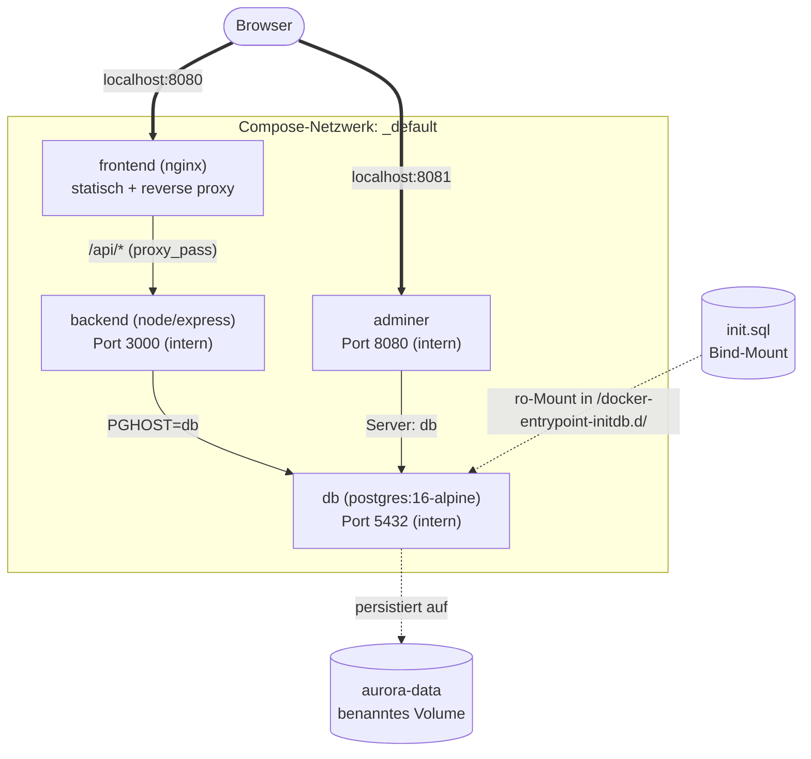

# Szenario: Mission Control der Aurora Station

!!! note "Hinweis"
    Die "Aurora Station" und ihr Mission-Control-Dashboard sind eine **fiktive Geschichte** – nur damit die Übung greifbarer wird. Das Setup, das ihr baut, ist aber sehr nahe an Setups aus echten Projekten.

Die **Aurora Station** kreist seit Jahren in einer niedrigen Erdumlaufbahn. Sie ist eine kleine, durchaus betagte Forschungsstation mit sechs Modulen: Lebenserhaltung, Energieverteilung, Kommunikation, Forschungslabor, Hydroponik, Andockschleuse.

Vom Boden aus überwacht das **Mission-Control-Dashboard** den Status jedes Moduls in Echtzeit. Vor zwei Wochen hat das alte Deployment einen Fehler im Storage-Subsystem gefunden und die Bodenstation musste alles abreißen. Übrig sind nur:

- der **Source Code** des Frontends, des Backends und der Datenbank-Initialisierung
- die **Dockerfiles** für Frontend und Backend
- die **Anforderung**, das Ganze diesmal **mit Docker Compose** wieder hochzuziehen

**Ihr seid das DevOps-Team der Bodenkontrolle.** 🚀

Die Schichtleitung erwartet: in 90 Minuten ist Mission Control wieder online, mit Persistenz, Healthcheck und sauberem `.env`-Setup. Und falls Zeit bleibt: einen kleinen Rollover auf das Backup-Backend, falls der Hauptdienst je ausfällt.

---

## Eure Mission

Bringt Mission Control wieder online – als deklarativen Compose-Stack, in 90 Minuten, im Team.

---

## Zielarchitektur

Am Ende laufen **vier Services** im selben Compose-Projekt:

| Service | Image / Build | Externer Port | Zweck |
|---|---|---:|---|
| `frontend` | `build: ./frontend` (Nginx-basiert) | `8080` | Dashboard im Browser, leitet `/api/*` an Backend |
| `backend` | `build: ./backend-node` | – (nur intern) | API für Module |
| `db` | `image: postgres:16-alpine` | – (nur intern) | Datenbank, mit Init-Skript |
| `adminer` | `image: adminer:latest` | `8081` | DB-Weboberfläche |

Außerdem braucht ihr:

| Ressource | Name | Zweck |
|---|---|---|
| Volume | `aurora-data` | Persistente DB-Daten |
| Bind-Mount | `./db/init.sql` | Tabelle anlegen + Beispiel-Module |
| `.env` | `.env` | Passwort, DB-Name, Ports |

---

## Architekturdiagramm

**Was das Diagramm zeigt:**

- Du als Nutzer (Browser) erreichst zwei Dinge: das **Frontend** auf `8080` und **Adminer** auf `8081`.
- Das Frontend (Nginx) reicht alle `/api/*`-Anfragen intern an den `backend`-Service weiter.
- Das Backend kennt die Datenbank über den Service-Namen `db`.
- Adminer kennt die Datenbank ebenfalls über `db`.
- Die DB-Daten liegen im benannten Volume `aurora-data` – auch nach `docker compose down` noch da.
- Das `init.sql` wird als Read-only-Bind-Mount in den DB-Container gemountet und beim allerersten Start ausgeführt.

---

## Die Module der Aurora Station

Wenn euer Stack steht, seht ihr im Frontend automatisch sechs Module aus dem Init-Skript:

| Modul | Initialer Status |
|---|---|
| Life Support (LS-01) | online |
| Power Grid (PG-02) | online |
| Comms Array (CA-03) | maintenance |
| Research Lab (RL-04) | offline |
| Hydroponics (HY-05) | critical |
| Docking Bay (DB-06) | online |

Status-Werte: `online`, `offline`, `critical`, `maintenance`.

Über das Dashboard könnt ihr neue Module anlegen, den Status bestehender ändern und Module löschen – alle Aktionen gehen über die API durch das Backend in die Datenbank.

---

## Wichtig

> Die Anwendung ist nur ein **Übungsobjekt**. Ihr müsst keinen Code schreiben. Euer Fokus liegt **auf Compose**.

---

## Weiter

- [Aufgabenübersicht](04-aufgabenuebersicht.md) – jetzt geht's los
- Falls ihr stockt: [Hilfekarten](05-hilfekarten.md)
