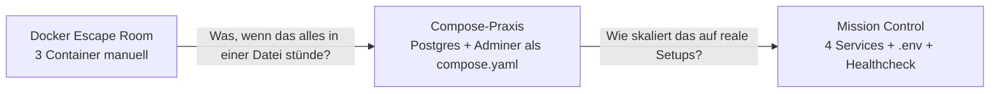

# Rückblick & Ausblick

In dieser Einheit habt ihr einen kompletten Multi-Container-Stack mit **einer einzigen `compose.yaml`** hochgezogen, mit `.env`, mit Healthcheck, mit Persistenz und (vielleicht) mit ausgetauschtem Backend.

Das ist genau das, was im echten Projektalltag bei vielen Teams den Unterschied macht zwischen "läuft auf meinem Rechner, sonst nirgends" und "läuft überall mit `docker compose up`".

---

## Der Bogen über drei Praxis-Blöcke

| Block | Was war neu |
|---|---|
| Docker Escape Room | Drei Container, ein Netzwerk, ein Volume – **alles per Hand** |
| Compose-Praxis | Genau dasselbe, aber als kleine `compose.yaml` |
| **Mission Control** | Vier Services, internes Routing, `.env`, Healthcheck, Persistenz, Bonus-Swap |

Wenn ihr von hier zurückguckt: ihr habt einen vollständigen Bogen geschafft, von "tipp jeden Befehl von Hand" bis "deklarativer Stack mit Konfigurations-Trennung und Healthcheck".

---

## Reflexion

Diskutiert kurz:

1. Wo war die Compose-Variante **deutlich angenehmer** als der Escape Room?
2. Wo war es **trotz** Compose noch knifflig (z.B. Healthcheck, Init-SQL)?
3. Welche **drei Compose-Bausteine** würdet ihr mitnehmen, wenn ihr morgen ein eigenes kleines Hobby-Projekt mit DB und Backend bauen würdet?

---

## Was Compose euch jetzt sicher abnimmt

| Bisher manuell | Jetzt deklarativ |
|---|---|
| Netzwerke per Hand erstellen | Default-Netzwerk pro Projekt, automatisch |
| Volumes per Hand erstellen | Top-Level `volumes:`-Block, automatisch |
| Reihenfolge merken (DB → Backend → Frontend) | `depends_on` mit `condition: service_healthy` |
| Container-Namen, Hostnames merken | Service-Name = Hostname |
| Konfiguration in 5 langen `docker run`-Befehlen verstecken | `.env` + `${VAR}` |
| Logs aus 4 Container-Logs zusammensuchen | `docker compose logs -f` |
| Stack mit `docker rm -f ...` abbauen | `docker compose down` |

---

## Was Compose euch (noch) **nicht** abnimmt

- **Image-Optimierung**: kleine, sichere, gut gecachte Images bauen → kommt im [Profi-Block](../docker-profi/index.md).
- **Mehrere Hosts**: Compose ist single-host. Sobald mehrere Maschinen im Spiel sind, geht's Richtung Swarm oder Kubernetes.
- **Secrets sauber managen**: `.env` ist gut für die Praxis, aber nicht für echte Geheimnisse in Produktion. Es gibt `secrets:`-Mechanismen in Compose und richtig sauber wird es mit Vault/Kubernetes-Secrets/Cloud-Secret-Managern.
- **Rolling Updates / Zero-Downtime-Deploys**: Compose stoppt und startet. Für unterbrechungsfreie Updates: Orchestrator.

Aber für **die meisten lokalen Entwickler-Setups, kleine Server-Stacks und Übungsumgebungen** ist Compose völlig ausreichend.

---

## Persönlicher Take-Away

Beim nächsten Projekt, wenn ihr in Versuchung kommt, alles "kurz mit `docker run`" zu testen:

> **Schreibt eine zehnzeilige `compose.yaml`. Auch wenn es nur ein einziger Service ist.**
>
> Beim zweiten Service in zwei Tagen werdet ihr es lieben.

---

## Was kommt als nächstes

- [Docker für Profis](../docker-profi/index.md) – Multi-Stage-Builds, schlanke Images, USER, HEALTHCHECK direkt im Dockerfile
- [Stolpersteine Compose](../docker-compose/stolpersteine.md) – Sammlung typischer Compose-Probleme, falls ihr in eigenen Projekten in einen davon lauft
- [Cheatsheet Compose](../cheatsheets/compose.md) – Tabelle mit allen Befehlen, zum schnellen Nachschlagen

---

## Merksatz

!!! success "Der Compose-Take-Away"
    > **Mit Compose beschreibt ihr den Zielzustand eures Stacks – Services, Volumes, Netzwerke, Abhängigkeiten – einmal in einer Datei. `docker compose up -d` bringt das System dorthin, `docker compose down` baut es ab. Der Rest sind Variationen über dasselbe Thema.**
