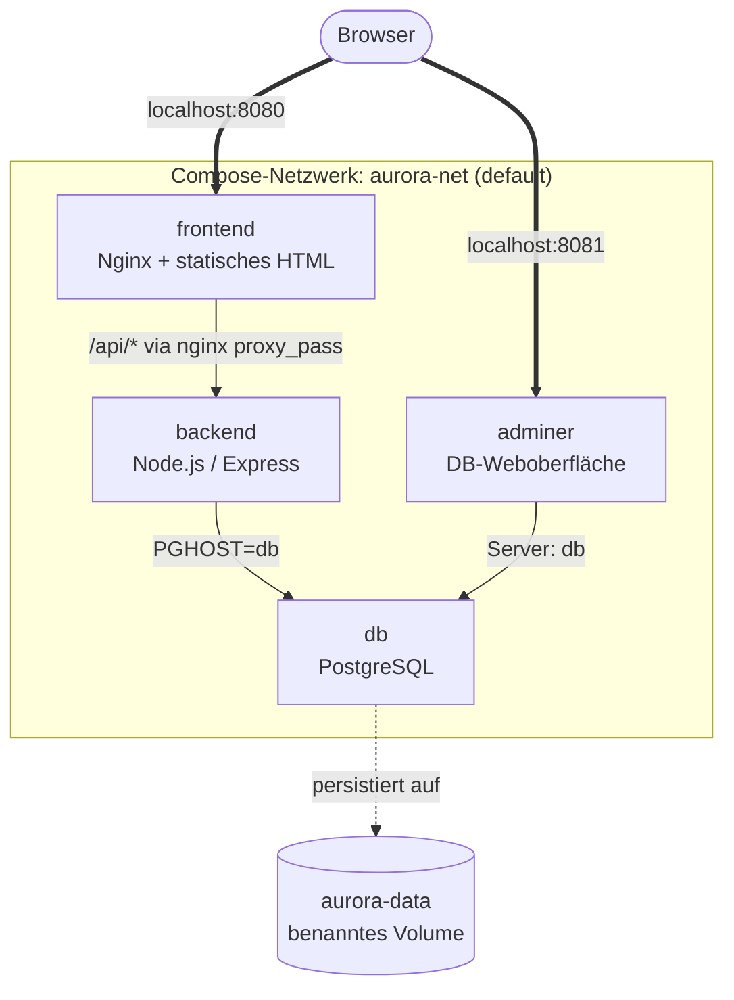

# Mission Control – Compose-Praxis

Willkommen zum **Compose-Praxis-Block**. 🛰️

Im [Docker Escape Room](../docker-escape-room/index.md) habt ihr einen Multi-Container-Stack **manuell** zusammengeschraubt – Netzwerk, Volume, Container für Container. Heute macht ihr es **richtig**: alles in einer einzigen `compose.yaml`, gestartet mit einem einzigen Befehl.

**In Gruppen, in 90 Minuten, mit Docker Compose.**

---

## Worum geht's

Ihr bringt eine kleine Mehr-Container-Anwendung zum Laufen: das **Mission-Control-Dashboard der Aurora Station**. Vier Dienste arbeiten zusammen:

- ein **Frontend** (Nginx, statisches HTML/CSS/JS)
- ein **Backend** (Node.js/Express – alternativ FastAPI als Bonus)
- eine **Datenbank** (PostgreSQL mit Init-Skript und Beispiel-Modulen)
- eine **Datenbank-Weboberfläche** (Adminer)

Ihr schreibt dafür eine **eigene `compose.yaml`** und nutzt die wichtigsten Compose-Bausteine:

- `services` mit `image` und `build`
- interne Kommunikation über Service-Namen als Hostname
- externe Ports vs. nur-interne Services
- `environment` mit `.env`-Datei
- benannte `volumes` für persistente Daten
- `depends_on` mit `condition: service_healthy`
- `healthcheck` für die Datenbank
- Logs lesen, Container in den Stack hineinschauen

!!! tip "Live-Status statt Browser-Refresh"
    Das Frontend ist als kleines **Mission-Control-Cockpit** gebaut: oben hat es vier **Status-Lampen** (Frontend, Backend, Datenbank, Adminer), die ihr Schritt für Schritt aufleuchten seht. Sobald ihr einen Service hinzufügt oder austauscht, ploppt oben rechts ein **Toast** auf („Backend ist online (node-express)") – kein manuelles Reload nötig. Auch beim Bonus-Tausch Node→FastAPI seht ihr live, wie das Frontend den neuen Implementierungs-Namen anzeigt.

!!! info "Code zur Aufgabe"
    Der Code für die Beispielanwendung liegt im Repository unter:

    [`apps/docker-compose-mission-control/`](https://github.com/JacobMenge/kurs-unterlagen/tree/main/apps/docker-compose-mission-control)

    Falls ihr lokal arbeitet, findet ihr den Ordner direkt im Projektverzeichnis.

    Ihr müsst den Code **nicht verändern** und auch **nicht vollständig verstehen**.

    Wichtig ist nur:

    - Frontend, Backend, Datenbank und Adminer laufen je in einem eigenen Container.
    - Frontend und Adminer sollen im Browser erreichbar sein, Backend und DB **nicht** nach außen.
    - Das Backend kennt die Datenbank über deren **Service-Namen** (`db`).
    - Das Frontend kennt das Backend ebenfalls über den Service-Namen (`backend`) – Nginx ist als Reverse-Proxy schon vorkonfiguriert.
    - Die Datenbank speichert ihre Daten in einem **benannten Volume**, damit ein `docker compose down` keine Einträge zerstört.

!!! warning "Heute nur Compose"
    In dieser Aufgabe baut ihr ausschließlich mit Compose. **Keine** einzelnen `docker run`-Befehle für die Services. Wenn ihr in Versuchung kommt: das war der Escape Room. Heute geht's um die deklarative Variante.

---

## Ziel-Architektur

Am Ende laufen **vier Services** im selben Compose-Projekt, plus ein Volume für die Datenbank:

| Service | Zweck |
|---|---|
| `frontend` | Nginx mit statischer Single-Page-App; reverse-proxypased `/api/*` → `backend:3000` |
| `backend` | Node.js/Express-API mit Endpunkten für Module |
| `db` | PostgreSQL mit Init-Skript für Tabelle `modules` |
| `adminer` | DB-Weboberfläche für Selbstkontrolle |

| Ressource | Name | Zweck |
|---|---|---|
| Compose-Netzwerk | `<projekt>_default` | Container-Kommunikation (von Compose automatisch erzeugt) |
| Volume | `aurora-data` | Persistente DB-Daten |

---

## Ablauf im Kurs

| Phase | Dauer |
|---|---:|
| Einstieg & Erklärung | 15 Min |
| Compose-Recap | 10–15 Min |
| **Gruppenarbeit (Missionen)** | **90 Min** |
| Gemeinsame Besprechung | 30 Min |
| Rückblick & Ausblick | 10 Min |

Insgesamt **rund 2:30 h**, davon 90 Minuten aktive Gruppenarbeit.

---

## Lese-Reihenfolge

Wenn ihr den Block linear durcharbeitet:

1. [Technologien kurz erklärt](00-technologien-kurz-erklaert.md) – was ist Nginx, was ist FastAPI, was ist `proxy_pass`?
2. [Compose-Recap](02-compose-recap.md) – die YAML-Bausteine, die ihr braucht
3. [Szenario](03-szenario.md) – die Story und die Ziel-Architektur
4. [Aufgabenübersicht](04-aufgabenuebersicht.md) – eure Missionen + Bonus
5. [Hilfekarten](05-hilfekarten.md) – nutzt sie nur, wenn ihr feststeckt
6. [Abgabe & Reflexion](06-abgabe-und-reflexion.md) – was am Ende vorgezeigt wird
7. [Lösung](07-loesung.md) – **erst nach der eigenen Arbeit aufschlagen!**
8. [Rückblick & Ausblick](08-rueckblick.md) – was habt ihr in den drei Praxis-Blöcken gelernt

---

## Was ihr nach dieser Einheit könnt

- Eine **eigene `compose.yaml`** für einen Vier-Service-Stack schreiben
- Externe Ports gezielt veröffentlichen und interne Services bewusst verbergen
- Service-Namen als **DNS-Hostnamen** zwischen Containern nutzen
- Konfiguration sauber in eine **`.env`-Datei** auslagern
- Mit `depends_on` + `healthcheck` echte Startreihenfolge erzwingen
- Den Stack mit einem Befehl hoch- und runterfahren – und nach einem Volume-Tausch sehen, **dass Daten persistent sind**
- Ein Backend gegen ein anderes austauschen, ohne dass Frontend oder DB davon etwas merken
