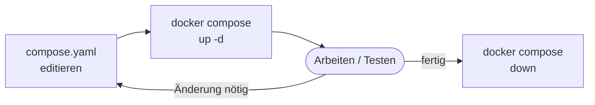

# Docker Compose – Einführung

!!! abstract "Lernziel"
    Nach dieser Seite kannst du:

    - erklären, **welches Problem Docker Compose löst**
    - den Unterschied zwischen **imperativ** (`docker run`) und **deklarativ** (`compose.yaml`) benennen
    - einen kleinen Zwei-Container-Stack in einer `compose.yaml` wiedererkennen
    - die Befehle `docker compose up`, `down`, `logs`, `ps` einordnen

---

## Der Auslöser: die vorige Einheit

In der [Praxis-Einheit aus Block 3](../docker-aufbau/praxis-multi-container.md) haben wir gemerkt: sobald mehr als ein Container im Spiel ist, wird es mit `docker run` **mühsam**. Für jede Umgebungs­variable, jedes Volume, jedes Netzwerk schreibst du ein eigenes Flag. Für jede Änderung den ganzen Befehl neu.

Die natürliche Frage:

> **Warum schreibe ich den Setup nicht einmal in eine Datei und sage Docker: „Mach das?"**

Genau das ist **Docker Compose**.

---

## Was ist Docker Compose?

Docker Compose ist ein **Werkzeug, das einen Stack aus mehreren Containern aus einer YAML-Datei startet und verwaltet**. Die Datei heißt per Konvention `compose.yaml` (älter: `docker-compose.yml`).

Statt mehrerer `docker run`-Befehle schreibst du **einmal** deinen Zielzustand:

```yaml
services:
  db:
    image: postgres:16
    environment:
      POSTGRES_PASSWORD: geheim
    volumes:
      - postgres-daten:/var/lib/postgresql/data

  app:
    build: .
    environment:
      DATABASE_URL: postgres://postgres:geheim@db:5432/postgres
    ports:
      - "8000:8000"
    depends_on:
      - db

volumes:
  postgres-daten:
```

Und startest das Ganze mit:

```bash
docker compose up -d
```

**Compose erledigt für dich automatisch:**

1. Netzwerk anlegen (mit einem sinnvollen Namen, passend zum Projekt­ordner).
2. Volume anlegen, falls nicht vorhanden.
3. Image bauen, falls `build:` angegeben.
4. DB-Container starten.
5. App-Container starten – wartet dank `depends_on`, bis die DB-Startzeile durch ist.
6. Hängt beide Container ins selbe Netzwerk, damit sie sich per Name finden.

Alles, was wir [in der manuellen Einheit](../docker-aufbau/praxis-multi-container.md) mit einer Handvoll `docker run`-Befehlen und Flags gebaut haben – in **einer** Datei.

---

## Imperativ vs. deklarativ

Das ist der eigentliche Gewinn.

| Imperativ (`docker run`) | Deklarativ (`docker compose up`) |
|---------------------------|-----------------------------------|
| Du beschreibst **Schritte**: „Erst Netzwerk anlegen, dann DB, dann App." | Du beschreibst **den Zielzustand**: „Ich will einen DB-Container UND einen App-Container, die so konfiguriert sind." |
| Reihenfolge ist deine Verantwortung. | Reihenfolge regelt Compose (inklusive `depends_on`). |
| Änderungen heißt: alles manuell stoppen, neu starten. | Änderungen in der YAML → `docker compose up -d` → Compose prüft und macht nur die nötigen Updates. |
| Du musst dir die Befehle merken oder ins README schreiben. | Die `compose.yaml` **ist** das Setup. Wer sie liest, versteht den Stack. |

In der IT nennt man diesen Unterschied **imperative** vs. **declarative configuration**. Er zieht sich durch viele moderne Tools: Terraform, Kubernetes, Ansible – alle arbeiten deklarativ. `compose.yaml` ist eine sanfte Einführung in diese Denkweise.

---

## Zwei historische Namen: „docker-compose" vs. „docker compose"

Du wirst auf beides stoßen, und der Unterschied ist wichtig:

| Variante | Implementation | Status |
|----------|----------------|--------|
| `docker-compose` (mit Bindestrich) | Python-Programm, separat installiert | **Veraltet** (Compose V1) – erhält seit 2023 keine Updates mehr |
| `docker compose` (mit Leerzeichen) | In Go geschrieben, als Docker-CLI-Plugin | **Aktuell** (Compose V2) – installiert sich mit Docker Desktop und modernen Docker-Engine-Paketen |

**Empfehlung für diesen Kurs und für alles, was du ab heute machst: `docker compose`** (mit Leerzeichen).

In alten Tutorials siehst du oft noch `docker-compose`. Fast immer funktioniert derselbe Befehl auch mit der neuen Variante.

??? info "Wie prüfe ich, ob ich Compose V2 habe?"
    ```bash
    docker compose version
    ```

    Sollte etwas wie `Docker Compose version v2.27.0` ausgeben.

    Falls `docker compose` nicht gefunden wird und `docker-compose` schon: du hast Compose V1. Gib `docker-compose --version` aus. In Docker Desktop sind beide meistens verfügbar.

---

## Die wichtigsten Compose-Befehle

```bash
# Stack starten (im Vordergrund)
docker compose up

# Stack starten und im Hintergrund halten
docker compose up -d

# Logs aller Services folgen
docker compose logs -f

# Nur einen Service starten / stoppen
docker compose up -d app
docker compose stop db

# Status aller Services im Stack
docker compose ps

# Alles stoppen und entfernen (Container + Netzwerk)
docker compose down

# Zusätzlich Volumes entfernen (ACHTUNG: Daten weg)
docker compose down -v

# Image neu bauen, wenn das Dockerfile sich geändert hat
docker compose build

# Stack neu starten (z.B. nach compose.yaml-Änderung)
docker compose up -d --build
```

**Wichtig zur Orientierung:** Compose-Befehle wirken **nur auf Container, die zu diesem Compose-Projekt gehören**. Andere Container auf deinem Host bleiben unberührt.

---

## Wie Compose Namen vergibt

Wenn du `docker compose up` im Ordner `kurs-multicontainer` aufrufst, erzeugt Compose:

- Container: `kurs-multicontainer-db-1`, `kurs-multicontainer-app-1`
- Netzwerk: `kurs-multicontainer_default`
- Volume: `kurs-multicontainer_postgres-daten`

Das Präfix `kurs-multicontainer` kommt vom **Projekt­namen**, der standardmäßig der Ordner­name ist.

??? info "Projektname fixieren"
    Wenn du willst, dass alle Container einen festen Präfix haben – unabhängig vom Ordner­namen:

    ```bash
    docker compose -p meinprojekt up -d
    ```

    Oder als Umgebungs­variable:
    ```bash
    export COMPOSE_PROJECT_NAME=meinprojekt
    docker compose up -d
    ```

---

## Wann Compose, wann nicht

### Compose glänzt bei

- **Mehr als einem Container**, die zusammen arbeiten (Web-App + DB + Cache + Proxy).
- **Entwicklungs­umgebungen**, die alle Teammitglieder gleich aufsetzen sollen (`git clone && docker compose up`).
- **Tests in CI/CD** – Stack hochfahren, Tests laufen lassen, Stack wieder abbauen.
- **Kleine Self-Hosting-Setups** (z.B. Nextcloud, WordPress, Grafana-Stacks zu Hause).

### Compose ist nicht das Richtige für

- **Einzelne Container** – da reicht `docker run`.
- **Mehrere Hosts** (Cluster-Betrieb) – dafür gibt es **Kubernetes** oder **Docker Swarm**.
- **Produktion mit mehreren Servern** – Compose ist ein Single-Host-Tool. Für Produktion mit Lastverteilung brauchst du mehr.

!!! tip "Faustregel"
    Wenn du dir die Frage stellst: „Soll ich ein Shell-Skript schreiben, das drei `docker run` nacheinander ausführt?" – die Antwort ist: **nimm Compose.**

---

## Ein Vorgeschmack: Der Stack aus der vorigen Einheit in Compose

In der manuellen Praxis hatten wir:

```bash
docker network create kurs-netz

docker run -d --name db --network kurs-netz \
  -v postgres-daten:/var/lib/postgresql/data \
  -e POSTGRES_USER=kurs \
  -e POSTGRES_PASSWORD=geheim \
  -e POSTGRES_DB=kursdaten \
  postgres:16

docker run -d --name app --network kurs-netz \
  -e DATABASE_URL=postgres://kurs:geheim@db:5432/kursdaten \
  -p 8000:8000 \
  kurs-app:1.0
```

Als `compose.yaml`:

```yaml
services:
  db:
    image: postgres:16
    environment:
      POSTGRES_USER: kurs
      POSTGRES_PASSWORD: geheim
      POSTGRES_DB: kursdaten
    volumes:
      - postgres-daten:/var/lib/postgresql/data

  app:
    build: .
    environment:
      DATABASE_URL: postgres://kurs:geheim@db:5432/kursdaten
    ports:
      - "8000:8000"
    depends_on:
      - db

volumes:
  postgres-daten:
```

Start mit einem Befehl:

```bash
docker compose up -d
```

Stopp und komplettes Aufräumen:

```bash
docker compose down
```

Das ist die ganze Compose-Magie. Die Syntax im Detail schauen wir uns auf der [nächsten Seite](grundlagen.md) an.

---

## Praktischer Arbeits­fluss mit Compose



- Du änderst die YAML-Datei.
- `docker compose up -d` bringt den Stack in den **beschriebenen** Zielzustand. Container, die schon passen, bleiben. Container, die sich geändert haben, werden neu erzeugt.
- Am Ende der Arbeit: `docker compose down`.

---

## Stolpersteine

??? danger "„no configuration file provided"-Fehler"
    **Ursache:** Compose findet keine `compose.yaml` oder `docker-compose.yml` im aktuellen Verzeichnis.

    **Lösung:**

    - Prüfen, ob die Datei wirklich im Ordner liegt: `ls -la | grep -i compose`.
    - Oder explizit angeben: `docker compose -f pfad/zu/compose.yaml up -d`.

??? warning "YAML-Fehler: „did not find expected ..."
    **Ursache:** YAML ist sehr penibel mit Einrückung. **Keine Tabs**, nur Leerzeichen. Gleiche Einrückungs­tiefe pro Hierarchie­ebene.

    **Lösung:**

    - `docker compose config` zeigt die YAML nach Parsing. Wenn Parser-Fehler kommen, zeigt er die Zeile.
    - In VSCode: die YAML-Extension nutzen, die farbliche Einrückungs­hilfe gibt.

??? warning "Ich habe `docker-compose.yml` mit Bindestrich – wird das noch gelesen?"
    Ja. Compose V2 liest beide Datei-Namen. Aber die **neue Konvention ist `compose.yaml`** ohne Bindestrich. Wenn du ein neues Projekt anfängst, nimm den neuen Namen.

??? info "Mehrere Compose-Dateien kombinieren"
    Du kannst `-f` mehrfach angeben und Dateien überlagern:
    ```bash
    docker compose -f compose.yaml -f compose.override.yaml up -d
    ```

    Typisches Muster: `compose.yaml` hat den Basis-Stack, `compose.override.yaml` überschreibt Werte für lokale Entwicklung (z.B. aktiviert Live-Reload).

    Wenn keine `-f`-Option angegeben wird, lädt Compose automatisch `compose.yaml` und – falls vorhanden – `compose.override.yaml`.

---

## Was du jetzt wissen solltest

- **Compose ist das deklarative Gegenstück** zu `docker run`.
- `compose.yaml` beschreibt einen Stack aus mehreren Services.
- `docker compose up -d` startet ihn, `docker compose down` baut ihn ab.
- Compose ist ein **Single-Host-Tool**. Für mehrere Hosts brauchst du Kubernetes oder Swarm.
- **`docker compose` (mit Leerzeichen)** ist der aktuelle Weg. `docker-compose` ist Compose V1 und veraltet.

---

## Merksatz

!!! success "Merksatz"
    > **Wenn du mehr als einen Container willst, schreib eine `compose.yaml`. Imperative Befehle sind für Experimente, deklarative Konfiguration ist für ernsthafte Arbeit.**

---

## Weiterlesen

- [Compose – Grundlagen](grundlagen.md) – jetzt die Syntax im Detail
- [Praxis: Compose-WebApp](praxis-webapp.md) – der Stack aus der manuellen Praxis, jetzt sauber mit Compose
