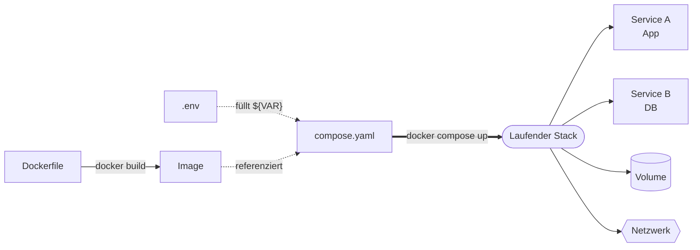

# Merksätze – Docker Compose (Block 4)

---

## 1. Imperativ vs. deklarativ

!!! success "Merksatz 1"
    > **`docker run` ist imperativ (Schritte beschreiben). Compose ist deklarativ (Zielzustand beschreiben). Ab mehr als einem Container immer Compose.**

Das ist der wichtigste konzeptuelle Sprung in diesem Block.

---

## 2. Compose in einem Satz

!!! success "Merksatz 2"
    > **Die `compose.yaml` beschreibt `services`, `volumes` und `networks`. `docker compose up -d` bringt den Stack in diesen Zielzustand, `docker compose down` baut ihn ab.**

Für den Einstieg reichen `services`, `volumes`, `depends_on`, `healthcheck`, `environment` und `ports`.

---

## 3. `depends_on` reicht allein nicht

!!! success "Merksatz 3"
    > **`depends_on: service` wartet nur auf den Container-START, nicht auf die BEREITSCHAFT des Dienstes. Für echtes „warte bis DB bereit" brauchst du `depends_on: condition: service_healthy` plus Healthcheck im Zielservice.**

Plus: App sollte Retry-Logik haben. Produktion ist nicht immer freundlich.

---

## 4. Netzwerk und DNS

!!! success "Merksatz 4"
    > **Compose legt ein Default-Netzwerk an, in dem alle Services über ihren Service-Namen erreichbar sind. Du brauchst keine `networks:`-Blöcke, wenn dir das reicht.**

---

## 5. .env richtig nutzen

!!! success "Merksatz 5"
    > **Compose liest automatisch `.env` aus dem gleichen Ordner. Werte daraus werden in `${VARIABLE}`-Stellen in der `compose.yaml` eingesetzt. Secrets gehören in `.env`, und `.env` gehört in `.gitignore`.**

---

## 6. Die wichtigsten Befehle

!!! success "Merksatz 6"
    > **`up -d`, `down`, `logs -f`, `ps`, `exec service bash` – mit diesen fünf Befehlen hast du 90 % deines Compose-Alltags abgedeckt.**

---

## 7. V2 statt V1

!!! success "Merksatz 7"
    > **Immer `docker compose` (mit Leerzeichen). Das alte `docker-compose` (mit Bindestrich) ist Compose V1 und veraltet.**

---

## Das große Bild

---

## Ausblick

Was jetzt noch offen ist:

- **Images richtig bauen**: Multi-Stage, Layer-Caching, USER – kommt im [Profi-Block](../docker-profi/index.md).
- **Mehrere Hosts**: Swarm oder Kubernetes – eigene Einheit.
- **CI/CD-Integration**: Images in GitHub Actions bauen und pushen.

Aber ein kompletter Compose-Stack läuft. Das ist **sehr** viel wert.
