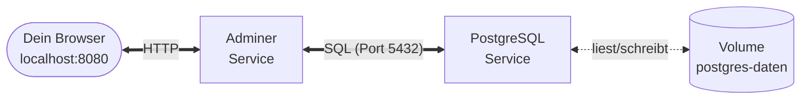

# Praxis: erste compose.yaml

!!! abstract "Ziel"
    In **45 Minuten** baust du den Postgres + Adminer-Stack aus dem Aufbau-Block nach – diesmal **nicht** mit fünf `docker run`-Befehlen, sondern mit **einer einzigen `compose.yaml`**.

    Am Ende kannst du:

    - eine simple `compose.yaml` mit zwei Services lesen und schreiben
    - einen Stack mit `docker compose up -d` starten und mit `docker compose down` abbauen
    - Status, Logs und Container-Shells über Compose-Befehle erreichen
    - die Persistenz eines benannten Volumes nachvollziehen

!!! info "Anknüpfung an den Aufbau-Block"
    Im [Aufbau-Block](../docker-aufbau/praxis-multi-container.md) hast du Postgres + Adminer **manuell** zusammengeschraubt: Netzwerk anlegen, Volume anlegen, beide Container mit vielen Flags starten. Jetzt übersetzen wir genau diesen Stack in eine deklarative Compose-Datei. Du brauchst **kein eigenes Dockerfile**, **keinen Build**, **keine Programmierung** – nur fertige Images und eine kleine YAML-Datei.

## Voraussetzungen

- Docker und `docker compose` laufen (`docker compose version` klappt). Siehe [Installation](../docker/installation.md).
- Ein Editor (VSCode, Notepad++, vim, was du magst).
- Ca. **45 Minuten** Zeit.
- Falls aus dem Aufbau-Block noch Container laufen, einmal aufräumen:

    === "macOS / Linux"
        ```bash
        docker stop adminer db 2>/dev/null
        docker rm   adminer db 2>/dev/null
        docker network rm kurs-netz 2>/dev/null
        ```

    === "Windows PowerShell"
        ```powershell
        docker stop adminer db 2>$null
        docker rm   adminer db 2>$null
        docker network rm kurs-netz 2>$null
        ```

    === "Windows CMD"
        ```cmd
        docker stop adminer db 2>nul
        docker rm adminer db 2>nul
        docker network rm kurs-netz 2>nul
        ```

    (Fehler „No such container" sind okay – heißt nur, dass nichts aufzuräumen war.)

---

## Was wir bauen



**Zwei Services, ein Volume, eine `compose.yaml`** – mehr nicht.

---

## Schritt 1 – Projektordner anlegen

Wir starten in einem frischen Ordner:

=== "macOS / Linux"
    ```bash
    mkdir -p ~/kurs-compose
    cd ~/kurs-compose
    ```

=== "Windows PowerShell"
    ```powershell
    mkdir $HOME\kurs-compose
    cd $HOME\kurs-compose
    ```

=== "Windows CMD"
    ```cmd
    mkdir %USERPROFILE%\kurs-compose
    cd %USERPROFILE%\kurs-compose
    ```

---

## Schritt 2 – `compose.yaml` schreiben

Lege im aktuellen Ordner eine Datei namens **`compose.yaml`** an (genau so geschrieben, ohne Bindestrich, mit `.yaml`-Endung). Inhalt:

```yaml
services:

  db:
    image: postgres:16
    environment:
      POSTGRES_USER: kurs
      POSTGRES_PASSWORD: geheim
      POSTGRES_DB: kursdaten
    volumes:
      - postgres-daten:/var/lib/postgresql/data

  adminer:
    image: adminer
    ports:
      - "8080:8080"

volumes:
  postgres-daten:
```

Lass uns das **Zeile für Zeile** durchgehen:

| Block | Bedeutung |
|-------|-----------|
| `services:` | Top-Level – hier listest du deine Container auf |
| `db:` | Service-Name (du wählst ihn frei). Gleichzeitig der **DNS-Name**, unter dem andere Services ihn finden |
| `image: postgres:16` | offizielles Postgres-Image, Version 16 (kein eigenes Dockerfile nötig) |
| `environment:` | drei ENV-Variablen, die Postgres beim ersten Start auswertet (User, Passwort, DB) |
| `volumes:` *(unter `db`)* | benanntes Volume `postgres-daten` ins Datenverzeichnis von Postgres mounten |
| `adminer:` | zweiter Service mit dem `adminer`-Image |
| `ports:` | Host-Port `8080` → Container-Port `8080` (Adminer-Default) |
| `volumes:` *(Top-Level)* | das benannte Volume `postgres-daten` deklarieren, damit Compose es kennt und verwaltet |

!!! warning "YAML ist pingelig"
    YAML erlaubt **keine Tabs** für Einrückung – nur **Leerzeichen**. Pro Ebene **2 Leerzeichen**. Wenn dein Editor Tabs einfügt, schalte das auf „Leerzeichen statt Tabs" um. Ein moderner Editor mit YAML-Highlighting (z.B. VSCode) zeigt Einrückungsfehler farbig an.

!!! tip "Kein `ports:` bei der DB?"
    Stimmt – Absicht. Adminer findet die Datenbank **innerhalb des Compose-Netzwerks** über den Service-Namen `db`. Nach außen (auf den Host) muss Postgres nicht erreichbar sein, also auch kein Port-Mapping. **Weniger Ports = weniger Angriffsfläche.**

---

## Schritt 3 – Stack starten

Ein einziger Befehl:

```bash
docker compose up -d
```

Was Compose jetzt automatisch macht:

1. liest die `compose.yaml`
2. legt ein **Netzwerk** `kurs-compose_default` an
3. legt das **Volume** `kurs-compose_postgres-daten` an (falls noch nicht vorhanden)
4. zieht die Images `postgres:16` und `adminer` (falls noch nicht lokal)
5. startet beide Container im selben Netzwerk
6. gibt dir die Kontrolle zurück (dank `-d` = detached)

Beim ersten Mal dauert der Pull der Images ein paar Sekunden – beim zweiten Aufruf geht alles in Sekundenbruchteilen.

---

## Schritt 4 – Status prüfen

```bash
docker compose ps
```

Erwartete Ausgabe (gekürzt):

```text
NAME                       IMAGE           STATUS         PORTS
kurs-compose-adminer-1     adminer         Up 5 seconds   0.0.0.0:8080->8080/tcp
kurs-compose-db-1          postgres:16     Up 5 seconds   5432/tcp
```

Beide Services laufen. Kein `kurs-netz` mehr von Hand anlegen, kein `--network`-Flag im `docker run`, keine vergessenen ENV-Variablen.

---

## Schritt 5 – Adminer im Browser öffnen

<http://localhost:8080>

Die Login-Maske erscheint. Felder ausfüllen:

| Feld | Wert |
|------|------|
| **System** | PostgreSQL |
| **Server** | `db` |
| **Benutzer** | `kurs` |
| **Passwort** | `geheim` |
| **Datenbank** | `kursdaten` |

Klick auf **Anmelden**.

!!! tip "Wichtig: Server = `db`"
    Im Server-Feld steht **`db`** – der **Service-Name** aus der `compose.yaml`. Compose hat dafür automatisch einen DNS-Eintrag im internen Netzwerk angelegt. Kein `localhost`, kein `127.0.0.1`, keine IP.

Wenn der Login klappt, landest du im Adminer-Dashboard mit der leeren Datenbank `kursdaten`. **Das ist der Beweis, dass beide Services miteinander reden** – ohne dass du irgendwo eine IP eingetragen hättest.

---

## Schritt 6 – Eine Tabelle anlegen

In Adminer oben auf **SQL-Kommando** klicken und folgenden Code eintragen:

```sql
CREATE TABLE teilnehmer (
  id SERIAL PRIMARY KEY,
  name TEXT,
  hobby TEXT
);

INSERT INTO teilnehmer (name, hobby) VALUES
  ('Anna', 'Klettern'),
  ('Ben', 'Kochen'),
  ('Carla', 'Segeln');
```

**Ausführen** klicken. Links erscheint die Tabelle `teilnehmer`. Klick drauf → **Auswählen** → du siehst die drei Datensätze.

---

## Schritt 7 – Logs schauen

In einem zweiten Terminal (oder neben dem Browser):

```bash
docker compose logs -f
```

`-f` bedeutet „follow" – live mitlesen. Du siehst die Logs **beider** Services farbig nebeneinander. `Ctrl+C` beendet nur das Mitlesen, nicht die Container.

Nur die Logs von einem Service:

```bash
docker compose logs -f db
```

Nur die letzten 20 Zeilen von Adminer:

```bash
docker compose logs --tail 20 adminer
```

---

## Schritt 8 – In einen Container reinspringen

Direkt eine Postgres-Shell öffnen:

```bash
docker compose exec db psql -U kurs -d kursdaten
```

Im `psql`-Prompt:

```sql
SELECT * FROM teilnehmer;
\q
```

`\q` verlässt `psql`.

Du kannst auch eine simple Shell im Adminer-Container öffnen:

```bash
docker compose exec adminer sh
```

`exit` bringt dich zurück.

---

## Schritt 9 – Persistenz-Test

Jetzt der spannende Teil. Wir werfen **die Container** weg – aber **nicht das Volume**:

```bash
docker compose down
```

Was jetzt weg ist:

- beide Container
- das `kurs-compose_default`-Netzwerk

Was **noch da ist**:

```bash
docker compose ps        # leer
docker volume ls         # postgres-daten ist noch da!
```

Jetzt einfach wieder hochfahren:

```bash
docker compose up -d
```

Browser neu laden, in Adminer einloggen – die **Tabelle `teilnehmer` ist noch da**, mit allen drei Datensätzen.

!!! success "Das ist der Persistenz-Beweis"
    Container sind neu, Volume ist dasselbe. Genau wie beim manuellen Setup – nur dass du diesmal nicht zwei lange `docker run`-Befehle tippen musstest, sondern nur **einen** `docker compose up -d`.

---

## Schritt 10 – Aufräumen

Wenn du alles loswerden willst (inkl. der Daten):

```bash
docker compose down -v
```

Das `-v` löscht auch das benannte Volume. Danach ist wirklich nichts mehr von diesem Stack übrig.

!!! danger "`-v` ist endgültig"
    Volumes weg = Daten weg. Im Alltag immer überlegen, ob du wirklich `-v` brauchst. Für unseren Übungs-Stack ist das okay – in Produktion oft fatal.

---

## Vergleich: manuell vs. Compose

Was du beim manuellen Setup noch von Hand getippt hast – und wie viel Compose dir abnimmt:

| Schritt | Manuell (`docker run`) | Compose |
|---------|-----------------------|---------|
| Netzwerk anlegen | `docker network create kurs-netz` | automatisch |
| Volume anlegen | `docker volume create postgres-daten` | automatisch |
| DB starten | `docker run -d --name db --network … -v … -e … -e … -e … postgres:16` | in `compose.yaml` deklariert |
| Adminer starten | `docker run -d --name adminer --network … -p … adminer` | in `compose.yaml` deklariert |
| **Starten gesamt** | **3 Befehle** + Reihenfolge merken | **1 Befehl** |
| Status prüfen | `docker ps`, manuell filtern | `docker compose ps` |
| Logs lesen | `docker logs db`, `docker logs adminer` einzeln | `docker compose logs -f` für alles auf einmal |
| Aufräumen | `docker stop`, `docker rm`, `docker network rm` | `docker compose down` |
| Setup für Team teilen | Shell-Skript oder lange README | `compose.yaml` einchecken |

Der Unterschied ist nicht nur **weniger tippen**. Es ist **eine andere Art zu denken**:

- Beim manuellen Ansatz denkst du **in Schritten** („zuerst dies, dann jenes").
- Mit Compose denkst du **in Zuständen** („das soll am Ende laufen").

Das ist genau der Sprung von **imperativer** zu **deklarativer** Konfiguration. Spätere Tools (Kubernetes, Terraform, Ansible) funktionieren genauso – Compose ist deine sanfte Einführung.

---

## Typische Stolpersteine in dieser Übung

??? warning "Port 8080 ist belegt"
    **Symptom:** `docker compose up -d` bricht ab mit „bind: address already in use".

    **Lösungen:**

    1. Anderen Host-Port wählen, z.B. `"8081:8080"` in der `compose.yaml`.
    2. Den Blockierer finden:

        === "macOS / Linux"
            ```bash
            lsof -i :8080
            ```

        === "Windows PowerShell"
            ```powershell
            netstat -ano | Select-String ":8080"
            ```

        === "Windows CMD"
            ```cmd
            netstat -ano | findstr :8080
            ```

??? warning "Adminer-Login: „could not translate host name 'db'"
    **Ursache:** Etwas stimmt am Compose-Setup nicht – meist ein YAML-Einrückungsfehler, sodass `adminer` und `db` nicht im selben Netzwerk gelandet sind.

    **Diagnose:**

    ```bash
    docker compose config
    ```

    Compose zeigt dir die fertig geparste YAML. Wenn da Einrückungsmüll ist, fällt es hier auf.

??? warning "YAML-Fehler: „did not find expected ..."
    **Ursache:** Tabs statt Leerzeichen, oder ungleichmäßige Einrückung.

    **Lösung:** Editor auf „Leerzeichen statt Tabs" stellen, alle Einrückungen mit **2 Leerzeichen** pro Ebene neu setzen. `docker compose config` zeigt die genaue Zeile mit dem Fehler.

??? danger "`docker compose down -v` aus Versehen ausgeführt"
    Volumes sind weg, Daten sind weg. Es gibt keinen Undo. Im Alltag also: **erst denken, dann `-v`**.

---

## Was du jetzt kannst

- eine `compose.yaml` mit zwei Services schreiben
- den Stack mit `up -d` starten und mit `down` abbauen
- Status, Logs und Container-Shells über Compose-Befehle abrufen
- die Persistenz eines benannten Volumes überprüfen
- den konzeptuellen Unterschied „imperativ vs. deklarativ" praktisch erleben

---

## Nächste Schritte

In den [Übungen](uebungen.md) findest du vier weitere Aufgaben mit aufsteigender Schwierigkeit:

- 🟢 **Übung 1** – noch kompakter: nur ein nginx-Service
- 🟢 **Übung 2** – zwei Services und Service-zu-Service-Kommunikation
- 🟡 **Übung 3** – WordPress + MariaDB
- 🟡 **Übung 4** – Variablen aus `.env` ziehen
- 🔴 **Übung 5** – Healthchecks und `depends_on: condition: service_healthy`
- 🏆 **Challenge** – vollständiger Tech-Stack mit vier Services, Bind Mount und Healthchecks

---

## Merksatz

!!! success "Merksatz"
    > **Was zuvor mehrere `docker run`-Befehle mit vielen Flags brauchte, steht jetzt in einer kleinen YAML-Datei. `docker compose up -d` startet den Stack, `docker compose down` baut ihn ab. Das benannte Volume sorgt dafür, dass die Datenbank über `down`/`up`-Zyklen hinweg ihre Daten behält.**

---

## Weiterlesen

- [Übungen](uebungen.md) – vier Schwierigkeitsgrade zum Selbermachen
- [Stolpersteine](stolpersteine.md) – wenn etwas hakt
- [Cheatsheet Compose](../cheatsheets/compose.md) – alle Befehle und YAML-Snippets auf einer Seite
