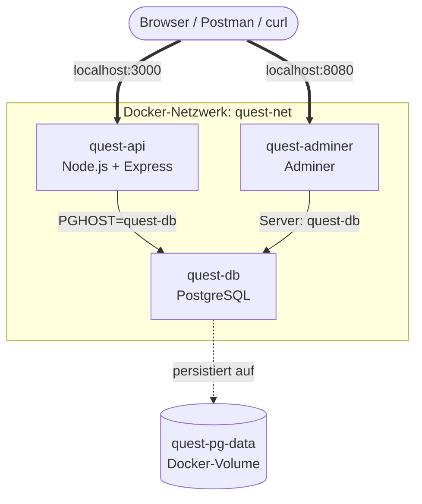

# Szenario: Die Container Quest GmbH braucht euch

Die **Container Quest GmbH** betreibt eine kleine interne Plattform für Team-Challenges. Kurz vor einer wichtigen Demo funktioniert plötzlich nichts mehr:

- Die API ist nicht erreichbar.
- Die Datenbank ist nicht verbunden.
- Die Daten sollen dauerhaft gespeichert werden.
- Eine Admin-Oberfläche soll Zugriff auf die Datenbank bekommen.
- Docker Compose darf **noch nicht** verwendet werden.

**Ihr seid das DevOps-Rettungsteam.** 🚨

---

## Eure Mission

Bringt die Plattform wieder online – mit reinen Docker-Befehlen, in 90 Minuten, im Team.

---

## Zielarchitektur

Am Ende sollen **drei Container** laufen:

| Dienst | Containername | Zweck |
|---|---|---|
| PostgreSQL | `quest-db` | Datenbank |
| API | `quest-api` | Anwendung |
| Adminer | `quest-adminer` | Datenbank-Weboberfläche |

Außerdem braucht ihr:

| Ressource | Name | Zweck |
|---|---|---|
| Docker-Netzwerk | `quest-net` | Container-Kommunikation |
| Docker-Volume | `quest-pg-data` | Persistente Datenbankdaten |

---

## Architekturdiagramm

**Was das Diagramm zeigt:**

- Du als Nutzer (Browser) erreichst zwei Dinge: die API auf Port 3000 und Adminer auf Port 8080.
- Die API spricht intern (im Docker-Netz) mit der Datenbank über den Hostnamen `quest-db`.
- Adminer spricht ebenfalls über `quest-db` mit der Datenbank.
- Die Datenbank speichert ihre Daten **nicht im Container**, sondern in einem **Docker-Volume** (`quest-pg-data`). Dadurch überleben die Daten einen Container-Restart.

---

## Wichtig

> Die Anwendung ist nur ein **Übungsobjekt**. Ihr müsst keinen Code schreiben. Euer Fokus liegt **auf Docker**.

---

## Weiter

- [Aufgabenübersicht](04-aufgabenuebersicht.md) – jetzt geht's los
- Falls ihr stockt: [Hilfekarten](05-hilfekarten.md)
