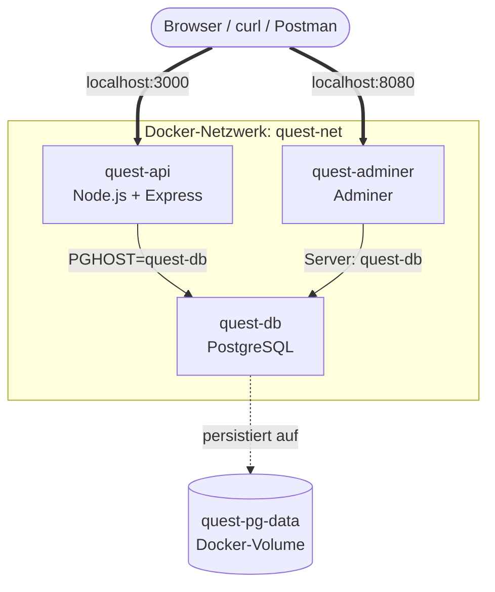

# Docker Escape Room

Willkommen zur **Docker-Praxis-Wiederholung**.

Bevor wir uns dem nächsten großen Werkzeug widmen – **Docker Compose** – wendet ihr in dieser Einheit alles an, was ihr bisher über Docker gelernt habt. **In Gruppen, in 90 Minuten, ohne Compose.**

---

## Worum geht's

Ihr bringt eine kleine Mehr-Container-Plattform zum Laufen. Drei Dienste arbeiten zusammen:

- eine **API** (kleine Webanwendung)
- eine **Datenbank** (PostgreSQL)
- eine **Datenbank-Weboberfläche** (Adminer)

Dabei nutzt ihr bewusst **kein Docker Compose**. Stattdessen alle einzelnen Bausteine:

- Images bauen
- Container starten
- Ports veröffentlichen
- Container benennen
- Umgebungs­variablen setzen
- Docker-Netzwerke verwenden
- Docker-Volumes verwenden
- Logs lesen
- Fehler analysieren

!!! info "Code zur Aufgabe"
    Der Code für die Beispielanwendung liegt im Repository unter:

    [`apps/docker-escape-room/`](https://github.com/JacobMenge/kurs-unterlagen/tree/main/apps/docker-escape-room)

    Falls ihr lokal arbeitet, findet ihr den Ordner direkt im Projekt­verzeichnis. Die Anwendung ist bewusst sehr einfach gehalten und dient **nur als Testobjekt für Docker**.

    Ihr müsst den Code **nicht verändern** und auch **nicht vollständig verstehen**.

    Wichtig ist nur:

    - Die API läuft später in einem eigenen Container.
    - Die Datenbank läuft in einem eigenen Container.
    - Beide Container müssen im **gleichen Docker-Netzwerk** sein.
    - Die Datenbankdaten sollen über ein **Docker-Volume** erhalten bleiben.
    - Die API bekommt die Verbindungsdaten zur Datenbank über **Umgebungs­variablen**.

!!! warning "Kein Docker Compose"
    In dieser Aufgabe ist Docker Compose noch **nicht erlaubt**.

    Nicht verwenden:
    ```bash
    docker compose up
    docker-compose up
    ```

    Compose ist das Thema der nächsten Einheit. Heute spürt ihr, **warum** Compose erfunden wurde – indem ihr alles manuell macht.

---

## Ziel-Architektur

Am Ende laufen **drei Container** im selben Docker-Netzwerk, plus ein Volume für die Datenbank:



| Dienst | Containername | Zweck |
|---|---|---|
| PostgreSQL | `quest-db` | Datenbank |
| API | `quest-api` | Beispielanwendung |
| Adminer | `quest-adminer` | Datenbank-Weboberfläche |

| Ressource | Name | Zweck |
|---|---|---|
| Docker-Netzwerk | `quest-net` | Kommunikation zwischen Containern |
| Docker-Volume | `quest-pg-data` | Persistente Datenbankdaten |

---

## Ablauf im Kurs

| Phase | Dauer |
|---|---:|
| Einstieg & Erklärung | 15 Min |
| Docker-Recap | 20–30 Min |
| **Gruppenarbeit** | **90 Min** |
| Gemeinsame Besprechung | 30–45 Min |
| Übergang zu Compose | 10–15 Min |

Damit kommt ihr auf **rund 2:30 h Gesamteinheit** mit aktiven 90 Minuten Gruppenarbeit.

---

## Lese-Reihenfolge

Wenn du den Block linear durcharbeitest:

1. [Technologien kurz erklärt](00-technologien-kurz-erklaert.md) – was ist Express, was ist PostgreSQL, was ist Adminer? (5 Minuten lesen, dann weiter)
2. [Docker-Recap](02-docker-recap.md) – die Befehle, die ihr braucht
3. [Szenario](03-szenario.md) – die Story und die Zielarchitektur
4. [Aufgaben­übersicht](04-aufgabenuebersicht.md) – eure 10 Aufgaben + Bonus
5. [Hilfekarten](05-hilfekarten.md) – nutzt sie nur, wenn ihr feststeckt
6. [Abgabe & Reflexion](06-abgabe-und-reflexion.md) – was am Ende vorgezeigt wird
7. [Trainer-Lösung](07-trainer-loesung.md) – **erst nach der Gruppenarbeit aufschlagen!**
8. [Übergang zu Compose](08-uebergang-zu-compose.md) – Brücke zur nächsten Einheit

[Trainer-Guide](01-trainer-guide.md) ist nur für die Kursleitung relevant.

---

## Was ihr nach dieser Einheit könnt

- Ein Multi-Container-Setup **manuell** mit reinen Docker-Befehlen aufbauen
- Container über ein **eigenes Netzwerk** miteinander reden lassen
- **Volume-Persistenz** in der Praxis erleben
- Typische Fehler **systematisch debuggen** (Logs, `inspect`, Netzwerk prüfen)
- Mit Selbst­überzeugung sagen können: **„Ja, das geht ohne Compose – aber Compose nimmt mir genau diese Schritte ab."**
