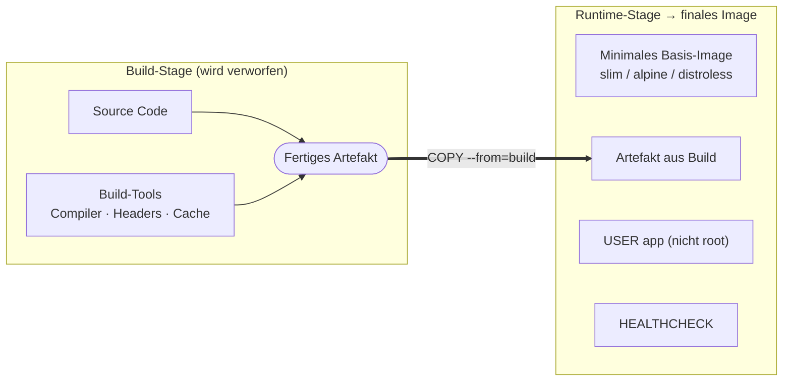

# Merksätze – Docker für Profis (Block 5)

---

## 1. Dockerfile-Best-Practices in einem Satz

!!! success "Merksatz 1"
    > **Multi-Stage für kleine Images. `USER` für weniger Angriffsfläche. Layer-Caching für schnelle Builds. `HEALTHCHECK`, damit Docker weiß, ob's läuft. Exec-Form bei CMD, damit Signale ankommen.**

---

## 2. Layer-Caching

!!! success "Merksatz 2"
    > **Selten Geändertes nach oben, oft Geändertes nach unten. `COPY requirements.txt` vor `COPY .` – so bleibt der teure `pip install`-Layer gecached.**

---

## 3. Multi-Stage-Builds

!!! success "Merksatz 3"
    > **Was zum Bauen, aber nicht zur Laufzeit nötig ist, gehört nicht ins finale Image. Build-Tools in Stage 1, nur das Ergebnis in Stage 2.**

Gewinn: Faktor 5–10 kleinere Images, ohne Komfortverlust.

---

## 4. USER

!!! success "Merksatz 4"
    > **Container als root laufen zu lassen ist Standard – aber nicht gut. Ein eigener User und `USER app` im Dockerfile reduziert Angriffsfläche deutlich.**

Kommt mit Kosten: Ports < 1024 gehen nicht mehr direkt, Volume-Permissions müssen stimmen. Für Produktion trotzdem Pflicht.

---

## 5. Basis-Image-Auswahl

!!! success "Merksatz 5"
    > **`-slim` ist die Standard-Wahl für Python/Node. `-alpine` lohnt nur, wenn deine Abhängigkeiten mitspielen. Distroless ist für kompilierte Sprachen (Go, Rust) die eleganteste Lösung.**

---

## 6. CMD vs. ENTRYPOINT

!!! success "Merksatz 6"
    > **`CMD` = Default-Befehl, wird beim `docker run image arg` durch `arg` ersetzt. `ENTRYPOINT` = fester Befehl, Argumente werden drangehängt. Für die meisten Anwendungen reicht `CMD`.**

Immer **Exec-Form** (JSON-Array), nie Shell-Form – wegen Signal-Handling.

---

## 7. Security-Baseline

!!! success "Merksatz 7"
    > **Keine Secrets ins Image. Nicht als root laufen. Schlankes Basis-Image. Apt-Cache wegräumen. Regelmäßig mit Trivy oder Grype scannen. Explizite Image-Versionen in Produktion.**

---

## 8. Der Gesamt-Satz

!!! success "Merksatz 8"
    > **Ein Produktionsimage ist klein (< 200 MB wenn möglich), läuft nicht als root, hat keine Secrets, eine fixierte Version und wird regelmäßig gescannt.**

---

## Das große Bild

Das ist das **Produktionsimage-Muster**. Alles, was du heute gelernt hast, ist entweder im Build-Teil (Caching, Multi-Stage) oder im Runtime-Teil (USER, HEALTHCHECK, schlankes Basis-Image).

---

## Ausblick – was kommt danach

Wenn dieser Block sicher sitzt:

- **CI/CD-Integration**: GitHub Actions baut und scannt Images automatisch.
- **Signierung & SBOMs**: Wer hat das Image gebaut, was ist drin?
- **Image-Registry-Strategie**: wohin pushen, wie versionieren?
- **Orchestrierung**: Kubernetes nutzt genau diese Produktions-Images.

Aber ein sauber gebautes Image ist die Grundlage für **alles**, was danach kommt. Das ist dein wichtigstes Tool für Produktion.
