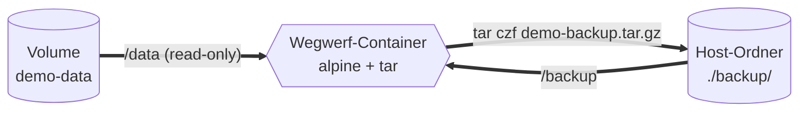

# Übung 2 – Volume-Backup und Restore

!!! abstract "Was du in dieser Übung lernst"
    - Wie du **Daten aus einem Volume herausholst**, ohne sie zu kopieren
    - Wie du ein **Backup zurückspielst**, nachdem das Volume weg ist
    - Warum der Wegwerf-Container­-Trick (`docker run --rm`) die saubere Lösung ist
    - Was passiert, wenn du das Volume aus Versehen löschst

**Aufwand:** ca. 20 Minuten.

---

## Worum geht's

Daten in einem Docker-Volume liegen außerhalb des Containers, **in einem von Docker verwalteten Bereich** auf der Host-Disk. Du kannst dort nicht direkt mit `cp` rangehen, weil Docker den Pfad nicht für dich exponiert (auf Mac/Windows steckt das Volume sogar in einer VM, nicht im Host-Dateisystem).

Die saubere Lösung ist ein **Wegwerf-Container**, der zwei Dinge gleichzeitig mountet:

1. das **Source-Volume** (read-only)
2. einen **Host-Ordner** als Ziel für die Backup-Datei

Dieser Container packt die Volume-Daten in ein `.tar.gz`-Archiv. Beim Restore läuft das Ganze rückwärts.



---

## Anleitung

### Schritt 1 – Volume und Datenbank anlegen

```bash
docker volume create demo-data
docker run -d --name demo-pg \
  -e POSTGRES_PASSWORD=geheim \
  -v demo-data:/var/lib/postgresql/data \
  postgres:16-alpine
```

Kurz warten, bis Postgres bereit ist (5–10 Sekunden).

### Schritt 2 – Daten reinschreiben

```bash
docker exec demo-pg psql -U postgres -c "CREATE TABLE notiz (id SERIAL, text TEXT);"
docker exec demo-pg psql -U postgres -c "INSERT INTO notiz (text) VALUES ('vor backup');"
docker exec demo-pg psql -U postgres -c "SELECT * FROM notiz;"
```

Erwartet: eine Tabelle `notiz` mit dem Eintrag `vor backup`.

### Schritt 3 – Backup-Ordner auf dem Host anlegen

=== "macOS / Linux"
    ```bash
    mkdir -p ~/docker-backup
    cd ~/docker-backup
    ```

=== "Windows PowerShell"
    ```powershell
    mkdir $HOME\docker-backup
    cd $HOME\docker-backup
    ```

=== "Windows CMD"
    ```cmd
    mkdir "%USERPROFILE%\docker-backup"
    cd "%USERPROFILE%\docker-backup"
    ```

### Schritt 4 – Backup mit Wegwerf-Container

=== "macOS / Linux"
    ```bash
    docker run --rm \
      -v demo-data:/data:ro \
      -v "$(pwd):/backup" \
      alpine \
      sh -c 'tar czf /backup/demo-backup.tar.gz -C /data .'
    ```

=== "Windows PowerShell"
    ```powershell
    docker run --rm `
      -v demo-data:/data:ro `
      -v "${PWD}:/backup" `
      alpine `
      sh -c 'tar czf /backup/demo-backup.tar.gz -C /data .'
    ```

=== "Windows CMD"
    ```cmd
    docker run --rm ^
      -v demo-data:/data:ro ^
      -v "%cd%:/backup" ^
      alpine ^
      sh -c "tar czf /backup/demo-backup.tar.gz -C /data ."
    ```

| Flag / Teil | Bedeutung |
|------|-----------|
| `--rm` | Container wird nach Beenden automatisch entfernt |
| `-v demo-data:/data:ro` | Volume read-only mounten – wir wollen sicher nichts ändern |
| `-v "$(pwd):/backup"` | aktuelles Host-Verzeichnis nach `/backup` mounten |
| `alpine` | minimales Image, hat `tar` und `sh` an Bord |
| `sh -c '...'` | wir wickeln den Befehl, damit `>` und `cd` **im Container** laufen |
| `tar czf ... -C /data .` | packt alles aus `/data` (= das Volume) ins Archiv |

Prüfe das Backup:

=== "macOS / Linux"
    ```bash
    ls -lh demo-backup.tar.gz
    ```

=== "Windows PowerShell"
    ```powershell
    Get-Item demo-backup.tar.gz | Select-Object Name, Length
    ```

Du siehst eine Datei in der Größenordnung weniger MB.

### Schritt 5 – Disaster simulieren

Jetzt zerstören wir die Datenbank und das Volume **komplett**:

```bash
docker rm -f demo-pg
docker volume rm demo-data
docker volume ls
```

`demo-data` taucht in der Liste **nicht mehr** auf. Die Daten wären „wirklich" weg, wenn wir kein Backup hätten.

### Schritt 6 – Restore

Volume neu anlegen:

```bash
docker volume create demo-data
```

Backup einspielen – wieder mit Wegwerf-Container:

=== "macOS / Linux"
    ```bash
    docker run --rm \
      -v demo-data:/data \
      -v "$(pwd):/backup:ro" \
      alpine \
      sh -c 'tar xzf /backup/demo-backup.tar.gz -C /data'
    ```

=== "Windows PowerShell"
    ```powershell
    docker run --rm `
      -v demo-data:/data `
      -v "${PWD}:/backup:ro" `
      alpine `
      sh -c 'tar xzf /backup/demo-backup.tar.gz -C /data'
    ```

=== "Windows CMD"
    ```cmd
    docker run --rm ^
      -v demo-data:/data ^
      -v "%cd%:/backup:ro" ^
      alpine ^
      sh -c "tar xzf /backup/demo-backup.tar.gz -C /data"
    ```

Datenbank-Container neu starten – mit demselben Volume:

```bash
docker run -d --name demo-pg \
  -e POSTGRES_PASSWORD=geheim \
  -v demo-data:/var/lib/postgresql/data \
  postgres:16-alpine
sleep 6
```

### Schritt 7 – Sind die Daten wieder da?

```bash
docker exec demo-pg psql -U postgres -c "SELECT * FROM notiz;"
```

Erwartet:

```text
 id |    text    
----+------------
  1 | vor backup
(1 row)
```

**Geschafft.** Du hast eine zerstörte Datenbank aus dem Backup wiederhergestellt.

### Schritt 8 – Aufräumen

```bash
docker rm -f demo-pg
docker volume rm demo-data
```

Das Backup-Archiv (`demo-backup.tar.gz`) bleibt auf dem Host. Wenn du es nicht mehr brauchst, lösch es:

=== "macOS / Linux"
    ```bash
    rm demo-backup.tar.gz
    ```

=== "Windows PowerShell"
    ```powershell
    Remove-Item demo-backup.tar.gz
    ```

=== "Windows CMD"
    ```cmd
    del demo-backup.tar.gz
    ```

---

## Übung – Selber machen

!!! info "Aufgabe"
    Schreibe dir **selbst zwei Mini-Skripte** (eines bash, eines PowerShell), die ein Postgres-Volume sichern. Jedes Skript:

    - nimmt einen Volume-Namen als Argument
    - hängt das aktuelle Datum ans Backup-Datei-Ende (z.B. `pg-data-2026-04-28.tar.gz`)
    - speichert ins aktuelle Verzeichnis

    **Datum-Tipp:**

    - bash: `$(date +%F)` → liefert `2026-04-28`
    - PowerShell: `Get-Date -Format "yyyy-MM-dd"`

??? success "Musterlösung – Bash"

    Datei `backup-volume.sh`:

    ```bash
    #!/usr/bin/env bash
    set -euo pipefail

    VOLUME="${1:-}"
    if [ -z "$VOLUME" ]; then
      echo "Usage: $0 <volume-name>"
      exit 1
    fi

    DATE=$(date +%F)
    OUTFILE="${VOLUME}-${DATE}.tar.gz"

    docker run --rm \
      -v "${VOLUME}:/data:ro" \
      -v "$(pwd):/backup" \
      alpine \
      sh -c "tar czf /backup/${OUTFILE} -C /data ."

    echo "Backup geschrieben: ${OUTFILE}"
    ```

    Ausführbar machen und nutzen:
    ```bash
    chmod +x backup-volume.sh
    ./backup-volume.sh demo-data
    ```

??? success "Musterlösung – PowerShell"

    Datei `backup-volume.ps1`:

    ```powershell
    param(
      [Parameter(Mandatory=$true)]
      [string]$Volume
    )

    $date    = Get-Date -Format "yyyy-MM-dd"
    $outFile = "${Volume}-${date}.tar.gz"

    docker run --rm `
      -v "${Volume}:/data:ro" `
      -v "${PWD}:/backup" `
      alpine `
      sh -c "tar czf /backup/${outFile} -C /data ."

    Write-Host "Backup geschrieben: $outFile"
    ```

    Nutzung:
    ```powershell
    .\backup-volume.ps1 -Volume demo-data
    ```

---

## Bonus

??? tip "Bonus 1: Backup auf einen anderen Host übertragen"
    Ein Backup-Archiv kann via `scp`, USB-Stick, S3-Bucket oder einer Netzwerk­freigabe woanders hin. Probiere mal einen Roundtrip auf einen anderen Rechner:

    1. Backup auf Rechner A erzeugen
    2. Datei auf Rechner B kopieren
    3. Auf Rechner B in ein neu erstelltes Volume zurückspielen
    4. Postgres dort starten und prüfen, ob die Tabelle existiert

    Das demonstriert, dass Daten **portabel** sind – das Volume selbst ist nicht.

??? tip "Bonus 2: Postgres-spezifisches Backup mit `pg_dump`"
    Das `tar`-Backup ist ein **dateibasiertes Backup**: schnell, einfach, aber Postgres muss **gestoppt** sein, damit die Datei­zustände konsistent sind. Sonst riskierst du eine kaputte Sicherung.

    Das **Postgres-eigene Werkzeug** ist `pg_dump`. Es funktioniert auf einer **laufenden** Datenbank und erzeugt SQL-Statements zum Zurückspielen:

    ```bash
    docker exec demo-pg pg_dump -U postgres postgres > backup.sql
    ```

    Restore:
    ```bash
    cat backup.sql | docker exec -i demo-pg psql -U postgres -d postgres
    ```

    Im echten Leben: für **Produktions-Datenbanken** immer `pg_dump` (oder `pg_basebackup` für ganze Cluster) statt `tar`. Das `tar`-Backup ist die beste Wahl für **statische Volumes**, etwa Konfig-Verzeichnisse oder hochgeladene Dateien.

---

## Was du danach kannst

- Beliebige Docker-Volumes **sichern** und **zurückspielen**.
- Den Unterschied zwischen *„Container weg, Volume bleibt"* und *„Volume weg, Daten weg"* sicher erkennen.
- Ein **Disaster-Recovery-Szenario** spielerisch durchgehen: Volume zerstören, Backup einspielen, Daten sind wieder da.
- Den **Wegwerf-Container­-Trick** (`docker run --rm` mit zwei Mounts) für eigene Mini-Tools nutzen.

---

## Weiter

- [Übung 3 – HEALTHCHECK im Dockerfile](03-healthchecks.md)
- Zurück zur [Übersicht](index.md)
