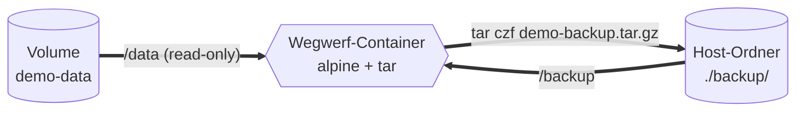

# Übung 2: Volume-Backup und Restore

!!! abstract "Was du in dieser Übung lernst"
    - Wie du **Daten aus einem Volume herausholst**, ohne den Speicherort des Volumes auf dem Host zu kennen
    - Wie du ein **Backup zurückspielst**, nachdem das Volume weg ist
    - Warum der Wegwerf-Container-Trick (`docker run --rm`) die saubere Lösung ist
    - Was passiert, wenn du das Volume aus Versehen löschst

**Aufwand:** ca. 20 Minuten.

---

## Worum geht's

Daten in einem Docker-Volume liegen außerhalb des Containers, **in einem von Docker verwalteten Bereich** auf der Host-Disk. Du kannst dort nicht direkt mit `cp` rangehen, weil Docker den Pfad nicht für dich exponiert (auf Mac/Windows steckt das Volume sogar in einer VM, nicht im Host-Dateisystem). Den Unterschied zwischen Volume und Bind Mount findest du unter [Volumes & Persistenz](../docker-aufbau/volumes.md#volume-vs-bind-mount-der-kernunterschied).

Die saubere Lösung ist ein **Wegwerf-Container**, der zwei Dinge gleichzeitig mountet:

1. das **Source-Volume** (read-only, siehe [Read-only-Mount](../docker-aufbau/volumes.md#read-only-mount))
2. einen **Host-Ordner** als Ziel für die Backup-Datei (ein Bind Mount)

Dieser Container packt die Volume-Daten in ein `.tar.gz`-Archiv. Beim Restore läuft das Ganze rückwärts.


```mermaid
flowchart LR
  V[("Volume<br/>demo-data")]
  C{{"Wegwerf-Container<br/>alpine + tar"}}
  H[("Host-Ordner<br/>./backup/")]

  V == "/data (read-only)" ==> C
  H == "/backup" ==> C
  C == "tar czf demo-backup.tar.gz" ==> H
```

---

## Anleitung

### Schritt 1: Volume und Datenbank anlegen

```bash
docker volume create demo-data
docker run -d --name demo-pg -e POSTGRES_PASSWORD=geheim -v demo-data:/var/lib/postgresql/data postgres:16-alpine
```

Kurz warten, bis Postgres bereit ist. Mit `docker logs demo-pg` siehst du, ob die Zeile `database system is ready to accept connections` schon erschienen ist.

### Schritt 2: Daten reinschreiben

```bash
docker exec demo-pg psql -U postgres -c "CREATE TABLE notiz (id SERIAL, text TEXT);"
docker exec demo-pg psql -U postgres -c "INSERT INTO notiz (text) VALUES ('vor backup');"
docker exec demo-pg psql -U postgres -c "SELECT * FROM notiz;"
```

Erwartet: eine Tabelle `notiz` mit dem Eintrag `vor backup`.

### Schritt 3: Backup-Ordner auf dem Host anlegen

=== "macOS / Linux"
    ```bash
    mkdir -p ~/docker-backup
    cd ~/docker-backup
    ```

=== "Windows PowerShell"
    ```powershell
    mkdir -Force $HOME\docker-backup
    cd $HOME\docker-backup
    ```

=== "Windows CMD"
    ```cmd
    mkdir "%USERPROFILE%\docker-backup"
    cd "%USERPROFILE%\docker-backup"
    ```

### Schritt 4: Backup mit Wegwerf-Container

Ein dateibasiertes Backup ist nur dann konsistent, wenn Postgres gerade **nicht** schreibt. Deshalb stoppst du den Datenbank-Container zuerst:

```bash
docker stop demo-pg
```

Dann packst du das Volume ein:

=== "macOS / Linux"
    ```bash
    docker run --rm \
      -v demo-data:/data:ro \
      -v "$(pwd):/backup" \
      alpine \
      sh -c "tar czf /backup/demo-backup.tar.gz -C /data ."
    ```

=== "Windows PowerShell"
    ```powershell
    docker run --rm `
      -v demo-data:/data:ro `
      -v "${PWD}:/backup" `
      alpine `
      sh -c "tar czf /backup/demo-backup.tar.gz -C /data ."
    ```

=== "Windows CMD"
    ```cmd
    docker run --rm ^
      -v demo-data:/data:ro ^
      -v "%cd%:/backup" ^
      alpine ^
      sh -c "tar czf /backup/demo-backup.tar.gz -C /data ."
    ```

| Flag / Teil | Bedeutung |
|------|-----------|
| `--rm` | Container wird nach Beenden automatisch entfernt |
| `-v demo-data:/data:ro` | Volume read-only mounten, wir wollen sicher nichts ändern |
| `-v "$(pwd):/backup"` | aktuelles Host-Verzeichnis nach `/backup` mounten (PowerShell: `${PWD}`, CMD: `%cd%`) |
| `alpine` | minimales Image, hat `tar` und `sh` an Bord |
| `sh -c "..."` | der tar-Aufruf läuft komplett im Container |
| `tar czf ... -C /data .` | `c` = Archiv erstellen, `z` = mit gzip komprimieren, `f` = Dateiname folgt, `-C /data` = vorher nach `/data` (das Volume) wechseln, `.` = alles darin |

Prüfe das Backup:

=== "macOS / Linux"
    ```bash
    ls -lh demo-backup.tar.gz
    ```

=== "Windows PowerShell"
    ```powershell
    Get-Item demo-backup.tar.gz | Select-Object Name, Length
    ```

=== "Windows CMD"
    ```cmd
    dir demo-backup.tar.gz
    ```

Die Datei ist einige MB groß. Die genaue Größe kann abweichen.

### Schritt 5: Disaster simulieren

Jetzt zerstören wir die Datenbank und das Volume **komplett**:

```bash
docker rm -f demo-pg
docker volume rm demo-data
docker volume ls
```

`demo-data` taucht in der Liste **nicht mehr** auf. Die Daten wären „wirklich" weg, wenn wir kein Backup hätten.

### Schritt 6: Restore

Volume neu anlegen:

```bash
docker volume create demo-data
```

Backup einspielen, wieder mit Wegwerf-Container. `x` statt `c` heißt: Archiv auspacken.

=== "macOS / Linux"
    ```bash
    docker run --rm \
      -v demo-data:/data \
      -v "$(pwd):/backup:ro" \
      alpine \
      sh -c "tar xzf /backup/demo-backup.tar.gz -C /data"
    ```

=== "Windows PowerShell"
    ```powershell
    docker run --rm `
      -v demo-data:/data `
      -v "${PWD}:/backup:ro" `
      alpine `
      sh -c "tar xzf /backup/demo-backup.tar.gz -C /data"
    ```

=== "Windows CMD"
    ```cmd
    docker run --rm ^
      -v demo-data:/data ^
      -v "%cd%:/backup:ro" ^
      alpine ^
      sh -c "tar xzf /backup/demo-backup.tar.gz -C /data"
    ```

Datenbank-Container neu starten, mit demselben Volume:

```bash
docker run -d --name demo-pg -e POSTGRES_PASSWORD=geheim -v demo-data:/var/lib/postgresql/data postgres:16-alpine
```

Warte ein paar Sekunden, bis Postgres hochgefahren ist (`docker logs demo-pg`).

### Schritt 7: Sind die Daten wieder da?

```bash
docker exec demo-pg psql -U postgres -c "SELECT * FROM notiz;"
```

Erwartet:

```text
 id |    text    
----+------------
  1 | vor backup
(1 row)
```

**Geschafft.** Du hast eine zerstörte Datenbank aus dem Backup wiederhergestellt.

!!! tip "Bonus 2 ausprobieren?"
    Wenn du den [Bonus 2 mit `pg_dump`](#bonus) machen willst, lass `demo-pg` jetzt noch laufen und räume erst danach auf.

### Schritt 8: Aufräumen

```bash
docker rm -f demo-pg
docker volume rm demo-data
```

Das Backup-Archiv (`demo-backup.tar.gz`) bleibt auf dem Host. Wenn du es nicht mehr brauchst, lösch es:

=== "macOS / Linux"
    ```bash
    rm demo-backup.tar.gz
    ```

=== "Windows PowerShell"
    ```powershell
    Remove-Item demo-backup.tar.gz
    ```

=== "Windows CMD"
    ```cmd
    del demo-backup.tar.gz
    ```

---

## Übung: Selber machen

!!! info "Aufgabe"
    Schreibe dir **selbst ein Mini-Skript**, das ein Postgres-Volume sichert. Unter macOS/Linux als bash-Skript, unter Windows als PowerShell-Skript. Das Skript:

    - nimmt einen Volume-Namen als Argument
    - hängt das aktuelle Datum ans Backup-Datei-Ende (z.B. `pg-data-2026-09-23.tar.gz`)
    - speichert ins aktuelle Verzeichnis
    - bricht mit einer Meldung ab, wenn es das Volume nicht gibt

    **Datum-Tipp:**

    - bash: `$(date +%F)` → liefert das Datum im Format `2026-09-23`
    - PowerShell: `Get-Date -Format "yyyy-MM-dd"`

!!! warning "Zum Testen braucht es ein Volume mit Daten"
    Nach Schritt 8 ist `demo-data` gelöscht. Wiederhole vorher Schritt 1 und 2. Ohne Prüfung würde `docker run -v demo-data:/data` ein fehlendes Volume **stillschweigend leer anlegen** und du bekämst ein leeres Backup. Deshalb prüfen beide Musterlösungen zuerst mit `docker volume inspect`, ob das Volume existiert.

??? success "Musterlösung: Bash"

    Datei `backup-volume.sh`:

    ```bash
    #!/usr/bin/env bash
    set -euo pipefail

    VOLUME="${1:-}"
    if [ -z "$VOLUME" ]; then
      echo "Usage: $0 <volume-name>"
      exit 1
    fi

    if ! docker volume inspect "$VOLUME" > /dev/null 2>&1; then
      echo "Volume $VOLUME existiert nicht"
      exit 1
    fi

    DATE=$(date +%F)
    OUTFILE="${VOLUME}-${DATE}.tar.gz"

    docker run --rm \
      -v "${VOLUME}:/data:ro" \
      -v "$(pwd):/backup" \
      alpine \
      sh -c "tar czf /backup/${OUTFILE} -C /data ."

    echo "Backup geschrieben: ${OUTFILE}"
    ```

    Ausführbar machen und nutzen:
    ```bash
    chmod +x backup-volume.sh
    ./backup-volume.sh demo-data
    ```

??? success "Musterlösung: PowerShell"

    Datei `backup-volume.ps1` anlegen und öffnen. Erst die leere Datei erzeugen, sonst speichert Notepad sie als `backup-volume.ps1.txt`:

    ```powershell
    New-Item -ItemType File backup-volume.ps1
    notepad backup-volume.ps1
    ```

    Inhalt:

    ```powershell
    param(
      [Parameter(Mandatory=$true)]
      [string]$Volume
    )

    docker volume inspect $Volume *> $null
    if ($LASTEXITCODE -ne 0) {
      Write-Host "Volume $Volume existiert nicht"
      exit 1
    }

    $date    = Get-Date -Format "yyyy-MM-dd"
    $outFile = "${Volume}-${date}.tar.gz"

    docker run --rm `
      -v "${Volume}:/data:ro" `
      -v "${PWD}:/backup" `
      alpine `
      sh -c "tar czf /backup/${outFile} -C /data ."

    Write-Host "Backup geschrieben: $outFile"
    ```

    Nutzung: Windows blockiert selbst geschriebene Skripte standardmäßig („Die Ausführung von Skripts ist auf diesem System deaktiviert"). Mit `-ExecutionPolicy Bypass` erlaubst du die Ausführung nur für diesen einen Aufruf, ohne Systemeinstellungen zu ändern:
    ```powershell
    powershell -ExecutionPolicy Bypass -File .\backup-volume.ps1 -Volume demo-data
    ```

---

## Bonus

??? tip "Bonus 1: Backup auf einen anderen Host übertragen"
    Ein Backup-Archiv kann via `scp`, USB-Stick, S3-Bucket oder einer Netzwerkfreigabe woanders hin. Probiere mal einen Roundtrip auf einen anderen Rechner:

    1. Backup auf Rechner A erzeugen
    2. Datei auf Rechner B kopieren
    3. Auf Rechner B in ein neu erstelltes Volume zurückspielen
    4. Postgres dort starten und prüfen, ob die Tabelle existiert

    Das demonstriert, dass Daten **portabel** sind, das Volume selbst ist es nicht.

??? tip "Bonus 2: Postgres-spezifisches Backup mit `pg_dump`"
    Das `tar`-Backup ist ein **dateibasiertes Backup**: schnell, einfach, aber Postgres muss **gestoppt** sein, damit die Dateizustände konsistent sind. Sonst riskierst du eine kaputte Sicherung.

    Das **Postgres-eigene Werkzeug** ist `pg_dump`. Es funktioniert auf einer **laufenden** Datenbank und erzeugt SQL-Statements zum Zurückspielen. Voraussetzung: `demo-pg` aus Schritt 6 läuft noch.

    Dump im Container erzeugen und auf den Host kopieren:

    ```bash
    docker exec demo-pg sh -c "pg_dump -U postgres postgres > /tmp/backup.sql"
    docker cp demo-pg:/tmp/backup.sql backup.sql
    ```

    Die Umleitung `>` steht bewusst innerhalb von `sh -c "..."`. So schreibt der Container die Datei, nicht die Host-Shell. Windows PowerShell 5.1 würde mit `>` eine UTF-16-Datei erzeugen, die `psql` nicht sauber lesen kann.

    Restore in eine neue, leere Datenbank (in die bestehende würde es Fehler wie „already exists" geben):

    ```bash
    docker exec demo-pg psql -U postgres -c "CREATE DATABASE wiederhergestellt;"
    docker cp backup.sql demo-pg:/tmp/restore.sql
    docker exec demo-pg psql -U postgres -d wiederhergestellt -f /tmp/restore.sql
    docker exec demo-pg psql -U postgres -d wiederhergestellt -c "SELECT * FROM notiz;"
    ```

    Danach wie in Schritt 8 aufräumen und `backup.sql` löschen.

    Im echten Leben: für **Produktions-Datenbanken** immer `pg_dump` (oder `pg_basebackup` für ganze Cluster) statt `tar`. Das `tar`-Backup ist die beste Wahl für **statische Volumes**, etwa Konfig-Verzeichnisse oder hochgeladene Dateien.

---

## Was du danach kannst

- Beliebige Docker-Volumes **sichern** und **zurückspielen**.
- Den Unterschied zwischen *„Container weg, Volume bleibt"* und *„Volume weg, Daten weg"* sicher erkennen.
- Ein **Disaster-Recovery-Szenario** spielerisch durchgehen: Volume zerstören, Backup einspielen, Daten sind wieder da.
- Den **Wegwerf-Container-Trick** (`docker run --rm` mit zwei Mounts) für eigene Mini-Tools nutzen.

---

## Weiter

- [Übung 3: HEALTHCHECK im Dockerfile](03-healthchecks.md)
- Zurück zur [Übersicht](index.md)
