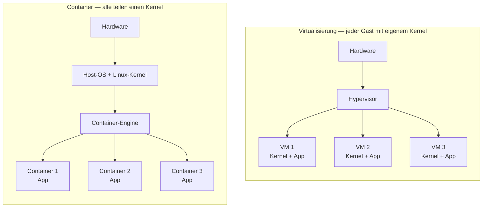

# Container vs. VM – der technische Unterschied

!!! abstract "Lernziel"
    Nach dieser Seite kannst du:

    - den Unterschied zwischen **Container** und **VM** auf **Kernel-Ebene** erklären
    - die Begriffe **Namespace** und **cgroup** einordnen
    - in einer Tabelle benennen, in welchen Eigenschaften sich Container und VMs unterscheiden
    - begründen, warum Container **schneller starten** und **weniger RAM** brauchen

---

## Warum das wichtig ist

„Container sind leichter als VMs" – diesen Satz liest man überall. Er ist richtig, aber er ist nur **die Folge**, nicht die Ursache. Die Ursache liegt einen Stock tiefer, beim **Kernel**.

Wer das versteht, kann auch einordnen, wann eine VM **die bessere Wahl** ist als ein Container.

---

## Die Kernfrage: wer bringt den Kernel mit?

Links: jede VM **bringt ihren eigenen Kernel mit**. Der Hypervisor erzeugt aus der echten Hardware mehrere virtuelle Maschinen, und in jeder wird ein vollständiges Gast-OS hochgefahren.

Rechts: alle Container **teilen sich den einen Kernel des Hosts**. Die Container-Engine (z.B. Docker) sorgt nur dafür, dass jeder Container den Kernel so erlebt, als gehöre er ihm allein.

---

## Was macht einen Container technisch aus?

Ein Container ist aus Sicht des Linux-Kernels **ein normaler Prozess**. Das Besondere ist: dieser Prozess wurde mit drei Kernel-Features eingepackt, die ihn **isolieren** und **zügeln**.

### 1. Namespaces – „sieht nur, was er sehen soll"

**Namespaces** sind ein **Linux-Kernel-Feature** – sie sind also nicht „etwas, das Docker erfunden hat", sondern existieren direkt im Kernel (seit Kernel 2.6.24). Docker nutzt sie nur geschickt aus.

Namespaces teilen System­ressourcen so auf, dass ein Prozess **nur das sieht, was sein Namespace enthält**. Andere Prozesse auf demselben Host können in einem anderen Namespace leben und bemerken sich gegenseitig gar nicht. Das ist der Trick, mit dem Container sich „isoliert" anfühlen, obwohl sie sich denselben Kernel teilen.

Es gibt mehrere Arten von Namespaces:

| Namespace | Was isoliert wird |
|-----------|------------------|
| `pid` | Prozess-IDs: jeder Container sieht nur seine eigenen Prozesse |
| `net` | Netzwerk: eigene IP, eigene Interfaces, eigene Routing-Tabelle |
| `mnt` | Dateisystem: eigenes „root", eigene Mounts |
| `uts` | Hostname: jeder Container kann seinen eigenen Hostname haben |
| `ipc` | Inter-Process Communication: getrennt, damit Container sich nicht gegenseitig stören |
| `user` | User-IDs: Root im Container ist nicht Root auf dem Host (optional) |

Ein Container sieht also seine eigenen Prozesse, sein eigenes Netzwerk, sein eigenes Dateisystem. Andere Container und der Host bleiben unsichtbar.

### 2. cgroups – „darf nur so viel nehmen"

**Control Groups (cgroups)** sind Kernel-Features, die festlegen, **wie viel Ressourcen** ein Prozess verbrauchen darf:

- wie viel CPU-Zeit
- wie viel RAM
- wie viel Disk-I/O
- wie viel Netzwerk-Bandbreite

So wird verhindert, dass ein außer Kontrolle geratener Container den ganzen Host auffrisst.

### 3. Capabilities – „darf nur bestimmte Kernel-Aktionen"

Statt einem einzelnen Root-Account, der **alles** darf, kennt Linux **feinkörnige Rechte** (Capabilities): „darf Ports unter 1024 öffnen", „darf Kernel-Module laden", „darf Netzwerk-Konfiguration ändern". Container bekommen meist nur ein **stark reduziertes** Set dieser Capabilities, damit sie nicht aus ihrer Hülle ausbrechen können.

---

## Die Konsequenzen in einer Tabelle

| Eigenschaft | Virtuelle Maschine | Container |
|-------------|---------------------|-----------|
| **Eigener Kernel** | Ja | Nein (teilt sich den Host-Kernel) |
| **Startzeit** | Sekunden bis Minuten | Millisekunden bis Sekunden |
| **RAM-Overhead pro Instanz** | ca. 400 MB–mehrere GB | wenige MB bis wenige Dutzend MB |
| **Plattenbedarf für OS** | 1–5 GB pro VM | meist 10–300 MB pro Image |
| **Isolation** | Sehr stark (eigener Kernel) | Mittelstark (geteilter Kernel) |
| **Anderes Gast-OS möglich** | Ja (Linux-Host kann Windows-VM) | Nein (Linux-Container brauchen Linux-Kernel) |
| **Portabilität** | Hoch (virtuelle Disk) | Sehr hoch (Image, klein, standardisiert) |
| **Typischer Einsatz** | Ganze Systeme, gemischte OS, starke Isolation | Anwendungen, Microservices, schnelle Tests |

---

## Wann also VM und wann Container?

### VM sinnvoll, wenn ...

- du ein **anderes Betriebssystem** als der Host brauchst (z.B. Windows auf Linux-Host)
- du **sehr strikte Isolation** brauchst (Banken, Multi-Mandanten-Clouds)
- du einen **kompletten Server** simulieren willst, inklusive eigener Kernel-Module
- die Anwendung **Kernel-nah** arbeiten muss (z.B. eigene Treiber)

### Container sinnvoll, wenn ...

- du eine **konkrete Anwendung** schnell, reproduzierbar und leicht austauschbar betreiben willst
- du **viele kleine Dienste** parallel laufen lassen willst (Microservices)
- du **schnelle Start-Stop-Zyklen** brauchst (CI-Tests, Skalierung)
- du das **Image einfach teilen** können möchtest (Registry, siehe nächste Seiten)

In der Praxis mischt man oft beides: Container laufen **in VMs**, VMs laufen **in Rechen­zentren mit Typ-1-Hypervisoren**. Jede Ebene hat ihre Berechtigung.

---

## Wichtige Einschränkung – jetzt schon merken

!!! warning "Container brauchen einen passenden Kernel"
    Wir haben gerade gesagt: „Container teilen den Kernel des Hosts." Das stimmt – aber es ist **ein Linux-Kernel**, den sie teilen.

    - Ein **Linux-Container** braucht einen **Linux-Kernel** unter sich.
    - Auf einem **Windows-Host** gibt es keinen Linux-Kernel nativ.
    - Auf einem **macOS-Host** auch nicht.

    **Wie löst Docker das dann?** Die kurze Antwort: Docker Desktop startet unter der Haube **selbst eine Linux-VM**. Die Details stehen auf der nächsten Seite: [Docker Desktop ist eine VM](docker-desktop-wahrheit.md).

    Das ist so wichtig, dass viele den ersten Container auf einem Mac oder Windows falsch verstehen. Lies die nächste Seite unbedingt.

---

## Eine oft übersehene Feinheit: Sicherheit

Ist ein Container **genauso sicher** wie eine VM? Kurze Antwort: **Nein.**

Weil Container sich den Kernel teilen, bedeutet eine **Sicherheitslücke im Kernel** potenziell, dass ein Angreifer aus einem Container ausbrechen kann. Bei einer VM gibt es diese Brücke nicht in derselben Form.

Das heißt nicht, dass Container unsicher sind. Für die **meisten Anwendungsfälle** sind sie sicher genug, solange:

- der Host-Kernel aktuell ist
- Container nicht als `root` laufen (wenn vermeidbar)
- sensible Anwendungen zusätzlich mit AppArmor/SELinux oder eigener VM abgesichert werden

Für Multi-Mandanten-Umgebungen (z.B. Cloud-Anbieter, die zahlende Kunden strikt trennen müssen) werden Container deshalb oft **zusätzlich** in VMs verpackt.

---

## Merksatz

!!! success "Merksatz"
    > **Container teilen den Kernel des Hosts und isolieren sich über Namespaces, cgroups und Capabilities. Darum starten sie schnell und brauchen wenig RAM – bezahlen das aber mit schwächerer Isolation als echte VMs.**

---

## Weiterlesen

- [Docker Desktop ist eine VM](docker-desktop-wahrheit.md) – unbedingt als Nächstes, wenn du Mac oder Windows nutzt
- [Image und Container](image-und-container.md)
