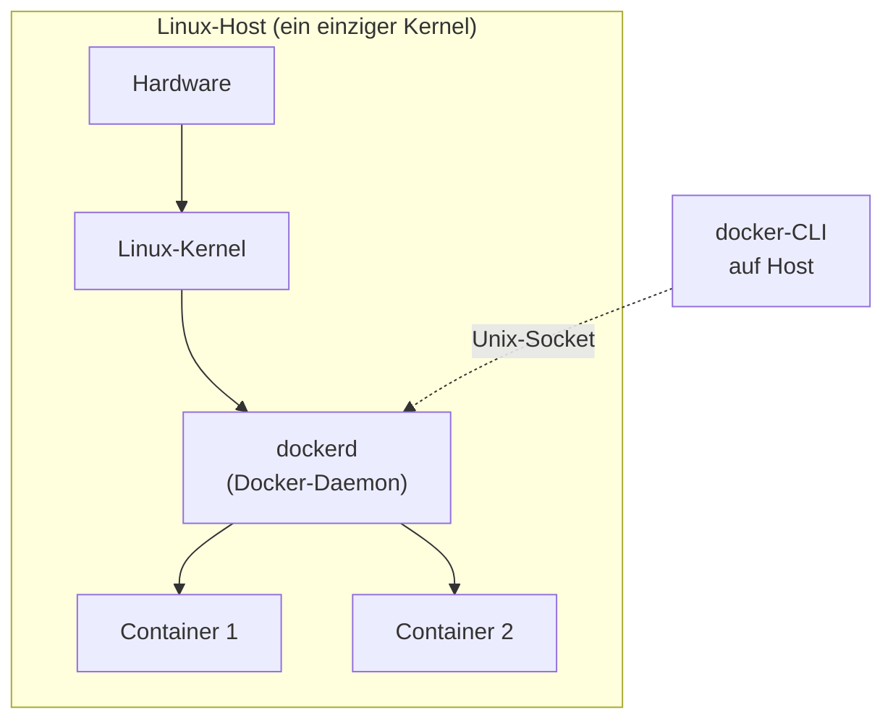
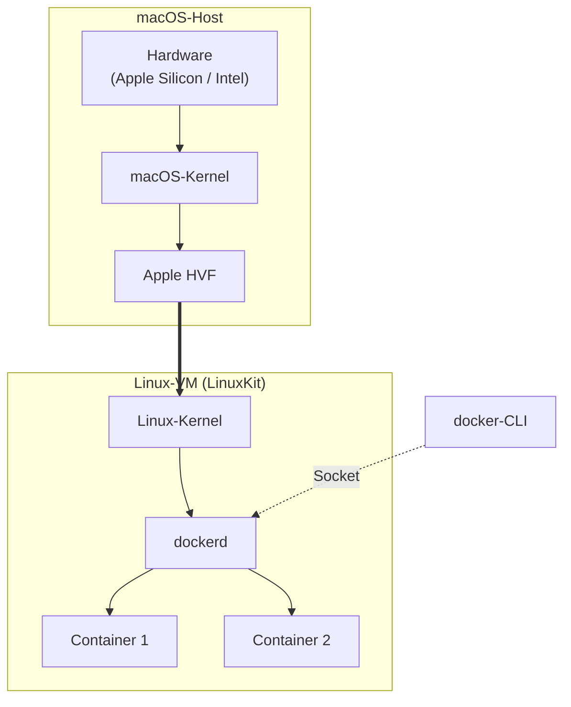
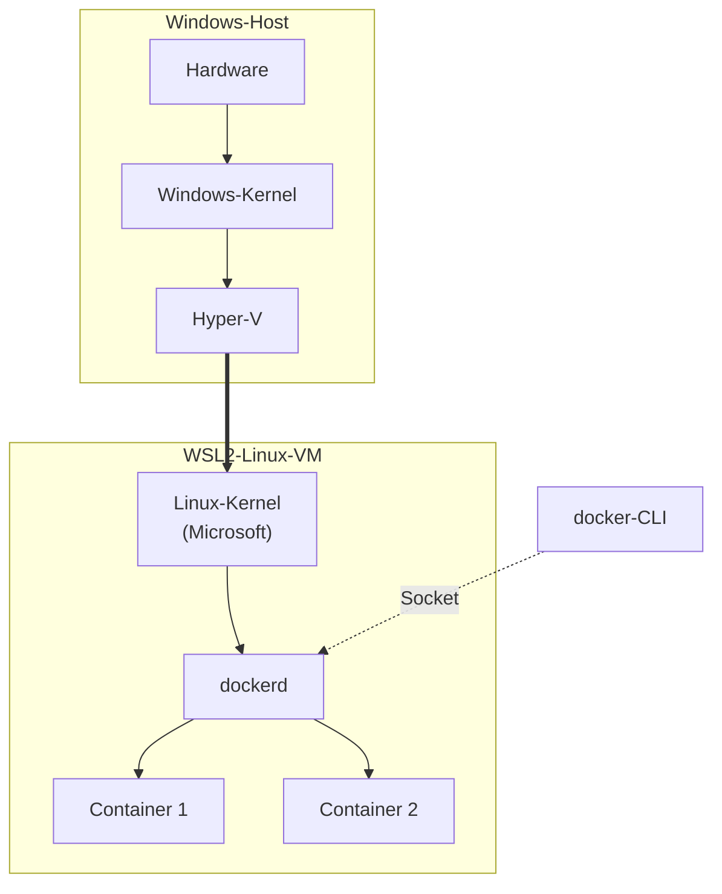

# Docker Desktop ist eine VM

!!! abstract "Lernziel"
    Nach dieser Seite verstehst du:

    - warum **Docker auf Linux direkt** auf dem Host läuft
    - warum **Docker Desktop auf Mac und Windows** unter der Haube eine **Linux-VM** startet
    - welche Konsequenz das für die Aussage „Container sind leichter als VMs" hat
    - warum das **der wichtigste Punkt** ist, den viele Einsteiger übersehen

---

## Warum das wichtig ist

Auf der vorherigen Seite haben wir gesagt: „Container teilen sich den Linux-Kernel des Hosts." Dann fragt sich jede Mac-Nutzerin zu Recht:

> Mein Host ist macOS. Das hat doch gar keinen Linux-Kernel. Wie kann dann ein Linux-Container auf meinem Mac laufen?

Die Antwort ist entscheidend für dein mentales Modell – und sie wird in vielen Erklärungen stillschweigend übersprungen.

---

## Der Docker-Aufbau auf **Linux**

Auf einem **Linux-Host** ist alles geradlinig:



- **Der Host-Kernel** ist der Linux-Kernel, den Container sich teilen.
- **`dockerd`** (der Daemon) läuft als normaler Linux-Prozess auf dem Host.
- Container sind **Prozesse** auf dem Host – mit eigenen Namespaces, cgroups, Capabilities.
- `docker`-Befehle kannst du mit `ps aux | grep containerd` direkt sehen: es sind echte Host-Prozesse.

Hier ist „Container sind leichter als VMs" **uneingeschränkt wahr**.

---

## Der Docker-Aufbau auf **macOS**

Auf macOS ist es anders – es gibt **keinen Linux-Kernel** auf dem Host. Deshalb macht Docker Desktop im Hintergrund folgendes:



Schritt für Schritt:

1. **Docker Desktop** installiert sich wie eine normale Mac-App.
2. Beim Start legt Docker Desktop über das **Apple Hypervisor Framework** eine **winzige Linux-VM** an (Apple nennt die Technik intern `Virtualization.framework`, früher `HyperKit`).
3. In dieser Linux-VM läuft ein **echter Linux-Kernel** (ein minimales Distribution namens **LinuxKit**).
4. In der Linux-VM läuft **`dockerd`**, der Docker-Daemon.
5. Deine Container laufen **in dieser Linux-VM** – und teilen sich deren Kernel.
6. Deine `docker`-CLI am Mac spricht mit dem Daemon **über einen Unix-Socket** (eine datei-ähnliche Schnittstelle für Prozess-zu-Prozess-Kommunikation), der aus der VM heraus ans macOS durchgereicht wird. Deshalb fühlt es sich wie „lokal" an. Du kannst dir die aktive Verbindung anschauen:

    === "macOS / Linux"
        ```bash
        ls -la /var/run/docker.sock
        docker context ls
        ```

    === "Windows PowerShell"
        ```powershell
        # Auf Windows ist der Endpoint kein Unix-Socket, sondern ein Named Pipe.
        # docker context ls zeigt es:
        docker context ls
        # Default-Endpoint: npipe:////./pipe/docker_engine
        ```

---

## Der Docker-Aufbau auf **Windows**

Auf Windows ähnlich – nur heißt die Technik anders:



- Docker Desktop auf Windows nutzt **WSL2** (Windows Subsystem for Linux 2). Das ist eine von Microsoft bereitgestellte, hochoptimierte Linux-VM mit einem echten Linux-Kernel.
- In dieser WSL2-VM läuft `dockerd`.
- Deine Container laufen **in WSL2** – mit deren Linux-Kernel.

Historisch (vor 2020) nutzte Docker auf Windows eine VirtualBox- oder Hyper-V-basierte VM namens „MobyLinuxVM". Heute ist das abgelöst durch WSL2, was spürbar schneller ist.

---

## Warum das wichtig ist – drei Konsequenzen

### 1. Die Aussage „Container sind leichter als VMs" gilt auf Mac/Windows nicht _pro Container_

Der Satz „ein Container wiegt nur wenige MB, eine VM wiegt ein GB" ist auf **Linux-Hosts** absolut wahr. Auf **Mac und Windows** bedeutet er in Wirklichkeit:

> „Die **eine** Docker-VM wiegt 2–4 GB RAM und ein paar GB Disk, aber sie trägt beliebig viele leichte Container."

Der Gewinn entsteht **bei Skalierung**: 10 Container kosten dich auf dem Mac fast nichts extra (weil sie sich alle den Kernel der Docker-VM teilen). Aber der **Grundpreis** (die Docker-VM selbst) existiert und kostet Ressourcen.

### 2. Ressourcen-Einstellungen sind wichtig

Wenn du Docker Desktop installiert hast, guck dir einmal die Einstellungen an: **Resources → Advanced**. Dort stellst du ein, wie viel RAM, CPU und Disk **die Docker-VM** sich nehmen darf.

- Standard: meist 2 GB RAM, 2 CPUs.
- Für ernsthafte Arbeit: 4–6 GB RAM, 4 CPUs sind realistisch.
- Mehr ist selten nötig, weil die Container innerhalb der VM sehr effizient skalieren.

### 3. Manche Fehler fühlen sich auf Mac/Windows anders an als auf Linux

- „Port schon belegt" wirkt oft verwirrend, weil der Port auf der VM belegt ist, nicht auf dem Host.
- **Datei-Mounts** aus macOS in einen Container laufen über eine zusätzliche Übersetzungsschicht (VirtioFS, früher osxfs). Auf einem Linux-Host sind Bind Mounts direkt, auf macOS gehen sie durch diese Schicht – bei großen Dateimengen (z.B. `node_modules` mit tausenden kleinen Dateien) spürbar **5–10× langsamer**.

    ??? tip "Workarounds für langsame Bind Mounts auf macOS"
        - In Docker Desktop **Settings → General → File sharing implementation** → „VirtioFS" wählen (inzwischen Default, aber alte Installationen haben manchmal noch gRPC FUSE).
        - **Nur die nötigen Ordner mounten**, nicht dein ganzes `$HOME`.
        - Für **große Dateimengen**: ein **benanntes Volume** statt Bind Mount – das liegt direkt in der VM und ist deutlich schneller.
        - **Node-Modules nicht mit-mounten**: anonymes Volume über den Bind-Mount legen, siehe [Aufbau-Stolpersteine → langsamer Bind Mount auf Mac](../docker-aufbau/stolpersteine.md).

---

## Analogie: die „Lagerhalle auf einem Schiff"

!!! tip "Bild"
    Stell dir vor, du betreibst ein Containerschiff – aber du wohnst in einer Wohnung, nicht am Hafen.

    Auf **Linux** ist dein Haus direkt am Hafen. Du kannst aus dem Fenster auf das Schiff schauen und Container be- und entladen lassen, wann immer du willst.

    Auf **Mac/Windows** steht zwischen deiner Wohnung und dem Hafen noch eine kleine **Lagerhalle** (die Linux-VM). Alle Container, mit denen du arbeitest, sind eigentlich **in dieser Lagerhalle**. Du steuerst sie aus deiner Wohnung über Funk (die Docker-CLI), und die Lagerhalle verwaltet sie für dich.

    Die Container bleiben leicht. Aber es existiert ein kleines, festes Gebäude (die Linux-VM), das immer mit am Start ist.

---

## Heißt das, Docker auf Linux-Servern ist „besser"?

In der Produktion ja, in dem Sinn, dass es **direkt** läuft und keine zusätzliche VM dazwischen hat. Deshalb laufen die meisten produktiven Docker-Umgebungen auf Linux-Servern.

Für die **Entwicklung** ist Docker Desktop auf Mac/Windows aber **absolut ausreichend**. Die kleine VM ist so gut integriert, dass sie im Alltag unsichtbar bleibt – bis man mal genau hinschaut, wie wir jetzt.

---

## Merksatz

!!! success "Merksatz"
    > **Docker Desktop auf Mac und Windows ist eine Linux-VM mit sichtbarer docker-CLI am Host. Die Container laufen in dieser VM, nicht direkt auf macOS oder Windows.**

Wenn du mit diesem Wissen unterwegs bist, kannst du den Gewichtsvorteil von Containern ehrlich einordnen – auf Linux 100 %, auf Mac/Windows „ab dem zweiten Container".

---

## Weiterlesen

- [Image und Container](image-und-container.md)
- [Registry und Docker Hub](registry-und-dockerhub.md)
