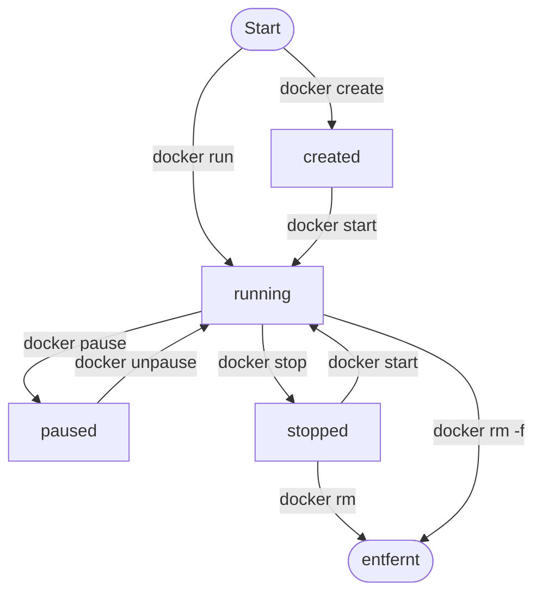

# Image und Container

!!! abstract "Lernziel"
    Nach dieser Seite kannst du:

    - **Image** und **Container** klar unterscheiden
    - das **Layer-Modell** eines Images beschreiben
    - erklären, was **Copy-on-Write** für laufende Container bedeutet
    - den Lebens­zyklus eines Containers grob skizzieren

---

## Warum das wichtig ist

Fast jede Docker-Diskussion dreht sich um diese beiden Wörter. Werden sie verwechselt, wird alles andere schief. Deshalb nehmen wir sie uns einzeln und sorgfältig vor.

---

## Image = die Vorlage

Ein **Image** ist eine **schreibgeschützte Vorlage** für einen Container. Es enthält:

- ein **minimales Dateisystem** (z.B. ein abgespecktes Linux)
- alle **Bibliotheken und Abhängigkeiten**, die die Anwendung braucht
- die **Anwendung selbst** (oder Server-Software, Datenbank, was auch immer)
- **Metadaten** wie „welcher Befehl soll beim Start ausgeführt werden?"

Du kannst dir ein Image vorstellen wie eine **ausgeschaltete Festplatte** – alles ist drauf, aber nichts läuft.

### Woher kommen Images?

1. **Von einer Registry** (z.B. Docker Hub) heruntergeladen, siehe [Registry und Docker Hub](registry-und-dockerhub.md).
2. **Selbst gebaut** aus einem **Dockerfile**, siehe [Dockerfile – Grundlagen](dockerfile-grundlagen.md).

Beide Wege führen zum selben Ergebnis: ein Image, das lokal bei dir liegt.

---

## Container = die laufende Instanz

Ein **Container** ist eine **laufende Instanz** eines Images. Wenn du ein Image „einschaltest" (z.B. mit `docker run`), startet daraus ein Container.

Wichtig:

- **Ein Image, viele Container**: aus demselben Image kannst du beliebig viele Container starten. Jeder ist unabhängig.
- **Container sind flüchtig**: stoppst du einen Container und löschst ihn, sind alle Änderungen in seinem Dateisystem **weg**. Das Image bleibt unberührt.
- **Container haben einen eigenen Lebens­zyklus**: `created` → `running` → `paused` → `stopped` → `removed`.

---

## Analogie: Bauplan und Haus

!!! tip "Bauplan und Haus"
    - Ein **Image** ist wie ein **Bauplan** (die PDF, unveränderlich).
    - Ein **Container** ist ein **gebautes Haus** nach diesem Bauplan.
    - Nach **einem** Bauplan kannst du beliebig viele Häuser bauen – sie stehen unabhängig voneinander, aber sie sehen innen zunächst gleich aus.
    - Das Haus kann **ändern**, z.B. eine Wand farbig streichen – der Bauplan ändert sich dadurch nicht.
    - Reißt du das Haus ab (`docker rm`), bleibt der Bauplan.

Diese Analogie sitzt meistens nach einmal Hören.

---

## Wie Images intern aufgebaut sind: Layer

Ein Image ist nicht monolithisch. Es besteht aus **Layern** – jede Schicht ist ein **Differenz-Snapshot** des Dateisystems, gegenüber dem vorhergehenden Layer.

Beispiel für das offizielle `python:3.12`-Image (vereinfacht):

```
┌──────────────────────────────────┐
│ Layer 4: Python 3.12 installiert │
├──────────────────────────────────┤
│ Layer 3: bestimmte Tools (curl…) │
├──────────────────────────────────┤
│ Layer 2: System-Pakete (apt…)    │
├──────────────────────────────────┤
│ Layer 1: Debian-Basis-Dateisystem│
└──────────────────────────────────┘
```

Jeder Layer ist **unveränderlich** (read-only). Zusammen ergeben sie das Image.

### Warum Layer? Zwei Gründe.

**1. Wiederverwendung.** Viele Images teilen sich ihre unteren Layer. Wenn du z.B. zwei Python-Images lokal hast, die beide auf Debian 12 basieren, liegt der Debian-Layer nur **einmal** auf deiner Festplatte – er wird von beiden Images referenziert.

**2. Cache beim Build.** Beim Bauen eines eigenen Images cached Docker jeden Layer. Änderst du nur den obersten Layer (z.B. deinen eigenen App-Code), werden die darunter­liegenden Layer nicht neu gebaut. Das spart enorm Zeit.

Du kannst die Layer eines Images so anschauen:

```bash
docker history nginx
```

Beispiel-Ausgabe (gekürzt):

```text
IMAGE          CREATED       CREATED BY                                      SIZE
<sha256>       2 days ago    CMD ["nginx" "-g" "daemon off;"]                0B
<sha256>       2 days ago    STOPSIGNAL SIGQUIT                              0B
<sha256>       2 days ago    EXPOSE 80/tcp                                   0B
<sha256>       2 days ago    ENTRYPOINT ["/docker-entrypoint.sh"]            0B
<sha256>       2 days ago    COPY 30-tune-worker-processes.sh /docker-…      4.62kB
...
```

Jede Zeile ist ein Layer. Die Reihenfolge entspricht den Instruktionen im Dockerfile, das diesen nginx-Build erzeugt hat.

---

## Copy-on-Write: der Trick des laufenden Containers

Wenn ein Container startet, kriegt er **einen zusätzlichen beschreibbaren Top-Layer**:

```
┌──────────────────────────────────┐ ← nur dieser Layer ist schreibbar
│ Writable Container-Layer          │    (exists pro Container)
├──────────────────────────────────┤
│ Image Layer 4 (read-only)        │
├──────────────────────────────────┤
│ Image Layer 3 (read-only)        │
├──────────────────────────────────┤
│ Image Layer 2 (read-only)        │
├──────────────────────────────────┤
│ Image Layer 1 (read-only)        │
└──────────────────────────────────┘
```

**Was passiert beim Lesen einer Datei?**
Docker schaut von oben nach unten, welche Version der Datei er findet, und liefert diese. Im Normalfall kommt die Datei aus dem Image.

**Was passiert beim Schreiben einer Datei?**
Docker **kopiert** die Datei aus dem (read-only) Image-Layer in den beschreibbaren Container-Layer und ändert sie dort. Der Image-Layer bleibt unberührt. Das nennt man **Copy-on-Write**: kopieren erst beim Schreiben.

**Was passiert beim Löschen eines Containers?**
Der beschreibbare Top-Layer wird weggeworfen. Alles, was der Container geschrieben hat, ist weg. Das Image liegt unverändert bei dir.

### Konsequenz

Willst du Daten behalten, die ein Container erzeugt (z.B. eine Datenbank), musst du sie **außerhalb des Containers** speichern. Dafür gibt es:

- **Volumes** – von Docker verwaltet, leben länger als Container
- **Bind Mounts** – direkt ein Host-Verzeichnis in den Container einhängen

Diese Themen schauen wir uns im nächsten Kursblock an. Für heute merke dir: **Was nur im Container-Layer lebt, ist beim nächsten `docker rm` weg.**

---

## Der Lebens­zyklus eines Containers



!!! note "Zusätzlicher Übergang"
    Aus `running` geht's auch nach `stopped`, wenn der **Hauptprozess des Containers selbst endet** – z.B. ein Skript, das durchläuft und beendet.

Der Weg von „Image" zu „laufender Container" führt praktisch immer über `docker run`. Das ist eine **Kombination** aus `docker create` (Container erzeugen) + `docker start` (Container starten).

---

## Image-Namen und IDs

Jedes Image hat:

- **einen Namen mit optionalem Tag**, z.B. `nginx:1.27-alpine`
- **eine eindeutige ID** (ein SHA-256-Hash des Inhalts)
- **eine vollständige Herkunfts­adresse**, z.B. `docker.io/library/nginx:1.27-alpine`

Die Herkunfts­adresse zerlegen wir auf der nächsten Seite.

---

## Merksatz

!!! success "Merksatz"
    > **Image = unveränderliche Vorlage. Container = laufende Instanz mit beschreibbarem Top-Layer. Alles, was im Container-Layer lebt, ist nach dem Löschen weg.**

---

## Weiterlesen

- [Registry und Docker Hub](registry-und-dockerhub.md) – woher Images kommen
- [Dockerfile – Grundlagen](dockerfile-grundlagen.md) – wie du eigene Images baust
