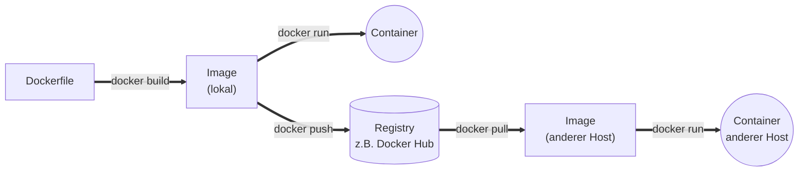

# Merksätze – Docker

Diese Seite ist reiner Spickzettel. Wenn du dir diese Sätze einprägst, hast du die Kern-Ideen des Docker-Blocks beieinander.

---

## 1. Warum Container

!!! success "Merksatz 1"
    > **VMs kapseln ganze Systeme. Container kapseln vor allem Anwendungen.**

Der zentrale Satz des Blocks. Alles Weitere ist Folge davon.

---

## 2. Warum Container leicht sind

!!! success "Merksatz 2"
    > **Container teilen den Kernel des Hosts und isolieren sich über Namespaces, cgroups und Capabilities. Darum starten sie schnell und brauchen wenig RAM – bezahlen das aber mit schwächerer Isolation als echte VMs.**

Das ist der technische Unterbau für Merksatz 1.

---

## 3. Docker Desktop auf Mac/Windows

!!! success "Merksatz 3"
    > **Docker Desktop auf Mac und Windows ist eine Linux-VM mit sichtbarer docker-CLI am Host. Die Container laufen in dieser VM, nicht direkt auf macOS oder Windows.**

Wer das nicht weiß, hat ein falsches mentales Modell – und kommt bei Ressourcen­verbrauch und Dateizugriffen durcheinander.

---

## 4. Image und Container

!!! success "Merksatz 4"
    > **Image = unveränderliche Vorlage. Container = laufende Instanz mit beschreibbarem Top-Layer. Alles, was im Container-Layer lebt, ist nach dem Löschen weg.**

Aus diesem Satz folgt die Notwendigkeit von **Volumes** oder **Bind Mounts**, wenn du Daten behalten willst. Das Thema kommt im nächsten Kursblock.

---

## 5. Registry und Image-Namen

!!! success "Merksatz 5"
    > **Ein Image-Name hat vier Teile: Registry, Namespace, Image-Name, Tag. Fehlt ein Teil, nimmt Docker einen Default. Der Default-Tag ist `:latest` – und genau deshalb ist er in Produktion tabu.**

In der Entwicklung kannst du mit `:latest` spielen. In Produktion setzt du immer eine konkrete Version.

---

## 6. Dockerfile: Bau vs. Laufzeit

!!! success "Merksatz 6"
    > **`RUN` läuft beim Bauen des Images, `CMD` beim Start des Containers. Alles, was du im Container haben willst, muss per `COPY` vom Host ins Image gekommen sein.**

Wer `RUN` und `CMD` verwechselt, baut ein Image, das beim Start nichts tut – oder umgekehrt.

---

## 7. Das Run-Muster

!!! success "Merksatz 7"
    > **`docker run -d --name <name> -p <host>:<container> <image>` ist das Muster für 90 % aller ersten Versuche.**

`ps`, `logs`, `exec`, `stop`, `rm` vervollständigen dein Werkzeug. Mehr braucht ein Einstieg nicht.

---

## 8. Port-Mapping-Richtung

!!! success "Merksatz 8"
    > **`-p HOST:CONTAINER`. Host-Port zuerst, Container-Port danach.**

Dieser Fehler passiert häufiger als alle anderen zusammen.

---

## Zusammenfassung in einem Bild

- Links: dein **Dockerfile**.
- Daraus entsteht ein **Image**.
- Aus dem Image entsteht ein **Container**, der läuft.
- Das Image kann in eine **Registry** geschoben werden.
- Von dort kann es auf einem anderen Host gezogen und als Container gestartet werden.

Das ist das Docker-Leben in einer Grafik.

---

## Was kommt als Nächstes?

Im kommenden Kursblock gehen wir weiter:

- **Volumes & Bind Mounts** – damit Daten überleben.
- **Netzwerke** – Container, die miteinander sprechen.
- **Docker Compose** – mehrere Container deklarativ starten.
- **Best Practices** für Dockerfiles: Multi-Stage, `USER`, `HEALTHCHECK`.
- Blick Richtung Orchestrierung (Kubernetes) und CI/CD.

Aber das ist für heute alles. Wenn du die acht Merksätze oben kennst, hast du den Einstieg sicher geschafft.
