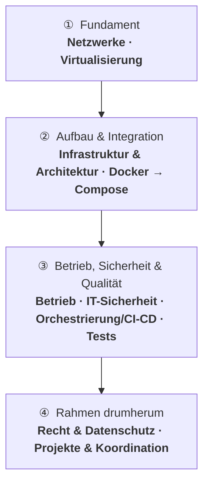

# Fahrplan – wo fange ich an?

Diese Seite ist deine **Landkarte** durch den ganzen Kurs. Sie beantwortet drei Fragen auf einmal:

- **Was zuerst?** – die sinnvolle Reihenfolge, weil viele Themen aufeinander aufbauen.
- **Was ist am wichtigsten?** – welche Themen prüfungsrelevant sind und welche eher die Praxis schärfen.
- **Wie hängt alles zusammen?** – welcher Block dir das Fundament für den nächsten legt.

!!! tip "Kein Pflicht-Marathon"
    Du musst nicht stur von oben nach unten durch. Der Fahrplan zeigt dir die **empfohlene** Route. Wenn dich ein Thema besonders interessiert oder im Job gerade brennt, spring hin – komm aber für die **prüfungsrelevanten** Themen auf jeden Fall zurück.

---

## So liest du den Fahrplan

Jedes Thema ist mit einer kleinen Ampel gekennzeichnet:

| Ampel | Bedeutung | Was das für dich heißt |
|-------|-----------|------------------------|
| Prüfungsrelevant | Kerninhalt für die Prüfung | Hier solltest du wirklich sattelfest sein. Diese Themen tauchen erfahrungsgemäß in jeder Form von Aufgabe auf. |
| Vertiefung | Baut darauf auf, vertieft das Verständnis | Solltest du beherrschen. Kann geprüft werden, ist aber nicht der absolute Kern. |
| Praxis | Vor allem zum Anwenden, optional für die Prüfung | Fürs Anfassen und Selbermachen. Wertvoll für die Praxis, aber selten direkt prüfungsentscheidend. |

!!! note "Warum diese Einteilung?"
    Manche Blöcke sind bewusst Hands-on – sie geben dir **Praxisgefühl** (z. B. die Gruppen-Übungen mit Docker). Andere legen das **theoretische Fundament**, auf dem die Prüfung aufbaut. Die Ampel hilft dir, deine Zeit klug einzuteilen: erst die **prüfungsrelevanten** Themen sichern, dann die **Vertiefungen** und die **Praxis**-Themen nach Lust und Zeit.

---

## Die Route auf einen Blick

Lies die Karte **von oben nach unten**: vier Phasen, die aufeinander aufbauen. Fang beim **Fundament** an (Netzwerke, Virtualisierung) – es trägt alles Weitere – und arbeite dich Phase für Phase nach unten. Welches Thema in welcher Phase liegt, steht direkt darunter.

---

## In welcher Reihenfolge lernen?

=== "① Fundament"
    Ohne diese zwei Blöcke hängt der Rest in der Luft. Sie liefern das Vokabular und die mentalen Modelle für alles Weitere.

    1. [Netzwerke](netzwerke/index.md) &nbsp; Prüfungsrelevant
    2. [Virtualisierung](virtualisierung/index.md) &nbsp; Prüfungsrelevant

=== "② Aufbau & Integration"
    Jetzt baust du auf dem Fundament auf: Wie plant man Infrastruktur und wie verpackt man Anwendungen in Container?

    3. [Infrastruktur & Architektur](infrastruktur-planung/index.md) &nbsp; Prüfungsrelevant
    4. [Docker – Einführung](docker/index.md) &nbsp; Prüfungsrelevant
    5. [Docker – Aufbau](docker-aufbau/index.md) &nbsp; Vertiefung
    6. [Docker Compose](docker-compose/index.md) &nbsp; Vertiefung

=== "③ Betrieb, Sicherheit & Qualität"
    Ein System läuft – und jetzt? Hier geht es um Dauerbetrieb, Absicherung und Prüfung. Das Herzstück der Prüfung.

    7. [Orchestrierung & Verteilung](orchestrierung/index.md) &nbsp; Vertiefung
    8. [CI/CD mit GitHub Actions](ci-cd/index.md) &nbsp; Vertiefung
    9. [Betrieb & Verfügbarkeit](betrieb/index.md) &nbsp; Prüfungsrelevant
    10. [IT-Sicherheit & Risiko](it-sicherheit/index.md) &nbsp; Prüfungsrelevant
    11. [Tests & Qualität](testen-qualitaet/index.md) &nbsp; Vertiefung

=== "④ Rahmen drumherum"
    Die organisatorische und rechtliche Klammer um die Technik. Wichtig, um Lösungen sauber einzuordnen und zu übergeben.

    12. [Recht & Datenschutz](recht-organisation/index.md) &nbsp; Vertiefung
    13. [Projekte & Koordination](projektmanagement/index.md) &nbsp; Vertiefung

=== "Dazwischen: Praxis"
    Die Hands-on-Blöcke schiebst du dort ein, wo sie didaktisch passen – sie wiederholen und festigen das Gelernte.

    - [Docker – Vertiefung](docker-vertiefung/index.md) &nbsp; Praxis &nbsp;– nach *Docker – Aufbau*
    - [Praxis: Docker Escape Room](docker-escape-room/index.md) &nbsp; Praxis &nbsp;– vor *Docker Compose*
    - [Praxis: Mission Control](docker-compose-mission-control/index.md) &nbsp; Praxis &nbsp;– nach *Docker Compose*
    - [Docker für Profis](docker-profi/index.md) &nbsp; Praxis &nbsp;– wenn die Basics sitzen
    - [Git & GitHub](git/index.md) &nbsp; Praxis &nbsp;– jederzeit, Werkzeug für CI/CD und Doku

---

## Alle Themen auf einen Blick

Die vollständige Übersicht, gruppiert nach Themengebiet. „Schwerpunkt" sagt dir, ob ein Thema eher für die **Prüfung**, für die **Praxis** oder für beides zählt.

### Grundlagen & Integration

| Thema | Worum geht's | Wichtigkeit | Schwerpunkt |
|-------|--------------|:-----------:|-------------|
| [Netzwerke](netzwerke/index.md) | Das Fundament: OSI, IP, Routing, DNS, Protokolle, Industrie & Sicherheit | Prüfungsrelevant | Prüfung + Praxis |
| [Virtualisierung](virtualisierung/index.md) | Hypervisor, VMs, Multipass – Systeme kapseln | Prüfungsrelevant | Prüfung + Praxis |
| [Infrastruktur & Architektur](infrastruktur-planung/index.md) | Anforderungen, Architekturen, Speicher, Ressourcen, Lizenzen | Prüfungsrelevant | Prüfung |

### Container & Automatisierung

| Thema | Worum geht's | Wichtigkeit | Schwerpunkt |
|-------|--------------|:-----------:|-------------|
| [Docker – Einführung](docker/index.md) | Container vs. VM, Images, erste eigene Container | Prüfungsrelevant | Prüfung + Praxis |
| [Docker – Aufbau](docker-aufbau/index.md) | Volumes, Umgebungsvariablen, Netzwerke | Vertiefung | Prüfung + Praxis |
| [Docker – Vertiefung](docker-vertiefung/index.md) | Fünf eigenständige Hands-on-Übungen | Praxis | v.a. Praxis |
| [Docker Compose](docker-compose/index.md) | Multi-Container-Stacks deklarativ | Vertiefung | Prüfung + Praxis |
| [Orchestrierung & Verteilung](orchestrierung/index.md) | Softwareverteilung, Kubernetes-Grundlagen | Vertiefung | Prüfung |
| [Docker für Profis](docker-profi/index.md) | Best Practices, Image-Optimierung, Scanning | Praxis | v.a. Praxis |
| [CI/CD mit GitHub Actions](ci-cd/index.md) | Vom manuellen Push zur automatischen Pipeline | Vertiefung | Prüfung + Praxis |

### Betrieb & Sicherheit

| Thema | Worum geht's | Wichtigkeit | Schwerpunkt |
|-------|--------------|:-----------:|-------------|
| [Betrieb & Verfügbarkeit](betrieb/index.md) | Monitoring, Backup/Recovery, Hochverfügbarkeit, BCM | Prüfungsrelevant | Prüfung |
| [IT-Sicherheit & Risiko](it-sicherheit/index.md) | Schutzziele, Risikomanagement, ISMS, Vorfälle | Prüfungsrelevant | Prüfung |
| [Tests & Qualität](testen-qualitaet/index.md) | Testszenarien, Integrationstests, Optimierung, Übergabe | Vertiefung | Prüfung |

### Organisation & Projekte

| Thema | Worum geht's | Wichtigkeit | Schwerpunkt |
|-------|--------------|:-----------:|-------------|
| [Recht & Datenschutz](recht-organisation/index.md) | DSGVO, Datensicherheitskonzepte, Compliance, Verträge | Vertiefung | Prüfung |
| [Projekte & Koordination](projektmanagement/index.md) | Projektorganisation, Planung, Controlling, Schulung | Vertiefung | Prüfung |

### Praxis & Nachschlagen

| Thema | Worum geht's | Wichtigkeit | Schwerpunkt |
|-------|--------------|:-----------:|-------------|
| [Docker Escape Room](docker-escape-room/index.md) | Multi-Container-Challenge in der Gruppe | Praxis | v.a. Praxis |
| [Mission Control](docker-compose-mission-control/index.md) | Compose-Gruppenübung rund um eine Raumstation | Praxis | v.a. Praxis |
| [Git & GitHub](git/index.md) | Versionskontrolle, Branches, Pull Requests | Praxis | Praxis / Werkzeug |
| [Cheatsheets](cheatsheets/index.md) | Spickzettel für Multipass, Docker, Compose, Git | – | Hilfsmittel |
| [Glossar](glossar.md) | Alle Begriffe kompakt erklärt | – | Hilfsmittel |

---

## Wenn die Zeit knapp ist

!!! abstract "Die Kurzversion"
    Solltest du dich entscheiden müssen, womit du deine Zeit verbringst:

    1. **Zuerst alles, was Prüfungsrelevant ist** – der Kerninhalt für die Prüfung.
    2. **Dann die Vertiefung-Themen** – sie runden das Bild ab und sind oft die Brücke zwischen zwei prüfungsrelevanten Themen.
    3. **Die Praxis-Themen**, wenn Zeit und Lust da sind – sie machen dich praktisch sicher, sind aber kein Prüfungs-Schwerpunkt.

    Und ganz unabhängig von der Prüfung gilt: Die Praxis-Blöcke machen Spaß und lassen das Gelernte *klick* machen. Lass sie dir nicht entgehen, nur weil sie nicht prüfungszentral sind.
