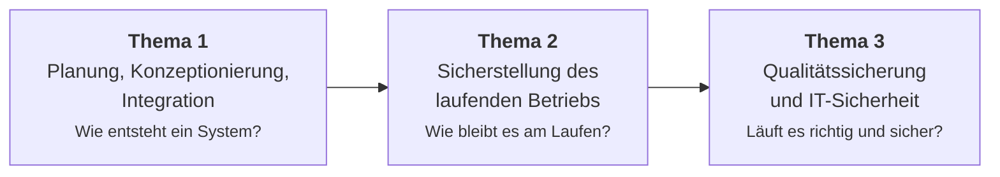
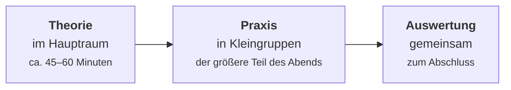

# Fahrplan

Diese Seite ist deine **Landkarte**. Sie zeigt, wie der Kurs aufgebaut ist, in welcher Reihenfolge die Themen kommen und warum gerade in dieser.

!!! abstract "Der Kurs in einem Satz"
    Drei Themenschwerpunkte, die aufeinander aufbauen: erst **planen und integrieren**, dann **betreiben**, dann **absichern und prüfen**.

---

## Die drei Schwerpunkte

-   :material-hammer-screwdriver:{ .lg .middle } __[Thema 1 – Planung und Integration](thema-1.md)__

    ---

    Netzwerke, Virtualisierung, Container und Infrastrukturplanung. Der größte Block – hier entsteht das Fundament für alles Weitere.

    [:octicons-arrow-right-24: Worum es geht](thema-1.md)

-   :material-server-network:{ .lg .middle } __[Thema 2 – Laufender Betrieb](thema-2.md)__

    ---

    Ausfallsicherheit, Backup und Wiederanlauf, Monitoring, Betriebsdaten, Softwareverteilung und Orchestrierung.

    [:octicons-arrow-right-24: Worum es geht](thema-2.md)

-   :material-shield-check-outline:{ .lg .middle } __[Thema 3 – Qualität und Sicherheit](thema-3.md)__

    ---

    Risikomanagement, Sicherheitskonzepte, Umgang mit Vorfällen, Testszenarien, Optimierung sowie Übergabe und Einweisung.

    [:octicons-arrow-right-24: Worum es geht](thema-3.md)

Dazu kommen zwei Schwerpunkte, die von anderer Seite unterrichtet werden, aber ebenfalls in der Prüfung vorkommen: **[Weitere Prüfungsthemen](weitere-themen.md)**.

---

## Die Reihenfolge im Detail

=== "Thema 1 · Planung und Integration"

    | # | Block | Worum es geht |
    |---|---|---|
    | 1 | [Netzwerke](netzwerke/index.md) | Das Fundament: Adressierung, Subnetting, Routing, DNS, Protokolle bis hin zur Industriekommunikation |
    | 2 | [Virtualisierung](virtualisierung/index.md) | Systeme entkoppeln: Hypervisor, virtuelle Maschinen, Werkzeuge |
    | 3 | [Docker](docker/index.md) | Container verstehen: Images, eigene Container bauen |
    | 4 | [Docker – Aufbau](docker-aufbau/index.md) | Daten, Konfiguration, Netzwerke zwischen Containern |
    | 5 | [Docker Compose](docker-compose/index.md) | Mehrere Dienste als ein Stack beschreiben und starten |
    | 6 | [Infrastruktur und Architektur](infrastruktur-planung/index.md) | Anforderungen, Architekturen, Speicher, Ressourcen, Lizenzen |

    **Warum diese Reihenfolge?** Netzwerke zuerst, weil ohne sie nichts kommuniziert. Virtualisierung führt die Idee der Kapselung ein, Container treiben sie weiter. Die Planung kommt zum Schluss, weil man erst entscheiden kann, wenn man die Bausteine kennt.

=== "Thema 2 · Laufender Betrieb"

    | # | Block | Worum es geht |
    |---|---|---|
    | 1 | [Betrieb und Verfügbarkeit](betrieb/index.md) | Ausfallrisiken, Redundanz, Backup, Wiederanlauf, Notbetrieb |
    | 2 | [Monitoring](monitoring-praxis/index.md) | Metriken sammeln, Dashboards bauen, Alarme auslösen |
    | 3 | [Softwareverteilung](orchestrierung/index.md) | Software automatisiert ausrollen, Deployment-Strategien |
    | 4 | [Kubernetes](kubernetes-praxis/index.md) | Container über einen Cluster betreiben und skalieren |
    | 5 | [CI/CD](ci-cd/index.md) | Automatisiert bauen, testen und ausliefern |

    **Warum diese Reihenfolge?** Erst das Konzept – was heißt Verfügbarkeit, was kostet ein Ausfall –, dann die Werkzeuge. Monitoring kommt früh, weil man ohne Messung nicht beurteilen kann, ob eine Maßnahme wirkt.

=== "Thema 3 · Qualität und Sicherheit"

    | # | Block | Worum es geht |
    |---|---|---|
    | 1 | [IT-Sicherheit und Risiko](it-sicherheit/index.md) | Schutzziele, Risikomanagement, ISMS, Sicherheitsvorfälle, Beweissicherung |
    | 2 | [Tests und Qualität](testen-qualitaet/index.md) | Testszenarien, Testdurchführung, Optimierung, Übergabe |

    **Warum am Schluss?** Beide Themen setzen alles Vorherige voraus. Eine Risikoanalyse braucht Systemverständnis, ein Testplan braucht ein System, das getestet werden kann.

=== "Werkzeuge · jederzeit"

    | Block | Worum es geht |
    |---|---|
    | [Git und GitHub](git/index.md) | Versionskontrolle: Änderungen nachvollziehen, im Team arbeiten |
    | [Cheatsheets](cheatsheets/index.md) | Befehlsübersichten zum schnellen Nachschlagen |
    | [Glossar](glossar.md) | Alle Fachbegriffe kompakt erklärt |

    Git ist kein eigener Prüfungsschwerpunkt, sondern ein Werkzeug. Es taucht auf, sobald wir mit Konfigurationsdateien und Pipelines arbeiten – du kannst es aber jederzeit vorziehen.

---

## Wie ein Kursabend abläuft

Die meisten Abende folgen demselben Muster:

**Theorie** – Begriffe, Zusammenhänge, das Warum. Kurz genug, dass Zeit zum Arbeiten bleibt.

**Praxis in Kleingruppen** – ihr geht in getrennte Räume und arbeitet an einer Aufgabe. Ihr helft euch gegenseitig, ich komme dazu, wenn etwas klemmt. Hier passiert das eigentliche Lernen.

**Gemeinsame Auswertung** – zurück im Hauptraum: Was ist herausgekommen, wo hat es gehakt, welche Lösungswege gab es? Genau dieses Besprechen macht den Unterschied zwischen „hat funktioniert" und „habe verstanden".

!!! tip "Was das für dich heißt"
    Die Praxisaufgaben sind kein Zusatz, sondern der Kern. Wenn du einen Abend verpasst, arbeite vor allem die Übung nach – die Theorie dazu steht ohnehin hier in den Unterlagen.

---

## Wie die Blöcke aufgebaut sind

Jeder Themenblock folgt derselben Gliederung. Wenn du dich einmal zurechtgefunden hast, findest du dich überall zurecht:

| Seitentyp | Was dich erwartet |
|---|---|
| **Überblick** | Worum es geht, was du lernst, wie die Seiten zusammenhängen |
| **Theorie** | Die Inhalte mit Erklärungen, Analogien und Diagrammen |
| **Praxis** | Schritt-für-Schritt-Anleitungen zum Mitmachen |
| **Übungen** | Aufgaben mit Musterlösung – meist gestaffelt nach Schwierigkeit |
| **Stolpersteine** | Was typischerweise schiefgeht und wie du es behebst |
| **Merksätze** | Die Kernaussagen des Blocks auf einer Seite |

---

## Wenn die Zeit knapp wird

!!! abstract "Die Prioritäten"
    1. **Die Theorie jedes Themas** – sie ist die Grundlage für die Prüfung, und die Prüfungsaufgaben fragen Verständnis ab, nicht Handgriffe.
    2. **Die Übungen mit Musterlösung** – wenn du sie nicht durchführen kannst, lies wenigstens Aufgabe und Lösung.
    3. **Die Stolperstein-Seiten** – sie sparen dir im Ernstfall Stunden.
    4. **Die Vertiefungen und Zusatzübungen** – wertvoll, aber verzichtbar, wenn die Zeit fehlt.

    Und unabhängig von der Prüfung: Die Praxisblöcke machen den Stoff greifbar. Lass sie dir nicht entgehen, nur weil sie nicht direkt abgefragt werden.

---

Wo du im Kurs gerade stehst und was organisatorisch gilt, steht in der **[Kursinfo](kurs/index.md)**. Was in der Prüfung auf dich zukommt, erklärt die Seite **[Die Prüfung](kurs/pruefung.md)**.
