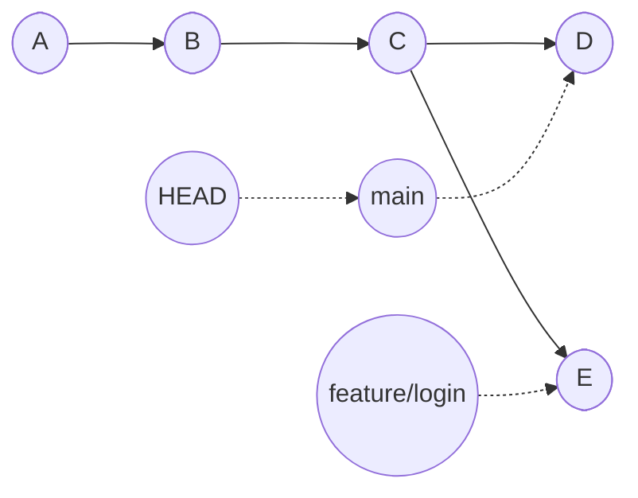
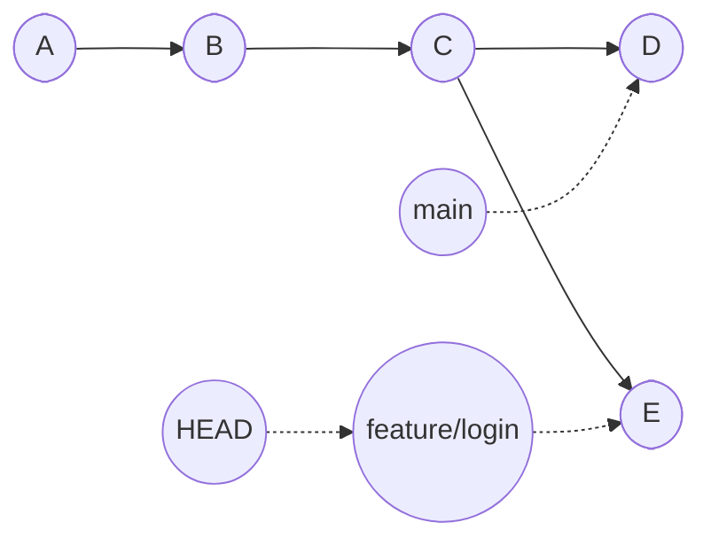
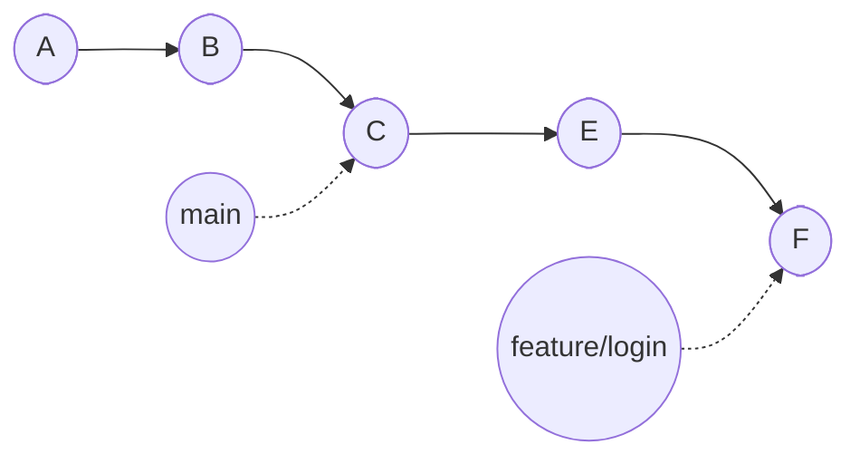
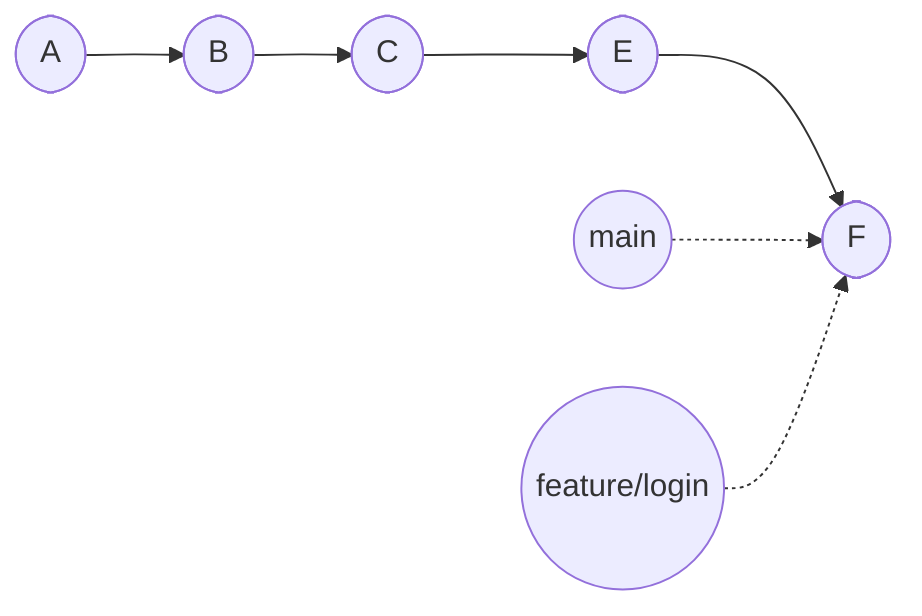
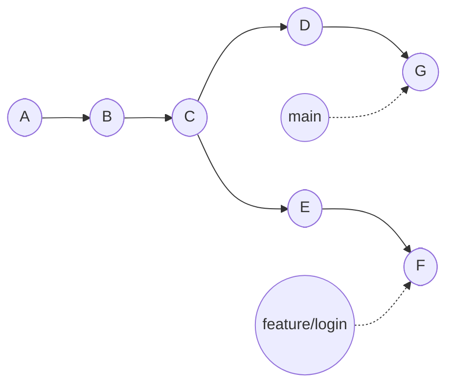
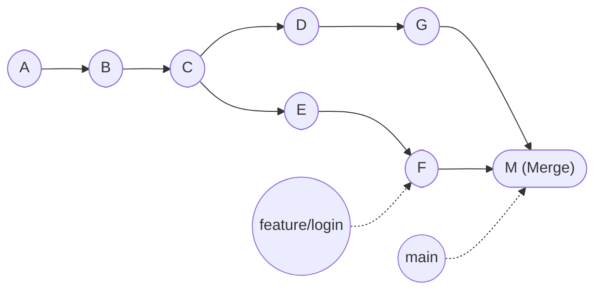
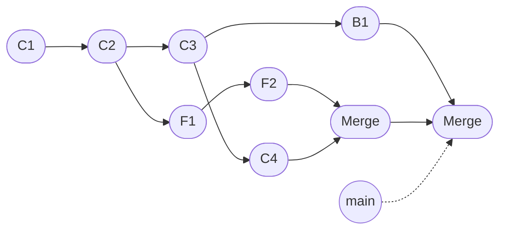

# Branches und Merge

!!! abstract "Lernziel"
    Nach dieser Seite kannst du:

    - erklären, wozu **Branches** überhaupt da sind
    - den Unterschied zwischen **Fast-Forward Merge** und **echtem Merge-Commit** beschreiben
    - benennen, in welcher Situation ein **Merge-Konflikt** entsteht und warum
    - eine kleine Branch-Geschichte auf Papier skizzieren, ohne ein Tool zu öffnen

---

## Warum Branches?

Stell dir vor, dein Projekt läuft. Es ist live. Es funktioniert. Jetzt willst du eine neue Funktion einbauen, sagen wir ein Login. Die Frage ist: **wie willst du daran arbeiten, ohne dass die laufende Version gefährdet wird?**

Drei schlechte Wege:

- **Du baust alles direkt in der Hauptlinie.** Solange du nicht fertig bist, hat das Projekt eine halbfertige Funktion. Bei jedem Stand riskierst du, dass etwas anderes kaputtgeht.
- **Du machst eine Kopie des ganzen Ordners.** Klassisch. Aber dann hast du zwei Welten und musst von Hand zusammenführen.
- **Du wartest, bis alles in einer einzigen Sitzung fertig ist.** Bei größeren Funktionen unrealistisch.

Der richtige Weg ist ein **Branch**.

!!! tip "Parallelwelten-Analogie"
    Du kennst das aus Filmen: an einem entscheidenden Punkt entscheidet sich die Geschichte für eine Variante. Was wäre, wenn die andere Variante auch existiert hätte? Manche Filme zeigen die beiden Welten parallel.

    Genau das macht ein Branch. Bis zu einem bestimmten Commit ist die Geschichte gleich. Ab dem Branch-Punkt gibt es **zwei parallele Linien**, die sich unabhängig voneinander weiterentwickeln. Später können sie sich entweder **wieder vereinen** (das ist Merge) oder eine der beiden bleibt einfach für sich stehen.

Sehr konkret heißt das: du arbeitest an deinem Login auf einem eigenen Branch. Die Hauptlinie bleibt unangetastet, läuft live weiter. Wenn das Login fertig und getestet ist, führst du beide Linien zusammen. Erst dann sieht die Hauptlinie das Login.

---

## Wie Branches technisch funktionieren

Ein Branch ist in Git eine **lächerlich einfache Sache**. Man stellt sich oft etwas Komplexes vor, aber technisch ist ein Branch nichts weiter als:

!!! quote "Branch in einer Zeile"
    Ein **Branch ist ein Name, der auf einen Commit zeigt**. Mehr nicht.

Klingt unglaublich, ist aber so. Wenn du einen Branch namens `feature/login` anlegst, wird in `.git` einfach eine Zeile eingetragen:

```text
feature/login → Commit h7i8j9k
```

Das war's. Kein zusätzliches Kopieren von Dateien, kein neuer Ordner. Nur ein Name auf einem Commit.

Das ist auch der Grund, warum Branches in Git **so blitzschnell** sind. Während du in älteren Versionsverwaltungen wie Subversion echte Kopien anlegen musst, ist ein Branch in Git ein Bruchteil einer Sekunde. Selbst hundert Branches kosten dich praktisch nichts.

---

## Was passiert beim Wechseln zwischen Branches?

Du hast zwei Branches:



Aktuell stehst du auf `main`, HEAD zeigt darauf. Wenn du jetzt auf `feature/login` wechselst, passiert Folgendes:

1. HEAD wird auf `feature/login` umgehängt.
2. Git ersetzt die Dateien in deinem **Working Tree** durch den Stand des Commits, auf den `feature/login` zeigt.



Dein Editor zeigt nun andere Dateien an, weil im Working Tree die Version von Commit E liegt statt Commit D. Du hast nichts kopiert. Du hast nicht „den Branch gewechselt" in dem Sinne, dass du zwischen Ordnern hin- und herspringst. Du hast nur **den Zeiger HEAD umgehängt**.

!!! warning "Was passiert mit ungespeicherten Änderungen?"
    Wenn du noch unkommittete Änderungen im Working Tree hast und versuchst, den Branch zu wechseln, weigert sich Git, **damit nichts verloren geht**. Du musst entweder:

    - die Änderungen zuerst committen,
    - sie mit `git stash` zwischenparken (wir kommen später drauf), oder
    - sie wegwerfen mit `git restore`.

    Diese Sicherheitsbremse ist Absicht und einer der wichtigsten Schutzmechanismen von Git.

---

## Merge: zwei Linien wieder zusammenführen

Irgendwann ist deine Login-Funktion fertig. Jetzt willst du sie zurück in die Hauptlinie bringen. Das nennt sich **Merge**.

Es gibt zwei wichtige Fälle, die sich unterscheiden:

### Fall 1: Fast-Forward Merge

Stell dir vor, du hast deinen Branch angelegt, an ihm gearbeitet, und auf `main` ist in der Zwischenzeit **nichts passiert**.



Wenn du jetzt `feature/login` in `main` mergst, kann Git eine **Abkürzung** nehmen: es schiebt den `main`-Zeiger einfach auf den Commit F, weil er ohnehin „weiter vorne" auf derselben Linie liegt.



Beide Branches zeigen jetzt auf denselben Commit F. Es entsteht **kein neuer Commit**. Das nennt sich **Fast-Forward Merge** („schneller Vorlauf").

Charakteristisch: in der Historie sieht man später nicht mehr, dass es überhaupt einen Branch gab. Es sieht aus, als wäre alles auf einer Linie passiert.

### Fall 2: Echter Merge mit Merge-Commit

Anderer Fall: während du auf `feature/login` gearbeitet hast, hat jemand anderes (oder du selbst) auch auf `main` weitergearbeitet.



Jetzt gibt es zwei Linien, die sich seit Commit C **wirklich** auseinanderentwickelt haben. Ein Fast-Forward ist nicht möglich, weil keiner der beiden Stände eine Erweiterung des anderen ist.

In diesem Fall erzeugt Git einen **Merge-Commit**, der **zwei Vorgänger** hat:



Der Merge-Commit M ist besonders: er hat **zwei Eltern** (G und F). In der Historie bleibt damit für immer sichtbar, dass hier zwei Linien zusammengeflossen sind.

!!! info "Was ist besser?"
    Beide Varianten sind in Ordnung. Faustregeln:

    - **Fast-Forward** ist sauberer in der Historie, weil keine zusätzlichen Commits entstehen. Gut für kleine, kurzlebige Branches.
    - **Echter Merge-Commit** macht später nachvollziehbar, dass es überhaupt einen Feature-Branch gab. Gut für größere Features, Reviews und Audits.

    Viele Teams erzwingen über GitHub-Einstellungen, dass Branches **immer mit einem Merge-Commit** zusammengeführt werden – das macht die Geschichte lesbarer. Andere Teams nutzen `--ff-only` und erzwingen das Gegenteil. Es ist Geschmackssache und Teamkultur.

---

## Merge-Konflikte: wenn Git nicht entscheiden kann

Bisher haben wir so getan, als ob Merges immer problemlos durchlaufen. Manchmal tun sie das nicht. Genau dann sprechen wir von einem **Merge-Konflikt**.

Ein Konflikt entsteht, wenn **dieselbe Stelle** in **derselben Datei** auf beiden Branches **unterschiedlich geändert** wurde. Git sagt dann sinngemäß: „Ich weiß nicht, welche Version ich nehmen soll. Entscheide du."

!!! tip "Koch-Analogie"
    Stell dir vor, du und eine Freundin teilt euch ein Rezept. Du sagst „salzen, dann pfeffern". Sie sagt „pfeffern, dann salzen". Beim Zusammenführen euer beider Versionen weiß das Rezept nicht, welche Reihenfolge gilt.

    Das ist ein Merge-Konflikt. Niemand hat „falsch" gearbeitet. Beide Versionen sind technisch okay. Aber zusammen ergeben sie keine eindeutige Lösung. Jemand muss entscheiden.

### Wie sieht ein Konflikt aus?

Wenn ein Konflikt auftritt, schreibt Git die betroffene Datei so um, dass beide Versionen sichtbar sind, mit Markierungen drumherum:

```text
Willkommen zu meinem Projekt!

<<<<<<< HEAD
Dieses Tool berechnet die Fläche eines Kreises.
=======
Dieses Tool berechnet das Volumen einer Kugel.
>>>>>>> feature/volumen

Viel Spaß beim Testen.
```

Du siehst:

- `<<<<<<< HEAD` – ab hier kommt die Version, die in deinem aktuellen Branch lag.
- `=======` – Trennlinie.
- `>>>>>>> feature/volumen` – bis hier kommt die Version aus dem anderen Branch.

Deine Aufgabe als Mensch:

1. Die drei Markerlinien aus der Datei entfernen.
2. Dazwischen den Inhalt so anpassen, **wie er wirklich aussehen soll** – das kann eine der beiden Versionen sein oder eine Kombination beider.
3. Speichern, `git add` auf die Datei, dann `git commit`.

Mehr dazu in der [Praxis 3](praxis-merge-konflikt.md). Da provozieren wir einen Konflikt absichtlich und lösen ihn.

---

## Wann entsteht ein Konflikt – und wann nicht?

Damit du ein gutes Bauchgefühl bekommst:

| Situation | Konflikt? |
|-----------|-----------|
| Du änderst Datei A, Freundin ändert Datei B | nein |
| Du änderst Zeile 10 in Datei A, Freundin Zeile 50 in Datei A | nein |
| Du änderst Zeile 10, Freundin auch Zeile 10 derselben Datei | **ja** |
| Du löschst die Datei, Freundin ändert sie | **ja** |
| Du benennst die Datei um, Freundin ändert sie | **ja** (komplizierte Variante) |

Faustregel: **Konflikte sind kein Bug, sondern eine Frage von Git.** Wenn zwei Personen wirklich an derselben Stelle gearbeitet haben, muss am Ende jemand entscheiden, was gilt.

Und – das ist wichtig – **Konflikte verlierst du nicht.** Git geht erst dann durch, wenn du sie aktiv aufgelöst hast. Solange du den Konflikt nicht behoben hast, kannst du nichts kaputtmachen.

---

## Branches im echten Leben: typische Muster

Auf vielen realen Projekten hast du ungefähr dieses Bild:



Lesart:

- `main` ist die Hauptlinie. Hier landet nur Geprüftes.
- Aus `main` zweigen **Feature-Branches** ab (`F1 → F2`) und **Bugfix-Branches** (`B1`), die später wieder hinein-mergen.
- Während eines Feature-Branches kann es auch passieren, dass auf `main` neue Commits dazukommen (`C4`). Das ist okay.

Damit das übersichtlich bleibt, geben Teams ihren Branches **sprechende Namen**:

```text
feature/login
feature/bezahlsystem
bugfix/crash-bei-leerem-feld
docs/readme-aktualisieren
release/v1.2
```

Das ist Konvention, nicht Pflicht. Git erlaubt jeden Branch-Namen, der keine Sonderzeichen enthält.

---

## Was du jetzt wissen solltest

- Ein **Branch** ist nur ein Name, der auf einen Commit zeigt. Branches sind in Git extrem billig.
- **HEAD** wandert, wenn du den Branch wechselst – und Git tauscht die Dateien im Working Tree entsprechend aus.
- Ein **Fast-Forward Merge** schiebt den Branch-Zeiger nur weiter, ohne neuen Commit.
- Ein **echter Merge** erzeugt einen **Merge-Commit mit zwei Eltern**.
- Ein **Konflikt** entsteht, wenn dieselbe Stelle in derselben Datei in beiden Branches anders aussieht. Git fragt dich, was gelten soll.
- Konflikte sind normal. Sie sind kein Zeichen, dass etwas kaputt ist.

---

## Merksatz

!!! success "Merksatz"
    > **Ein Branch ist nur ein Name auf einem Commit. Merge fließt zwei Linien zusammen, entweder als Fast-Forward (Zeiger schieben) oder als echter Merge-Commit (zwei Eltern). Ein Konflikt bedeutet nur: zwei Stellen sind unterschiedlich geändert worden, Git fragt dich, was gilt.**

---

## Weiterlesen

- [Remote und GitHub](remote-und-github.md): wie Branches geteilt werden
- [Praxis 2: Branches anlegen und mergen](praxis-branches.md): das Konzept in deinem eigenen Repo erleben
- [Praxis 3: Merge-Konflikt lösen](praxis-merge-konflikt.md): einen Konflikt provozieren und ihn sauber auflösen
