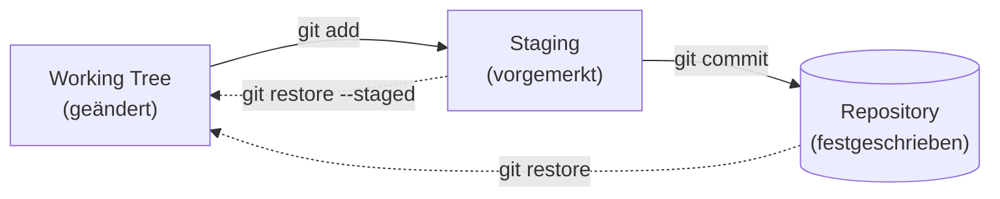
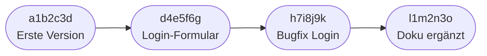
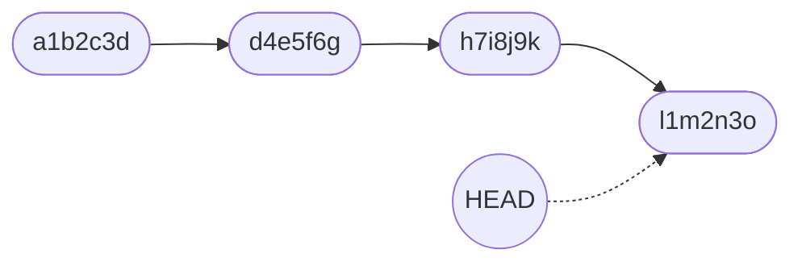
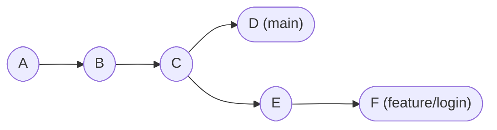
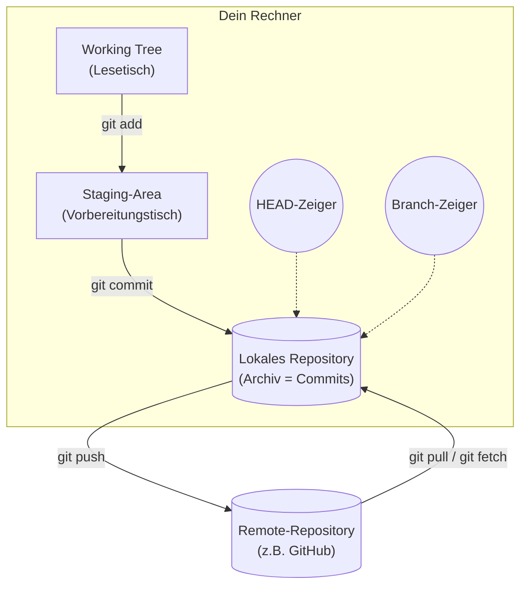

# Grundbegriffe von Git

!!! abstract "Lernziel"
    Nach dieser Seite kannst du:

    - die Begriffe **Repository**, **Working Tree**, **Staging-Area**, **Commit**, **HEAD** und **Branch** auseinanderhalten
    - erklären, was ein Commit **enthält** und was er **nicht** enthält
    - die **drei Zustände einer Datei** in Git benennen
    - die **Bibliotheks-Analogie** verwenden, um jemandem Git in 60 Sekunden zu erklären

---

## Warum diese Seite vor der Praxis kommt

Git hat ein paar Begriffe, die in der ersten Stunde alle gleichzeitig auf dich einprasseln, wenn du ohne Vorbereitung loslegst. Wer ohne diese Begriffe arbeitet, lernt Git auswendig, aber versteht es nicht. Wer die Begriffe einmal sauber verinnerlicht hat, versteht jeden weiteren Befehl praktisch von selbst.

Die Seite ist deshalb **bewusst ohne Befehle**. Wir reden über die Konzepte. Befehle kommen in [Praxis 1](praxis-erste-schritte.md).

---

## Die Bibliotheks-Analogie

!!! tip "Eine kleine Bibliothek im Kopf"
    Stell dir vor, du betreibst eine kleine Bibliothek mit einem einzigen Buch. Dieses Buch ist dein **Projekt**.

    Die Bibliothek hat drei Bereiche:

    1. **Ein Lesetisch.** Hier liegt das Buch offen. Du blätterst, du schreibst Randnotizen, du streichst Zeilen durch. Alles, was du hier tust, ist „in Arbeit". Niemand sonst sieht das.
    2. **Ein Vorbereitungstisch.** Wenn du eine Änderung wirklich aufnehmen willst, legst du sie auf den Vorbereitungstisch. Du sammelst hier nur das, was als **nächster offizieller Stand** ins Archiv soll. Du kannst Sachen vom Vorbereitungstisch auch wieder zurück auf den Lesetisch nehmen.
    3. **Ein Archiv.** Wenn du dich entschieden hast, legt der Bibliothekar alles vom Vorbereitungstisch als **neue Version** im Archiv ab. Mit Datum, mit deinem Namen, mit einer kurzen Beschreibung, was sich geändert hat. Das Archiv ist **schreibgeschützt**. Was einmal drin ist, bleibt drin.

Diese drei Bereiche heißen in Git:

| Bibliothek | Git |
|------------|-----|
| Lesetisch | **Working Tree** (manchmal auch „Working Directory") |
| Vorbereitungstisch | **Staging-Area** (auch „Index") |
| Archiv | **Repository** (genauer: die Sammlung aller **Commits**) |

Wenn du diese drei Bereiche im Kopf hast, ergibt sich der Rest fast von selbst.

---

## Die drei Zustände einer Datei

In jedem Moment ist jede Datei in deinem Projekt in **genau einem** dieser drei Zustände:



| Zustand | Bedeutung |
|---------|-----------|
| **modified** | Du hast die Datei im Working Tree geändert. Git weiß davon, aber sie ist noch nicht vorgemerkt. |
| **staged** | Du hast `git add` benutzt. Die Datei liegt auf dem Vorbereitungstisch und wartet auf den nächsten Commit. |
| **committed** | Die Datei ist Teil eines Commits, also im Archiv. |

!!! info "Warum drei Stufen, nicht zwei?"
    Auf den ersten Blick wirkt der Staging-Schritt überflüssig. „Warum kann ich nicht direkt vom Lesetisch ins Archiv?"

    Antwort: damit du **kontrollieren** kannst, was in einen Commit hineinkommt. Wenn du an drei verschiedenen Sachen gleichzeitig gearbeitet hast (Bugfix, neue Funktion, Tippfehler), willst du sie nicht in einen einzigen Commit pressen. Du fügst gezielt nur die Dateien zum Vorbereitungstisch hinzu, die zusammengehören. Dann committest du, machst dann den nächsten Stapel auf dem Vorbereitungstisch fertig und committest erneut.

    Ein Commit, der drei Sachen gleichzeitig macht, ist später nur schwer zu lesen. Die Staging-Area zwingt dich nicht dazu, sauber zu committen – aber sie macht es möglich.

---

## Repository

!!! quote "Definition"
    Ein **Repository** (kurz: **Repo**) ist die komplette Verwaltungseinheit eines Projekts. Es enthält das Archiv aller Commits, alle Branches, alle Tags, die Konfiguration und die aktuellen Arbeitsdateien.

Technisch ist ein Repository erst mal **ein Ordner mit einem versteckten Unterordner namens `.git`**. Dieser `.git`-Ordner enthält alles, was Git über das Projekt weiß. Solange `.git` existiert, ist dein Ordner ein Repository. Löschst du `.git`, ist die ganze Versionsgeschichte weg – die normalen Dateien sind aber unverändert da.

```text
mein-projekt/
├── .git/                # ← das macht es zum Repository
│   ├── HEAD
│   ├── config
│   ├── objects/
│   └── refs/
├── README.md            # deine normalen Projektdateien
└── src/
```

!!! warning ".git ist heilig"
    Fass den `.git`-Ordner nicht direkt an, solange du keine konkrete Idee hast, was du tust. Alle Operationen passieren über `git`-Befehle.

### Lokales vs. Remote-Repository

Ein Repository kann an zwei Stellen liegen:

- **Lokal** – auf deinem Rechner.
- **Remote** – auf einem Server, typischerweise GitHub, GitLab oder Bitbucket.

Beide enthalten dieselbe Art von Daten. Geteilt wird über `git push` (lokal → remote) und `git pull` (remote → lokal). Mehr dazu auf der Seite [Remote und GitHub](remote-und-github.md).

---

## Commit

!!! quote "Definition"
    Ein **Commit** ist ein vollständiger Schnappschuss deines Projekts zu einem bestimmten Zeitpunkt. Plus eine Beschreibung, plus die Information, wer ihn gemacht hat, plus den Zeitpunkt.

Du erinnerst dich an die Spielstand-Analogie? Genau das ist ein Commit.

Ein Commit enthält:

- den **kompletten Zustand aller Dateien**, die zu diesem Zeitpunkt im Repository sind
- eine **Commit-Message**, also deine Beschreibung
- den **Autor** (Name + E-Mail)
- einen **Zeitstempel**
- die **ID des Vorgänger-Commits** (das macht die Historie zur Kette)
- eine eigene **eindeutige ID** – ein 40-stelliger Hash, z.B. `7f69375bd0a...`

Diese ID nennt sich **Commit-SHA** oder einfach **Hash**. Sie ist weltweit eindeutig und ändert sich nie. Wenn du genau diesen einen Commit ansprechen willst, nimmst du die SHA. Im Alltag reichen meistens die ersten 7 Zeichen.



Jeder Commit zeigt auf seinen Vorgänger. Daraus entsteht eine **Kette**, die du in jeder Richtung durchlaufen kannst.

### Was ist eine gute Commit-Message?

Da Commits den **Warum**-Teil deiner Historie tragen, ist die Message wichtiger, als die meisten Anfänger denken. Faustregeln:

| Schlecht | Besser |
|----------|--------|
| `update` | `Login-Formular: Validierung für E-Mail-Feld` |
| `fix` | `Crash beim leeren Eingabefeld behoben` |
| `wip` | `Erste Skizze des Bezahl-Flows, noch ohne Tests` |
| `asdf` | `Tippfehler in der README` |

Faustregel: **die Message in der ersten Zeile sollte den Satz „Wenn ich diesen Commit anwende, dann …" sinnvoll vervollständigen.** Auf Deutsch oder Englisch ist beides okay, Hauptsache konsistent innerhalb eines Projekts.

---

## HEAD

!!! quote "Definition"
    **HEAD** ist Gits Wort für „**der Commit, auf dem du gerade stehst**". HEAD ist immer da. HEAD ist ein **Zeiger**.

Wenn du dir die Commits als Kette vorstellst, ist HEAD eine kleine Markierung, die immer auf einen davon zeigt. Normalerweise auf den allerneuesten Commit deines aktuellen Branches.



Wenn du einen neuen Commit machst, rückt HEAD automatisch einen Schritt weiter. Wenn du in der Historie zurückspringst, rückt HEAD zurück. HEAD ist also dein **„du bist hier"-Schild** in der Historie.

!!! info "Wozu brauchst du das?"
    Im Alltag denkst du nicht oft an HEAD. Aber er taucht in vielen Befehlen auf:

    - `git log` zeigt die Historie ab HEAD rückwärts.
    - `git diff` vergleicht ohne weitere Angaben deinen Working Tree mit HEAD.
    - `git reset HEAD~1` heißt: „rücke einen Schritt vor dem aktuellen Commit zurück".

    Sobald du Branches verwendest, wird HEAD wichtig: HEAD weiß auch, auf **welchem Branch** du gerade bist.

---

## Branch

!!! quote "Definition"
    Ein **Branch** ist eine **eigene Entwicklungslinie**. Technisch ist er einfach ein **benannter Zeiger auf einen Commit**.

Wir kommen gleich auf der Seite [Branches und Merge](branches-und-merge.md) ausführlich darauf zu sprechen. Hier nur der Grundgedanke:

Bisher hatten wir eine einzige Kette von Commits. Sobald du sagst „ich will eine Variante ausprobieren, ohne mein bisheriges Ergebnis kaputtzumachen", brauchst du eine zweite Kette. Die fängt an dem Punkt an, wo du gerade stehst und entwickelt sich von dort eigenständig weiter:



Hier hast du zwei Branches:

- `main` – die Hauptlinie, vermeintlich „die offizielle".
- `feature/login` – ein eigener Versuch, der bei Commit C abgezweigt ist.

Jeder Branch ist also einfach ein **Name**, der auf einen Commit zeigt. Wenn du auf einem Branch commitest, wandert der Branch-Zeiger mit. HEAD wandert mit. Der jeweils andere Branch bleibt unbehelligt.

Standard-Branch heißt heute fast überall **`main`** (früher `master`, das wurde seit ca. 2020 zunehmend umbenannt).

---

## Alles zusammen: das mentale Modell

Wenn du diese Begriffe einmal so vor dir liegen hast, ist das mentale Modell von Git verblüffend einfach:



Das ist das gesamte Bild. Alles Weitere (Branches, Merge, Konflikte, Remote-Workflows) sind nur **Variationen** auf dieses Grundmuster.

---

## Ein Wort zu „Working Directory" vs. „Working Tree"

Manchmal liest du „Working Directory" statt „Working Tree". Beides meint dasselbe: deine ganz normalen Dateien im Projektordner, so wie sie gerade auf der Festplatte liegen. Wir bleiben in diesem Kurs bei **Working Tree**, weil Git selbst diesen Begriff in den meisten Befehlsausgaben verwendet.

---

## Was du jetzt wissen solltest

- Ein **Repository** ist ein Ordner mit einem `.git`-Unterordner. Das `.git` macht den Unterschied.
- Eine Datei ist in genau einem von drei Zuständen: **modified**, **staged** oder **committed**.
- Ein **Commit** ist ein vollständiger Schnappschuss plus Metadaten plus eine Beschreibung.
- **HEAD** ist Gits „du bist hier"-Markierung.
- Ein **Branch** ist nur ein Name auf einem Commit, mehr nicht.
- Das gesamte mentale Modell hat drei Ebenen: **Working Tree → Staging → Repository**.

---

## Merksatz

!!! success "Merksatz"
    > **Working Tree (Lesetisch) → Staging (Vorbereitungstisch) → Repository (Archiv). Ein Commit ist ein Schnappschuss in diesem Archiv. HEAD zeigt, wo du gerade stehst. Ein Branch ist nur ein Name auf einem Commit.**

---

## Weiterlesen

- [Branches und Merge](branches-und-merge.md): wie aus einer Linie mehrere werden und wieder zusammenfließen
- [Git installieren](installation.md): Setup, damit du gleich loslegen kannst
- [Praxis 1: erste Schritte lokal](praxis-erste-schritte.md): diese Begriffe in deinem ersten eigenen Repo erleben
