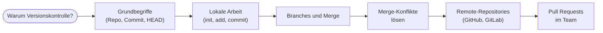

# Git und GitHub – Versionskontrolle für die Praxis

Bisher hast du Container gebaut, Stacks beschrieben und Pipelines geplant. Spätestens in [Block 6 (CI/CD)](../ci-cd/index.md) merkst du: ohne **Git** geht es nicht. Eine Pipeline lebt davon, dass jemand pusht. Eine Workflow-Datei liegt im Repo. Ein Tag ist ein Git-Tag.

Dieser Block holt das jetzt sauber nach. Wir starten ganz bei den Basics. Du legst dein erstes Repository an, machst deinen ersten Commit, baust deine ersten Branches und merkst hautnah, wozu das alles gut ist. Am Ende kannst du nicht nur auf GitHub pushen, sondern verstehst auch, was dabei eigentlich passiert.

!!! abstract "Was du in diesem Block lernst"
    - die **Idee der Versionskontrolle** mit eigenen Worten erklären
    - die Begriffe **Repository, Working Tree, Staging, Commit, Branch, HEAD** sicher verwenden
    - lokal mit `git init`, `git add`, `git commit`, `git log`, `git diff` arbeiten
    - **Branches** anlegen, wechseln und zusammenführen – auch bei Konflikten
    - ein **Remote-Repository** auf GitHub erstellen oder ein lokales Repo dorthin schieben
    - mit **Pull Requests** im Team arbeiten und Reviews einsammeln
    - benennen, was **GitLab**, Bitbucket und Gitea sind und wo sie sich von GitHub unterscheiden

---

## Bezug zum bisherigen Kurs

Der Git-Block sitzt absichtlich **zwischen Docker-Profi und CI/CD**. Hier ist warum:

| Bisheriger Block | Was er nutzt |
|------------------|--------------|
| Docker-Block 1–5 | Lokale Dateien, lokales Bauen, kein Remote nötig |
| Docker für Profis | Best Practices, Multi-Stage, Trivy – noch lokal |
| **dieser Block** | **Versionskontrolle, Remote, GitHub** |
| CI/CD-Einführung | Lebt komplett auf GitHub und braucht alles aus diesem Block |

Wenn du den CI/CD-Block schon angefangen hast: die Schritte „GitHub-Repo anlegen", „lokal klonen", „pushen" werden hier ausführlich erklärt. Du kannst die Praxis-Seiten dieses Blocks als verlängerte Schritt-für-Schritt-Anleitung für den Einstieg in CI/CD lesen.

---

## Seiten in diesem Block

| Seite | Inhalt | Art |
|-------|--------|-----|
| [Warum Git?](warum-git.md) | Das „FINAL_v2_wirklich_final.docx"-Problem, Spielstand-Analogie, was Versionskontrolle löst | Theorie |
| [Grundbegriffe](grundbegriffe.md) | Repository, Working Tree, Staging, Commit, HEAD – mit Bibliotheks-Analogie | Theorie |
| [Branches und Merge](branches-und-merge.md) | Parallelwelten in Git, fast-forward vs. echter Merge, Konflikte verstehen | Theorie |
| [Remote und GitHub](remote-und-github.md) | Verteilte Versionskontrolle, was GitHub, GitLab, Bitbucket und Gitea unterscheiden | Theorie |
| [Git installieren](installation.md) | Windows 11, macOS und Linux Schritt für Schritt, plus `git config` | Setup |
| [Praxis 1: erste Schritte lokal](praxis-erste-schritte.md) | `git init`, `add`, `commit`, `log`, `diff`, `restore` an einem eigenen Repo | Praxis |
| [Praxis 2: Branches anlegen und mergen](praxis-branches.md) | Branch anlegen, wechseln, mergen, fast-forward vs. echter Merge | Praxis |
| [Praxis 3: Merge-Konflikt lösen](praxis-merge-konflikt.md) | Konflikt absichtlich provozieren und sauber auflösen | Praxis |
| [Praxis 4: Repo auf GitHub erstellen und klonen](praxis-github-neu.md) | Der „GitHub zuerst, dann clone"-Weg | Praxis |
| [Praxis 5: lokales Repo zu GitHub bringen](praxis-lokal-zu-github.md) | Der „lokal zuerst, dann remote add"-Weg | Praxis |
| [Praxis 6: Pull Request über Branch](praxis-pull-request.md) | Feature-Branch pushen, PR öffnen, mergen, Branch aufräumen | Praxis |
| [Übungen](uebungen.md) | 🟢🟡🔴🏆 Vier Schwierigkeitsgrade zum Vertiefen | Training |
| [Gruppenübung: Repo gemeinsam nutzen](gruppen-uebung.md) | Vier Teilnehmer, ein Repo, ein provozierter Konflikt – 60 Minuten Gruppenarbeit | Training |
| [Stolpersteine](stolpersteine.md) | Typische Fehler bei Git, Branches, Push, Pull, Konflikten | Referenz |
| [Merksätze](merksaetze.md) | Die Kern-Sätze des Blocks auf einer Seite | Referenz |

---

## Voraussetzungen

- Ein **Terminal**, das du bedienen kannst. Auf Windows 11 reicht die **PowerShell** oder die **Git Bash**, die mit Git automatisch mitkommt.
- Ein **Editor** deiner Wahl. VSCode, Notepad++, vim – egal. Wichtig ist nur, dass er Dateien als reinen Text speichert.
- Ein **GitHub-Account** spätestens ab Praxis 4. Anlegen unter <https://github.com/signup>, kostenlos.
- Etwa **zwei Stunden** Zeit für die Theorie und die ersten drei Praxis-Seiten. Die restlichen Praxis-Seiten plus Gruppenübung schaffst du in einer zweiten Sitzung.

!!! info "Kein Vorwissen zu Git nötig"
    Wir starten bei null. Wenn du Git schon kennst, kannst du die ersten beiden Theorie-Seiten überspringen und direkt mit den [Branches](branches-und-merge.md) anfangen.

---

## Roter Faden

Erst verstehen, **warum** wir das tun. Dann **wie** Git denkt. Dann lokal arbeiten. Dann Branches. Dann erst die Welt da draußen mit GitHub.

---

## Leitfrage

> **Wie schaffe ich es, dass die Historie meiner Arbeit nachvollziehbar bleibt, dass ich jederzeit zurückspringen kann, dass mehrere Personen parallel an demselben Projekt arbeiten – und dass am Ende trotzdem ein klarer Stand herauskommt?**

Genau das beantwortet Git. Am Ende dieses Blocks hast du das mit eigenen Händen einmal durchgespielt. Vom ersten Commit bis zum ersten Pull Request.
