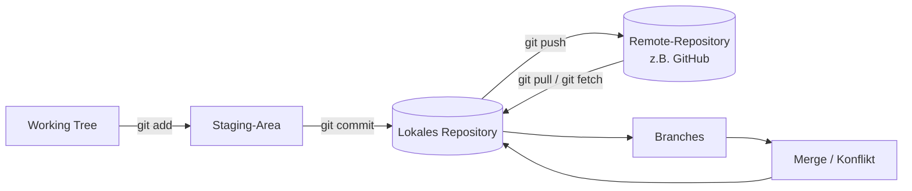

# Merksätze: Git und GitHub

---

## 1. Versionskontrolle ersetzt das Datei-Chaos

!!! success "Merksatz 1"
    > **Ein Commit ist ein Spielstand. Git verwaltet deine Spielstände, vergleicht sie, springt zurück, teilt sie mit anderen. Manuelle Versionierung über Dateinamen ist das Problem, das Git löst.**

Mehr dazu: [Warum Git?](warum-git.md)

---

## 2. Drei Bereiche, drei Zustände

!!! success "Merksatz 2"
    > **Working Tree (Lesetisch) → Staging-Area (Vorbereitungstisch) → Repository (Archiv). Jede Datei ist in genau einem dieser drei Zustände. `git add` legt auf den Vorbereitungstisch, `git commit` archiviert.**

Mehr dazu: [Grundbegriffe](grundbegriffe.md)

---

## 3. HEAD und Branch sind nur Zeiger

!!! success "Merksatz 3"
    > **Ein Branch ist nur ein Name auf einem Commit. HEAD ist nur ein Zeiger, der sagt, wo du gerade stehst. Anlegen und Wechseln ist billig – Branches kosten in Git praktisch nichts.**

Mehr dazu: [Branches und Merge](branches-und-merge.md)

---

## 4. Merge: Fast-Forward oder echter Merge-Commit

!!! success "Merksatz 4"
    > **Wenn auf `main` nichts dazugekommen ist, schiebt Git den Zeiger weiter (Fast-Forward). Wenn beide Linien gewachsen sind, erzeugt Git einen Merge-Commit mit zwei Eltern. Beides ist normal.**

Mehr dazu: [Branches und Merge](branches-und-merge.md#merge-zwei-linien-wieder-zusammenfuhren)

---

## 5. Konflikte sind keine Bugs, sondern Fragen

!!! success "Merksatz 5"
    > **Ein Konflikt heißt: dieselbe Stelle wurde in beiden Branches unterschiedlich geändert. Git fragt dich, was gilt. Marker entfernen, gewünschte Version hinschreiben, `git add`, `git commit`. Im Zweifel `git merge --abort`.**

Mehr dazu: [Praxis 3: Merge-Konflikt lösen](praxis-merge-konflikt.md)

---

## 6. Git ist verteilt

!!! success "Merksatz 6"
    > **Jeder Beteiligte hat eine vollständige Kopie der Historie. Der Remote ist nur ein Treffpunkt. `git push` schiebt deine Commits hoch, `git pull` holt fremde herunter. Nichts wird automatisch ausgetauscht.**

Mehr dazu: [Remote und GitHub](remote-und-github.md)

---

## 7. GitHub ist nicht Git

!!! success "Merksatz 7"
    > **Git ist das Werkzeug. GitHub, GitLab, Bitbucket und Gitea sind Plattformen, die Git als Grundlage nutzen. Pull Requests, Issues und CI/CD gehören zur Plattform, nicht zu Git. Die Befehle sind überall dieselben, die Knöpfe heißen unterschiedlich.**

Mehr dazu: [Remote und GitHub → Plattformen](remote-und-github.md#die-plattformen-github-gitlab-bitbucket-gitea)

---

## 8. Zwei Wege zu einem Remote-Repo

!!! success "Merksatz 8"
    > **Weg A: GitHub-Repo neu anlegen, `git clone <URL>`. Weg B: lokal mit `git init`, dann leeres GitHub-Repo anlegen, `git remote add origin <URL>`, `git push -u origin main`. Beide enden im selben Zustand. Wähl je nach Ausgangslage.**

Mehr dazu: [Praxis 4](praxis-github-neu.md) und [Praxis 5](praxis-lokal-zu-github.md)

---

## 9. Pull Request = Werkzeug der Plattform

!!! success "Merksatz 9"
    > **Branch lokal, Commits, `git push -u origin <branch>`. Auf GitHub Pull Request öffnen, Review-Kommentare mit weiteren Commits beantworten, mergen, Branch aufräumen – lokal und remote. Das ist der tägliche Team-Workflow.**

Mehr dazu: [Praxis 6: Pull Request über Branch](praxis-pull-request.md)

---

## 10. Im Team: `main` ist heilig

!!! success "Merksatz 10"
    > **Alle arbeiten auf Branches, alle nutzen Pull Requests, Konflikte werden lokal gelöst statt im Browser. Vor jedem neuen Branch ein `git pull` auf `main`, nach jedem Merge ein `git fetch --prune`.**

Mehr dazu: [Gruppenübung 1: Merge-Konflikt im Team lösen](gruppen-uebung.md) und [Gruppenübung 2: Feature-Workflow im Team](praxis-team-workflow.md)

---

## Das große Bild

Das ist alles. Mehr Bausteine gibt es im Alltag nicht. Was später kommt (Rebase, Cherry-Pick, GitOps, …) sind nur Verfeinerungen dieses Bilds.

---

## Letzter Tipp

Git ist ein Werkzeug, das du **am besten lernst, indem du es nutzt**. Lesen reicht nicht. Eines der wichtigsten Dinge, das du machen kannst:

- Lege jeden Tag ein paar Übungs-Commits an. Auch in einem Sandbox-Repo, das niemand außer dir je sieht.
- Probier wilde Sachen: mehrere Branches, abgebrochene Merges, force-pushes (in einem Repo, in dem nur du arbeitest), Rebase.
- Schau dir nach jedem Schritt mit **`git log --oneline --graph --all`** an, was passiert ist.

Nach ein paar Wochen geht dir Git in Fleisch und Blut über. Bis dahin: nutz die Cheatsheets und Stolperstein-Sammlung als Stützräder.

!!! tip "Eine Faustregel für den Anfang"
    Wenn du dir unsicher bist, **mach immer einen Commit, bevor du etwas Großes ausprobierst.** Mit einem Commit als Sicherheitsnetz kannst du praktisch alles probieren und im Notfall mit `git reset --hard HEAD` zurückspringen. **Ohne Commit gibt es keinen Rettungsanker.**
