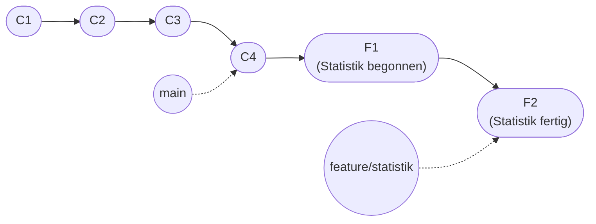

# Praxis 2: Branches anlegen und mergen

!!! abstract "Ziel"
    In **etwa 30 Minuten** legst du deinen ersten Branch an, arbeitest dort, wechselst zurück und führst den Branch in `main` zurück. Du machst beide Merge-Varianten **bewusst** durch: einmal als Fast-Forward, einmal als echter Merge-Commit.

    Am Ende kannst du:

    - einen **neuen Branch** mit `git switch -c` anlegen
    - zwischen Branches **hin- und herwechseln**
    - sehen, wie der **Working Tree sich beim Wechsel ändert**
    - einen Branch mit `git merge` in `main` integrieren
    - im **`git log --graph`** die Branch-Struktur visuell lesen
    - einen Branch mit `git branch -d` aufräumen

---

## Voraussetzungen

- Du hast die [Praxis 1](praxis-erste-schritte.md) durchgespielt.
- Du hast das Repo `mein-tagebuch` aus Praxis 1 noch lokal liegen (mit mindestens vier Commits auf `main`).
- Falls nicht: kurz neu anlegen, README mit einer Zeile, einmal committen. Reicht.

Schnellcheck:

```bash
cd ~/mein-tagebuch
git log --oneline
```

Du solltest mehrere Commits auf `main` sehen.

---

## Was wir bauen

Du arbeitest an einer neuen Funktion in deinem Tagebuch: einer Statistik-Seite. Statt direkt auf `main` zu commiten, machst du das auf einem eigenen Branch namens `feature/statistik`. Während dieser Arbeit kannst du jederzeit zurück auf `main`, ohne dass deine Statistik-Sachen im Weg sind.



Am Ende mergen wir den Feature-Branch in `main`.

---

## Schritt 1: Welche Branches existieren gerade?

```bash
git branch
```

Ausgabe:

```text
* main
```

Du hast einen Branch, `main`. Das Sternchen `*` zeigt an, auf welchem Branch du gerade stehst.

```bash
git status
```

```text
On branch main
nothing to commit, working tree clean
```

Sauber. Perfekte Startposition.

---

## Schritt 2: Neuen Branch anlegen und gleichzeitig darauf wechseln

```bash
git switch -c feature/statistik
```

Ausgabe:

```text
Switched to a new branch 'feature/statistik'
```

Drei Sachen sind gerade passiert:

1. Ein neuer Branch namens `feature/statistik` wurde angelegt, beginnend bei dem Commit, auf dem `main` gerade steht.
2. HEAD wurde auf `feature/statistik` umgehängt.
3. Dein Working Tree ist unverändert geblieben – es gab ja keine Änderungen, die hätten verlorengehen können.

Prüfen:

```bash
git branch
```

```text
* feature/statistik
  main
```

Das Sternchen ist gewandert. Du stehst jetzt auf `feature/statistik`.

!!! info "`switch -c` vs. `checkout -b`"
    Die ältere Schreibweise für genau dasselbe ist:

    ```bash
    git checkout -b feature/statistik
    ```

    `git switch` gibt es seit Git 2.23 (2019). Es ist klarer, weil `checkout` zu viele unterschiedliche Dinge tat. Beide funktionieren. Wir bleiben in dieser Praxis bei `switch`.

---

## Schritt 3: Auf dem Feature-Branch arbeiten

Lege eine neue Datei `statistik.md` an:

```markdown
# Statistik

Hier kommen später Auswertungen hin. Anzahl Einträge, Durchschnittslänge, …

(in Arbeit)
```

Speichern. Dann:

```bash
git add statistik.md
git commit -m "Statistik-Seite begonnen"
```

Ausgabe:

```text
[feature/statistik f1a2b3c] Statistik-Seite begonnen
 1 file changed, 5 insertions(+)
 create mode 100644 statistik.md
```

Wichtig: in der Ausgabe steht **`[feature/statistik`**, nicht `[main`. Der Commit liegt auf dem Feature-Branch.

Mach noch eine kleine Änderung. Erweitere `statistik.md`:

```markdown
# Statistik

Hier kommen später Auswertungen hin. Anzahl Einträge, Durchschnittslänge, …

## Ideen

- Anzahl Einträge pro Monat
- längster Eintrag
- häufigste Wörter
```

Speichern, committen:

```bash
git add statistik.md
git commit -m "Statistik: Ideen-Liste ergänzt"
```

```bash
git log --oneline
```

```text
f2b3c4d (HEAD -> feature/statistik) Statistik: Ideen-Liste ergänzt
f1a2b3c Statistik-Seite begonnen
d4e5f6g (main) README: Inhaltsverzeichnis ergänzt
c3d4e5f Eintrag: 21. Mai 2026
b2c3d4e README: tägliche Eintragsfrequenz beschreiben
a1b2c3d README mit erster Beschreibung anlegen
```

Genau das mentale Modell aus den [Branches und Merge](branches-und-merge.md): zwei Commits auf `feature/statistik`, davor `main` ein paar Commits zurück.

---

## Schritt 4: Zurück auf `main` – Working Tree ändert sich

```bash
git switch main
```

```text
Switched to branch 'main'
```

Schau jetzt in deinem Editor (oder im Datei-Explorer): die Datei **`statistik.md` ist verschwunden**.

Sie ist nicht gelöscht. Sie liegt unverändert auf dem Branch `feature/statistik`. Der Working Tree zeigt aber jetzt den Zustand von `main` – und auf `main` hat es nie eine `statistik.md` gegeben.

```bash
git status
```

```text
On branch main
nothing to commit, working tree clean
```

Sauber.

```bash
git log --oneline
```

```text
d4e5f6g (HEAD -> main) README: Inhaltsverzeichnis ergänzt
c3d4e5f Eintrag: 21. Mai 2026
b2c3d4e README: tägliche Eintragsfrequenz beschreiben
a1b2c3d README mit erster Beschreibung anlegen
```

Die Commits aus `feature/statistik` tauchen hier nicht mehr auf, weil HEAD jetzt auf `main` zeigt und `git log` ab HEAD rückwärts läuft.

!!! tip "Beide Branches zugleich sehen"
    Wenn du alle Commits aller Branches sehen willst, nutzt du:

    ```bash
    git log --oneline --all --graph
    ```

    Ausgabe:

    ```text
    * f2b3c4d (feature/statistik) Statistik: Ideen-Liste ergänzt
    * f1a2b3c Statistik-Seite begonnen
    * d4e5f6g (HEAD -> main) README: Inhaltsverzeichnis ergänzt
    * c3d4e5f Eintrag: 21. Mai 2026
    * b2c3d4e README: tägliche Eintragsfrequenz beschreiben
    * a1b2c3d README mit erster Beschreibung anlegen
    ```

    Sieht hier noch linear aus, weil `main` und `feature/statistik` noch nicht wirklich auseinandergelaufen sind.

---

## Schritt 5: Erster Merge – als Fast-Forward

Du willst die Statistik-Sachen jetzt in `main` haben. Du stehst noch auf `main`. Merge ausführen:

```bash
git merge feature/statistik
```

Ausgabe:

```text
Updating d4e5f6g..f2b3c4d
Fast-forward
 statistik.md | 11 +++++++++++
 1 file changed, 11 insertions(+)
 create mode 100644 statistik.md
```

Das Schlüsselwort hier ist **`Fast-forward`**. Was ist passiert?

Es gab keine konkurrierenden Commits auf `main`. Git konnte einfach den `main`-Zeiger auf den letzten Commit des Feature-Branches schieben. Kein neuer Commit nötig.

```bash
git log --oneline --all --graph
```

```text
* f2b3c4d (HEAD -> main, feature/statistik) Statistik: Ideen-Liste ergänzt
* f1a2b3c Statistik-Seite begonnen
* d4e5f6g README: Inhaltsverzeichnis ergänzt
* c3d4e5f Eintrag: 21. Mai 2026
* b2c3d4e README: tägliche Eintragsfrequenz beschreiben
* a1b2c3d README mit erster Beschreibung anlegen
```

Wichtig:

- Beide Branch-Namen zeigen jetzt auf **denselben Commit** (`f2b3c4d`).
- Die Linie ist linear. Es gibt keinen extra Merge-Commit.

Und im Datei-Explorer: `statistik.md` ist auf `main` da.

---

## Schritt 6: Feature-Branch aufräumen

Wenn du den Branch nicht mehr brauchst, lösch ihn:

```bash
git branch -d feature/statistik
```

```text
Deleted branch feature/statistik (was f2b3c4d).
```

Prüfen:

```bash
git branch
```

```text
* main
```

Nur noch `main`. Die Commits selbst sind **nicht** weg – sie sind ja jetzt Teil von `main`. Nur der Name `feature/statistik` ist gelöscht. Aufgeräumt.

!!! warning "`-d` vs. `-D`"
    - `git branch -d <name>` löscht nur, wenn der Branch **bereits gemergt** ist. Eingebaute Sicherheitsbremse.
    - `git branch -D <name>` löscht **immer**, auch wenn noch ungemergte Commits drauf liegen. Vorsicht – damit kannst du Arbeit verlieren.

    Nimm im Zweifel `-d`. Wenn Git sagt „nicht gemerged, kann nicht löschen", weißt du, dass du etwas vergessen hast.

---

## Schritt 7: Zweiter Versuch – diesmal mit echtem Merge-Commit

Damit du auch den anderen Fall siehst. Wir bauen die Situation absichtlich nach.

Neuer Feature-Branch:

```bash
git switch -c feature/cover
```

```text
Switched to a new branch 'feature/cover'
```

Auf `feature/cover` legst du eine neue Datei `cover.md` an:

```markdown
# Cover

Hier kommt später eine Übersicht für die Startseite.
```

Speichern, stagen, committen:

```bash
git add cover.md
git commit -m "Cover-Seite begonnen"
```

```text
[feature/cover g3h4i5j] Cover-Seite begonnen
```

Jetzt der Trick: **wir wechseln zurück auf `main` und machen dort einen Commit**, sodass `main` auch weiterläuft. Damit Git nicht fast-forwarden kann.

```bash
git switch main
```

In `README.md` eine kleine Zeile ergänzen, z.B.:

```markdown
*Letztes Update: 2026-05-21*
```

Speichern, stagen, committen:

```bash
git add README.md
git commit -m "README: Datum für letztes Update"
```

```text
[main h4i5j6k] README: Datum für letztes Update
```

Jetzt prüfen wir die Situation:

```bash
git log --oneline --all --graph
```

```text
* h4i5j6k (HEAD -> main) README: Datum für letztes Update
| * g3h4i5j (feature/cover) Cover-Seite begonnen
|/
* f2b3c4d Statistik: Ideen-Liste ergänzt
* f1a2b3c Statistik-Seite begonnen
* d4e5f6g README: Inhaltsverzeichnis ergänzt
...
```

Da! Die Linien gehen auseinander. `main` und `feature/cover` haben jeweils einen eigenen Commit nach dem gemeinsamen Punkt `f2b3c4d`. Genau die Situation, in der ein Fast-Forward **nicht** möglich ist.

Jetzt mergen:

```bash
git merge feature/cover
```

Git öffnet einen Editor mit einer vorbereiteten Commit-Message für den Merge-Commit:

```text
Merge branch 'feature/cover'

# Please enter a commit message to explain why this merge is necessary,
# especially if it merges an updated upstream into a topic branch.
#
# Lines starting with '#' will be ignored, and an empty message aborts
# the commit.
```

Du kannst die Message lassen, wie sie ist. Speichern und Editor schließen.

??? info "Editor klemmt? Geh raus mit `:wq` oder `Strg+X`."
    Wenn vim aufgegangen ist: `Esc` → `:wq` → `Enter`.

    Wenn nano: `Strg+O` → `Enter` → `Strg+X`.

    Wenn VSCode (mit `code --wait`): einfach das Tab schließen.

Ausgabe nach dem Schließen:

```text
Merge made by the 'ort' strategy.
 cover.md | 3 +++
 1 file changed, 3 insertions(+)
 create mode 100644 cover.md
```

`Merge made by the 'ort' strategy.` heißt: Git hat einen echten Merge-Commit erzeugt. „Ort" ist seit Git 2.34 die Default-Merge-Strategie, hier nicht weiter relevant.

Schauen wir uns das Ergebnis an:

```bash
git log --oneline --all --graph
```

```text
*   m5n6o7p (HEAD -> main) Merge branch 'feature/cover'
|\
| * g3h4i5j (feature/cover) Cover-Seite begonnen
* | h4i5j6k README: Datum für letztes Update
|/
* f2b3c4d Statistik: Ideen-Liste ergänzt
* f1a2b3c Statistik-Seite begonnen
...
```

Bingo. Der Merge-Commit `m5n6o7p` hat **zwei Eltern** – das siehst du an den zwei Linien, die nach oben rauskommen. Die Historie zeigt für immer, dass es einen Branch gab.

---

## Schritt 8: Feature-Branch aufräumen, Teil 2

```bash
git branch -d feature/cover
```

```text
Deleted branch feature/cover (was g3h4i5j).
```

```bash
git branch
```

```text
* main
```

Aufgeräumt. Aber der Merge-Commit ist natürlich noch da, der gehört jetzt zur Geschichte von `main`.

---

## Schritt 9: Beide Merges nebeneinander

Schau dir die finale Historie an:

```bash
git log --oneline --graph
```

```text
*   m5n6o7p (HEAD -> main) Merge branch 'feature/cover'
|\
| * g3h4i5j Cover-Seite begonnen
* | h4i5j6k README: Datum für letztes Update
|/
* f2b3c4d Statistik: Ideen-Liste ergänzt
* f1a2b3c Statistik-Seite begonnen
* d4e5f6g README: Inhaltsverzeichnis ergänzt
* c3d4e5f Eintrag: 21. Mai 2026
* b2c3d4e README: tägliche Eintragsfrequenz beschreiben
* a1b2c3d README mit erster Beschreibung anlegen
```

Du siehst beide Stile:

- Die Commits `f1a2b3c` und `f2b3c4d` aus deinem ersten Branch sind **unsichtbar als Branch** – Fast-Forward hat sie eingereiht.
- Die Commits `g3h4i5j` und `h4i5j6k` aus deinem zweiten Branch hingegen sind als **eigene Linie** sichtbar, mit Merge-Commit darüber.

Beides ist „richtig", je nach Lage. Beides ist Standard-Git-Workflow.

---

## Bonus: Was wäre, wenn ich keinen Fast-Forward will?

Manche Teams erzwingen, dass **immer** ein Merge-Commit entsteht, auch wenn Fast-Forward möglich wäre. Vorteil: der Branch bleibt in der Historie sichtbar.

Probier das aus. Neuer Branch:

```bash
git switch -c feature/lese-modus
echo "# Lesemodus" > lesemodus.md
git add lesemodus.md
git commit -m "Lesemodus-Skizze"
git switch main
```

Auf `main` ist nichts dazugekommen. Ein normaler Merge würde **Fast-Forward** machen. Erzwinge stattdessen einen Merge-Commit:

```bash
git merge --no-ff feature/lese-modus
```

Editor öffnet sich, Message akzeptieren, speichern. Im Log:

```bash
git log --oneline --graph
```

```text
*   n6o7p8q (HEAD -> main) Merge branch 'feature/lese-modus'
|\
| * o7p8q9r feature/lese-modus
|/
*   m5n6o7p Merge branch 'feature/cover'
...
```

Mit `--no-ff` (no-fast-forward) zwingst du Git, einen Merge-Commit zu machen, auch wenn er rein technisch nicht nötig wäre. Geschmackssache.

```bash
git branch -d feature/lese-modus
```

---

## Wichtige Befehle dieser Praxis

| Befehl | Zweck |
|--------|-------|
| `git branch` | alle Branches auflisten, aktueller hat `*` |
| `git switch -c <name>` | neuen Branch anlegen und gleich darauf wechseln |
| `git switch <name>` | auf einen bestehenden Branch wechseln |
| `git merge <name>` | den genannten Branch in den aktuellen mergen |
| `git merge --no-ff <name>` | Merge erzwingen, auch wenn Fast-Forward möglich wäre |
| `git branch -d <name>` | bereits gemergten Branch löschen |
| `git branch -D <name>` | Branch löschen, egal ob gemergt oder nicht (Vorsicht) |
| `git log --oneline --graph --all` | Historie aller Branches grafisch sehen |

---

## Was du jetzt verstanden hast

- Branches in Git sind **leichtgewichtig**. Anlegen ist eine Sache von Sekundenbruchteilen.
- **`git switch`** wechselt zwischen Branches. Der Working Tree wechselt mit.
- Ein **Fast-Forward** schiebt nur den Branch-Zeiger weiter, ohne neuen Commit.
- Ein **echter Merge-Commit** hat zwei Eltern und macht die Branch-Geschichte sichtbar.
- **`git log --graph`** ist dein Visualisierungs-Werkzeug, ohne dass du eine GUI brauchst.
- Aufräumen mit **`git branch -d`** ist sauber. Ungemergte Branches schützt Git automatisch.

---

## Aufräumen oder weitermachen

Du brauchst dein Repo für [Praxis 3](praxis-merge-konflikt.md), also lass es bitte stehen. Falls du es trotzdem löschen willst, siehe die Anleitung am Ende von [Praxis 1](praxis-erste-schritte.md#aufrumen-oder-weitermachen).

---

## Merksatz

!!! success "Merksatz"
    > **Branch anlegen, wechseln, arbeiten, mergen, aufräumen. Fast-Forward wenn möglich, Merge-Commit wenn nötig. `git log --graph` zeigt dir beides nebeneinander. Das ist der gesamte Branch-Workflow.**

---

## Weiterlesen

- [Praxis 3: Merge-Konflikt lösen](praxis-merge-konflikt.md): wenn der Merge mal **nicht** glattläuft
- [Stolpersteine](stolpersteine.md): typische Fehler beim Branchen
