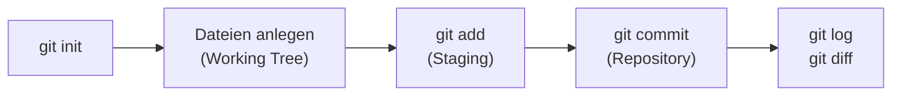

# Praxis 1: erste Schritte lokal

!!! abstract "Ziel"
    In **etwa 45 Minuten** baust du dein erstes eigenes Git-Repository auf und arbeitest mit `init`, `add`, `commit`, `status`, `log`, `diff` und `restore`. Komplett lokal, ohne GitHub. Am Ende verstehst du den Lebenszyklus einer Datei in Git wirklich.

    Am Ende kannst du:

    - ein **leeres Repository lokal** anlegen
    - den Unterschied zwischen **Working Tree, Staging und Repository** in der Praxis sehen
    - mit **`git status`** jederzeit prüfen, in welchem Zustand deine Dateien sind
    - sauber **commiten** und gute Commit-Messages schreiben
    - die **Historie** mit `git log` lesen
    - mit **`git diff`** Änderungen vergleichen
    - mit **`git restore`** ungewollte Änderungen rückgängig machen

---

## Voraussetzungen

- **Git ist installiert** und `git --version` läuft. Sonst → [Git installieren](installation.md).
- Du hast Name und E-Mail über `git config --global user.name/.email` gesetzt.
- Ein **Terminal**: macOS/Linux-Terminal, Windows PowerShell, Windows CMD oder Git Bash.
- Ein **Editor** deiner Wahl (VSCode, Notepad++, vim, …).

---

## Was wir bauen

Ein kleines Projekt namens `mein-tagebuch`. Es enthält am Ende zwei Dateien:

```text
mein-tagebuch/
├── README.md
└── eintrag-2026-05-21.md
```

Wir lassen es bewusst klein. Worum es geht, sind die **Git-Konzepte**, nicht der Inhalt.



---

## Schritt 1: Projektordner anlegen und ins Repo verwandeln

Wir gehen ins Home-Verzeichnis und legen einen neuen Ordner an.

=== "macOS / Linux / Git Bash"
    ```bash
    cd ~
    mkdir mein-tagebuch
    cd mein-tagebuch
    ```

=== "Windows PowerShell"
    ```powershell
    Set-Location $HOME
    New-Item -ItemType Directory -Name mein-tagebuch | Out-Null
    Set-Location mein-tagebuch
    ```

=== "Windows CMD"
    ```cmd
    cd /d "%USERPROFILE%"
    mkdir mein-tagebuch
    cd mein-tagebuch
    ```

Du stehst jetzt in einem leeren Ordner. Mach ihn zu einem Git-Repository:

```bash
git init
```

Ausgabe:

```text
Initialized empty Git repository in /Users/<dein-name>/mein-tagebuch/.git/
```

Damit hast du den versteckten `.git`-Ordner angelegt. Ab jetzt ist `mein-tagebuch` ein Git-Repository.

??? info "Wo ist der .git-Ordner?"
    `.git` ist standardmäßig versteckt. So machst du ihn sichtbar:

    === "macOS / Linux / Git Bash"
        ```bash
        ls -la
        ```

    === "Windows PowerShell"
        ```powershell
        Get-ChildItem -Force
        ```

    === "Windows CMD"
        ```cmd
        dir /a
        ```

    Du solltest `.git/` neben `.` und `..` sehen.

Direkt prüfen, wo Git steht:

```bash
git status
```

Ausgabe:

```text
On branch main

No commits yet

nothing to commit (create/copy files to add)
```

Wichtige Beobachtungen:

- **`On branch main`** – der Default-Branch heißt `main`, weil du das in der Konfiguration gesetzt hast.
- **`No commits yet`** – das Repo ist leer.
- **`nothing to commit`** – kein Wunder, es gibt noch keine Dateien.

`git status` ist dein wichtigster Begleiter. Schau ihn dir nach jedem Schritt an. Er sagt dir präzise, was Git gerade sieht.

---

## Schritt 2: Erste Datei anlegen

Erstelle in deinem Editor eine Datei `README.md` mit folgendem Inhalt:

```markdown
# Mein Tagebuch

Hier sammle ich kleine Einträge.
```

Speichern. Dann zurück im Terminal:

```bash
git status
```

Ausgabe:

```text
On branch main

No commits yet

Untracked files:
  (use "git add <file>..." to include in what will be committed)
        README.md

nothing added to commit but untracked files present (use "git add" to track)
```

Git sagt dir:

- Es gibt eine **untracked file** namens `README.md`. „Untracked" heißt: Git sieht sie, ignoriert sie aber, weil du sie noch nicht in die Verwaltung aufgenommen hast.
- Git gibt dir sogar den richtigen nächsten Befehl mit: `git add`.

---

## Schritt 3: Datei stagen

```bash
git add README.md
```

Keine Ausgabe – das ist normal. `git add` ist schweigsam, wenn alles geklappt hat. Prüfen:

```bash
git status
```

Ausgabe:

```text
On branch main

No commits yet

Changes to be committed:
  (use "git rm --cached <file>..." to unstage)
        new file:   README.md
```

`README.md` liegt jetzt in der **Staging-Area** – auf dem Vorbereitungstisch. Sie ist bereit für den ersten Commit.

!!! tip "`git add .` für alles auf einmal"
    Statt jede Datei einzeln zu stagen, kannst du auch alle neuen und geänderten Dateien des aktuellen Ordners stagen:

    ```bash
    git add .
    ```

    Das ist bequem, aber etwas weniger kontrolliert. Solange du genau weißt, was im Ordner ist, ist das okay.

---

## Schritt 4: Erster Commit

```bash
git commit -m "README mit erster Beschreibung anlegen"
```

Ausgabe:

```text
[main (root-commit) a1b2c3d] README mit erster Beschreibung anlegen
 1 file changed, 3 insertions(+)
 create mode 100644 README.md
```

Glückwunsch. Dein erster Commit ist im Repository.

Was hat Git dir gesagt?

| Teil der Ausgabe | Bedeutung |
|------------------|-----------|
| `[main` | du commitest auf den Branch `main` |
| `(root-commit)` | das ist der **allererste** Commit im Repo, hat keinen Vorgänger |
| `a1b2c3d` | die ersten 7 Zeichen der Commit-SHA (bei dir ist sie eine andere) |
| `1 file changed, 3 insertions(+)` | eine Datei wurde geändert, 3 Zeilen hinzugefügt |

Jetzt:

```bash
git status
```

```text
On branch main
nothing to commit, working tree clean
```

**Working tree clean** ist das, was du sehen willst. Es gibt keine offenen Änderungen, alles ist im Repo. Saubere Welt.

---

## Schritt 5: Historie anschauen

```bash
git log
```

Ausgabe:

```text
commit a1b2c3d4e5f6789012345678901234567890abcd (HEAD -> main)
Author: Vorname Nachname <deine.adresse@example.com>
Date:   Thu May 21 14:32:15 2026 +0200

    README mit erster Beschreibung anlegen
```

Hier siehst du alle Bestandteile eines Commits, die in den [Grundbegriffen](grundbegriffe.md) beschrieben sind: SHA, Autor, Datum, Message. Und ganz wichtig:

- **`HEAD -> main`** – der HEAD-Zeiger steht auf `main`, und `main` zeigt auf diesen Commit. Genau das mentale Modell, das wir uns angeschaut haben.

!!! tip "Kompakter mit `--oneline`"
    ```bash
    git log --oneline
    ```

    ```text
    a1b2c3d (HEAD -> main) README mit erster Beschreibung anlegen
    ```

    Eine Zeile pro Commit – praktisch, sobald die Historie länger wird.

---

## Schritt 6: Etwas ändern und den Diff sehen

Öffne `README.md` im Editor und ergänze eine Zeile, sodass sie so aussieht:

```markdown
# Mein Tagebuch

Hier sammle ich kleine Einträge.

Ein neuer Eintrag pro Tag, manchmal auch zwei.
```

Speichern. Dann:

```bash
git status
```

```text
On branch main
Changes not staged for commit:
  (use "git add <file>..." to update what will be committed)
  (use "git restore <file>..." to discard changes in working directory)
        modified:   README.md

no changes added to commit (use "git add" and/or "git commit -a")
```

Git sieht die Änderung. Sie ist **modified**, aber nicht gestaged. Was hat sich konkret geändert?

```bash
git diff
```

Ausgabe:

```text
diff --git a/README.md b/README.md
index 8c4f5d6..2a3b4c7 100644
--- a/README.md
+++ b/README.md
@@ -1,3 +1,5 @@
 # Mein Tagebuch

 Hier sammle ich kleine Einträge.
+
+Ein neuer Eintrag pro Tag, manchmal auch zwei.
```

Lies das so:

- Zeilen mit **`+`** sind hinzugekommen.
- Zeilen mit **`-`** wären entfernt (hier gibt es keine).
- Zeilen ohne Vorzeichen sind **Kontext**, also unverändert.

`git diff` ohne weitere Argumente zeigt dir, was im **Working Tree** anders ist als zuletzt commitet.

---

## Schritt 7: Zweite Änderung committen

```bash
git add README.md
git commit -m "README: tägliche Eintragsfrequenz beschreiben"
```

Ausgabe:

```text
[main b2c3d4e] README: tägliche Eintragsfrequenz beschreiben
 1 file changed, 2 insertions(+)
```

Und in den Log schauen:

```bash
git log --oneline
```

```text
b2c3d4e (HEAD -> main) README: tägliche Eintragsfrequenz beschreiben
a1b2c3d README mit erster Beschreibung anlegen
```

Zwei Commits, beide auf `main`, HEAD zeigt auf den neuesten.

---

## Schritt 8: Zwei Dateien zugleich, aber nur eine committen

Jetzt kommt der spannende Teil. Wir legen einen Tagebucheintrag an und ändern gleichzeitig die README – sollen aber in **zwei verschiedenen Commits** landen.

Erstelle die Datei `eintrag-2026-05-21.md`:

```markdown
# 21. Mai 2026

Heute habe ich Git gelernt. Das mit dem Vorbereitungstisch leuchtet ein.
```

Und ändere die README, sodass sie so aussieht:

```markdown
# Mein Tagebuch

Hier sammle ich kleine Einträge.

Ein neuer Eintrag pro Tag, manchmal auch zwei.

## Inhalt

- 21. Mai 2026 – Git gelernt
```

Beide Dateien speichern. Im Terminal:

```bash
git status
```

```text
On branch main
Changes not staged for commit:
  (use "git add <file>..." to update what will be committed)
  (use "git restore <file>..." to discard changes in working directory)
        modified:   README.md

Untracked files:
  (use "git add <file>..." to include in what will be committed)
        eintrag-2026-05-21.md

no changes added to commit (use "git add" and/or "git commit -a")
```

Beide Sachen liegen da, jeweils im richtigen Zustand: `README.md` ist **modified**, `eintrag-2026-05-21.md` ist **untracked**.

Wir wollen jetzt **erst den Eintrag** committen, **dann die README**. So bleibt die Historie sauber.

```bash
git add eintrag-2026-05-21.md
git status
```

```text
On branch main
Changes to be committed:
  (use "git restore --staged <file>..." to unstage)
        new file:   eintrag-2026-05-21.md

Changes not staged for commit:
  (use "git add <file>..." to update what will be committed)
  (use "git restore <file>..." to discard changes in working directory)
        modified:   README.md
```

Genau richtig: der Eintrag ist gestaged, die README nicht. Commit:

```bash
git commit -m "Eintrag: 21. Mai 2026"
```

```text
[main c3d4e5f] Eintrag: 21. Mai 2026
 1 file changed, 3 insertions(+)
 create mode 100644 eintrag-2026-05-21.md
```

Jetzt die README dazu:

```bash
git add README.md
git commit -m "README: Inhaltsverzeichnis ergänzt"
```

```text
[main d4e5f6g] README: Inhaltsverzeichnis ergänzt
 1 file changed, 4 insertions(+)
```

Und ein Blick auf die Historie:

```bash
git log --oneline
```

```text
d4e5f6g (HEAD -> main) README: Inhaltsverzeichnis ergänzt
c3d4e5f Eintrag: 21. Mai 2026
b2c3d4e README: tägliche Eintragsfrequenz beschreiben
a1b2c3d README mit erster Beschreibung anlegen
```

Vier Commits, jeder mit einer **klaren Aufgabe**. Genau dafür gibt es die Staging-Area.

!!! success "Was du gerade gemacht hast"
    Du hast zwei verschiedene Änderungen in **zwei getrennte Commits** zerlegt. Stell dir vor, du hättest beides in einen Commit gepackt – die Message hätte „Eintrag und Inhaltsverzeichnis hinzugefügt" lauten müssen. Bei einem Bug später wüsstest du nicht, welche der beiden Änderungen ihn verursacht hat. Sauber getrennt ist das viel angenehmer.

---

## Schritt 9: Eine Änderung verwerfen

Manchmal probierst du etwas aus und willst die Änderung wieder loswerden. Probieren wir das.

Öffne die README und füg eine unsinnige Zeile ein, z.B. ans Ende:

```markdown
Das ist Quatsch und soll wieder weg.
```

Speichern. Status:

```bash
git status
```

```text
modified:   README.md
```

Statt zu committen, werfen wir die Änderung weg:

```bash
git restore README.md
```

Keine Ausgabe. Prüfen:

```bash
git status
```

```text
On branch main
nothing to commit, working tree clean
```

Und die README im Editor öffnen – die Quatsch-Zeile ist weg. Git hat den Inhalt vom letzten Commit zurückgeschrieben.

!!! warning "`git restore` ist unumkehrbar"
    Wenn du eine Änderung mit `git restore` wegwirfst, ist sie endgültig weg. Sie war ja nie commitet. Stell sicher, dass du **wirklich** nichts behalten willst, bevor du das machst.

    Faustregel: solange eine Änderung **nur im Working Tree** lebt, ist sie verletzlich. Sobald sie commitet ist, kann sie praktisch nicht mehr verloren gehen.

### Eine gestagte Datei vom Vorbereitungstisch nehmen

Falls du etwas versehentlich gestaged hast und es nur unstagen willst (ohne den Inhalt wegzuwerfen):

```bash
git restore --staged <datei>
```

Damit wandert die Datei vom Vorbereitungstisch zurück auf den Lesetisch. Der Inhalt bleibt unverändert.

---

## Schritt 10: Bestimmte Dateien ignorieren (`.gitignore`)

Manche Dateien gehören nicht ins Repository – Logs, Build-Artefakte, lokale Caches, Editor-Müll. Dafür gibt es `.gitignore`.

Lege eine Datei `.gitignore` im Repo-Root an:

```text
# Editor-Müll
.DS_Store
Thumbs.db

# Eigene lokale Notizen, die niemanden interessieren
notizen-fuer-mich.txt
```

Probier den Filter aus. Lege eine Datei `notizen-fuer-mich.txt` an mit beliebigem Inhalt. Speichern. Dann:

```bash
git status
```

```text
On branch main
Untracked files:
  (use "git add <file>..." to include in what will be committed)
        .gitignore

nothing added to commit but untracked files present (use "git add" to track)
```

Schau genau hin: **`notizen-fuer-mich.txt` taucht nicht auf**. Git ignoriert sie wegen der `.gitignore`-Regel.

Die `.gitignore` selbst willst du natürlich ins Repo aufnehmen, damit alle Beteiligten dieselben Regeln haben:

```bash
git add .gitignore
git commit -m ".gitignore: lokale Notizen und Editor-Müll ausschließen"
```

!!! info "`.gitignore` arbeitet pro Pfad"
    Du kannst auch Wildcards nutzen:

    ```text
    *.log         # alle .log-Dateien
    build/        # kompletter Ordner
    !wichtig.log  # ! macht eine Ausnahme: diese .log doch tracken
    ```

    Vorlagen für verschiedene Sprachen findest du unter <https://github.com/github/gitignore>.

---

## Schritt 11: Wo stehst du jetzt?

```bash
git log --oneline
```

```text
e5f6g7h (HEAD -> main) .gitignore: lokale Notizen und Editor-Müll ausschließen
d4e5f6g README: Inhaltsverzeichnis ergänzt
c3d4e5f Eintrag: 21. Mai 2026
b2c3d4e README: tägliche Eintragsfrequenz beschreiben
a1b2c3d README mit erster Beschreibung anlegen
```

Fünf Commits. Jede Änderung hat eine klare Beschreibung. Du kannst zu jedem Zeitpunkt nachvollziehen, **was** geändert wurde, **wann**, und **warum**.

Und genau das ist Versionskontrolle. Schon ein vollständiges, funktionierendes lokales Repo. Komplett ohne GitHub.

---

## Wichtige Befehle dieser Praxis (zum Abschreiben)

| Befehl | Zweck |
|--------|-------|
| `git init` | Aktuellen Ordner zum Repository machen |
| `git status` | Was sieht Git gerade? In welchem Zustand sind die Dateien? |
| `git add <datei>` | Datei stagen (auf den Vorbereitungstisch legen) |
| `git add .` | Alle Änderungen im aktuellen Ordner stagen |
| `git commit -m "..."` | Alles vom Vorbereitungstisch als neuen Commit ablegen |
| `git log` | Komplette Historie anzeigen |
| `git log --oneline` | Kompakte Historie (eine Zeile pro Commit) |
| `git diff` | Was hat sich im Working Tree gegenüber dem letzten Commit geändert? |
| `git diff --staged` | Was liegt gestaged und wartet auf den nächsten Commit? |
| `git restore <datei>` | Änderungen im Working Tree verwerfen |
| `git restore --staged <datei>` | Datei vom Vorbereitungstisch nehmen, Inhalt bleibt |

---

## Was du jetzt verstanden hast

- Ein Repository ist nur ein Ordner mit einem `.git`-Unterordner.
- Eine Datei wandert: **Working Tree** → **Staging-Area** → **Repository**.
- **`git status`** ist dein Cockpit. Er sagt dir alles, was du wissen musst.
- Jeder Commit hat eine **SHA**, einen **Autor**, ein **Datum** und eine **Message**.
- **HEAD** zeigt auf den aktuellen Commit deines aktuellen Branches.
- Mit **`git diff`** siehst du genau, was sich geändert hat.
- Mit **`git restore`** verwirfst du Änderungen, die du nicht behalten willst.
- Mit **`.gitignore`** kannst du Dateien gezielt von Git ausschließen.

---

## Aufräumen oder weitermachen

Du kannst das Repo behalten. Es bleibt einfach in deinem Home-Verzeichnis. Wir bauen in der nächsten Praxis darauf auf.

Oder, falls du löschen willst:

=== "macOS / Linux / Git Bash"
    ```bash
    cd ~
    rm -rf mein-tagebuch
    ```

=== "Windows PowerShell"
    ```powershell
    Set-Location $HOME
    Remove-Item -Recurse -Force mein-tagebuch
    ```

=== "Windows CMD"
    ```cmd
    cd /d "%USERPROFILE%"
    rmdir /s /q mein-tagebuch
    ```

Damit ist das Repo komplett weg, mit allen Commits.

---

## Merksatz

!!! success "Merksatz"
    > **`git init` macht den Ordner zum Repo. `git status` zeigt, wo du stehst. `git add` legt auf den Vorbereitungstisch. `git commit` archiviert. `git log` liest die Historie. Das sind die fünf Befehle, mit denen du 80 Prozent deiner täglichen Git-Arbeit erledigst.**

---

## Weiterlesen

- [Praxis 2: Branches anlegen und mergen](praxis-branches.md): das nächste Konzept
- [Stolpersteine](stolpersteine.md): wenn etwas hakt
- [Cheatsheet Git](../cheatsheets/git.md): alle Befehle auf einer Seite
