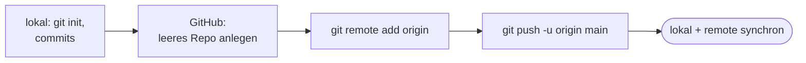

# Praxis 5: lokales Repo zu GitHub bringen

!!! abstract "Ziel"
    In **etwa 20 Minuten** bringst du ein lokales Repository, das schon Commits hat, **nachträglich** auf GitHub. Du legst ein leeres Repo auf GitHub an, verbindest es mit deinem lokalen Repo und pushst die komplette Historie hoch.

    Am Ende kannst du:

    - eine **vorhandene lokale Arbeit** auf GitHub veröffentlichen, ohne sie neu anzulegen
    - die Befehle **`git remote add origin <URL>`** und **`git push -u origin main`** sicher einsetzen
    - prüfen, ob die **Default-Branches** lokal und remote übereinstimmen, und sie ggf. angleichen
    - mit **`git remote -v`** sehen, mit welchem Remote du verbunden bist
    - typische Stolperfallen erkennen, wenn der Remote nicht leer war

---

## Voraussetzungen

- Du hast einen **GitHub-Account**.
- Du hast die [Praxis 1](praxis-erste-schritte.md) durchgespielt – du kennst `init`, `add`, `commit`.
- Du hast die [Praxis 4](praxis-github-neu.md) durchgespielt – du kennst Personal Access Token und `git push`.

---

## Wann brauchst du diesen Weg?

In [Praxis 4](praxis-github-neu.md) sind wir den Weg „GitHub zuerst, dann klonen" gegangen. Heute der umgekehrte:

- Du hast **schon lokal** ein Projekt mit Git initialisiert und ein paar Commits gemacht.
- Jetzt willst du es auf GitHub bringen.

Genau das machen wir.



---

## Schritt 1: Ein lokales Repo mit ein paar Commits

Wir nutzen ein frisches lokales Repo, damit der Weg ohne Altlasten klar ist.

=== "macOS / Linux / Git Bash"
    ```bash
    cd ~
    mkdir mein-zweites-projekt
    cd mein-zweites-projekt
    git init
    ```

=== "Windows PowerShell"
    ```powershell
    Set-Location $HOME
    New-Item -ItemType Directory -Name mein-zweites-projekt | Out-Null
    Set-Location mein-zweites-projekt
    git init
    ```

=== "Windows CMD"
    ```cmd
    cd /d "%USERPROFILE%"
    mkdir mein-zweites-projekt
    cd mein-zweites-projekt
    git init
    ```

Ausgabe:

```text
Initialized empty Git repository in /Users/<dein-name>/mein-zweites-projekt/.git/
```

Zwei kleine Commits machen:

```bash
echo "# Mein zweites Projekt" > README.md
git add README.md
git commit -m "README mit Titel anlegen"
```

```bash
echo "Erster Eintrag." > notiz.md
git add notiz.md
git commit -m "Notiz: erste Zeile"
```

Prüfen:

```bash
git log --oneline
```

```text
b2c3d4e (HEAD -> main) Notiz: erste Zeile
a1b2c3d README mit Titel anlegen
```

Zwei Commits. Lokal. Branch `main`. Aktuell weiß niemand außerhalb deiner Festplatte davon.

??? warning "Bei dir steht `master` statt `main`?"
    Dann hast du `init.defaultBranch` nicht gesetzt. Schnellfix:

    ```bash
    git branch -M main
    ```

    Damit wird der aktuelle Branch in `main` umbenannt. Dauerhaft setzen für alle künftigen Repos:

    ```bash
    git config --global init.defaultBranch main
    ```

---

## Schritt 2: Leeres Repo auf GitHub anlegen

Wichtig: diesmal **wirklich leer**. Keine README, kein `.gitignore`, keine License. Sonst kollidiert das gleich mit deinem lokalen Stand.

1. <https://github.com/new> öffnen.
2. **Repository name**: `mein-zweites-projekt` (am einfachsten gleicher Name wie lokal).
3. **Description** (optional): „lokal angefangen, jetzt auf GitHub gespiegelt".
4. **Public** lassen.
5. Unter **Initialize this repository with** den Schieberegler **„Add a README file"** **aus lassen** (nach links). Wichtig!
6. **`Add .gitignore`** auf „None" lassen.
7. **`Add a license`** auf „None" lassen.
8. **Create repository** klicken.

GitHub bringt dich auf eine besondere Seite: das Repo ist leer, und du siehst einen großen Block mit Vorschlägen, was du als Nächstes tun kannst. In etwa so:

```text
…or push an existing repository from the command line

git remote add origin https://github.com/<DEIN-USERNAME>/mein-zweites-projekt.git
git branch -M main
git push -u origin main
```

Das sind genau die Befehle, die wir gleich brauchen. GitHub macht uns die Arbeit angenehm.

Kopiere oben die URL deines Repos – sie sieht aus wie:

```text
https://github.com/<DEIN-USERNAME>/mein-zweites-projekt.git
```

---

## Schritt 3: Remote verbinden

Im Terminal, im Ordner `mein-zweites-projekt`:

```bash
git remote add origin https://github.com/<DEIN-USERNAME>/mein-zweites-projekt.git
```

Keine Ausgabe – das ist normal.

Prüfen:

```bash
git remote -v
```

```text
origin  https://github.com/<DEIN-USERNAME>/mein-zweites-projekt.git (fetch)
origin  https://github.com/<DEIN-USERNAME>/mein-zweites-projekt.git (push)
```

Dein lokales Repo weiß jetzt, wer „origin" ist. Aber: es hat noch nichts gepusht. Auf GitHub ist immer noch alles leer.

!!! info "Was hat `git remote add origin` getan?"
    Es hat einfach eine Zeile in `.git/config` eingetragen. Du kannst dir das anschauen:

    === "macOS / Linux / Git Bash"
        ```bash
        cat .git/config
        ```

    === "Windows PowerShell"
        ```powershell
        Get-Content .git/config
        ```

    Du siehst einen Block:

    ```text
    [remote "origin"]
        url = https://github.com/<DEIN-USERNAME>/mein-zweites-projekt.git
        fetch = +refs/heads/*:refs/remotes/origin/*
    ```

    Mehr ist es nicht. Git hat sich nur eine Adresse gemerkt.

---

## Schritt 4: Pushen, mit `-u`

```bash
git push -u origin main
```

Erwartete Ausgabe:

```text
Enumerating objects: 6, done.
Counting objects: 100% (6/6), done.
Delta compression using up to 8 threads
Compressing objects: 100% (4/4), done.
Writing objects: 100% (6/6), 552 bytes | 552.00 KiB/s, done.
Total 6 (delta 0), reused 0 (delta 0), pack-reused 0
To https://github.com/<DEIN-USERNAME>/mein-zweites-projekt.git
 * [new branch]      main -> main
branch 'main' set up to track 'origin/main'.
```

Drei wichtige Zeilen:

- **`* [new branch]      main -> main`** – auf dem Remote wurde ein neuer Branch `main` angelegt, der deinem lokalen entspricht.
- **`branch 'main' set up to track 'origin/main'`** – dein lokaler `main` weiß ab jetzt, dass sein „Gegenüber" auf dem Remote `origin/main` ist.
- Die `-u`-Flag (kurz für `--set-upstream`) hat das Tracking-Verhältnis eingerichtet. Ab jetzt reicht `git push` und `git pull` ohne weitere Argumente.

Im Browser zu deinem GitHub-Repo. Reload. Du siehst:

- Beide Dateien (`README.md`, `notiz.md`).
- Beide Commits in der Historie (oben links **„2 commits"** klicken).

Die Repos sind synchron. Geschafft.

---

## Schritt 5: Prüfen, dass alles passt

```bash
git status
```

```text
On branch main
Your branch is up to date with 'origin/main'.

nothing to commit, working tree clean
```

```bash
git log --oneline
```

```text
b2c3d4e (HEAD -> main, origin/main) Notiz: erste Zeile
a1b2c3d README mit Titel anlegen
```

Beide Branches – lokaler `main`, Tracking-Branch `origin/main` – zeigen auf denselben Commit. Identischer Zustand.

---

## Schritt 6: Weitere Commits laufen jetzt ganz normal

Probier es aus. Eine weitere Zeile in `notiz.md`:

```bash
echo "Zweiter Eintrag." >> notiz.md
git add notiz.md
git commit -m "Notiz: zweite Zeile"
git push
```

Beim Push diesmal keine `-u` mehr nötig, weil das Tracking schon gesetzt ist. Erwartete Ausgabe:

```text
...
   b2c3d4e..c3d4e5f  main -> main
```

Im Browser nachschauen: dritter Commit auf GitHub.

Ab hier ist es genau dieselbe Arbeit wie nach `git clone`. Es gibt keinen Unterschied mehr zwischen „Weg A" und „Weg B" – beide enden in einem Repo, das lokal und remote dieselbe Historie hat.

---

## Was passiert, wenn der Remote nicht leer war?

Das ist die häufigste Fehlerquelle. Du hast auf GitHub ein Repo mit `Add a README file` angelegt **und** lokal schon Commits gemacht. Push schlägt fehl:

```bash
git push -u origin main
```

```text
To https://github.com/<DEIN-USERNAME>/mein-zweites-projekt.git
 ! [rejected]        main -> main (fetch first)
error: failed to push some refs to ...
hint: Updates were rejected because the remote contains work that you do
hint: not have locally. ...
```

Das ist genau der Schutz, den wir in [Praxis 4](praxis-github-neu.md#schritt-8-was-wenn-beide-seiten-etwas-geandert-haben) schon gesehen haben. Auf dem Remote gibt es Commits, die du lokal nicht hast (in dem Fall: das automatische README-Commit von GitHub).

Drei mögliche Antworten, je nach Situation:

### Option A: Beide Stände behalten

```bash
git pull --allow-unrelated-histories
```

Das `--allow-unrelated-histories` ist nötig, weil die beiden Historien gar keine gemeinsame Wurzel haben (das eine ist deine lokal angelegte, das andere ist GitHubs Initial-Commit). Normalerweise verhindert Git Merges zwischen Welten ohne gemeinsame Vorfahren. Hier sagst du Git ausdrücklich: ich weiß, was ich tue.

Es kann zu einem Konflikt kommen (z.B. wenn beide eine `README.md` haben). Auflösen wie in [Praxis 3](praxis-merge-konflikt.md).

Dann:

```bash
git push
```

### Option B: Den Remote überschreiben (lokaler Stand gewinnt)

Wenn du sicher bist, dass nur dein lokaler Stand zählt und das, was auf dem Remote ist, weg darf:

```bash
git push -u origin main --force
```

!!! danger "`--force` ist ein scharfes Schwert"
    `--force` überschreibt den Remote bedingungslos. Wenn jemand anderes inzwischen darauf gearbeitet hat, geht **seine** Arbeit verloren.

    Für **dein eigenes**, frisch angelegtes Repo, wo du sicher weißt, dass niemand sonst etwas gemacht hat, ist `--force` okay. In Team-Repos ist es ein Tabu.

### Option C: Neuanfang (saubere Variante)

Wenn du noch ganz am Anfang stehst, ist es oft am einfachsten, das GitHub-Repo zu löschen und ein **wirklich leeres** neu anzulegen:

1. Auf GitHub Repo → Settings → unten → **Delete this repository**.
2. Repo-Namen eingeben, bestätigen.
3. <https://github.com/new>, diesmal den **`Add a README file`-Schieberegler aus lassen**.
4. Zurück zu [Schritt 3](#schritt-3-remote-verbinden), aber `git remote add origin` reicht nicht, weil du den Remote schon hast.

    Stattdessen die URL aktualisieren oder den alten Remote entfernen und neu hinzufügen:

    ```bash
    git remote set-url origin https://github.com/<DEIN-USERNAME>/mein-zweites-projekt.git
    ```

5. `git push -u origin main`.

---

## Bonus: Mehrere Remotes verwalten

Du kannst mehrere Remotes haben. Das ist seltener, aber nützlich, wenn du z.B. ein Open-Source-Projekt geforkt hast und sowohl an deinen Fork (`origin`) als auch an das Original (`upstream`) angebunden sein willst.

```bash
git remote add upstream https://github.com/<ORIGINAL-OWNER>/<REPO>.git
git remote -v
```

```text
origin    https://github.com/dein-name/repo.git (fetch)
origin    https://github.com/dein-name/repo.git (push)
upstream  https://github.com/original-owner/repo.git (fetch)
upstream  https://github.com/original-owner/repo.git (push)
```

`git fetch upstream` holt dann vom Original, `git push origin main` schiebt zu deinem Fork.

Für die Praxis dieses Blocks irrelevant. Es ist gut zu wissen, dass es geht.

---

## Schritt 7: Aufräumen oder behalten

Du brauchst das Repo nicht für die nächsten Praxis-Seiten – wir benutzen wieder `mein-erstes-remote-repo` aus Praxis 4. Aber dieses Repo hier zu behalten schadet auch nicht.

Falls du löschen willst:

- **Auf GitHub**: Repo → Settings → ganz nach unten → **Delete this repository**.
- **Lokal**: den Ordner löschen, siehe Anleitung am Ende von [Praxis 1](praxis-erste-schritte.md#aufraumen-oder-weitermachen).

---

## Wichtige Befehle dieser Praxis

| Befehl | Zweck |
|--------|-------|
| `git remote add origin <URL>` | lokales Repo mit einem Remote unter dem Namen `origin` verbinden |
| `git remote -v` | konfigurierte Remotes anzeigen |
| `git remote set-url origin <URL>` | URL eines bestehenden Remote ändern |
| `git push -u origin main` | erstmaliger Push, setzt zugleich Tracking |
| `git branch -M main` | aktuellen Branch in `main` umbenennen (z.B. von `master`) |
| `git pull --allow-unrelated-histories` | Pull zwischen zwei Historien ohne gemeinsame Wurzel |

---

## Was du jetzt verstanden hast

- Ein bestehendes lokales Repo wird mit **drei Befehlen** auf GitHub gebracht: `git remote add origin <URL>`, `git push -u origin main`, fertig.
- Beim Anlegen des GitHub-Repos darf **nichts vorausgewählt sein** (README, License, gitignore), sonst kollidiert es mit deinem lokalen Stand.
- Die `-u`-Flag bei `git push` setzt zugleich das **Tracking**. Danach reicht ein einfaches `git push` / `git pull`.
- Wenn doch ein Stand auf dem Remote lag, gibt es drei Wege: mergen mit `--allow-unrelated-histories`, überschreiben mit `--force`, oder Remote neu anlegen.

---

## Häufige Stolperfallen

??? warning "`error: remote origin already exists.`"
    Du hast `git remote add origin` schon mal ausgeführt. Schnellfix mit URL ändern:

    ```bash
    git remote set-url origin <neue-URL>
    ```

    Oder den alten Remote rauswerfen und neu anlegen:

    ```bash
    git remote remove origin
    git remote add origin <URL>
    ```

??? warning "Der Default-Branch heißt auf GitHub `main`, lokal aber `master`"
    Lokal umbenennen, dann pushen:

    ```bash
    git branch -M main
    git push -u origin main
    ```

    Auf GitHub kannst du in **Settings → Branches** den Default-Branch nachträglich ändern, falls du den falschen Namen schon gepusht hast.

??? warning "Push klemmt mit Authentifizierungsfehler"
    Siehe [Praxis 4 → Schritt 5](praxis-github-neu.md#schritt-5-pushen-und-das-token-setup). Personal Access Token erstellen, beim nächsten Push als Passwort eingeben.

??? warning "Push lehnt ab mit `non-fast-forward`"
    Bedeutet: auf dem Remote gibt es Commits, die du nicht hast. Drei Optionen (siehe oben): mergen, `--force` oder Remote neu anlegen.

---

## Merksatz

!!! success "Merksatz"
    > **Lokales Repo → leeres GitHub-Repo → `git remote add origin <URL>` → `git push -u origin main`. Drei Befehle, fertig. Wichtig: das GitHub-Repo wirklich leer anlegen, ohne README/License/gitignore.**

---

## Weiterlesen

- [Praxis 6: Pull Request über Branch](praxis-pull-request.md): jetzt im Team arbeiten
- [Stolpersteine](stolpersteine.md): wenn das Remote-Setup klemmt
