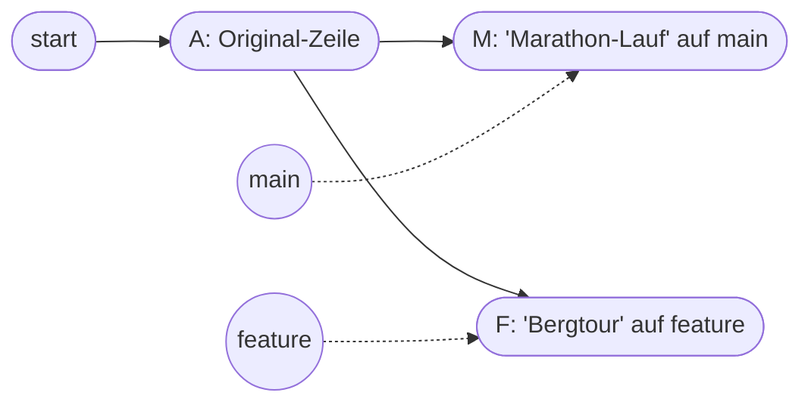

# Praxis 3: Merge-Konflikt lösen

!!! abstract "Ziel"
    In **etwa 30 Minuten** provozierst du absichtlich einen **Merge-Konflikt** und löst ihn sauber auf. Du lernst die Konflikt-Markierungen lesen, entscheidest, welche Version gilt und führst den Merge zu Ende. Dazu siehst du, wie du einen Merge bei Bedarf auch abbrechen kannst.

    Am Ende kannst du:

    - einen **Konflikt absichtlich provozieren** (in einer kontrollierten Umgebung)
    - die **Konflikt-Markierungen** (`<<<<<<<`, `=======`, `>>>>>>>`) lesen
    - eine konfliktbehaftete Datei **manuell oder in VSCode auflösen**
    - den Merge mit einem Commit **abschließen**
    - einen Merge **abbrechen**, falls du noch nicht weißt, wie du den Konflikt auflösen willst
    - die ganze Episode später in `git log` als Merge-Commit nachvollziehen

---

## Voraussetzungen

- Du hast die [Praxis 2](praxis-branches.md) durchgespielt.
- Du hast das Repo `mein-tagebuch` lokal liegen.
- Du arbeitest auf `main`.

Schnellcheck:

```bash
cd ~/mein-tagebuch
git status
```

Erwartet:

```text
On branch main
nothing to commit, working tree clean
```

Sauberer Stand. Los geht's.

---

## Worum es geht

Wir bauen folgende Situation absichtlich nach:



Beide Branches ändern **dieselbe Zeile** in **derselben Datei**. Beim Merge weiß Git nicht, was du willst und fragt dich.

---

## Schritt 1: Den Konflikt-Anker setzen

Auf `main`, mit sauberem Working Tree, legen wir eine Zeile in `README.md` an, die wir gleich auf beiden Branches anders verändern werden.

Öffne die `README.md` und füg eine neue Sektion ans Ende ein:

```markdown
## Heutiges Highlight

Heute habe ich nichts Besonderes gemacht.
```

Speichern. Stagen, committen:

```bash
git add README.md
git commit -m "README: Sektion Heutiges Highlight angelegt"
```

Ausgabe:

```text
[main p7q8r9s] README: Sektion Heutiges Highlight angelegt
 1 file changed, 4 insertions(+)
```

Damit haben wir auf `main` einen klaren Stand, der **beide Branches** als Ausgangspunkt nutzen.

---

## Schritt 2: Auf einem Feature-Branch eine Version anlegen

```bash
git switch -c feature/highlight-bergtour
```

Öffne `README.md`. Ändere die Zeile

```markdown
Heute habe ich nichts Besonderes gemacht.
```

zu

```markdown
Heute war ich auf einer Bergtour. Die Aussicht war atemberaubend.
```

Speichern, committen:

```bash
git add README.md
git commit -m "README: Highlight ist Bergtour"
```

```text
[feature/highlight-bergtour q8r9s0t] README: Highlight ist Bergtour
```

Damit hat der Feature-Branch eine eigene Version dieser Zeile.

---

## Schritt 3: Auf `main` die andere Version anlegen

Zurück auf `main`:

```bash
git switch main
```

Schau in den Editor: die Bergtour-Zeile ist verschwunden, die ursprüngliche „Heute habe ich nichts Besonderes gemacht." ist wieder da. Erwartet, denn auf `main` ist die Bergtour-Änderung noch nicht passiert.

Jetzt ändere dieselbe Zeile auf `main`. Statt der Original-Zeile schreib:

```markdown
Heute habe ich einen Marathon gelaufen. Sehr stolz auf mich.
```

Speichern. Stagen, committen:

```bash
git add README.md
git commit -m "README: Highlight ist Marathon"
```

```text
[main r9s0t1u] README: Highlight ist Marathon
```

Jetzt haben wir die Situation absichtlich aufgebaut: zwei Branches, beide haben dieselbe Zeile in derselben Datei verändert – aber unterschiedlich.

Schauen wir uns das an:

```bash
git log --oneline --all --graph
```

```text
* r9s0t1u (HEAD -> main) README: Highlight ist Marathon
| * q8r9s0t (feature/highlight-bergtour) README: Highlight ist Bergtour
|/
* p7q8r9s README: Sektion Heutiges Highlight angelegt
* ...
```

Genau das Bild. Zwei Linien, die auseinandergegangen sind.

---

## Schritt 4: Merge versuchen – Konflikt!

Wir mergen `feature/highlight-bergtour` in `main`. Du stehst noch auf `main`:

```bash
git merge feature/highlight-bergtour
```

Git zeigt:

```text
Auto-merging README.md
CONFLICT (content): Merge conflict in README.md
Automatic merge failed; fix conflicts and then commit the result.
```

Das **CONFLICT (content)** ist das Signal. Git hat versucht, automatisch zu mergen, ist aber bei dieser Zeile gescheitert. Es hat dir die Aufgabe nicht weggenommen, sondern an dich zurückgegeben.

Schau in den Status:

```bash
git status
```

Ausgabe (gekürzt):

```text
On branch main
You have unmerged paths.
  (fix conflicts and run "git commit")
  (use "git merge --abort" to abort the merge)

Unmerged paths:
  (use "git add <file>..." to mark resolution)
        both modified:   README.md

no changes added to commit (use "git add" and/or "git commit -a")
```

Git sagt dir alles:

- Es gibt **unmerged paths**, also Dateien mit Konflikt.
- `README.md` wurde in **beiden** Branches geändert.
- Du hast zwei Optionen: **lösen** (siehe gleich) oder **abbrechen** mit `git merge --abort`.

---

## Schritt 5: Die Konflikt-Markierungen lesen

Öffne `README.md` im Editor. Du siehst:

```markdown
# Mein Tagebuch

Hier sammle ich kleine Einträge.

Ein neuer Eintrag pro Tag, manchmal auch zwei.

## Inhalt

- 21. Mai 2026 – Git gelernt

## Heutiges Highlight

<<<<<<< HEAD
Heute habe ich einen Marathon gelaufen. Sehr stolz auf mich.
=======
Heute war ich auf einer Bergtour. Die Aussicht war atemberaubend.
>>>>>>> feature/highlight-bergtour
```

Das sind die Konflikt-Markierungen. Jede Sektion bedeutet:

| Marker | Bedeutung |
|--------|-----------|
| `<<<<<<< HEAD` | Hier beginnt die Version aus deinem **aktuellen** Branch (`HEAD` = `main`). |
| `=======` | Trennlinie. |
| `>>>>>>> feature/highlight-bergtour` | Bis hierhin die Version aus dem **anderen** Branch. |

Deine Aufgabe als Mensch:

1. Entscheide, welche Version gelten soll – oder schreib eine dritte, die beide kombiniert.
2. Entferne die drei Marker-Linien (`<<<<<<<`, `=======`, `>>>>>>>`).
3. Speichere die Datei.

---

## Schritt 6: Den Konflikt auflösen (Variante A: Eine Version gewinnt)

Angenommen, du willst nur den Marathon behalten. Lösch die Bergtour-Sektion und alle drei Marker-Linien. Die Datei soll am Ende so aussehen:

```markdown
# Mein Tagebuch

Hier sammle ich kleine Einträge.

Ein neuer Eintrag pro Tag, manchmal auch zwei.

## Inhalt

- 21. Mai 2026 – Git gelernt

## Heutiges Highlight

Heute habe ich einen Marathon gelaufen. Sehr stolz auf mich.
```

Speichern.

??? tip "In VSCode geht das schöner"
    VSCode zeigt direkt über den Konfliktblöcken eine Mini-Toolbar mit:

    - **Accept Current Change** – behält die `HEAD`-Version
    - **Accept Incoming Change** – behält die andere Version
    - **Accept Both Changes** – setzt beide Versionen nacheinander ein
    - **Compare Changes** – öffnet einen Diff

    Ein Klick reicht, die Marker werden automatisch entfernt. Spar dir die Marker-Akrobatik, wenn VSCode da ist.

---

## Schritt 7: Den Konflikt als gelöst markieren

Git weiß noch nicht, dass du fertig bist. Du musst ihm das sagen. Erste Sache: die Datei als „gelöst" markieren, indem du sie stagest.

```bash
git add README.md
git status
```

Ausgabe:

```text
On branch main
All conflicts fixed but you are still merging.
  (use "git commit" to conclude merge)

Changes to be committed:
        modified:   README.md
```

Lies das genau:

- **All conflicts fixed** – Git ist zufrieden, die Marker sind weg.
- **but you are still merging** – Git wartet noch auf deinen Merge-Abschluss-Commit.

---

## Schritt 8: Merge-Commit anlegen

```bash
git commit
```

Git öffnet einen Editor mit einer vorbereiteten Message:

```text
Merge branch 'feature/highlight-bergtour'

# Conflicts:
#       README.md
#
# It looks like you may be committing a merge.
# If this is not correct, please run
#       git merge --abort
# ...
```

Du kannst die Message lassen, wie sie ist. Speichern, Editor schließen.

Ausgabe:

```text
[main s0t1u2v] Merge branch 'feature/highlight-bergtour'
```

Geschafft. Der Merge ist durch.

Schauen wir uns das Ergebnis an:

```bash
git log --oneline --graph
```

```text
*   s0t1u2v (HEAD -> main) Merge branch 'feature/highlight-bergtour'
|\
| * q8r9s0t README: Highlight ist Bergtour
* | r9s0t1u README: Highlight ist Marathon
|/
* p7q8r9s README: Sektion Heutiges Highlight angelegt
* ...
```

Der Merge-Commit ist sichtbar. Und – ganz wichtig: **die Bergtour-Version ist nicht verloren.** Sie steht als Commit `q8r9s0t` für immer in der Historie. Du hast sie nur **nicht in deinen finalen Zustand übernommen**. Wer später in den Branch `feature/highlight-bergtour` schaut, findet sie unverändert.

---

## Schritt 9: Feature-Branch aufräumen

```bash
git branch -d feature/highlight-bergtour
```

```text
Deleted branch feature/highlight-bergtour (was q8r9s0t).
```

---

## Variante B: Beide Versionen kombinieren

Spielen wir das Szenario einmal anders durch. Diesmal kombinierst du beide Versionen. Erstmal Setup wiederholen:

```bash
git switch -c feature/highlight-doppelt
```

Öffne `README.md` und ändere die Highlight-Zeile:

```markdown
Heute war ich auf einer Bergtour. Die Aussicht war atemberaubend.
```

(Du überschreibst die Marathon-Zeile auf diesem Branch wieder. Das ist okay, wir sind ja auf einem anderen Branch.)

Speichern, committen:

```bash
git add README.md
git commit -m "README: Highlight zurück auf Bergtour"
```

Zurück auf `main` und dort etwas anderes für die Zeile:

```bash
git switch main
```

Ändere auf `main` die Highlight-Zeile zu:

```markdown
Heute habe ich einen 5-km-Lauf absolviert. Stolz, aber müde.
```

Stagen, committen:

```bash
git add README.md
git commit -m "README: Highlight 5-km-Lauf"
```

Merge:

```bash
git merge feature/highlight-doppelt
```

```text
CONFLICT (content): Merge conflict in README.md
```

Diesmal löst du den Konflikt anders. Öffne `README.md`. Der Block sieht jetzt so aus:

```markdown
## Heutiges Highlight

<<<<<<< HEAD
Heute habe ich einen 5-km-Lauf absolviert. Stolz, aber müde.
=======
Heute war ich auf einer Bergtour. Die Aussicht war atemberaubend.
>>>>>>> feature/highlight-doppelt
```

Statt eine Version zu wählen, kombinier sie. Schreib zum Beispiel:

```markdown
## Heutiges Highlight

Doppel-Highlight: morgens ein 5-km-Lauf, nachmittags eine Bergtour. Müder Held.
```

Speichern. Stagen und Merge-Commit:

```bash
git add README.md
git commit
```

(Editor öffnet sich, Default-Message lassen, speichern, schließen.)

```bash
git log --oneline --graph
```

```text
*   t1u2v3w (HEAD -> main) Merge branch 'feature/highlight-doppelt'
|\
| * u2v3w4x README: Highlight zurück auf Bergtour
* | v3w4x5y README: Highlight 5-km-Lauf
|/
*   s0t1u2v Merge branch 'feature/highlight-bergtour'
...
```

Du hast jetzt zwei Merge-Konflikte hintereinander gelöst – einmal eine Variante gewinnt, einmal kombiniert.

Aufräumen:

```bash
git branch -d feature/highlight-doppelt
```

---

## Variante C: Den Merge abbrechen

Manchmal startest du einen Merge und merkst dann, dass du dich nicht in der Lage fühlst, ihn jetzt sauber zu lösen. Du willst zurück zum Stand davor, **als hätte der Merge nie stattgefunden**.

Bauen wir das Szenario nach:

```bash
git switch -c feature/abbruch
```

In `README.md` die Highlight-Zeile auf irgendetwas ändern, z.B.:

```markdown
Heute habe ich Bücher gelesen.
```

Stagen, committen:

```bash
git add README.md
git commit -m "README: Highlight Bücher"
```

Zurück auf `main` und dort dieselbe Zeile anders ändern:

```bash
git switch main
```

```markdown
Heute habe ich Kuchen gebacken.
```

Stagen, committen:

```bash
git add README.md
git commit -m "README: Highlight Kuchen"
```

Merge versuchen:

```bash
git merge feature/abbruch
```

```text
CONFLICT (content): Merge conflict in README.md
```

Statt zu lösen, brichst du ab:

```bash
git merge --abort
```

Status checken:

```bash
git status
```

```text
On branch main
nothing to commit, working tree clean
```

Sauber, als wäre nie etwas passiert. Die Konflikt-Markierungen sind aus der Datei verschwunden, der Working Tree ist wieder im Zustand vor dem `git merge`.

Aufräumen:

```bash
git branch -d feature/abbruch
```

(Wenn Git sagt „nicht gemergt", nimm `-D` mit Großbuchstaben. Bewusst und ohne Reue: der Branch enthält ja nur eine Übungs-Änderung, die du nicht brauchst.)

```bash
git branch -D feature/abbruch
```

---

## Wichtige Befehle dieser Praxis

| Befehl | Zweck |
|--------|-------|
| `git merge <branch>` | Branch in den aktuellen mergen, evtl. Konflikt |
| `git status` | Während eines Konflikts: zeigt die betroffenen Dateien |
| `git add <datei>` | Datei nach manueller Auflösung als „gelöst" markieren |
| `git commit` | Merge abschließen (mit vorbereiteter Default-Message) |
| `git merge --abort` | Merge komplett abbrechen, alles zurück auf vor `git merge` |
| `git log --oneline --graph` | sehen, wie die Merges in der Historie aussehen |

---

## Was du jetzt verstanden hast

- Ein Konflikt ist **kein Bug**. Er bedeutet nur: zwei Stellen sind unterschiedlich geändert worden.
- Git markiert die konkurrierenden Zeilen mit **`<<<<<<<`, `=======`, `>>>>>>>`** und überlässt die Entscheidung dir.
- Nach der manuellen Auflösung musst du die Datei **stagen** (`git add`) und einen Commit erzeugen.
- Bei Unsicherheit kannst du den Merge mit **`git merge --abort`** komplett zurücknehmen.
- Egal, welche Version du in den finalen Stand übernimmst – die andere Version bleibt als Commit auf dem Feature-Branch in der Historie erhalten.
- VSCode hat eine eingebaute Konflikt-Toolbar, die viele manuelle Schritte abnimmt.

---

## Häufige Stolperfallen

??? warning "Du hast die Marker `<<<<<<<` versehentlich in der Datei gelassen"
    Das passiert. Beim Commit wirst du es spätestens beim Code-Review merken. Schnell-Fix: Datei öffnen, Marker-Zeilen entfernen, speichern, `git add` + `git commit --amend`.

    Vorbeugen: kurz nach dem Auflösen einmal `git diff --check` ausführen. Das warnt, falls noch Marker übrig sind.

??? warning "Du hast `git commit -m` benutzt und versehentlich die falsche Message rausgeschickt"
    Wenn der Commit gerade erst entstanden ist und noch nicht gepusht ist, kannst du die Message korrigieren:

    ```bash
    git commit --amend -m "Korrekte Message"
    ```

??? danger "Du hast den Konflikt aufgelöst, aber `git add` vergessen"
    Beim `git commit` motzt Git, dass es noch unmerged paths gibt. Schnell-Fix:

    ```bash
    git status                  # zeigt, welche Datei noch fehlt
    git add <datei>
    git commit
    ```

??? info "Mehrere Dateien mit Konflikten"
    Bei größeren Merges können fünf, zehn oder mehr Dateien Konflikte haben. Vorgehen ist dasselbe: pro Datei öffnen, Marker bearbeiten, `git add`. Wenn alle gestaged sind, einmal `git commit`. `git status` führt dich Stück für Stück durch.

---

## Merksatz

!!! success "Merksatz"
    > **Konflikt = Git fragt dich, was gilt. Marker entfernen, gewünschte Version hinschreiben, `git add`, `git commit`. Im Zweifel mit `git merge --abort` zurück auf Anfang. Konflikte sind normal, nicht peinlich.**

---

## Weiterlesen

- [Praxis 4: Repo auf GitHub erstellen und klonen](praxis-github-neu.md): jetzt geht's ins Netz
- [Stolpersteine](stolpersteine.md): wenn Merge-Sachen klemmen
- [Gruppenübung 1: Merge-Konflikt im Team lösen](gruppen-uebung.md): in einer echten Mehr-Personen-Situation einen Konflikt provozieren und lösen
