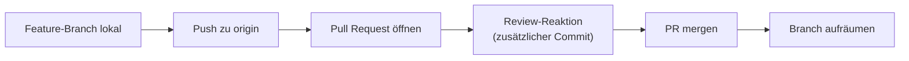

# Praxis 6: Pull Request über Branch

!!! abstract "Ziel"
    In **etwa 35 Minuten** durchlaufst du den Workflow, der in den meisten echten Teams gilt: Feature-Branch lokal anlegen, pushen, auf GitHub einen **Pull Request** öffnen, eine Review-Reaktion einarbeiten, mergen und Branch sauber aufräumen.

    Am Ende kannst du:

    - einen Branch lokal anlegen und mit **`git push -u`** zum Remote schieben
    - einen **Pull Request** auf GitHub öffnen, Titel und Beschreibung schreiben
    - eine **Review-Anmerkung** als zusätzlichen Commit beantworten
    - den PR **mergen** und die richtige Merge-Strategie auswählen
    - den Feature-Branch **lokal und remote löschen**
    - die Änderung mit **`git pull`** in deinen lokalen `main` holen

---

## Voraussetzungen

- Du hast die [Praxis 4](praxis-github-neu.md) durchgespielt und das Repo `mein-erstes-remote-repo` ist auf GitHub und lokal noch verfügbar.
- Du arbeitest lokal auf `main` und bist mit `git status` „up to date with `origin/main`".

Schnellcheck:

```bash
cd ~/mein-erstes-remote-repo
git status
git log --oneline
```

`up to date with 'origin/main'` und ein paar Commits in der Historie. Wenn du wirklich frisch starten willst, ist das genauso okay: Repo neu anlegen wie in [Praxis 4](praxis-github-neu.md#schritt-1-neues-repo-auf-github-anlegen), klonen, einmal `git status`.

---

## Was wir bauen

Du arbeitest an einer Funktion auf einem Feature-Branch, pusht ihn, öffnest einen Pull Request, bekommst (simuliert) ein Review und mergst den PR.



---

## Schritt 1: Feature-Branch lokal anlegen

Wir nehmen an, du willst eine Lizenz-Sektion in der README ergänzen.

```bash
git switch -c docs/lizenz-abschnitt
```

```text
Switched to a new branch 'docs/lizenz-abschnitt'
```

Öffne `README.md` und füge ans Ende eine neue Sektion an:

```markdown
## Lizenz

Dieses Übungs-Repo ist öffentlich verfügbar. Du darfst es frei nutzen.
```

Speichern, stagen, committen:

```bash
git add README.md
git commit -m "README: Lizenz-Abschnitt ergänzen"
```

```text
[docs/lizenz-abschnitt p7q8r9s] README: Lizenz-Abschnitt ergänzen
```

```bash
git log --oneline
```

```text
p7q8r9s (HEAD -> docs/lizenz-abschnitt) README: Lizenz-Abschnitt ergänzen
... (vorige Commits)
```

Lokal ist alles bereit.

---

## Schritt 2: Feature-Branch zum Remote pushen

Der Branch existiert bisher nur lokal. Auf dem Remote weiß niemand davon.

```bash
git push -u origin docs/lizenz-abschnitt
```

Erwartete Ausgabe:

```text
Enumerating objects: 5, done.
...
To https://github.com/<DEIN-USERNAME>/mein-erstes-remote-repo.git
 * [new branch]      docs/lizenz-abschnitt -> docs/lizenz-abschnitt
branch 'docs/lizenz-abschnitt' set up to track 'origin/docs/lizenz-abschnitt'.
```

Wichtig: das **`-u`** sagt Git, dass du auch das Tracking-Verhältnis möchtest. Bei späteren Pushs reicht ein einfaches `git push`. Ohne `-u` würde Git beim ersten Push meckern, dass es keinen Upstream-Branch findet.

!!! info "Schon mal ohne `-u` gepusht? Nachträglich setzen"
    Du kannst das Tracking auch nachträglich setzen:

    ```bash
    git push -u origin docs/lizenz-abschnitt
    ```

    Der Effekt ist derselbe.

Im Browser zu deinem Repo auf GitHub. Du siehst oben einen gelben Hinweis:

```text
docs/lizenz-abschnitt had recent pushes less than a minute ago
Compare & pull request
```

GitHub bietet dir den PR auf dem Silbertablett an. Klick **Compare & pull request**.

---

## Schritt 3: Pull Request öffnen

Du landest auf einer Seite, die dir den Diff zeigt und ein Formular bietet.

| Feld | Was du eintragen solltest |
|------|---------------------------|
| **Title** | Eine knappe Beschreibung, was der PR ändert. Z.B. `Lizenz-Abschnitt zur README ergänzen` |
| **Description** | Mehr Details: was genau, warum, Auswirkungen, evtl. Screenshots. Bei größeren PRs Pflicht. Bei kleinen darf es leer bleiben oder kurz sein. |

Schreib in die Description:

```markdown
Ergänzt einen kurzen Lizenz-Hinweis in der README, damit klar ist, dass das Repo frei nutzbar ist.

Closes #42 (wenn es ein Issue gäbe)
```

Die Zeile `Closes #42` ist nur Demo – sie würde, wenn es ein passendes Issue gäbe, beim Merge das Issue automatisch schließen. Bei dir gibt es kein Issue Nr. 42, also lass den Test stehen oder lass die Zeile weg.

Unten rechts ist der grüne Knopf **Create pull request**. Klick drauf.

Du landest auf der **PR-Seite**. Dort siehst du:

- **Diskussion** (Top-Tab) – der Hauptraum.
- **Commits** – alle Commits, die im Branch sind.
- **Files changed** – die Diff-Übersicht (der eigentliche Code/Text).
- **Checks** – CI-Status (bei uns: keine, daher leer).
- **Diff** mit roten und grünen Zeilen.

Glückwunsch, du hast deinen ersten Pull Request offen.

---

## Schritt 4: Selbst-Review (mit Augenzwinkern)

In einem Team würde jetzt jemand anderes über den PR drüberschauen, vielleicht Kommentare lassen, etwas zur Diskussion stellen. Da wir alleine arbeiten, simulieren wir das. Wir stellen uns vor, ein Reviewer hat gesagt:

> „Schöner Anfang. Schreib bitte noch dazu, wo das Repo entstanden ist."

Du gehst zurück ins Terminal. **Wichtig: du bist immer noch auf dem Feature-Branch.**

```bash
git status
```

```text
On branch docs/lizenz-abschnitt
Your branch is up to date with 'origin/docs/lizenz-abschnitt'.

nothing to commit, working tree clean
```

Bearbeite `README.md` und ergänze in der Lizenz-Sektion:

```markdown
## Lizenz

Dieses Übungs-Repo ist öffentlich verfügbar. Du darfst es frei nutzen.
Entstanden im Rahmen des Git-Blocks bei jacob-decoded.de.
```

Speichern, stagen, committen:

```bash
git add README.md
git commit -m "README: Herkunft des Repos ergänzen"
```

Push, diesmal ohne `-u` (das Tracking ist schon gesetzt):

```bash
git push
```

Ausgabe:

```text
...
   p7q8r9s..q8r9s0t  docs/lizenz-abschnitt -> docs/lizenz-abschnitt
```

Zurück auf GitHub. Reload des PR-Tabs. Du siehst:

- Ein **zweiter Commit** ist im PR aufgetaucht.
- Im **Files changed**-Tab zeigt der Diff jetzt beide Änderungen.

Genau so reagierst du im echten Leben auf Review-Kommentare: **zusätzlicher Commit auf demselben Branch, Push, Diskussion fortsetzen**.

!!! tip "Reviews auf GitHub: was du sehen wirst"
    Im PR-Tab **Files changed** kannst du auf eine Zeile klicken und einen Kommentar schreiben. Reviewer machen das oft. Auf einen Reviewer-Kommentar antwortest du entweder mit einem weiteren Kommentar oder mit einem neuen Commit, der die Anmerkung umsetzt.

    Größere Teams arbeiten mit **„Request changes"**, **„Approve"**, **„Comment"**-Buttons im Review-Bereich. „Approve" ist meistens die Bedingung, dass der PR gemergt werden darf.

---

## Schritt 5: PR mergen

Du bist mit dem Stand zufrieden. Zeit zu mergen.

Im PR-Tab den grünen Knopf **Merge pull request** klicken. Es erscheint ein kleines Dropdown mit drei Optionen:

| Option | Was passiert |
|--------|--------------|
| **Create a merge commit** | Standard. Ein Merge-Commit wird angelegt, der beide Linien zusammenführt. Die Branch-History bleibt sichtbar. |
| **Squash and merge** | Alle Commits des Branches werden zu **einem einzigen Commit** zusammengefasst, der dann auf `main` landet. Saubere lineare Geschichte, Branch-Details verschwinden. |
| **Rebase and merge** | Die Commits werden einzeln auf `main` neu angesetzt. Linear, aber alle Original-Commits sind erhalten. |

!!! info "Welche Option ist die richtige?"
    - **Create a merge commit** – Standard. Wenn du dir unsicher bist, nimm das.
    - **Squash and merge** – beliebt bei Teams, die jeden PR als „eine logische Änderung" auf `main` sehen wollen. Verliert die einzelnen Schritte.
    - **Rebase and merge** – wenn du eine lineare Historie ohne Merge-Commits willst, aber die Einzel-Commits erhalten möchtest. Praktisch, aber schreibt die Commit-Hashes um, was bei schon-pushedlern manchmal Verwirrung bringt.

    Für diese Übung: nimm **Create a merge commit**.

Klick auf **Create a merge commit**. GitHub fragt nach Bestätigung:

```text
Merge pull request #1 from <DEIN-USERNAME>/docs/lizenz-abschnitt
```

Mit **Confirm merge** bestätigen. Sekunden später erscheint:

```text
Pull request successfully merged and closed
```

Plus ein Hinweis-Knopf:

```text
Delete branch
```

Damit könntest du den Feature-Branch direkt **auf dem Remote** löschen. Mach das jetzt: **Delete branch** klicken. Der Branch verschwindet vom Remote.

!!! tip "Branch nach Merge löschen ist Best Practice"
    Wenn der Feature-Branch gemergt ist, hat er seinen Zweck erfüllt. Ungelöschte Branches sammeln sich an und werden unübersichtlich. GitHub bietet in den Repo-Settings unter **Settings → General → Pull Requests** eine Option **„Automatically delete head branches"** an, die das nach jedem Merge automatisch macht.

---

## Schritt 6: Lokalen Stand aktualisieren

Du bist immer noch lokal auf `docs/lizenz-abschnitt`. Auf `main` weißt du nichts von dem Merge.

```bash
git switch main
```

```text
Switched to branch 'main'
Your branch is up to date with 'origin/main'.
```

Halt – Git denkt, dein `main` sei aktuell. Das ist veraltete Info. Git weiß nicht, dass auf dem Remote zwei neue Commits dazugekommen sind (dein PR + der Merge-Commit). Fetchen und mergen:

```bash
git pull
```

Ausgabe:

```text
remote: Enumerating objects: 1, done.
...
From https://github.com/<DEIN-USERNAME>/mein-erstes-remote-repo
   d4e5f6g..r9s0t1u  main       -> origin/main
Updating d4e5f6g..r9s0t1u
Fast-forward
 README.md | 5 +++++
 1 file changed, 5 insertions(+)
```

Lokal:

```bash
git log --oneline --graph
```

```text
*   r9s0t1u (HEAD -> main, origin/main) Merge pull request #1 from <DEIN-USERNAME>/docs/lizenz-abschnitt
|\
| * q8r9s0t README: Herkunft des Repos ergänzen
| * p7q8r9s README: Lizenz-Abschnitt ergänzen
|/
* d4e5f6g (vorige Commits...)
```

Da ist der Merge-Commit, der von GitHub angelegt wurde. Beide Branches (`HEAD`, `origin/main`) zeigen auf ihn.

---

## Schritt 7: Lokalen Feature-Branch aufräumen

Der Feature-Branch ist auf dem Remote gelöscht, aber lokal lebt er noch.

```bash
git branch
```

```text
  docs/lizenz-abschnitt
* main
```

Lokal löschen:

```bash
git branch -d docs/lizenz-abschnitt
```

```text
Deleted branch docs/lizenz-abschnitt (was q8r9s0t).
```

!!! info "Tracking-Branch aufräumen"
    Es gibt noch eine veraltete Referenz auf den entfernten Remote-Branch. Du siehst sie mit:

    ```bash
    git branch -r
    ```

    Falls dort noch `origin/docs/lizenz-abschnitt` steht, räumst du das auf mit:

    ```bash
    git fetch --prune
    ```

    Das löscht alle lokalen Tracking-Branches, deren Remote-Gegenstück weg ist. Optional, aber sauber.

Letzter Check:

```bash
git branch
```

```text
* main
```

Aufgeräumt.

---

## Was du jetzt geschafft hast

Du hast einen kompletten **Feature-Branch-Workflow** durchlaufen, der so in Tausenden Open-Source-Projekten und Firmen jeden Tag stattfindet:

1. Auf `main` stehen, sauberen Stand sicherstellen.
2. Branch lokal mit `git switch -c <name>` anlegen.
3. Arbeiten, commiten.
4. Branch mit `git push -u origin <name>` hochschieben.
5. Auf GitHub Pull Request öffnen.
6. Falls Review-Kommentare kommen: zusätzlicher Commit auf dem Branch, push.
7. Wenn alle einverstanden: PR auf GitHub mergen.
8. Branch auf GitHub löschen.
9. Lokal `git pull` auf `main`, dann lokalen Branch löschen mit `git branch -d`.

Das ist der gesamte Flow. Jeden Tag, jedes Feature.

---

## Bonus-Variante: Branch direkt auf GitHub anlegen

Du kannst einen Branch auch direkt im Browser anlegen, ohne lokales `git switch`. Auf der Repo-Hauptseite gibt es links oben einen Branch-Selector („main"). Drauf klicken, im Eingabefeld einen neuen Namen eingeben, dann **„Create branch …"** klicken. Der Branch existiert sofort auf dem Remote.

Lokal holst du ihn dann mit:

```bash
git fetch
git switch <neuer-branch>
```

Das ist praktisch, wenn du anders organisiert bist oder den Workflow nur über die Weboberfläche fahren willst. Lokal-zuerst-zuerst ist aber meistens flüssiger.

---

## Wichtige Befehle dieser Praxis

| Befehl | Zweck |
|--------|-------|
| `git switch -c <name>` | neuer Branch + Wechsel |
| `git push -u origin <name>` | Branch zum Remote schieben **und** Tracking setzen |
| `git push` | folgende Pushs nach `-u` |
| `git pull` | nach dem PR-Merge auf `main` lokal aktualisieren |
| `git branch -d <name>` | lokalen Branch löschen, wenn er gemergt ist |
| `git fetch --prune` | lokale Tracking-Branches aufräumen, deren Remote weg ist |
| `git branch -r` | alle Remote-Branches anzeigen, die dein lokaler Klon kennt |

---

## Was du jetzt verstanden hast

- Ein **Pull Request** ist kein Git-Befehl. Er ist ein Werkzeug der Plattform (GitHub, GitLab, …).
- Der typische Workflow: Branch lokal anlegen, pushen, PR öffnen, mergen, aufräumen.
- Auf Review-Kommentare reagiert man mit **zusätzlichen Commits**, nicht mit neuen PRs.
- Die drei **Merge-Strategien** auf GitHub (Merge-Commit, Squash, Rebase) sind unterschiedliche Geschmacksrichtungen für dieselbe Aufgabe.
- Nach dem Merge **immer aufräumen**: Branch auf dem Remote, lokalen Branch, evtl. Tracking-Branches.

---

## Häufige Stolperfallen

??? warning "PR-Knopf taucht nicht auf"
    Der Knopf erscheint erst, wenn ein **neuer Branch** zum Remote gepusht ist und sich vom Default-Branch unterscheidet. Wenn du nichts siehst:

    1. Im Repo links oben auf den Branch-Selector klicken.
    2. Deinen Feature-Branch wählen.
    3. Oben rechts erscheint nun **„Compare & pull request"** oder du gehst direkt auf den Tab **Pull requests** und klickst **New pull request**.

??? warning "PR ist offen, aber mergen geht nicht („checks failing", „resolve conflicts")"
    - Falls **Checks** rot sind: in Repos mit CI/CD blockt der rote Status oft den Merge. Lösung: die Pipeline reparieren, neuer Push, dann nochmal versuchen.
    - Falls **Conflicts** angezeigt werden: GitHub bietet manchmal einen Web-Konfliktlöser direkt im PR an. Alternativ lokal: auf den Feature-Branch wechseln, `git pull origin main`, Konflikt lösen, pushen.

??? warning "Du hast direkt auf `main` committed statt auf einem Branch"
    Wenn der Commit lokal ist und du noch nicht gepusht hast:

    ```bash
    git switch -c feature/spaeter-doch-branch
    git switch main
    git reset --hard origin/main
    git switch feature/spaeter-doch-branch
    ```

    Damit ist dein direkt-auf-main-Commit jetzt auf einem Feature-Branch und `main` ist wieder im Remote-Zustand. **Vorsicht** vor `git reset --hard`, wenn andere Änderungen drauf liegen.

??? info "PR über Forks (Open-Source-Standard)"
    Bei Open-Source-Projekten machst du oft Folgendes: das Repo **forken** (eigenen Klon auf GitHub bekommen), dort den Feature-Branch erstellen, PR vom Fork zurück ins Original eröffnen.

    Workflow:

    1. Auf dem Original-Repo oben rechts **Fork**.
    2. Den Fork klonen.
    3. Branch, Commits, Push, PR.

    Im PR-Formular wählt GitHub automatisch das Original-Repo als Ziel. Im Übrigen identisch zum Standard-Flow.

---

## Merksatz

!!! success "Merksatz"
    > **Branch lokal, Commits, `git push -u origin <branch>`. Auf GitHub Pull Request öffnen, ggf. Review-Kommentare mit weiteren Commits beantworten, mergen, Branch aufräumen – lokal und remote. Das ist der tägliche Team-Workflow.**

---

## Weiterlesen

- [Übungen](uebungen.md): vier Schwierigkeitsstufen, die auf dieser Praxis aufbauen
- [Gruppenübung 1: Merge-Konflikt im Team lösen](gruppen-uebung.md): denselben Workflow zu dritt oder viert, mit gewolltem Konflikt
- [Gruppenübung 2: Feature-Workflow im Team](praxis-team-workflow.md): den sauberen Workflow zu viert oder fünft erleben
- [Stolpersteine](stolpersteine.md): wenn der PR-Workflow klemmt
